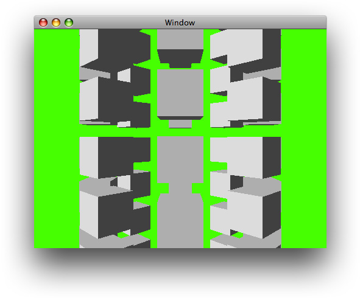

> 导航：[总目录](../../../README.md) · [documentation](../../../_indexes/documentation.md) · [Quartz Composer Programming Guide](Introduction%20to%20Quartz%20Composer%20Programming%20Guide.md)

[Next](Publishing%20Ports%20and%20Binding%20Them%20to%20Controls.md)[Previous](Introduction%20to%20Quartz%20Composer%20Programming%20Guide.md)

# Using QCView to Create a Standalone Composition

This chapter shows how to create a standalone Quartz Composer composition using the [QCView](https://developer.apple.com/documentation/quartz/qcview) class. You don’t need to write any code to accomplish this task. You simply create a new Cocoa application, modify the nib file in Interface Builder so that the application window has a [QCView](https://developer.apple.com/documentation/quartz/qcview) in it, and then specify a composition to load. Launching the compiled Cocoa application causes the composition to play automatically.

Follow these steps to create a standalone composition:

1. [Create a Cocoa Application](#apple-f4xwc4dqnrsv64tfmyxwi33df52wszbpkridimbqgaytgnjxfvbuqmrqg4wueqkkjfeugqkf)
2. [Modify the MainMenu.nib File](#apple-f4xwc4dqnrsv64tfmyxwi33df52wszbpkridimbqgaytgnjxfvbuqmrqg4wueqkkizbegrke).
3. [Build the Cocoa Application](#apple-f4xwc4dqnrsv64tfmyxwi33df52wszbpkridimbqgaytgnjxfvbuqmrqg4wueqkkirfeuqkf)

Creating a Cocoa application is easy. You don’t need to write any code, but you do need to include the Quartz framework in the application.

Follow these steps:

1. Launch Xcode.
2. Choose File > New Project.
3. In the New Project window, choose Cocoa Application and click Next.
4. Type a project name and click Finish.

   The Xcode project window opens.
5. Choose Project > Add to Project.
6. Navigate to the `Quartz.framework`, choose it and click Add.

   It’s located in `System/Library/Frameworks/Quartz.framework`. A Cocoa application does not automatically include the framework that contains the Quartz Composer programming interface, which is why you need to add it.
7. Click Add in the Add to Targets sheet that appears.

   The `Quartz.framework` appears in the list of file names on the right side of the project window and in the Groups and Files list on the left side. You may want to drag the `Quartz.framework` into the Frameworks folder in the Groups and Files list so that your project is well-organized.
8. In the Resources folder in the Groups & Files list, double-click MainMenu.nib.

   Interface Builder launches.
9. If the Library is not already open, choose Tools > Library.
10. Click the disclosure triangle next to Library.

    If you don’t see Quartz Composer listed in the Library, go to [Add the Quartz Composer Plug-in](#apple-f4xwc4dqnrsv64tfmyxwi33df52wszbpkridimbqgaytgnjxfvbuqmrqg4wvgvzr).

    If you see Quartz Composer, go to [Modify the MainMenu.nib File](#apple-f4xwc4dqnrsv64tfmyxwi33df52wszbpkridimbqgaytgnjxfvbuqmrqg4wueqkkizbegrke).

To add the Quartz Composer plug-in to the Interface Builder library, follow these steps:

1. Choose Interface Builder > Preferences.
2. In the Preferences pane, click Plug-ins.
3. Click the plus (+) button and navigate to Developer > Extras > Palettes.
4. Choose `QuartzComposer.ibplugin`.
5. Close the Preference pane.

To modify the `MainMenu.nib` file so that it plays a composition, follow these steps:

1. In the Library, choose Quartz Composer.
2. Drag a Quartz Composer View ([QCView](https://developer.apple.com/documentation/quartz/qcview) instance) from the library to the main window. Resize and position the view to suit your application.
3. With the [QCView](https://developer.apple.com/documentation/quartz/qcview) selected, open the Attributes inspector.
4. Click Load and choose a `.qtz` file to associate with the [QCView](https://developer.apple.com/documentation/quartz/qcview). This is the Quartz Composer composition that plays when the application runs.
5. To forward user events, such as mouse clicks, from the view to the composition, click Forward All Events in the Rendering Options. If you forward events, the [QCView](https://developer.apple.com/documentation/quartz/qcview) accepts First Responder status.

   Events must be forwarded for compositions that can respond to user input. For example, if the position of an object depends on the location of the mouse, you need to forward events.
6. Choose File > Simulate Interface to verify that the composition loads and plays.

Now that you’ve loaded a composition in a [QCView](https://developer.apple.com/documentation/quartz/qcview), the “difficult part” of making a standalone composition is over. Follow these steps to complete the process:

1. Switch from Interface Builder to Xcode.
2. In the Xcode project window, click Build & Restart.

   After the project finishes building, a window appears, and you should see your composition playing in it. If you don’t see the composition, but you did see it when you simulated the interface in Interface Builder, then check whether the Quartz framework is added to your Cocoa application. Also check the Xcode run log for any information printed by Quartz Composer.

For more practice making standalone compositions, see [Example: The Dancing Cube Composition](#apple-f4xwc4dqnrsv64tfmyxwi33df52wszbpkridimbqgaytgnjxfvbuqmrqg4wueqkkijbuqqse).

The `Dancing Cubes.qtz` composition (available in the directory `/Developer/Examples/Quartz Composer Compositions/Interactive/`) tracks the mouse and renders a series of cubes based on the mouse position.

To modify a nib file so that it plays the Dancing Cubes composition, follow these steps:

1. Create a Cocoa application and add the Quartz framework to it.

   See [Create a Cocoa Application](#apple-f4xwc4dqnrsv64tfmyxwi33df52wszbpkridimbqgaytgnjxfvbuqmrqg4wueqkkjfeugqkf) for details.
2. Double-click the `MainMenu.nib` file in the Xcode project window.

   This launches Interface Builder with the main application window open.
3. With the window selected, choose Tools > Size Inspector .
4. In the Inspector, set the Content Size to 640 and the height to 480.
5. Drag a Quartz Composer View ([QCView](https://developer.apple.com/documentation/quartz/qcview) instance) from the Quartz Composer objects in the Library to the main window. Then resize the view to fill the window.
6. With the [QCView](https://developer.apple.com/documentation/quartz/qcview) selected, choose Tools > Size Inspector.
7. Click the inside set of lines in Autosizing so they appear as solid red lines.

   You’ll see that the red box in the Autosizing animation grows as the containing window grows, which is the behavior you want for the view. (The red box represents the view.)
8. Choose Tools > Attributes.,
9. Click Load.
10. Choose `Dancing Cubes.qtz` from the directory `/Developer/Examples/Quartz Composer Compositions/Interactive/`, then click Open.
11. Click Forward All Events to make sure the composition receives all mouse events.
12. Choose File > Simulate Interface. The window displays cubes that look similar to those in Figure 1-1.

    __Figure 1-1__  The Dancing Cubes composition

    
13. Quit the interface simulation and save the nib file.
14. Switch to Xcode.
15. Build and Restart the application.

    When the application runs, move the pointer to the window. Then click and hold the mouse button and move the mouse. Cube movements should track the mouse movement when the mouse button is pressed.

- The directory `/Developer/Examples/Quartz Composer Compositions/Interface Builder` contains additional nib files that use `QCView`. Take a look at them to see what other results you can achieve using Interface Builder and Quartz Composer.
- [Publishing Ports and Binding Them to Controls](Publishing%20Ports%20and%20Binding%20Them%20to%20Controls.md#apple-f4xwc4dqnrsv64tfmyxwi33df52wszbpkridimbqgaytgnjxfvbuqmrqhawviucykjcummjqge) describes how to use Cocoa binding to expose input parameters in the user interface of a standalone composition.

[Next](Publishing%20Ports%20and%20Binding%20Them%20to%20Controls.md)[Previous](Introduction%20to%20Quartz%20Composer%20Programming%20Guide.md)

