> 导航：[总目录](../../../README.md) · [documentation](../../../_indexes/documentation.md) · [Quartz Composer User Guide](Introduction%20to%20Quartz%20Composer%20User%20Guide.md)


[Next](Tutorial-%20Creating%20a%20Composition.md)[Previous](The%20Quartz%20Composer%20User%20Interface.md)

# Basic and Advanced Tasks, Tips, and Tricks

This chapter describes how to use the editor to add patches to the workspace and connect them, inspect the values of input and output ports, and publish ports. You’ll learn tips and shortcuts for getting the Quartz Composer development environment supplied in OS X v10.5 to support your working style. You’ll see how to use some of the advanced features including templates and patches that process code.

There are three ways to add a patch from the Patch Creator:

- Press Return to add the patch whose name is selected.
- Double-click a patch name.
- Drag a patch name to the workspace.

To duplicate a patch that’s already in the workspace, select the patch and press Command-D.

Connections between input and output ports of different patches establish a data flow in a composition. Simply click the output port, then click the input port you want to connect—you don’t need to hold down the mouse button while you move to the input port. Note that you can establish a connection only between ports that have compatible types—they must have the same type or a type conversion must be possible.

To break a connection between patches, either double-click the input port or drag the connector and release it. The connector disappears. Figure 3-1 shows some typical connections between patches.

__Figure 3-1__  Patch connections

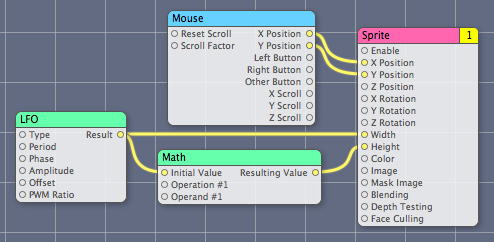

The output from a patch can connect to the input of more than one patch. For example, the Result output port of the LFO patch (Figure 3-1) provides input to the Math patch and to the Sprite patch.

Hover the pointer over a port to view a short description of the port, its data type, and the current value. (See Figure 3-2.) If the input port is not an object port, you can edit the port value by double-clicking the circle associated with the port, entering the new value in the text editor, and then pressing the Return key to validate the value or the Escape key to cancel. Note that input ports have a default value, which is always null for object ports.

__Figure 3-2__  A help tag for an input port

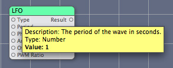

You can also inspect and set the values for input ports by opening the inspector and displaying the Input Parameters pane or by clicking the Patch Parameters button in the editor to toggle the input parameters pane.

You can’t set the value for output ports, but you can view them. Image ports show a thumbnail representation of the image, as shown in Figure 3-3.

__Figure 3-3__  Image ports display a thumbnail image

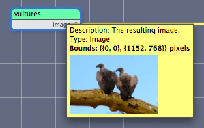

When you select a patch in the Patch Creator, its description appears in the Description pane. But if you are working with a patch in the workspace, you can hover the pointer over the patch title bar to see a help tag that contains the name, category, and patch description, as shown in Figure 3-4.

__Figure 3-4__  The patch description appears in a help tag

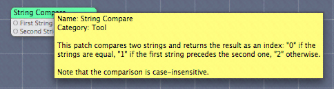

Quartz Composer lets you set preferences for the editor, the workspace, and the viewer, and manage clips. By default, when you launch Quartz Composer it displays templates that you can choose from. If you prefer, you can turn off that option in the General pane of Quartz Composer preferences and choose from among the options shown in Figure 3-5. You can also set whether the editor and viewer are visible when you open a composition and enable autosaving.

__Figure 3-5__  The General pane of Quartz Composer preferences

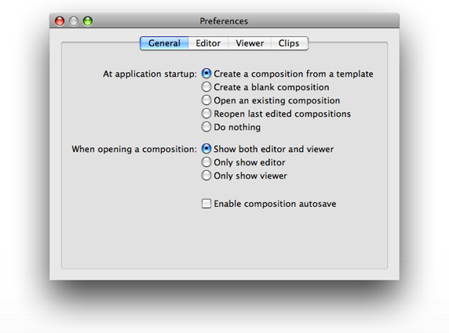

Editor preferences include options that affect the appearance of the workspace (colors, shadows, grid) and the behavior of the Patch Creator.

You can set and define aspect ratios in the Viewer pane. You can also set up options for debugging, full-screen mode, and the rendering frame rate.

The Clips pane lets you remove and edit clips, and view and edit clip information.

Table 3-1 summarizes the keyboard shortcuts for many of the actions available in the editor window.

__Table 3-1__  Shortcuts for common actions in the editor window

| Action | Shortcut |
| Add a note | Control-Click the workspace |
| Fast zoom in or out | Press Command as you use the scroll wheel |
| View all temporarily | Press and hold the = key. When you release the key, the view snaps back. This is a good way to get your bearings in a complex composition. |
| Show the Patch Creator | Command-Return |
| Compare compositions | Option-Command-O |
| Create macro | Shift-Command-M |
| Show hierarchy browser | Command-B |
| Show input parameters | Command-T |
| Create sticky inspector | Command-double-click |
| Show inspector | Command-I |
| Edit information | Option-Command-I |
| Edit protocol conformance | Option-Command-P |
| Customize the toolbar | Command-click the toolbar and chose Customize Toolbar |
| Show viewer | Shift-Command-V |
| Show editor | Shift-Command-E |

Table 3-2 summarizes the keyboard shortcuts for the actions available in the viewer window.

__Table 3-2__  Shortcuts for common actions in the viewer window

| Action | Shortcut |
| Run the viewer | Command-R |
| Stop rendering | Command-. |
| Save snapshot | Shift-Command-C |
| Enable full-screen mode | Command-F |
| Performance rendering mode | Shift-Command-R |
| Debug rendering mode | Shift-Command-D |
| Profile rendering mode | Shift-Command-L |
| Customize the toolbar | Control-click the toolbar and chose Customize Toolbar |

Commenting code is good practice, whether it’s in a program that uses a traditional coding language or in a composition. Quartz Composer provides three items that support comments for all patches:

- The properties list. You can view and change items in this list by choosing Editor > Editor Information.
- The patch title. You can change the default patch title to a more meaningful one for your composition by double-clicking the title.
- Notes. You can add a note to the workspace by Control-clicking an empty area. A note that you can resize and type text into appears. Figure 3-6 show part of a complex composition that uses two notes. You type the text in the opaque area of the note, and the translucent area gives an indication of which patches the note pertains to. Control-click the note to view the contextual menu that lets you set the color. The example in Figure 3-6 shows short notes, but you can enter as much text as you like—several paragraphs or more. The opaque area expands with the amount of text.

  __Figure 3-6__  Two notes used to comment a complex composition

  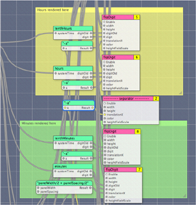

You can provide comments for programming patches directly in patch, along with the code that you provide.

There are several reasons why you might want to compare two compositions. The most typical is to see how two versions of a composition differ. Choosing File > Compare Compositions opens a window that provides several comparison options. You can compare patch connections, parameters, and settings by clicking the appropriate controls at the top right of the window. (See Figure 3-7). You can compare patch parameter views for each composition in the bottom portion of the window.

What’s unique about this window is that you can also compare the compositions visually, and in a variety of interesting ways. In the lower part of the window, you can select an overlay method or whether to view the compositions side by -side. You can also choose to view the patch parameters.

__Figure 3-7__  Comparing compositions

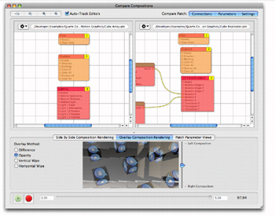

Staring in OS X v10.5, Quartz Composer can provide information on whether a patch is compatible with OS X v10.4. You can also find out whether a patch could compromise security. Security information is important if you plan to embed a composition in a webpage or widget, or export it as a QuickTime movie. Webpages, widgets, and QuickTime movies won’t render compositions that contain unsafe patches. (For more information on embedding compositions in webpages and widgets, see _[Quartz Composer Programming Guide](../Quartz%20Composer%20Programming%20Guide/Introduction%20to%20Quartz%20Composer%20Programming%20Guide.md#apple-f4xwc4dqnrsv64tfmyxwi33df52wszbpkridimbqgaytgnjx)_.)

To check the compatibility of patches in a composition, choose Editor > Display 10.4 Compatibility Information. Patches that are not compatible with OS X v10.4 display a small red icon with a white “x”. Patches that display a yellow icon with an exclamation point identify patches that might not be compatible because the patch was revised in some way, such as with additional input ports or changed settings. If you hover the pointer over the small icon, the tool tip for the patch provides more information about compatibility, such as what’s changed or that the patch is new.

To check whether any patches in a composition are unsafe, choose Editor > Indicate Unsafe Patches. Patches that are not safe display a small key icon.

Figure 3-8 shows a variety of patches after choosing the compatibility and unsafe patches commands. The Image Importer shows a caution icon because the latest version has an additional setting that is not available in OS X v10.4. The Area Histogram and Grep patches are new in OS X v10.5. The Parallelogram Tile patch does not display any icons because it is compatible with OS X v10.4 and it is a secure patch. The Bonjour and MIDI Clock Receiver patches are unsafe patches. Note that the MIDI Clock Receiver patch also has a caution icon because its settings changed since OS X v10.4.

__Figure 3-8__  Compatibility and security information

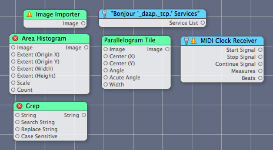

To reduce execution time and improve rendering performance:

- Limit image size to the dimensions you need.
- Don’t use RGBA images for masks.
- Make sure that the Render In Image patch is configured appropriately. The information in the Settings pane of the Patch inspector can help you choose the appropriate settings.
- Set the Enable input of consumer patches to `false` whenever possible.
- While in debug mode, minimize the number of patches that you use.
- Don’t draw unnecessarily. For example, don’t draw 200 sprites when 50 would suffice.
- Design your composition to adapt to hardware features.
- If you intend for your composition to run on a variety of hardware, you might want to avoid Core Image effects. These effects perform best when Core Image uses the GPU. The CPU fallback, if needed, can cause your composition to render less optimally.

If you find yourself assembling and connecting the same set of patches repeatedly, you may want to create a clip.

Follow these steps to add a clip to the Patch Creator:

1. In the editor window of your composition, select the set of patches that you want to create a clip from.
2. Choose Editor > Create Clip.
3. Enter the clip name into the sheet that appears, along with copyright information and a description.
4. Click Done.

Your new clip is now available in the Patch Creator. The name you entered in step 3 shows in the Patch Name list and the description shows in the Description box.

A template is a handy way to start from a preconfigured composition.

To make a composition available as a reusable template from within Quartz Composer, copy the composition file to this directory:

- `/Developer/Library/Quartz Composer/Templates`

To use the template later, choose File > New From Template.

Quartz Composer provides a number of templates that conform to protocols (see [Composition Repository](Quartz%20Composer%20Basic%20Concepts.md#apple-f4xwc4dqnrsv64tfmyxwi33df52wszbpkridimbqga2tgobrfvbuqmrrgiwvgvzrgi)). The templates you create are not required to conform to a protocol unless you want compositions created with your template to reside in the composition repository.

Although you can use Quartz Composer to create powerful motion graphics without any code, the ability to write code within programming patches provides additional flexibility for Core Image, JavaScript, and OpenGL programmers.

The Core Image Filter programming patch is extremely useful for creating custom image processing filters. To use this patch effectively, you need to understand Core Image filters and be familiar with the Core Image kernel language, which is an extension to the OpenGL Shading Language. Two good sources of information on writing Core Image filters are _[Core Image Programming Guide](../Core%20Image%20Programming%20Guide/About%20Core%20Image.md#apple-f4xwc4dqnrsv64tfmyxwi33df52wszbpkridgmbqgaytcobv)_ and _[Core Image Kernel Language Reference](../Core%20Image%20Kernel%20Language%20Reference/Introduction.md#apple-f4xwc4dqnrsv64tfmyxwi33df52wszbpkridimbqga2dgojx)_. _[Image Unit Tutorial](../Image%20Unit%20Tutorial/Introduction.md#apple-f4xwc4dqnrsv64tfmyxwi33df52wszbpkridimbqga2dkmzr)_ provides additional details on writing kernel routines and contains several kernel examples.

Figure 3-9 shows the Settings window for the Core Image Filter programming patch. You enter code for a kernel directly into this window. You can provide more than one kernel routine if you like, but it must be written using the Core Image Kernel Language.

__Figure 3-9__  The Settings window for the Core Image Filter patch

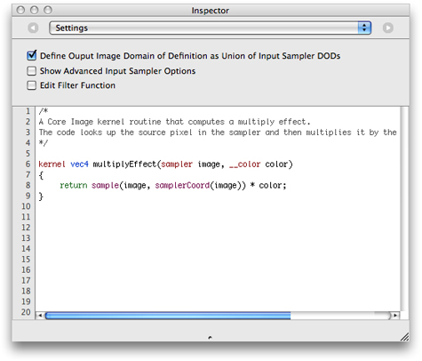

Quartz Composer automatically creates input ports for the patch based on the prototype of the kernel function that you supply in this window. Kernel input parameters whose type are `float`,`vec2`, `vec3`, and `vec4` become number input ports. A `__color` data type becomes a color input port. A `sampler` data type becomes an image port. If you change the name of a kernel function parameter, you’ll break the connections to the related input port. The patch has a single output image that represents the result produced by the kernel.

Selecting Show Advanced Input Sampler Options adds two input ports to the patch—one for specifying a wrapping mode (transparent or clamp) and another for specifying whether to use linear or nearest neighbor sampling.

When you select Edit Filter Function, a text field appears at the bottom of the Settings pane, as shown in Figure 3-10. You can use this to define an ROI function (if one is needed) and a main function. You use JavaScript for the code in this window and wrapper functions provided by Quartz Composer. The main function must return an image (`__image`) and must follow this form:

```
function __image main([arg_type_0] arg_0, [arg_type_1] arg_1, ...)
```

where arguments are of any of the following types:

`__image`, `__vec2`, `__vec3`, `__vec4`, `__color`, `__number`, `__index`

__Figure 3-10__  The filter editing window

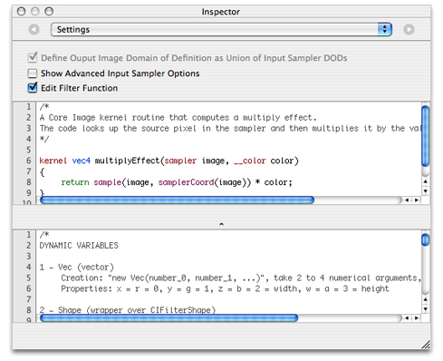

This patch supports Core Image filters of varying complexity, including:

- Single kernel, single pass filters for which the region of interest (ROI) and domain of definition (DOD) coincide. For this type of filter, you need only to provide a kernel function in the top window, such as the `multiplyEffect` kernel shown in Figure 3-10.
- Filters for which one or more kernels require you to define the region of interest. In this case, you use the bottom window to define an ROI function, and then supply a main routine in the bottom window to apply to the kernel function defined in the top window.
- Multipass filters. You use a main function in the bottom window to apply multiple kernels or Core Image filters. You can apply any of the kernel functions that you define in the top window as well as any Core Image filter. Quartz Composer supplies wrappers for [CIFilterShape](https://developer.apple.com/documentation/coreimage/cifiltershape) and [NSAffineTransform](https://developer.apple.com/documentation/foundation/nsaffinetransform). See [Listing 3-1](#apple-f4xwc4dqnrsv64tfmyxwi33df52wszbpkridimbqga2tgobrfvbuqmrqgmwvgvzrgq).

__Listing 3-1__  A multipass filter that uses Core Image filters

```
// Assume myKernel is a routine defined in the top window.
// This code is the main function defined in the bottom window.
function __image main (__image image, __vec4 color){
    var image1, image2;
    var transform;

    // Apply the kernel that's defined in the top window.
    image1 = myKernel.apply(image.extent, null, image);
    // Apply the Core Image Sepia filter.
    image2 = Filter.sepiaTone(image1, 1.0);
    // Set up and apply a transform
    transform = new AffineTransform().scale(0.5);
    return Filter.affineTransform(image2,transform);
}
```


The GLSL patch (see Figure 3-11) uses the vertex and fragment shaders you provide to render a result. You need to use the OpenGL Shading Language to write the shaders.

You can find several examples of compositions that use the GLSL patch in:

`/Developer/Examples/Quartz Composer Compositions/GLSL`

__Figure 3-11__  The GLSL programming patch

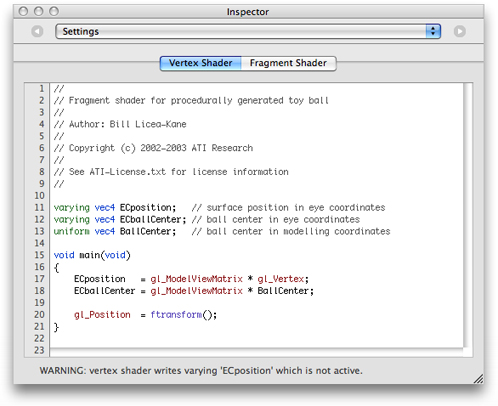

The JavaScript patch (see Figure 3-12) implements the function that you provide in the Settings pane of the patch. Quartz Composer automatically creates input and output ports for the patch based on the prototype of the function. You must use these keywords to define input and output keys for your JavaScript function: `__number`, `__index`, `__string`, `__image`, `__structure`, and `__boolean`.

__Figure 3-12__  The JavaScript programming patch

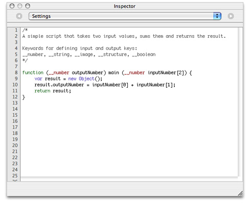

[Next](Tutorial-%20Creating%20a%20Composition.md)[Previous](The%20Quartz%20Composer%20User%20Interface.md)

