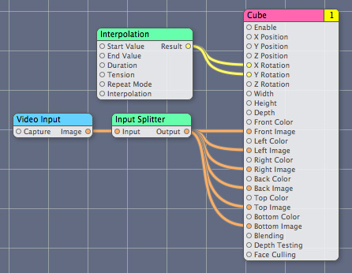
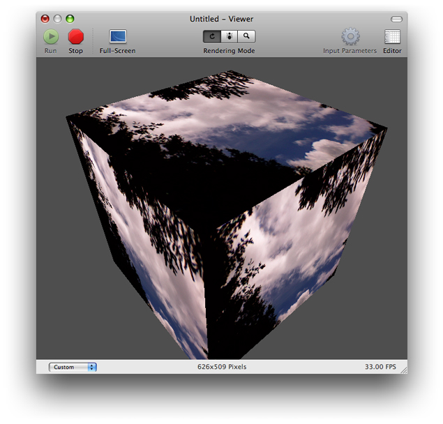
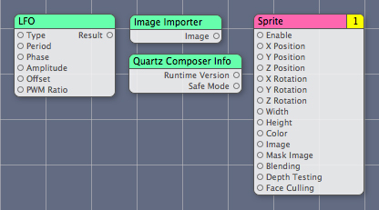
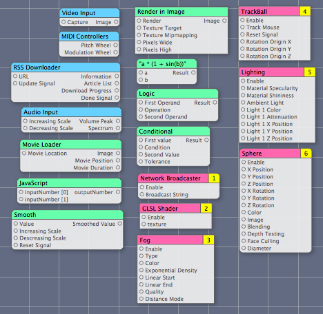
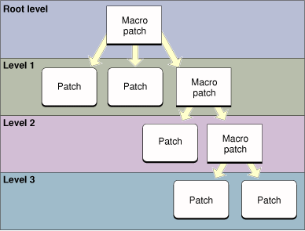
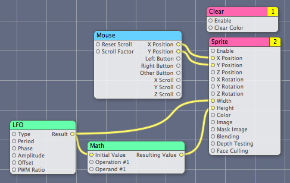
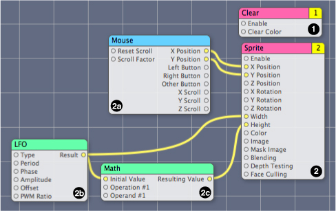
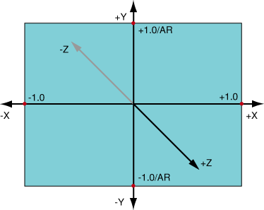
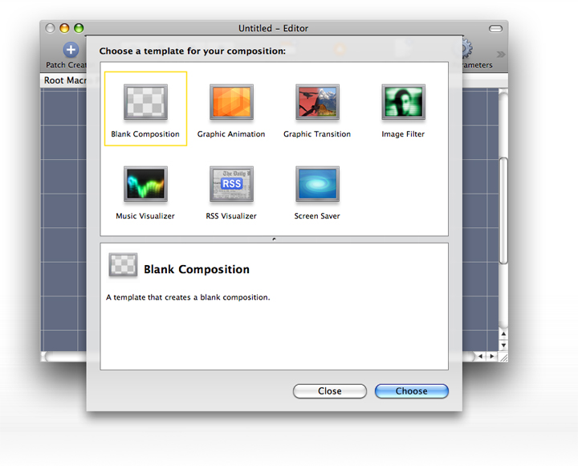

> 导航：[总目录](../../../README.md) · [documentation](../../../_indexes/documentation.md) · [Quartz Composer User Guide](Introduction%20to%20Quartz%20Composer%20User%20Guide.md)


[Next](The%20Quartz%20Composer%20User%20Interface.md)[Previous](Introduction%20to%20Quartz%20Composer%20User%20Guide.md)

# Quartz Composer Basic Concepts

Quartz Composer is a development tool provided with OS X v10.5 for processing and rendering graphical data. Its visual programming environment is suited for:

- Developing graphics processing modules without writing a single line of code
- Exploring the visual technologies available in OS X without needing to learn the programming interface for that technology

After installing the developer tools provided with OS X v10.5, you can find the Quartz Composer development tool in:

`/Developer/Applications`

Quartz Composer brings together a rich set of graphical and nongraphical technologies, including Quartz 2D, Core Image, Core Video, OpenGL, QuickTime, Core MIDI Services, RSS (Really Simple Syndication), XML, and more.

This chapter describes the basic concepts you need to understand Quartz Composer. It defines the basic elements (compositions and patches), describes the flow of data in a composition, illustrates the coordinate system, and introduces the composition repository.

You use the Quartz Composer editor to create __Quartz compositions__, which are procedural motion graphics programs created by assembling preexisting modules (called __patches__) in a workflow for data processing and rendering. Figure 1-1 shows a simple composition.

__Figure 1-1__  A Quartz composition



Compositions can have input parameters and produce output results. The output produced by the composition shown in Figure 1-1 is a rotating cube whose faces show video captured by a camera connected to the computer (see Figure 1-2).

__Figure 1-2__  Motion graphics produced by a composition



A composition can operate autonomously, but it’s also possible for any Mac app to communicate with the composition and to integrate the composition into its existing work flow. (See _[Quartz Composer Programming Guide](../Quartz%20Composer%20Programming%20Guide/Introduction%20to%20Quartz%20Composer%20Programming%20Guide.md#apple-f4xwc4dqnrsv64tfmyxwi33df52wszbpkridimbqgaytgnjx)_ for details on integrating compositions into applications.) Compositions are stored as Quartz Composer files with the `.qtz` extension.

The basic elements of Quartz Composer are _patches_. Similar to routines in traditional programming languages, patches are base processing units. They execute and produce a result. Patches are equivalent to the following:

```
Result = function (time, {0 or more input parameters})
```

Unlike traditional routines, patches are visual entities (see Figure 1-3) that you add to a visual programming environment. Circles on a patch represent _ports_, with input ports on the left side of a patch and output ports on the right side. Ports pass data through them—you can think of ports as parameters.

__Figure 1-3__  Sample patches



Like routines, not all patches take input parameters. Figure 1-3 shows three patches that demonstrate the various configurations that ports can have. The Low Frequency Oscillator (LFO) patch has both input and output ports. The six input ports—Type, Period, Phase, Amplitude, Offset, and PWM Ratio—provide data that is used to calculate the amplitude of an oscillation at a specific time. The calculated amplitude value is available on the output port of the patch.

The Image Importer and Quartz Composer Info patches don’t have any input ports, but each has an output port. The Image Importer patch produces an image, while the Quartz Composer Info patch produces a value that specifies the version of Quartz Composer running on the system. The Sprite patch, has many input ports, but no output port. Instead, the Sprite patch renders its result to a destination. Connections between the ports define how data flows when the composition runs.

Patches are divided into groups that designate their execution mode—consumer, processor, or provider. A _consumer_ renders a result to a destination. The Cube patch in [Figure 1-1](#apple-f4xwc4dqnrsv64tfmyxwi33df52wszbpkridimbqga2tgobrfvbuqmrrgiwvgvzs) is an example of a consumer. It draws a textured cube to the screen. A consumer patch has these behaviors:

- Executes if its Enable input is set to `True`.
- Executes in a defined order. Note the number in the top-right of the Cube patch. This designates the execution order (also called the rendering layer) with respect to other consumer patches. Consumer patches are executed in numerical order from lowest to highest.
- Pulls data from processors and providers.

A _processor_ processes data at specified intervals or in response to changing input values. The Interpolation patch in [Figure 1-1](#apple-f4xwc4dqnrsv64tfmyxwi33df52wszbpkridimbqga2tgobrfvbuqmrrgiwvgvzs) is an example of a processor patch. It returns a value calculated by interpolating between a starting and ending value for a given time. The Interpolation patch updates its output value when input values or the time changes. In this case, the output value changes based on the duration of the interpolation and the repeat mode.

A _provider_ supplies data from an outside source to a composition. This type of patch executes on demand—that is, whenever data is requested of it, but at most once per frame. The Video Input patch in [Figure 1-1](#apple-f4xwc4dqnrsv64tfmyxwi33df52wszbpkridimbqga2tgobrfvbuqmrrgiwvgvzs) is an example of a provider patch. It supplies images captured from an external video source.

The title bars of patches are color coded to indicate their execution mode. Processors are green, providers are blue, and consumers are pink. Simply by looking at the color, you can determine the execution mode of each patch in [Figure 1-1](#apple-f4xwc4dqnrsv64tfmyxwi33df52wszbpkridimbqga2tgobrfvbuqmrrgiwvgvzs).

A Quartz composition is similar to any complex C or Objective-C program that has a main routine and many subroutines. The _root macro patch_ is similar in concept to a main routine. A _macro patch_ (or simply macro) is similar to a subroutine in a traditional program. Like subroutines, a macro can use (or call) another macro, which means macros can be nested, forming a _patch hierarchy_ in a composition.

Quartz Composer provides several macro patches that require you to add subpatches to them. For example, the Lighting patch is a macro. To use this patch to illuminate an object, you place, inside the Lighting patch, the patches that create the object that you want to illuminate. You can also create custom macros. Packaging patch collections as macros keeps complex compositions manageable and easy to read. Macro patches look different from other patches. Macros have squared corners while other patches have rounded corners, as you can see by looking at the assortment of patches in Figure 1-4.

__Figure 1-4__  Macro patches have squared corners; other patches have rounded corners



The Quartz Composer evaluation path determines when and how often each patch in a composition executes. When Quartz Composer executes a composition, it traverses the patch hierarchy, from the root macro patch level to lower levels, and attempts to execute the macro patches. Figure 1-5 shows the evaluation path for a composition with multiple levels. Evaluation begins at the root level with the macro patch. Quartz Composer must move to level 1 to obtain the data it needs for the macro patch at the root level. Level 1 contains a macro that must be evaluated, so evaluation moves to level 2. That level contains a macro, so evaluation moves to level 3. Level 3 does not contain any macros, so evaluation begins. After level 3 is evaluated, Quartz Composer moves to level 2 to complete that evaluation and then moves to level 1 to complete that evaluation.

__Figure 1-5__  The evaluation path for a hierarchical composition



From within a macro patch, Quartz Composer executes consumers first, beginning with the consumer whose rendering layer is lowest. Processor and provider patches execute when consumer patches pull data from them. Figure 1-6 shows the contents of a macro patch that renders a sprite. The mouse position controls the position of the sprite. A low-frequency oscillation controls the width and height of the sprite.

__Figure 1-6__  The contents of a macro patch that renders a sprite



Figure 1-7 shows the evaluation order of the macro shown in Figure 1-6. There are two consumer patches—Clear and Sprite. Recall that consumers evaluate in numerical order, from lowest to highest. For example, in Figure 1-7, Clear evaluates first, then Sprite. This means that Quartz Composer clears the viewing area before rendering a sprite. But in order for the Sprite patch to complete its execution, the patch pulls data first from the Mouse patch, then from the LFO patch, and finally from the Math patch. After the Sprite patch has all the data it needs, it can then render its result.

__Figure 1-7__  Evaluation order



Quartz Composer uses a three-dimensional homogeneous coordinate system, as shown in Figure 1-8. The origin is at the center of the screen. The _x_ axis is horizontal and the _y_ axis is vertical. The _z_ axis is orthogonal to the _x_ and _y_ axes, so that it comes out of the screen, towards the viewer. The left and right borders of the screen have coordinates `–1.0` and `+1.0`, respectively. (See the _x_ axis in the figure.) The coordinates of the top and bottom borders (the _y_ axis in the figure) depend on the screen aspect ratio (AR). In the case of a 4:3 aspect ratio, the values at the borders are `+1.0 / AR = +0.75` and `–1.0 / AR = –0.75`, respectively.

It’s also possible to have an aspect ratio for which the top and bottom borders of the screen have coordinates `–1.0` and `+1.0`, respectively, while the left and right borders are `+1.0 / AR` and `–1.0 / AR`, respectively. For example, a 3:4 aspect ratio.

__Figure 1-8__  The Quartz Composer coordinate system



The Quartz Composer coordinate system maps to the rendering destination. The full width of a rendering destination is 2.0 units—one unit in the positive _x_ axis added to one unit in the negative _x_ axis. You can set the size of the graphics that are rendered. A size of 2.0 specifies to use the full width of the rendering destination. A size less than 2.0 units specifies to use a proportion of the rendering destination (1.0 specifies to use half, 1.5 specifies to use 75%, and so forth).

By default, the untransformed coordinate system is identical to the eye coordinate system. That is, the projection of a 3D object onto the 2D rendering destination is from the perspective of a viewer positioned directly in front of the monitor, with the _z_ axis traveling perpendicular to the monitor.

A Quartz composition provides a standard way to express motion graphics in OS X, whether it’s for animation or effects processing. For that reason, OS X v10.5 includes a __composition repository__—a central location for storing compositions. Any application can, using the Quartz Composer framework, query the repository for specific types of compositions or simply browse the repository to see what’s available. The repository resides across these folders:

- `/System/Library/Compositions`
- `/Library/Compositions`
- `~/Library/Compositions`

Any composition stored in the repository must conform to one of the protocols listed in Table 1-1. Quartz Composer provides templates for each of these protocols, which are available when you startup Quartz Composer (see [Figure 1-9](#apple-f4xwc4dqnrsv64tfmyxwi33df52wszbpkridimbqga2tgobrfvbuqmrrgiwvgvzrgm)) or by choosing File > New From Template. When you choose a template in the Quartz Composer user interface, you’ll see a detailed description for that protocol along with information about the required and optional parameters. After modifying a template, you can store the composition in the repository to allow other applications to use your composition.

__Table 1-1__  Composition protocols

| Protocol | Required input parameters | Optional input parameters | Output parameters |
| Graphic animation | None | Primary color, secondary color, pace, and preview mode | None required, but must render to the screen |
| Graphic transition | Source image, destination image | Preview mode | None required |
| Image filter | Image | Position of the center of the effect, preview mode | Image |
| Music visualizer | Audio peak, audio spectrum | Track info, track position, track signal | None required |
| RSS visualizer | URL for an RSS feed | Display duration | None required |
| Screen saver | None | Screen image, preview mode | None required, webpage URL optional |

The Quartz Composer programming interface provides Objective-C classes ([QCCompositionRepository](https://developer.apple.com/documentation/quartz/qccompositionrepository) and [QCComposition](https://developer.apple.com/documentation/quartz/qccomposition)) that allow developers to access the repository programmatically and provide support within an application for browsing and choosing compositions. You do not need to know Objective-C to create a composition for the repository, but you must know Objective-C to access the repository programmatically. The Quartz Composer programming interface makes it easy for developers to support the sort of motion graphics that application like iMovie and iDVD use. For more information, see _Quartz Composer Reference Collection_.

__Figure 1-9__  Templates available in Quartz Composer



[Next](The%20Quartz%20Composer%20User%20Interface.md)[Previous](Introduction%20to%20Quartz%20Composer%20User%20Guide.md)

