> 导航：[总目录](../../../README.md) · [documentation](../../../_indexes/documentation.md) · [Quartz Composer User Guide](Introduction%20to%20Quartz%20Composer%20User%20Guide.md)

[Next](Basic%20and%20Advanced%20Tasks%2C%20Tips%2C%20and%20Tricks.md)[Previous](Quartz%20Composer%20Basic%20Concepts.md)

# The Quartz Composer User Interface

The Quartz Composer development tool supplied in OS X v 10.5 has two main windows: the editor and the viewer. The editor window is for assembling and connecting patches to create a composition. The viewer window shows the output produced by the composition, the rendering resources consumed by the composition, and debugging information.

This chapter describes the editor and viewer windows, the utility windows and views, the key menu items, and other aspects of the user interface for Quartz Composer. After reading this chapter, you’ll be ready to use the editor to create a composition.

The main part of the Quartz Composer Editor window is the __workspace__—a grid for assembling and connecting patches (see Figure 2-1). The set of connected patches on the workspace is sometimes called a _graph_. In theory, the workspace is infinite in size. The size of the scrollers in the scroll bars provides a clue as to the size of the graph.

The __toolbar__ at the top of the editor window contains controls that either open utility windows or modify what’s shown in the editor window.

The Patch Creator button opens the Patch Creator utility window. You can browse patch names and categories in this utility window, or you can use the search field to look for patches. For more details see [Figure 2-4](#apple-f4xwc4dqnrsv64tfmyxwi33df52wszbpkridimbqga2tgobrfvbuqmrqgiwueq2jizfeuqsj).

__Figure 2-1__  The Editor window

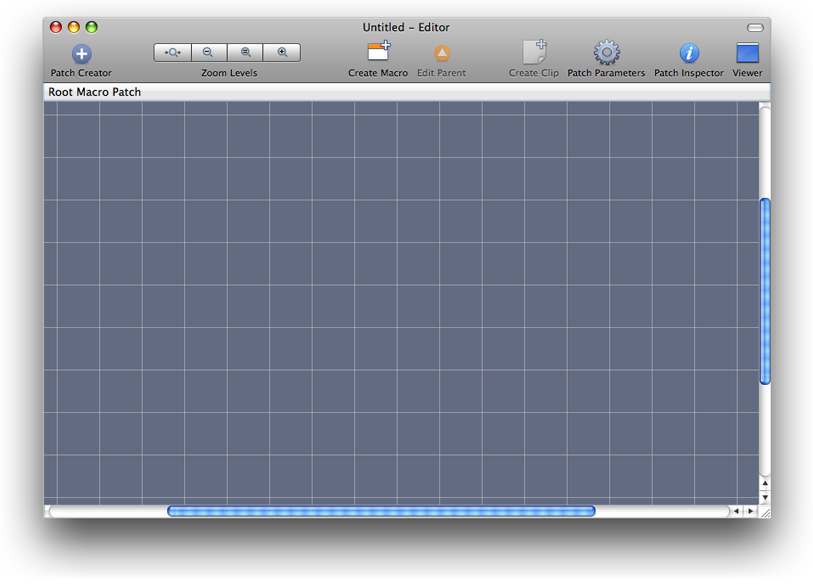

The Zoom Levels controls come in handy for complex compositions that contain a lot of patches. You can zoom instantly to fit all patches in the visible area of the workspace, zoom out, return to the default magnification, or zoom in to read the text more easily.

The Create Macro and Edit Parent buttons support compositions that have nested patches (or macros). Clicking Create Macro adds an empty macro patch to the workspace. To see what’s inside or to edit a macro, simply double-click it. If you are in a macro, you can go up one level by clicking the Edit Parent button. [Figure 2-2](#apple-f4xwc4dqnrsv64tfmyxwi33df52wszbpkridimbqga2tgobrfvbuqmrqgiwvgvzrgm) shows the content of an audio spectrum macro. You can tell you are inside a macro by looking at the space just below the toolbar, which displays the breadcrumb, or path. You can also change levels by clicking an item in the path.

__Figure 2-2__  A macro that draws an audio spectrum

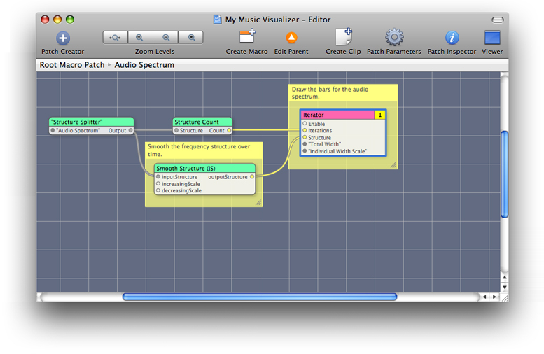

A _clip_ contains a set of patches that perform a task, such as rendering a rotating cube or an animated background. Clips, like routines in a library for a traditional programming language, speed development. They are prepackaged “mini” compositions that you can drag into your composition and customize for your own use. Quartz Composer provides just a few clips but you can add your own by clicking the Create Clip button. See [Adding a Clip to the Patch Creator](Basic%20and%20Advanced%20Tasks%2C%20Tips%2C%20and%20Tricks.md#apple-f4xwc4dqnrsv64tfmyxwi33df52wszbpkridimbqga2tgobrfvbuqmrqgmwvgvzrgu).

The Patch Parameters button toggles a view that contains the input parameters of the selected patch. See [Patch Parameter Pane](#apple-f4xwc4dqnrsv64tfmyxwi33df52wszbpkridimbqga2tgobrfvbuqmrqgiwvgvzrgq).

The Patch inspector button opens a utility window that lets you set input parameters, view and edit patch information, change internal settings for patches that have them, and inspect published input and output ports if there are any. See [The Patch Inspector](#apple-f4xwc4dqnrsv64tfmyxwi33df52wszbpkridimbqga2tgobrfvbuqmrqgiwvgvzrgu).

The Viewer button opens a window that shows the rendered output from the composition. See [The Viewer Window](#apple-f4xwc4dqnrsv64tfmyxwi33df52wszbpkridimbqga2tgobrfvbuqmrqgiwvgvzz).

Control-click the toolbar to open a sheet that allows you to customize the toolbar. You can drag items into and out of the toolbar, as well as rearrange them.

__Figure 2-3__  The sheet for customizing the toolbar

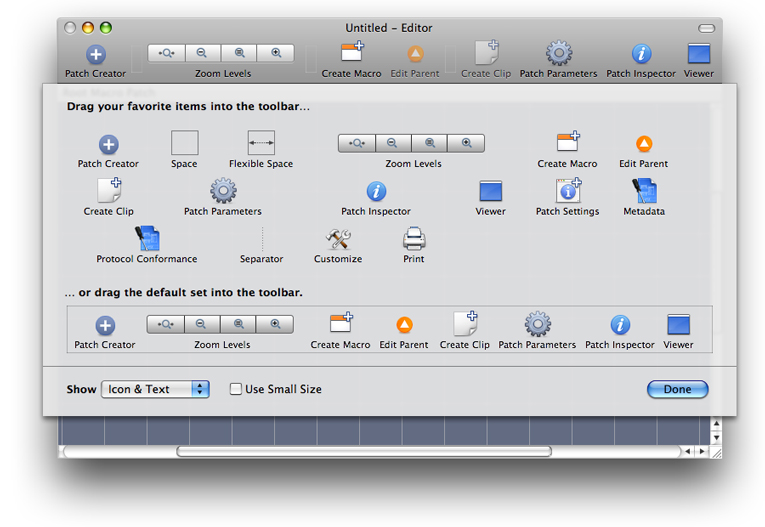

The Patch Creator is a utility window for browsing and getting information about Quartz Composer patches and clips. Within this window is the Patch Browser, which lists patches and clips by name and category. If you are new to Quartz Composer, you can use the browser to familiarize yourself with the available patches. When you click a patch name, you can read its description. (See Figure 2-4.)

__Figure 2-4__  The Patch Creator

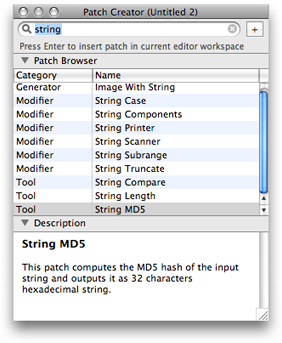

If you already know the name of a patch, the fastest way to locate it is to start typing its name in the search field. As you type, the list narrows to those patches whose name contains the typed string. Figure 2-5 shows the list of patches after a search for the key word “time.”

__Figure 2-5__  The search feature can help you to locate patches

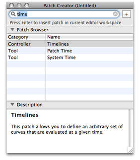

Because Quartz Composer supports custom patches and clips, it’s possible for the list of patches in the Patch Creator to change. The best way to find out what’s available is to browse through the list. However, you might find it helpful to know more about the patch categories. The following sections describe the categories and highlight some of the more interesting and powerful patches.

Composite patches take two input images and produce one output image. Quartz Composer provides patches for the commonly used compositing and blending operations (addition, source over, source in, source out, and so on). Figure 2-6 shows an addition patch that produces an image that’s rendered to a 2D billboard.

__Figure 2-6__  The Addition patch is a Composite patch

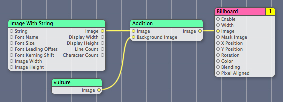

Controller patches produce one or more values that you can use to control the output of another patch. They can produce output values based on user input or as the result of mathematical operations, such as functions you supply, values from waveforms, and randomly generated values. Figure 2-7 shows the x and y position of the mouse used to control the position of a cylinder onscreen, while an Interpolation patch provides a value to control the rotation of the cylinder in the _z_ plane.

__Figure 2-7__  The Mouse and Interpolation patches are Controller patches

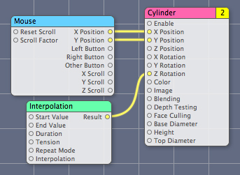

Environment patches are typically macros that operate on a motion graphic to transform its look in some way. The Lighting and Fog patches in Figure 2-8 are two examples, but there are many more, including patches that transform 3D space and macro patches that replicate their contents.

__Figure 2-8__  The Lighting and Fog patches are Environment patches

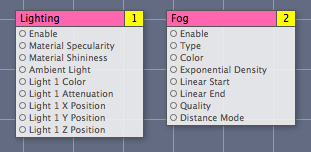

Filter patches operate on the pixels in an input image to produce an output image. The Comic Effect patch in Figure 2-9 is a Filter patch that operates on a single image to make the image look as if it is published in a comic book. There are dozens of Filter patches, including Pixellate, Gloom, Unsharp Mask, and Edges.

__Figure 2-9__  Comic Effect is an image processing filter patch

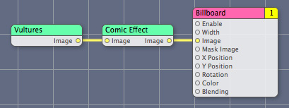

Generator patches produce an image algorithmically. The Checkerboard patch shown in Figure 2-10 produces a checkerboard pattern whose colors, square size, and sharpness are based on input values. If there aren’t any external input values, the patch uses its default values. Other Generator patches include Image with String, Star Shine, and Random Generator.

__Figure 2-10__  Checkerboard is a Generator patch

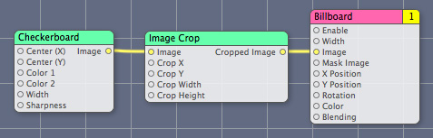

Gradient patches produces an image based on Gaussian, linear, or radial algorithms. Note that Quartz Composer also has a patch named “Gradient” in the render category that renders a gradient to a destination. Patches in the Gradient category, by contrast, must produce an output image that can then be used as input to another patch. The Gradient category also has Linear Gradient and Gaussian Gradient patches.

__Figure 2-11__  Radial Gradient is a Gradient patch

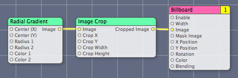

Modifier patches take input values or objects (such as images), change or transform the input in some way, and then output the transformed value or object. The Color Transformation and Image Crop patches in Figure 2-12 are Modifier patches. There are also patches for modifying strings (such as String Case and String Truncate), inspecting structures (such as Structure Index Member and Structure Key Member), and modifying textures (Image Texturing Properties).

__Figure 2-12__  Image Crop and Color Transformation are Modifier patches

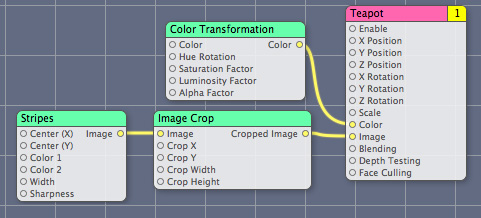

Network patches send, receive, or operate on network data. Figure 2-13 shows three examples: Network Receiver, Network Synchronizer, and Network Broadcaster.

__Figure 2-13__  Some sample Network patches

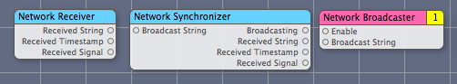

Numeric patches produce values based on a mathematical expression that you supply or that is built in to the patch. The center patch in Figure 2-14 is one that allows you to define an expression. Quartz Composer automatically creates the input ports based on the expression. There are many more helpful Numeric patches to explore, such as Counter, Conditional, and Round.

__Figure 2-14__  Some sample Numeric patches

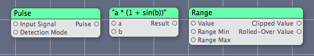

The Plug-in category includes custom patches packaged as a Quartz Composer plug-in. For information on creating them, see _[Quartz Composer Custom Patch Programming Guide](../Quartz%20Composer%20Custom%20Patch%20Programming%20Guide/Introduction%20to%20Quartz%20Composer%20Custom%20Patch%20Programming%20Guide.md#apple-f4xwc4dqnrsv64tfmyxwi33df52wszbpkridimbqga2doobx)_. You won’t find the MIDI2Color and iPatch patches shown in Figure 2-15 unless you build them yourself, which you can do by following the instructions in _[Quartz Composer Custom Patch Programming Guide](../Quartz%20Composer%20Custom%20Patch%20Programming%20Guide/Introduction%20to%20Quartz%20Composer%20Custom%20Patch%20Programming%20Guide.md#apple-f4xwc4dqnrsv64tfmyxwi33df52wszbpkridimbqga2doobx)_.

__Figure 2-15__  Two custom patches

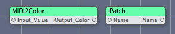

Programming patches (see Figure 2-16) provide a text field, accessible in the inspector, for adding a routine that the patch executes. The JavaScript patch requires you to use JavaScript. The Core Image Filter patch requires that you provide a kernel routine written using the Core Image Kernel Language (see _[Core Image Kernel Language Reference](../Core%20Image%20Kernel%20Language%20Reference/Introduction.md#apple-f4xwc4dqnrsv64tfmyxwi33df52wszbpkridimbqga2dgojx)_). The GLSL Shader patch requires that you supply a shader written using OpenGL Shading Language. For more details, see [Using Programming Patches](Basic%20and%20Advanced%20Tasks%2C%20Tips%2C%20and%20Tricks.md#apple-f4xwc4dqnrsv64tfmyxwi33df52wszbpkridimbqga2tgobrfvbuqmrqgmwvgvzx).

__Figure 2-16__  Some example Programming patches

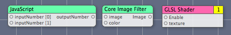

Renderer patches render to a destination—the viewer window. Figure 2-17 shows three of them—Clear, Billboard, and Particle System. The Clear patch clears the rendering destination, optionally using a color you supply. The Billboard patch renders a 2D image. The Particle System patch renders a set of particles, each of which have a lifetime. There are several other interesting renderers, including Cube, Psychedelic, Sprite, Sphere, and Teapot.

__Figure 2-17__  A few Renderer patches

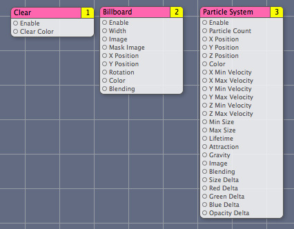

Source patches provide data (such as a file list, RSS feed, composition) from a source. Figure 2-18 shows Directory Scanner, RSS Downloader, and Composition Loader. But there are also patches for getting audio input, images from folders, and information about the computer.

__Figure 2-18__  Some sample Source patches

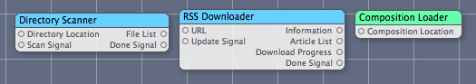

Tool patches perform tasks that are useful for creating a composition, such as the Anchor Position and Demultiplexer patches shown in Figure 2-19. (The title of the Demultiplexer patch in the figure is in quotes to show that the title was created dynamically. The title changes according to the output port type you choose.) There are many other tool patches including OpenGL Info, Image Dimensions, Input Splitter, Date Formatter, Structure Count, and System Time.

__Figure 2-19__  Two Tool patches

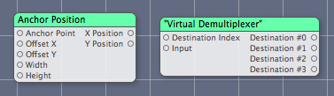

Transition patches produce an effect between a source image and a destination image—the sort of effect you would use in a slideshow. Ripple, Page Curl, and Dissolve, shown in Figure 2-20, are three such patches. There are others, including Flash, Swipe, Mod, Copy Machine, and Disintegrate with Mask.

__Figure 2-20__  Three Transition patches

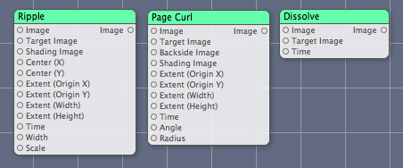

Clip patches are those that you create by selecting a group of connected patches and clicking Create Clip. Quartz Composer provides a few clips, such as the Discs Background shown in Figure 2-21 and the Rotating Cube clip, which you’ll use if you follow the tutorial in [Creating a Glow Filter](Tutorial-%20Creating%20a%20Composition.md#apple-f4xwc4dqnrsv64tfmyxwi33df52wszbpkridimbqga2tgobrfvbuqmrrgmwvgvzz). Quartz Composer doesn’t provide the Company Logo clip, also shown in Figure 2-21; a logo or other graphic that you repeatedly use is a good candidate for a clip.

__Figure 2-21__  Two Clip patches

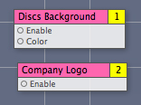

The Patch Parameters button on the editor window toolbar toggles the patch parameters pane shown to the right of the workspace in Figure 2-22. This pane provides convenient access for editing input parameters

The Macro Patch field at the top of the pane shows the input parameters for any published ports for that level. (You can find out more about published ports in [Publishing Ports](Tutorial-%20Creating%20a%20Composition.md#apple-f4xwc4dqnrsv64tfmyxwi33df52wszbpkridimbqga2tgobrfvbuqmrrgmwvgvzrga).) The pane also shows the input parameters for the patch, or patches, currently selected in the workspace. When you select another patch, the pane changes to the input parameters for that patch. If you select more than one patch, the input parameters for all selected patches appear in the pane, making it easy to change parameters in different patches.

__Figure 2-22__  The patch parameter pane

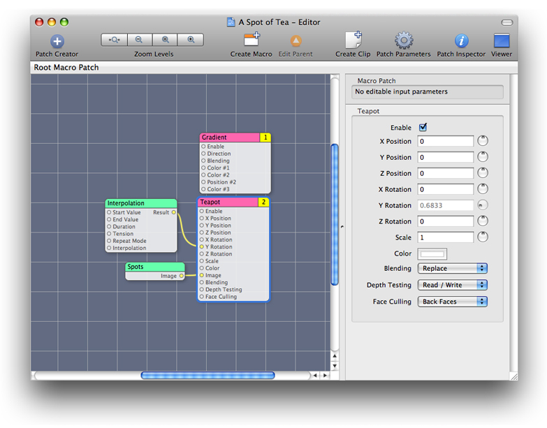

The Patch inspector is a utility window that has one to three panes, depending on the patch that’s currently selected in the workspace. All patches have an Input Parameters pane. The Input Parameters pane (see Figure 2-23) allows you to edit the input parameters for a patch. It’s equivalent to the patch parameter pane, which you view within the editor window.

__Figure 2-23__  The Input Parameters pane

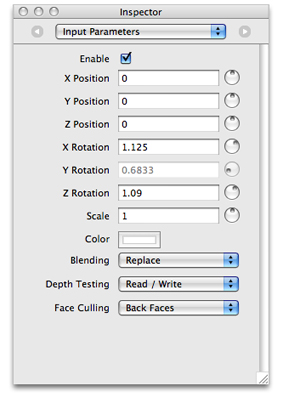

Some patches also have a Settings pane. You’ll see it only if the patch has settings that are advanced or that aren’t typically animated. Figure 2-24 shows an advanced option for clearing the depth buffer along with an explanation of why you might use the option. It also provides an option for setting the number of gradient points.

__Figure 2-24__  The Settings pane

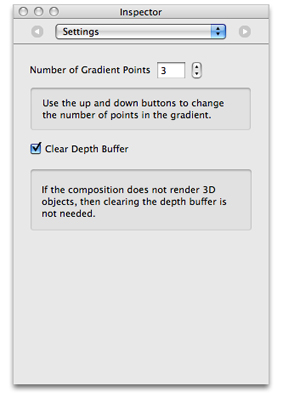

Quartz Composer allows you to publish the input and output ports for a patch. Publishing allows you to access values for patches that are nested within a composition (see [The Patch Hierarchy](Quartz%20Composer%20Basic%20Concepts.md#apple-f4xwc4dqnrsv64tfmyxwi33df52wszbpkridimbqga2tgobrfvbuqmrrgiwvgvzrga)). You can inspect the published ports using the Published Inputs & Outputs pane of the inspector. Figure 2-25 shows the published input and output ports for a macro patch from a rather complex, hierarchical composition. Publishing makes these ports available to the parent level of this patch.

__Figure 2-25__  The published ports for a macro patch

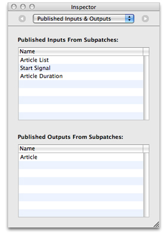

Ports published at the topmost level of a composition are available outside the composition, as you’ll see in [Publishing Ports](Tutorial-%20Creating%20a%20Composition.md#apple-f4xwc4dqnrsv64tfmyxwi33df52wszbpkridimbqga2tgobrfvbuqmrrgmwvgvzrga). You can inspect the ports published at the topmost level (that is, the root macro patch) by opening the inspector and clicking the workspace (make sure that no patches are selected). Then, the inspector provides information about the entire level of the composition rather than about a single patch.

__Figure 2-26__  The published ports for the root macro patch, or top level of a composition

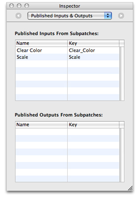

The viewer window has its own toolbar. You can start and stop rendering, switch to full-screen rendering, change the rendering mode (see [Rendering Modes](#apple-f4xwc4dqnrsv64tfmyxwi33df52wszbpkridimbqga2tgobrfvbuqmrqgiwvgvzu)), view composition input parameters, and switch to the editor window.

__Figure 2-27__  The Quartz Composer viewer window

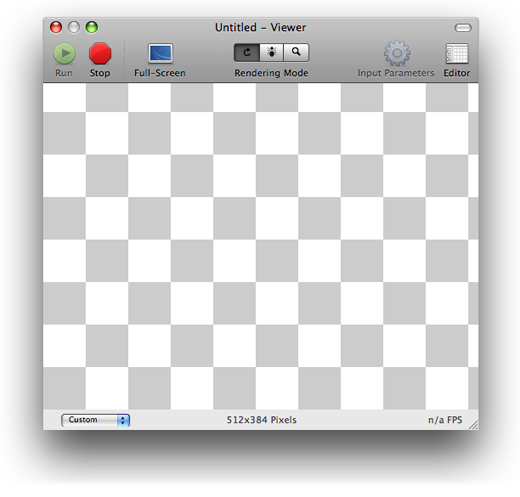

The viewer window shows the average frame rate at the bottom right of the window and the image size at the bottom center. The pop-up menu at the bottom left lets you constrain the viewer to a fixed size or aspect ratio, as shown in [Figure 2-28](#apple-f4xwc4dqnrsv64tfmyxwi33df52wszbpkridimbqga2tgobrfvbuqmrqgiwvgvztgi).

__Figure 2-28__  The aspect ratio pop-up menu

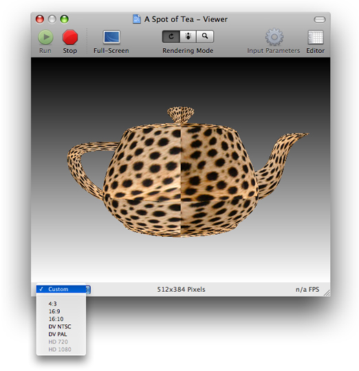

The viewer window has three rendering modes available:

- Performance mode is the normal rendering mode and provides optimal performance. When you enable full-screen mode, Quartz Composer always uses performance rendering mode.
- Profile mode gathers statistics that are displayed in a drawer to the right of the viewer window (see Figure 2-29).
- Debug mode displays a log of debug information that is displayed in a drawer below the viewer window (see Figure 2-30) and color codes each patch to indicate its execution state. Notice that the viewer in the figure isn’t rendering content. The content in the drawer provides clues as to the underlying problem.

__Figure 2-29__  Profile rendering mode

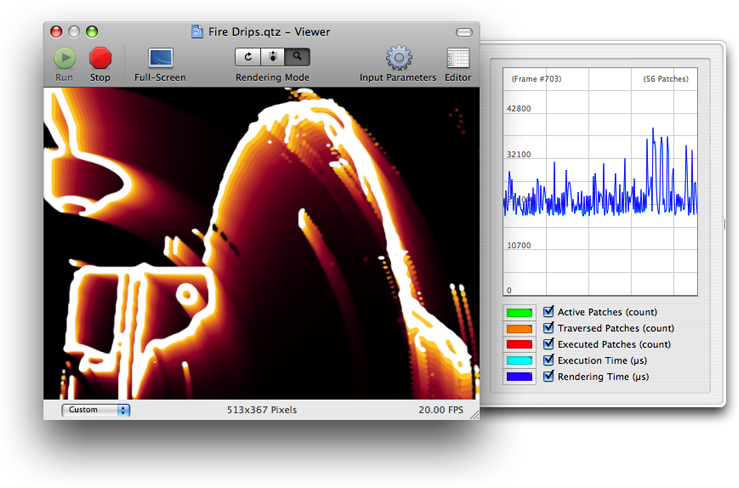

_Profile rendering mode_ analyzes each frame that is rendered and graphs information that you can use to optimize the rendering performance of a composition. You can obtain the following information:

- Active Patches, the number of patches that are currently active.
- Traversed Patches, the number of patches that are “touched” during the patch tree traversal, but not necessarily executed.
- Executed Patches, the number of patches executed for the analyzed frame.
- Execution Time, an estimate of the length of time in milliseconds used by Quartz Composer to compute the analyzed frame.
- Rendering Time, an estimate of the length of time in milliseconds used by Quartz Composer and OpenGL to render the analyzed frame.

__Figure 2-30__  Debug rendering mode

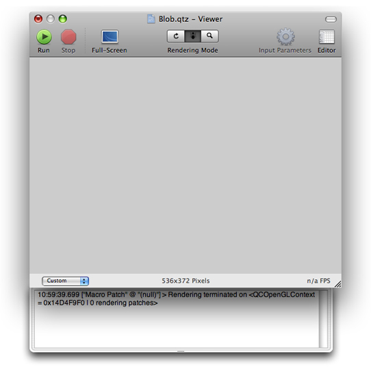

In addition to displaying debugging information posted by Quartz Composer, _debug rendering mode_ shades each patch in the editor window with a color, similar to the shading shown in Figure 2-31.

- Green shading indicates that the patch is enabled and running. For example, the Clear and Billboard patches in the figure are running.
- Red shading indicates that the patch is not enabled. The Mouse patch in the figure is not enabled.
- Orange indicates that a patch is enabled but not running. The Image Importer and LFO patches are enabled but not running.

You can examine the data flow as a composition runs in debugging mode. Patches change colors as they move from one state to another.

__Figure 2-31__  The debug rendering mode color-codes patches

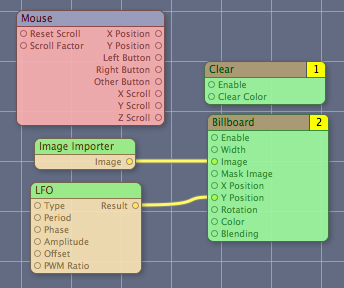

Although you will want to explore all the menu items available in Quartz Composer, there are several menu items that you won’t want to overlook:

- File > Export as QuickTime Movie saves a composition as a QuickTime movie. See [Turning a Composition into a QuickTime Movie](Tutorial-%20Creating%20a%20Composition.md#apple-f4xwc4dqnrsv64tfmyxwi33df52wszbpkridimbqga2tgobrfvbuqmrrgmwvgvzs) for details.
- Edit > Undo and Edit > Redo.
- File > Compare Compositions opens a window that lets you compare compositions in a number of interesting ways. See [Comparing Compositions](Basic%20and%20Advanced%20Tasks%2C%20Tips%2C%20and%20Tricks.md#apple-f4xwc4dqnrsv64tfmyxwi33df52wszbpkridimbqga2tgobrfvbuqmrqgmwvgvzw).
- Editor > Edit Information allows you to add information about the composition, such as the copyright and a description.
- Viewer > Save Snapshot saves an image of the composition that’s rendering in the viewer.

[Next](Basic%20and%20Advanced%20Tasks%2C%20Tips%2C%20and%20Tricks.md)[Previous](Quartz%20Composer%20Basic%20Concepts.md)

