> 导航：[总目录](../../../README.md) · [documentation](../../../_indexes/documentation.md) · [Quartz Composer User Guide](Introduction%20to%20Quartz%20Composer%20User%20Guide.md)

[Next](Glossary.md)[Previous](Basic%20and%20Advanced%20Tasks%2C%20Tips%2C%20and%20Tricks.md)

# Tutorial: Creating a Composition

Creating a composition with Quartz Composer supplied in OS X v10.5 is easy. You need only to add patches to a workspace and connect them. What’s more, you can get instant feedback on your composition as you add patches, allowing you to tune your composition as you create it.

This chapter is a tutorial that provides step-by-step instructions for creating a glow filter and applying the filter to a rotating cube. After you create the composition, you’ll see how to use it as a screen saver and turn it into a QuickTime movie.

This section shows how to use Quartz Composer to create a composition that renders a textured, rotating cube and then to apply a glow effect to the cube. By following the steps in this section, you’ll learn to:

- Create a hierarchical composition that uses macro patches
- Set up consumer patches so they evaluate in the correct order

Before you start creating the composition, you’ll learn what a glow filter is and how it can be implemented as a Quartz composition. Then, you’ll create your own glowing cube composition by following these steps:

1. [Setting Up a Rotating Cube](#apple-f4xwc4dqnrsv64tfmyxwi33df52wszbpkridimbqga2tgobrfvbuqmrrgmwugssci5ceirkj)
2. [Adding a Background Color](#apple-f4xwc4dqnrsv64tfmyxwi33df52wszbpkridimbqga2tgobrfvbuqmrrgmwueq2jiveuersb)
3. [Creating a Render in Image Macro](#apple-f4xwc4dqnrsv64tfmyxwi33df52wszbpkridimbqga2tgobrfvbuqmrrgmwugsscircuissi)
4. [Applying a Gaussian Blur](#apple-f4xwc4dqnrsv64tfmyxwi33df52wszbpkridimbqga2tgobrfvbuqmrrgmwugsscizcuqskd)
5. [Increasing the Glow Effect](#apple-f4xwc4dqnrsv64tfmyxwi33df52wszbpkridimbqga2tgobrfvbuqmrrgmwueq2jirfeuqkb)

A glow filter creates a diffuse lighting effect around the edges of an object to make the object appear as if it is glowing. This standard effect appears in many image processing applications. Creating an effect like this in OS X v10.3 and earlier requires many lines of code. Quartz Composer doesn’t require any code to create this and other effects; you simply assemble and connect patches.

A glow filter achieves its effect by adding together an image and a blurred copy of the image. The addition operation brightens the highlights in an image to create an area of diffuse brightening along the edges in the image. The beach scene on the right of Figure 4-1 is the result of adding the scene on the left to a blurred copy of the scene.

__Figure 4-1__  A beach scene without (left) and with (right) the glow effect applied

Figure 4-2 shows the Quartz composition for creating a glow effect on a bitmap image. The composition uses four patches:

- Image Importer generates a bitmap image from a JPEG, TIFF, PNG, BMP, GIF, or PDF file.
- Gaussian Blur blurs an image by the amount specified by a radius.
- Addition adds the blurred image to the bitmap image and provides the result as an output parameter.
- Billboard renders the image.

__Figure 4-2__  A composition that creates a glow effect on an image

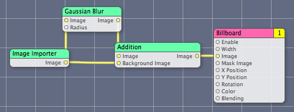

Now that you know how a glow filter is implemented, it’s time to launch Quartz Composer and get started creating your own composition. Quartz Composer is located the following directory:

`/Developer/Applications/`

You’ll need a texture file to complete the composition described in the rest of this chapter. If you don’t have one, you can use one of the image files in `/Library/User Pictures`.

Quartz Composer provides a Rotating Cube clip that renders a cube using an input image and a duration value. The image you supply will appear on the six faces of the cube. The duration controls the period of the cube’s rotation.

Follow these steps to set up the rotating cube.

1. Launch Quartz Composer. Choose the Blank Composition template.

   If you’ve turned off the option to choose a template, then choose File > New Blank.
2. Click the Patch Creator button and type Rotating Cube in the search field.
3. Press Return to add the Rotating Cube clip to the workspace as shown in Figure 4-3.

   When you add a clip to the workspace, Quartz Composer makes a copy of the clip and adds the copy to the workspace. This means that you can modify the added clip without affecting what’s in the Patch Creator.

   __Figure 4-3__  The Rotating Cube clip in the workspace

   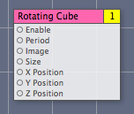
4. In the Finder, locate an image file that contains the texture to use for the faces of the cube. Then drag the image directly from the Finder to the workspace.

   This example uses a brick image as a texture, but you can supply any image you’d like to appear on the faces of the cube.

   Quartz Composer automatically creates an instance of an Image Importer patch, copies the texture to the patch, and renames the patch to have the name of the image file.
5. Connect the Image output to the Image input of the Rotating Cube as shown in Figure 4-4.

   To create a connection, click the output port of one patch and then click the input port of another patch. (You’ll notice that you can’t create a connection in the opposite direction.)

   __Figure 4-4__  The Image connected to the Rotating Cube

   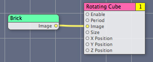
6. Open the Input Parameters pane of the inspector for the Rotating Cube.

   The default period value is 10, which means that the cube completes a full rotation every 10 seconds. Change the value to 1 and look at the viewer window to observe how the cube rotation speeds up. Then, change the value back to 10. As you can see, it is easy to change input parameter values.
7. Click Viewer to bring it to the front.

   A brick-faced cube (see Figure 4-5) rotates. The background appears smeared. To correct that, you’ll need to clear the viewer prior to rendering each frame of the animation. You’ll do that next, in [Adding a Background Color](#apple-f4xwc4dqnrsv64tfmyxwi33df52wszbpkridimbqga2tgobrfvbuqmrrgmwueq2jiveuersb).

   __Figure 4-5__  The background smears

   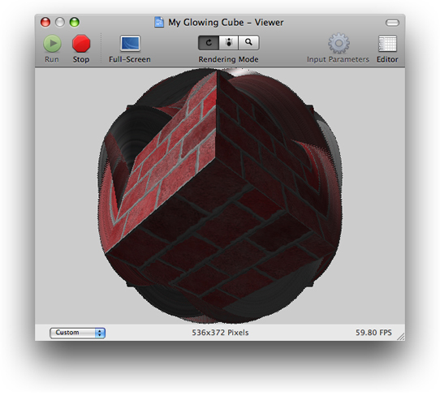

So far the composition is a rotating cube; Quartz Composer is rendering nothing except the cube. Because Quartz Composer doesn’t erase the viewing area between frames, you see smearing. In this section you’ll add a Clear patch so that you can not only eliminate the smearing, but you can also control the background color of the rendering destination.

Colors in Quartz Composer have an alpha component that lets you specify the opacity of the color. A fully transparent color has an opacity of 0 and a fully opaque one has an opacity of 1.

Follow these steps to add a background color to the composition:

1. Use the Patch Creator to find and add a Clear patch to the workspace.

   Notice in Figure 4-6 that Clear is numbered 2 and Rotating Cube is numbered 1. This means that the Rotating Cube is rendered first and then the rendering area is cleared, which is the wrong order for these operations. If you leave these patches in this rendering order, all you’ll see is the solid clear color.

   __Figure 4-6__  The number in the title bar of a consumer patch indicates its rendering order

   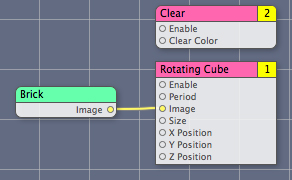
2. To change the rendering order, click the number on the Clear patch and choose Layer 1 from the pop-up menu, as shown in Figure 4-7.

   __Figure 4-7__  The rendering layer for the Clear patch

   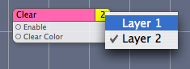
3. Look at the viewer window.

   The cube rotates over a black background. The default color is black with an alpha value of 0.0. (An alpha value of 0.0 means 0% opacity or completely transparent.) You can change the color and the opacity in the Input Parameters pane of the inspector for the Clear patch by clicking the color well.

The Render in Image patch is a macro that renders what’s in it (that is, its subpatches) to an image. By rendering part of your composition into an image, you can then use that image as you would any image in Quartz Composer.

The steps in this section show how to use the Render in Image macro to convert the rotating cube into a reusable image. You’ll then be able to apply a glow effect to that image.

1. Use the Patch Creator to find and add a Render in Image macro (see Figure 4-8) to the workspace.

   __Figure 4-8__  The Render in Image macro

   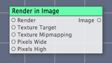
2. In the Input Parameters pane of the inspector for the Render in Image macro, make sure the Image Dimensions are set to `0` x `0` pixels.

   This is the default setting. When image dimensions are set to `0` x `0`, Quartz Composer renders the image so that it has the same dimensions as the rendering destination. When you set the image dimensions to specific values, Quartz Composer forces the image to render to those dimensions.
3. Select all the patches except the Render in Image macro and choose Edit > Cut.
4. Double-click the Render in Image macro and choose Edit > Paste.

   You’ve just moved all the patches into the Render in Image macro, creating another level in the composition.
5. Take a look at the viewer window.

   Note that the composition no longer has a patch in the root macro patch level that draws to a rendering destination.
6. Click Edit Parent to move up to the root macro patch level of your composition.
7. Use the Patch Creator to find and add a Billboard patch (see Figure 4-9) to the root macro patch level of the workspace.

   The Billboard patch renders a simple quad that takes the perspective of facing the viewer.

   __Figure 4-9__  A Billboard patch

   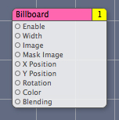
8. Connect the output port of the Render in Image macro to the Image input port of the Billboard patch.

   At this point, you might notice that your composition does not fill the viewer window. In the next step, you’ll remedy that.
9. Look at the Input Parameters pane of the inspector for the Billboard patch. Notice that the Width is set to 1.

   The Width parameter specifies the width of the quad. Quartz Composer automatically computes the height of the quad based on the aspect ratio. Recall that the coordinate space is 2.0 units wide (see [Figure 1-8](Quartz%20Composer%20Basic%20Concepts.md#apple-f4xwc4dqnrsv64tfmyxwi33df52wszbpkridimbqga2tgobrfvbuqmrrgiwvgvzy)). Because the current width is 1.0, the billboard quad uses half the width of the rendering area.

   For this composition, you will make the billboard use the full width of the Quartz Composer coordinate space.
10. In the Input Parameters pane of the inspector for the Billboard patch, enter `2` in the Width text box.

    The composition should now render to the full width of the viewer window.
11. Take a look at the Viewer. You should see the rotating cube over a black background.

A Gaussian Blur patch combines neighboring pixels to effectively produce a blurred image. (For those who want to know the details, the convolution kernel used to compute the blue represents the shape of a Gaussian distribution (also known as a bell curve.)

Recall that the glow effect results from adding a blurred copy of an image to the original image. (See [Figure 4-1](#apple-f4xwc4dqnrsv64tfmyxwi33df52wszbpkridimbqga2tgobrfvbuqmrrgmwueq2jjfcuoqsk).) To achieve the glow effect, you’ll use a Gaussian Blur patch to blur a copy of the rotating cube image. Then, you’ll use an Addition compositing filter patch to combine the two images.

1. Add the Gaussian Blur and Addition patches to the root macro patch level of the workspace.
2. Connect the Image output port from the Render in Image macro to the Image input port of the Gaussian Blur patch and make another connection to the Background Image input port of the Addition patch.
3. Connect the Image output port of the Gaussian Blur patch to the Image input port of the Addition patch.
4. Finally, connect the Image output port of the Addition patch to the Image input port of the Billboard patch.

   The composition should look as shown in Figure 4-10.

   __Figure 4-10__  A composition that produces a glowing, rotating cube

   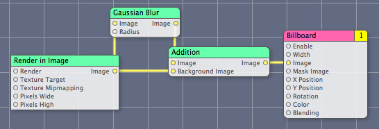
5. Take a look at the composition in the Viewer.

   The glow effect around the edges of the cube is subtle. The next section shows how to increase the effect.

With older video tube technology it was possible to turn up the brightness adjustment so much that the images on the screen would get little halos around them. Although this sort of behavior is undesirable when you want to view nice crisp images, it is exactly what you need to achieve a glow effect. In this section you’ll set up the digital equivalent of “turning up the brightness” by adding a Gamma Adjust patch.

The Gamma Adjust patch is usually used to compensate for the nonlinear effects of displays by adjusting midtone brightness. Adjusting the gamma effectively changes the slope of the transition between black and white.

Using the Gamma Adjust patch in this composition has nothing to do with display adjustment. It’s really a hack, but one that works quite well. When the gamma-adjusted image is then blurred, the rotating cube attains a halo that results in a more pleasing glow effect.

Follow these steps to add the Gamma Adjust patch.

1. Use the Patch Creator to find and add a Gamma Adjust patch (see Figure 4-11) to the root macro patch level of the workspace.

   __Figure 4-11__  The Gamma Adjust patch

   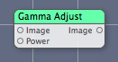
2. Insert the Gamma Adjust patch into the composition as shown in Figure 4-12.

   __Figure 4-12__  The Gamma Adjust patch added to the composition

   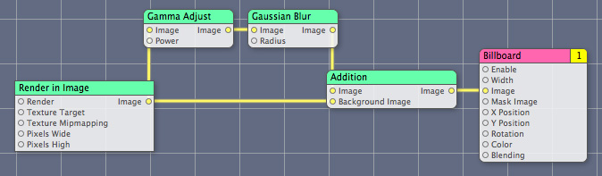
3. In the Input Parameters pane of the inspector for the Gamma Adjust patch, move the Power slider until you achieve a pleasing glow effect.

Published ports are available at the top level of a composition and, as you’ll see, provide easy access for manually changing their values. They become even more important as a way to programmatically control a composition. Later, in [Making a Screen Saver](#apple-f4xwc4dqnrsv64tfmyxwi33df52wszbpkridimbqga2tgobrfvbuqmrrgmwvgvzy) and [Turning a Composition into a QuickTime Movie](#apple-f4xwc4dqnrsv64tfmyxwi33df52wszbpkridimbqga2tgobrfvbuqmrrgmwvgvzs), you’ll see how publishing ports makes your composition interactive. See _[Quartz Composer Programming Guide](../Quartz%20Composer%20Programming%20Guide/Introduction%20to%20Quartz%20Composer%20Programming%20Guide.md#apple-f4xwc4dqnrsv64tfmyxwi33df52wszbpkridimbqgaytgnjx)_ for information on how to programmatically change the values of published ports.

You’ll revise the composition so that it has two published input ports at the root macro patch level—one that controls the clear color and the other that controls the gamma value.

1. Double-click the Render in Image macro so that you can see the Clear and Rotating Cube patches.

   Notice that the Clear subpatch has a Clear Color input port. The default clear color is black, which is why the cube appears on a black background. It is difficult to change the color during runtime because the color input is buried in the subpatch.
2. Control-click the Clear patch and choose Published Inputs > Clear Color, as shown in Figure 4-13.

   __Figure 4-13__  Publishing the Clear Color input port

   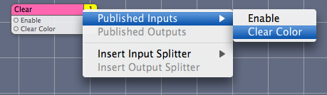
3. Press Return.

   Notice that the Clear Color input port appears gray to indicate it is published.
4. Switch to the root macro patch level.

   Notice that the Render in Image patch has an input parameter it didn’t have earlier—Clear Color. This input parameter is the one you just published from the Clear patch. When the Clear Color parameter for Render in Image is set, the color value is passed to the Clear patch.

   Parameters published from lower levels are not available outside the composition unless you also publish them from the root macro patch. You’ll do that next.
5. Control-click the Gamma Adjust patch and choose Published Inputs > Power.
6. Press Return to keep the assigned name.
7. Control-click the Render in Image patch and choose Published Inputs > Clear Color.
8. Press Return to keep the assigned name.
9. In the viewer window, click Input Parameters.

   The input ports that are published to the root macro patch level appear as a sheet in the viewer window, as shown in Figure 4-14. Published input ports are are also referred to as the input parameters of the composition. You can manipulate the controls to change the color and power values in real time, just as the background color in the figure was changed to gray by using the published color well.

   __Figure 4-14__  Published input ports as they appear in Quartz Composer

   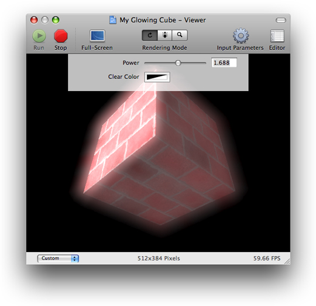
10. In the editor window, hover the pointer over the Clear Color input port for the Render in Image patch and note the published key name, as shown in Figure 4-15. Do the same thing for the Power input for the Gamma Adjust patch.

    __Figure 4-15__  The help tag for the Clear Color input port

    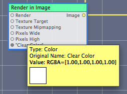
11. Save the composition and quit Quartz Composer.

You’ve successfully created a composition. Next you’ll see how to use it as a screen saver and then how to make it into a QuickTime movie.

There are two steps required for making a Quartz Composer a screen saver:

1. Create a composition.
2. Put the composition in one of these folders:

   - `/Library/Screen Savers`
   - `~/Library/Screen Savers`

The composition appears as a screen saver in the Desktop & Screen Saver pane of System Preferences, as shown in Figure 4-16.

__Figure 4-16__  A composition can be used as a screen saver

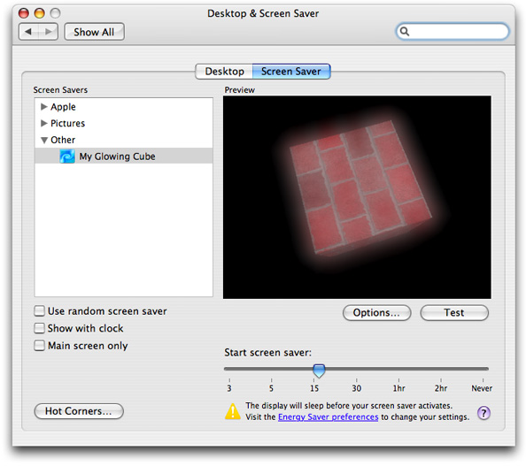

If the screen saver composition has input parameters, clicking the Options button displays a window for setting the parameter values. Those values are saved as user preferences.

Turning a composition into a QuickTime Movie is a quick and easy way to let users view and interact with a composition. Follow these steps to make a QuickTime movie from a composition:

1. With the editor window active, choose File > Export as QuickTime Movie.
2. Click Save and then, in the window that appears, modify the dimensions and duration if you need to.
3. Click Export.

   When you open the exported movie in the Finder, QuickTime Movie Player launches.

The generated QuickTime movie does not contain a prerendered version of the composition but the composition itself, which is then rendered in real time by QuickTime. Such QuickTime movies can be only opened in OS X v10.5 or later.

Another way to create a QuickTime movie from a Quartz composition is to open it in QuickTime Player and save it as a movie. When creating a QuickTime movie in this way, you can’t specify custom dimensions and duration; default values are used. You can change those defaults with the `defaults` command-line tool. For example, to specify a width of 1024, a height of 768, and a duration of 60 minutes, you enter these commands in the Terminal window:

`defaults write NSGlobalDomain QuartzComposerDefaultMovieDuration 60`

`defaults write NSGlobalDomain QuartzComposerDefaultMovieWidth 1024`

`defaults write NSGlobalDomain QuartzComposerDefaultMovieHeight 768`

The `NSGlobalDomain` defaults apply to all applications.

If you want to set default values for a specific application (for example, iMovie), you would enter command similar to the following:

`defaults write com.apple.iMovie3 QuartzComposerDefaultMovieDuration 300`

`defaults write com.apple.iMovie3 QuartzComposerDefaultMovieWidth 640`

`defaults write com.apple.iMovie3 QuartzComposerDefaultMovieHeight 480`

If you know how to write code, you may want to read the following:

- _[Quartz Composer Programming Guide](../Quartz%20Composer%20Programming%20Guide/Introduction%20to%20Quartz%20Composer%20Programming%20Guide.md#apple-f4xwc4dqnrsv64tfmyxwi33df52wszbpkridimbqgaytgnjx)_ shows how to use the Quartz Composer programming interface to load, play, and control compositions. It also provides instructions on how to use bindings in Interface Builder to create a standalone composition.
- _[Quartz Composer Custom Patch Programming Guide](../Quartz%20Composer%20Custom%20Patch%20Programming%20Guide/Introduction%20to%20Quartz%20Composer%20Custom%20Patch%20Programming%20Guide.md#apple-f4xwc4dqnrsv64tfmyxwi33df52wszbpkridimbqga2doobx)_ describes how to create your own patches that you can use in the Quartz Composer development environment.

[Next](Glossary.md)[Previous](Basic%20and%20Advanced%20Tasks%2C%20Tips%2C%20and%20Tricks.md)

