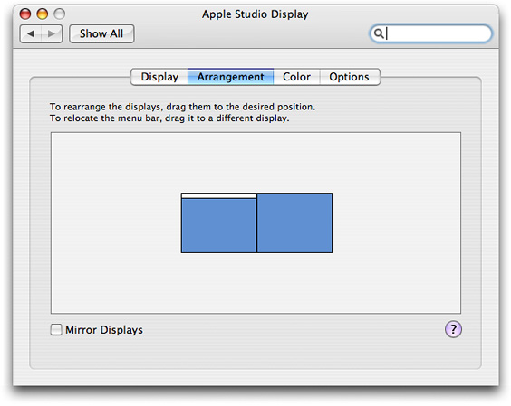

> 导航：[总目录](../../../README.md) · [documentation](../../../_indexes/documentation.md) · [Quartz Display Services Programming Topics](Introduction%20to%20Quartz%20Display%20Services%20Programming%20Topics.md)

[Next](Getting%20Information%20About%20Displays.md)[Previous](Introduction%20to%20Quartz%20Display%20Services%20Programming%20Topics.md)

# Overview of Quartz Display Services

Quartz Display Services is a set of system software functions that support dynamic changes to the arrangement and display modes of the displays attached to a user’s computer, as well as other display-related operations. (In this document, the term _display_ refers to a graphics hardware system consisting of a framebuffer, a gamma correction table or color palette, and possibly an attached monitor.)

For example, Mac apps can use Quartz Display Services to:

- Examine and change display modes
- Configure a set of displays in a single operation
- Capture one or more displays for exclusive use
- Perform fade effects
- Activate display mirroring
- Configure gamma color correction tables and color palettes
- Receive notification of screen update operations

Quartz Display Services is a low-level API. User interface elements such as windows are not automatically repositioned when monitors are detached or display modes change. Instead, Quartz provides a notification mechanism for display state changes. Cocoa automatically detects these state changes and makes adjustments to the size, position, and layout of windows on the affected displays.

OS X System Preferences uses Quartz Display Services to perform some of the actions in the Displays preferences pane. For example, the Display pane contains controls that allow the user to switch display modes to a different display resolution.

On a system with two or more attached monitors, the Arrangement pane shown in [Figure 1](#apple-f4xwc4dqnrsv64tfmyxwi33df52wszbpkridimbqga2demrwfvjvomy) contains controls that allow the user to:

- Rearrange the displays on the extended desktop
- Change the main display by moving the menu bar from one display to another
- Create a display mirroring set

__Figure 1__  An Arrangement pane

The next few sections introduce some basic features of displays, along with some of the more important functions in the Quartz Display Services API. The other articles in this document contain examples that show how to use this API to perform some common operations.

A display is considered to be online when the framebuffer hardware is connected to a monitor. If no monitor is attached to the framebuffer, a display is characterized as offline.

When a display is online, the display is mapped into the global display (desktop) coordinate system. The upper-left corner of a display is called the origin. The origin of a display is always specified in global display (desktop) coordinates.

The display with the origin at (0,0) is called the main or primary display. In a system without display mirroring, the display with the menu bar is typically the _main display._ The user can change the main display by dragging the menu bar to a different display in Displays preferences.

An online display can be active, mirroring, or sleeping. These terms are defined as follows:

- A display is active if it is awake and available for drawing.
- A display is mirroring another display if the same content is drawn to both displays simultaneously. You cannot draw on the mirroring display.
- A display is sleeping when its framebuffer and the attached monitor are in reduced power mode. A sleeping display is still considered to be a part of global display space, but you cannot draw on it.

When a monitor is attached and a display is online, Quartz assigns a unique display identifier (ID) of type [CGDirectDisplayID](https://developer.apple.com/documentation/coregraphics/cgdirectdisplayid). A display ID can persist across processes and typically remains constant until the machine is restarted. You can obtain an array of display IDs that correspond to all online displays in the system with the function [CGGetOnlineDisplayList](https://developer.apple.com/documentation/coregraphics/1454964-cggetonlinedisplaylist).

Typically, you’re more interested in active displays because they're available for drawing. You can obtain an array of display IDs that correspond to all active displays in the system with the function [CGGetActiveDisplayList](https://developer.apple.com/documentation/coregraphics/1454603-cggetactivedisplaylist). The first display in the list is always the main display. The main display is also represented by the constant [kCGDirectMainDisplay](https://developer.apple.com/documentation/coregraphics/kcgdirectmaindisplay), which is defined as a call to the function [CGMainDisplayID](https://developer.apple.com/documentation/coregraphics/1455620-cgmaindisplayid).

These functions also obtain an array of display IDs:

- [CGGetDisplaysWithPoint](https://developer.apple.com/documentation/coregraphics/1454385-cggetdisplayswithpoint) obtains the display IDs for online displays whose bounds include a specified point.
- [CGGetDisplaysWithRect](https://developer.apple.com/documentation/coregraphics/1456071-cggetdisplayswithrect) obtains the display IDs for online displays whose bounds include a specified rectangle.
- [CGGetDisplaysWithOpenGLDisplayMask](https://developer.apple.com/documentation/coregraphics/1454234-cggetdisplayswithopengldisplayma) obtains the display IDs for online displays that correspond to the bits set in an OpenGL display mask.

Every display has a set of supported modes of operation. A display mode is a set of standard properties—such as resolution (width and height in pixels), bits per pixel, and refresh rate—and optional properties—such as pixel stretching to fill the screen.

Each display mode is represented by an instance of the `CGDisplayMode` opaque type. To find out what modes a display supports, you use the function [CGDisplayCopyAllDisplayModes](https://developer.apple.com/documentation/coregraphics/1455537-cgdisplaycopyalldisplaymodes), which returns an array of display modes. To find out the current display mode for an online display, you use the function [CGDisplayCopyDisplayMode](https://developer.apple.com/documentation/coregraphics/1454099-cgdisplaycopydisplaymode), which returns a single display mode. A display mode contains a set of properties that you can query using Quartz Display Services `CGDisplayMode` functions. You are responsible for releasing the display mode when you are finished with it.

Display modes are read-only. If you want to change a specific display property such as resolution, you need to find the appropriate display mode and use it to change the mode of the display. You can use [CGDisplaySetDisplayMode](https://developer.apple.com/documentation/coregraphics/1454760-cgdisplaysetdisplaymode), a convenience function for changing the mode of a single display. For more information, see [Changing Display Modes (OS X v10.6 or later)](Changing%20Display%20Modes%20%28OS%20X%20v10.6%20or%20later%29.md#apple-f4xwc4dqnrsv64tfmyxwi33df52wszbpkridimbqga2demzufvjvomi).

Every display has a set of supported modes of operation. A display mode is a set of standard properties—such as resolution (width and height in pixels), bits per pixel, and refresh rate—and optional properties—such as pixel stretching to fill the screen.

Each display mode is represented by a display mode dictionary. To find out what modes a display supports, you use the function [CGDisplayAvailableModes](https://developer.apple.com/documentation/coregraphics/1562068-cgdisplayavailablemodes), which returns a list of mode dictionaries. To find out the current display mode for an online display, you use the function [CGDisplayCurrentMode](https://developer.apple.com/documentation/coregraphics/1562062-cgdisplaycurrentmode), which returns a single mode dictionary. A display mode dictionary contains a set of key-value pairs that you can query using Core Foundation `CFDictionary` functions.

To find the optimal mode for a selected set of properties, you can use the function [CGDisplayBestModeForParameters](https://developer.apple.com/documentation/coregraphics/1562060-cgdisplaybestmodeforparameters). For example, if you request a supported mode for a display with a resolution of 750 x 550 pixels and 24 bits per pixel, this function may return a supported mode with resolution of 800 x 600 pixels and 32 bits per pixel.

Mode dictionaries are read-only. If you want to change a specific display property such as resolution, you need to find the appropriate mode dictionary and use it to change the mode of the display. You can use [CGDisplaySwitchToMode](https://developer.apple.com/documentation/coregraphics/1562065-cgdisplayswitchtomode), a convenience function for changing the mode of a single display. For more information, see [Changing Display Modes (OS X v10.5)](Changing%20Display%20Modes%20%28OS%20X%20v10.5%29.md#apple-f4xwc4dqnrsv64tfmyxwi33df52wszbpkridimbqgeydcnjsfvjvomi).

On systems with multiple displays, your application can control the arrangement of the displays in the global display space. This is done by setting the origin of each display with the function [CGConfigureDisplayOrigin](https://developer.apple.com/documentation/coregraphics/1454090-cgconfiguredisplayorigin). The new origins are placed as close as possible to the requested locations, without overlapping or leaving a gap between displays. You can also use this function to designate a display as the main display by setting its origin to (0,0). For more information about using this function, see [Configuring Displays Using a Transaction](Configuring%20Displays%20Using%20a%20Transaction.md#apple-f4xwc4dqnrsv64tfmyxwi33df52wszbpkridimbqga2demzqfvjvomi).

When your application terminates, the display arrangement returns to the current settings in Displays preferences.

On systems with multiple displays, your application can draw the same content to two or more displays simultaneously. This is called mirroring, and the displays are said to be in a mirroring set. You can create or change the configuration of a mirroring set with the function [CGConfigureDisplayMirrorOfDisplay](https://developer.apple.com/documentation/coregraphics/1454531-cgconfiguredisplaymirrorofdispla). One display is designated the main or primary display in the mirroring set, and all drawing is directed to this display. For more information about using this function, see [Configuring Displays Using a Transaction](Configuring%20Displays%20Using%20a%20Transaction.md#apple-f4xwc4dqnrsv64tfmyxwi33df52wszbpkridimbqga2demzqfvjvomi).

Display mirroring and display matte generation are implemented either in hardware (preferred) or software, at the discretion of the device driver. In hardware mirroring, the graphics hardware renders the contents of a single framebuffer in two or more displays simultaneously. In software mirroring, identical content is drawn into the framebuffer of each display in the mirroring set. The display with the highest resolution and deepest pixel depth typically becomes the main display.

Quartz makes sure that all window-based content is placed on all displays in a mirroring set. Applications that draw in windows need not be concerned about supporting mirroring. Applications drawing directly to the display may need to implement a traditional device loop to properly support mirroring.

[Next](Getting%20Information%20About%20Displays.md)[Previous](Introduction%20to%20Quartz%20Display%20Services%20Programming%20Topics.md)

