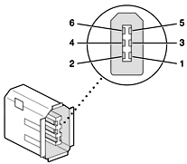
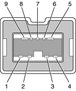

> 导航：[总目录](../../../README.md) · [documentation](../../../_indexes/documentation.md) · [FireWire Developer Note](Introduction%20to%20FireWire%20Developer%20Note.md)

[Next](FireWire%20Product-Specific%20Details.md)[Previous](Introduction%20to%20FireWire%20Developer%20Note.md)

# FireWire Concepts

This article presents an overview of FireWire, including its history, features of its major versions, and the standards that define it. It also details FireWire connectors on Macintosh computers.

FireWire is a high-speed serial input/output (I/O) technology for connecting peripheral devices to a computer or to each other. By providing a high-bandwidth, easy-to-use I/O technology, FireWire sparked innovations in consumer electronics devices such as DV camcorders, portable external disk drives, and MP3 players such as the Apple iPod, as well as in professional products such as audio and video production equipment. In 2001, the Academy of Television Arts and Sciences presented Apple with an Emmy award in recognition of the contributions made by FireWire to the television industry.

Key features of FireWire include:

- High data transfer rates
- Large number and range of devices
- Plug-and-play connectivity
- On-bus power
- Asynchronous and isochronous data transfer

With the ability to transfer data at up to 800 Mbps, FireWire can support high-demand work environments such as media production and jet aircraft flight-control systems.

You can connect a few devices in a simple chain or add hubs to attach as many as 62 devices to a single FireWire bus. The number of available FireWire buses can be increased via PCI and CardBus cards.

FireWire allows for true hot-swappable, plug-and-play connection of peripheral devices. There is no need to shut down the computer before adding or removing a FireWire device. Nor do you need to install drivers, assign unique ID numbers, or move terminators.

FireWire devices can be powered through the FireWire cable, eliminating the need for their own power cables and adapters.

The data traffic between FireWire nodes is divided into isochronous and asynchronous transfers. Isochronous transfers provide guaranteed transmission opportunities at defined intervals; if a packet is not received successfully, it is not resent. In asynchronous transfers, the intervals between transmissions can vary, and data can be resent if it's missed. FireWire is one of very few interfaces that support both isochronous and asynchronous capabilities. It can reserve up to 80 percent of its bandwidth for one or more isochronous channels to support applications that require real-time data transmission.

Based on Apple-developed technology, FireWire was adopted in 1995 as the IEEE 1394 standard for cross-platform peripheral connectivity. Three versions of the IEEE 1394 standard FireWire have been approved so far by the Institute of Electrical and Electronics Engineers (IEEE):

- 1394-1995, adopted in 1995 was the original standard. Driven by Apple and based largely on Apple-developed technology, 1394-1995 supported data transfer rates up to 400 Mbps and distances up to 4.5 meters, and introduced the concept of self-managing, peer-to-peer multimedia interconnect.
- 1394a, adopted in 2000, added and clarified specifications for performance optimization and power management on FireWire buses.
- 1394b, adopted in 2002, raised maximum FireWire data transfer rates with current speeds up to 800 Mbps and distances to 100 meters. It also allows more types of media (including optical fiber cabling) to be used for FireWire connections.

The first two versions (1394-1995 and 1394a) are commonly known collectively as FireWire 400, in accordance with its theoretical maximum data transfer rate of 400 Mbps. Similarly, 1394b is commonly called FireWire 800, for its maximum rate of 800 Mbps (with currently available equipment). FireWire 800 provides continued support for existing FireWire 400 devices, which can be plugged into either type of port, although an adapter cable may be required.

Table 1 compares the data transfer rates of FireWire and USB. With the increased speed of USB 2.0, there is some overlap in the types of devices supported by FireWire and USB. However, USB typically remains the technology of choice for mice, keyboards, and other lower-bandwidth devices. FireWire, with its higher bandwidth, longer interdevice cable distances, and higher-powered bus, is more suitable for devices such as high-speed external disk drives, digital video (DV) devices, professional audio devices, high-end digital still cameras, and home entertainment components.

__Table 1__  FireWire and USB data transfer speeds

| Bus | Theoretical maximum speed in Mbps |
| USB 1.1 | 12 |
| FireWire 400 (1394a) | 400 |
| USB 2.0 | 480 |
| FireWire 800 (1394b) | 800\* |
|
| \* With currently available products. The IEEE 1394b standard proposes architectural specifications for eventually achieving speeds up to 3200 Mbps. | \* With currently available products. The IEEE 1394b standard proposes architectural specifications for eventually achieving speeds up to 3200 Mbps. |

The short cable distance limit of USB 2.0 (about five meters) limits its usefulness in deployments that require long-haul cabling and multiple sources of data, such as sound stages and studios.

USB 2.0 works in a master/slave arrangement that adds significant overhead to data transfers. FireWire is a true peer-to-peer technology, so two or more FireWire peripherals can communicate with each other directly as peers, sending each piece of data over the bus only once, directly to its destination.

FireWire is also designed to provide useful amounts of power, allowing the user to power—and even charge the battery of—many FireWire peripherals from the computer. While USB 2.0 allows at most 2.5 W of power, enough for a simple device like a mouse, FireWire devices can provide or consume up to 45 W of power, enough to run high-performance disk drives and to rapidly charge batteries. This feature is especially beneficial to users of portable computers, as it can eliminate the need for multiple power adapters.

Mac OS X includes general support for the FireWire bus and specific support for various kinds of FireWire devices and protocols. Developers can use the built-in support or provide additional applications and drivers for use with their products.

The general FireWire services configure the FireWire bus, scan the bus for new devices, and allow multiple drivers and devices to share a single FireWire interface cooperatively. The general services also publish information about the bus and the devices in the IORegistry, so that the I/O Kit can match protocols and drivers to each connected FireWire device.

The specific device and protocol support in Mac OS X includes the following:

- General services for Serial Bus Protocol 2 (SBP-2) and support for most mass storage devices using SBP-2, such as hard disk drives, optical drives, flash card readers, Macintosh computers in Target Disk Mode (see [Target Disk Mode](#apple-f4xwc4dqnrsv64tfmyxwi33df52wszbpkridimbqgaztqojtfvjvooc7gezdambtgmytcnzt)), and the iPod. Mac OS X can boot from most of these devices.
- General services for the Audio Video Control (AV/C) protocol and support for most digital video (DV) cameras and decks using this protocol, including video capture through standard QuickTime APIs.
- A QuickTime device driver for IIDC/DCAM type cameras such as Apple's iSight.
- A network device driver supporting IP (Internet Protocol) over FireWire according to IEEE RFC 2734.
- Additional services for user-space and kernel access to all FireWire resources.

Any Macintosh computer with a built-in FireWire interface (1394a or 1394b) can boot from a FireWire storage device that implements SBP-2 (Serial Bus Protocol 2) with the RBC (reduced block commands) command set. 

You can use a FireWire-equipped computer as an external mass storage device with the SBP-2 (Serial Bus Protocol 2) by booting the target computer into a mode of operation called Target Disk Mode (TDM). FireWire Target Disk Mode requires that each connected computer have a 1394a or 1394b FireWire port and be running either Mac OS X (any version) or Mac OS 9 with FireWire software version 2.3.3 or later.

To do so, boot the target computer while holding down the T key until the FireWire icon appears on the display. Then connect a FireWire cable between the two computers. When the other computer completes the FireWire connection, a hard disk icon representing the target computer appears on its desktop. Target Disk Mode has two primary uses: 

- High-speed data transfer between computers
- Diagnosis and repair of a corrupted internal hard drive

To exit Target Disk Mode, unmount the target computer's hard disk in one of the following ways:

- Drag the target computer's hard disk icon to the Trash. (While you drag, the Trash icon changes to an Eject icon.)
- Choose Eject from the File menu. (Mac OS X)
- Choose Put Away from the File menu. (Mac OS 9)
- Click the Eject icon next to the hard disk icon in the upper part of the Finder window sidebar. (Mac OS X)

When the target computer has been unmounted, you can shut it down using the power button.

If the FireWire cable is disconnected or the target computer is turned off while in Target Disk Mode, an alert appears on the other computer.

Macintosh computers sold today implement FireWire 400 according the IEEE 1394a specification. This implementation supports: 

- Serial I/O at 100, 200, and 400 Mbps
- Cable distances of up to 15 ft (4.5 m)
- Up to 62 devices
- All asynchronous and isochronous transfers defined by 1394a

FireWire 400 devices use a 6-pin or 4-pin connector.

The FireWire 400 connector on Macintosh computers has six contacts, as shown in Figure 1. The connector signals and pin assignments are shown in Table 2. 

__Figure 1__  FireWire 400 connector

__Table 2__  Signals on the FireWire 400 connector

| Pin | Signal name | Description |
| 1 | Power | 24 V to 25 V DC, unregulated within the FireWire spec |
| 2 | Ground | Ground return for power and inner cable shield |
| 3 | TPB– | Twisted-pair B, differential signals |
| 4 | TPB+ | Twisted-pair B, differential signals |
| 5 | TPA– | Twisted-pair A, differential signals |
| 6 | TPA+ | Twisted-pair A, differential signals |
| Shell | — | Outer cable shield |

Pin 2 of the 6-pin FireWire 400 connector is ground for both power and inner cable shield. If a 4-pin connector is used on the other end of the FireWire cable, its shell should be connected to the wire from pin 2.

The signal pairs are crossed in the cable itself so that pins 5 and 6 at one end of the cable connect with pins 3 and 4 at the other end. When transmitting, pins 3 and 4 carry data and pins 5 and 6 carry clock; when receiving, the reverse is true.

Macintosh computers sold today implement FireWire 800 according to the IEEE 1394b specification. In addition to the benefits of FireWire 400, this implementation supports:

- Compatibility with FireWire 400 (1394a) products
- Serial I/O at 800 Mbps
- Cable distances of up to 300 ft (100 m)
- Support for a variety of cable media
- All asynchronous and isochronous transfers defined by 1394b

FireWire 800 is backward-compatible with FireWire 400. When a FireWire 800 device is properly connected to a FireWire 800 port on a Macintosh computer, the two communicate using 1394b protocols at 1394b speeds. When a FireWire 400 device is connected to that same port, the port conforms to 1394a specifications to communicate with that device. FireWire 800 ports with this capability are commonly known as _bilingual_.

The increased speed and supported category 5 (Cat 5) cable _hop_ (cable connection distance between two devices) of FireWire 800 is due primarily to two improvements. A more efficient bus arbitration scheme, known as Bus Owner/Supervisor/Selector (BOSS) arbitration, reduces transmission overhead by allowing control information to be transmitted in parallel with data and by reducing collisions. A new data encoding scheme based on the IBM 8b/10b model increases transmission reliability by maintaining DC balance to reduce signal distortion, and improves error detection by simplifying control codes and limiting to 5 the number of consecutive zero-bits or one-bits.

FireWire 800 allows compliant devices to communicate over much longer Cat 5 connections. And because they are backward-compatible, FireWire 800 hubs make it possible to connect FireWire 400 devices up to 100 m apart. Neither the computer nor the remote devices need to support FireWire 800.

FireWire 800 includes specifications for using additional types of cable, including plastic and glass optical fiber. These newer cable technologies offer the potential for much longer hops when compliant devices become available.

Table 3 shows the nominal data transmission rates of FireWire 800 over various types of cable.

__Table 3__  IEEE 1394b cable speeds and distances

| Cable type | 100 Mbps | 200 Mbps | 400 Mbps | 800 Mbps | 1600 Mbps | 3200 Mbps |
| 9-pin shielded twisted pair copper | 4.5 m | 4.5 m | 4.5 m | 4.5 m | 4.5 m | 4.5 m |
| CAT 5 unshielded twisted-pair copper | 100 m | — | — | — | — | — |
| Step-index plastic optical fiber | 50 m | 50 m | — | — | — | — |
| Hard polymer-clad plastic optical fiber | 100 m | 100 m | — | — | — | — |
| Glass optical fiber | 100 m | 100 m | 100 m | 100 m | 100 m | 100 m |

The FireWire 800 port is based on IEEE 1394b and enables a 800 Mbps transfer rate. FireWire 800 uses a 9-pin connector and is backward compatible with original 1394a (FireWire 400) devices with 6-pin or 4-pin connectors. With the appropriate cable, the 9-pin port works seamlessly with legacy FireWire devices. Cables are available to go from both 6-pin and 4-pin connectors to a 9-pin, and 9-pin to 9-pin.

The 9-pin FireWire 800 connector is shown in Figure 2. Its connector signals and pin assignments are shown in Table 4.

__Figure 2__  9-pin FireWire 800 connector

__Table 4__  Signals on the 9-pin FireWire 800 connector

| Pin | Signal name | Description |
| 1 | TPB– | Twisted-Pair B Minus |
| 2 | TPB+ | Twisted-Pair B Plus |
| 3 | TPA– | Twisted-Pair A Minus |
| 4 | TPA+ | Twisted-Pair A Plus |
| 5 | TPA (R) | Twisted-Pair A Ground Reference |
| 6 | VG | Power Ground |
| 7 | SC | Status Contact (no connection; reserved) |
| 8 | VP | Power Voltage (approximately 25 V DC) |
| 9 | TPB (R) | Twisted-Pair B Ground Reference |

The 9-pin FireWire port is capable of operating at 100, 200, 400, and 800 Mbps, depending on the device it is connected to. Using a cable with a 9-pin connector at one end and a 4-pin or 6-pin connector at the other, the 9-pin port is capable of directly connecting to all existing FireWire devices. Using a cable with 9-pin connectors at both ends, the 9-pin port is capable of operating at 800 Mbps.

The IEEE 1394b standard defines long-haul media using Cat 5 UTP cable and several kinds of optical fiber cable. The FireWire 800 ports on current Macintosh computers are interoperable with such cables but cannot be directly connected to them. To use long-haul cables, connect the computer to a 1394b hub that has the desired kind of long-haul connectors. If the hub has a bilingual port, that port can be connected to any of the computer’s FireWire ports. If the hub has a beta-only port, it can be connected only to the computer’s 9-pin port.

[Next](FireWire%20Product-Specific%20Details.md)[Previous](Introduction%20to%20FireWire%20Developer%20Note.md)

