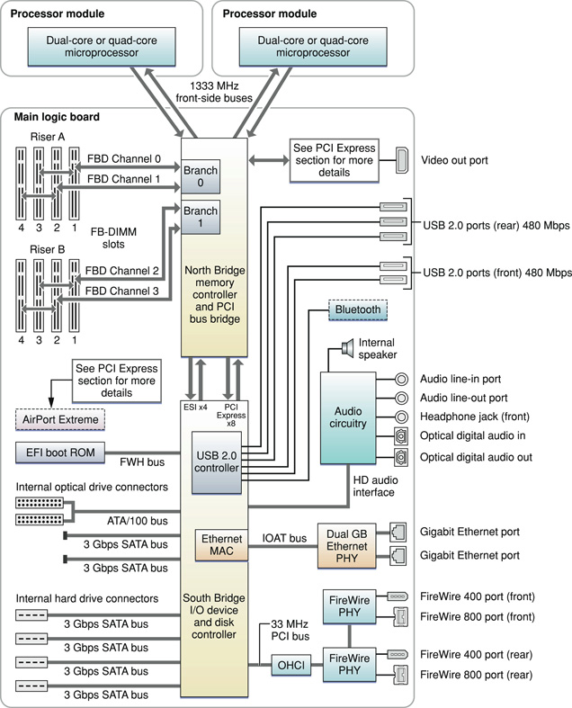

> 导航：[总目录](../../../README.md) · [documentation](../../../_indexes/documentation.md) · [Mac Pro Developer Note](Introduction%20to%20Mac%20Pro%20Developer%20Note.md)

[Next](Document%20Revision%20History.md)[Previous](Introduction%20to%20Mac%20Pro%20Developer%20Note.md)

# Mac Pro Developer Note

This Developer Note describes the Mac Pro introduced in August 2006 and the added configure-to-order 8-core processor option introduced in April 2007. It includes information about distinguishing features of the computer, including components on the main logic board: the microprocessors, the North Bridge memory controller, the South Bridge I/O controller, and the buses that connect them to each other and to the I/O interfaces.

The computer comes with Mac OS X version 10.4.9 installed.

The quad-core Mac Pro consists of two Dual-Core Intel Xeon “Woodcrest” 5100 Series processors. The 8-core Mac Pro consists of two Quad-Core Intel Xeon “Clovertown” 5300 Series processors.

The value of the computer model machine identifier string is `MacPro1,1` for quad-core machines and `MacPro2,1` for 8-core machines.

For a description and graphical depiction of the Mac Pro enclosure and its ports and connectors, refer to the _Mac Pro User Guide_ that shipped with your computer.

The architecture of the Mac Pro is based on two Quad-Core or two Dual-Core Intel Xeon processors, the North Bridge memory controller, and the South Bridge I/O controller, as shown in the simplified block diagram in [Figure 1](#apple-f4xwc4dqnrsv64tfmyxwi33df52wszbpkridimbqga2tenbqfvbegskhifaugsq).

__Figure 1__  Mac Pro Block diagram

The Mac Pro computer includes a programmable Apple Mighty Mouse and Apple Keyboard. For a complete list of user-visible features, see the Mac Pro specification sheet at Apple's [Specifications](http://www.info.apple.com/support/applespec.html) site. Other features are described in this section.

The microprocessors in the Mac Pro are two Quad-Core Intel Xeon “Clovertown” 5300 Series processors or two Dual-Core Intel Xeon “Woodcrest” 5100 Series processors. The features are as follows.

- two 2.66 GHz Dual-Core Intel Xeon “Woodcrest” 5100 Series processors or the following configure-to-order options:

  - two 2.0 GHz Dual-Core Intel Xeon “Woodcrest” 5100 Series processors
  - two 3.0 GHz Dual-Core Intel Xeon “Woodcrest” 5100 Series processors
  - two 3.0 GHz Quad-Core Intel Xeon “Clovertown” 5300 Series processors
- Quad-Core Intel Xeon: 8 MB L2 cache per processor, 4 MB shared per pair of cores, 16 MB per 8-core Mac Pro system
- Dual-Core Intel Xeon: 4 MB shared L2 cache per processor, 8 MB per quad-core Mac Pro system
- Intel Advanced Digital Media Boost
- Connection to the North Bridge IC over a 1333 MHz frontside bus
- Supports Intel Extended Memory 64 Technology (EM64T)

For detailed microprocessor documentation, see the [Intel Xeon Processor 5300 Series](http://www.intel.com/products/processor/xeon/index.htm#5300) support site for the processors in an 8-core Mac Pro and the [Intel Xeon Processor 5100 Series](http://www.intel.com/design/intarch/dualcorexeon/5100/index.htm) support site for the processors in a quad-core Mac Pro.

Intel Advanced Digital Media Boost accelerates data manipulation by applying a single instruction to multiple data at the same time, known as SIMD processing. SIMD technology accelerates vector math operations and floating-point calculations. Advanced Digital Media Boost supports Intel Streaming SIMD Extensions (SSE) versions 1, 2, and 3 and allows the processor to execute an SSE3 instruction every clock cycle.

For information on Advanced Digital Media Boost, refer to [Technology@Intel Magazine](http://www.intel.com/technology/magazine/computing/core-architecture-0306.htm?iid=hwd_center+coremicroww18&).

When the Mac Pro is executing a 64-bit application, EM64T provides the following features:

- Virtual 64-bit addressing significantly increases the amount of physical memory that can be addressed, enabling larger sets to be stored in memory for faster processor operation.
- Extended 64-bit registers allow single operations with integers larger than 32-bits and enable 64-bit addressing.
- Eight new general purpose registers improve performance on recompiled applications.
- Eight new SIMD registers improve multimedia performance on recompiled applications.

For information on EM64T, refer to the following website:

[http://www.intel.com/technology/64bitextensions/](http://www.intel.com/technology/64bitextensions/)

The dual, independent processor buses run at 1333 MHz and connect the processors to the North Bridge. Each front-side bus has a 64-bit wide data bus. Each processor has 64-bit addressing.

The point-to-point architecture provides each subsystem with dedicated bandwidth to main memory. The North Bridge IC implements an independent processor interface. The input clock to the processor PLL is 333 MHz.

The Mac Pro comes standard with two 512 MB (total 1 GB) of 667 MHz (PC2-5300) SDRAM Fully-Buffered DIMM (FB-DIMM) memory. Memory is connected to the North Bridge via two 128-bit channels (256 bit). Each channel services two memory slots via the Advanced Memory Buffers (AMB) using FB-DIMMs. For additional information, refer to _[RAM Expansion Developer Note](../RAM%20Expansion%20Developer%20Note/Introduction%20to%20RAM%20Expansion%20Developer%20Note.md#apple-f4xwc4dqnrsv64tfmyxwi33df52wszbpkridimbqgaztamzr)_.

The North Bridge and South Bridge ICs are connected by an Enterprise Southbridge Interface (ESI) bus, a high-speed, bidirectional, point-to-point link supporting a thruput of 1 GBps in each direction.

The Extensible Firmware Interface (EFI) boot ROM consists of 2 MB of on-board flash EEPROM. It includes the hardware-specific code and tables needed to start up the computer, load an operating system, and provide common hardware access services.The EFI boot ROM connects to the South Bridge IC via the Firmware hub (FWH) bus.

The Mac Pro has four internal, 2.5 GHz, PCI Express links connected to the North Bridge IC and South Bridge IC. The PCI Express slots are system and user configurable. The Mac Pro’s standard configuration is one 16-lane, double-wide graphics slot, two 4-lane expansion slots, and one 1-lane expansion slot.

For information on PCI Express and the configuration options, refer to _[PCI Developer Note](../../Hardware/PCI%20Developer%20Note/Introduction%20to%20PCI%20Developer%20Note.md#apple-f4xwc4dqnrsv64tfmyxwi33df52wszbpkridimbqgaztamrx)_.

The standard configuration graphics subsystem on the Mac Pro is the Nvidia GeForce 7300 GT card with 256 MB GDDR2 SDRAM, connected to the North Bridge IC by a x16 link (16 lane), 2.5 GHz PCI Express bus. The configuration supports two DVI ports for external video monitors and supports video mirroring mode and extended desktop display mode.

The ATI Radeon X1900 XT and Nvidia Quadro FX 4500 are available as configure-to-order options.

For information on the configure-to-order options, the graphics subsystem, and the display capabilities, refer to _[Video Developer Note](../../Hardware/Video%20Developer%20Note/Introduction%20to%20Video%20Developer%20Note.md#apple-f4xwc4dqnrsv64tfmyxwi33df52wszbpkridimbqgaztkmbu)_.

For information on the PCI Express bus that supports the graphics subsystem and the PCI Express power constraints, refer to _[PCI Developer Note](../../Hardware/PCI%20Developer%20Note/Introduction%20to%20PCI%20Developer%20Note.md#apple-f4xwc4dqnrsv64tfmyxwi33df52wszbpkridimbqgaztamrx)_.

The Mac Pro comes standard with one 7200 rpm, 3 Gbps Serial ATA (SATA) disk drive and three additional 3 Gbps SATA slots for adding hard disk drives. The SATA drives interface through an AHCI 1.1 controller that supports advanced SATA-II features Native Command Queuing (NCQ) and PHY power management. NCQ increases performance on random workloads by allowing the drive to re-order commands to reduce seek time and increase transactional efficiency.

In addition, the Mac Pro has two unpopulated 3 Gbps SATA buses for expansion.

For more information on SATA, see [Serial ATA International Organization](http://www.serialata.org/).

For information on the AHCI controller, see [AHCI Specifications](http://www.intel.com/technology/serialata/ahci.htm).

In the Mac Pro, the South Bridge controller provides two Ultra ATA/100 interfaces for optical drives. The Mac Pro comes standard with one SuperDrive. The drive can read and write DVD media and CD media, as shown in [Table 1](#apple-f4xwc4dqnrsv64tfmyxwi33df52wszbpkridimbqga2tenbqfvjvona).

__Table 1__  Types of media read and written by the SuperDrive

| Media type | Reading speed | Writing speed |
| DVD+/-R | 12x (CAV max) | 16x, 8x, 4x, 2x, 1x (CLV) single-layer, depending on media |
| DVD+R DL | 8x (CAV max) | 8x ,6x, 4x, 2.4x (CLV) double-layer, depending on media |
| DVD-ROM | 16x DVD5 (CAV max); 12x DVD9 (CAV max) | – |
| DVD-RW | 8x (CAV max) | 6x, 4x, 2x, 1x (CLV) depending on media |
| DVD+RW | 8x (CAV max) | 8x, 4x, 2.4x (CLV) depending on media |
| CD-R | 32x (CAV max) | 32x PCAV |
| CD-RW | 32x (CAV max) | 24x ZCLV (high speed media) |
| CD-ROM | 32x (CAV max) | – |

The standard SuperDrive and second optical drive, if added, are configured as cable select and compliy with the ATA/ATAPI-5 industry standard. For information on parallel ATA interfaces, see the International Committee on Information Technology Standards (INCITS) Technical Committee T13 [AT Attachment](http://www.t13.org/) website.

The Mac Pro has two IEEE-1394a FireWire 400 ports, which support transfer rates of 100, 200, and 400 Mbps and two IEEE-1394b FireWire 800 ports, which support transfer rates of 100, 200, 400, and 800 Mbps. For more information, see _[FireWire Developer Note](../FireWire%20Developer%20Note/Introduction%20to%20FireWire%20Developer%20Note.md#apple-f4xwc4dqnrsv64tfmyxwi33df52wszbpkridimbqgaztamry)_.

The Mac Pro has built-in dual Gigabit Ethernet ports with jumbo frame support for 10BASE-T/UTP, 100BASE-TX, and 1000BASE-T operation.The Ethernet MAC is internal to the South Bridge and interfaces via the I/O Acceleration Technology (IOAT) bus. For more information, see _[Ethernet Developer Note](../Ethernet%20Developer%20Note/Introduction%20to%20Ethernet%20Developer%20Note.md#apple-f4xwc4dqnrsv64tfmyxwi33df52wszbpkridimbqgaztamrz)_.

The South Bridge IC includes an integrated USB 2.0 controller supporting five external USB 2.0 ports and the optional Bluetooth module. The USB ports comply with the Universal Serial Bus Specification 2.0. For more information, see _[Universal Serial Bus Developer Note](../Universal%20Serial%20Bus%20Developer%20Note/Introduction%20to%20Universal%20Serial%20Bus%20Developer%20Note.md#apple-f4xwc4dqnrsv64tfmyxwi33df52wszbpkridimbqgaztamrw)_.

The Mac Pro computer has an optional, internal AirPort Extreme module connected to a dedicated 1-lane PCI Express bus. The AirPort Extreme module is available as a fully-integrated configure-to-order option or as an Apple Authorized Service Provider kit, which can be installed by an Apple retail store or an Apple Authorized Service Provider. For more information, see _[AirPort Developer Note](../AirPort%20Developer%20Note/Introduction%20to%20AirPort%20Developer%20Note.md#apple-f4xwc4dqnrsv64tfmyxwi33df52wszbpkridimbqgaztamzq)_.

The Mac Pro computer has an optional, internal Bluetooth 2.0 + EDR (enhanced data rate) module, with an antenna built into the enclosure. The Bluetooth module is connected via the internal USB 2.0 controller. The Bluetooth module is available as a fully-integrated configure-to-order option or as an Apple Authorized Service Provider kit, which can be installed by an Apple retail store or an Apple Authorized Service Provider. For more information, see _[Bluetooth Developer Note](../Bluetooth%20Developer%20Note/Introduction%20to%20Bluetooth%20Developer%20Note.md#apple-f4xwc4dqnrsv64tfmyxwi33df52wszbpkridimbqgaztamzs)_.

The Mac Pro audio subsystem consists of both analog and digital audio interfaces. The analog interfaces are comprised of the internal speaker, headphones, line-output port, and line-input port. The headphones, line output and line input each have a 1/8" stereo mini-jack connection. The digital interfaces are comprised of optical digital input and optical digital output. The digital interface complies with the Sony/Philips Digital Interface (S/PDIF) and connects via Toslink Optical (F-05) connectors.

For more information, see _[Audio Developer Note](../../Hardware/Audio%20Developer%20Note/Introduction%20to%20Audio%20Developer%20Note.md#apple-f4xwc4dqnrsv64tfmyxwi33df52wszbpkridimbqgaztkmbv)_.

The Mac Pro uses an advanced system management controller (SMC) to manage thermal and power conditions, while keeping the acoustic noise to a minimum. The SMC is fully independent of the operating system.

[Next](Document%20Revision%20History.md)[Previous](Introduction%20to%20Mac%20Pro%20Developer%20Note.md)

