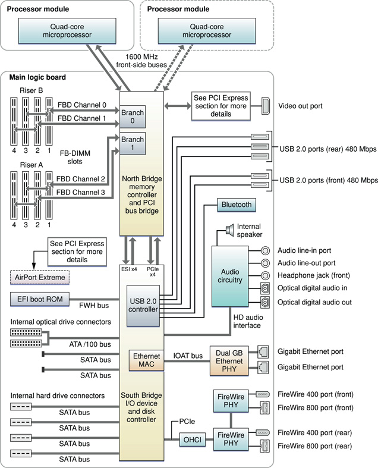

> 导航：[总目录](../../../README.md) · [documentation](../../../_indexes/documentation.md) · [Mac Pro Developer Note](Introduction%20to%20Mac%20Pro%20Developer%20Note.md)

[Next](Document%20Revision%20History.md)[Previous](Introduction%20to%20Mac%20Pro%20Developer%20Note.md)

# Mac Pro Developer Note

This Developer Note describes the Mac Pro computer introduced in January 2008. It includes information about distinguishing features of the computer, including components on the main logic board: the microprocessors, the North Bridge memory controller, the South Bridge I/O controller, and the buses that connect them to each other and to the I/O interfaces.

The computer comes with Mac OS X version 10.5.1 or later installed.

The quad-core Mac Pro consists of one Quad-Core Intel Xeon “Harpertown” 5400 Series processor. The 8-core Mac Pro consists of two Quad-Core Intel Xeon “Harpertown” 5400 Series processors.

The value of the computer model machine identifier string is `MacPro3,1`.

For a description and graphical depiction of the Mac Pro enclosure and its ports and connectors, refer to the _Mac Pro User Guide_ that shipped with your computer.

The architecture of the Mac Pro is based on one or two Quad-Core Intel Xeon 5400 Series processors, the North Bridge memory controller, and the South Bridge I/O controller, as shown in the simplified block diagram in [Figure 1](#apple-f4xwc4dqnrsv64tfmyxwi33df52wszbpkridsmbqga2tenbsfvbegskhifaugsq).

__Figure 1__  Mac Pro Block diagram

The Mac Pro computer includes a programmable Apple Mighty Mouse and Apple Keyboard. For a complete list of user-visible features, see the Mac Pro specification sheet at Apple's [Specifications](http://www.info.apple.com/support/applespec.html) site. Other features are described in this section.

The microprocessors in the Mac Pro are Quad-Core Intel Xeon “Harpertown” 5400 Series processors. The features are as follows.

- Standard configuration consists of two 2.8 GHz processors for an 8-core system
- Configure-to-order options are as follows:

  - one 2.8 GHz processor for a quad-core system
  - two 3.0 GHz processors for an 8-core system
  - two 3.2 GHz processors for an 8-core system
- 12 MB L2 cache per processor (6 MB shared per pair of cores)
- Intel Advanced Digital Media Boost
- Connection to the North Bridge IC over a 1600 MHz frontside bus
- Supports Intel Extended Memory 64 Technology (EM64T)
- Supports Intel Virtualization Technology

For detailed microprocessor documentation, see the [Intel Xeon Processor 5000 Sequence](http://www.intel.com/products/processor/xeon5000/index.htm#5300) support site.

Intel Advanced Digital Media Boost accelerates data manipulation by applying a single instruction to multiple data at the same time, known as SIMD processing. SIMD technology accelerates vector math operations and floating-point calculations. Advanced Digital Media Boost supports Intel Streaming SIMD Extensions (SSE) versions 1, 2, 3, and 4 and allows the processor to execute most 128-bit instructions every clock cycle.

For information on Advanced Digital Media Boost, refer to [Technology@Intel Magazine](http://www.intel.com/technology/magazine/computing/core-architecture-0306.htm?iid=hwd_center+coremicroww18&).

SSE4 offers over 50 additional instructions in two major categories:

- SSE4 Vectorizing Compiler and Media Accelerators
- SSE4 Efficient Accelerated String and Text Processing

For information on SSE4, refer to the [Intel Streaming SIMD Extensions 4 (SSE4) Instruction Set Innovation](http://www.intel.com/technology/architecture-silicon/sse4-instructions/index.htm) support site

When the Mac Pro is executing a 64-bit application, [EM64T](http://www.intel.com/technology/architecture-silicon/intel64/index.htm) provides the following features:

- Virtual 64-bit addressing significantly increases the amount of physical memory that can be addressed, enabling larger sets to be stored in memory for faster processor operation.
- Extended 64-bit registers allow single operations with integers larger than 32-bits and enable 64-bit addressing.
- Eight general purpose registers improve performance on recompiled applications.
- Eight SIMD registers improve multimedia performance on recompiled applications.

The dual, independent processor buses run at 1600 MHz and connect the processors to the North Bridge. Each front-side bus has a 64-bit wide data bus. Each processor has 64-bit addressing.

The point-to-point architecture provides each subsystem with dedicated bandwidth to main memory. The North Bridge IC implements an independent processor interface with an internal 24 MB snoop filter which maintains an index of all cached data in each processor. Using a management algorithm to look up memory accesses, the North Bridge IC services all processor snoops, eliminating extra snoop traffic on the FSB. This significantly reduces data traffic on the FSB, providing lower latencies and greater available bandwidth.

The input clock to the processor PLL is 400 MHz.

The Mac Pro comes standard with 2 GB (2 x 1 GB) of 800 MHz (PC2-6400) DDR2 SDRAM Fully-Buffered DIMM (FB-DIMM) memory. Memory is connected to the North Bridge via two 128-bit channels (256 bit). Each channel services two memory slots via the Advanced Memory Buffers (AMB) using FB-DIMMs. For additional information, refer to _[RAM Expansion Developer Note](../RAM%20Expansion%20Developer%20Note/Introduction%20to%20RAM%20Expansion%20Developer%20Note.md#apple-f4xwc4dqnrsv64tfmyxwi33df52wszbpkridimbqgaztamzr)_.

The North Bridge and South Bridge ICs are connected by an Enterprise Southbridge Interface (ESI) bus, a high-speed, bidirectional, point-to-point link supporting a thruput of 1 GBps in each direction.

The Extensible Firmware Interface (EFI) boot ROM consists of 2 MB of on-board flash EEPROM. It includes the hardware-specific code and tables needed to start up the computer, load an operating system, and provide common hardware access services. The EFI boot ROM connects to the South Bridge IC via the Firmware hub (FWH) bus.

The Mac Pro has four internal PCI Express (PCIe) links connected to the North Bridge IC and South Bridge IC. Two of the links provide 4-lane expansion slots supporting the PCIe 1.0a standard at 2.5 GHz. The other two links provide 16-lane 5.0 GHz PCIe 2.0 interfaces: one double-wide graphics slot and one expansion slot.

For information on PCI Express and the configuration options, refer to _[PCI Developer Note](../../Hardware/PCI%20Developer%20Note/Introduction%20to%20PCI%20Developer%20Note.md#apple-f4xwc4dqnrsv64tfmyxwi33df52wszbpkridimbqgaztamrx)_.

The Mac Pro graphics subsystem connects to the North Bridge IC by a x16 link (16-lane), 5.0 GHz PCIe 2.0 bus. Supported graphics card have two DVI ports for external video monitors and support video mirroring mode and extended desktop display mode.

For information the graphics subsystem, refer to _[Video Developer Note](../../Hardware/Video%20Developer%20Note/Introduction%20to%20Video%20Developer%20Note.md#apple-f4xwc4dqnrsv64tfmyxwi33df52wszbpkridimbqgaztkmbu)_.

For information on the PCI Express bus that supports the graphics subsystem and the PCI Express power constraints, refer to _[PCI Developer Note](../../Hardware/PCI%20Developer%20Note/Introduction%20to%20PCI%20Developer%20Note.md#apple-f4xwc4dqnrsv64tfmyxwi33df52wszbpkridimbqgaztamrx)_.

The Mac Pro comes standard with one 7200 rpm, Serial ATA (SATA) 3 Gb/s hard drive and three additional hard drive bays. The SATA drives interface through an AHCI 1.1 controller that supports advanced SATA 3 Gb/s features Native Command Queuing (NCQ) and PHY power management. NCQ increases performance on random workloads by allowing the drive to re-order commands to reduce seek time and increase transactional efficiency.

In addition, the Mac Pro has two unpopulated 3 Gb/s SATA buses for expansion.

Available as an option is the Mac Pro RAID card, which can be installed in PCIe slot 4. The Mac Pro RAID card provides hardware RAID levels 0, 1, 5, and 0+1, and features 256 MB of RAID cache and a 72-hour cache-protecting battery. The Mac Pro RAID card is compatible with SATA 3 Gb/s drives installed in drive bays 1 through 4. In addition, the Mac Pro RAID card brings support for 15,000 rpm Serial Attached SCSI (SAS) 3 Gb/s hard drives to the internal drive bays. SAS 3 Gb/s hard drives require the Mac Pro RAID card.

For more information on SATA, see [Serial ATA International Organization](http://www.serialata.org/).

For information on the AHCI controller, see [AHCI Specifications](http://www.intel.com/technology/serialata/ahci.htm).

In the Mac Pro, the South Bridge controller provides two Ultra ATA/100 interfaces for optical drives. The Mac Pro comes standard with one SuperDrive. The drive can read and write DVD media and CD media, as shown in [Table 1](#apple-f4xwc4dqnrsv64tfmyxwi33df52wszbpkridsmbqga2tenbsfvjvona).

__Table 1__  Types of media read and written by the SuperDrive

| Media type | Reading speed | Writing speed |
| DVD+/-R | 16x (CAV max) | 16x, 8x, 4x, 2x, 1x (CLV) single-layer, depending on media |
| DVD+/-R DL | 16x (CAV max) | 8x, 6x, 4x, 2.4x (CLV) double-layer, depending on media |
| DVD-ROM | 16x DVD5 (CAV max); 12x DVD9 (CAV max) | – |
| DVD-RW | 16x (CAV max) | 6x, 4x, 2x, 1x (CLV) depending on media |
| DVD+RW | 16x (CAV max) | 8x, 6x, 4x, 2.4x (CLV) depending on media |
| CD-R | 32x (CAV max) | 32x PCAV |
| CD-RW | 32x (CAV max) | 32x ZCLV (high speed media) |
| CD-ROM | 32x (CAV max) | – |

The standard SuperDrive and second optical drive, if added, are configured as cable select and comply with the ATA/ATAPI-5 industry standard. For information on parallel ATA interfaces, see the International Committee on Information Technology Standards (INCITS) Technical Committee T13 [AT Attachment](http://www.t13.org/) website.

The Mac Pro has two IEEE-1394a FireWire 400 ports, which support transfer rates of 100, 200, and 400 Mbps and two IEEE-1394b FireWire 800 ports, which support transfer rates of 100, 200, 400, and 800 Mbps. For more information, see _[FireWire Developer Note](../FireWire%20Developer%20Note/Introduction%20to%20FireWire%20Developer%20Note.md#apple-f4xwc4dqnrsv64tfmyxwi33df52wszbpkridimbqgaztamry)_.

The Mac Pro has built-in dual Gigabit Ethernet ports with jumbo frame support for 10BASE-T/UTP, 100BASE-TX, and 1000BASE-T operation. The Ethernet MAC is internal to the South Bridge and interfaces via the I/O Acceleration Technology (IOAT) bus. For more information, see _[Ethernet Developer Note](../Ethernet%20Developer%20Note/Introduction%20to%20Ethernet%20Developer%20Note.md#apple-f4xwc4dqnrsv64tfmyxwi33df52wszbpkridimbqgaztamrz)_.

The South Bridge IC includes an integrated USB 2.0 controller supporting five external USB 2.0 ports and the Bluetooth module. The USB ports comply with the Universal Serial Bus Specification 2.0. For more information, see _[Universal Serial Bus Developer Note](../Universal%20Serial%20Bus%20Developer%20Note/Introduction%20to%20Universal%20Serial%20Bus%20Developer%20Note.md#apple-f4xwc4dqnrsv64tfmyxwi33df52wszbpkridimbqgaztamrw)_.

The Mac Pro computer has an optional, internal AirPort Extreme module connected to a dedicated 1-lane PCI Express bus. The AirPort Extreme module is available as a fully-integrated configure-to-order option or as an Apple Authorized Service Provider kit, which can be installed by an Apple retail store or an Apple Authorized Service Provider. For more information, see _[AirPort Developer Note](../AirPort%20Developer%20Note/Introduction%20to%20AirPort%20Developer%20Note.md#apple-f4xwc4dqnrsv64tfmyxwi33df52wszbpkridimbqgaztamzq)_.

The Mac Pro computer has an internal Bluetooth 2.0 + EDR (enhanced data rate) module, with an antenna built into the enclosure. The Bluetooth module is connected via the internal USB 2.0 controller. For more information, see _[Bluetooth Developer Note](../Bluetooth%20Developer%20Note/Introduction%20to%20Bluetooth%20Developer%20Note.md#apple-f4xwc4dqnrsv64tfmyxwi33df52wszbpkridimbqgaztamzs)_.

The Mac Pro audio subsystem consists of both analog and digital audio interfaces. The analog interfaces are comprised of the internal speaker, headphones, line-output port, and line-input port. The headphones, line output and line input each have a 1/8" stereo mini-jack connection. The digital interfaces are comprised of optical digital input and optical digital output. The digital interface complies with the Sony/Philips Digital Interface (S/PDIF) and connects via Toslink Optical (F-05) connectors.

For more information, see _[Audio Developer Note](../../Hardware/Audio%20Developer%20Note/Introduction%20to%20Audio%20Developer%20Note.md#apple-f4xwc4dqnrsv64tfmyxwi33df52wszbpkridimbqgaztkmbv)_.

The Mac Pro uses an advanced system management controller (SMC) to manage thermal and power conditions, while keeping the acoustic noise to a minimum. The SMC is fully independent of the operating system.

The Mac Pro provides independent port over-current protection, such that an over-current or short-circuit condition on one port will not affect any of the other ports, as long as the total power available to the ports is not exceeded. When in sleep, the Mac Pro has 25 W of power available to the USB and FireWire ports, and memory. If the combined USB and FireWire port power load exceeds the available power, power to those ports will be cut to preserve memory.

[Next](Document%20Revision%20History.md)[Previous](Introduction%20to%20Mac%20Pro%20Developer%20Note.md)

