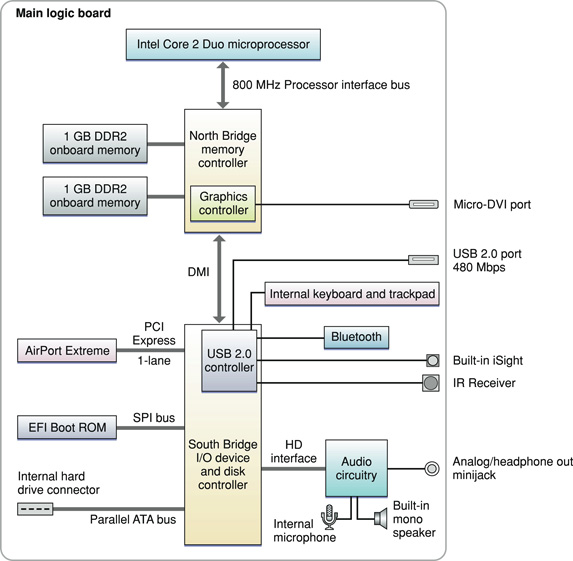

> 导航：[总目录](../../../README.md) · [documentation](../../../_indexes/documentation.md) · [MacBook Air Developer Note](Introduction%20to%20MacBook%20Air%20Developer%20Note.md)

[Next](Document%20Revision%20History.md)[Previous](Introduction%20to%20MacBook%20Air%20Developer%20Note.md)

# MacBook Air Developer Note

This note describes the MacBook Air computer based on the 1.6 GHz or optional 1.8 GHz Intel Core 2 Duo microprocessor, introduced in January 2008. It includes information about distinguishing features of the computer, including components on the main logic board: the microprocessor, the other main ICs, and the buses that connect them to each other and to the I/O interfaces.

The MacBook Air comes with Mac OS X version 10.5.1 or later installed.

The value of the MacBook Air model identifier string is `MacBook Air1,1`.

The architecture of the MacBook Air is based on the Intel Core 2 Duo microprocessor and two ICs, the North Bridge memory controller and the South Bridge I/O controller, connected to each other by a Direct Media Interface (DMI) bus. The North Bridge provides the bridging functionality among the processor, the memory system, and the DMI. The South Bridge supports these components:

- Parallel ATA (PATA) bus for the hard disk drive or the optional solid state drive
- 1-lane PCI Express link for the AirPort Extreme module
- SPI bus, direct memory access bus to the boot ROM
- USB 2.0 controller, which in turn supports the Bluetooth 2.1 + EDR module, built-in iSight camera, built-in trackpad and keyboard, and one external, high-powered USB 2.0 port
- Channel to the audio subsystem

A DMA controller internal to the South Bridge supports LPC DMA (low pin count direct memory access). The DMA controller has registers that are fixed in the lower 64 KB of I/O space. The DMA controller is configured using registers in the PCI configuration space.

Figure 1 provides a simplified block diagram of the North Bridge, South Bridge, and the buses that connect them together.

__Figure 1__  Block diagram

The MacBook Air includes a built-in iSight video camera, built-in IR receiver, and a micro-DVI port. The Apple Remote, which provides remote control of Front Row and Keynote, is sold separately. For a complete list of user-visible features, see the MacBook Air specification sheet at Apple's [Specifications](http://www.info.apple.com/support/applespec.html) site. Other features are described in this section.

The microprocessor in the MacBook Air is an Intel Core 2 Duo with the following features:

- 1.6 GHz Intel Core 2 Duo microprocessor
- Optional 1.8 GHz Intel Core 2 Duo microprocessor
- 4 MB shared, on-chip L2 cache
- Intel Advanced Digital Media Boost
- Connection to the North Bridge over an 800 MHz frontside bus
- Supports Intel 64 Architecture

See the [Intel Core 2 Duo Processors](http://www.intel.com/products/processor/core2duo/index.htm) support site for detailed microprocessor documentation.

Intel Advanced Digital Media Boost accelerates data manipulation by applying a single instruction to multiple data at the same time, known as SIMD processing. SIMD technology accelerates vector math operations and floating-point calculations. Advanced Digital Media Boost supports Intel Streaming SIMD Extensions (SSE) versions 1, 2, and 3 and allows the processor to execute most 128-bit instructions every clock cycle.

For information on Advanced Digital Media Boost, refer to [Technology@Intel Magazine](http://www.intel.com/technology/magazine/computing/core-architecture-0306.htm?iid=hwd_center+coremicroww18&).

[Intel 64 Architecture](http://www.intel.com/technology/architecture-silicon/intel64/index.htm) increases the linear address space for software to 64 bits and supports physical address space up to 40 bits. The technology also introduces a new operating mode referred to as IA-32e mode. IA-32e mode operates in one of two sub-modes:

- Compatibility mode enables a 64-bit operating system to run most legacy 32-bit software unmodified
- 64-bit mode enables a 64-bit operating system to run applications written to access 64-bit address space

In the 64-bit mode, applications may access:

- 64-bit flat linear addressing
- 8 additional general-purpose registers (GPRs)
- 8 additional registers for streaming SIMD extensions (SSE, SSE2, and SSSE3)
- 64-bit-wide GPRs and instruction pointers
- Uniform byte-register addressing
- Fast interrupt-prioritization mechanism
- New instruction-pointer relative-addressing mode

An Intel 64 Architecture processor supports existing IA-32 software because it is able to run all non-64-bit legacy modes supported by IA-32 architecture. Most existing IA-32 applications also run in compatibility mode.

The processor bus is an up-to-800 MHz bus connecting the processor to the North Bridge. The bus has 32-bit wide data running in both directions. The processor has 32-bit addressing.

The point-to-point architecture provides each subsystem with dedicated bandwidth to main memory. The North Bridge implements an independent processor interface. The input clock to the processor PLL is 200 MHz.

The MacBook Air provides 2 GB (2 x 1 GB) DDR2 PC2-5300-compliant, unbuffered, unregistered, 8-byte, nonparity, and non-ECC SO-DIMMs built onto the logic board. The memory is not expandable.

The North Bridge and South Bridge are connected by a Direct Media Interface (DMI) bus, a high-speed, bidirectional, point-to-point link supporting a clock rate of 1 GB per second in each direction.

The Extensible Firmware Interface (EFI) Boot ROM consists of 4 MB of on-board flash EEPROM. It includes the hardware-specific code and tables needed to start up the computer, load an operating system, and provide common hardware access services.The EFI Boot ROM connects to the South Bridge via Serial Peripheral Interface (SPI) bus.

Internal to the North Bridge is the Intel GMA X3100 graphics subsystem. The MacBook Air has a micro-DVI connector for an external video monitor. The MacBook Air ships with a micro-DVI to DVI adapter and a micro-DVI to VGA adapter. A micro-DVI to video adapter, which provides composite and S-video support, is sold separately. For more information on the graphics subsystem and display capabilities, refer to _[Video Developer Note](../../Hardware/Video%20Developer%20Note/Introduction%20to%20Video%20Developer%20Note.md#apple-f4xwc4dqnrsv64tfmyxwi33df52wszbpkridimbqgaztkmbu)_.

The MacBook Air comes with an 80 GB 4200 rpm Parallel ATA hard disk drive which supports Ultra DMA mode 5 transfers.

The PATA hard disk drive operates through an Intel ICH-8 controller. For information, refer to [Intel I/O Controller Hub 8 (ICH8) Family Datasheet](http://developer.intel.com/design/chipsets/datashts/313056.htm). For information PATA interfaces, refer to the International Committee on Information Technology Standards (INCITS) Technical Committee [T13 AT Attachment](http://www.t13.org/) website

The MacBook Air is available with an optional 64 GB solid state drive with a formatted capacity of 60 GB.

The South Bridge includes an integrated USB 2.0 controller supporting the Bluetooth 2.1 + EDR module, built-in iSight camera, built-in trackpad and keyboard, and a high-powered, external, USB 2.0 port. The USB ports comply with the Universal Serial Bus Specification 2.0. For more information, see _[Universal Serial Bus Developer Note](../Universal%20Serial%20Bus%20Developer%20Note/Introduction%20to%20Universal%20Serial%20Bus%20Developer%20Note.md#apple-f4xwc4dqnrsv64tfmyxwi33df52wszbpkridimbqgaztamrw)_.

The external USB port can be used to connect an external optical disc drive, a USB to Ethernet adapter, modem, iPod, mouse, keyboard, and other USB 2.0 or USB 1.1 devices.

The MacBook Air has an internal AirPort Extreme module, connected to the South Bridge via a dedicated 1-lane PCI Express link. Bluetooth 2.1 + EDR (enhanced data rate) module is connected to the USB 2.0 controller in the South Bridge. AirPort Extreme and Bluetooth have independent built-in antennas. For more information, see _[AirPort Developer Note](../AirPort%20Developer%20Note/Introduction%20to%20AirPort%20Developer%20Note.md#apple-f4xwc4dqnrsv64tfmyxwi33df52wszbpkridimbqgaztamzq)_ and _[Bluetooth Developer Note](../Bluetooth%20Developer%20Note/Introduction%20to%20Bluetooth%20Developer%20Note.md#apple-f4xwc4dqnrsv64tfmyxwi33df52wszbpkridimbqgaztamzs)_.

For more information on PCI Express, refer to _[PCI Developer Note](../../Hardware/PCI%20Developer%20Note/Introduction%20to%20PCI%20Developer%20Note.md#apple-f4xwc4dqnrsv64tfmyxwi33df52wszbpkridimbqgaztamrx)_.

The computer has a built-in mono speaker, an omni-directional microphone, and an analog headphone output minijack. For more information, see _[Audio Developer Note](../../Hardware/Audio%20Developer%20Note/Introduction%20to%20Audio%20Developer%20Note.md#apple-f4xwc4dqnrsv64tfmyxwi33df52wszbpkridimbqgaztkmbv)_.

The MacBook Air uses an advanced system management controller (SMC) to manage thermal and power conditions, while keeping the acoustic noise to a minimum. The SMC is fully independent of the operating system.

[Next](Document%20Revision%20History.md)[Previous](Introduction%20to%20MacBook%20Air%20Developer%20Note.md)

