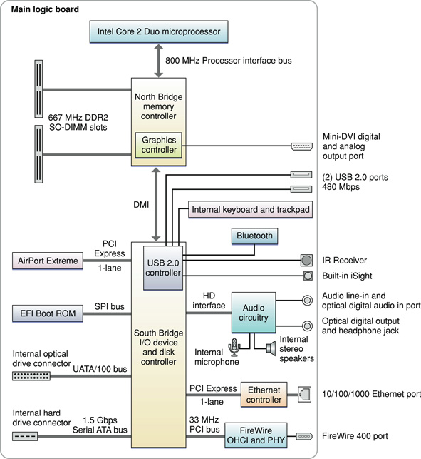

> 导航：[总目录](../../../README.md) · [documentation](../../../_indexes/documentation.md) · [MacBook Developer Note](Introduction%20to%20MacBook%20Developer%20Note.md)

[Next](Document%20Revision%20History.md)[Previous](Introduction%20to%20MacBook%20Developer%20Note.md)

# MacBook Developer Note

This note describes the MacBook computers based on the 2.0 GHz and 2.2 GHz Intel Core 2 Duo microprocessor, introduced in November 2007. It includes information about distinguishing features of the computer, including components on the main logic board: the microprocessor, the other main ICs, and the buses that connect them to each other and to the I/O interfaces.

The computer comes with Mac OS X version 10.5 installed.

The value of the MacBook model identifier string is `MacBook3,1`.

The architecture of the MacBook is based on the Intel Core 2 Duo microprocessor and two ICs, the North Bridge memory controller and the South Bridge I/O controller, connected to each other by a Direct Media Interface (DMI) bus. The North Bridge provides the bridging functionality among the processor, the memory system, and the DMI. The South Bridge supports these components:

- Ultra ATA/100 bus for the optical drive (running at UATA/66)
- A 1.5 Gbps Serial ATA (SATA) bus for the hard disk drive
- 1-lane PCI Express link for the AirPort Extreme module
- SPI bus, direct memory access bus to the boot ROM
- USB 2.0 controller, which in turn supports the Bluetooth module, IR receiver, built-in iSight camera, built-in trackpad and keyboard, and 2 external USB 2.0 ports
- Channel to the audio subsystem
- 1-lane PCI Express link for the Ethernet PHY
- 33 MHz, 32-bit internal PCI bus to the FireWire 400 (1394a) OHCI and PHY

A DMA controller internal to the South Bridge supports LPC DMA (low pin count direct memory access). The DMA controller has registers that are fixed in the lower 64 KB of I/O space. The DMA controller is configured using registers in the PCI configuration space.

Figure 1 provides a simplified block diagram of the North Bridge, South Bridge, and the buses that connect them together.

__Figure 1__  Block diagram

The MacBook computer includes a built-in iSight video camera, an integrated IR receiver, and the Apple Remote. For a complete list of user-visible features, see the MacBook specification sheet at Apple's [Specifications](http://www.info.apple.com/support/applespec.html) site. Other features are described in this section.

The microprocessor in the MacBook is an Intel Core 2 Duo with the following features:

- 2.0 GHz or 2.2 GHz Intel Core 2 Duo microprocessor
- 4 MB shared, on-chip L2 cache for all configurations
- Intel Advanced Digital Media Boost
- Connection to the North Bridge over an 800 MHz frontside bus
- Supports Intel 64 Architecture

See the [Intel Core 2 Duo Processors](http://www.intel.com/products/processor/core2duo/index.htm) support site for detailed microprocessor documentation.

Intel Advanced Digital Media Boost accelerates data manipulation by applying a single instruction to multiple data at the same time, known as SIMD processing. SIMD technology accelerates vector math operations and floating-point calculations. Advanced Digital Media Boost supports Intel Streaming SIMD Extensions (SSE) versions 1, 2, and 3 and allows the processor to execute an SSE3 instruction every clock cycle.

For information on Advanced Digital Media Boost, refer to [Technology@Intel Magazine](http://www.intel.com/technology/magazine/computing/core-architecture-0306.htm?iid=hwd_center+coremicroww18&).

[Intel 64 Architecture](http://www.intel.com/technology/architecture-silicon/intel64/index.htm) increases the linear address space for software to 64 bits and supports physical address space up to 40 bits. The technology also introduces a new operating mode referred to as IA-32e mode. IA-32e mode operates in one of two sub-modes:

- Compatibility mode enables a 64-bit operating system to run most legacy 32-bit software unmodified
- 64-bit mode enables a 64-bit operating system to run applications written to access 64-bit address space

In the 64-bit mode, applications may access:

- 64-bit flat linear addressing
- 8 additional general-purpose registers (GPRs)
- 8 additional registers for streaming SIMD extensions (SSE, SSE2, SSE3 and SSSE3)
- 64-bit-wide GPRs and instruction pointers
- Uniform byte-register addressing
- Fast interrupt-prioritization mechanism
- New instruction-pointer relative-addressing mode

An Intel 64 Architecture processor supports existing IA-32 software because it is able to run all non-64-bit legacy modes supported by IA-32 architecture. Most existing IA-32 applications also run in compatibility mode.

The processor bus is an up-to-800 MHz bus connecting the processor to the North Bridge. The bus has 32-bit wide data running in both directions. The processor has 32-bit addressing.

The point-to-point architecture provides each subsystem with dedicated bandwidth to main memory. The North Bridge implements an independent processor interface. The input clock to the processor PLL is 200 MHz.

The computer provides two RAM slots that accommodate 200-pin DDR2 SDRAM SO-DIMMs up to 1.25 inches in height. The SO-DIMMs must be DDR2 PC2-5300-compliant and must be unbuffered, unregistered, 8-byte, nonparity, and non-ECC. The MacBook ships with two 512 MB DDR2 SDRAM SO-DIMMs for a total of 1 GB. Maximum capacity is 4 GB. For additional information, refer to _[RAM Expansion Developer Note](../RAM%20Expansion%20Developer%20Note/Introduction%20to%20RAM%20Expansion%20Developer%20Note.md#apple-f4xwc4dqnrsv64tfmyxwi33df52wszbpkridimbqgaztamzr)_.

The North Bridge and South Bridge are connected by a Direct Media Interface (DMI) bus, a high-speed, bidirectional, point-to-point link supporting a clock rate of 1 GB per second in each direction.

The Extensible Firmware Interface (EFI) Boot ROM consists of 2 MB of on-board flash EEPROM. It includes the hardware-specific code and tables needed to start up the computer, load an operating system, and provide common hardware access services.The EFI Boot ROM connects to the South Bridge via Serial Peripheral Interface (SPI) bus.

Internal to the North Bridge is the Intel GMA X3100 graphics subsystem. The MacBook has a mini-DVI connector for an external video monitor. For more information on the graphics subsystem and display capabilities, refer to _[Video Developer Note](../../Hardware/Video%20Developer%20Note/Introduction%20to%20Video%20Developer%20Note.md#apple-f4xwc4dqnrsv64tfmyxwi33df52wszbpkridimbqgaztkmbu)_.

For more information on PCI Express, refer to _[PCI Developer Note](../../Hardware/PCI%20Developer%20Note/Introduction%20to%20PCI%20Developer%20Note.md#apple-f4xwc4dqnrsv64tfmyxwi33df52wszbpkridimbqgaztamrx)_.

The MacBook comes with a 5400 rpm Serial ATA (SATA) Gen-I (1.5 Gbps) hard disk drive, in the following configurations:

- 2.0 GHz MacBook: 80 GB (optionally 120 GB, 160 GB, or 250 GB)
- 2.2 GHz MacBook (white): 120 GB (optionally 160 GB or 250 GB)
- 2.2 GHz MacBook (black): 160 GB (optionally 250 GB)

The SATA hard disk drive operates through an AHCI 1.1 controller that supports advanced SATA-II features such as Native Command Queuing (NCQ) and PHY power management.

For more information on SATA, see the [Serial ATA International Organization](http://www.serialata.org/) (SATA-IO) website.

For information on the AHCI controller, see [http://www.intel.com/technology/serialata/ahci.htm](http://www.intel.com/technology/serialata/ahci.htm).

In the MacBook computer, the South Bridge controller provides an Ultra ATA/100 interface (running at UATA/66) to the slot-loading SuperDrive or Combo drive. The drive can read and write optical media, as shown in [Table 1](#apple-f4xwc4dqnrsv64tfmyxwi33df52wszbpkridsmbqga2dqnrufvjvomy) and [Table 2](#apple-f4xwc4dqnrsv64tfmyxwi33df52wszbpkridsmbqga2dqnrufvjvona).

The optical drive is configured as device 0 (master) and complies with the ATA/ATAPI-5 industry standard. For information on parallel ATA interfaces, see the International Committee on Information Technology Standards (INCITS) Technical Committee T13 [AT Attachment](http://www.t13.org/) website.

__Table 1__  Types of media read and written by the SuperDrive

| Media type | Reading speed | Writing speed |
| DVD +/- R | 8x (CAV) | 8x (CAV) |
| DVD+/-R DL | 6x (CAV) | 4x ZCLV |
| DVD-ROM | 8x (CAV) | - |
| DVD-ROM DL | 6x (CAV) | - |
| DVD +/- RW | 6x (CAV) | 4x ZCLV |
| CD-R | 24x (CAV) | 24x (CAV) |
| CD-RW | 24x (CAV) | 10x CLV (high speed or ultra speed media) |
| CD-ROM | 24x (CAV) | - |

__Table 2__  Types of media read and written by the Combo Drive

| Media type | Reading speed | Writing speed |
| DVD +/- R | 6x (CAV) | - |
| DVD+/-R DL | 5x (CAV) | - |
| DVD-ROM SL | 8x (CAV) (DVD-5) | - |
| DVD-ROM DL | 5x (CAV) (DVD-9) | - |
| DVD +/- RW | 5x (CAV) | - |
| CD-R | 24x (CAV) | 24x ZCLV |
| CD-RW | 24x (CAV) | 16x ZCLV (ultra speed media)  10x CLV (high speed media)  4x CLV (standard speed media) |
| CD-ROM | 24x (CAV) | - |

The computer has one IEEE-1394a FireWire 400 port, which supports transfer rates of 100, 200, and 400 Mbps. For more information, see _[FireWire Developer Note](../FireWire%20Developer%20Note/Introduction%20to%20FireWire%20Developer%20Note.md#apple-f4xwc4dqnrsv64tfmyxwi33df52wszbpkridimbqgaztamry)_.

The computer has a built in Ethernet port for a 10BASE-T/UTP, 100BASE-TX and 1000BASE-T Gigabit operation. For more information, see _[Ethernet Developer Note](../Ethernet%20Developer%20Note/Introduction%20to%20Ethernet%20Developer%20Note.md#apple-f4xwc4dqnrsv64tfmyxwi33df52wszbpkridimbqgaztamrz)_.

The South Bridge includes an integrated USB 2.0 controller supporting the Bluetooth module, IR receiver, built-in iSight camera, built-in trackpad and keyboard, and 2 external, high-powered USB 2.0 ports. The USB ports comply with the Universal Serial Bus Specification 2.0. For more information, see _[Universal Serial Bus Developer Note](../Universal%20Serial%20Bus%20Developer%20Note/Introduction%20to%20Universal%20Serial%20Bus%20Developer%20Note.md#apple-f4xwc4dqnrsv64tfmyxwi33df52wszbpkridimbqgaztamrw)_.

The MacBook computer has an internal AirPort Extreme module, connected to a dedicated 1-lane PCI Express link and a Bluetooth 2.0 + EDR (enhanced data rate) module, connected to the USB 2.0 controller. AirPort Extreme and Bluetooth have independent built-in antennas. For more information, see _[AirPort Developer Note](../AirPort%20Developer%20Note/Introduction%20to%20AirPort%20Developer%20Note.md#apple-f4xwc4dqnrsv64tfmyxwi33df52wszbpkridimbqgaztamzq)_ and _[Bluetooth Developer Note](../Bluetooth%20Developer%20Note/Introduction%20to%20Bluetooth%20Developer%20Note.md#apple-f4xwc4dqnrsv64tfmyxwi33df52wszbpkridimbqgaztamzs)_.

The computer has a built-in microphone, a combination analog audio line-in and S/PDIF digital optical audio line-in jack, and a combined analog output and S/PDIF digital optical audio line-out jack. For more information, see _[Audio Developer Note](../../Hardware/Audio%20Developer%20Note/Introduction%20to%20Audio%20Developer%20Note.md#apple-f4xwc4dqnrsv64tfmyxwi33df52wszbpkridimbqgaztkmbv)_.

The MacBook uses an advanced system management controller (SMC) to manage thermal and power conditions, while keeping the acoustic noise to a minimum. The SMC is fully independent of the operating system.

[Next](Document%20Revision%20History.md)[Previous](Introduction%20to%20MacBook%20Developer%20Note.md)

