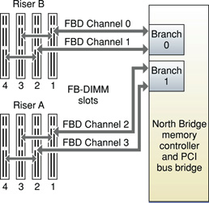
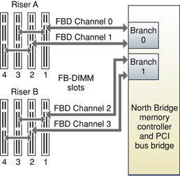
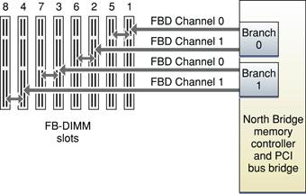
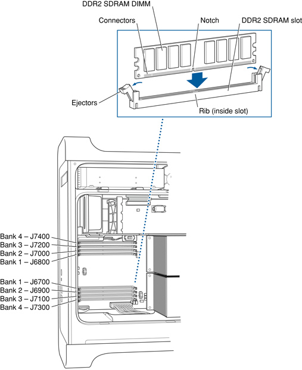

> 导航：[总目录](../../../README.md) · [documentation](../../../_indexes/documentation.md) · [RAM Expansion Developer Note](Introduction%20to%20RAM%20Expansion%20Developer%20Note.md)

[Next](Document%20Revision%20History.md)[Previous](RAM%20Expansion%20Concepts.md)

# RAM Expansion Product-Specific Details

This article highlights details of RAM expansion specific to particular Mac computers. Unless otherwise specified in this chapter, RAM support on a Mac computer adheres to the information in [RAM Expansion Concepts](RAM%20Expansion%20Concepts.md#apple-f4xwc4dqnrsv64tfmyxwi33df52wszbpkridimbqgaztqojyfvjvomk7gezdambtgmytcnzx).

This section provides RAM-specific information for Mac Pro computers introduced beginning August 2006. Refer to the specific Mac Pro developer note for additional information.

The Mac Pro computers with Quad-Core Intel Xeon 5400 Series microprocessors were introduced in January 2008. The Mac Pro provides eight RAM slots that accommodate 240-pin DDR2 SDRAM Fully Buffered DIMMs (FB-DIMMs) up to 30.35 mm tall and up to 25.4 mm thick. The FB-DIMMs must be PC2-6400 compliant and must be unregistered, 8-byte, nonparity, and ECC. For best performance, use FB-DIMMs with a CAS latency (CL) of 5, however CAS latencies of 6 are also supported.

The Mac Pro ships standard with 2 GB (2 x 1GB), 800 MHz, SDRAM FB-DIMM installed. The largest capacity FB-DIMM supported is 4 GB, with a maximum memory capacity of 32 GB.

The memory controller supports 512 MB, 1 GB, 2 GB, and 4 GB FB-DIMMs, installed in identical pairs. When only two DIMMs are installed, for best performance install the DIMMs in Slot 1 of Riser A and Riser B.

For instructions on installing additional RAM, refer to the “Installing Memory” section in the _Mac Pro User’s Guide_ that shipped with the computer.

The width of each 800 MHz memory bus is 72 bits (including ECC).

The maximum number of devices per FB-DIMM is 36.

As shown in the figure below, the Mac Pro’s memory architecture consists of two memory riser cards organized by branches, channels, and DIMMs. The memory controller hub (MCH) on the North Bridge has two branches with Branch 1 going to Riser A and Branch 0 to Riser B.

The North Bridge IC connects to an Advanced Memory Buffer (AMB) device on the FB-DIMM modules using a high speed serial link running at 4.8 GHz DDR, with 14 northbound (read) lanes and 10 southbound (write) lanes. The North Bridge IC has two high speed serial links, each capable of addressing four FB-DIMMs. The DIMMs are arranged in pairs operating in lock-stepped, dual channel mode to provide a 128-bit wide datapath, plus 16 bits of ECC.

Each memory riser card has four DIMM slots labeled 1 to 4. On Riser B, Channel 0 serves DIMMs 1 and 3 and Channel 1 serves DIMMs 2 and 4. On Riser A, Channel 2 serves DIMMs 1 and 3 and Channel 3 serves DIMMs 2 and 4.

The AMBs on DIMMs 1 and 2 connect to the MCH via a high speed serial bus. If installed, the AMBs on DIMMs 3 and 4 connect to the AMBs on DIMMs 1 and 2, respectively. The high speed serial bus consists of 14 unidirectional northbound lanes (towards the MCH) and 10 unidirectional southbound lanes (towards the DIMMs) to carry command, address, and data traffic.

The MCH operates each branch independently. At DDR2-800 speeds, each branch provides a peak theoretical thruput of 12.7 GBps of northbound (from memory to North Bridge) traffic and 6.3 GBps of southbound (from North Bridge to memory) traffic.

The Mac Pro uses Apple FB-DIMMs with larger heat sinks to ensure that the fans run at the proper speed to maintain the optimal temperature and ensure acoustic performance. While a system will operate with FB-DIMMs with conventional heat spreaders, Apple recommends Apple-approved heat sinks for optimum performance and acoustics. Apple memory kits are available for support of upgrades.

For information on the thermal considerations on the FB-DIMMs used in the Mac Pro, refer to Apple's [Technical Note TN2156](https://developer.apple.com/technotes/tn2006/tn2156.html).

The table below shows information about the different sizes of SDRAM devices used in the FB-DIMM memory modules. The DIMM size is the memory size of the largest FB-DIMM with the corresponding device size (from the second column) that the computer can accommodate.

The device configuration includes three specifications: address range, word size, and number of banks. For example, a 1 M x 16 x 4 device addresses 1 M, stores 16 bits at a time, and has 4 banks.

Devices per rank specifies the number of devices needed to make up the 8-byte (plus ECC) width of the data bus. The fifth column in the table shows the size of each rank of devices, which is based on the number of internal banks in each device and the number of devices per rank. A rank is a side of an FB-DIMM; 2 ranks indicate a 2-sided FB-DIMM.

__Table 1__  Mac Pro FB-DIMMS and devices

| DIMM size | Device size | Configuration | Devices per rank | Rank size | # of ranks |
| 512 MB\* | 256 Mb | 8 M x 8 x 4 | 9 | 256 MB | 1 |
| 512 MB\* | 512 Mb | 16 M x 8 x 4 | 9 | 512 MB | 1 |
| 1 GB | 512 Mb | 16 M x 8 x 4 | 9 | 512 MB | 2 |
| 1 GB\* | 1 Gb | 32 M x 8 x 4 | 9 | 1 GB | 1 |
| 2 GB | 1 Gb | 32 M x 8 x 4 | 9 | 1 GB | 2 |
| 2 GB | 512 Mb | 32 M x 4 x 4 | 18 | 1 GB | 2 |
| 4 GB | 1 Gb | 32 M x 4 x 8 | 18 | 2 GB | 2 |
|
| \* Theoretical values. Requires extensive testing. | \* Theoretical values. Requires extensive testing. | \* Theoretical values. Requires extensive testing. | \* Theoretical values. Requires extensive testing. | \* Theoretical values. Requires extensive testing. | \* Theoretical values. Requires extensive testing. |

The table below shows the address multiplexing modes used with the devices.

__Table 2__  Address multiplexing modes for Mac Pro SDRAM FB-DIMM devices

| Device size | Device configuration | Size of row address | Size of column address | Bank address | # of Banks |
| 512 Mb\* | 8 M x 8 x 4 | 13 | 10 | ba[0-1] | 4 |
| 512 Mb | 16 M x 8 x 4 | 14 | 10 | ba[0-1] | 4 |
| 512 Mb | 32 M x 4 x 4 | 14 | 11 | ba[0-1] | 4 |
| 1 Gb | 16 M x 8x 8 | 14 | 10 | ba[0-2] | 8 |
| 1 Gb | 32 M x 4 x 8 | 14 | 11 | ba[0-2] | 8 |
|
| \* Theoretical values. Requires extensive testing. | \* Theoretical values. Requires extensive testing. | \* Theoretical values. Requires extensive testing. | \* Theoretical values. Requires extensive testing. | \* Theoretical values. Requires extensive testing. | \* Theoretical values. Requires extensive testing. |

The quad-core Mac Pro was introduced in August 2006 and the 8-core Mac Pro was introduced in April 2007 as a configure-to-order-option.The Mac Pro provides eight RAM slots that accommodate 240-pin SDRAM Fully Buffered DIMMs (FB-DIMMs) up to 30.35 mm tall and up to 25.4 mm thick. The FB-DIMMs must be PC2-5300 compliant and must be unregistered, 8-byte, nonparity, and ECC.

The Mac Pro ships standard with two 512 MB, 667 MHz, SDRAM FB-DIMM installed, for a total of 1 GB. The largest capacity FB-DIMM supported is 2 GB, with a maximum memory capacity of 16 GB.

The memory controller supports 512 MB, 1 GB, and 2 GB FB-DIMMs, installed in identical pairs.

For instructions on installing additional RAM, refer to the “Installing Memory” section in the _Mac Pro User’s Guide_ that shipped with the computer.

The width of each 667 MHz memory bus is 72 bits (including ECC). The Mac Pro supports a CAS latency of 5.

The maximum number of devices per FB-DIMM is 36.

As shown in the figure below, the Mac Pro’s memory architecture consists of two memory riser cards organized by branches, channels, and DIMMs. The memory controller hub (MCH) on the North Bridge has two branches with Branch 0 going to Riser A and Branch 1 to Riser B.

The North Bridge IC connects to an Advanced Memory Buffer (AMB) device on the FB-DIMM modules using a high speed serial link running at 4 GHz DDR, with 14 northbound (read) lanes and 10 southbound (write) lanes. The North Bridge IC has two high speed serial links, each capable of addressing four FB-DIMMs. The DIMMs are arranged in pairs operating in lock-stepped, dual channel mode to provide a 128-bit wide datapath, plus 16 bits of ECC.

Each memory riser card has four DIMM slots labeled 1 to 4. On Riser A, Channel 0 serves DIMMs 1 and 3 and Channel 1 serves DIMMs 2 and 4. On Riser B, Channel 2 serves DIMMs 1 and 3 and Channel 3 serves DIMMs 2 and 4.

The AMBs on DIMMs 1 and 2 connect to the MCH via a high speed serial bus. If installed, the AMBs on DIMMs 3 and 4 connect to the AMBs on DIMMs 1 and 2, respectively. The high speed serial bus consists of 14 unidirectional northbound lanes (towards the MCH) and 10 unidirectional southbound lanes (towards the DIMMs) to carry command, address, and data traffic.

The MCH operates each branch independently. At DDR2-667 speeds, each branch provides a peak theoretical thruput of 10.6 GBps of northbound (from memory to North Bridge) traffic and 5.3 GBps of southbound (from North Bridge to memory) traffic.

The Mac Pro uses Apple FB-DIMMs with larger heat sinks to ensure that the fans run at the proper speed to maintain the optimal temperature and ensure acoustic performance. While a system will operate with FB-DIMMs with conventional heat spreaders, Apple recommends Apple-approved heat sinks for optimum performance and acoustics. Apple memory kits are available for support of upgrades.

For information on the thermal considerations on the FB-DIMMs used in the Mac Pro, refer to Apple's [Technical Note TN2156](https://developer.apple.com/technotes/tn2006/tn2156.html).

The table below shows information about the different sizes of SDRAM devices used in the FB-DIMM memory modules. The DIMM size is the memory size of the largest FB-DIMM with the corresponding device size (from the second column) that the computer can accommodate.

The device configuration includes three specifications: address range, word size, and number of banks. For example, a 1 M x 16 x 4 device addresses 1 M, stores 16 bits at a time, and has 4 banks.

Devices per rank specifies the number of devices needed to make up the 8-byte (plus ECC) width of the data bus. The fifth column in the table shows the size of each rank of devices, which is based on the number of internal banks in each device and the number of devices per rank. A rank is a side of an FB-DIMM; 2 ranks indicate a 2-sided FB-DIMM.

__Table 3__  Mac Pro FB-DIMMS and devices

| DIMM size | Device size | Configuration | Devices per rank | Rank size | # of ranks |
| 512 MB\* | 256 Mb | 8 M x 8 x 4 | 9 | 256 MB | 1 |
| 512 MB | 512 Mb | 16 M x 8 x 4 | 9 | 512 MB | 1 |
| 1 GB | 512 Mb | 16 M x 8 x 4 | 9 | 512 MB | 2 |
| 2 GB | 512 Mb | 32 M x 4 x 4 | 18 | 1 GB | 2 |
| 4 GB | 1 Gb | 32 M x 4 x 8 | 36 | 2 GB | 2 |
|
| \* Theoretical values. Requires extensive testing. | \* Theoretical values. Requires extensive testing. | \* Theoretical values. Requires extensive testing. | \* Theoretical values. Requires extensive testing. | \* Theoretical values. Requires extensive testing. | \* Theoretical values. Requires extensive testing. |

The table below shows the address multiplexing modes used with the devices.

__Table 4__  Address multiplexing modes for Mac Pro SDRAM FB-DIMM devices

| Device size | Device configuration | Size of row address | Size of column address | Bank address | # of Banks |
| 256 Mb\* | 4 M x 16x 4 | 13 | 9 | ba[0-1] | 4 |
| 256 Mb\* | 8 M x 8 x 4 | 13 | 10 | ba[0-1] | 4 |
| 512 Mb\* | 8 M x 16 x 4 | 13 | 10 | ba[0-1] | 4 |
| 512 Mb | 16 M x 8 x 4 | 14 | 10 | ba[0-1] | 4 |
| 512 Mb | 32 M x 4 x 4 | 14 | 11 | ba[0-1] | 4 |
| 1 Gb\* | 16 M x 16x 4 | 13 | 10 | ba[0-2] | 4 |
| 1 Gb\* | 32 M x 8x 4 | 14 | 10 | ba[0-2] | 4 |
| 1 Gb\* | 16 M x 8x 8 | 14 | 10 | ba[0-2] | 8 |
|
| \* Theoretical values. Requires extensive testing. | \* Theoretical values. Requires extensive testing. | \* Theoretical values. Requires extensive testing. | \* Theoretical values. Requires extensive testing. | \* Theoretical values. Requires extensive testing. | \* Theoretical values. Requires extensive testing. |

This section provides RAM-specific information for Xserve servers introduced after September 2005. Refer to the specific Xserve developer note for additional information.

The Xserve with Quad-Core Intel Xeon 5400 Series microprocessors, introduced in January 2008, provides eight RAM slots that accommodate 240-pin DDR2 ECC SDRAM Fully Buffered DIMMs (FB-DIMMs) up to 30.35 mm tall and up to 7.4 mm thick. The FB-DIMMs must be PC2-6400 compliant and must be unregistered, 8-byte, nonparity, and ECC.

Xserve ships standard with two 1 GB, 800 MHz, DDR2 ECC SDRAM FB-DIMMs, for a total of 2 GB. The largest capacity FB-DIMM supported is 4 GB, with a maximum memory capacity of 32 GB.

The memory controller supports 1 GB, 2 GB, and 4 GB FB-DIMMs, installed in identical pairs.

For instructions on installing additional RAM, refer to the “Adding Memory” section in the _Xserve Setup Guide_ that shipped with the computer.

The width of each 800 MHz memory bus is 72 bits (including ECC).

For best performance, use FB-DIMMs with a CAS latency (CL) of 5, however CAS latencies of 6 are also supported.

The maximum number of devices per FB-DIMM is 36.

As shown in the figure below, the Xserve memory architecture consists of branches, channels, and DIMMs.

The North Bridge connects to an Advance Memory Buffer (AMB) device on the FB-DIMM modules using a high speed serial link which supports 32 bytes of payload per frame in the Northbound (Read) direction and 16 bytes of payload per frame in the Southbound (Write) direction. The North Bridge supports four FB-DIMM channels in a two channel per branch configuration. Each branch is an independent memory controller and each channel within a branch operates in lock-step. Addresses can be interleaved across each branch effectively supporting four simultaneous channels of memory throughput.

The table below shows information about the different sizes of SDRAM devices used in the FB-DIMM memory modules. The DIMM size is the memory size of the largest FB-DIMM with the corresponding device size (from the second column) that the computer can accommodate.

The device configuration includes three specifications: address range, word size, and number of banks. For example, a 1 M x 16 x 4 device addresses 1 M, stores 16 bits at a time, and has 4 banks.

Devices per rank specifies the number of devices needed to make up the 8-byte (plus ECC) width of the data bus. The fifth column in the table shows the size of each rank of devices, which is based on the number of internal banks in each device and the number of devices per rank. A rank is a side of an FB-DIMM; 2 ranks indicate a 2-sided FB-DIMM.

__Table 5__  Xserve FB-DIMMS and devices

| DIMM size | Device size | Configuration | Devices per rank | Rank size | # of ranks |
| 512 MB\* | 256 Mb | 8 M x 8 x 4 | 9 | 256 MB | 1 |
| 512 MB\* | 512 Mb | 16 M x 8 x 4 | 9 | 512 MB | 1 |
| 1 GB | 512 Mb | 16 M x 8 x 4 | 9 | 512 MB | 2 |
| 1 GB\* | 1 Gb | 32 M x 8 x 4 | 9 | 1 GB | 1 |
| 2 GB | 1 Gb | 32 M x 8 x 4 | 9 | 1 GB | 2 |
| 2 GB | 512 Mb | 32 M x 4 x 4 | 18 | 1 GB | 2 |
| 4 GB | 1 Gb | 32 M x 4 x 8 | 18 | 2 GB | 2 |
|
| \* Theoretical values. Requires extensive testing. | \* Theoretical values. Requires extensive testing. | \* Theoretical values. Requires extensive testing. | \* Theoretical values. Requires extensive testing. | \* Theoretical values. Requires extensive testing. | \* Theoretical values. Requires extensive testing. |

The table below shows the address multiplexing modes used with the devices.

__Table 6__  Address multiplexing modes for Xserve SDRAM FB-DIMM devices

| Device size | Device configuration | Size of row address | Size of column address | Bank address | # of Banks |
| 512 Mb\* | 8 M x 8 x 4 | 13 | 10 | ba[0-1] | 4 |
| 512 Mb | 16 M x 8 x 4 | 14 | 10 | ba[0-1] | 4 |
| 512 Mb | 32 M x 4 x 4 | 14 | 11 | ba[0-1] | 4 |
| 1 Gb | 16 M x 8x 8 | 14 | 10 | ba[0-2] | 8 |
| 1 Gb | 32 M x 4 x 8 | 14 | 11 | ba[0-2] | 8 |
|
| \* Theoretical values. Requires extensive testing. | \* Theoretical values. Requires extensive testing. | \* Theoretical values. Requires extensive testing. | \* Theoretical values. Requires extensive testing. | \* Theoretical values. Requires extensive testing. | \* Theoretical values. Requires extensive testing. |

For information on FB-DIMM technology, refer to [Fully-Buffered DIMMs (FB-DIMM)](RAM%20Expansion%20Concepts.md#apple-f4xwc4dqnrsv64tfmyxwi33df52wszbpkridimbqgaztqojyfvjvook7gezdambtgmytcnzx).

The Xserve introduced in August 2006, based on the Dual-Dore Intel Xeon processor, provides eight RAM slots that accommodate 240-pin SDRAM Fully Buffered DIMMs (FB-DIMMs) up to 30.35 mm tall and up to 7.4 mm thick. The FB-DIMMs must be PC2-5300 compliant and must be unregistered, 8-byte, nonparity, and ECC.

Xserve ships standard with two 512 MB, 667 MHz, SDRAM FB-DIMMs, for a total of 1 GB. The largest capacity FB-DIMM supported is 4 GB, with a maximum memory capacity of 32 GB.

The memory controller supports 256 MB, 512 MB, 1 GB, 2 GB, and 4 GB FB-DIMMs, installed in identical pairs.

For instructions on installing additional RAM, refer to the “Adding Memory” section in the _Xserve Setup Guide_ that shipped with the computer.

The width of each 667 MHz memory bus is 72 bits (including ECC). The Xserve supports a CAS latency of 5.

The maximum number of devices per FB-DIMM is 36.

As shown in the figure below, the Xserve memory architecture consists of branches, channels, and DIMMs.

The North Bridge connects to an Advance Memory Buffer (AMB) device on the FB-DIMM modules using a high speed serial link which supports 32 bytes of payload per frame in the Northbound (Read) direction and 16 bytes of payload per frame in the Southbound (Write) direction. The North Bridge supports four FB-DIMM channels in a two channel per branch configuration. Each branch is an independent memory controller and each channel within a branch operates in lock-step. Addresses can be interleaved across each branch effectively supporting four simultaneous channels of memory throughput.

[Mac Pro Computers (August 2006 and April 2007)](#apple-f4xwc4dqnrsv64tfmyxwi33df52wszbpkridimbqgaztqojzfvjvoms7gezdambtgmytcnzx) shows information about the different sizes of SDRAM devices used in the FB-DIMM memory modules. The DIMM (column one) is the memory size of the largest FB-DIMM with the corresponding SDRAM density (column two) that the Xserve can accommodate.

SDRAM configuration (column three) provides the number of megabytes and bit width per SDRAM chip.

Columns four, five, and six provide the number of SDRAMs, ranks, and banks , respectively, related to the FB-DIMM.

Column seven specifies the type of raw card on which the FB-DIMM is based. The raw card is the physical configuration of the FB-DIMM as defined by the JEDEC spec PC2-4200/PC2-5300/PC2-6400 DDR2 Fully Buffered DIMM Design Specification, current revision, JEDEC Buffered DIMM and Socket Task Group.

__Table 7__  Xserve FB-DIMMS

| DIMM | SDRAM  density | SDRAM  configuration  MB x bits | # of  SDRAM | # of  ranks | # of banks  in SDRAM | Raw  card |
| \*256 MB | 256 Mb | 32 MB x 8 | 9 | 1 | 4 | A |
| 512 MB | 512 Mb | 64 MB x 8 | 9 | 1 | 4 | A |
| \*512 MB | 256 Mb | 32 MB x 8 | 18 | 2 | 4 | B |
| \*512 MB | 256 Mb | 64 MB x 4 | 18 | 1 | 4 | C |
| \*1 GB | 1 Gb | 128 MB x 8 | 9 | 2 | 8 | A |
| 1 GB | 512 Mb | 64 MB x 8 | 18 | 2 | 4 | B |
| \*1 GB | 256 Mb | 64 MB x 4 | 36 | 2 | 4 | D, J, E, H |
| \*1 GB | 512 Mb | 128 MB x 4 | 18 | 1 | 4 | C |
| \*2 GB | 2 Gb | 256 MB x 8 | 9 | 1 | 8 | A |
| \*2 GB | 1 Gb | 128 MB x 8 | 18 | 2 | 8 | B |
| \*2 GB | 1 Gb | 256 MB x 4 | 18 | 1 | 8 | C |
| 2 GB | 512 Mb | 128 MB x 4 | 36 | 2 | 4 | D, J, E, H |
| \*4 GB | 2 Gb | 256 MB x 8 | 18 | 2 | 8 | B |
| \*4 GB | 2 Gb | 512 MB x 4 | 18 | 1 | 8 | C |
| 4 GB | 1 Gb | 256 MB x 4 | 36 | 2 | 8 | D, J, E, H |
|
| \* Theoretical values. Requires extensive testing. | \* Theoretical values. Requires extensive testing. | \* Theoretical values. Requires extensive testing. | \* Theoretical values. Requires extensive testing. | \* Theoretical values. Requires extensive testing. | \* Theoretical values. Requires extensive testing. | \* Theoretical values. Requires extensive testing. |

For information on FB-DIMM technology, refer to [Fully-Buffered DIMMs (FB-DIMM)](RAM%20Expansion%20Concepts.md#apple-f4xwc4dqnrsv64tfmyxwi33df52wszbpkridimbqgaztqojyfvjvook7gezdambtgmytcnzx).

This section provides RAM-specific information for iMac computers introduced after September 2005. Refer to the specific iMac developer note for additional information.

The iMac computers introduced in April 2008, based on the Intel Core 2 Duo microprocessor, provide two RAM slots that accommodate 200-pin DDR2 SDRAM SO-DIMMs up to 1.25” in height. The SO-DIMMs must be DDR2-800 (PC2-6400) compliant and must be unbuffered, unregistered, 8-byte, nonparity, and non-ECC.

The 2.4 GHz 20-inch iMac ships with one 1 GB, 800 MHz, SDRAM SO-DIMMs installed. The 2.66 GHz 20-inch iMac and 24-inch iMac ship with 2 x 1 GB, 800 MHz, SDRAM SO-DIMMs installed, for a total of 2 GB. The largest capacity SO-DIMM supported is 2 GB, for a total maximum of 4 GB.

Memory configure-to-order options are: two 1 GB DIMMs for a total of 2 GB or two 2 GB DIMMs for a total of 4 GB.

The memory controller supports 1 GB and 2 GB SO-DIMMs; other configurations are untested. Because the memory in the two slots is configured as a contiguous array of memory, when both SO-DIMMs are the same size and type, the interleaving function is able to improve performance.

The iMac supports a CAS latency of 5 or 6.

The width of each 800 MHz memory channel is 64 bits.

The maximum number of devices per SO-DIMM is 16. See [Table 3](RAM%20Expansion%20Concepts.md#apple-f4xwc4dqnrsv64tfmyxwi33df52wszbpkridimbqgaztqojyfvjvom27gezdambtgmytcnzx) for device and DIMM configurations.

The iMac Computers introduced in August 2007, based on the Intel Core 2 Duo microprocessor, provide two RAM slots that accommodate 200-pin DDR2 SDRAM SO-DIMMs up to 1.25” in height. The SO-DIMMs must be DDR2-667 (PC2-5300) compliant and must be unbuffered, unregistered, 8-byte, nonparity, and non-ECC.

The iMac ships with one 1 GB, 667 MHz, SDRAM SO-DIMMs installed, for a total of 1 GB. The largest capacity SO-DIMM supported is 2 GB, for a total maximum of 4 GB.

Memory configure-to-order options are: two 1 GB DIMMs for a total of 2 GB or two 2 GB DIMM for a total of 4 GB.

The memory controller supports 1 GB and 2 GB SO-DIMMs; other configurations are untested. Because the memory in the two slots is configured as a contiguous array of memory, when both SO-DIMMs are the same size and type, the interleaving function is able to improve performance.

The iMac supports a CAS latency of 5.

The width of each 667 MHz memory bus is 64 bits.

The maximum number of devices per SO-DIMM is 16. See [Table 3](RAM%20Expansion%20Concepts.md#apple-f4xwc4dqnrsv64tfmyxwi33df52wszbpkridimbqgaztqojyfvjvom27gezdambtgmytcnzx) for device and DIMM configurations.

The iMac with SuperDrive computers introduced in September 2006, based on the Intel Core 2 Duo microprocessor, provides two RAM slots that accommodate 200-pin DDR2 SDRAM SO-DIMMs up to 1.25” in height. The SO-DIMMs must be DDR2-667 (PC2-5300) compliant and must be unbuffered, unregistered, 8-byte, nonparity, and non-ECC.

The iMac ships with two 512 MB, 667 MHz, SDRAM SO-DIMMs installed, for a total of 1 GB. The largest capacity SO-DIMM supported is 2 GB, with a maximum memory capacity of 3 GB. If you install a 2 GB SO-DIMM in both the bottom and top memory slots of the computer, both the About This Mac window and the Apple System Profiler will show that you have 4 GB of SDRAM installed. However, Activity Monitor and other similar applications will reveal that only 3 GB of SDRAM has been addressed for use by the computer.

Memory configure-to-order options are: two 1 GB DIMMs for a total of 2 GB or one 1 GB DIMM and one 2 GB DIMM for a total of 3 GB.

The memory controller supports 512 MB, 1 GB, and 2 GB SO-DIMMs. Because the memory in the two slots is configured as a contiguous array of memory, when both SO-DIMMs are the same size and type, the interleaving function is able to improve performance.

The iMac supports a CAS latency of 5.

The width of each 667 MHz memory bus is 64 bits.

The maximum number of devices per SO-DIMM is 16. See [Table 3](RAM%20Expansion%20Concepts.md#apple-f4xwc4dqnrsv64tfmyxwi33df52wszbpkridimbqgaztqojyfvjvom27gezdambtgmytcnzx) for device and DIMM configurations.

The iMac with Combo drive computer introduced in September 2006, based on the Intel Core 2 Duo microprocessor, provides two RAM slots that accommodate 200-pin DDR2 SDRAM SO-DIMMs up to 1.25” in height. The SO-DIMMs must be DDR2-667 (PC2-5300) compliant and must be unbuffered, unregistered, 8-byte, nonparity, and non-ECC.

The computer ships with two 256 MB, 667 MHz, SDRAM SO-DIMMs installed in two RAM slots for a total of 512 MB. The largest capacity SO-DIMM supported is 1 GB, with a maximum memory capacity of 2 GB.

The memory controller supports 256 MB, 512 MB, and 1 GB SO-DIMMs. However, because the memory in the two slots is configured as a contiguous array of memory, both SO-DIMMs must be the same size and type for the interleaving function to be used to improve performance. The iMac supports a CAS latency of 5.

The width of each 667 MHz memory bus is 64 bits.

The maximum number of devices per SO-DIMM is 16. See [Table 3](RAM%20Expansion%20Concepts.md#apple-f4xwc4dqnrsv64tfmyxwi33df52wszbpkridimbqgaztqojyfvjvom27gezdambtgmytcnzx) for device and DIMM configurations.

The 17-inch iMac for education computer introduced in July 2006, based on the Intel Core Duo microprocessor, provides two RAM slots that accommodate 200-pin DDR2 SDRAM SO-DIMMs up to 1.25” in height. The SO-DIMMs must be DDR2-667 (PC2-5300) compliant and must be unbuffered, unregistered, 8-byte, nonparity, and non-ECC.

The computer ships with two 256 MB, 667 MHz, SDRAM SO-DIMM installed, for a total of 512 MB. The largest capacity SO-DIMM supported is 1 GB, with a maximum memory capacity of 2 GB.

The memory controller supports 256 MB, 512 MB, and 1 GB SO-DIMMs. However, because the memory in the two slots is configured as a contiguous array of memory, both SO-DIMMs must be the same size and type for the interleaving function to be used to improve performance. The 17-inch iMac for education supports a CAS latency of 5.

The width of each 667 MHz memory bus is 64 bits.

The maximum number of devices per SO-DIMM is 16. See [Table 3](RAM%20Expansion%20Concepts.md#apple-f4xwc4dqnrsv64tfmyxwi33df52wszbpkridimbqgaztqojyfvjvom27gezdambtgmytcnzx) for device and DIMM configurations.

The iMac computer introduced in January 2006, based on the Intel Core Duo microprocessor, provide two RAM slots that accommodate 200-pin DDR2 SDRAM SO-DIMMs up to 1.25” in height. The SO-DIMMs must be DDR2-667 (PC2-5300) compliant and must be unbuffered, unregistered, 8-byte, nonparity, and non-ECC.

The computer ships with one 512 MB, 667 MHz, SDRAM SO-DIMM installed. The largest capacity SO-DIMM supported is 1 GB, so the maximum memory capacity is 2 GB.

The memory controller supports both 512 MB and 1 GB SO-DIMMs. However, because the memory in the two slots is configured as a contiguous array of memory, both SO-DIMMs must be the same size and type for the interleaving function to be used to improve performance. The iMac supports a CAS latency of 5.

The width of each 667 MHz memory bus is 64 bits.

The maximum number of devices per SO-DIMM is 16. See [Table 3](RAM%20Expansion%20Concepts.md#apple-f4xwc4dqnrsv64tfmyxwi33df52wszbpkridimbqgaztqojyfvjvom27gezdambtgmytcnzx) for device and DIMM configurations.

The iMac G5 has DDR2-533 (PC2-4200) SDRAM memory: 512 MB on board and a DIMM expansion slot for expansion. Maximum memory capacity is 2.5 GB.

Each memory slot can contain 256 MB, 512 MB, 1 GB, or 2 GB of double data rate synchronous dynamic RAM (DDR2 SDRAM). The iMac G5 supports CAS latencies of 3 or 4.

The combined memory of on board and expansion RAM is configured as a contiguous array of memory. The width of the 533 MHz memory bus is 64 bits.

The RAM expansion slot accepts a 240-pin DDR2 SDRAM DIMM that is unbuffered, 8-byte, nonparity, and DDR2-4200-compliant.

The iMac G5 only supports DIMMs up to 1.25” in height.

See [Table 1](RAM%20Expansion%20Concepts.md#apple-f4xwc4dqnrsv64tfmyxwi33df52wszbpkridimbqgaztqojyfvjvoms7gezdambtgmytcnzx) for more details.

See [Table 1](RAM%20Expansion%20Concepts.md#apple-f4xwc4dqnrsv64tfmyxwi33df52wszbpkridimbqgaztqojyfvjvoms7gezdambtgmytcnzx) for device and DIMM configurations. The largest DIMM supported by the iMac G5 is 2 GB. The maximum number of devices per DIMM is 16. The memory controller supports 256 Mbit, 512 Mbit, 1 Gbit, and 2 Gbit DDR2 SDRAM devices.

This section provides RAM-specific information for MacBook computers. Refer to the specific MacBook developer note for additional information.

The MacBook computer introduced in February 2008, incorporating the Intel Core 2 Duo processor on 45 nm process technology, provides two RAM slots that accommodate 200-pin DDR2 SDRAM SO-DIMMs up to 1.25” in height. The SO-DIMMs must be DDR2-667 (PC2-5300) compliant and must be unbuffered, unregistered, 8-byte, nonparity, and non-ECC.

The 2.1 GHz configuration ships with 2 x 512 MB DDR2 SDRAM SO-DIMMs for a total of 1 GB. The 2.4 GHz configurations ship with 2 x 1 GB DDR2 SDRAM SO-DIMMs for a total of 2 GB. The maximum memory capacity of 4 GB.

The memory controller supports 512 MB, 1GB, and 2 GB SO-DIMMs. However, because the memory in the two slots is configured as a contiguous array of memory, both SO-DIMMs must be the same size and type for the interleaving function to be used to improve performance.

The MacBook supports a CAS latency of 5.

The width of each 667 MHz memory bus is 64 bits.

The EEPROM (SPD) pin is powered by 3.3 V.

The maximum number of devices per SO-DIMM is 16. See [Table 3](RAM%20Expansion%20Concepts.md#apple-f4xwc4dqnrsv64tfmyxwi33df52wszbpkridimbqgaztqojyfvjvom27gezdambtgmytcnzx) for device and DIMM configurations.

The MacBook computer introduced in November 2007, based on the Intel Core 2 Duo, provides two RAM slots that accommodate 200-pin DDR2 SDRAM SO-DIMMs up to 1.25” in height. The SO-DIMMs must be DDR2-667 (PC2-5300) compliant and must be unbuffered, unregistered, 8-byte, nonparity, and non-ECC.

The computer ships with two 512 MB DDR2 SDRAM SO-DIMMs for a total of 1 GB. The maximum memory capacity of 4 GB.

The memory controller supports 512 MB, 1GB, and 2 GB SO-DIMMs. However, because the memory in the two slots is configured as a contiguous array of memory, both SO-DIMMs must be the same size and type for the interleaving function to be used to improve performance.

The MacBook supports a CAS latency of 5.

The width of each 667 MHz memory bus is 64 bits.

The EEPROM (SPD) pin is powered by 3.3 V.

The maximum number of devices per SO-DIMM is 16. See [Table 3](RAM%20Expansion%20Concepts.md#apple-f4xwc4dqnrsv64tfmyxwi33df52wszbpkridimbqgaztqojyfvjvom27gezdambtgmytcnzx) for device and DIMM configurations.

The MacBook computer introduced in May 2007, based on the Intel Core 2 Duo, provides two RAM slots that accommodate 200-pin DDR2 SDRAM SO-DIMMs up to 1.25” in height. The SO-DIMMs must be DDR2-667 (PC2-5300) compliant and must be unbuffered, unregistered, 8-byte, nonparity, and non-ECC.

The computer ships with two 512 MB DDR2 SDRAM SO-DIMMs for a total of 1 GB. The largest capacity SO-DIMM supported is 1 GB, so the maximum memory capacity is 2 GB. Available as a configure-to-order option are two 1 GB DDR2 SDRAM SO-DIMMs for a total of 2 GB.

The memory controller supports both 512 MB and 1GB SO-DIMMs. However, because the memory in the two slots is configured as a contiguous array of memory, both SO-DIMMs must be the same size and type for the interleaving function to be used to improve performance.

The MacBook supports a CAS latency of 5.

The width of each 667 MHz memory bus is 64 bits.

The EEPROM (SPD) pin is powered by 3.3 V.

The maximum number of devices per SO-DIMM is 16. See [Table 3](RAM%20Expansion%20Concepts.md#apple-f4xwc4dqnrsv64tfmyxwi33df52wszbpkridimbqgaztqojyfvjvom27gezdambtgmytcnzx) for device and DIMM configurations.

The MacBook computer introduced in November 2006, based on the Intel Core 2 Duo, provides two RAM slots that accommodate 200-pin DDR2 SDRAM SO-DIMMs up to 1.25” in height. The SO-DIMMs must be DDR2-667 (PC2-5300) compliant and must be unbuffered, unregistered, 8-byte, nonparity, and non-ECC.

The 1.83 GHz computer ships with two 256 MB DDR2 SDRAM SO-DIMMs for a total of 512 MB. The 2.0 GHz computer ships with two 512 MB DDR2 SDRAM SO-DIMMs for a total of 1 GB. The largest capacity SO-DIMM supported is 1 GB, so the maximum memory capacity is 2 GB.

The memory controller supports 256 MB, 512 MB, and 1GB SO-DIMMs. However, because the memory in the two slots is configured as a contiguous array of memory, both SO-DIMMs must be the same size and type for the interleaving function to be used to improve performance. The MacBook supports a CAS latency of 5.

The width of each 667 MHz memory bus is 64 bits.

The EEPROM pin is powered by 3.3 V.

The maximum number of devices per SO-DIMM is 16. See [Table 3](RAM%20Expansion%20Concepts.md#apple-f4xwc4dqnrsv64tfmyxwi33df52wszbpkridimbqgaztqojyfvjvom27gezdambtgmytcnzx) for device and DIMM configurations.

The MacBook computer introduced in May 2006, based on the Intel Core Duo, provides two RAM slots that accommodate 200-pin DDR2 SDRAM SO-DIMMs up to 1.25” in height. The SO-DIMMs must be DDR2-667 (PC2-5300) compliant and must be unbuffered, unregistered, 8-byte, nonparity, and non-ECC.

The computer ships with two 256 MB, 667 MHz, SDRAM SO-DIMMs installed for a total of 512 MB. The largest capacity SO-DIMM supported is 1 GB, so the maximum memory capacity is 2 GB.

The memory controller supports both 512 MB and 1GB SO-DIMMs. However, because the memory in the two slots is configured as a contiguous array of memory, both SO-DIMMs must be the same size and type for the interleaving function to be used to improve performance. The MacBook supports a CAS latency of 5.

The width of each 667 MHz memory bus is 64 bits.

The EEPROM pin is powered by 3.3 V.

The maximum number of devices per SO-DIMM is 16. See [Table 3](RAM%20Expansion%20Concepts.md#apple-f4xwc4dqnrsv64tfmyxwi33df52wszbpkridimbqgaztqojyfvjvom27gezdambtgmytcnzx) for device and DIMM configurations.

This section provides RAM-specific information for MacBook Pro computers. Refer to the specific MacBook Pro developer note for additional information.

The 17-inch MacBook Pro computers introduced in February 2008, incorporating the Intel Core 2 Duo processor on 45 nm process technology, provide two RAM slots that accommodate 200-pin DDR2 SDRAM SO-DIMMs up to 1.25” in height. The SO-DIMMs must be DDR2-667 (PC2-5300) compliant, unbuffered, unregistered, 8-byte, nonparity, and non-ECC.

The computer ships with 2 x 1 GB 667 MHz, SDRAM SO-DIMM installed for a total of 2 GB. Maximum memory capacity is 4 GB.

The memory controller supports 1 GB and 2 GB SO-DIMMs. The 17-inch MacBook Pro supports a CAS latency of 5.

The width of each 667 MHz memory bus is 64 bits.

The EEPROM (SPD) pin is powered by 3.3 V.

The maximum number of devices per SO-DIMM is 16. See [Table 3](RAM%20Expansion%20Concepts.md#apple-f4xwc4dqnrsv64tfmyxwi33df52wszbpkridimbqgaztqojyfvjvom27gezdambtgmytcnzx) for device and DIMM configurations.

The 15-inch MacBook Pro computers introduced in February 2008, incorporating the Intel Core 2 Duo processor on 45 nm process technology, provide two RAM slots that accommodate 200-pin DDR2 SDRAM SO-DIMMs up to 1.25” in height. The SO-DIMMs must be DDR2-667 (PC2-5300) compliant, unbuffered, unregistered, 8-byte, nonparity, and non-ECC.

The 15-inch MacBook Pro computer ships with 2 x 1 GB SO-DIMMs installed, for a total of 2 GB. Maximum memory capacity is 4 GB.

The memory controller supports 1 GB and 2 GB SO-DIMMs. The 15-inch MacBook Pro supports a CAS latency of 5.

The width of each 667 MHz memory bus is 64 bits.

The EEPROM (SPD) pin is powered by 3.3 V.

The maximum number of devices per SO-DIMM is 16. See [Table 3](RAM%20Expansion%20Concepts.md#apple-f4xwc4dqnrsv64tfmyxwi33df52wszbpkridimbqgaztqojyfvjvom27gezdambtgmytcnzx) for device and DIMM configurations.

The 17-inch MacBook Pro computers introduced in June 2007 and November 2007, based on the Intel Core 2 Duo, provide two RAM slots that accommodate 200-pin DDR2 SDRAM SO-DIMMs up to 1.25” in height. The SO-DIMMs must be DDR2-667 (PC2-5300) compliant, unbuffered, unregistered, 8-byte, nonparity, and non-ECC.

The computer ships with two 1 GB 667 MHz, SDRAM SO-DIMM installed for a total of 2 GB. Maximum memory capacity is 4 GB.

The memory controller supports 1 GB and 2 GB SO-DIMMs. The 17-inch MacBook Pro supports a CAS latency of 5.

The width of each 667 MHz memory bus is 64 bits.

The EEPROM (SPD) pin is powered by 3.3 V.

The maximum number of devices per SO-DIMM is 16. See [Table 3](RAM%20Expansion%20Concepts.md#apple-f4xwc4dqnrsv64tfmyxwi33df52wszbpkridimbqgaztqojyfvjvom27gezdambtgmytcnzx) for device and DIMM configurations.

The 15-inch MacBook Pro computers introduced in June 2007 and November 2007, based on the Intel Core 2 Duo, provide two RAM slots that accommodate 200-pin DDR2 SDRAM SO-DIMMs up to 1.25” in height. The SO-DIMMs must be DDR2-667 (PC2-5300) compliant, unbuffered, unregistered, 8-byte, nonparity, and non-ECC.

The 15-inch MacBook Pro computer ships with two 1 GB SO-DIMMs installed, for a total of 2 GB. Maximum memory capacity is 4 GB.

The memory controller supports 1 GB and 2 GB SO-DIMMs. The 15-inch MacBook Pro supports a CAS latency of 5.

The width of each 667 MHz memory bus is 64 bits.

The EEPROM (SPD) pin is powered by 3.3 V.

The maximum number of devices per SO-DIMM is 16. See [Table 3](RAM%20Expansion%20Concepts.md#apple-f4xwc4dqnrsv64tfmyxwi33df52wszbpkridimbqgaztqojyfvjvom27gezdambtgmytcnzx) for device and DIMM configurations.

The 17-inch MacBook Pro computer introduced in October 2006, based on the Intel Core 2 Duo, provides two RAM slots that accommodate 200-pin DDR2 SDRAM SO-DIMMs up to 1.25” in height. The SO-DIMMs must be DDR2-667 (PC2-5300) compliant, unbuffered, unregistered, 8-byte, nonparity, and non-ECC.

The computer ships with two 1 GB 667 MHz, SDRAM SO-DIMM installed for a total of 2 GB. Maximum memory capacity is 3 GB. If you install a 2 GB SO-DIMM in both the bottom and top memory slots of the computer, both the About This Mac window and the Apple System Profiler will show that you have 4 GB of SDRAM installed. However, Activity Monitor and other similar applications will reveal that only 3 GB of SDRAM has been addressed for use by the computer.

The memory controller supports 1 GB and 2 GB SO-DIMMs. The 17-inch MacBook Pro supports a CAS latency of 5.

The width of each 667 MHz memory bus is 64 bits.

The EEPROM pin is powered by 3.3 V.

The maximum number of devices per SO-DIMM is 16. See [Table 3](RAM%20Expansion%20Concepts.md#apple-f4xwc4dqnrsv64tfmyxwi33df52wszbpkridimbqgaztqojyfvjvom27gezdambtgmytcnzx) for device and DIMM configurations.

The 15-inch MacBook Pro computer introduced in October 2006, based on the Intel Core 2 Duo, provides two RAM slots that accommodate 200-pin DDR2 SDRAM SO-DIMMs up to 1.25” in height. The SO-DIMMs must be DDR2-667 (PC2-5300) compliant, unbuffered, unregistered, 8-byte, nonparity, and non-ECC.

The 2.16 GHz model ships with one 1 GB SO-DIMM installed. The 2.33 GHz model ships with two 1 GB SO-DIMM installed, for a total of 2 GB. Maximum memory capacity is 3 GB. If you install a 2 GB SO-DIMM in both the bottom and top memory slots of the 15-inch MacBook Pro, the About This Mac window and Apple System Profiler will both show that you have 4 GB of SDRAM installed. However, Activity Monitor and other similar applications will reveal that only 3 GB of SDRAM has been addressed for use by the computer.

The memory controller supports 1 GB and 2 GB SO-DIMMs. The 15-inch MacBook Pro supports a CAS latency of 5.

The width of each 667 MHz memory bus is 64 bits.

The EEPROM pin is powered by 3.3 V.

The maximum number of devices per SO-DIMM is 16. See [Table 3](RAM%20Expansion%20Concepts.md#apple-f4xwc4dqnrsv64tfmyxwi33df52wszbpkridimbqgaztqojyfvjvom27gezdambtgmytcnzx) for device and DIMM configurations.

The 17-inch MacBook Pro computer introduced in April 2006, based on the Intel Core Duo microprocessor, provides two RAM slots that accommodate 200-pin DDR2 SDRAM SO-DIMMs up to 1.25” in height. The SO-DIMMs must be DDR2-667 (PC2-5300) compliant and must be unbuffered, unregistered, 8-byte, nonparity, and non-ECC.

The computer ships with one 1 GB, 667 MHz, SDRAM SO-DIMM installed. The largest capacity SO-DIMM supported is 1 GB, so the maximum memory capacity is 2 GB.

The memory controller supports both 512 MB and 1 GB SO-DIMMs. However, because the memory in the two slots is configured as a contiguous array of memory, both SO-DIMMs must be the same size and type for the interleaving function to be used to improve performance. The 17-inch MacBook Pro supports a CAS latency of 5.

The width of each 667 MHz memory bus is 64 bits.

The EEPROM pin is powered by 3.3 V.

The maximum number of devices per SO-DIMM is 16. See [Table 3](RAM%20Expansion%20Concepts.md#apple-f4xwc4dqnrsv64tfmyxwi33df52wszbpkridimbqgaztqojyfvjvom27gezdambtgmytcnzx) for device and DIMM configurations.

The 15-inch MacBook Pro computer introduced in January 2006, based on the Intel Core Duo microprocessor, provides two RAM slots that accommodate 200-pin DDR2 SDRAM SO-DIMMs up to 1.25” in height. The SO-DIMMs must be DDR2-667 (PC2-5300) compliant and must be unbuffered, unregistered, 8-byte, nonparity, and non-ECC.

The computer ships with one 512 MB, 667 MHz, SDRAM SO-DIMM installed. The largest capacity SO-DIMM supported is 1 GB, so the maximum memory capacity is 2 GB.

The memory controller supports both 512 MB and 1 GB SO-DIMMs. However, because the memory in the two slots is configured as a contiguous array of memory, both SO-DIMMs must be the same size and type for the interleaving function to be used to improve performance. The MacBook Pro supports a CAS latency of 5.

The width of each 667 MHz memory bus is 64 bits.

The EEPROM pin is powered by 3.3 V.

The maximum number of devices per SO-DIMM is 16. See [Table 3](RAM%20Expansion%20Concepts.md#apple-f4xwc4dqnrsv64tfmyxwi33df52wszbpkridimbqgaztqojyfvjvom27gezdambtgmytcnzx) for device and DIMM configurations.

This section provides RAM-specific information for MacBook Air computers. Refer to the specific MacBook Air developer note for additional information.

The MacBook Air computer introduced in January 2008, based on the Intel Core 2 Duo, provides 2 GB (2 x 1 GB) DDR2 PC2-5300-compliant, unbuffered, unregistered, 8-byte, nonparity, and non-ECC SO-DIMMs built onto the logic board. The memory is not expandable.

This section provides RAM-specific information for Mac mini computers. Refer to the specific Mac mini developer note for additional information.

The Mac mini computer introduced in February 2006, based on the Intel Core Duo microprocessor or Intel Core Solo microprocessor, provides two RAM slots that accommodate 200-pin DDR2 SDRAM SO-DIMMs up to 1.25” in height. The SO-DIMMs must be DDR2-667 (PC2-5300) compliant and must be unbuffered, unregistered, 8-byte, nonparity, and non-ECC.

The computer ships with two 256 MB, 667 MHz, SDRAM SO-DIMMs installed. The largest capacity SO-DIMM supported is 1 GB, so the maximum memory capacity is 2 GB.

The memory controller supports 256 MB, 512 MB, and 1 GB SO-DIMMs. However, because the memory in the two slots is configured as a contiguous array of memory, both SO-DIMMs must be the same size and type for the interleaving function to be used to improve performance. The Mac mini supports a CAS latency of 5.

The width of each 667 MHz memory bus is 64 bits.

The maximum number of devices per SO-DIMM is 16. See [Table 3](RAM%20Expansion%20Concepts.md#apple-f4xwc4dqnrsv64tfmyxwi33df52wszbpkridimbqgaztqojyfvjvom27gezdambtgmytcnzx) for device and DIMM configurations.

This section provides RAM-specific information for Power Mac computers introduced after September 2005. Refer to the specific Power Mac developer note for additional information.

The main logic board of the Power Mac G5 computer has 8 slots of DDR2 SDRAM expansion for unbuffered, DDR2-533 (PC2-4200) dual inline memory modules (DIMMs) for a maximum memory of 16 GB. The Power Mac G5 accepts both ECC and non-ECC DIMMs.

Each DIMM can contain 256 MB (non-ECC only), 512 MB, 1 GB, or 2 GB of double data rate synchronous dynamic RAM (DDR2 SDRAM). At least one pair of the RAM expansion slots contains factory installed DIMMs. The Power Mac G5 supports CAS read latencies of 4 and 5.

Additional DIMMs must be installed in the bank slots in _pairs_ of the same size and type; ECC and non-ECC cannot be paired in a single bank. The slot pairs are numbered as indicated in [Figure 1](#apple-f4xwc4dqnrsv64tfmyxwi33df52wszbpkridimbqgaztqojzfvbegskkjjfeerc7gezdambtgmytcnzx).

__Figure 1__  DIMM installation

The RAM expansion slots accept 240-pin DDR2 SDRAM DIMMs that are 1.8 volt, unbuffered, 8-byte, ECC and non-ECC, and DDR2 533 MHz (PC2-4200) compliant.

The maximum height of DIMMs for use in the Power Mac G5 computer is 1.25 inches.

See [Table 1](RAM%20Expansion%20Concepts.md#apple-f4xwc4dqnrsv64tfmyxwi33df52wszbpkridimbqgaztqojyfvjvoms7gezdambtgmytcnzx) for more information.

See [Table 2](RAM%20Expansion%20Concepts.md#apple-f4xwc4dqnrsv64tfmyxwi33df52wszbpkridimbqgaztqojyfvjvonc7gezdambtgmytcnzx) for device and DIMM configurations. The largest DIMM supported by the Power Mac G5 is a two-bank DIMM of 2 GB using 1 Gbit DDR2 SDRAM devices. The maximum number of devices per DIMM is 18. The memory controller supports 512 Mbit and 1 Gbit DDR2 SDRAM devices.

[Next](Document%20Revision%20History.md)[Previous](RAM%20Expansion%20Concepts.md)

