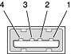

> 导航：[总目录](../../../README.md) · [documentation](../../../_indexes/documentation.md) · [Universal Serial Bus Developer Note](Introduction%20to%20Universal%20Serial%20Bus%20Developer%20Note.md)

[Next](USB%20Product-Specific%20Details.md)[Previous](Introduction%20to%20Universal%20Serial%20Bus%20Developer%20Note.md)

# USB Concepts

This article provides a brief overview of the Universal Serial Bus (USB).

The Universal Serial Bus (USB), as specified by the USB Implementers Forum, supports hot-pluggable connection of up to 127 peripheral devices to a single port, with automatic device detection, identification, and driver configuration. USB was collaboratively designed by several prominent computer technology companies to define a computer-peripheral device connection mechanism that—as its name boldly declares—would be accepted for use on all personal computers. To achieve such a lofty goal, it had to offer several key features, including:

- Simplicity of connection/disconnection, including hot-pluggability
- Low-cost devices and connection equipment
- Standardization and comprehensive applicability
- Flexibility in device support and, consequently, types of data transfers

Concentrating bus control in the host computer limited the feature requirements for peripheral devices, thereby reducing research, development, and production costs. Standardizing the hardware and software interfaces further lowered costs and also simplified customers' purchasing decisions. With these advantages, USB 1.0, introduced in 1996 with a maximum transfer rate of 12 Mbps, rapidly became ubiquitous for connecting input devices such as keyboards and mice. With the adoption of USB 1.1 in 1998, USB-compatible modems, scanners, flash-memory storage devices, printers, and other devices quickly became commonplace. The USB 2.0 standard was officially adopted in 2000 by the USB Implementers Forum, raising the maximum transfer rate to 480 Mbps, allowing support for an even greater variety of devices, including high-resolution still and video digital cameras, disk drives, and audio devices such as the iPod.

USB is described by the standard as a tiered star bus topology. The bus controller in the host computer provides a root hub, which is considered the first tier. From that root hub, each cable hop connects at the second tier to either a _function_ (a peripheral device such as a keyboard or mouse) or another hub, which can connect at the next tier to additional peripherals and hubs. Six tiers are allowed in addition to the tier represented by the root hub, and hubs are not allowed in the seventh tier. Consequently, a maximum of five hubs are allowed between the root hub and a peripheral device. Note that a physical device can include more than a single function, as in the case of printer/scanner/fax machines, and can also include a hub, as in the case of many Apple keyboards.

The USB host controller is considered the bus master; it manages data transfers between a source and a destination using a _pipe_, a logical construct that comprises the configuration, control, and status parameters that define the connection between that source and destination. A special type of pipe, referred to as a default control pipe, is established for the zero endpoint in each device when the device is connected to the bus. Default control pipes are managed by the host controller for bus control purposes and are not visible to client software. Each device reports its configuration information when the host detects the device connected and powered up on the bus. Other pipes can then be created, as required by the class and features of that device. These other pipes are also managed by the host controller but can be used by client applications to access device features. For more information about device classes, see the USB Class Specification documents available from the USB Implementers Forum website [http://www.usb.org/developers/devclass/](http://www.usb.org/developers/devclass/).

The host controller manages all transactions, and most transactions involve transmission of three packets. To initiate each transaction, it polls devices on the bus (at a scheduled interval) by sending a _token packet_ that identifies the address of the device, the _endpoint number_ that specifies the target function, the transfer type, and whether the transfer is directed toward the root hub (_upstream_ or _in_) or away from the root hub (_downstream_ or _out_). Then the source (depending on the transfer direction) sends to the destination either a data packet or an indication that there's no data to send. The destination typically responds with a handshake packet that indicates success or failure of the transfer.

Concentration of control functions in the host allows simpler devices, but imposes limits on bus throughput. This protocol is effective for minimizing bus control overhead.

USB defines three transfer speeds:

- Low-speed, 1.5 Mbps, is used typically for a limited number of devices such as keyboards, mice, and similar human interface devices (HIDs). This limitation helps to avoid degradation of bus utilization.
- Full-speed, 12 Mbps, is used for more data-intensive devices, such as printers and digital cameras.
- High-speed, 480 Mbps, supports more data-intensive devices such as audio and video devices.

To maintain backward compatibility, USB hubs include a transaction translator that can convert high-speed transmissions to low-speed and full-speed rates as needed by downstream devices in the next tier, and, conversely, can convert upstream transmissions from low-speed and full-speed devices to the high-speed rate for transfer to the upstream hub.

USB defines four types of data transfers:

- __Control transfers__ are used to establish the configuration of a device when it is connected to the bus. Can be used for device-specific purposes.
- __Interrupt transfers__ are used to transmit time-critical data as needed, while preserving its integrity. Typically used to avoid perceptible degradation of the user experience.
- __Isochronous transfers__ are used to transmit (or stream) data in real time while tolerating some possible data loss. Typically used for audio streams and video streams.
- __Bulk transfers__ are used to transmit large amounts data reliably with minimal concern for speed. Typically used for transfers to and from devices such as printers and scanners.

Apple's implementation of USB on Macintosh computers conforms to the USB standard where appropriate. USB 1.x support is built-in on all current Macintosh computers, and USB 2.0 support is built-in on some models.

The USB root hub in the computer supports the USB remote wakeup feature to wake the computer from sleep whenever a device is attached to or disconnected from the bus.

Mac OS X supports the USB Mass Storage specification.

USB 1.1 ports, such as those on Apple keyboards, comply with the Universal Serial Bus Specification 1.1 Final Draft Revision. For low-speed (1.5 Mbps) and full-speed (12 Mbps) devices, the USB register set complies with either the Open Host Controller Interface (OHCI) specification or the Universal Host Controller Interface (UHCI) specification.

USB 2.0 ports on Macintosh computers include support for high-speed (480 Mbps) devices using an Enhanced Host Controller Interface (EHCI) or a Universal Host Controller Interface (UHCI). These ports support the use of cables and connectors made to meet earlier versions of the specification, except that high-speed operation requires the use of shielded cables.

Each external Apple USB keyboard (not integrated into a product, as in laptop computers) has a captive cable with a USB Type A connector. The keyboard includes a bus-powered USB hub with two USB Type A ports.

Apple provides an HID class driver for the Apple Keyboard, which supports the USB boot protocol. Other keyboards intended for use on the Macintosh platform must support the HID boot protocol, as defined in the USB Device Class Definition for Human Interface Devices (HIDs).

An external Apple USB modem is available as a configure-to-order option on some Macintosh computers. 

The modem has the following features:

- modem bit rates up to 56 Kbps (supports V.90, V.92, and K56flex modem standards)
- Group 3 fax modem bit rates up to 14.4 Kbps

The modem appears to the system as a USB device controlled by drivers. The modem responds to the typical AT commands and provides the audio stream for call progress monitoring.

USB ports on current Macintosh computers use USB Type A connectors, which have four pins each. Two of the pins are used for power and two for data. [Figure 1](#apple-f4xwc4dqnrsv64tfmyxwi33df52wszbpkridimbqgaztsmbrfvbeeq2jizeusq27gezdambtgmytcnzz) is an illustration of a Type A port; [Table 1](#apple-f4xwc4dqnrsv64tfmyxwi33df52wszbpkridimbqgaztsmbrfvbeeq2ejbauqrs7gezdambtgmytcnzz) shows the signals and pin assignments.

__Figure 1__  USB Type A port and pins

__Table 1__  Signals on the USB port

| Pin | Signal name | Description |
| 1 | VCC | +5 VDC |
| 2 | D– | Data– |
| 3 | D+ | Data+ |
| 4 | GND | Ground |

[Next](USB%20Product-Specific%20Details.md)[Previous](Introduction%20to%20Universal%20Serial%20Bus%20Developer%20Note.md)

