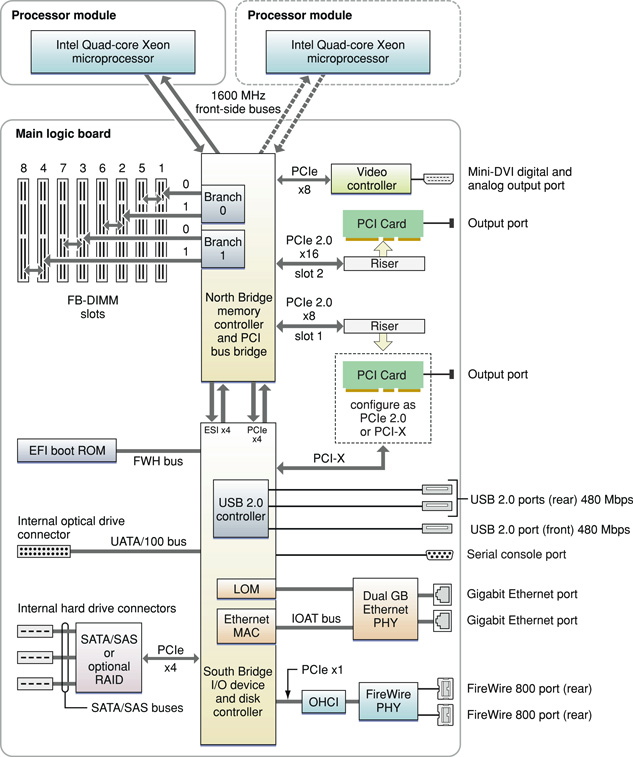

> 导航：[总目录](../../../README.md) · [documentation](../../../_indexes/documentation.md) · [Xserve Developer Note](Introduction%20to%20Xserve%20Developer%20Note.md)

[Next](Document%20Revision%20History.md)[Previous](Introduction%20to%20Xserve%20Developer%20Note.md)

# Xserve Developer Note

This developer note describes the new Xserve based on the Quad-Core Intel Xeon 5400 Series microprocessors and introduced in January 2008. It includes information about distinguishing features of the computer, including components on the main logic board: the microprocessors, the North Bridge memory controller, the South Bridge I/O controller, and the buses that connect them to each other and to the I/O interfaces.

The computer comes with Mac OS X version 10.5.1 or later installed.

The value of the computer model machine identifier string is `Xserve2,1`.

For a description and graphical depiction of the Xserve enclosure and its ports and connectors, refer to the _Xserve User’s Guide_ that shipped with your system.

The architecture of the Xserve is based on Quad-Core Intel Xeon 5400 Series microprocessors, the North Bridge memory controller, and the South Bridge I/O controller. The simplified block diagram is shown in below.

__Figure 1__  Xserve Block diagram

The Xserve is Apple’s sixth generation 1U server. For a complete list of user-visible features, see the Xserve specification sheet at Apple's [Specifications](http://www.info.apple.com/support/applespec.html) site. Other features are described in this section.

The microprocessors in the Xserve are Quad-Core Intel Xeon “Harpertown” 5400 Series with the following features:

- Standard configuration consists of one 2.8 GHz quad-core processor for a 4-core system
- Configure-to-order options are as follows:

  - two 2.8 GHz quad-core processors for an 8-core system
  - two 3.0 GHz quad-core processors for an 8-core system
- 12 MB L2 cache per processor (2 x 6 MB)
- Intel Advanced Digital Media Boost
- Connection to the North Bridge over a 1600 MHz frontside bus
- Supports Intel Extended Memory 64 Technology (EM64T)

See the [Intel Xeon Processor 5000 Sequence](http://www.intel.com/products/processor/xeon5000/index.htm#5300) support site for detailed microprocessor documentation.

Intel Advanced Digital Media Boost accelerates data manipulation by applying a single instruction to multiple data at the same time, known as SIMD processing. SIMD technology accelerates vector math operations and floating-point calculations. Advanced Digital Media Boost supports Intel Streaming SIMD Extensions (SSE) versions 1, 2, 3, and 4 and allows the processor to execute most 128-bit instructions every clock cycle.

For information on Advanced Digital Media Boost, refer to [Technology@Intel Magazine](http://www.intel.com/technology/magazine/computing/core-architecture-0306.htm?iid=hwd_center+coremicroww18&).

SSE4 offers over 50 additional instructions in two major categories:

- SSE4 Vectorizing Compiler and Media Accelerators
- SSE4 Efficient Accelerated String and Text Processing

For information on SSE4, refer to the [Intel Streaming SIMD Extensions 4 (SSE4) Instruction Set Innovation](http://www.intel.com/technology/architecture-silicon/sse4-instructions/index.htm) support site.

When the Xserve is executing a 64-bit application, [EM64T](http://www.intel.com/technology/architecture-silicon/intel64/index.htm) provides the following features:

- Virtual 64-bit addressing significantly increases the amount of physical memory that can be addressed, enabling larger sets to be stored in memory for faster processor operation.
- Extended 64-bit registers allow single operations with integers larger than 32-bits and enable 64-bit addressing.
- Eight general purpose registers improve performance on recompiled applications.
- Eight SIMD registers improve multimedia performance on recompiled applications.

The dual, independent processor buses run at 1600 MHz and connect the processors to the North Bridge. Each front-side bus has a 64-bit wide data bus. Each processor has 64-bit addressing.

The point-to-point architecture provides each subsystem with dedicated bandwidth to main memory. The North Bridge implements an independent processor interface. The input clock to the processor PLL is 400 MHz.

The Xserve comes standard with two 1 GB (total 2 GB), 800 MHz (PC2-6400) DDR2 ECC SDRAM fully-buffered DIMM (FB-DIMM) memory. Memory is connected to the North Bridge via two 128-bit channels (256 bit). Each channel services two memory slots via the Advanced Memory Buffers (AMB) using FB-DIMMs. Maximum memory capacity is 32 GB. For additional information, refer to _[RAM Expansion Developer Note](../RAM%20Expansion%20Developer%20Note/Introduction%20to%20RAM%20Expansion%20Developer%20Note.md#apple-f4xwc4dqnrsv64tfmyxwi33df52wszbpkridimbqgaztamzr)_.

The North Bridge and South Bridge are connected by an Enterprise Southbridge Interface (ESI) bus, a high-speed, bidirectional, point-to-point link supporting a thruput of 1 GBps in each direction.

The 64-bit Extensible Firmware Interface (EFI) boot ROM consists of 2 MB of on-board flash EEPROM. It includes the hardware-specific code and tables needed to start up the computer, load an operating system, and provide common hardware access services.The EFI boot ROM connects to the South Bridge via the Firmware hub (FWH) bus.

Xserve has two, open, 5.0 GHz, PCIe (PCI Express) 2.0 links: one x8 and one x16. Slot two interfaces to the North Bridge via a dedicated PCIe 2.0 x16 link. Slot one is configurable as a PCIe 2.0 x8 link connected to the North Bridge or a PCI-X link connected to the South Bridge.

A video controller interfaces to the North Bridge via a dedicated PCIe x8 link. The SATA/SAS or optional RAID controller interfaces to the South Bridge via a dedicated PCIe x4 link.

The PCIe 2.0 links (5.0 GHz) will auto-detect PCIe (2.5 GHz) devices and downgrade automatically.

For information on PCI Express and PCI-X, refer to _[PCI Developer Note](../../Hardware/PCI%20Developer%20Note/Introduction%20to%20PCI%20Developer%20Note.md#apple-f4xwc4dqnrsv64tfmyxwi33df52wszbpkridimbqgaztamrx)_.

The base configuration graphics subsystem on the Xserve is provided via a mezzanine card as the video controller. The mezzanine card is an ATI Radeon X1300 PCIe, 64 MB GDDR3 SDRAM card that supports a mini-DVI port. Optionally, the Xserve can be shipped without the mezzanine. A mini-DVI to VGA adapter is shipped with the Xserve.

For information on the graphics subsystem and the display capabilities, refer to _[Video Developer Note](../../Hardware/Video%20Developer%20Note/Introduction%20to%20Video%20Developer%20Note.md#apple-f4xwc4dqnrsv64tfmyxwi33df52wszbpkridimbqgaztkmbu)_.

For information on the PCI Express and/or PCI-X buses that support the graphics subsystem, refer to _[PCI Developer Note](../../Hardware/PCI%20Developer%20Note/Introduction%20to%20PCI%20Developer%20Note.md#apple-f4xwc4dqnrsv64tfmyxwi33df52wszbpkridimbqgaztamrx)_.

Xserve has three hard drive bays that support 3-Gbps-capable Serial ATA (SATA) or Serial Attached SCSI (SAS) Apple Drive Modules. The base configuration provides one 80 GB, 7200-rpm, 1.5 Gbps Serial ATA (SATA) disk drive installed.

Available as a configure-to-order option is any combination of SATA or SAS Apple Drive Modules or an Xserve RAID Card supporting RAID 0, 1, 5 with 256 MB cache and 72-hour cache battery backup. With fast 15,000-rpm SAS drives, each SAS drive supports up to 300 GB of data for a total of 900 GB. Using three 1 TB SATA Apple drive modules, the Xserve supports a maximum of 3 TB.

For more information on SATA, see [Serial ATA International Organization](http://www.serialata.org/).

SAS is the next generation of SCSI drives providing the serial communication protocol used for direct attached storage. SAS utilizes a 3 Gbps link and the same physical connection layer as SATA. For more information on SAS, see the [Serial Attached SCSI](http://www.scsita.org/) website.

In the Xserve, the South Bridge controller provides an Ultra ATA/100 interface (running at UATA/66) to a slot-loading 8x double-layer SuperDrive. The drive can read and write DVD media and CD media, as shown in [Table 1](#apple-f4xwc4dqnrsv64tfmyxwi33df52wszbpkridsmbqga2dsnrqfvjvona).

__Table 1__  Types of media read and written by the SuperDrive

| Media type | Reading speed | Writing speed |
| DVD+/-R | 8x (CAV max) | 8x, 4x, 2x, 1x (CLV) single-layer, depending on media |
| DVD+R DL | 6x (CAV max) | 2.4x (CLV) double-layer, depending on media |
| DVD-ROM | 8x DVD5 (CAV max); 6x DVD9 (CAV max) | – |
| DVD-RW | 6x (CAV max) | 4x, 2x, 1x (CLV) depending on media |
| DVD+RW | 6x (CAV max) | 4x, 2.4x (CLV) depending on media |
| CD-R | 24x (CAV max) | 24x ZCLV |
| CD-RW | 24x (CAV max) | 16x ZCLV (high speed media) |
| CD-ROM | 24x (CAV max) | – |

The optical drive is configured as cable select and complies with the ATA/ATAPI-5 industry standard. For information on parallel ATA interfaces, see the International Committee on Information Technology Standards (INCITS) Technical Committee T13 [AT Attachment](http://www.t13.org/) website.

The Xserve has two IEEE-1394b FireWire 800 ports, which support transfer rates of 100, 200, 400, and 800 Mbps. For more information, see _[FireWire Developer Note](../FireWire%20Developer%20Note/Introduction%20to%20FireWire%20Developer%20Note.md#apple-f4xwc4dqnrsv64tfmyxwi33df52wszbpkridimbqgaztamry)_.

The Xserve has two Gigabit Ethernet ports with jumbo frame support for 10BASE-T/UTP, 100BASE-TX, and 1000BASE-T operation.The Ethernet MAC is internal to the South Bridge and interfaces via the I/O Acceleration Technology (IOAT) bus. For more information, see _[Ethernet Developer Note](../Ethernet%20Developer%20Note/Introduction%20to%20Ethernet%20Developer%20Note.md#apple-f4xwc4dqnrsv64tfmyxwi33df52wszbpkridimbqgaztamrz)_.

The South Bridge includes an integrated USB 2.0 controller supporting two external USB 2.0 ports in the rear and one in the front. The USB ports comply with the Universal Serial Bus Specification 2.0. For more information, see _[Universal Serial Bus Developer Note](../Universal%20Serial%20Bus%20Developer%20Note/Introduction%20to%20Universal%20Serial%20Bus%20Developer%20Note.md#apple-f4xwc4dqnrsv64tfmyxwi33df52wszbpkridimbqgaztamrw)_.

The Xserve has one DB-9 (RS-232-compatible) serial port on the rear panel.

Xserve lights-out management (LOM) capabilities allow remote control of an Xserve system from anywhere on the network or over the Internet. Enabled by built-in hardware, the LOM remote management system continues to run as long as the system is plugged into power, even if the system is powered off or in a hung state. Xserve monitoring tools run securely over TCP/IP, using password authentication that is based on version 2.0 of the Intelligent Platform Management Interface (IPMI).

For information on Apple’s implementation of lights-out management, see [Lights-Out Management](http://www.apple.com/xserve/management.html).

For information on the Intel lights-out management specifications, see [Intelligent Platform Management Interface](http://www.intel.com/design/servers/ipmi/index.htm).

The Xserve uses an advanced system management controller (SMC) to manage thermal and power conditions, while keeping the acoustic noise to a minimum. The SMC is fully independent of the operating system.

[Next](Document%20Revision%20History.md)[Previous](Introduction%20to%20Xserve%20Developer%20Note.md)

