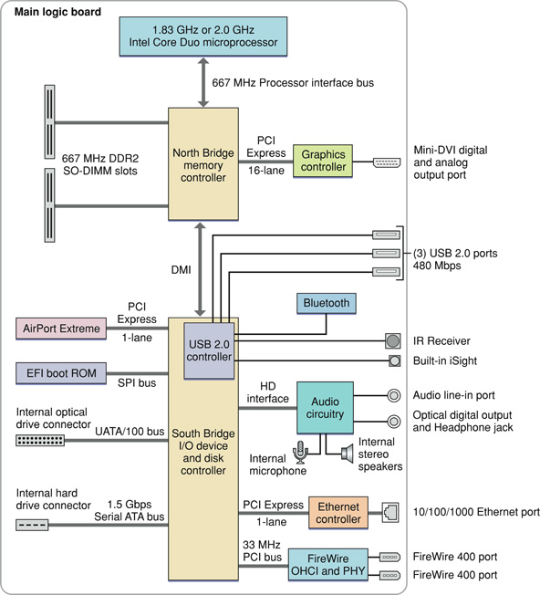

> 导航：[总目录](../../../README.md) · [documentation](../../../_indexes/documentation.md) · [iMac Developer Note](Introduction%20to%20iMac%20Developer%20Note.md)

[Next](Document%20Revision%20History.md)[Previous](Introduction%20to%20iMac%20Developer%20Note.md)

# iMac Developer Note

This note describes the iMac computers based on the Intel Core Duo microprocessor and introduced in January 2006. It includes information about distinguishing features of the computer, including components on the main logic board: the microprocessor, the other main ICs, and the buses that connect them to each other and to the I/O interfaces.

The computer comes with Mac OS X version 10.4.5 installed.

The value of the iMac model identifier string is `iMac4,1`.

The architecture of the iMac is based on the Intel Core Duo microprocessor and two custom ICs, the North Bridge memory controller and the South Bridge I/O controller, connected to each other by a Direct Media Interface (DMI) bus. The North Bridge IC provides the bridging functionality among the processor, the memory system, the DMI, and the 16-lane PCI Express bus to the graphics controller. The South Bridge IC supports these components:

- Ultra ATA/100 bus for the optical drive
- A 1.5 Gbps Serial ATA (SATA) bus for the disk drive
- 1-lane PCI Express link for the AirPort Extreme module
- SPI bus to the EFI boot ROM
- USB 2.0 controller, which in turn supports the Bluetooth module, IR receiver, built-in iSight camera, and 3 external USB 2.0 ports
- Channel to the audio subsystem
- 1-lane PCI Express link for the Ethernet PHY
- 33 MHz, 32-bit internal PCI bus to the FireWire 400 (1394a) OHCI and PHY

A DMA controller internal to the South Bridge supports LPC DMA (low pin count direct memory access). The DMA controller has registers that are fixed in the lower 64 KB of I/O space. The DMA controller is configured using registers in the PCI configuration space.

Figure 1 provides a simplified block diagram of the North Bridge and South Bridge ICs and the buses that connect them together. 

__Figure 1__  Block diagram

The iMac computer includes a programmable Apple Mighty Mouse, a built-in iSight video camera, an integrated IR receiver, and the Apple Remote. For a complete list of user-visible features, see the iMac specification sheet at Apple's [Specifications](http://www.info.apple.com/support/applespec.html) site. Other features are described in this section.

The microprocessor in the iMac is an Intel Core Duo with a clock speed of 1.83 GHz in the 17-inch configuration and 2.0 GHz in the 20-inch configuration. It has the following features:

- 1.83 GHz or 2.0 GHz dual core processors
- 2 MB shared L2 cache
- Digital Media Boost
- Connection to the North Bridge IC over a 667 MHz frontside bus

See the [Intel Core Duo Processors](http://www.intel.com/products/processor/coreduo/) support site for detailed microprocessor documentation.

 Intel Digital Media Boost accelerates data manipulation by applying a single instruction to multiple data at the same time, known as SIMD processing. SIMD technology accelerates vector math operations and floating-point calculations. Digital Media Boost supports Intel Streaming SIMD Extensions (SSE) versions 1, 2, and 3.

For information on Digital Media Boost, refer to the following websites.

[http://www.intel.com/products/processor/coreduo/digitalmediaboost.htm](http://www.intel.com/products/processor/coreduo/digitalmediaboost.htm)

The processor bus is an up-to-667 MHz bus connecting the processor to the North Bridge IC. The bus has 32-bit wide data running in both directions. The processor has 32-bit addressing. 

The point-to-point architecture provides each subsystem with dedicated bandwidth to main memory. The North Bridge IC implements an independent processor interface. The input clock to the processor PLL is 166 MHz.

The computer provides two RAM slots that accommodate 200-pin DDR2 SDRAM SO-DIMMs up to 1.25” in height. The SO-DIMMs must be DDR2 PC2-5300-compliant and must be unbuffered, unregistered, 8-byte, nonparity, and non-ECC. For additional information, refer to _[RAM Expansion Developer Note](../RAM%20Expansion%20Developer%20Note/Introduction%20to%20RAM%20Expansion%20Developer%20Note.md#apple-f4xwc4dqnrsv64tfmyxwi33df52wszbpkridimbqgaztamzr)_.

The North Bridge and South Bridge ICs are connected by a Direct Media Interface (DMI) bus, a high-speed, bidirectional, point-to-point link supporting a clock rate of 1 GBps in each direction

The Extensible Firmware Interface (EFI) boot ROM consists of 2 MB of on-board flash EEPROM. It includes the hardware-specific code and tables needed to start up the computer, load an operating system, and provide common hardware access services.The EFI boot ROM connects to the South Bridge via the Serial Programmable Interface (SPI) bus.

The graphics subsystem includes an ATI Radeon X1600 IC, with 128 MB GDDR3 SDRAM, connected to the North Bridge IC by a x16 link (16 lane), dual simplex, 2.5 GHz PCI Express bus. The iMac has a mini-DVI connector for an external video monitor and supports video mirroring mode and extended desktop display mode. For more information on the graphics subsystem and display capabilities, refer to _[Video Developer Note](../../Hardware/Video%20Developer%20Note/Introduction%20to%20Video%20Developer%20Note.md#apple-f4xwc4dqnrsv64tfmyxwi33df52wszbpkridimbqgaztkmbu)_.

For more information on PCI Express, refer to _[PCI Developer Note](../../Hardware/PCI%20Developer%20Note/Introduction%20to%20PCI%20Developer%20Note.md#apple-f4xwc4dqnrsv64tfmyxwi33df52wszbpkridimbqgaztamrx)_.

The iMac supports a 7200 rpm Serial ATA (SATA) disk drive through an AHCI 1.1 controller that supports advanced SATA-II features Native Command Queuing (NCQ) and PHY power management and operates at Serial ATA Gen-I (1.5 Gbps) interface speed. NCQ increases performance on random workloads by allowing the drive to re-order commands to reduce seek time and increase transactional efficiency.

For more information on SATA, see the [Serial ATA International Organization](http://www.serialata.org/) (SATA-IO) website.

For information on the AHCI controller, see [http://www.intel.com/technology/serialata/ahci.htm](http://www.intel.com/technology/serialata/ahci.htm).

In the iMac computer, the South Bridge controller provides an Ultra ATA/100 interface to the slot-loading, 8x SuperDrive with double layer burning capability. The drive can read and write DVD media and CD media, as shown in [Table 1](#apple-f4xwc4dqnrsv64tfmyxwi33df52wszbpkridimbqga2dkmzyfvjvomq).

__Table 1__  Types of media read and written by the SuperDrive

| Media type | Reading speed | Writing speed |
| DVD +/- R | 8x (CAV) | 8x ZCLV |
| DVD+R DL | 8x (CAV) | 2.4x CLV |
| DVD-ROM | 8x (CAV) | – |
| DVD-ROM DL | 8x (CAV) | – |
| DVD +/- RW | 8x (CAV) | 4x ZCLV |
| CD-R | 24x (CAV) | 24x ZCLV |
| CD-RW | 24x (CAV) | 8x ZCLV |
| CD-ROM | 24x (CAV) | – |

The SuperDrive is cable-select as device 0 (master) and complies with the ATA/ATAPI-7 industry standard. For information on parallel ATA interfaces, see the International Committee on Information Technology Standards (INCITS) Technical Committee T13 [AT Attachment](http://www.t13.org/) website.

The computer has two IEEE-1394a FireWire 400 ports, which support transfer rates of 100, 200, and 400 Mbps. For more information, see _[FireWire Developer Note](../FireWire%20Developer%20Note/Introduction%20to%20FireWire%20Developer%20Note.md#apple-f4xwc4dqnrsv64tfmyxwi33df52wszbpkridimbqgaztamry)_.

The computer has a built in Ethernet port for a 10BASE-T/UTP, 100BASE-TX and 1000BASE-T Gigabit operation. For more information, see _[Ethernet Developer Note](../Ethernet%20Developer%20Note/Introduction%20to%20Ethernet%20Developer%20Note.md#apple-f4xwc4dqnrsv64tfmyxwi33df52wszbpkridimbqgaztamrz)_.

The South Bridge IC includes an integrated USB 2.0 controller supporting three external USB ports, the Bluetooth module, the IR receiver, and the built-in iSight camera. The USB ports comply with the Universal Serial Bus Specification 2.0. For more information, see _[Universal Serial Bus Developer Note](../Universal%20Serial%20Bus%20Developer%20Note/Introduction%20to%20Universal%20Serial%20Bus%20Developer%20Note.md#apple-f4xwc4dqnrsv64tfmyxwi33df52wszbpkridimbqgaztamrw)_.

The iMac computer has an internal AirPort Extreme module connected to a dedicated 1-lane PCI Express link and a Bluetooth 2.0 + EDR (enhanced data rate) module connected to the USB 2.0 controller. AirPort Extreme and Bluetooth have built-in antennas.  For more information, see _[AirPort Developer Note](../AirPort%20Developer%20Note/Introduction%20to%20AirPort%20Developer%20Note.md#apple-f4xwc4dqnrsv64tfmyxwi33df52wszbpkridimbqgaztamzq)_ and _[Bluetooth Developer Note](../Bluetooth%20Developer%20Note/Introduction%20to%20Bluetooth%20Developer%20Note.md#apple-f4xwc4dqnrsv64tfmyxwi33df52wszbpkridimbqgaztamzs)_.

The computer has a built-in microphone (located at the top of the display), and both an analog audio line-in jack and a combined analog and S/PDIF digital optical audio line-out jack on the rear panel. For more information, see _[Audio Developer Note](../../Hardware/Audio%20Developer%20Note/Introduction%20to%20Audio%20Developer%20Note.md#apple-f4xwc4dqnrsv64tfmyxwi33df52wszbpkridimbqgaztkmbv)_.

The iMac uses an advanced system management controller (SMC) to manage thermal and power conditions, while keeping the acoustic noise to a minimum. The SMC is fully independent of the operating system.

[Next](Document%20Revision%20History.md)[Previous](Introduction%20to%20iMac%20Developer%20Note.md)

