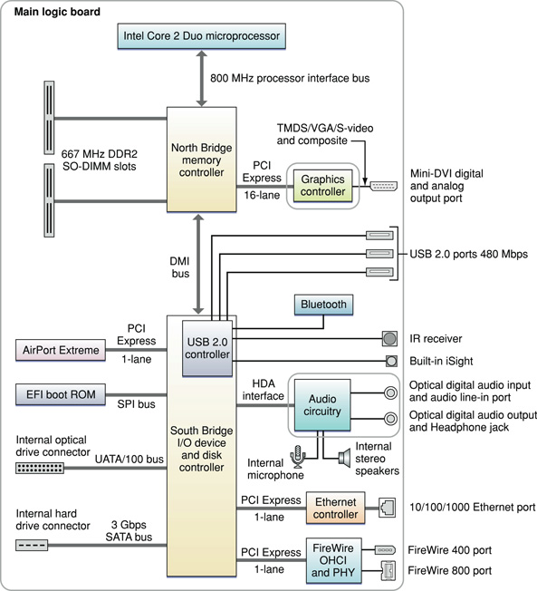

> 导航：[总目录](../../../README.md) · [documentation](../../../_indexes/documentation.md) · [iMac Developer Note](Introduction%20to%20iMac%20Developer%20Note.md)

[Next](Document%20Revision%20History.md)[Previous](Introduction%20to%20iMac%20Developer%20Note.md)

# iMac Developer Note

This note describes the 20” iMac computer and the 24” iMac computer, introduced in August 2007, based on the Intel Core 2 Duo microprocessor. It includes information about distinguishing features of the computers, including components on the main logic board: the microprocessor, the other main ICs, and the buses that connect them to each other and to the I/O interfaces.

The iMac computers come with Mac OS X version 10.4.10 installed.

The value of the model identifier string is `iMac7,1`.

The architecture of the iMac is based on the Intel Core 2 Duo microprocessor, the North Bridge memory controller, and the South Bridge I/O controller. The North Bridge and South Bridge are connected to each other by a Direct Media Interface (DMI) bus. The North Bridge IC provides the bridging functionality among the processor, the memory system, the DMI, and the internal graphics controller. The South Bridge IC supports these components:

- Ultra ATA/100 bus for the optical drive, running at UATA/33 or UATA/66
- A 3 Gbps Serial ATA (SATA) bus for the hard disk drive
- 1-lane PCI Express link for the AirPort Extreme module
- SPI bus to the EFI boot ROM
- USB 2.0 controller, which supports the IR receiver, built-in iSight camera, Bluetooth, and 3 external USB 2.0 ports
- High Definition Audio (HDA) channel to the audio subsystem
- 1-lane PCI Express link for the Ethernet PHY
- 1-lane PCI Express link for the FireWire OHCI and PHY

For more information on PCI Express, refer to _[PCI Developer Note](../../Hardware/PCI%20Developer%20Note/Introduction%20to%20PCI%20Developer%20Note.md#apple-f4xwc4dqnrsv64tfmyxwi33df52wszbpkridimbqgaztamrx)_.

A DMA controller internal to the South Bridge supports LPC DMA (low pin count direct memory access). The DMA controller has registers that are fixed in the lower 64 KB of I/O space. The DMA controller is configured using registers in the PCI configuration space.

Figure 1 provides a simplified block diagram of the North Bridge and South Bridge ICs and the buses that connect them together.

__Figure 1__  Block diagram

The iMac computers include a programmable Apple Mighty Mouse, an Apple keyboard, a built-in iSight video camera, and an integrated IR receiver to work with the included Apple Remote. For a complete list of user-visible features, see the iMac specification sheet at Apple's [Specifications](http://www.info.apple.com/support/applespec.html) site. Other features are described in this section.

The microprocessor in the iMac is an Intel Core 2 Duo with the following features:

- 20” iMac: 2.0 or 2.4 GHz dual-core processor
- 24” iMac: 2.4 GHz dual-core processor or configure-to-order 2.8 GHz dual-core processor
- 4 MB shared L2 cache
- Intel Advanced Digital Media Boost
- Connection to the North Bridge IC over an 800 MHz frontside bus
- Supports Intel 64 Architecture

See the [Intel Core 2 Duo Processors](http://www.intel.com/products/processor/coreduo/) support site for detailed microprocessor documentation.

Intel Advanced Digital Media Boost accelerates data manipulation by applying a single instruction to multiple data at the same time, known as SIMD processing. SIMD technology accelerates vector math operations and floating-point calculations. Advanced Digital Media Boost supports Intel Streaming SIMD Extensions (SSE) versions 1, 2, and 3 and allows the processor to execute an SSE3 instruction every clock cycle.

For information on Advanced Digital Media Boost, refer to [Technology@Intel Magazine](http://www.intel.com/technology/magazine/computing/core-architecture-0306.htm?iid=hwd_center+coremicroww18&).

Intel 64 architecture increases the linear address space for software to 64 bits and supports physical address space up to 40 bits. The technology also introduces a new operating mode referred to as IA-32e mode. IA-32e mode operates in one of two sub-modes:

- Compatibility mode enables a 64-bit operating system to run most legacy 32-bit software unmodified
- 64-bit mode enables a 64-bit operating system to run applications written to access 64-bit address space

In the 64-bit mode, applications may access:

- 64-bit flat linear addressing
- 8 additional general-purpose registers (GPRs)
- 8 additional registers for streaming SIMD extensions (SSE, SSE2, SSE3 and SSSE3)
- 64-bit-wide GPRs and instruction pointers
- Uniform byte-register addressing
- Fast interrupt-prioritization mechanism
- New instruction-pointer relative-addressing mode

An Intel 64 Architecture processor supports existing IA-32 software because it is able to run all non-64-bit legacy modes supported by IA-32 architecture. Most existing IA-32 applications also run in compatibility mode.

For information on Intel 64 Architecture, refer to the following website:

[http://www.intel.com/technology/architecture-silicon/intel64/index.htm](http://www.intel.com/technology/architecture-silicon/intel64/index.htm)

The processor bus is an up-to-800 MHz bus connecting the processor to the North Bridge IC. The bus has 32-bit wide data running in both directions. The processor has 32-bit addressing. 

The point-to-point architecture provides each subsystem with dedicated bandwidth to main memory. The North Bridge IC implements an independent processor interface. The input clock to the processor PLL is 200 MHz.

The iMac provides two RAM slots that accommodate 200-pin DDR2 SDRAM SO-DIMMs up to 1.25” in height. The SO-DIMMs must be DDR2 PC2-5300-compliant and must be unbuffered, unregistered, 8-byte, nonparity, and non-ECC. Both 20” iMac and the 24” iMac ship with one 1 GB DDR2 SDRAM SO-DIMM. Maximum memory capacity is 4 GB. For additional information, refer to _[RAM Expansion Developer Note](../RAM%20Expansion%20Developer%20Note/Introduction%20to%20RAM%20Expansion%20Developer%20Note.md#apple-f4xwc4dqnrsv64tfmyxwi33df52wszbpkridimbqgaztamzr)_.

The North Bridge and South Bridge are connected by a Direct Media Interface (DMI) bus, a high-speed, bidirectional, point-to-point link supporting a data rate of 1 GBps in each direction.

The Extensible Firmware Interface (EFI) boot ROM consists of 2 MB of on-board flash EEPROM. It includes the hardware-specific code and tables needed to start up the computer, load an operating system, and provide common hardware access services.The EFI boot ROM connects to the South Bridge via the Serial Programmable Interface (SPI) bus.

The iMac has a mini-DVI-I connector for an external video monitor and supports video mirroring mode and extended desktop display mode. For more information on the graphics subsystem, supported graphics cards, and display capabilities, refer to _[Video Developer Note](../../Hardware/Video%20Developer%20Note/Introduction%20to%20Video%20Developer%20Note.md#apple-f4xwc4dqnrsv64tfmyxwi33df52wszbpkridimbqgaztkmbu)_.

The iMac supports a 7200 rpm Serial ATA (SATA) disk drive through an AHCI 1.1 controller that supports advanced SATA-II features Native Command Queuing (NCQ) and PHY power management and operates at 3 Gbps Serial ATA interface speed. NCQ increases performance on random workloads by allowing the drive to re-order commands to reduce seek time and increase transactional efficiency.

For more information on SATA, see the [Serial ATA International Organization](http://www.serialata.org/) (SATA-IO) website.

For information on the AHCI controller, see [http://www.intel.com/technology/serialata/ahci.htm](http://www.intel.com/technology/serialata/ahci.htm).

In the iMac, the South Bridge controller provides an Ultra ATA/100 interface to the slim slot SuperDrive optical drive that operates at UATA/33 or UATA/66. The drive can read and write CD and DVD media as shown in [Table 1](#apple-f4xwc4dqnrsv64tfmyxwi33df52wszbpkridsmbqga2dqmrzfvjvomq).

__Table 1__  Types of media read and written by the SuperDrive

| Media type | Reading speed | Writing speed |
| DVD+/-R | 8x CAV | 8x CAV or ZCLV |
| DVD+/-R DL | 6x CAV | 4x ZCLV |
| DVD+RW | 8x CAV | 8x ZCLV |
| DVD-RW | 8x CAV | 6x ZCLV |
| DVD-ROM SL | 8x CAV | – |
| DVD-ROM | 6x CAV | – |
| CD-R | 24x CAV | 24x CAV or ZCLV |
| CD-RW | 24x CAV | 16x ZCLV |
| CD-ROM | 24x CAV | – |

The optical drive is configured as cable select and complies with the ATA/ATAPI-5 industry standard. For information on parallel ATA interfaces, see the International Committee on Information Technology Standards (INCITS) Technical Committee T13 [AT Attachment](http://www.t13.org/) website.

The iMac supports one IEEE-1394a FireWire 400 port at transfer rates of 100, 200, and 400 Mbps and one IEEE-1394b FireWire 800 port at transfer rates of 100, 200, 400, and 800 Mbps. For more information, see _[FireWire Developer Note](../FireWire%20Developer%20Note/Introduction%20to%20FireWire%20Developer%20Note.md#apple-f4xwc4dqnrsv64tfmyxwi33df52wszbpkridimbqgaztamry)_.

The iMac has a built in Ethernet port for 10BASE-T/UTP, 100BASE-TX and 1000BASE-T Gigabit operation. For more information, see _[Ethernet Developer Note](../Ethernet%20Developer%20Note/Introduction%20to%20Ethernet%20Developer%20Note.md#apple-f4xwc4dqnrsv64tfmyxwi33df52wszbpkridimbqgaztamrz)_.

The South Bridge IC includes an integrated USB 2.0 controller supporting three external USB ports, the IR receiver, Bluetooth + EDR, and the built-in iSight camera. The USB ports comply with the Universal Serial Bus Specification 2.0. For more information, see _[Universal Serial Bus Developer Note](../Universal%20Serial%20Bus%20Developer%20Note/Introduction%20to%20Universal%20Serial%20Bus%20Developer%20Note.md#apple-f4xwc4dqnrsv64tfmyxwi33df52wszbpkridimbqgaztamrw)_.

The iMac has an internal AirPort Extreme module connected to a dedicated 1-lane PCI Express link with antennas built into the enclosure. For more information, see _[AirPort Developer Note](../AirPort%20Developer%20Note/Introduction%20to%20AirPort%20Developer%20Note.md#apple-f4xwc4dqnrsv64tfmyxwi33df52wszbpkridimbqgaztamzq)_.

The iMac comes standard with an internal Bluetooth 2.0 + EDR (enhanced data rate) module, with an antenna built into the enclosure. The Bluetooth module is connected via the internal USB 2.0 controller. For more information, see _[Bluetooth Developer Note](../Bluetooth%20Developer%20Note/Introduction%20to%20Bluetooth%20Developer%20Note.md#apple-f4xwc4dqnrsv64tfmyxwi33df52wszbpkridimbqgaztamzs)_.

The iMac has a built-in microphone, a combined analog audio in and S/PDIF digital optical audio in jack, internal speakers, and a combined analog output and S/PDIF digital optical audio out jack. For more information, see _[Audio Developer Note](../../Hardware/Audio%20Developer%20Note/Introduction%20to%20Audio%20Developer%20Note.md#apple-f4xwc4dqnrsv64tfmyxwi33df52wszbpkridimbqgaztkmbv)_.

The iMac uses an advanced system management controller (SMC) to manage thermal and power conditions, while keeping the acoustic noise to a minimum. The SMC is fully independent of the operating system.

[Next](Document%20Revision%20History.md)[Previous](Introduction%20to%20iMac%20Developer%20Note.md)

