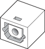

> 导航：[总目录](../../../README.md) · [documentation](../../../_indexes/documentation.md) · [Audio Developer Note](Introduction%20to%20Audio%20Developer%20Note.md)

[Next](Audio%20Product-Specific%20Details.md)[Previous](Introduction%20to%20Audio%20Developer%20Note.md)

# Audio Concepts

This article provides an overview of audio technology, specifically as it is implemented in Macintosh computers introduced after September 2005.

All current Macintosh computers include the circuitry to play high-quality audio content. Hardware features differ among Macintosh models, as appropriate for the expected use of that model.

Digital audio I/O conforms to the Sony/Philips Digital Interface (S/PDIF) model. S/PDIF technology results in a clean audio signal with no noise added as a result of transmission to or from the external audio device.

Most models support analog audio in and typically have a built-in microphone. Some models support S/PDIF digital audio in through an optical digital interface.

All models support analog audio out, through an internal speaker or speakers, a headphone jack, a line-out jack, or some combination of the three. Computers described in this note also provide digital audio out, through both an electrical interface and an optical digital interface.

Analog audio input, headphone output, and audio line-out signals may be provided electrically through a standard 3.5 mm (1/8”) miniature phone jack (often called a mini-jack). The combo jack accepts standard electrical audio cables with a 3.5 mm stereo plug. 

The signals are connected as follows:

|  |  |
| --- | --- |
| Tip | Left-channel audio |
| Ring | Right-channel audio |
| Sleeve | Audio ground |

Both electrical and optical audio signals are provided by the computer through the combination audio jack, commonly called the combo jack. The combo jack accepts standard electrical audio cables with a 3.5 mm (1/8”) stereo plug and standard TOSLINK optical cables with a 3.5 mm optical plug. Adapters are available that attach to the friction-lock type F-05 plug to convert it to a 3.5 mm optical plug. TOSLINK cables are available from pro-audio, musician’s supply, hi-fi and other retailers.

The electrical signals for the combo jack are connected as they are with the standard 3.5 mm electrical jack, described in the previous section.

Digital audio signals can be provided by a 7.5 mm optical digital jack. The physical connector, shown in Figure 1, is commonly referred to as a TOSLINK connector. The jack is for both input and output and conforms to IEC 60874-17.

__Figure 1__  Optical digital S/PDIF connector

Cables with TOSLINK friction-lock type F-05 connectors are available from pro-audio, musician’s supply, hi-fi and other retailers.

[Next](Audio%20Product-Specific%20Details.md)[Previous](Introduction%20to%20Audio%20Developer%20Note.md)

