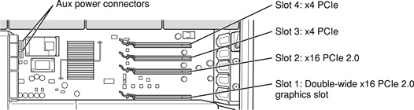
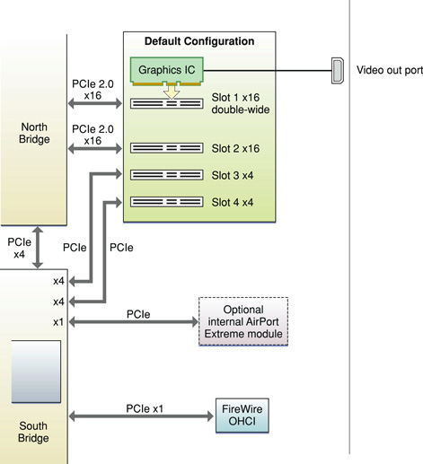
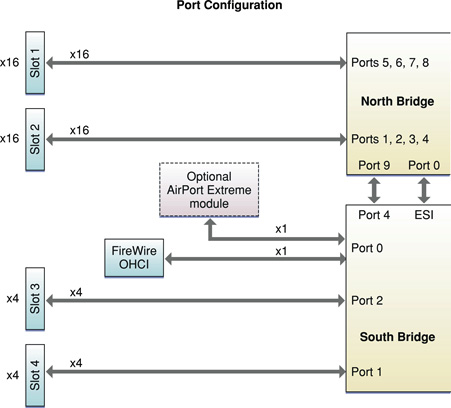
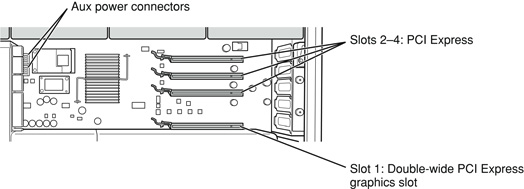
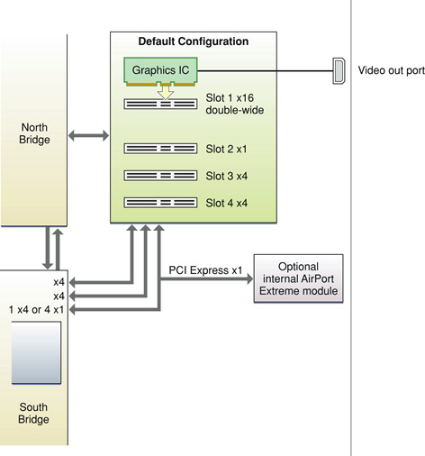
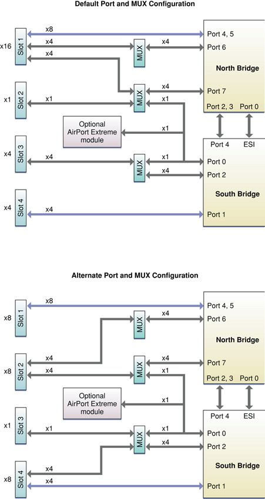
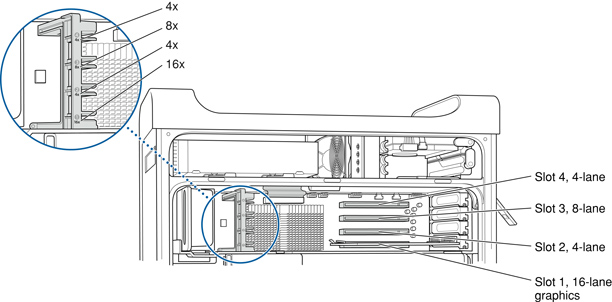

> 导航：[总目录](../../../README.md) · [documentation](../../../_indexes/documentation.md) · [PCI Developer Note](Introduction%20to%20PCI%20Developer%20Note.md)

[Next](Document%20Revision%20History.md)[Previous](PCI%20Concepts.md)

# PCI Product-Specific Details

This article highlights details of the PCI implementation specific to particular Mac computers. Unless otherwise specified in this article, PCI support on a Mac computer adheres to the information in [PCI Concepts](PCI%20Concepts.md#apple-f4xwc4dqnrsv64tfmyxwi33df52wszbpkridimbqgaztsmzyfvjvomk7gezdambtgmytcnzv).

This section provides PCI-specific information for Mac Pro computers introduced beginning August 2006. Refer to the specific Mac Pro developer note for additional information.

The Mac Pro computers with Quad-Core Intel Xeon 5400 Series microprocessors were introduced in January 2008. The Mac Pro provides PCI Express (PCIe) 2.0 and 1.0a interfaces as described in the following paragraphs. In this document, PCIe 1.0a is referred to as simply PCIe.

The Mac Pro implements two PCIe 2.0 dual simplex, 5.0 GHz buses with 16-lane (x16) links and two PCIe 2.5 GHz buses with 4-lane (x4) links. The 5.0 GHz links will auto-detect 2.5 GHz devices and downgrade automatically.

The FireWire OHCI and optional Airport Express module connect via dedicated PCIe x1 interfaces.

Each lane is differential, 8B/10B encoded to reduce SSO and crosstalk noise, and signals are AC-coupled to eliminate DC bias issues. The bus operates with an embedded clock in each differential bit lane, eliminating the need for an accompanying clock with the PCI Express data. Each slot is provided with a 100 MHz spread spectrum clock.

As shown in [Figure 1](#apple-f4xwc4dqnrsv64tfmyxwi33df52wszbpkridimbqgaztsmzxfvjvoobrl4ytembqgmztcmjxgu), slot one is double-wide and supports the graphics card; slots two, three, and four are available for expansion. Each slot has room for a full length 312.00 mm (12.238 inch) or half length 167.65 mm (6.600 inch) card.

__Figure 1__  PCI Express slots

All four slots can accommodate PCI Express cards that have up to 16 lanes. However, if a card is installed in a slot with a lesser bandwidth than it requires, it will run at the lower bandwidth; for example, an x8 card installed in an x4 slot will run at x4.

For optimal PCI Express performance, use slots one and two first, followed by slots three and four. For best performance, insert PCIe 2.0 cards in slots one and two. When installed in slots three or four, PCIe 2.0 cards will automatically downgrade to PCIe speeds.

Mac Pro implements robust automatic detection, requiring no manual user configuration. Mac Pro detects whether an inserted card is PCIe 2.0 (5.0 GHz) or PCIe (2.5 GHz) and selects the operation depending on the card's maximum capability.

For instructions on installing PCI Express expansion cards, refer to the "Adding PCI Express Cards” section in the _Mac Pro User’s Guide_ that shipped with your computer.

When installing a new PCI Express card, follow the driver installation documentation provided by the manufacturer of the PCI Express card.

For information on the supported graphics cards, refer to the _[Video Developer Note](../Video%20Developer%20Note/Introduction%20to%20Video%20Developer%20Note.md#apple-f4xwc4dqnrsv64tfmyxwi33df52wszbpkridimbqgaztkmbu)_.

The figure below provides a description of the PCI Express architecture.

__Figure 2__  PCI Express Architecture

Based on the type of PCI Express card, the aggregate bandwidths (transmit and receive) of the lanes are listed below:

| Lanes | PCIe bandwidth | PCIe 2.0 bandwidth |
| --- | --- | --- |
| x1 | 500 MBps | 1 GBps |
| x4 | 2 GBps | 4 GBps |
| x8 | 4 GBps | 8 GBps |
| x16 | 8 GBps | 16 GBps |

All four PCI Express slots conform to the PCI Express Spec Common Electromechanical Specification 1.1. Slots one and two also conform to the PCI Express x16 150W-ATX Specification 1.0 for power through the two auxiliary power connectors for 12 V at 6.25 A max. If a PCI Express card installed in slot one requires auxiliary power, connect the booster cable to the lower auxiliary power connector. If a PCI Express card installed in slot two requires auxiliary power, connect the booster cable to the upper auxiliary power connector.

For information on PCI Express specifications and design guides, refer to the [PCI-SIG](http://www.pcisig.com/) website.

Each PCI Express slot provides 3.3 V and 12 V power rails. On the 3.3 V rail, each slot may use a maximum of 10 W. On the 12 V rail, each slot may use a maximum of 65 W (not including auxiliary power), subject to the total wattage rules listed below.

When populating the four PCI Express slots, you need to conform to the following total wattage rules:

- Slots one and two (not including aux power), max slot power per slot: 75 W
- Slots three and four (not including aux power), max slot power per slot: 40 W
- All four slots (not including aux power), max total power: 200 W
- Max aux power per connector: 75 W
- Max aux power for both connectors: 150 W
- Max total PCI Express power (slot power and aux connector power): 300 W

The PCI Express slots carry the 3.3 V_AUX power and WAKE# signals to allow an expansion card to wake the computer from sleep mode.

The Mac Pro has 32 PCI Express lanes from the North Bridge and 8 PCI Express lanes from the South Bridge. The figure below shows the mapping of the PCI Express lanes from the North Bridge and South Bridge to the PCI Express slots.

__Figure 3__  PCI Express Lane Mapping

The North Bridge has ten ports (0 to 9) for high speed serial I/O. Ports 1 to 8 run at the equivalent speed of an x4 PCIe 2.0 link and provide the two 16-lane PCIe 2.0 slots. Ports 0 and 9 run at the equivalent speed of an x4 PCIe (1.1) link and connect the North Bridge to the South Bridge.

The South Bridge has five ports (ESI, 0, 1, 2, 4). Ports 1 and 2 provide the 8 lanes to the PCI Express slots 3 and 4. Port 0 provides x1 lanes for the optional Airport Express card and the Firewire OHCI. Port 4 and the Enterprise Southbridge Interface (ESI) port connect the South Bridge to the North Bridge.

The quad-core Mac Pro was introduced in August 2006 and the 8-core Mac Pro was introduced in April 2007 as a configure-to-order-option. The Mac Pro provides PCI interface as described in the following paragraphs.

An internal 33 MHz PCI bus connects the South Bridge IC to the FireWire OHCI. The North Bridge IC used in the Mac Pro supports the PCI write combining feature. This feature allows sequential write transactions involving the Memory Write or Memory Write and Invalidate commands to be combined into a single PCI transaction. For memory write transactions to be combined, they must be sequential, ascending, and non-overlapping PCI addresses.

The Mac Pro implements four PCI Express dual simplex, 2.5 GHz buses with up to 16-lane (x16) links. Each lane is differential, 8B/10B encoded to reduce SSO and crosstalk noise, and signals are AC-coupled to eliminate DC bias issues. The bus operates with an embedded clock in each differential bit lane, eliminating the need for an accompanying clock with the PCI Express data.

The Mac Pro supports four PCI Express slots. Slot one is double-wide and supports the factory-installed graphics card; for information on the supported graphics cards, refer to the _[Video Developer Note](../Video%20Developer%20Note/Introduction%20to%20Video%20Developer%20Note.md#apple-f4xwc4dqnrsv64tfmyxwi33df52wszbpkridimbqgaztkmbu)_. Slots two, three, and four are available for expansion. As shown below, the Mac Pro has four openings in the back of the case for access to I/O connectors on the video card and any cards in the three expansion slots. Each slot has room for a full length 312.00 mm (12.238 inch) or half length 167.65 mm (6.600 inch) card.

__Figure 4__  PCI Express slots

The default PCI Express slot configuration is: slot one x16, slot two x1, and slots three and four x4. (The optional AirPort Extreme module is connected via a dedicated x1 PCI Express lane.) Refer to Figure 5 for a description of the architecture of the default configuration.

__Figure 5__  PCI Express Default Architecture

Using the Configuration Expansion Slot Utility, the bandwidth of the four PCI Express slots can be reconfigured as shown in [Table 1](#apple-f4xwc4dqnrsv64tfmyxwi33df52wszbpkridimbqgaztsmzxfvjvonk7gezdambtgmytcnzv).

The Configuration Expansion Slot Utility is located on your Mac Pro at: /System/Library/CoreServices/.

__Table 1__  Configurable PCI Express Bandwidth

| PCI Express Slot | Default Bus Bandwidth | __Configurable Bus Bandwidth__ | __Configurable Bus Bandwidth__ | __Configurable Bus Bandwidth__ |
| 4 | x4 | x8 | x4 | x8 |
| 3 | x4 | x1 | x4 | x1 |
| 2 | x1 | x8 | x8 | x1 |
| 1 | x16 | x8 | x8 | x16 |

The aggregate bandwidth (transmit and receive) of the four configurations is listed below:

|  |  |
| --- | --- |
| x1 | 500 MBps |
| x4 | 2 GBps |
| x8 | 4 GBps |
| x16 | 8 GBps |

All four slots can accommodate PCI Express cards that have up to 16 lanes. However, if a card is installed in a slot with a lesser bandwidth than it requires, it will run at the lower bandwidth; for example, an x8 card installed in an x4 slot will run at x4.

For instructions on installing PCI Express expansion cards, refer to the "Adding PCI Express Cards” section in the _Mac Pro User’s Guide_ that shipped with your computer.

When installing a new PCI Express card, follow the driver installation documentation provided by the manufacturer of the PCI Express card. In order for Mac OS X to detect a new PCI Express card, the driver needs to be recompiled as a Universal Binary. For information on recompiling driver code, refer to the _[Universal Binary Programming Guidelines, Second Edition](../../Mac%20OSX/Universal%20Binary%20Programming%20Guidelines%2C%20Second%20Edition/Introduction.md#apple-f4xwc4dqnrsv64tfmyxwi33df52wszbpkridimbqgazdemjx)_ and _[IOKit Device Driver Design Guidelines](../../Device%20Drivers/IOKit%20Device%20Driver%20Design%20Guidelines/Introduction%20to%20I-O%20Kit%20Device%20Driver%20Design%20Guidelines.md#apple-f4xwc4dqnrsv64tfmyxwi33df52wszbpkridgmbqgaydmoju)_.

For information on Universal Binaries and the use of Intel processor in Apple computers, refer to the [Developer Transition Resource Center](https://developer.apple.com/transition/index.html).

All four PCI Express slots conform to the PCI Express Spec Common Electromechanical Specification 1.1. Slots one and two also conform to the PCI Express x16 150W-ATX Specification 1.0 for power through the two auxiliary power connectors (shown in [Figure 4](#apple-f4xwc4dqnrsv64tfmyxwi33df52wszbpkridimbqgaztsmzxfvjvom27gezdambtgmytcnzv)) for 12 V at 6.25 A max. If a PCI Express card installed in slot one requires auxiliary power, connect the booster cable to the lower auxiliary power connector. If a PCI Express card installed in slot two requires auxiliary power, connect the booster cable to the upper auxiliary power connector.

For information on PCI Express specifications and design guides, refer to [PCI-SIG](http://www.pcisig.com/).

Each PCI Express slot provides 3.3 V and 12 V power rails. On the 3.3 V rail, each slot may use a maximum of 10 W. On the 12 V rail, each slot may use a maximum of 65 W (not including auxiliary power), subject to the total wattage rules listed below.

When populating the four PCI Express slots, you need to conform to the following total wattage rules:

- Slots one and two (not including aux power), max slot power per slot: 75 W
- Slots three and four (not including aux power), max slot power per slot: 40 W
- All four slots (not including aux power), max total power: 200 W
- Max aux power per connector: 75 W
- Max aux power for both connectors: 150 W
- Max total PCI Express power (slot power and aux connector power): 300 W

The PCI Express slots carry the 3.3 V_AUX power and WAKE# signals to allow an expansion card to wake the computer from sleep mode.

The Mac Pro has 16 PCI Express lanes from the North Bridge and 12 PCI Express lanes from the South Bridge. The lanes are combined by a set of muxes to allow four expansion slot configurations. Mac OS X sets the mux configurations and saves the settings in non-volatile RAM chip to configure the slots at every boot.

The table below lists the link configuration and the source of the lanes (NB = North Bridge, SB = South Bridge) for the default configuration and the three possible alternate configurations.

|  | Default Configuration | Alternate Configuration | Alternate Configuration | Alternate Configuration |
| --- | --- | --- | --- | --- |
| Slot 1 | x16, NB | x16, NB | x8, NB | x8, NB |
| Slot 2 | x1, SB | x1, SB | x8, NB | x8, NB |
| Slot 3 | x4, SB | x1, SB | x1, SB | x4, SB |
| Slot 4 | x4, SB | x8, SB | x8, SB | x4, SB |

[Figure 6](#apple-f4xwc4dqnrsv64tfmyxwi33df52wszbpkridimbqgaztsmzxfvjvonc7gezdambtgmytcnzv) shows the mapping of the PCI Express lanes from the North Bridge and South Bridge to the PCI Express slots. The figure includes the default configuration and the alternate configuration mapping.

__Figure 6__  PCI Express Lane Mapping

The North Bridge has seven ports (0 to 7, excluding 1) for high speed serial I/O. Each port runs at the equivalent speed of an x4 PCI Express link. Ports four, five, six, and seven provide the 16 lanes to the PCI Express slots. Ports zero, two, and three connect the North Bridge to the South Bridge.

The South Bridge has four ports (0 to 4, excluding 3). Ports zero, one, and two provide the 12 lanes to the PCI Express slots. Port four and the Enterprise Southbridge Interface (ESI) bus connect the South Bridge to the North Bridge.

This section provides information on Xserve servers introduced after September 2005. Refer to the specific Xserve developer note for additional information.

The Xserve with Quad-Core Intel Xeon 5400 Series microprocessors, introduced in January 2008, provides PCI interface as described in the following paragraphs. The Xserve provides PCI Express (PCIe) 2.0 and 1.0 interfaces as described in the following paragraphs. In this document, PCIe 1.0 is referred to as simply PCIe

Each lane is differential, 8B/10B encoded to reduce SSO and crosstalk noise, and signals are AC-coupled to eliminate DC bias issues. The bus operates with an embedded clock in each differential bit lane, eliminating the need for an accompanying clock with the PCI Express data.

The Xserve implements two PCIe 2.0 dual simplex, 5.0 GHz slots running at up to 8 GBps each. Slot two supports a dedicated x16 link connected to the North Bridge. Slot one supports a configurable x8 link connected to the North Bridge or to a PCI-X link connected to the South Bridge.

The PCIe 2.0 slots conform to the PCI Express Spec Common Electromechanical Specification 2.0.

The Xserve implements one PCIe dual simplex 2.5 GHz bus running at up to 4 GBps each. A video controller interfaces to the North Bridge via this dedicated x8 PCIe link.

The FireWire OHCI connects to the South Bridge via a dedicated x1 PCIe interface. The SAS/SATA/RAID controller connects to the South Bridge via an x4 PCIe interface. And, the South Bridge and North Bridge connect via x4 PCIe and x4 ESI interfaces.

The PCIe 1.0 slots conform to the PCI Express Spec Common Electromechanical Specification 1.1. For information on PCI Express specifications and design guides, refer to [PCI-SIG](http://www.pcisig.com/).

The Xserve supports a mezzanine slot via the video controller and either two PCIe 2.0 slots or one PCIe 2.0 and one PCI-X slot. The mezzanine slot may contain an ATI Radeon X1300 graphics card. Slot one is a 6.6-inch slot configurable as either a PCIe x8 link connected to the North Bridge or a PCI-X link connected to the South Bridge. Slot two is a 9.25-inch slot dedicated to a PCIe x16 link connected to the North Bridge. The type of riser, ordered at purchase, determines whether slot one is PCI Express or PCI-X.

PCI Express cards available from Apple are dual-port and quad-port Apple Fiber Channel PCI Express Cards and Apple Dual-Channel Gigabit Ethernet PCI Express Cards. The PCI-X card available from Apple is the Apple Dual-Channel Ultra320 SCSI PCI-X Card.

The PCI-X configuration conforms to the PCI-X Specification 10B. For information on PCI-X specifications and design guides, refer to [PCI-SIG](http://www.pcisig.com/).

PCIe 2.0 expansion slots provide 3.3 V and 12 V; PCI-X provides 3.3 V, 5 V, and 12 V. Each expansion slot may use a maximum of 25 W each.

For instructions on installing PCI expansion cards, refer to the "Installing a PCI Card” section in the _Xserve Setup Guide_ that shipped with your Xserve.

When installing a new PCI Express card, follow the driver installation documentation provided by the manufacturer of the PCI Express card.

For information on the supported graphics cards, refer to the _[Video Developer Note](../Video%20Developer%20Note/Introduction%20to%20Video%20Developer%20Note.md#apple-f4xwc4dqnrsv64tfmyxwi33df52wszbpkridimbqgaztkmbu)_.

The Xserve introduced in August 2006, based on the Dual-Core Intel Xeon processor, provides PCI interface as described in the following paragraphs.

An internal 33 MHz PCI bus connects the South Bridge to the FireWire OHCI. The North Bridge used in the Xserve supports the PCI write combining feature. This feature allows sequential write transactions involving the Memory Write or Memory Write and Invalidate commands to be combined into a single PCI transaction. For memory write transactions to be combined, they must be sequential, ascending, and non-overlapping PCI addresses.

The Xserve implements two PCI Express dual simplex, 2.5 GHz buses with x8 links running at up to 2 GBps each. Each lane is differential, 8B/10B encoded to reduce SSO and crosstalk noise, and signals are AC-coupled to eliminate DC bias issues. The bus operates with an embedded clock in each differential bit lane, eliminating the need for an accompanying clock with the PCI Express data.

The Xserve supports a mezzanine slot and either two PCI Express slots or one PCI Express slot and one PCI-X slot. The mezzanine slot may contain an ATI Radeon X1300 graphics card. Slot one is a 9-inch slot configurable as either a PCI Express x8 link connected to the North Bridge or a PCI-X link connected to the South Bridge. Slot two is a 6.6-inch half-length slot dedicated to a PCI Express x8 link connected to the North Bridge. The type of riser, ordered at purchase, determines whether slot one is PCI Express or PCI-X.

PCI Express cards available from Apple include: Apple Fiber Channel PCI Express Card, Apple Dual-Channel Gigabit Ethernet PCI Express Card, and ATI Radeon X1300 PCI Express card with 256 MB GDDR2 memory and dual-link DVI port. The PCI-X card available from Apple is the Apple Dual-Channel Ultra320 SCSI PCI-X Card.

PCI Express expansion slots provide 3.3 and 12 V; PCI-X provides 3.3, 5, and 12 V. Each expansion slot may use a maximum of 25 W each.

The PCI Express slots conform to the PCI Express Spec Common Electromechanical Specification 1.1. The PCI-X configuration conforms to the PCI-X Specification 10B. For information on PCI-X and PCI Express specifications and design guides, refer to [PCI-SIG](http://www.pcisig.com/).

For instructions on installing PCI expansion cards, refer to the "Installing a PCI Card” section in the _Xserve Setup Guide_ that shipped with your Xserve.

When installing a new PCI Express card, follow the driver installation documentation provided by the manufacturer of the PCI Express card. In order for Mac OS X to detect a new PCI Express card, the driver needs to be recompiled as a Universal Binary. For information on recompiling driver code, refer to the _[Universal Binary Programming Guidelines, Second Edition](../../Mac%20OSX/Universal%20Binary%20Programming%20Guidelines%2C%20Second%20Edition/Introduction.md#apple-f4xwc4dqnrsv64tfmyxwi33df52wszbpkridimbqgazdemjx)_ and _[IOKit Device Driver Design Guidelines](../../Device%20Drivers/IOKit%20Device%20Driver%20Design%20Guidelines/Introduction%20to%20I-O%20Kit%20Device%20Driver%20Design%20Guidelines.md#apple-f4xwc4dqnrsv64tfmyxwi33df52wszbpkridgmbqgaydmoju)_.

For information on Universal Binaries and the use of Intel processor in Apple computers, refer to the [Developer Transition Resource Center](https://developer.apple.com/transition/index.html).

For information on the supported graphics cards, refer to the _[Video Developer Note](../Video%20Developer%20Note/Introduction%20to%20Video%20Developer%20Note.md#apple-f4xwc4dqnrsv64tfmyxwi33df52wszbpkridimbqgaztkmbu)_.

This section provides information on iMac computers introduced after September 2005. Refer to the specific iMac developer note for additional information.

The iMac computers introduced in April 2008 are based on the Intel Core 2 Duo processor.

The iMac implements a dual simplex, 2.5 GHz PCI Express (PCIe) bus. Three PCI Express 1.1 x1 links (1 lane) connect the South Bridge IC to AirPort Extreme, Ethernet, and FireWire.

Each lane is differential, 8B/10B encoded to reduce SSO and crosstalk noise, and signals are AC-coupled to eliminate DC bias issues. The bus operates with an embedded clock in each differential bit lane, eliminating the need for an accompanying clock with the PCI Express data.

The iMac Computers introduced in August 2007 are based on the Intel Core 2 Duo processor.

In the iMac, Apple implements PCI Express as a dual simplex, 2.5 GHz bus. Three x1 links (1 lane) connect the South Bridge IC to AirPort Extreme, Ethernet, and FireWire.

Each lane is differential, 8B/10B encoded to reduce SSO and crosstalk noise, and signals are AC-coupled to eliminate DC bias issues. The bus operates with an embedded clock in each differential bit lane, eliminating the need for an accompanying clock with the PCI Express data.

The iMac with SuperDrive computers introduced in September 2006 are based on the Intel Core 2 Duo processor.

An internal 33 MHz PCI bus connects the South Bridge I/O controller to the FireWire OHCI and PHY. The North Bridge IC used in the iMac supports the PCI write combining feature. This feature allows sequential write transactions involving the Memory Write or Memory Write and Invalidate commands to be combined into a single PCI transaction. For memory write transactions to be combined, they must be sequential, ascending, and non-overlapping PCI addresses. 

In the iMac, Apple implements PCI Express as a dual simplex, 2.5 GHz bus. Two x1 links (1 lane) connect the South Bridge IC to AirPort Express and the Ethernet port.

Each lane is differential, 8B/10B encoded to reduce SSO and crosstalk noise, and signals are AC-coupled to eliminate DC bias issues. The bus operates with an embedded clock in each differential bit lane, eliminating the need for an accompanying clock with the PCI Express data.

The iMac with Combo drive computer introduced in September 2006 is based on the Intel Core 2 Duo processor.

An internal 33 MHz PCI bus connects the South Bridge I/O controller to the FireWire OHCI and PHY. The North Bridge IC used in the iMac supports the PCI write combining feature. This feature allows sequential write transactions involving the Memory Write or Memory Write and Invalidate commands to be combined into a single PCI transaction. For memory write transactions to be combined, they must be sequential, ascending, and non-overlapping PCI addresses. 

In the iMac, Apple implements PCI Express as a dual simplex, 2.5 GHz bus. Two x1 links (1 lane) connect the South Bridge IC to AirPort Express and the Ethernet port.

Each lane is differential, 8B/10B encoded to reduce SSO and crosstalk noise, and signals are AC-coupled to eliminate DC bias issues. The bus operates with an embedded clock in each differential bit lane, eliminating the need for an accompanying clock with the PCI Express data.

The 17-inch iMac for education computer introduced in July 2006 is based on the Intel Core Duo processor.

An internal 33 MHz PCI bus connects the South Bridge I/O controller to the FireWire OHCI and PHY. The North Bridge IC used in the 17-inch iMac for education supports the PCI write combining feature. This feature allows sequential write transactions involving the Memory Write or Memory Write and Invalidate commands to be combined into a single PCI transaction. For memory write transactions to be combined, they must be sequential, ascending, and non-overlapping PCI addresses. 

In the 17-inch iMac for education computer, Apple implements PCI Express as a dual simplex, 2.5 GHz bus. Two x1 links (1 lane) connect the South Bridge IC to AirPort Express and the Ethernet controller.

Each lane is differential, 8B/10B encoded to reduce SSO and crosstalk noise, and signals are AC-coupled to eliminate DC bias issues. The bus operates with an embedded clock in each differential bit lane, eliminating the need for an accompanying clock with the PCI Express data.

The iMac computers introduced in January 2006 are the first Macintosh computers based on the Intel Core Duo processor.

An internal 33 MHz PCI bus connects the South Bridge I/O controller to the FireWire OHCI and PHY. The North Bridge IC used in the iMac supports the PCI write combining feature. This feature allows sequential write transactions involving the Memory Write or Memory Write and Invalidate commands to be combined into a single PCI transaction. For memory write transactions to be combined, they must be sequential, ascending, and non-overlapping PCI addresses. 

In the iMac, Apple implements PCI Express as a dual simplex, 2.5 GHz bus. An x16 (16 lane) link connects the North Bridge IC to the graphics controller. Two x1 links (1 lane) connect the South Bridge IC to AirPort Express and the Ethernet port.

Each lane is differential, 8B/10B encoded to reduce SSO and crosstalk noise, and signals are AC-coupled to eliminate DC bias issues. The bus operates with an embedded clock in each differential bit lane, eliminating the need for an accompanying clock with the PCI Express data.

The iMac G5 computers introduced in October 2005 are the first Macintosh computers to incorporate the PCI Express bus.

An internal 33 MHz PCI bus connects the Shasta I/O controller to the boot ROM, AirPort Extreme, and the USB controller. The U4 IC used in the iMac supports the PCI write combining feature. This feature allows sequential write transactions involving the Memory Write or Memory Write and Invalidate commands to be combined into a single PCI transaction. For memory write transactions to be combined, they must be sequential, ascending, and non-overlapping PCI addresses. Placing an `eieio` or `sync` command between the write commands prevents any write combining. 

The iMac G5 computer includes one 16-lane (x16), dual simplex, 2.5 GHz link connecting the U4 IC and the graphics controller. The PCI Express link operates with an embedded clock in each differential bit lane, eliminating the need for an accompanying clock with the data. The Pulsar2 system clock ASIC provides a 100 MHz reference clock to the link.

Each lane is differential, 8B/10B encoded to reduce simultaneous switching output (SSO) and crosstalk noise, and signals are AC-coupled to eliminate DC bias issues.

This section provides information on MacBook computers. Refer to the specific MacBook developer note for additional information.

The MacBook computer introduced in February 2008 incorporates the Intel Core 2 Duo processor on 45 nm process technology.

An internal 33 MHz PCI bus connects the South Bridge I/O controller to the FireWire OHCI and PHY. The North Bridge IC used in the MacBook supports the PCI write combining feature. This feature allows sequential write transactions involving the Memory Write or Memory Write and Invalidate commands to be combined into a single PCI transaction. For memory write transactions to be combined, they must be sequential, ascending, and non-overlapping PCI addresses.

In the MacBook, Apple implements PCI Express as a dual simplex, 2.5 Gbps bus. Two x1 links (1 lane) connect the South Bridge IC to AirPort Express and the Ethernet port.

Each lane is differential, 8B/10B encoded to reduce SSO and crosstalk noise, and signals are AC-coupled to eliminate DC bias issues. The bus operates with an embedded clock in each differential bit lane, eliminating the need for an accompanying clock with the PCI Express data.

The MacBook computer introduced in November 2007 is based on the Intel Core 2 Duo processor.

An internal 33 MHz PCI bus connects the South Bridge I/O controller to the FireWire OHCI and PHY. The North Bridge IC used in the MacBook supports the PCI write combining feature. This feature allows sequential write transactions involving the Memory Write or Memory Write and Invalidate commands to be combined into a single PCI transaction. For memory write transactions to be combined, they must be sequential, ascending, and non-overlapping PCI addresses.

In the MacBook, Apple implements PCI Express as a dual simplex, 2.5 Gbps bus. Two x1 links (1 lane) connect the South Bridge IC to AirPort Express and the Ethernet port.

Each lane is differential, 8B/10B encoded to reduce SSO and crosstalk noise, and signals are AC-coupled to eliminate DC bias issues. The bus operates with an embedded clock in each differential bit lane, eliminating the need for an accompanying clock with the PCI Express data.

The MacBook computer introduced in May 2007 is based on the Intel Core 2 Duo processor.

An internal 33 MHz PCI bus connects the South Bridge I/O controller to the FireWire OHCI and PHY. The North Bridge IC used in the MacBook supports the PCI write combining feature. This feature allows sequential write transactions involving the Memory Write or Memory Write and Invalidate commands to be combined into a single PCI transaction. For memory write transactions to be combined, they must be sequential, ascending, and non-overlapping PCI addresses.

In the MacBook, Apple implements PCI Express as a dual simplex, 2.5 Gbps bus. Two x1 links (1 lane) connect the South Bridge IC to AirPort Express and the Ethernet port.

Each lane is differential, 8B/10B encoded to reduce SSO and crosstalk noise, and signals are AC-coupled to eliminate DC bias issues. The bus operates with an embedded clock in each differential bit lane, eliminating the need for an accompanying clock with the PCI Express data.

The MacBook computers introduced in November 2006 are based on the Intel Core 2 Duo processor.

An internal 33 MHz PCI bus connects the South Bridge I/O controller to the FireWire OHCI and PHY. The North Bridge IC used in the MacBook supports the PCI write combining feature. This feature allows sequential write transactions involving the Memory Write or Memory Write and Invalidate commands to be combined into a single PCI transaction. For memory write transactions to be combined, they must be sequential, ascending, and non-overlapping PCI addresses.

In the MacBook, Apple implements PCI Express as a dual simplex, 2.5 GHz bus. Two x1 links (1 lane) connect the South Bridge IC to AirPort Express and the Ethernet port.

Each lane is differential, 8B/10B encoded to reduce SSO and crosstalk noise, and signals are AC-coupled to eliminate DC bias issues. The bus operates with an embedded clock in each differential bit lane, eliminating the need for an accompanying clock with the PCI Express data.

The MacBook computers introduced in May 2006 are based on the Intel Core Duo processor.

An internal 33 MHz PCI bus connects the South Bridge I/O controller to the FireWire OHCI and PHY. The North Bridge IC used in the MacBook supports the PCI write combining feature. This feature allows sequential write transactions involving the Memory Write or Memory Write and Invalidate commands to be combined into a single PCI transaction. For memory write transactions to be combined, they must be sequential, ascending, and non-overlapping PCI addresses. 

In the MacBook, Apple implements PCI Express as a dual simplex, 2.5 GHz bus. Two x1 links (1 lane) connect the South Bridge IC to AirPort Express and the Ethernet port.

Each lane is differential, 8B/10B encoded to reduce SSO and crosstalk noise, and signals are AC-coupled to eliminate DC bias issues. The bus operates with an embedded clock in each differential bit lane, eliminating the need for an accompanying clock with the PCI Express data.

This section provides information on MacBook Pro computers. Refer to the specific MacBook Pro developer note for additional information.

The 17-inch MacBook Pro computers introduced in February 2008 incorporate the Intel Core 2 Duo processor on 45 nm process technology.

An internal 33 MHz PCI bus connects the South Bridge I/O controller to the FireWire OHCI and PHY. The North Bridge used in the 17-inch MacBook Pro supports the PCI write combining feature. This feature allows sequential write transactions involving the Memory Write or Memory Write and Invalidate commands to be combined into a single PCI transaction. For memory write transactions to be combined, they must be sequential, ascending, and non-overlapping PCI addresses.

In the 17-inch MacBook Pro, Apple implements PCI Express as a dual simplex, 2.5 GHz bus. An x16 (16 lane) link connects the North Bridge to the graphics controller. Three x1 links (1 lane) connect the South Bridge to AirPort Express, the ExpressCard/34 slot, and the Ethernet port.

Each lane is differential, 8B/10B encoded to reduce SSO and crosstalk noise, and signals are AC-coupled to eliminate DC bias issues. The bus operates with an embedded clock in each differential bit lane, eliminating the need for an accompanying clock with the PCI Express data.

The 15-inch MacBook Pro computers introduced in February 2008 incorporate the Intel Core 2 Duo processor on 45 nm process technology.

An internal 33 MHz PCI bus connects the South Bridge I/O controller to the FireWire OHCI and PHY. The North Bridge IC used in the 15-inch MacBook Pro supports the PCI write combining feature. This feature allows sequential write transactions involving the Memory Write or Memory Write and Invalidate commands to be combined into a single PCI transaction. For memory write transactions to be combined, they must be sequential, ascending, and non-overlapping PCI addresses.

In the 15-inch MacBook Pro, Apple implements PCI Express as a dual simplex, 2.5 GHz bus. An x16 (16 lane) link connects the North Bridge IC to the graphics controller. Three x1 links (1 lane) connect the South Bridge IC to AirPort Express, the ExpressCard/34 slot, and the Ethernet port.

Each lane is differential, 8B/10B encoded to reduce SSO and crosstalk noise, and signals are AC-coupled to eliminate DC bias issues. The bus operates with an embedded clock in each differential bit lane, eliminating the need for an accompanying clock with the PCI Express data.

The 17-inch MacBook Pro computers introduced in June 2007 and November 2007 are based on the Intel Core 2 Duo processor.

An internal 33 MHz PCI bus connects the South Bridge I/O controller to the FireWire OHCI and PHY. The North Bridge used in the 17-inch MacBook Pro supports the PCI write combining feature. This feature allows sequential write transactions involving the Memory Write or Memory Write and Invalidate commands to be combined into a single PCI transaction. For memory write transactions to be combined, they must be sequential, ascending, and non-overlapping PCI addresses.

In the 17-inch MacBook Pro, Apple implements PCI Express as a dual simplex, 2.5 GHz bus. An x16 (16 lane) link connects the North Bridge to the graphics controller. Three x1 links (1 lane) connect the South Bridge to AirPort Express, the ExpressCard/34 slot, and the Ethernet port.

Each lane is differential, 8B/10B encoded to reduce SSO and crosstalk noise, and signals are AC-coupled to eliminate DC bias issues. The bus operates with an embedded clock in each differential bit lane, eliminating the need for an accompanying clock with the PCI Express data.

The 15-inch MacBook Pro computers introduced in June 2007 and November 2007 are based on the Intel Core 2 Duo processor.

An internal 33 MHz PCI bus connects the South Bridge I/O controller to the FireWire OHCI and PHY. The North Bridge IC used in the 15-inch MacBook Pro supports the PCI write combining feature. This feature allows sequential write transactions involving the Memory Write or Memory Write and Invalidate commands to be combined into a single PCI transaction. For memory write transactions to be combined, they must be sequential, ascending, and non-overlapping PCI addresses.

In the 15-inch MacBook Pro, Apple implements PCI Express as a dual simplex, 2.5 GHz bus. An x16 (16 lane) link connects the North Bridge IC to the graphics controller. Three x1 links (1 lane) connect the South Bridge IC to AirPort Express, the ExpressCard/34 slot, and the Ethernet port.

Each lane is differential, 8B/10B encoded to reduce SSO and crosstalk noise, and signals are AC-coupled to eliminate DC bias issues. The bus operates with an embedded clock in each differential bit lane, eliminating the need for an accompanying clock with the PCI Express data.

The 17-inch MacBook Pro computer introduced in October 2006 is based on the Intel Core 2 Duo processor.

An internal 33 MHz PCI bus connects the South Bridge I/O controller to the FireWire OHCI and PHY. The North Bridge IC used in the 17-inch MacBook Pro supports the PCI write combining feature. This feature allows sequential write transactions involving the Memory Write or Memory Write and Invalidate commands to be combined into a single PCI transaction. For memory write transactions to be combined, they must be sequential, ascending, and non-overlapping PCI addresses.

In the 17-inch MacBook Pro, Apple implements PCI Express as a dual simplex, 2.5 GHz bus. An x16 (16 lane) link connects the North Bridge IC to the graphics controller. Three x1 links (1 lane) connect the South Bridge IC to AirPort Express, the ExpressCard/34 slot, and the Ethernet port.

Each lane is differential, 8B/10B encoded to reduce SSO and crosstalk noise, and signals are AC-coupled to eliminate DC bias issues. The bus operates with an embedded clock in each differential bit lane, eliminating the need for an accompanying clock with the PCI Express data.

The 15-inch MacBook Pro computers introduced in October 2006 are based on the Intel Core 2 Duo processor.

An internal 33 MHz PCI bus connects the South Bridge I/O controller to the FireWire OHCI and PHY. The North Bridge IC used in the 15-inch MacBook Pro supports the PCI write combining feature. This feature allows sequential write transactions involving the Memory Write or Memory Write and Invalidate commands to be combined into a single PCI transaction. For memory write transactions to be combined, they must be sequential, ascending, and non-overlapping PCI addresses.

In the 15-inch MacBook Pro, Apple implements PCI Express as a dual simplex, 2.5 GHz bus. An x16 (16 lane) link connects the North Bridge IC to the graphics controller. Three x1 links (1 lane) connect the South Bridge IC to AirPort Express, the ExpressCard/34 slot, and the Ethernet port.

Each lane is differential, 8B/10B encoded to reduce SSO and crosstalk noise, and signals are AC-coupled to eliminate DC bias issues. The bus operates with an embedded clock in each differential bit lane, eliminating the need for an accompanying clock with the PCI Express data.

The 17-inch MacBook Pro computers introduced in April 2006 are based on the Intel Core Duo processor.

An internal 33 MHz PCI bus connects the South Bridge I/O controller to the FireWire OHCI and PHY. The North Bridge IC used in the 17-inch MacBook Pro supports the PCI write combining feature. This feature allows sequential write transactions involving the Memory Write or Memory Write and Invalidate commands to be combined into a single PCI transaction. For memory write transactions to be combined, they must be sequential, ascending, and non-overlapping PCI addresses. 

In the 17-inch MacBook Pro, Apple implements PCI Express as a dual simplex, 2.5 GHz bus. An x16 (16 lane) link connects the North Bridge IC to the graphics controller. Three x1 links (1 lane) connect the South Bridge IC to AirPort Express, the ExpressCard/34 slot, and the Ethernet port.

Each lane is differential, 8B/10B encoded to reduce SSO and crosstalk noise, and signals are AC-coupled to eliminate DC bias issues. The bus operates with an embedded clock in each differential bit lane, eliminating the need for an accompanying clock with the PCI Express data.

The 15-inch MacBook Pro computers introduced in January 2006 are based on the Intel Core Duo processor.

An internal 33 MHz PCI bus connects the South Bridge I/O controller to the FireWire OHCI and PHY. The North Bridge IC used in the MacBook Pro supports the PCI write combining feature. This feature allows sequential write transactions involving the Memory Write or Memory Write and Invalidate commands to be combined into a single PCI transaction. For memory write transactions to be combined, they must be sequential, ascending, and non-overlapping PCI addresses. 

In the MacBook Pro, Apple implements PCI Express as a dual simplex, 2.5 GHz bus. An x16 (16 lane) link connects the North Bridge IC to the graphics controller. Three x1 links (1 lane) connect the South Bridge IC to AirPort Express, the Express Card slot, and the Ethernet port.

Each lane is differential, 8B/10B encoded to reduce SSO and crosstalk noise, and signals are AC-coupled to eliminate DC bias issues. The bus operates with an embedded clock in each differential bit lane, eliminating the need for an accompanying clock with the PCI Express data.

This section provides PCI-specific information for MacBook Air computers. Refer to the specific MacBook Air developer note for additional information.

The MacBook Air computer introduced in January 2008 and based on the Intel Core 2 Duo processor implements PCI Express as a dual simplex, 2.5 Gbps bus. An x1 link (1 lane) connects the South Bridge IC to AirPort Express. The lane is differential, 8B/10B encoded to reduce SSO and crosstalk noise, and signals are AC-coupled to eliminate DC bias issues. The bus operates with an embedded clock in each differential bit lane, eliminating the need for an accompanying clock with the PCI Express data.

This section provides information on Mac mini computers. Refer to the specific Mac mini developer note for additional information.

The Mac mini computers introduced in February 2006 are based on the Intel Core Duo microprocessor or Intel Core Solo microprocessor.

An internal 33 MHz PCI bus connects the South Bridge I/O controller to the FireWire OHCI and PHY. The North Bridge IC used in the Mac mini supports the PCI write combining feature. This feature allows sequential write transactions involving the Memory Write or Memory Write and Invalidate commands to be combined into a single PCI transaction. For memory write transactions to be combined, they must be sequential, ascending, and non-overlapping PCI addresses. 

In the Mac mini, Apple implements PCI Express as a dual simplex, 2.5 GHz bus. Two x1 links (1 lane) connect the South Bridge IC to AirPort Express and to the Ethernet controller.

Each lane is differential, 8B/10B encoded to reduce SSO and crosstalk noise, and signals are AC-coupled to eliminate DC bias issues. The bus operates with an embedded clock in each differential bit lane, eliminating the need for an accompanying clock with the PCI Express data.

This section provides information on Power Mac computers introduced after September 2005. Refer to the specific Power Mac developer note for additional information.

The Power Mac G5 computers introduced in October 2005 are the first Macintosh computers to incorporate a PCI Express bus for expansion cards.

An internal 33 MHz PCI bus connects the South Bridge I/O controller to the boot ROM, AirPort Extreme, and the USB controller. The North Bridge IC used in the Power Mac G5 supports the PCI write combining feature. This feature allows sequential write transactions involving the Memory Write or Memory Write and Invalidate commands to be combined into a single PCI transaction. For memory write transactions to be combined, they must be sequential, ascending, and non-overlapping PCI addresses. Placing an `eieio` or `sync` command between the write commands prevents any write combining.

The Power Mac G5 supports 4 PCI Express slots. Slot 1 is a 16-lane slot connected to the North Bridge IC and dedicated to the graphics card. (For more information, see _[Video Developer Note](../Video%20Developer%20Note/Introduction%20to%20Video%20Developer%20Note.md#apple-f4xwc4dqnrsv64tfmyxwi33df52wszbpkridimbqgaztkmbu)_.)

The other 3 slots interface to the Mid Bridge. Slot 3 is configured as 8-lane (x8) and slots 2 and 4 are each configured as 4-lane (x4). All three slots have a 16-lane physical connector on the main logic board.

The computer’s case has four openings in the back for access to I/O connectors on the video card and any cards in the three expansion slots. Each slot has room for a full length 312.00 mm (12.238 inch) or half length 167.65 mm (6.600 inch) card.

The numbering on the left mounting bracket is one through four and corresponds to the label on the main logic board. [Figure 7](#apple-f4xwc4dqnrsv64tfmyxwi33df52wszbpkridimbqgaztsmzxfvkfawcsivddcmjw) shows the slot locations and labeling on the left mounting bracket.

__Figure 7__  PCI Express slots

Each expansion slot provides 3.3 V and 12 V power rails, and may use up to 25 W of power. Total power to the three PCI Express expansion slots is 75 W: 10 W at 3.3 V and 65 W at 12 V. Total power to the three PCI Express expansion slots and the dedicated PCI Express graphics slot is 205 W: 40 W at 3.3 V and 165 W at 12 V.

The PCI Express slots carry the 3.3 V_AUX power and WAKE# signals to allow an expansion card to wake the computer from sleep mode.

To install or remove a PCI Express expansion card, turn off power to the computer, unplug the computer, flip out the enclosure latch, open the side panel, remove the clear plastic air deflector, and remove the fan units. Remove the blank PCI mounting bracket for the appropriate slot, insert the card in the slot, and screw the card’s mounting bracket into place to secure the card. For complete installation and removal instructions, refer to the owner's guide that shipped with the computer.

To use the new PCI Express card, a driver must be installed. The driver installation procedure is documented by the manufacturer of the PCI card. In most cases, existing PCI and PCI-X drivers will run without modification.

For information on PCI Express specifications and design guides, see the PCI-SIG website ([(http://www.pcisig.com/)](http://www.pcisig.com/)).

[Next](Document%20Revision%20History.md)[Previous](PCI%20Concepts.md)

