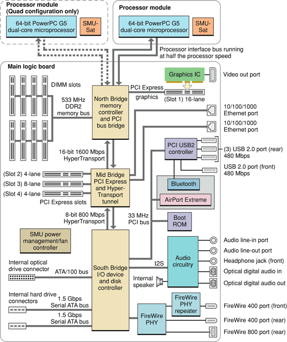
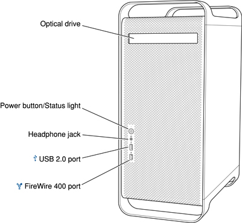
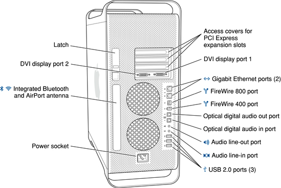

> 导航：[总目录](../../../README.md) · [documentation](../../../_indexes/documentation.md) · [Power Mac G5 Developer Note](Introduction%20to%20Power%20Mac%20G5%20Developer%20Note.md)

[Next](Document%20Revision%20History.md)[Previous](Introduction%20to%20Power%20Mac%20G5%20Developer%20Note.md)

# Power Mac G5 Developer Note

This note describes the 64-bit Power Mac G5 introduced in October 2005. It includes information about distinguishing features of the computer, including components on the main logic board: the microprocessor, the other main ICs, and the buses that connect them to each other and to the I/O interfaces.

The computer comes with Mac OS X version 10.4.3 installed. The Classic environment can be installed from the included system software optical disk and used to run Mac OS 9 applications.

The value of the computer model machine identifier string is `PowerMac11,2`.

The architecture of the computer is based on one or two dual-core PowerPC G5 microprocessors and three custom ICs: the North Bridge memory controller, the Mid Bridge, and the South Bridge I/O controller, as shown in the simplified block diagram in Figure 1. 

__Figure 1__  Block diagram for Power Mac G5

The computer includes a programmable Apple Mighty Mouse, two external Ethernet ports, two FireWire 400 ports, and one FireWire 800 port. For a complete list of user-visible features, see the Power Mac G5 specification sheet at Apple's [Specifications](http://www.info.apple.com/support/applespec.html) site. Other features are described in this section.

The Power Mac G5 computer is available in three configurations: dual-core 2GHz processor, dual-core 2.3 GHz processor, and two dual-core 2.5 GHz processors. It uses a separate processor board with each PowerPC G5 processor. Each processor board includes a system management unit (SMU) for thermal and wattage management. The model with two dual-core processsors uses two processor boards. The 2.0 GHz and 2.3 GHz configurations are referred to as Power Mac G5 Dual and the 2.5 GHz configuration is referred to as Power Mac G5 Quad. See the support site at [IBM](http://www.ibm.com/) for detailed microprocessor documentation. The processor bus is a 1 GHz, 1.15 GHz or 1.25 GHz bus connecting the processor module to the North Bridge IC. The bus has 64-bit (32-bit in and 32-bit out) wide data and 36-bit wide addresses. 

A 128-bit data bus connects the North Bridge IC to the DDR2 (PC2-4200) SDRAM memory. For additional information, refer to _[RAM Expansion Developer Note](../../Hardware%20Drivers/RAM%20Expansion%20Developer%20Note/Introduction%20to%20RAM%20Expansion%20Developer%20Note.md#apple-f4xwc4dqnrsv64tfmyxwi33df52wszbpkridimbqgaztamzr)_.

The Power Mac G5 has an internal PCI Express 16-lane, dual-simplex, 2.5 GHz graphics bus connected to the North Bridge IC and two 4-lane and one 8-lane PCI Express expansion buses connected to the PCI Express bus from the Mid Bridge IC. For more information on PCI Express, refer to _[PCI Developer Note](../PCI%20Developer%20Note/Introduction%20to%20PCI%20Developer%20Note.md#apple-f4xwc4dqnrsv64tfmyxwi33df52wszbpkridimbqgaztamrx)_. For more information on the graphics IC, refer to _[Video Developer Note](../Video%20Developer%20Note/Introduction%20to%20Video%20Developer%20Note.md#apple-f4xwc4dqnrsv64tfmyxwi33df52wszbpkridimbqgaztkmbu)_.

The HyperTransport bus between the North Bridge IC and the PCI Express bridge is 16 bits wide in both directions and supports a total of 1600 Mbps bi-directional throughput. Between the PCI Express bridge and the South Bridge IC, the bus width is 8 bits, supporting a total of 800 Mbps bi-directional throughput. The Mid Bridge IC acts as tunnel that connects the north HyperTransport bus to the south HyperTransport bus. For more information on HyperTransport, see the [HyperTransport Consortium](http://www.hypertransport.org/) website.

The computer includes two drive bays and supports each with an independent drive bus based on the Serial ATA (SATA) 1.0 specification. One 7200 rpm SATA drive comes installed in the computer. For more information on SATA, see the [Serial ATA International Organization](http://www.serialata.org/) (SATA-IO) website.

The computer uses a PCI USB 2.0 controller ASIC with a total of five ports available to support four external USB ports and the Bluetooth module. The five USB ports comply with the Universal Serial Bus Specification 2.0. For more information, see _[Universal Serial Bus Developer Note](../../Hardware%20Drivers/Universal%20Serial%20Bus%20Developer%20Note/Introduction%20to%20Universal%20Serial%20Bus%20Developer%20Note.md#apple-f4xwc4dqnrsv64tfmyxwi33df52wszbpkridimbqgaztamrw)_ and _[Bluetooth Developer Note](../../Hardware%20Drivers/Bluetooth%20Developer%20Note/Introduction%20to%20Bluetooth%20Developer%20Note.md#apple-f4xwc4dqnrsv64tfmyxwi33df52wszbpkridimbqgaztamzs)_.

A combined internal AirPort Extreme wireless LAN and Bluetooth 2.0 + EDR module is a build-to-order option. AirPort Extreme and Bluetooth share two built-in antennas.  For more information, see _[AirPort Developer Note](../../Hardware%20Drivers/AirPort%20Developer%20Note/Introduction%20to%20AirPort%20Developer%20Note.md#apple-f4xwc4dqnrsv64tfmyxwi33df52wszbpkridimbqgaztamzq)_ and _[Bluetooth Developer Note](../../Hardware%20Drivers/Bluetooth%20Developer%20Note/Introduction%20to%20Bluetooth%20Developer%20Note.md#apple-f4xwc4dqnrsv64tfmyxwi33df52wszbpkridimbqgaztamzs)_.

The Mid Bridge IC includes a dual (two MACs and two PHYs) Ethernet controller providing 10BASE-T/UTP, 100BASE-TX, or 1000BASE-T operation over two standard twisted-pair interfaces. Each MAC implements the link layer and is connected to a PHY that is internal to Mid Bridge. For more information, see _[Ethernet Developer Note](../../Hardware%20Drivers/Ethernet%20Developer%20Note/Introduction%20to%20Ethernet%20Developer%20Note.md#apple-f4xwc4dqnrsv64tfmyxwi33df52wszbpkridimbqgaztamrz)_.

The South Bridge IC includes a FireWire controller that supports both IEEE 1394b (FireWire 800) with a maximum data rate of 800 Mbps (100 MBps) and IEEE 1394a (FireWire 400) with a maximum data rate of 400 Mbps (50 MBps).

For more information, see _[FireWire Developer Note](../../Hardware%20Drivers/FireWire%20Developer%20Note/Introduction%20to%20FireWire%20Developer%20Note.md#apple-f4xwc4dqnrsv64tfmyxwi33df52wszbpkridimbqgaztamry)_.

The South Bridge IC provides an Ultra DMA ATA/100 interface to the slot-loading, 8x SuperDrive with double layer burning capability. The drive can read and write DVD media and CD media, as shown in Table 1.

__Table 1__  Types of media read and written by the SuperDrive

| Media type | Reading speed | Writing speed |
| DVD-R | 8x (CAV max) | 16x, 8x, 4x, 2x, 1x (CLV) single layer, depending on media |
| DVD+R | 8x (CAV max) | 16x, 8x, 4x, 2.4x (CLV) single layer, depending on media |
| DVD+R DL | 6x (CAV max) | 6x double-layer, depending on media |
| DVD-ROM | 16x DVD5 (CAV max) 12x DVD9 (CAV max) | – |
| DVD-RW | 8x (CAV max) | 6x, 4x, 2x, 1x (CLV) depending on media |
| DVD+RW | 8x (CAV max) | 8x, 4x, 2.4x (CLV) depending on media |
| CD-R | 32x (CAV max) | 32x (PCAV) |
| CD-RW | 32x (CAV max) | 24x (ZCLV) high speed CD-RW |
| CD-ROM | 32x (CAV max) | – |

The Apple SuperDrive writes to General Use media as follows: DVD-R 4.7 GB and DVD+R DL 8.5 GB. These discs are playable in most standard DVD players and computer DVD-ROM drives. Digital audio signals from the SuperDrive can be played through the audio outputs under the control of the Sound Manager.

A helpful independent website for compatibility information regarding recordable DVD formats is [DVD Demystified](http://dvddemystified.com/dvdfaq.html#4.3).

For information on parallel ATA interfaces, see the International Committee on Information Technology Standards (INCITS) Technical Committee T13 [AT Attachment](http://www.t13.org/) website.

The interrupt controller for the Power Mac G5 system is an MPIC cell in the North Bridge IC. In addition to accepting internal interrupt sources from the I/O, the MPIC controller accepts internal interrupts from the South Bridge IC and dedicated interrupt pins.

On the rear panel the Power Mac G5 provides optical digital audio I/O via S/PDIF (Sony/Phillips Digital Interface) TOSLINK input and output connectors, and analog audio line-in and line-out ports. For more information, see _[Audio Developer Note](../Audio%20Developer%20Note/Introduction%20to%20Audio%20Developer%20Note.md#apple-f4xwc4dqnrsv64tfmyxwi33df52wszbpkridimbqgaztkmbv)_.

The Power Mac G5 computer’s enclosure is a tower design. Figure 2 illustrates the front of the enclosure and Figure 3 illustrates the rear of the enclosure.

__Figure 2__  Power Mac G5 front view

__Figure 3__  Power Mac G5 rear view

The enclosure has space for two hard disk drives and one optical device.

[Next](Document%20Revision%20History.md)[Previous](Introduction%20to%20Power%20Mac%20G5%20Developer%20Note.md)

