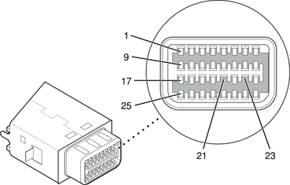
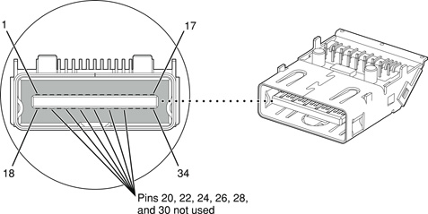
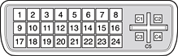
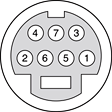

> 导航：[总目录](../../../README.md) · [documentation](../../../_indexes/documentation.md) · [Video Developer Note](Introduction%20to%20Video%20Developer%20Note.md)

[Next](Document%20Revision%20History.md)[Previous](Video%20Concepts.md)

# Video Product-Specific Details

This article highlights details of the video and display implementation specific to particular Mac computers. Unless otherwise specified in this article, video support on a Mac computer adheres to the information in [Video Concepts](Video%20Concepts.md#apple-f4xwc4dqnrsv64tfmyxwi33df52wszbpkridimbqgaztsojvfvjvomk7gezdambtgmytcobr).

This section provides video-specific information for Mac Pro computers introduced beginning August 2006. Refer to the specific Mac Pro developer note for additional information.

The Mac Pro computers with Quad-Core Intel Xeon 5400 Series microprocessors were introduced in January 2008. The Mac Pro’s graphics subsystem interfaces to the North Bridge via a 16-lane PCIe 2.0 bus. For information on the PCI Express graphics support and expansion, refer to _[PCI Developer Note](../PCI%20Developer%20Note/Introduction%20to%20PCI%20Developer%20Note.md#apple-f4xwc4dqnrsv64tfmyxwi33df52wszbpkridimbqgaztamrx)_.

The following sections describe the Mac Pro’s graphics subsystem.

Supported graphics cards have dual-link DVI connectors, supporting 30-inch Apple Cinema HD Displays on both ports.

For information on video memory, power, and features refer to [Table 1](#apple-f4xwc4dqnrsv64tfmyxwi33df52wszbpkridimbqgaztsojufvjvomjrmfptcmrqgaztgmjrhayq).

All of the supported graphics cards support dual displays in either extended desktop or video mirroring mode; for more detail, see [External Display Modes](#apple-f4xwc4dqnrsv64tfmyxwi33df52wszbpkridimbqgaztsojufvjvomjzl4ytembqgmztcmjyge).

__Table 1__  Supported Graphics Cards

| Graphics card | Video SDRAM | Power usage |
| ATI Radeon HD 2600 XT (standard) | 256 MB (GDDR3) | 50 W |
| NVIDIA GeForce 8800GT (configure to order) | 512 MB (GDDR3) | 110 W |
| NVIDIA Quadro FX 5600 (configure to order) | 1536 MB (GDDR3) | 175 W |

The GeForce 8800GT graphics card requires that a booster cable be connected from the PCI slot to the auxiliary power connector. The Quadro FX 5600 graphics card requires two booster cables be connected from the PCI slot to the auxiliary power connector. For additional information, refer to the _[PCI Developer Note](../PCI%20Developer%20Note/Introduction%20to%20PCI%20Developer%20Note.md#apple-f4xwc4dqnrsv64tfmyxwi33df52wszbpkridimbqgaztamrx)_.

The Mac Pro supports the 20-inch Apple Cinema Display at a resolution of 1680 x 1050, the 23-inch Apple Cinema HD Display at a resolution of 1920 x 1200, and the 30-inch Apple Cinema HD Display at a resolution of 2560 x 1600. All ports support a maximum resolution of 2048 x 1536 at 32-bit with 85 Hz refresh rate. Multiple PCI Express graphics cards can support three or more displays.

The table below lists the displays supported by port 1 and port 2.

__Table 2__  Port 1 and Port 2 support

| Graphics card | Port 1 | Port 2 |
| Radeon HD 2600 XT | 20”, 23”, 30” Apple displays | 20”, 23”, 30” Apple displays, DVI to Video Adapter |
| GeForce 8800GT | 20”, 23”, 30” Apple displays | 20”, 23”, 30” Apple displays |
| Quadro FX 5600 | 20”, 23”, 30” Apple displays | 20”, 23”, 30” Apple displays |

For information on video ports, see Video Monitor Ports. For information on PCI Express expansion slots, refer to _[PCI Developer Note](../PCI%20Developer%20Note/Introduction%20to%20PCI%20Developer%20Note.md#apple-f4xwc4dqnrsv64tfmyxwi33df52wszbpkridimbqgaztamrx)_.

The Mac Pro has a DVI connector for an external video monitor. For a description of the DVI connector, refer to [Figure 4](#apple-f4xwc4dqnrsv64tfmyxwi33df52wszbpkridimbqgaztsojufvbeeq2hjfeemqs7gezdambtgmytcobr) and [Table 30](#apple-f4xwc4dqnrsv64tfmyxwi33df52wszbpkridimbqgaztsojufvjvoojwgfptcmrqgaztgmjrhayq).

The graphics data sent to the digital monitor use transition minimized differential signaling (TMDS). TMDS uses an encoding algorithm to convert bytes of graphics data into characters that are transition-minimized to reduce electromagnetic interference (EMI) with copper cables and DC balanced for transmission over fiber optic cables. The TMDS algorithm also provides robust clock recovery for greater skew tolerance with longer cables or low-cost short cables.

The Radeon HD 2600 XT graphics card supports an optional DVI to S-video/composite adapter that provides S-video and composite output to a PAL or NTSC video monitor or VCR. When a display is connected by way of the video adapter, the computer detects the type of adapter and enables the composite and S-video outputs. The settings for the resolutions and standards (NTSC or PAL) are then selectable in the Display pane in System Preferences.

The video output connector is a 7-pin S-video connector. [Figure 5](#apple-f4xwc4dqnrsv64tfmyxwi33df52wszbpkridimbqgaztsojufvjvoojxgrptcmrqgaztgmjrhayq) shows the arrangement of the pins and [Table 31](#apple-f4xwc4dqnrsv64tfmyxwi33df52wszbpkridimbqgaztsojufvjvoojxgfptcmrqgaztgmjrhayq) shows the pin assignments on the composite out and S-video connector.

The Mac Pro computer provides video output at picture sizes and frame rates compatible with the NTSC and PAL standards; the picture sizes are listed in [Table 32](#apple-f4xwc4dqnrsv64tfmyxwi33df52wszbpkridimbqgaztsojufvjvoojxgjptcmrqgaztgmjrhayq). Those picture sizes produce under-scanned displays on standard monitors.

The computer supports two external display modes: video mirroring and extended desktop. The default is extended desktop mode. To toggle between the two modes, use the Displays pane in System Preferences.

In extended desktop mode, the resolution of the two displays can be set independently. In this mode, the maximum external display resolution supported by the Mac Pro is 2048 x 1536 at 75 Hz for analog displays and 2560 x 1600 at 60 Hz for digital displays.

In mirroring mode, a single resolution is used for both displays. The highest resolution possible is the native resolution of the smallest display connected. If the external display can support a higher resolution than the internal display, that higher resolution is unused in mirroring mode.

If the external display cannot support the full resolution of the internal display, the lower resolution is used for both displays. A suitable resolution for both displays should be chosen in the Displays pane of System Preferences.

In either extended desktop or video mirroring mode, choosing a lower resolution than a display supports results in scaling up the image, if possible. Depending on the supported resolutions, aspect ratios, and refresh rates of the two displays, the scaled image may not fill the screen of one display, in which case the image on that display has black borders. This black border typically occurs when the resolution chosen has a different aspect ratio than the display. It does not occur on CRT displays.

The quad-core Mac Pro was introduced in August 2006 and the 8-core Mac Pro was introduced in April 2007 as a configure-to-order-option. The Mac Pro’s graphics subsystem interfaces to the North Bridge via a 16-lane PCI Express bus. For information on the PCI Express graphics support and expansion, refer to _[PCI Developer Note](../PCI%20Developer%20Note/Introduction%20to%20PCI%20Developer%20Note.md#apple-f4xwc4dqnrsv64tfmyxwi33df52wszbpkridimbqgaztamrx)_.

The following sections describe the Mac Pro’s graphics subsystem.

Supported graphics cards have single-link and/or dual-link DVI connectors. Single-link DVI ports support 20-inch and 23-inch Apple Cinema Displays. Dual-link DVI ports support 30-inch Apple Cinema HD Displays.

The Mac Pro comes standard with the high-performance, Nvidia GeForce 7300 GT PCI Express graphics card with 256 MB GDDR2 SDRAM memory. For information on PCI expansion, refer to _[PCI Developer Note](../PCI%20Developer%20Note/Introduction%20to%20PCI%20Developer%20Note.md#apple-f4xwc4dqnrsv64tfmyxwi33df52wszbpkridimbqgaztamrx)_. For information on video memory, power, and features refer to [Table 3](#apple-f4xwc4dqnrsv64tfmyxwi33df52wszbpkridimbqgaztsojufvjvomjrmjptcmrqgaztgmjrhayq).

All of the supported graphics cards support dual displays in either extended desktop or video mirroring mode; for more detail, see [Dual Display Extended and Mirroring Modes](#apple-f4xwc4dqnrsv64tfmyxwi33df52wszbpkridimbqgaztsojufvjvomrvl4ytembqgmztcmjyge).

__Table 3__  Supported Graphics Cards

| Graphics card | Video SDRAM | Power usage |
| Nvidia GeForce 7300 GT, single-link | 256 MB (GDDR2) | 32 W |
| ATI Radeon X1900 XT, double-wide and dual-link (configure-to-order) | 512 MB (GDDR3) | 132 W |
| Nvidia Quadro FX 4500, double-wide, dual-link, with 3D stereo port (configure-to-order) | 512 MB (GDDR3) | 110 W |

The high-power, double-wide ATI Radeon X1900 XT and Nvidia Quadro FX 4500 graphics cards require that a booster cable be connected from the PCI slot to the auxiliary power connector. For additional information, refer to the _[PCI Developer Note](../PCI%20Developer%20Note/Introduction%20to%20PCI%20Developer%20Note.md#apple-f4xwc4dqnrsv64tfmyxwi33df52wszbpkridimbqgaztamrx)_.

The Mac Pro supports the 20-inch Apple Cinema Display at 1680 x 1050, the 23-inch Apple Cinema Display at 1920 x 1200, and the 30-inch Apple Cinema HD Display at 2560 x 1600. All ports support a 32-bit resolution of 2048 x 1536 at 85 Hz. Multiple PCI Express graphics cards can support three or more displays, or can add support for a second 30-inch Apple Cinema HD Display.

Both ports on the graphics cards support analog monitors and dual displays in either extended desktop or video mirroring mode. Table 29 lists the displays supported by port 1 and port 2.

__Table 4__  Port 1 and Port 2 support

| Graphics card | Port 1 | Port 2 |
| Nvidia GeForce 7300 GT | 20”, 23”, 30” Apple displays | 20”, 23” Apple displays |
| ATI Radeon X1900 XT | 20”, 23”, 30” Apple displays | 20”, 23”, 30” Apple displays, DVI to Video Adapter |
| Nvidia Quadro FX 4500 | 20”, 23”, 30” Apple displays | 20”, 23”, 30” Apple displays |

For information on video ports, see Video Monitor Ports. For information on PCI Express expansion slots, refer to _[PCI Developer Note](../PCI%20Developer%20Note/Introduction%20to%20PCI%20Developer%20Note.md#apple-f4xwc4dqnrsv64tfmyxwi33df52wszbpkridimbqgaztamrx)_.

The Mac Pro has a DVI connector for an external video monitor. For a description of the DVI connector, refer to [Figure 4](#apple-f4xwc4dqnrsv64tfmyxwi33df52wszbpkridimbqgaztsojufvbeeq2hjfeemqs7gezdambtgmytcobr) and [Table 30](#apple-f4xwc4dqnrsv64tfmyxwi33df52wszbpkridimbqgaztsojufvjvoojwgfptcmrqgaztgmjrhayq).

The graphics data sent to the digital monitor use transition minimized differential signaling (TMDS). TMDS uses an encoding algorithm to convert bytes of graphics data into characters that are transition-minimized to reduce electromagnetic interference (EMI) with copper cables and DC balanced for transmission over fiber optic cables. The TMDS algorithm also provides robust clock recovery for greater skew tolerance with longer cables or low-cost short cables.

The ATI Radeon X1900 XT graphics card supports an optional DVI to S-video/composite adapter that provides S-video and composite output to a PAL or NTSC video monitor or VCR. When a display is connected by way of the video adapter, the computer detects the type of adapter and enables the composite and S-video outputs. The settings for the resolutions and standards (NTSC or PAL) are then selectable in the Display pane in System Preferences.

The video output connector is a 7-pin S-video connector. [Figure 5](#apple-f4xwc4dqnrsv64tfmyxwi33df52wszbpkridimbqgaztsojufvjvoojxgrptcmrqgaztgmjrhayq) shows the arrangement of the pins and [Table 31](#apple-f4xwc4dqnrsv64tfmyxwi33df52wszbpkridimbqgaztsojufvjvoojxgfptcmrqgaztgmjrhayq) shows the pin assignments on the composite out and S-video connector.

The Mac Pro computer provides video output at picture sizes and frame rates compatible with the NTSC and PAL standards; the picture sizes are listed in [Table 32](#apple-f4xwc4dqnrsv64tfmyxwi33df52wszbpkridimbqgaztsojufvjvoojxgjptcmrqgaztgmjrhayq). Those picture sizes produce under-scanned displays on standard monitors.

The Mac Pro is equipped with two graphics DVI ports. The Mac Pro can support dual displays in both extended desktop and video mirroring modes. The Nvidia Quadro FX 4500 and ATI Radeon X1900 XT graphics cards can drive two 30” Apple Cinema HD Displays.

To switch between extended desktop and video mirroring modes, enable the “Mirror Displays” option on the Arrangement tab in the Displays pane of System Preferences.

The scaling function is available when both monitors are operating and the mirroring mode is selected. Either monitor could have black borders during mirroring, depending on the supported timings between the two displays and on the monitor’s selection algorithm. Both displays show full-sized images only when the resolutions match. Both displays can operate with other resolution settings, but in mirroring mode, one of them has a display that is smaller than the full screen and has a black border around it.

This section provides video-specific information for Xserve servers introduced after September 2005. Refer to the specific Xserve developer note for additional information.

The Xserve with Quad-Core Intel Xeon 5400 Series microprocessors was introduced in January 2008. The Xserve graphics subsystem is a mezzanine card that interfaces to the North Bridge via a video controller. For information on the PCI Express graphics support and expansion, refer to _[PCI Developer Note](../PCI%20Developer%20Note/Introduction%20to%20PCI%20Developer%20Note.md#apple-f4xwc4dqnrsv64tfmyxwi33df52wszbpkridimbqgaztamrx)_.

The following sections describe the Xserve’s graphics subsystem.

The Xserve supports an optional graphics card via the mezzanine card slot. An ATI Radeon X1300 with 64 MB of GDDR3 memory uses 15 W of power and supports a single-link mini-DVI connector. With a mini-DVI to DVI adapter, available separately, DVI displays are supported. A single-link DVI port supports 20-inch and 23-inch Apple Cinema displays.

The mezzanine card supports the 20-inch Apple Cinema Display at 1680 x 1050 and the 23-inch Apple Cinema Display at 1920 x 1200. As a single-link DVI device, it will support the 30-inch Apple Cinema HD Display at 1280 x 800 resolution.

For VGA monitors, the ports support up to a 32-bit resolution of 2048 x 1536 at 85 Hz.

For a description of the mini-DVI connector, refer to [Figure 1](#apple-f4xwc4dqnrsv64tfmyxwi33df52wszbpkridimbqgaztsojufvjvomjql4ytembqgmztcmjyge) and [Table 7](#apple-f4xwc4dqnrsv64tfmyxwi33df52wszbpkridimbqgaztsojufvjvon27gezdambtgmytcobr).

The graphics data sent to the digital monitor use transition minimized differential signaling (TMDS). TMDS uses an encoding algorithm to convert bytes of graphics data into characters that are transition-minimized to reduce electromagnetic interference (EMI) with copper cables and DC balanced for transmission over fiber optic cables. The TMDS algorithm also provides robust clock recovery for greater skew tolerance with longer cables or low-cost short cables.

The Xserve introduced in August 2006 is based on the dual-core Intel Xeon processor. The Xserve graphics subsystem is a mezzanine card that interfaces to the South Bridge. For information on the PCI Express graphics support and expansion, refer to _[PCI Developer Note](../PCI%20Developer%20Note/Introduction%20to%20PCI%20Developer%20Note.md#apple-f4xwc4dqnrsv64tfmyxwi33df52wszbpkridimbqgaztamrx)_.

The following sections describe the Xserve’s graphics subsystem.

The mezzanine card, an ATI Radeon X1300 with 64 MB of GDDR3 memory, supports a single-link mini-DVI connector. With a mini-DVI to DVI adapter, available separately, DVI displays are supported. A single-link DVI port supports 20-inch and 23-inch Apple Cinema displays. An ATI Radeon X1300 with 256 MB of GDDR memory, available in slot two, has a dual-link DVI connector. A dual-link DVI port supports 20-inch and 23-inch Apple Cinema displays, and 30-inch Apple Cinema HD displays.

Xserve comes standard with the ATI Radeon X1300 PCI Express card with 64 MB GDDR3 SDRAM memory. Available as a configure-to-order option is the ATI Radeon X1300 PCI Express card with 256 MB GDDR2 memory and dual-link DVI port. For information on video memory and power, refer to [Table 5](#apple-f4xwc4dqnrsv64tfmyxwi33df52wszbpkridimbqgaztsojufvjvomjwl4ytembqgmztcmjyge).

When a ATI Radeon X1300 PCI Express card is installed in slot two and a mezzanine card is installed, the system can support two displays in either extended desktop or video mirroring mode; for more detail, see [Dual Display Extended and Mirroring Modes](#apple-f4xwc4dqnrsv64tfmyxwi33df52wszbpkridimbqgaztsojufvjvomrzl4ytembqgmztcmjyge).

__Table 5__  Supported Graphics Cards

| Graphics card | Video SDRAM | Power usage |
| ATI Radeon X1300, single-link, mini-DVI port | 64 MB GDDR3 | 15 W |
| ATI Radeon X1300, dual-link, DVI port | 256 MB GDDR2 | 25 W |

The ATI Radeon X1300 PCI Express scard supports the 20-inch Apple Cinema Display at 1680 x 1050, the 23-inch Apple Cinema Display at 1920 x 1200, and the 30-inch Apple Cinema HD Display at 2560 x 1600.

The mezzanine card supports the 20-inch Apple Cinema Display at 1680 x 1050 and the 23-inch Apple Cinema Display at 1920 x 1200. As a single-link DVI device, it will support the 30-inch Apple Cinema HD Display at 1280 x 800 resolution.

For VGA monitors, the ports support up to a 32-bit resolution of 2048 x 1536 at 85 Hz.

For information on video ports, see [Video Monitor Ports](#apple-f4xwc4dqnrsv64tfmyxwi33df52wszbpkridimbqgaztsojufvjvomjvl4ytembqgmztcmjyge). For information on PCI Express expansion slots, refer to _[PCI Developer Note](../PCI%20Developer%20Note/Introduction%20to%20PCI%20Developer%20Note.md#apple-f4xwc4dqnrsv64tfmyxwi33df52wszbpkridimbqgaztamrx)_.

The base configuration Xserve has a mini-DVI connector for an external video monitor. For a description of the mini-DVI connector, refer to [Figure 1](#apple-f4xwc4dqnrsv64tfmyxwi33df52wszbpkridimbqgaztsojufvjvomjql4ytembqgmztcmjyge) and [Table 7](#apple-f4xwc4dqnrsv64tfmyxwi33df52wszbpkridimbqgaztsojufvjvon27gezdambtgmytcobr).

The configure-to-order configuration Xserve has a DVI connector for an external video monitor. For a description of the DVI connector, refer to [Figure 4](#apple-f4xwc4dqnrsv64tfmyxwi33df52wszbpkridimbqgaztsojufvbeeq2hjfeemqs7gezdambtgmytcobr) and [Table 30](#apple-f4xwc4dqnrsv64tfmyxwi33df52wszbpkridimbqgaztsojufvjvoojwgfptcmrqgaztgmjrhayq).

The graphics data sent to the digital monitor use transition minimized differential signaling (TMDS). TMDS uses an encoding algorithm to convert bytes of graphics data into characters that are transition-minimized to reduce electromagnetic interference (EMI) with copper cables and DC balanced for transmission over fiber optic cables. The TMDS algorithm also provides robust clock recovery for greater skew tolerance with longer cables or low-cost short cables.

When two graphics cards are installed, Xserve can support two displays in both extended desktop and video mirroring modes.

To switch between extended desktop and video mirroring modes, open System Preferences, click Arrangement, and select or deselect the Mirror Displays option.

The scaling function is available when both monitors are operating and the mirroring mode is selected. Either monitor could have black borders during mirroring, depending on the supported timings between the two displays and on the monitor’s selection algorithm. Both displays show full-sized images only when the resolutions match. Both displays can operate with other resolution settings, but in mirroring mode, one of them has a display that is smaller than the full screen and has a black border around it.

This section provides video-specific information for iMac computers introduced after September 2005.

The iMac Computers announced in April 2008, based on the Intel Core 2 Duo processor on 45 nm process technology, have a built-in 20-inch or 24-inch widescreen flat-panel display (measured diagonally). The computer uses TFT (thin-film transistor) technology for high contrast and fast response, is backlit by a cold cathode fluorescent lamp (CCFL), and supports 3D acceleration and display depths up to 24 bits per pixel at all supported screen resolutions.

For information specific to the 20-inch iMac video system, refer to [20-inch iMac Video System](#apple-f4xwc4dqnrsv64tfmyxwi33df52wszbpkridimbqgaztsojufvkfanbqgaydgojzgrjvonzs). For information specific to the 24-inch iMac video system, refer to [24-inch iMac Video System](#apple-f4xwc4dqnrsv64tfmyxwi33df52wszbpkridimbqgaztsojufvkfanbqgaydgojzgrjvonzy).

The 20-inch iMac model supports an LCD display size of 1680 x 1050 pixels at 98 dpi.

The graphics IC in the 2.4 GHz model is an ATI Radeon HD 2400 XT with 128 MB GDDR3 SDRAM. The graphics IC in the 2.66 GHz model is an ATI Radeon HD 2600 PRO with 256 MB GDDR3 SDRAM. The graphics controller contains 2D and 3D acceleration engines, front-end and back-end scalers, and a display controller, and it connects to the PCI Express bus via a 16-lane link.

The display signal generated for the flat-panel display is simultaneously available for an external monitor in mirroring mode and extended desktop display mode; see [External Display Port](#apple-f4xwc4dqnrsv64tfmyxwi33df52wszbpkridimbqgaztsojufvkfanbqgaydgojzgrjvonzt) .

The graphics ICs include a scaling function that expands smaller-sized images to fill the screen. By means of the scaling function, the 20-inch iMac can show full-screen images at the resolutions listed in [Table 8](#apple-f4xwc4dqnrsv64tfmyxwi33df52wszbpkridimbqgaztsojufvjvonk7gezdambtgmytcobr).

The 24-inch model supports an LCD display size of 1920 x 1200 pixels at 94 dpi.

The standard graphics IC is an ATI Radeon HD 2600 PRO with 256 MB GDDR3 SDRAM. The NVIDIA GeForce 8800 GS with 512 MB GDDR3 SDRAM is also available as a configure-to-order option. The graphics controller contains 2D and 3D acceleration engines, front-end and back-end scalers, and a display controller, and it connects to the PCI Express bus via a 16-lane link.

The display signal generated for the flat-panel display is simultaneously available for an external monitor in mirroring mode and extended desktop display mode; see [External Display Port](#apple-f4xwc4dqnrsv64tfmyxwi33df52wszbpkridimbqgaztsojufvkfanbqgaydgojzgrjvonzt).

The graphics ICs include a scaling function that expands smaller-sized images to fill the screen. By means of the scaling function, the 24-inch iMac can show full-screen images at the resolutions listed in [Table 6](#apple-f4xwc4dqnrsv64tfmyxwi33df52wszbpkridimbqgaztsojufvjvomzzl4ytembqgmztcmjyge).

The iMac has a mini-DVI connector for an external video display and supports video mirroring mode and extended desktop display mode. VGA, S-video, and composite analog video output are supported with the use of an adapter (sold separately).

The default display mode setting on the iMac is extended desktop mode. To toggle between the two modes, press F7 or use the Displays pane in System Preferences.

In extended desktop mode, the resolution of the two displays can be set independently. In this mode, the maximum external display resolutions supported are 2048 x 1536 at 85 Hz for analog displays and 1920 x 1200 at 60 Hz or 75 Hz for digital displays.

In mirroring mode, a single resolution is used for both displays. The highest resolution possible is the native resolution of the internal display (1680 x 1050 for the 20-inch iMac, or 1920 x 1200 for the 24-inch iMac). If the external display can support a higher resolution than the internal display, that higher resolution is unused in mirroring mode.

If the external display cannot support the full resolution of the internal display, the lower resolution is used for both displays. A suitable resolution for both displays should be chosen in the Displays pane of System Preferences.

In either extended desktop or video mirroring mode, choosing a lower resolution than a display supports results in scaling up the image, if possible. Depending on the supported resolutions, aspect ratios, and refresh rates of the two displays, the scaled image may not fill the screen of one display, in which case the image on that display has black borders. This black border typically occurs when the resolution chosen has a different aspect ratio than the display. It does not occur on CRT displays.

The mini-DVI video display connector is a 32-pin rectangular connector. The digital output supports up to 1600 x 1200 at 60 Hz or up to 1920x1200 at 60 Hz with reduced blanking). For a description of the mini-DVI connector, refer to [Table 7](#apple-f4xwc4dqnrsv64tfmyxwi33df52wszbpkridimbqgaztsojufvjvon27gezdambtgmytcobr).

The computer detects the type of display adapter that is plugged in and programs the graphics IC to route the appropriate video signals to the connector.

The signal assignments on the mini-DVI connector are shown in [Table 7](#apple-f4xwc4dqnrsv64tfmyxwi33df52wszbpkridimbqgaztsojufvjvon27gezdambtgmytcobr). The cable detect function on pin 25 is implemented by connecting pin 25 to +5V in the adapters. The computer detects which adapter is present by reading its EDID (Extended Display Identification Data) via DDC. The EDID for video is in the adapter; the EDID for VGA and DVI is in the display.

The iMac detects the type of display adapter that is plugged in and programs the graphics IC to route the appropriate video signals to the connector. The signal assignments on the video connector when the composite adapter is attached are shown in [Table 11](#apple-f4xwc4dqnrsv64tfmyxwi33df52wszbpkridimbqgaztsojufvjvoms7gezdambtgmytcobr).

Composite video and S-video signals can be displayed on either an NTSC display or a PAL display. When a display is connected by way of the composite adapter, the computer detects this configuration and enables the composite and S-video outputs. The settings for the resolutions and standards (NTSC or PAL) are then selectable in System Preferences.

The video output connector is a 7-pin S-video connector. [Figure 5](#apple-f4xwc4dqnrsv64tfmyxwi33df52wszbpkridimbqgaztsojufvjvoojxgrptcmrqgaztgmjrhayq) shows the arrangement of the pins and [Table 31](#apple-f4xwc4dqnrsv64tfmyxwi33df52wszbpkridimbqgaztsojufvjvoojxgfptcmrqgaztgmjrhayq) shows the pin assignments on the composite out and S-video connector.

The iMac Computers announced in August 2007, based on the Intel Core 2 Duo microprocessor, have a built-in 20-inch or 24-inch widescreen flat-panel display (measured diagonally). The computer uses TFT (thin-film transistor) technology for high contrast and fast response, is backlit by a cold cathode fluorescent lamp (CCFL), and supports 3D acceleration and display depths up to 24 bits per pixel at all supported screen resolutions.

For information specific to the 20-inch iMac video system, refer to [20-inch iMac Video System](#apple-f4xwc4dqnrsv64tfmyxwi33df52wszbpkridimbqgaztsojufvjvonzs). For information specific to the 24-inch iMac video system, refer to [24-inch iMac Video System](#apple-f4xwc4dqnrsv64tfmyxwi33df52wszbpkridimbqgaztsojufvjvonzy).

The 20-inch iMac model supports an LCD display size of 1680 x 1050 pixels at 98 dpi.

The graphics IC in the 2.0 GHz model is an ATI Radeon HD 2400 XT with 128 MB GDDR3 SDRAM. The graphics IC in the 2.4 GHz model is an ATI Radeon HD 2600 PRO with 256 MB GDDR3 SDRAM. The graphics controller contains 2D and 3D acceleration engines, front-end and back-end scalers, and a display controller, and it connects to the PCI Express bus via a 16-lane link.

The display signal generated for the flat-panel display is simultaneously available for an external monitor in mirroring mode and extended desktop display mode; see [External Display Support](Video%20Concepts.md#apple-f4xwc4dqnrsv64tfmyxwi33df52wszbpkridimbqgaztsojvfvjvom27gezdambtgmytcobr).

The graphics ICs include a scaling function that expands smaller-sized images to fill the screen. By means of the scaling function, the 20-inch iMac can show full-screen images at the resolutions listed in [Table 8](#apple-f4xwc4dqnrsv64tfmyxwi33df52wszbpkridimbqgaztsojufvjvonk7gezdambtgmytcobr).

The 24-inch model supports an LCD display size of 1920 x 1200 pixels at 94 dpi.

The graphics IC in the 24-inch iMac is an ATI Radeon HD 2600 PRO with 256 MB GDDR3 SDRAM. The graphics controller contains 2D and 3D acceleration engines, front-end and back-end scalers, and a display controller, and it connects to the PCI Express bus via a 16-lane link.

The display signal generated for the flat-panel display is simultaneously available for an external monitor in mirroring mode and extended desktop display mode; see [External Display Port](#apple-f4xwc4dqnrsv64tfmyxwi33df52wszbpkridimbqgaztsojufvjvonzt).

The graphics ICs include a scaling function that expands smaller-sized images to fill the screen. By means of the scaling function, the 24-inch iMac can show full-screen images at the resolutions listed in [Table 6](#apple-f4xwc4dqnrsv64tfmyxwi33df52wszbpkridimbqgaztsojufvjvomzzl4ytembqgmztcmjyge).

The iMac has a mini-DVI connector for an external video display and supports video mirroring mode and extended desktop display mode. VGA, S-video, and composite analog video output are supported with the use of an adapter (sold separately).

The default display mode setting on the iMac is extended desktop mode. To toggle between the two modes, press F7 or use the Displays pane in System Preferences.

In extended desktop mode, the resolution of the two displays can be set independently. In this mode, the maximum external display resolutions supported are 2048 x 1536 at 85 Hz for analog displays and 1920 x 1200 at 60 Hz or 75 Hz for digital displays.

In mirroring mode, a single resolution is used for both displays. The highest resolution possible is the native resolution of the internal display (1680 x 1050 for the 20-inch iMac, or 1920 x 1200 for the 24-inch iMac). If the external display can support a higher resolution than the internal display, that higher resolution is unused in mirroring mode.

If the external display cannot support the full resolution of the internal display, the lower resolution is used for both displays. A suitable resolution for both displays should be chosen in the Displays pane of System Preferences.

In either extended desktop or video mirroring mode, choosing a lower resolution than a display supports results in scaling up the image, if possible. Depending on the supported resolutions, aspect ratios, and refresh rates of the two displays, the scaled image may not fill the screen of one display, in which case the image on that display has black borders. This black border typically occurs when the resolution chosen has a different aspect ratio than the display. It does not occur on CRT displays.

The mini-DVI video display connector is a 32-pin rectangular connector. The digital output supports up to 1600 x 1200 at 60 Hz or up to 1920x1200 at 60 Hz with reduced blanking). For a description of the mini-DVI connector, refer to [Figure 1](#apple-f4xwc4dqnrsv64tfmyxwi33df52wszbpkridimbqgaztsojufvjvomjql4ytembqgmztcmjyge).

The computer detects the type of display adapter that is plugged in and programs the graphics IC to route the appropriate video signals to the connector.

The signal assignments on the mini-DVI connector are shown in [Table 7](#apple-f4xwc4dqnrsv64tfmyxwi33df52wszbpkridimbqgaztsojufvjvon27gezdambtgmytcobr). The cable detect function on pin 25 is implemented by connecting pin 25 to +5V in the adapters. The computer detects which adapter is present by reading its EDID (Extended Display Identification Data) via DDC. The EDID for video is in the adapter; the EDID for VGA and DVI is in the display.

The iMac detects the type of display adapter that is plugged in and programs the graphics IC to route the appropriate video signals to the connector. The signal assignments on the video connector when the composite adapter is attached are shown in [Table 11](#apple-f4xwc4dqnrsv64tfmyxwi33df52wszbpkridimbqgaztsojufvjvoms7gezdambtgmytcobr).

Composite video and S-video signals can be displayed on either an NTSC display or a PAL display. When a display is connected by way of the composite adapter, the computer detects this configuration and enables the composite and S-video outputs. The settings for the resolutions and standards (NTSC or PAL) are then selectable in System Preferences.

The video output connector is a 7-pin S-video connector. [Figure 5](#apple-f4xwc4dqnrsv64tfmyxwi33df52wszbpkridimbqgaztsojufvjvoojxgrptcmrqgaztgmjrhayq) shows the arrangement of the pins and [Table 31](#apple-f4xwc4dqnrsv64tfmyxwi33df52wszbpkridimbqgaztsojufvjvoojxgfptcmrqgaztgmjrhayq) shows the pin assignments on the composite out and S-video connector.

The iMac with SuperDrive computers announced in September 2006, based on the Intel Core 2 Duo microprocessor, have built-in 17-inch, 20-inch, or 24-inch widescreen flat-panel display (measured diagonally). The computer uses TFT (thin-film transistor) technology for high contrast and fast response, is backlit by a cold cathode fluorescent lamp (CCFL), and supports 3D acceleration and display depths up to 24 bits per pixel at all supported screen resolutions.

For information on the 17-inch and 20-inch iMac video system, refer to [17-inch and 20-inch iMac Video System](#apple-f4xwc4dqnrsv64tfmyxwi33df52wszbpkridimbqgaztsojufvjvomjtl4ytembqgmztcmjyge). For information on the 24-inch iMac video system, refer to [24-inch iMac Video System](#apple-f4xwc4dqnrsv64tfmyxwi33df52wszbpkridimbqgaztsojufvjvomjul4ytembqgmztcmjyge).

The 17-inch model supports an LCD display size of 1440 x 900 pixels at 100 dpi. The graphics card temporally dithers the 6 bits per component to show up to millions of colors.

The 20-inch model supports an LCD display size of 1680 x 1050 pixels at 98 dpi and supports 8 bits per component to show up to millions of colors.

The iMac graphics IC is an ATI Radeon X1600 with 128 MB GDDR3 SDRAM. The 20-inch model has a 256 MB configure-to-order option. The graphics controller contains 2D and 3D acceleration engines, front-end and back-end scalers, and a display controller, and it connects to the PCI Express bus via a 16-lane link.

The display signal generated for the flat-panel display is simultaneously available for an external monitor in mirroring mode and extended desktop display mode; see [External Display Port](#apple-f4xwc4dqnrsv64tfmyxwi33df52wszbpkridimbqgaztsojufvjvomzul4ytembqgmztcmjyge).

The graphics ICs include a scaling function that expands smaller-sized images to fill the screen. By means of the scaling function, the iMac can show full-screen images at the resolutions listed in [Table 8](#apple-f4xwc4dqnrsv64tfmyxwi33df52wszbpkridimbqgaztsojufvjvonk7gezdambtgmytcobr) for the 20-inch model and [Table 9](#apple-f4xwc4dqnrsv64tfmyxwi33df52wszbpkridimbqgaztsojufvjvons7gezdambtgmytcobr) for the 17-inch model.

The 17-inch and 20-inch iMacs have a mini-DVI connector for an external video monitor and support video mirroring mode and extended desktop display mode. For an explanation of display modes, see [External Display Modes](#apple-f4xwc4dqnrsv64tfmyxwi33df52wszbpkridimbqgaztsojufvjvomjsl4ytembqgmztcmjyge).

The default display mode setting on the iMac is extended desktop display. To toggle between the two modes, use the Display pane in System Preferences.

A scaling function is available when the internal display and an external monitor are both operating and the mirroring mode is selected. However, the external monitor could have black borders during mirroring, depending on the supported timings between the two displays and on the monitor’s selection algorithm. Black borders are not seen on VGA displays.

Both displays show full-sized images when the display resolution for the external monitor is set to the internal display’s native resolution: 1440 x 900. Both displays can operate with other resolution settings, but in mirroring mode, one of the displays may be smaller than the full screen and have a black border around it. With the resolution for the external monitor set to less than 1440 x 900, the image on the internal display is smaller than its screen. For resolution settings larger than 1440 x 900, the image on the external monitor is smaller than its screen.

In mirroring mode, the maximum size of the external display is 1680 x 1050.

For the 17-inch model in extended desktop mode, the maximum size of the external display is 2048 x 1536 at 60 Hz. For the 20-inch model in extended desktop mode, the maximum size of the external display is 2048 x 1536 at 60 Hz or 75 Hz.

The mini-DVI video display connector is a 32-pin rectangular connector. The digital output supports up to 1600 x 1200 at 60 Hz or up to 1920x1200 at 60 Hz with reduced blanking). For a description of the mini-DVI connector, refer to [Figure 1](#apple-f4xwc4dqnrsv64tfmyxwi33df52wszbpkridimbqgaztsojufvjvomjql4ytembqgmztcmjyge).

The computer detects the type of display adapter that is plugged in and programs the graphics IC to route the appropriate video signals to the connector.

The signal assignments on the mini-DVI connector are shown in [Table 7](#apple-f4xwc4dqnrsv64tfmyxwi33df52wszbpkridimbqgaztsojufvjvon27gezdambtgmytcobr). The cable detect function on pin 25 is implemented by connecting pin 25 to +5V in the adapters. The computer detects which adapter is present by reading its EDID (Extended Display Identification Data) via DDC. The EDID for video is in the adapter; the EDID for VGA and DVI is in the display.

The 17-inch and 20-inch iMacs detect the type of display adapter that is plugged in and programs the graphics IC to route the appropriate video signals to the connector. The signal assignments on the video connector when the composite adapter is attached are shown in [Table 11](#apple-f4xwc4dqnrsv64tfmyxwi33df52wszbpkridimbqgaztsojufvjvoms7gezdambtgmytcobr).

Composite video and S-video signals can be displayed on either an NTSC display or a PAL display. When a display is connected by way of the composite adapter, the computer detects this configuration and enables the composite and S-video outputs. The settings for the resolutions and standards (NTSC or PAL) are then selectable in System Preferences.

The video output connector is a 7-pin S-video connector. [Figure 5](#apple-f4xwc4dqnrsv64tfmyxwi33df52wszbpkridimbqgaztsojufvjvoojxgrptcmrqgaztgmjrhayq) shows the arrangement of the pins and [Table 31](#apple-f4xwc4dqnrsv64tfmyxwi33df52wszbpkridimbqgaztsojufvjvoojxgfptcmrqgaztgmjrhayq) shows the pin assignments on the composite out and S-video connector.

The 24-inch model supports an LCD display size of 1920 x 1200 pixels at 94 dpi and supports 8 bits per component to show up to millions of colors.

The standard graphics IC is an NVIDIA GeForce 7300 GT with 128 MB GDDR3 SDRAM. The NVIDIA GeForce 7600 GT with 256 MB GDDR3 SDRAM is also available as a configure-to-order option. The graphics controllers contain 2D and 3D acceleration engines, front-end and back-end scalers, and a display controller, and connect to the PCI Express bus via a 16-lane link.

The display signal generated for the flat-panel display is simultaneously available for an external monitor in mirroring mode and extended desktop display mode; see [External Display Support](Video%20Concepts.md#apple-f4xwc4dqnrsv64tfmyxwi33df52wszbpkridimbqgaztsojvfvjvom27gezdambtgmytcobr) and [External Display Modes](#apple-f4xwc4dqnrsv64tfmyxwi33df52wszbpkridimbqgaztsojufvjvooc7gezdambtgmytcobr).

The graphics ICs include a scaling function that expands smaller-sized images to fill the screen. By means of the scaling function, the 24-inch iMac can show full-screen images at the resolutions listed in the table below.

__Table 6__  Resolutions on the 24” widescreen flat-panel display

| Resolution | Aspect ratio | Notes |
| 640 x 480 | 4:3 | \* |
| 640 x 480 | 4:3 | \*Stretched to fit full screen |
| 800 x 500 | 16:10 | \* |
| 800 x 600 | 4:3 |  |
| 800 x 600 | 4:3 | Stretched to fit full screen |
| 960 x 600 | 4:3 |  |
| 1024 x 640 | 16:10 |  |
| 1024 x 768 | 4:3 |  |
| 1024 x 768 | 4:3 | Stretched to fit full screen |
| 1280 x 800 | 16:10 |  |
| 1280 x 960 | 4:3 |  |
| 1280 x 960 | 4:3 | Stretched to fit full screen |
| 1344 x 840 | 16:10 |  |
| 1344 x 1008 | 4:3 |  |
| 1600 x 1000 | 16:10 |  |
| 1600 x 1200 | 4:3 |  |
| 1920 x 1200 | 16:10 |  |
| \* Not recommended | \* Not recommended | \* Not recommended |

The 24-inch iMac has a mini-DVI connector for an external video monitor and supports video mirroring mode and extended desktop display mode. For an explanation of display modes, see [External Display Modes](#apple-f4xwc4dqnrsv64tfmyxwi33df52wszbpkridimbqgaztsojufvjvooc7gezdambtgmytcobr).

The default display mode setting on the 24-inch iMac is extended desktop display. To toggle between video mirroring mode and extended desktop display mode, use the Display pane in System Preferences.

A scaling function is available when the internal display and an external monitor are both operating and the mirroring mode is selected. However, the external monitor could have black borders during mirroring, depending on the supported timings between the two displays and on the monitor’s selection algorithm. Black borders are not seen on VGA displays.

Both displays show full-sized images when the display resolution for the external monitor is set to the internal display’s native resolution: 1920 x 1200. Both displays can operate with other resolution settings, but in mirroring mode, one of the displays may be smaller than the full screen and have a black border around it. With the resolution for the external monitor set to less than 1920 x 1200, the image on the internal display is smaller than its screen. For resolution settings larger than 1920 x 1200, the image on the external monitor is smaller than its screen.

In mirroring mode, the maximum size of the external display is 1920 x 1200.

In extended desktop mode with a VGA display, the maximum size of the external display is 2048 x 1536 at 75 Hz.

The mini-DVI video display connector is a 32-pin rectangular connector. The digital output supports up to 1600 x 1200 at 60 Hz or up to 1920x1200 at 60 Hz with reduced blanking). For a description of the mini-DVI connector, refer to [Figure 1](#apple-f4xwc4dqnrsv64tfmyxwi33df52wszbpkridimbqgaztsojufvjvomjql4ytembqgmztcmjyge).

The computer detects the type of display adapter that is plugged in and programs the graphics IC to route the appropriate video signals to the connector.

The signal assignments on the mini-DVI connector are shown in [Table 7](#apple-f4xwc4dqnrsv64tfmyxwi33df52wszbpkridimbqgaztsojufvjvon27gezdambtgmytcobr). The cable detect function on pin 25 is implemented by connecting pin 25 to +5V in the adapters. The computer detects which adapter is present by reading its EDID (Extended Display Identification Data) via DDC. The EDID for video is in the adapter; the EDID for VGA and DVI is in the display.

The 24-inch iMac detects the type of display adapter that is plugged in and programs the graphics IC to route the appropriate video signals to the connector. The signal assignments on the video connector when the composite adapter is attached are shown in [Table 11](#apple-f4xwc4dqnrsv64tfmyxwi33df52wszbpkridimbqgaztsojufvjvoms7gezdambtgmytcobr).

Composite video and S-video signals can be displayed on either an NTSC display or a PAL display. When a display is connected by way of the composite adapter, the computer detects this configuration and enables the composite and S-video outputs. The settings for the resolutions and standards (NTSC or PAL) are then selectable in System Preferences.

The video output connector is a 7-pin S-video connector. [Figure 5](#apple-f4xwc4dqnrsv64tfmyxwi33df52wszbpkridimbqgaztsojufvjvoojxgrptcmrqgaztgmjrhayq) shows the arrangement of the pins and [Table 31](#apple-f4xwc4dqnrsv64tfmyxwi33df52wszbpkridimbqgaztsojufvjvoojxgfptcmrqgaztgmjrhayq) shows the pin assignments on the composite out and S-video connector.

The iMac with Combo drive computer announced in September 2006, based on the Intel Core 2 Duo microprocessor, includes a built-in 17-inch widescreen flat-panel display (measured diagonally). The computer uses TFT (thin-film transistor) technology for high contrast and fast response, is backlit by a cold cathode fluorescent lamp (CCFL), and supports 3D acceleration and display depths up to 24 bits per pixel at all supported screen resolutions.

The LCD display size is 1440x900 pixels at 100 dpi. The graphics card temporally dithers the 6 bits per component to show up to millions of colors.

Internal to the North Bridge IC is the graphics subsystem, which includes the Intel GMA 950 graphics processor with 64 MB DDR2 SDRAM shared with the main memory. The internal graphics interface runs at 400 MHz.

The graphics controller contains 2D and 3D acceleration engines. The GPU has a back-end scaler for the LVDS panel and uses a software scaler for external DVI displays that don't have their own hardware scalers.

The display signal generated for the flat panel display is simultaneously available for an external monitor in mirror mode and extended desktop display mode; see [External Display Support](Video%20Concepts.md#apple-f4xwc4dqnrsv64tfmyxwi33df52wszbpkridimbqgaztsojvfvjvom27gezdambtgmytcobr).

The GMA950 include a scaling function that expands smaller-sized images to fill the screen. By means of the scaling function, the iMac can show full-screen images at the resolutions listed in [Table 9](#apple-f4xwc4dqnrsv64tfmyxwi33df52wszbpkridimbqgaztsojufvjvons7gezdambtgmytcobr).

The iMac has a mini-DVI connector for an external video monitor and supports video mirroring mode and extended desktop display mode. For a description of the mini-DVI connector, refer to [Figure 1](#apple-f4xwc4dqnrsv64tfmyxwi33df52wszbpkridimbqgaztsojufvjvomjql4ytembqgmztcmjyge) and [Table 7](#apple-f4xwc4dqnrsv64tfmyxwi33df52wszbpkridimbqgaztsojufvjvon27gezdambtgmytcobr).

The graphics data sent to the digital monitor use transition minimized differential signaling (TMDS). TMDS uses an encoding algorithm to convert bytes of graphics data into characters that are transition-minimized to reduce EMI with copper cables and DC balanced for transmission over fiber optic cables. The TMDS algorithm also provides robust clock recovery for greater skew tolerance with longer cables or low-cost short cables.

The default display mode setting on the iMac is extended desktop display. To toggle between the two modes, use the Display pane in System Preferences.

A scaling function is available when the internal display and an external monitor are both operating and the mirror mode is selected. However, the external monitor could have black borders during mirroring, depending on the supported timings between the two displays and on the monitor’s selection algorithm. Black borders are not seen on VGA displays.

Both displays show full-sized images when the display resolution for the external monitor is set to the internal display’s native resolution: 1400 x 900. Both displays can operate with other resolution settings, but in mirror mode, one of the displays may be smaller than the full screen and have a black border around it. With the resolution for the external monitor set to less than 1400 x 900, the image on the internal display is smaller than its screen. For resolution settings larger than 1440 x 900, the image on the external monitor is smaller than its screen.

In mirror mode, the maximum size of the external display is 1400 x 900. In extended desktop mode, the maximum size of the external display is 1920 x 1080 at 60 Hz.

The iMac detects the type of display adapter that is plugged in and programs the graphics subsystem to route the appropriate video signals to the connector. The signal assignments on the video connector when the composite adapter is attached are shown in [Table 11](#apple-f4xwc4dqnrsv64tfmyxwi33df52wszbpkridimbqgaztsojufvjvoms7gezdambtgmytcobr).

Composite video and S-video signals can be displayed on either an NTSC display or a PAL display. When a display is connected by way of the composite adapter, the computer detects this configuration and enables the composite and S-video outputs. The settings for the resolutions and standards (NTSC or PAL) are then selectable in System Preferences.

The video output connector is a 7-pin S-video connector. [Figure 5](#apple-f4xwc4dqnrsv64tfmyxwi33df52wszbpkridimbqgaztsojufvjvoojxgrptcmrqgaztgmjrhayq) shows the arrangement of the pins and [Table 31](#apple-f4xwc4dqnrsv64tfmyxwi33df52wszbpkridimbqgaztsojufvjvoojxgfptcmrqgaztgmjrhayq) shows the pin assignments on the composite out and S-video connector.

The 17-inch iMac for education computer announced in July 2006, based on the Intel Core Duo microprocessor, includes a built-in 17-inch widescreen flat-panel display (measured diagonally). The computer uses TFT (thin-film transistor) technology for high contrast and fast response, is backlit by a cold cathode fluorescent lamp (CCFL), and supports 3D acceleration and display depths up to 24 bits per pixel at all supported screen resolutions.

The LCD display size is 1440 x 900 pixels at 100 dpi. The graphics card temporally dithers the 6 bits per component to show up to millions of colors.

Internal to the North Bridge IC is the graphics subsystem, which includes the Intel GMA 950 graphics processor with 64 MB DDR2 SDRAM shared with the main memory. The internal graphics interface runs at 400 MHz.

The graphics controller contains 2D and 3D acceleration engines. The GPU has a back-end scaler for the LVDS panel and uses a software scaler for external DVI displays that don't have their own hardware scalers.

The display signal generated for the flat panel display is simultaneously available for an external monitor in mirror mode and extended desktop display mode; see [External Display Support](Video%20Concepts.md#apple-f4xwc4dqnrsv64tfmyxwi33df52wszbpkridimbqgaztsojvfvjvom27gezdambtgmytcobr).

The GMA 950 include a scaling function that expands smaller-sized images to fill the screen. By means of the scaling function, the computer can show full-screen images at the resolutions listed in [Table 9](#apple-f4xwc4dqnrsv64tfmyxwi33df52wszbpkridimbqgaztsojufvjvons7gezdambtgmytcobr).

The 17-inch iMac for education computer has a mini-DVI connector for an external video monitor and supports video mirroring mode and extended desktop display mode. For a description of the mini-DVI connector, refer to [Figure 1](#apple-f4xwc4dqnrsv64tfmyxwi33df52wszbpkridimbqgaztsojufvjvomjql4ytembqgmztcmjyge) and [Table 7](#apple-f4xwc4dqnrsv64tfmyxwi33df52wszbpkridimbqgaztsojufvjvon27gezdambtgmytcobr).

The graphics data sent to the digital monitor use transition minimized differential signaling (TMDS). TMDS uses an encoding algorithm to convert bytes of graphics data into characters that are transition-minimized to reduce EMI with copper cables and DC balanced for transmission over fiber optic cables. The TMDS algorithm also provides robust clock recovery for greater skew tolerance with longer cables or low-cost short cables.

The default display mode setting on the 17-inch iMac for education computer is extended desktop display. To toggle between the two modes, use the Display pane in System Preferences.

A scaling function is available when the internal display and an external monitor are both operating and the mirror mode is selected. However, the external monitor could have black borders during mirroring, depending on the supported timings between the two displays and on the monitor’s selection algorithm. Black borders are not seen on VGA displays.

Both displays show full-sized images when the display resolution for the external monitor is set to the internal display’s native resolution: 1400 x 900. Both displays can operate with other resolution settings, but in mirror mode, one of the displays may be smaller than the full screen and have a black border around it. With the resolution for the external monitor set to less than 1400 x 900, the image on the internal display is smaller than its screen. For resolution settings larger than 1440 x 900, the image on the external monitor is smaller than its screen.

In mirror mode, the maximum size of the external display is 1400 x 900. In extended desktop mode, the maximum size of the external display is 1920 x 1080 at 60 Hz.

The 17-inch iMac for education computer detects the type of display adapter that is plugged in and programs the graphics subsystem to route the appropriate video signals to the connector. The signal assignments on the video connector when the composite adapter is attached are shown in [Table 11](#apple-f4xwc4dqnrsv64tfmyxwi33df52wszbpkridimbqgaztsojufvjvoms7gezdambtgmytcobr).

Composite video and S-video signals can be displayed on either an NTSC display or a PAL display. When a display is connected by way of the composite adapter, the computer detects this configuration and enables the composite and S-video outputs. The settings for the resolutions and standards (NTSC or PAL) are then selectable in System Preferences.

The video output connector is a 7-pin S-video connector. [Figure 5](#apple-f4xwc4dqnrsv64tfmyxwi33df52wszbpkridimbqgaztsojufvjvoojxgrptcmrqgaztgmjrhayq) shows the arrangement of the pins and [Table 31](#apple-f4xwc4dqnrsv64tfmyxwi33df52wszbpkridimbqgaztsojufvjvoojxgfptcmrqgaztgmjrhayq) shows the pin assignments on the composite out and S-video connector.

The iMac computers announced in January 2006, based on the Intel Core Duo microprocessor, include a built-in 17-inch widescreen or 20-inch widescreen flat-panel display (measured diagonally). Both displays use TFT (thin-film transistor) technology for high contrast and fast response, and they are backlit by a cold cathode fluorescent lamp (CCFL). Both displays support 3D acceleration and display depths up to 24 bits per pixel at all supported screen resolutions. For more information, see [Graphics ICs](#apple-f4xwc4dqnrsv64tfmyxwi33df52wszbpkridimbqgaztsojufvjvonc7gezdambtgmytcobr).

The 17-inch model supports an LCD display size of 1440 x 900 pixels at 100 dpi. The graphics card temporally dithers the 6 bits per component to show up to millions of colors.

The 20-inch model supports an LCD display size of 1680 x 1050 pixels at 98 dpi and supports 8 bits per component to show up to millions of colors.

The graphics IC is an ATI Radeon X1600 with 128 MB GDDR3 SDRAM. The 20-inch model has a 256 MB configure-to-order option. The graphics controller contains 2D and 3D acceleration engines, front-end and back-end scalers, and a display controller, and it connects to the PCI Express bus via a 16-lane link.

The display signal generated for the flat-panel display is simultaneously available for an external monitor in mirroring mode and extended desktop display mode; see [External Display Support](Video%20Concepts.md#apple-f4xwc4dqnrsv64tfmyxwi33df52wszbpkridimbqgaztsojvfvjvom27gezdambtgmytcobr).

The Mac graphics ICs include a scaling function that expands smaller-sized images to fill the screen. By means of the scaling function, the iMac can show full-screen images at the resolutions listed in [Table 8](#apple-f4xwc4dqnrsv64tfmyxwi33df52wszbpkridimbqgaztsojufvjvonk7gezdambtgmytcobr) for the 20-inch model and [Table 9](#apple-f4xwc4dqnrsv64tfmyxwi33df52wszbpkridimbqgaztsojufvjvons7gezdambtgmytcobr) for the 17-inch model.

The iMac has a mini-DVI connector for an external video monitor and supports video mirroring mode and extended desktop display mode. For an explanation of display modes, see [External Display Support](Video%20Concepts.md#apple-f4xwc4dqnrsv64tfmyxwi33df52wszbpkridimbqgaztsojvfvjvom27gezdambtgmytcobr).

The default display mode setting on the iMac is extended desktop display. To toggle between the two modes, use the Display pane in System Preferences.

A scaling function is available when the internal display and an external monitor are both operating and the mirroring mode is selected. However, the external monitor could have black borders during mirroring, depending on the supported timings between the two displays and on the monitor’s selection algorithm. Black borders are not seen on VGA displays.

Both displays show full-sized images when the display resolution for the external monitor is set to the internal display’s native resolution: 1440 x 900. Both displays can operate with other resolution settings, but in mirroring mode, one of the displays may be smaller than the full screen and have a black border around it. With the resolution for the external monitor set to less than 1440 x 900, the image on the internal display is smaller than its screen. For resolution settings larger than 1440 x 900, the image on the external monitor is smaller than its screen.

In mirroring mode, the maximum size of the external display is 1680 x 1050.

For the 17-inch model in extended desktop mode, the maximum size of the external display is 2048 x 1536 at 60 Hz. For the 20-inch model in extended desktop mode, the maximum size of the external display is 2048 x 1536 at 60 Hz or 75 Hz.

The mini-DVI video display connector is a 32-pin rectangular connector. The signal contacts are identified in Figure 1. The digital output supports up to 1600 x 1200 at 60 Hz or up to 1920x1200 at 60 Hz with reduced blanking).

__Figure 1__  Mini-DVI connector

The computer detects the type of display adapter that is plugged in and programs the graphics IC to route the appropriate video signals to the connector.

The signal assignments on the mini-DVI connector are shown in [Table 7](#apple-f4xwc4dqnrsv64tfmyxwi33df52wszbpkridimbqgaztsojufvjvon27gezdambtgmytcobr). The cable detect function on pin 25 is implemented by connecting pin 25 to +5V in the adapters. The computer detects which adapter is present by reading its EDID (Extended Display Identification Data) via DDC. The EDID for video is in the adapter; the EDID for VGA and DVI is in the display.

__Table 7__  Mini-DVI pin assignments

| Pin | Signal name | Pin | Signal name |
| 1 | Dat2_P | 17 | +5V |
| 2 | Dat2_N | 18 | DDC_DAT |
| 3 | Dat1_P | 19 | spare |
| 4 | Dat1_N | 20 | BLUE |
| 5 | Dat0_P | 21 | not installed |
| 6 | Dat0_N | 22 | GREEN |
| 7 | CLK_P | 23 | not installed |
| 8 | CLK_N | 24 | RED |
| 9 | DGND | 25 | Detect |
| 10 | DGND | 26 | DDC_CLK |
| 11 | DGND | 27 | spare |
| 12 | DGND | 28 | DGND |
| 13 | DGND | 29 | HSYNC |
| 14 | DGND | 30 | DGND |
| 15 | DGND | 31 | VSYNC |
| 16 | DGND | 32 | DGND |

The iMac detects the type of display adapter that is plugged in and programs the graphics IC to route the appropriate video signals to the connector. The signal assignments on the video connector when the composite adapter is attached are shown in [Table 11](#apple-f4xwc4dqnrsv64tfmyxwi33df52wszbpkridimbqgaztsojufvjvoms7gezdambtgmytcobr).

Composite video and S-video signals can be displayed on either an NTSC display or a PAL display. When a display is connected by way of the composite adapter, the computer detects this configuration and enables the composite and S-video outputs. The settings for the resolutions and standards (NTSC or PAL) are then selectable in System Preferences.

The 17-inch model supports an LCD display size of 1440x900 pixels at 100 dpi. The 20-inch model supports an LCD display size 1680x1050 pixels at 98 dpi.

The 17-inch iMac G5 graphics IC is an ATI Radeon X600 Pro with 128 MB DDR RAM. The 20-inch iMac G5 graphics IC is an ATI Radeon X600 XT with 128 MB DDR RAM. Both graphics controllers contain 2D and 3D acceleration engines, front-end and back-end scalers, and a display controller, and connect to the PCI Express bus via a x16 link.

The display signal generated for the flat-panel display is simultaneously available for an external monitor in mirroring mode; see [Table 10](#apple-f4xwc4dqnrsv64tfmyxwi33df52wszbpkridimbqgaztsojufvjvom27gezdambtgmytcobr). For information about the display and supported resolutions, see [Graphics ICs](#apple-f4xwc4dqnrsv64tfmyxwi33df52wszbpkridimbqgaztsojufvjvook7gezdambtgmytcobr). Composite video and S-video signals can be displayed on either an NTSC display or a PAL display; see [Table 11](#apple-f4xwc4dqnrsv64tfmyxwi33df52wszbpkridimbqgaztsojufvjvoms7gezdambtgmytcobr).

The flat-panel iMac G5 has a built-in 17-inch widescreen or a 20-inch widescreen display, measured diagonally. The displays are backlit by a cold cathode fluorescent lamp (CCFL). The displays use TFT (thin-film transistor) technology for high contrast and fast response. 

The 17-inch display contains 1440 x 900 pixels and the 20-inch display contains 1680 x 1050 pixels. Both graphics subsystems can show up to millions of colors.

Both displays support 3D acceleration and display depths up to 24 bits per pixel at all screen resolutions. For more information, see [Graphics ICs](#apple-f4xwc4dqnrsv64tfmyxwi33df52wszbpkridimbqgaztsojufvjvook7gezdambtgmytcobr). 

The graphics ICs include a scaling function that expands smaller-sized images to fill the screen. By means of the scaling function, the iMac G5 can show full-screen images at the resolutions listed in [Table 8](#apple-f4xwc4dqnrsv64tfmyxwi33df52wszbpkridimbqgaztsojufvjvonk7gezdambtgmytcobr) for the 20-inch model and [Table 9](#apple-f4xwc4dqnrsv64tfmyxwi33df52wszbpkridimbqgaztsojufvjvons7gezdambtgmytcobr) for the 17-inch model.

__Table 8__  Resolutions on the 20” widescreen flat-panel display

| Resolution | Aspect ratio | Notes |
| 640 x 480 | 4:3 | \* |
| 640 x 480 | 4:3 | \*Stretched to fit full screen |
| 800 x 500 | 16:10 | \* |
| 800 x 600 | 4:3 |  |
| 800 x 600 | 4:3 | Stretched to fit full screen |
| 840 x 524 | 4:3 |  |
| 1024 x 640 | 16:10 |  |
| 1024 x 768 | 4:3 |  |
| 1024 x 768 | 4:3 | Stretched to fit full screen |
| 1280 x 800 | 16:10 |  |
| 1344 x 840 | 16:10 |  |
| 1680 x 1050 | 16:10 |  |
| \* Not recommended | \* Not recommended | \* Not recommended |

__Table 9__  Resolutions on the 17” widescreen flat-panel display

| Resolution | Aspect ratio | Notes |
| 640 x 480 | 4:3 | \* |
| 640 x 480 | 4:3 | \*Stretched to fit full screen |
| 800 x 500 | 16:10 | \* |
| 800 x 600 | 4:3 |  |
| 800 x 600 | 4:3 | Stretched to fit full screen |
| 1024 x 640 | 16:10 |  |
| 1024 x 768 | 4:3 |  |
| 1024 x 768 | 4:3 | Stretched to fit full screen |
| 1152 x 720 | 16:10 |  |
| 1440 x 900 | 16:10 |  |
| \* Not recommended | \* Not recommended | \* Not recommended |

The iMac G5 has a port for an external video monitor and supports video mirroring mode. Video mirroring mode displays the same information on both monitors, enabling the control of a presentation on one display, while allowing an audience to watch the presentation on a second display or projector.

Because of display mirroring, the external monitor could have black borders during mirroring, depending on the supported timings between the two displays and on the monitor’s selection algorithm. Both displays show full-sized images only when the display resolution for the second monitor is set to the first display’s native resolution: 1680x1050 on the 20-inch display and 1440x900 on the 17-inch display.

The external monitor supports user-selectable display sizes up to 2048x1536 at 75 Hz.

The video display connector is a 14-pin rectangular connector, Hosiden TCX3143, or compatible. The connector accepts either a VGA adapter or a composite adapter. The system requires a composite adapter to use composite output over this connector.

__Figure 2__  Video display connector

The pins and signals are listed in [Table 10](#apple-f4xwc4dqnrsv64tfmyxwi33df52wszbpkridimbqgaztsojufvjvom27gezdambtgmytcobr). An adapter is available for use with monitors with VGA 15-pin miniature D-type connectors. 

__Table 10__  Video signals for a VGA RGB display

| Pin | Signal name | Pin | Signal name |
| 1 | Ground | 8 | +5 volts |
| 2 | VSync | 9 | Blue video |
| 3 | Hsync | 10 | DDC data |
| 4 | Red return | 11 | DDC clock |
| 5 | Red video | 12 | Ground |
| 6 | Green return | 13 | /Cable detect |
| 7 | Green video | 14 | Blue return |

The cable detect function on pin 13 is implemented by connecting pin 13 to ground in the display cable. The computer gathers the display's capabilities by reading its EDID (Extended Display Identification Data) via DDC.

The video display connector is compliant with the VESA specification.

The iMac G5 detects the type of display adapter that is plugged in and programs the graphics IC to route the appropriate video signals to the connector. The signal assignments on the video connector when the composite adapter is attached are shown in [Table 11](#apple-f4xwc4dqnrsv64tfmyxwi33df52wszbpkridimbqgaztsojufvjvoms7gezdambtgmytcobr).

__Table 11__  Video signals for a TV display

| Pin | Signal name | Pin | Signal name |
| 1 | Ground | 8 | +5 volts |
| 2 | n.c. | 9 | Composite video |
| 3 | n.c. | 10 | DDC data |
| 4 | Ground | 11 | DDC clock |
| 5 | S-video C | 12 | Ground |
| 6 | Ground | 13 | Ground (for /Cable Detect) |
| 7 | S-video Y | 14 | Ground |

Composite video and S-video signals can be displayed on either an NTSC display or a PAL display. When a display is connected by way of the composite adapter, the computer detects this configuration and enables the composite and S-video outputs. The settings for the resolutions and standards (NTSC or PAL) are then selectable in System Preferences.

This section provides video-specific information for the MacBook computers.

The MacBook computer introduced in February 2008, incorporating the Intel Core 2 Duo processor on 45 nm process technology, has a 13.3-inch, glossy, widescreen flat-panel display (measured diagonally). The display has a Low Reflection Glossy Polarizer (LRGP). Display depths up to 24 bits per pixel at all supported screen resolutions.

The MacBook supports an LCD display size of 1280x800 pixels at 114 dpi, 250 nits single bulb and shows up to millions of colors. The MacBook does not support thousands of colors mode.

Internal to the North Bridge IC is the graphics subsystem, which includes the Intel GMA X3100 graphics processor with 144 MB DDR2 SDRAM shared with the main memory. An additional 16 MB is required when using an external display. The internal graphics interface dynamically switches between 250 MHz and 667 MHz, depending on the graphics load and power management.

The graphics controller contains 2D and 3D acceleration engines. The GPU has a back-end scaler for the LVDS panel and uses a software scaler for external DVI displays that don't have their own hardware scalers.

The display signal generated for the flat panel display is simultaneously available for an external monitor in mirror mode and extended desktop display mode; see [External Display Support](Video%20Concepts.md#apple-f4xwc4dqnrsv64tfmyxwi33df52wszbpkridimbqgaztsojvfvjvom27gezdambtgmytcobr).

The GMA X3100 includes a scaling function that expands smaller-sized images to fill the screen. By means of the scaling function, the MacBook can show full-screen images at the resolutions listed below.

__Table 12__  Resolutions on the 13.3-inch MacBook widescreen flat-panel display

| Resolution | Aspect ratio | Notes |
| 640 by 480 | 4:3 | \* |
| 640 by 480 | 4:3 | \*stretched to fit full screen |
| 800 by 500 | 16:10 | \* |
| 800 by 600 | 4:3 |  |
| 800 by 600 | 4:3 | stretched to fit full screen |
| 1024 by 640 | 16:10 |  |
| 1024 by 768 | 4:3 |  |
| 1024 by 768 | 4:3 | stretched to fit full screen |
| 1152 by 720 | 16:10 |  |
| 1280 by 800 | 16:10 | native |
| \* not recommended | \* not recommended | \* not recommended |

The MacBook has a mini-DVI connector for an external video monitor and supports video mirroring mode and extended desktop display mode. For a description of the mini-DVI connector, refer to [Figure 1](#apple-f4xwc4dqnrsv64tfmyxwi33df52wszbpkridimbqgaztsojufvjvomjql4ytembqgmztcmjyge) and [Table 7](#apple-f4xwc4dqnrsv64tfmyxwi33df52wszbpkridimbqgaztsojufvjvon27gezdambtgmytcobr).

The graphics data sent to the digital monitor use transition minimized differential signaling (TMDS). TMDS uses an encoding algorithm to convert bytes of graphics data into characters that are transition-minimized to reduce EMI with copper cables and DC balanced for transmission over fiber optic cables. The TMDS algorithm also provides robust clock recovery for greater skew tolerance with longer cables or low-cost short cables.

The computer supports two external display modes: video mirroring and extended desktop. The default is extended desktop mode. To toggle between the two modes, use the Displays pane in System Preferences.

In extended desktop mode, the resolution of the two displays can be set independently. In this mode, the maximum external display resolution supported by the MacBook is  2048 x 1536 at 60 Hz for analog displays and 1920 x 1200 at 60 Hz for digital displays.

In mirroring mode, a single resolution is used for both displays. The highest resolution possible is the native resolution of the internal display (1280 x 800). If the external display can support a higher resolution than the internal display, that higher resolution is unused in mirroring mode.

If the external display cannot support the full resolution of the internal display, the lower resolution is used for both displays. A suitable resolution for both displays should be chosen in the Displays pane of System Preferences.

In either extended desktop or video mirroring mode, choosing a lower resolution than a display supports results in scaling up the image, if possible. Depending on the supported resolutions, aspect ratios, and refresh rates of the two displays, the scaled image may not fill the screen of one display, in which case the image on that display has black borders. This black border typically occurs when the resolution chosen has a different aspect ratio than the display. It does not occur on CRT displays.

The MacBook detects the type of display adapter that is plugged in and programs the graphics subsystem to route the appropriate video signals to the connector. The signal assignments on the video connector when the composite adapter is attached are shown in [Table 11](#apple-f4xwc4dqnrsv64tfmyxwi33df52wszbpkridimbqgaztsojufvjvoms7gezdambtgmytcobr).

Composite video and S-video signals can be displayed on either an NTSC display or a PAL display. When a display is connected by way of the composite adapter, the computer detects this configuration and enables the composite and S-video outputs. The settings for the resolutions and standards (NTSC or PAL) are then selectable in System Preferences.

The video output connector is a 7-pin S-video connector. [Figure 5](#apple-f4xwc4dqnrsv64tfmyxwi33df52wszbpkridimbqgaztsojufvjvoojxgrptcmrqgaztgmjrhayq) shows the arrangement of the pins and [Table 31](#apple-f4xwc4dqnrsv64tfmyxwi33df52wszbpkridimbqgaztsojufvjvoojxgfptcmrqgaztgmjrhayq) shows the pin assignments on the composite out and S-video connector.

The MacBook computer introduced in November 2007, based on the Intel Core 2 Duo, has a 13.3-inch, glossy, widescreen flat-panel display (measured diagonally). The display has a Low Reflection Glossy Polarizer (LRGP). Display depths up to 24 bits per pixel at all supported screen resolutions.

The MacBook supports an LCD display size of 1280x800 pixels at 114 dpi, 250 nits single bulb and shows up to millions of colors. The MacBook does not support thousands of colors mode.

Internal to the North Bridge IC is the graphics subsystem, which includes the Intel GMA X3100 graphics processor with 144 MB DDR2 SDRAM shared with the main memory. The internal graphics interface dynamically switches between 250 MHz and 667 MHz, depending on the graphics load and power management.

The graphics controller contains 2D and 3D acceleration engines. The GPU has a back-end scaler for the LVDS panel and uses a software scaler for external DVI displays that don't have their own hardware scalers.

The display signal generated for the flat panel display is simultaneously available for an external monitor in mirror mode and extended desktop display mode; see [External Display Support](Video%20Concepts.md#apple-f4xwc4dqnrsv64tfmyxwi33df52wszbpkridimbqgaztsojvfvjvom27gezdambtgmytcobr).

The GMA X3100 includes a scaling function that expands smaller-sized images to fill the screen. By means of the scaling function, the MacBook can show full-screen images at the resolutions listed below.

__Table 13__  Resolutions on the 13.3-inch MacBook widescreen flat-panel display

| Resolution | Aspect ratio | Notes |
| 640 by 480 | 4:3 | \* |
| 640 by 480 | 4:3 | \*stretched to fit full screen |
| 800 by 500 | 16:10 | \* |
| 800 by 600 | 4:3 |  |
| 800 by 600 | 4:3 | stretched to fit full screen |
| 1024 by 640 | 16:10 |  |
| 1024 by 768 | 4:3 |  |
| 1024 by 768 | 4:3 | stretched to fit full screen |
| 1152 by 720 | 16:10 |  |
| 1280 by 800 | 16:10 | native |
| \* not recommended | \* not recommended | \* not recommended |

The MacBook has a mini-DVI connector for an external video monitor and supports video mirroring mode and extended desktop display mode. For a description of the mini-DVI connector, refer to [Figure 1](#apple-f4xwc4dqnrsv64tfmyxwi33df52wszbpkridimbqgaztsojufvjvomjql4ytembqgmztcmjyge) and [Table 7](#apple-f4xwc4dqnrsv64tfmyxwi33df52wszbpkridimbqgaztsojufvjvon27gezdambtgmytcobr).

The graphics data sent to the digital monitor use transition minimized differential signaling (TMDS). TMDS uses an encoding algorithm to convert bytes of graphics data into characters that are transition-minimized to reduce EMI with copper cables and DC balanced for transmission over fiber optic cables. The TMDS algorithm also provides robust clock recovery for greater skew tolerance with longer cables or low-cost short cables.

The computer supports two external display modes: video mirroring and extended desktop. The default is extended desktop mode. To toggle between the two modes, press F7 or use the Displays pane in System Preferences.

In extended desktop mode, the resolution of the two displays can be set independently. In this mode, the maximum external display resolution supported by the MacBook is  2048 x 1536 at 60 Hz for analog displays and 1920 x 1200 at 60 Hz for digital displays.

In mirroring mode, a single resolution is used for both displays. The highest resolution possible is the native resolution of the internal display (1280 x 800). If the external display can support a higher resolution than the internal display, that higher resolution is unused in mirroring mode.

If the external display cannot support the full resolution of the internal display, the lower resolution is used for both displays. A suitable resolution for both displays should be chosen in the Displays pane of System Preferences.

In either extended desktop or video mirroring mode, choosing a lower resolution than a display supports results in scaling up the image, if possible. Depending on the supported resolutions, aspect ratios, and refresh rates of the two displays, the scaled image may not fill the screen of one display, in which case the image on that display has black borders. This black border typically occurs when the resolution chosen has a different aspect ratio than the display. It does not occur on CRT displays.

The MacBook detects the type of display adapter that is plugged in and programs the graphics subsystem to route the appropriate video signals to the connector. The signal assignments on the video connector when the composite adapter is attached are shown in [Table 11](#apple-f4xwc4dqnrsv64tfmyxwi33df52wszbpkridimbqgaztsojufvjvoms7gezdambtgmytcobr).

Composite video and S-video signals can be displayed on either an NTSC display or a PAL display. When a display is connected by way of the composite adapter, the computer detects this configuration and enables the composite and S-video outputs. The settings for the resolutions and standards (NTSC or PAL) are then selectable in System Preferences.

The video output connector is a 7-pin S-video connector. [Figure 5](#apple-f4xwc4dqnrsv64tfmyxwi33df52wszbpkridimbqgaztsojufvjvoojxgrptcmrqgaztgmjrhayq) shows the arrangement of the pins and [Table 31](#apple-f4xwc4dqnrsv64tfmyxwi33df52wszbpkridimbqgaztsojufvjvoojxgfptcmrqgaztgmjrhayq) shows the pin assignments on the composite out and S-video connector.

The MacBook computer introduced in May 2007, based on the Intel Core 2 Duo, has a 13.3-inch, glossy, widescreen flat-panel display (measured diagonally). The display has a Low Reflection Glossy Polarizer (LRGP). Display depths up to 24 bits per pixel at all supported screen resolutions.

The MacBook supports an LCD display size of 1280x800 pixels at 114 dpi, 250 nits single bulb and shows up to millions of colors.

Internal to the North Bridge IC is the graphics subsystem, which includes the Intel GMA950 graphics processor with 64 MB DDR2 SDRAM shared with the main memory. The internal graphics interface runs at 250 MHz.

The graphics controller contains 2D and 3D acceleration engines. The GPU has a back-end scaler for the LVDS panel and uses a software scaler for external DVI displays that don't have their own hardware scalers.

The display signal generated for the flat panel display is simultaneously available for an external monitor in mirror mode and extended desktop display mode; see [External Display Support](Video%20Concepts.md#apple-f4xwc4dqnrsv64tfmyxwi33df52wszbpkridimbqgaztsojvfvjvom27gezdambtgmytcobr).

The GMA950 includes a scaling function that expands smaller-sized images to fill the screen. By means of the scaling function, the MacBook can show full-screen images at the resolutions listed below.

__Table 14__  Resolutions on the 13.3-inch MacBook widescreen flat-panel display

| Resolution | Aspect ratio | Notes |
| 640 by 480 | 4:3 | \* |
| 640 by 480 | 4:3 | \*stretched to fit full screen |
| 800 by 500 | 16:10 | \* |
| 800 by 600 | 4:3 |  |
| 800 by 600 | 4:3 | stretched to fit full screen |
| 1024 by 640 | 16:10 |  |
| 1024 by 768 | 4:3 |  |
| 1024 by 768 | 4:3 | stretched to fit full screen |
| 1152 by 720 | 16:10 |  |
| 1280 by 800 | 16:10 | native |
| \* not recommended | \* not recommended | \* not recommended |

The MacBook has a mini-DVI connector for an external video monitor and supports video mirroring mode and extended desktop display mode. For a description of the mini-DVI connector, refer to [Figure 1](#apple-f4xwc4dqnrsv64tfmyxwi33df52wszbpkridimbqgaztsojufvjvomjql4ytembqgmztcmjyge) and [Table 7](#apple-f4xwc4dqnrsv64tfmyxwi33df52wszbpkridimbqgaztsojufvjvon27gezdambtgmytcobr).

The graphics data sent to the digital monitor use transition minimized differential signaling (TMDS). TMDS uses an encoding algorithm to convert bytes of graphics data into characters that are transition-minimized to reduce EMI with copper cables and DC balanced for transmission over fiber optic cables. The TMDS algorithm also provides robust clock recovery for greater skew tolerance with longer cables or low-cost short cables.

The default display mode setting on the MacBook is extended desktop display. To toggle between the two modes, press the F7 key, or go to System Preferences>Displays>Arrangement.

A scaling function is available when the internal display and an external monitor are both operating and the mirror mode is selected. However, the external monitor could have black borders during mirroring, depending on the supported timings between the two displays and on the monitor’s selection algorithm. Black borders are not seen on VGA displays.

Both displays show full-sized images when the display resolution for the external monitor is set to the internal display’s native resolution: 1280 by 800. Both displays can operate with other resolution settings, but in mirror mode, one of the displays may be smaller than the full screen and have a black border around it. With the resolution for the external monitor set to less than 1280 by 800, the image on the internal display is smaller than its screen. For resolution settings larger than 1280 by 800, the image on the external monitor is smaller than its screen.

In mirror mode, the maximum size of the external display is 1280 by 800 at 60 Hz. In extended desktop mode, the maximum size of the external display is 1920 by 1200 at 60 Hz.

The MacBook detects the type of display adapter that is plugged in and programs the graphics subsystem to route the appropriate video signals to the connector. The signal assignments on the video connector when the composite adapter is attached are shown in [Table 11](#apple-f4xwc4dqnrsv64tfmyxwi33df52wszbpkridimbqgaztsojufvjvoms7gezdambtgmytcobr).

Composite video and S-video signals can be displayed on either an NTSC display or a PAL display. When a display is connected by way of the composite adapter, the computer detects this configuration and enables the composite and S-video outputs. The settings for the resolutions and standards (NTSC or PAL) are then selectable in System Preferences.

The video output connector is a 7-pin S-video connector. [Figure 5](#apple-f4xwc4dqnrsv64tfmyxwi33df52wszbpkridimbqgaztsojufvjvoojxgrptcmrqgaztgmjrhayq) shows the arrangement of the pins and [Table 31](#apple-f4xwc4dqnrsv64tfmyxwi33df52wszbpkridimbqgaztsojufvjvoojxgfptcmrqgaztgmjrhayq) shows the pin assignments on the composite out and S-video connector.

The MacBook computer announced in November 2006, based on the Intel Core 2 Duo, has a 13.3-inch, glossy, widescreen flat-panel display (measured diagonally). The display has a Low Reflection Glossy Polarizer (LRGP). Display depths up to 24 bits per pixel at all supported screen resolutions.

The MacBook supports an LCD display size of 1280x800 pixels at 114 dpi, 250 nits single bulb and shows up to millions of colors.

Internal to the North Bridge IC is the graphics subsystem, which includes the Intel GMA950 graphics processor with 64 MB DDR2 SDRAM shared with the main memory. The internal graphics interface runs at 250 MHz.

The graphics controller contains 2D and 3D acceleration engines. The GPU has a back-end scaler for the LVDS panel and uses a software scaler for external DVI displays that don't have their own hardware scalers.

The display signal generated for the flat panel display is simultaneously available for an external monitor in mirror mode and extended desktop display mode; see [External Display Support](Video%20Concepts.md#apple-f4xwc4dqnrsv64tfmyxwi33df52wszbpkridimbqgaztsojvfvjvom27gezdambtgmytcobr).

The GMA950 includes a scaling function that expands smaller-sized images to fill the screen. By means of the scaling function, the MacBook can show full-screen images at the resolutions listed below.

__Table 15__  Resolutions on the 13.3-inch MacBook widescreen flat-panel display

| Resolution | Aspect ratio | Notes |
| 640 by 480 | 4:3 | \* |
| 640 by 480 | 4:3 | \*stretched to fit full screen |
| 800 by 500 | 16:10 | \* |
| 800 by 600 | 4:3 |  |
| 800 by 600 | 4:3 | stretched to fit full screen |
| 1024 by 640 | 16:10 |  |
| 1024 by 768 | 4:3 |  |
| 1024 by 768 | 4:3 | stretched to fit full screen |
| 1152 by 720 | 16:10 |  |
| 1280 by 800 | 16:10 | native |
| \* not recommended | \* not recommended | \* not recommended |

The MacBook has a mini-DVI connector for an external video monitor and supports video mirroring mode and extended desktop display mode. For a description of the mini-DVI connector, refer to [Figure 1](#apple-f4xwc4dqnrsv64tfmyxwi33df52wszbpkridimbqgaztsojufvjvomjql4ytembqgmztcmjyge) and [Table 7](#apple-f4xwc4dqnrsv64tfmyxwi33df52wszbpkridimbqgaztsojufvjvon27gezdambtgmytcobr).

The graphics data sent to the digital monitor use transition minimized differential signaling (TMDS). TMDS uses an encoding algorithm to convert bytes of graphics data into characters that are transition-minimized to reduce EMI with copper cables and DC balanced for transmission over fiber optic cables. The TMDS algorithm also provides robust clock recovery for greater skew tolerance with longer cables or low-cost short cables.

The default display mode setting on the MacBook is extended desktop display. To toggle between the two modes, press the F7 key, or go to System Preferences>Displays>Arrangement.

A scaling function is available when the internal display and an external monitor are both operating and the mirror mode is selected. However, the external monitor could have black borders during mirroring, depending on the supported timings between the two displays and on the monitor’s selection algorithm. Black borders are not seen on VGA displays.

Both displays show full-sized images when the display resolution for the external monitor is set to the internal display’s native resolution: 1280 by 800. Both displays can operate with other resolution settings, but in mirror mode, one of the displays may be smaller than the full screen and have a black border around it. With the resolution for the external monitor set to less than 1280 by 800, the image on the internal display is smaller than its screen. For resolution settings larger than 1280 by 800, the image on the external monitor is smaller than its screen.

In mirror mode, the maximum size of the external display is 1280 by 800 at 60 Hz. In extended desktop mode, the maximum size of the external display is 1920 by 1200 at 60 Hz.

The MacBook detects the type of display adapter that is plugged in and programs the graphics subsystem to route the appropriate video signals to the connector. The signal assignments on the video connector when the composite adapter is attached are shown in [Table 11](#apple-f4xwc4dqnrsv64tfmyxwi33df52wszbpkridimbqgaztsojufvjvoms7gezdambtgmytcobr).

Composite video and S-video signals can be displayed on either an NTSC display or a PAL display. When a display is connected by way of the composite adapter, the computer detects this configuration and enables the composite and S-video outputs. The settings for the resolutions and standards (NTSC or PAL) are then selectable in System Preferences.

The video output connector is a 7-pin S-video connector. [Figure 5](#apple-f4xwc4dqnrsv64tfmyxwi33df52wszbpkridimbqgaztsojufvjvoojxgrptcmrqgaztgmjrhayq) shows the arrangement of the pins and [Table 31](#apple-f4xwc4dqnrsv64tfmyxwi33df52wszbpkridimbqgaztsojufvjvoojxgfptcmrqgaztgmjrhayq) shows the pin assignments on the composite out and S-video connector.

The MacBook computer announced in May 2006, based on the Intel Core Duo, has a 13.3-inch, glossy, widescreen flat-panel display (measured diagonally). The display has a Low Reflection Glossy Polarizer (LRGP. Display depths up to 24 bits per pixel at all supported screen resolutions.

The MacBook supports an LCD display size of 1280 x 800 pixels at 114 dpi, 250 nits single bulb and shows up to millions of colors.

Internal to the North Bridge IC is the graphics subsystem, which includes the Intel GMA950 graphics processor with 64 MB DDR2 SDRAM shared with the main memory. The internal graphics interface runs at 250 MHz.

The graphics controller contains 2D and 3D acceleration engines. The GPU has a back-end scaler for the LVDS panel and uses a software scaler for external DVI displays that don't have their own hardware scalers.

The display signal generated for the flat-panel display is simultaneously available for an external monitor in mirroring mode and extended desktop display mode; see [External Display Support](Video%20Concepts.md#apple-f4xwc4dqnrsv64tfmyxwi33df52wszbpkridimbqgaztsojvfvjvom27gezdambtgmytcobr).

The GMA950 includes a scaling function that expands smaller-sized images to fill the screen. By means of the scaling function, the MacBook can show full-screen images at the resolutions listed below.

__Table 16__  Resolutions on the 13.3-inch MacBook widescreen flat-panel display

| Resolution | Aspect ratio | Notes |
| 640 x 480 | 4:3 | \* |
| 640 x 480 | 4:3 | \*stretched to fit full screen |
| 800 x 500 | 16:10 | \* |
| 800 x 600 | 4:3 |  |
| 800 x 600 | 4:3 | stretched to fit full screen |
| 1024 x 640 | 16:10 |  |
| 1024 x 768 | 4:3 |  |
| 1024 x 768 | 4:3 | stretched to fit full screen |
| 1152 x 720 | 16:10 |  |
| 1280 x 800 | 16:10 | native |
| \* not recommended | \* not recommended | \* not recommended |

The MacBook has a mini-DVI connector for an external video monitor and supports video mirroring mode and extended desktop display mode. For a description of the mini-DVI connector, refer to [Figure 1](#apple-f4xwc4dqnrsv64tfmyxwi33df52wszbpkridimbqgaztsojufvjvomjql4ytembqgmztcmjyge) and [Table 7](#apple-f4xwc4dqnrsv64tfmyxwi33df52wszbpkridimbqgaztsojufvjvon27gezdambtgmytcobr).

The graphics data sent to the digital monitor use transition minimized differential signaling (TMDS). TMDS uses an encoding algorithm to convert bytes of graphics data into characters that are transition-minimized to reduce EMI with copper cables and DC balanced for transmission over fiber optic cables. The TMDS algorithm also provides robust clock recovery for greater skew tolerance with longer cables or low-cost short cables.

The default display mode setting on the MacBook is extended desktop display. To toggle between the two modes, press the F7 key, or use the Display pane in System Preferences.

A scaling function is available when the internal display and an external monitor are both operating and the mirroring mode is selected. However, the external monitor could have black borders during mirroring, depending on the supported timings between the two displays and on the monitor’s selection algorithm. Black borders are not seen on VGA displays.

Both displays show full-sized images when the display resolution for the external monitor is set to the internal display’s native resolution: 1280 x 800. Both displays can operate with other resolution settings, but in mirroring mode, one of the displays may be smaller than the full screen and have a black border around it. With the resolution for the external monitor set to less than 1280 x 800, the image on the internal display is smaller than its screen. For resolution settings larger than 1280 x 800, the image on the external monitor is smaller than its screen.

In mirroring mode, the maximum size of the external display is 1280 x 800 at 60 Hz. In extended desktop mode, the maximum size of the external display is 1920 x 1200 at 60 Hz.

The MacBook detects the type of display adapter that is plugged in and programs the graphics subsystem to route the appropriate video signals to the connector. The signal assignments on the video connector when the composite adapter is attached are shown in [Table 11](#apple-f4xwc4dqnrsv64tfmyxwi33df52wszbpkridimbqgaztsojufvjvoms7gezdambtgmytcobr).

Composite video and S-video signals can be displayed on either an NTSC display or a PAL display. When a display is connected by way of the composite adapter, the computer detects this configuration and enables the composite and S-video outputs. The settings for the resolutions and standards (NTSC or PAL) are then selectable in System Preferences.

The video output connector is a 7-pin S-video connector. [Figure 5](#apple-f4xwc4dqnrsv64tfmyxwi33df52wszbpkridimbqgaztsojufvjvoojxgrptcmrqgaztgmjrhayq) shows the arrangement of the pins and [Table 31](#apple-f4xwc4dqnrsv64tfmyxwi33df52wszbpkridimbqgaztsojufvjvoojxgfptcmrqgaztgmjrhayq) shows the pin assignments on the composite out and S-video connector. 

This section provides video-specific information for the MacBook Pro computers.

The 17-inch MacBook Pro computers introduced in February 2008, incorporating the Intel Core 2 Duo processor on 45 nm process technology, have a 17-inch widescreen flat-panel display (measured diagonally). The TFT (thin-film transistor) technology provides high contrast and fast response.

The 17-inch MacBook Pro standard configuration supports a CCFL backlit display size of 1680 x 1050 pixels at 116 dpi, showing up to millions of colors. As a configure-to-order option, the 17-inch MacBook Pro supports a high resolution, LED backlit display size of 1920 x 1200 pixels at 133 dpi, showing up to millions of colors.

The graphics IC is an NVIDIA GeForce 8600M GT with 512 MB GDDR3 SDRAM. The graphics controller contains 2D and 3D acceleration engines, front-end and back-end scalers, and a display controller, and it connects to the PCI Express bus via a 16-lane link.

The display signal generated for the flat-panel display is simultaneously available for an external monitor in mirroring mode and extended desktop display mode; see [External Display Modes](#apple-f4xwc4dqnrsv64tfmyxwi33df52wszbpkridimbqgaztsojufvjvomjzl4ytembqgmztcmjyge).

The graphics IC includes a scaling function that expands smaller-sized images to fill the screen. By means of the scaling function, the 17-inch MacBook Pro can show full-screen images at the resolutions listed below.

__Table 17__  Resolutions on the 17-inch MacBook Pro standard widescreen flat-panel display

| Resolution | Aspect ratio | Notes |
| 640 x 480 | 4:3 |  |
| 640 x 480 | 4:3 | stretched to fit full screen |
| 720 x 480 | 3:2 |  |
| 720 x 480 | 3:2 | stretched to fit full screen |
| 800 x 500 | 16:10 |  |
| 800 x 600 | 4:3 |  |
| 800 x 600 | 4:3 | stretched to fit full screen |
| 1024 x 640 | 16:10 |  |
| 1024 x 768 | 4:3 |  |
| 1024 x 768 | 4:3 | stretched to fit full screen |
| 1152 x 720 | 16:10 |  |
| 1280 x 800 | 16:10 |  |
| 1280 x 1024 | 5:4 |  |
| 1280 x 1024 | 5:4 | stretched to fit full screen |
| 1680 x 1050 | 16:10 | native |

__Table 18__  Resolutions on the 17-inch MacBook Pro optional high-resolution widescreen flat-panel display

| Resolution | Aspect ratio | Notes |
| 640 x 480 | 4:3 |  |
| 640 x 480 | 4:3 | stretched to fit full screen |
| 720 x 480 | 3:2 |  |
| 720 x 480 | 3:2 | stretched to fit full screen |
| 800 x 500 | 16:10 |  |
| 800 x 600 | 4:3 |  |
| 800 x 600 | 4:3 | stretched to fit full screen |
| 1024 x 640 | 16:10 |  |
| 1024 x 768 | 4:3 |  |
| 1024 x 768 | 4:3 | stretched to fit full screen |
| 1152 x 720 | 16:10 |  |
| 1280 x 800 | 16:10 |  |
| 1280 x 1024 | 5:4 |  |
| 1280 x 1024 | 5:4 | stretched to fit full screen |
| 1600 x 1200 | 4:3 |  |
| 1600 x 1200 | 4:3 | stretched to fit full screen |
| 1680 x 1050 | 16:10 |  |
| 1920 x 1200 | 16:10 | native |

The 17-inch MacBook Pro has a DVI connector for an external video monitor and supports video mirroring mode and extended desktop display mode. For an explanation of display modes, see below. For a description of the DVI connector, refer to [Figure 4](#apple-f4xwc4dqnrsv64tfmyxwi33df52wszbpkridimbqgaztsojufvbeeq2hjfeemqs7gezdambtgmytcobr) and [Table 30](#apple-f4xwc4dqnrsv64tfmyxwi33df52wszbpkridimbqgaztsojufvjvoojwgfptcmrqgaztgmjrhayq).

The graphics data sent to the digital monitor use transition minimized differential signaling (TMDS). TMDS uses an encoding algorithm to convert bytes of graphics data into characters that are transition-minimized to reduce EMI with copper cables and DC balanced for transmission over fiber optic cables. The TMDS algorithm also provides robust clock recovery for greater skew tolerance with longer cables or low-cost short cables.

The computer supports two external display modes: video mirroring and extended desktop. The default is extended desktop mode. To toggle between the two modes, use the Displays pane in System Preferences.

In extended desktop mode, the resolution of the two displays can be set independently. In this mode, the maximum external display resolution supported by the 17-inch MacBook Pro is 2048 x 1536 at 75 Hz for analog displays and 2560 x 1600 at 60 Hz for digital displays.

In mirroring mode, a single resolution is used for both displays. The highest resolution possible is the native resolution of the internal display (1680 x 1050 for the standard display, or 1920 x 1200 for the optional higher-resolution display ). If the external display can support a higher resolution than the internal display, that higher resolution is unused in mirroring mode.

If the external display cannot support the full resolution of the internal display, the lower resolution is used for both displays. A suitable resolution for both displays should be chosen in the Displays pane of System Preferences.

In either extended desktop or video mirroring mode, choosing a lower resolution than a display supports results in scaling up the image, if possible. Depending on the supported resolutions, aspect ratios, and refresh rates of the two displays, the scaled image may not fill the screen of one display, in which case the image on that display has black borders. This black border typically occurs when the resolution chosen has a different aspect ratio than the display. It does not occur on CRT displays.

Composite video and S-video signals can be displayed on either an NTSC display or a PAL display. When a display is connected by way of the composite adapter, the computer detects this configuration and enables the composite and S-video outputs. The settings for the resolutions and standards (NTSC or PAL) are then selectable in System Preferences.

The 17-inch MacBook Pro detects the type of display adapter that is plugged in and programs the graphics IC to route the appropriate video signals to the connector. The signal assignments on the video connector when the composite adapter is attached are shown in [Table 11](#apple-f4xwc4dqnrsv64tfmyxwi33df52wszbpkridimbqgaztsojufvjvoms7gezdambtgmytcobr).

The video output connector is a 7-pin S-video connector. [Figure 5](#apple-f4xwc4dqnrsv64tfmyxwi33df52wszbpkridimbqgaztsojufvjvoojxgrptcmrqgaztgmjrhayq) shows the arrangement of the pins and [Table 31](#apple-f4xwc4dqnrsv64tfmyxwi33df52wszbpkridimbqgaztsojufvjvoojxgfptcmrqgaztgmjrhayq) shows the pin assignments on the composite out and S-video connector.

The 15-inch MacBook Pro computers introduced in February 2008, incorporating the Intel Core 2 Duo processor on 45 nm process technology, have a 15.4-inch widescreen flat-panel display (measured diagonally). The TFT (thin-film transistor) technology provides high contrast and fast response.

The 15-inch MacBook Pro supports an LED backlit display size of 1440 x 900 pixels at 110 ppi and shows up to millions of colors.

The graphics IC is an NVIDIA GeForce 8600M GT with either 256 or 512 MB GDDR3 SDRAM. The graphics controller contains 2D and 3D acceleration engines, front-end and back-end scalers, and a display controller, and it connects to the PCI Express bus via a 16-lane link.

The display signal generated for the flat-panel display is simultaneously available for an external monitor in mirroring mode and extended desktop display mode; see [External Display Support](Video%20Concepts.md#apple-f4xwc4dqnrsv64tfmyxwi33df52wszbpkridimbqgaztsojvfvjvom27gezdambtgmytcobr).

The graphics IC includes a scaling function that expands smaller-sized images to fill the screen. By means of the scaling function, the 15-inch MacBook Pro can show full-screen images at the resolutions listed below.

__Table 19__  Resolutions on the 15-inch MacBook Pro widescreen flat-panel display

| Resolution | Aspect ratio | Notes |
| 640 x 480 | 4:3 |  |
| 640 x 480 | 4:3 | stretched to fit full screen |
| 720 x 480 | 3:2 |  |
| 720 x 480 | 3:2 | stretched to fit full screen |
| 800 x 500 | 16:10 |  |
| 800 x 600 | 4:3 |  |
| 800 x 600 | 4:3 | stretched to fit full screen |
| 1024 x 640 | 16:10 |  |
| 1024 x 768 | 4:3 |  |
| 1024 x 768 | 4:3 | stretched to fit full screen |
| 1152 x 720 | 16:10 |  |
| 1280 x 800 | 16:10 |  |
| 1440 x 900 | 16:10 | native |

The 15-inch MacBook Pro has a DVI connector (specifically, DVI-I for digital and analog interfaces) for an external video monitor and supports video mirroring mode and extended desktop display mode. For an explanation of display modes, see below. For a description of the DVI connector, refer to [Figure 4](#apple-f4xwc4dqnrsv64tfmyxwi33df52wszbpkridimbqgaztsojufvbeeq2hjfeemqs7gezdambtgmytcobr) and [Table 30](#apple-f4xwc4dqnrsv64tfmyxwi33df52wszbpkridimbqgaztsojufvjvoojwgfptcmrqgaztgmjrhayq).

The graphics data sent to the digital monitor use transition minimized differential signaling (TMDS). TMDS uses an encoding algorithm to convert bytes of graphics data into characters that are transition-minimized to reduce EMI with copper cables and DC balanced for transmission over fiber optic cables. The TMDS algorithm also provides robust clock recovery for greater skew tolerance with longer cables or low-cost short cables.

The computer supports two external display modes: video mirroring and extended desktop. The default is extended desktop mode. To toggle between the two modes, use the Displays pane in System Preferences.

In extended desktop mode, the resolution of the two displays can be set independently. In this mode, the maximum external display resolution supported by the 15-inch MacBook Pro is 2048 x 1536 at 75 Hz for analog displays and 2560 x 1600 at 60 Hz for digital displays.

In mirroring mode, a single resolution is used for both displays. The highest resolution possible is the native resolution of the internal display (1440 x 900 for the 15-inch MacBook Pro). If the external display can support a higher resolution than the internal display, that higher resolution is unused in mirroring mode.

If the external display cannot support the full resolution of the internal display, the lower resolution is used for both displays. A suitable resolution for both displays should be chosen in the Displays pane of System Preferences.

In either extended desktop or video mirroring mode, choosing a lower resolution than a display supports results in scaling up the image, if possible. Depending on the supported resolutions, aspect ratios, and refresh rates of the two displays, the scaled up image may not fill the screen of one display, in which case the image on that display has black borders. This black border typically occurs when the resolution chosen has a different aspect ratio than the display. It does not occur on CRT displays.

Composite video and S-video signals can be displayed on either an NTSC display or a PAL display. When a display is connected by way of the composite adapter, the computer detects this configuration and enables the composite and S-video outputs. The settings for the resolutions and standards (NTSC or PAL) are then selectable in System Preferences.

The 15-inch MacBook Pro detects the type of display adapter that is plugged in and programs the graphics IC to route the appropriate video signals to the connector. The signal assignments on the video connector when the composite adapter is attached are shown in [Table 11](#apple-f4xwc4dqnrsv64tfmyxwi33df52wszbpkridimbqgaztsojufvjvoms7gezdambtgmytcobr).

The video output connector is a 7-pin S-video connector. [Figure 5](#apple-f4xwc4dqnrsv64tfmyxwi33df52wszbpkridimbqgaztsojufvjvoojxgrptcmrqgaztgmjrhayq) shows the arrangement of the pins and [Table 31](#apple-f4xwc4dqnrsv64tfmyxwi33df52wszbpkridimbqgaztsojufvjvoojxgfptcmrqgaztgmjrhayq) shows the pin assignments on the composite out and S-video connector.

The 17-inch MacBook Pro computers introduced in June 2007 and November 2007, based on the Intel Core 2 Duo, have a 17-inch widescreen flat-panel display (measured diagonally). The TFT (thin-film transistor) technology provides high contrast and fast response.

The 17-inch MacBook Pro supports an LCD display size of 1680 x 1050 pixels at 116 ppi and shows up to millions of colors. As a configure-to-order option, the 17-inch MacBook Pro supports an LCD display size of 1920 x 1200 pixels at 133 ppi and shows up to millions of colors.

The graphics IC is an NVIDIA GeForce 8600M GT with 256 MB GDDR3 SDRAM. The graphics controller contains 2D and 3D acceleration engines, front-end and back-end scalers, and a display controller, and it connects to the PCI Express bus via a 16-lane link.

The display signal generated for the flat-panel display is simultaneously available for an external monitor in mirroring mode and extended desktop display mode; see [External Display Support](Video%20Concepts.md#apple-f4xwc4dqnrsv64tfmyxwi33df52wszbpkridimbqgaztsojvfvjvom27gezdambtgmytcobr).

The graphics IC includes a scaling function that expands smaller-sized images to fill the screen. By means of the scaling function, the 17-inch MacBook Pro can show full-screen images at the resolutions listed in [Table 20](#apple-f4xwc4dqnrsv64tfmyxwi33df52wszbpkridimbqgaztsojufuytcojxgm3dkmzugbjvomjy) and [Table 21](#apple-f4xwc4dqnrsv64tfmyxwi33df52wszbpkridimbqgaztsojufuytcojxgm3dkmzugbjvomjx) below.

__Table 20__  Resolutions on the 17-inch MacBook Pro standard widescreen flat-panel display

| Resolution | Aspect ratio | Notes |
| 640 x 480 | 4:3 |  |
| 640 x 480 | 4:3 | stretched to fit full screen |
| 720 x 480 | 3:2 |  |
| 720 x 480 | 3:2 | stretched to fit full screen |
| 800 x 500 | 16:10 |  |
| 800 x 600 | 4:3 |  |
| 800 x 600 | 4:3 | stretched to fit full screen |
| 1024 x 640 | 16:10 |  |
| 1024 x 768 | 4:3 |  |
| 1024 x 768 | 4:3 | stretched to fit full screen |
| 1152 x 720 | 16:10 |  |
| 1280 x 800 | 16:10 |  |
| 1280 x 1024 | 5:4 |  |
| 1280 x 1024 | 5:4 | stretched to fit full screen |
| 1680 x 1050 | 16:10 | native |

__Table 21__  Resolutions on the 17-inch MacBook Pro optional high-resolution widescreen flat-panel display

| Resolution | Aspect ratio | Notes |
| 640 x 480 | 4:3 |  |
| 640 x 480 | 4:3 | stretched to fit full screen |
| 720 x 480 | 3:2 |  |
| 720 x 480 | 3:2 | stretched to fit full screen |
| 800 x 500 | 16:10 |  |
| 800 x 600 | 4:3 |  |
| 800 x 600 | 4:3 | stretched to fit full screen |
| 1024 x 640 | 16:10 |  |
| 1024 x 768 | 4:3 |  |
| 1024 x 768 | 4:3 | stretched to fit full screen |
| 1152 x 720 | 16:10 |  |
| 1280 x 800 | 16:10 |  |
| 1280 x 1024 | 5:4 |  |
| 1280 x 1024 | 5:4 | stretched to fit full screen |
| 1600 x 1200 | 4:3 |  |
| 1600 x 1200 | 4:3 | stretched to fit full screen |
| 1680 x 1050 | 16:10 |  |
| 1920 x 1200 | 16:10 | native |

The 17-inch MacBook Pro has a DVI connector for an external video monitor and supports video mirroring mode and extended desktop display mode. For an explanation of display modes, see below. For a description of the DVI connector, refer to [Figure 4](#apple-f4xwc4dqnrsv64tfmyxwi33df52wszbpkridimbqgaztsojufvbeeq2hjfeemqs7gezdambtgmytcobr) and [Table 30](#apple-f4xwc4dqnrsv64tfmyxwi33df52wszbpkridimbqgaztsojufvjvoojwgfptcmrqgaztgmjrhayq).

The graphics data sent to the digital monitor use transition minimized differential signaling (TMDS). TMDS uses an encoding algorithm to convert bytes of graphics data into characters that are transition-minimized to reduce EMI with copper cables and DC balanced for transmission over fiber optic cables. The TMDS algorithm also provides robust clock recovery for greater skew tolerance with longer cables or low-cost short cables.

The computer supports two external display modes: video mirroring and extended desktop. The default is extended desktop mode. To toggle between the two modes, press F7 or use the Displays pane in System Preferences.

In extended desktop mode, the resolution of the two displays can be set independently. In this mode, the maximum external display resolution supported by the 17-inch MacBook Pro is 2048 x 1536 at 75 Hz for analog displays and 2560 x 1600 at 60 Hz for digital displays.

In mirroring mode, a single resolution is used for both displays. The highest resolution possible is the native resolution of the internal display (1680 x 1050 for the standard display, or 1920 x 1200 for the optional higher-resolution display ). If the external display can support a higher resolution than the internal display, that higher resolution is unused in mirroring mode.

If the external display cannot support the full resolution of the internal display, the lower resolution is used for both displays. A suitable resolution for both displays should be chosen in the Displays pane of System Preferences.

In either extended desktop or video mirroring mode, choosing a lower resolution than a display supports results in scaling up the image, if possible. Depending on the supported resolutions, aspect ratios, and refresh rates of the two displays, the scaled image may not fill the screen of one display, in which case the image on that display has black borders. This black border typically occurs when the resolution chosen has a different aspect ratio than the display. It does not occur on CRT displays.

Composite video and S-video signals can be displayed on either an NTSC display or a PAL display. When a display is connected by way of the composite adapter, the computer detects this configuration and enables the composite and S-video outputs. The settings for the resolutions and standards (NTSC or PAL) are then selectable in System Preferences.

The 17-inch MacBook Pro detects the type of display adapter that is plugged in and programs the graphics IC to route the appropriate video signals to the connector. The signal assignments on the video connector when the composite adapter is attached are shown in [Table 11](#apple-f4xwc4dqnrsv64tfmyxwi33df52wszbpkridimbqgaztsojufvjvoms7gezdambtgmytcobr).

The video output connector is a 7-pin S-video connector. [Figure 5](#apple-f4xwc4dqnrsv64tfmyxwi33df52wszbpkridimbqgaztsojufvjvoojxgrptcmrqgaztgmjrhayq) shows the arrangement of the pins and [Table 31](#apple-f4xwc4dqnrsv64tfmyxwi33df52wszbpkridimbqgaztsojufvjvoojxgfptcmrqgaztgmjrhayq) shows the pin assignments on the composite out and S-video connector.

The 15-inch MacBook Pro computers introduced in June 2007 and November 2007, based on the Intel Core 2 Duo, have a 15.4-inch widescreen flat-panel display (measured diagonally). The TFT (thin-film transistor) technology provides high contrast and fast response.

The 15-inch MacBook Pro supports an LCD display size of 1440 x 900 pixels at 110 ppi and shows up to millions of colors.

The graphics IC is an NVIDIA GeForce 8600M GT with up to 256 MB GDDR3 SDRAM. The graphics controller contains 2D and 3D acceleration engines, front-end and back-end scalers, and a display controller, and it connects to the PCI Express bus via a 16-lane link.

The display signal generated for the flat-panel display is simultaneously available for an external monitor in mirroring mode and extended desktop display mode; see [External Display Support](Video%20Concepts.md#apple-f4xwc4dqnrsv64tfmyxwi33df52wszbpkridimbqgaztsojvfvjvom27gezdambtgmytcobr).

The graphics IC includes a scaling function that expands smaller-sized images to fill the screen. By means of the scaling function, the 15-inch MacBook Pro can show full-screen images at the resolutions listed below.

__Table 22__  Resolutions on the 15-inch MacBook Pro widescreen flat-panel display

| Resolution | Aspect ratio | Notes |
| 640 x 480 | 4:3 |  |
| 640 x 480 | 4:3 | stretched to fit full screen |
| 720 x 480 | 3:2 |  |
| 720 x 480 | 3:2 | stretched to fit full screen |
| 800 x 500 | 16:10 |  |
| 800 x 600 | 4:3 |  |
| 800 x 600 | 4:3 | stretched to fit full screen |
| 1024 x 640 | 16:10 |  |
| 1024 x 768 | 4:3 |  |
| 1024 x 768 | 4:3 | stretched to fit full screen |
| 1152 x 720 | 16:10 |  |
| 1280 x 800 | 16:10 |  |
| 1440 x 900 | 16:10 | native |

The 15-inch MacBook Pro has a DVI connector (specifically, DVI-I for digital and analog interfaces) for an external video monitor and supports video mirroring mode and extended desktop display mode. For an explanation of display modes, see below. For a description of the DVI connector, refer to [Figure 4](#apple-f4xwc4dqnrsv64tfmyxwi33df52wszbpkridimbqgaztsojufvbeeq2hjfeemqs7gezdambtgmytcobr) and [Table 30](#apple-f4xwc4dqnrsv64tfmyxwi33df52wszbpkridimbqgaztsojufvjvoojwgfptcmrqgaztgmjrhayq).

The graphics data sent to the digital monitor use transition minimized differential signaling (TMDS). TMDS uses an encoding algorithm to convert bytes of graphics data into characters that are transition-minimized to reduce EMI with copper cables and DC balanced for transmission over fiber optic cables. The TMDS algorithm also provides robust clock recovery for greater skew tolerance with longer cables or low-cost short cables.

The computer supports two external display modes: video mirroring and extended desktop. The default is extended desktop mode. To toggle between the two modes, press F7 or use the Displays pane in System Preferences.

In extended desktop mode, the resolution of the two displays can be set independently. In this mode, the maximum external display resolution supported by the 15-inch MacBook Pro is 2048 x 1536 at 75 Hz for analog displays and 2560 x 1600 at 60 Hz for digital displays.

In mirroring mode, a single resolution is used for both displays. The highest resolution possible is the native resolution of the internal display (1440 x 900 for the 15-inch MacBook Pro). If the external display can support a higher resolution than the internal display, that higher resolution is unused in mirroring mode.

If the external display cannot support the full resolution of the internal display, the lower resolution is used for both displays. A suitable resolution for both displays should be chosen in the Displays pane of System Preferences.

In either extended desktop or video mirroring mode, choosing a lower resolution than a display supports results in scaling up the image, if possible. Depending on the supported resolutions, aspect ratios, and refresh rates of the two displays, the scaled up image may not fill the screen of one display, in which case the image on that display has black borders. This black border typically occurs when the resolution chosen has a different aspect ratio than the display. It does not occur on CRT displays.

Composite video and S-video signals can be displayed on either an NTSC display or a PAL display. When a display is connected by way of the composite adapter, the computer detects this configuration and enables the composite and S-video outputs. The settings for the resolutions and standards (NTSC or PAL) are then selectable in System Preferences.

The 15-inch MacBook Pro detects the type of display adapter that is plugged in and programs the graphics IC to route the appropriate video signals to the connector. The signal assignments on the video connector when the composite adapter is attached are shown in [Table 11](#apple-f4xwc4dqnrsv64tfmyxwi33df52wszbpkridimbqgaztsojufvjvoms7gezdambtgmytcobr).

The video output connector is a 7-pin S-video connector. [Figure 5](#apple-f4xwc4dqnrsv64tfmyxwi33df52wszbpkridimbqgaztsojufvjvoojxgrptcmrqgaztgmjrhayq) shows the arrangement of the pins and [Table 31](#apple-f4xwc4dqnrsv64tfmyxwi33df52wszbpkridimbqgaztsojufvjvoojxgfptcmrqgaztgmjrhayq) shows the pin assignments on the composite out and S-video connector.

The 17-inch MacBook Pro computer announced in October 2006, based on the Intel Core 2 Duo, has a 17-inch widescreen flat-panel display (measured diagonally). The TFT (thin-film transistor) technology provides high contrast and fast response. The display supports 3D acceleration and display depths up to 24 bits per pixel at all supported screen resolutions.

The 17-inch MacBook Pro supports an LCD display size of 1680 x 1050 pixels at 116 dpi and shows up to millions of colors.

The graphics IC is an ATI Mobility Radeon X1600 with 256 MB GDDR3 SDRAM. The graphics controller contains 2D and 3D acceleration engines, front-end and back-end scalers, and a display controller, and it connects to the PCI Express bus via a 16-lane link.

The display signal generated for the flat-panel display is simultaneously available for an external monitor in mirroring mode and extended desktop display mode; see [External Display Support](Video%20Concepts.md#apple-f4xwc4dqnrsv64tfmyxwi33df52wszbpkridimbqgaztsojvfvjvom27gezdambtgmytcobr).

The graphics IC includes a scaling function that expands smaller-sized images to fill the screen. By means of the scaling function, the 17-inch MacBook Pro can show full-screen images at the resolutions listed below.

__Table 23__  Resolutions on the 17-inch MacBook Pro widescreen flat-panel display

| Resolution | Aspect ratio | Notes |
| 640 x 480 | 4:3 |  |
| 640 x 480 | 4:3 | stretched to fit full screen |
| 720 x 480 | 3:2 |  |
| 720 x 480 | 3:2 | stretched to fit full screen |
| 800 x 500 | 16:10 |  |
| 800 x 600 | 4:3 |  |
| 800 x 600 | 4:3 | stretched to fit full screen |
| 1024 x 640 | 16:10 |  |
| 1024 x 768 | 4:3 |  |
| 1024 x 768 | 4:3 | stretched to fit full screen |
| 1152 x 720 | 16:10 |  |
| 1280 x 800 | 16:10 |  |
| 1280 x 1024 | 5:4 |  |
| 1280 x 1024 | 5:4 | stretched to fit full screen |
| 1680 x 1050 | 16:10 | native |

The 17-inch MacBook Pro has a DVI connector for an external video monitor and supports video mirroring mode and extended desktop display mode. For an explanation of display modes, see below. For a description of the DVI connector, refer to [Figure 4](#apple-f4xwc4dqnrsv64tfmyxwi33df52wszbpkridimbqgaztsojufvbeeq2hjfeemqs7gezdambtgmytcobr) and [Table 30](#apple-f4xwc4dqnrsv64tfmyxwi33df52wszbpkridimbqgaztsojufvjvoojwgfptcmrqgaztgmjrhayq).

The graphics data sent to the digital monitor use transition minimized differential signaling (TMDS). TMDS uses an encoding algorithm to convert bytes of graphics data into characters that are transition-minimized to reduce EMI with copper cables and DC balanced for transmission over fiber optic cables. The TMDS algorithm also provides robust clock recovery for greater skew tolerance with longer cables or low-cost short cables.

The default display mode setting on the 17-inch MacBook Pro is extended desktop display. To toggle between the two modes, press F7 or go to the Display pane of System Preferences.

A scaling function is available when the internal display and an external monitor are both operating and the mirroring mode is selected. However, the external monitor could have black borders during mirroring, depending on the supported timings between the two displays and on the monitor’s selection algorithm.

Both displays show full-sized images when the display resolution for the external monitor is set to the internal display’s native resolution: 1680 x 1050. Both displays can operate with other resolution settings, but in mirroring mode, one of the displays may be smaller than the full screen and have a black border around it. With the resolution for the external monitor set to less than 1680 x 1050, the image on the internal display is smaller than its screen. For resolution settings larger than 1680 x 1050, the image on the external monitor is smaller than its screen.

In mirroring mode, the maximum size of the external display is 1680 x 1050. In extended desktop mode, the maximum size of the external display is 2560 x 1600 at 60 Hz.

The 17-inch MacBook Pro detects the type of display adapter that is plugged in and programs the graphics IC to route the appropriate video signals to the connector. The signal assignments on the video connector when the composite adapter is attached are shown in [Table 11](#apple-f4xwc4dqnrsv64tfmyxwi33df52wszbpkridimbqgaztsojufvjvoms7gezdambtgmytcobr).

Composite video and S-video signals can be displayed on either an NTSC display or a PAL display. When a display is connected by way of the composite adapter, the computer detects this configuration and enables the composite and S-video outputs. The settings for the resolutions and standards (NTSC or PAL) are then selectable in System Preferences.

The video output connector is a 7-pin S-video connector. [Figure 5](#apple-f4xwc4dqnrsv64tfmyxwi33df52wszbpkridimbqgaztsojufvjvoojxgrptcmrqgaztgmjrhayq) shows the arrangement of the pins and [Table 31](#apple-f4xwc4dqnrsv64tfmyxwi33df52wszbpkridimbqgaztsojufvjvoojxgfptcmrqgaztgmjrhayq) shows the pin assignments on the composite out and S-video connector.

The 15-inch MacBook Pro computer announced in October 2006, based on the Intel Core 2 Duo, has a 15.4-inch widescreen flat-panel display (measured diagonally). The TFT (thin-film transistor) technology provides high contrast and fast response. The display supports 3D acceleration and display depths up to 24 bits per pixel at all supported screen resolutions.

The 15-inch MacBook Pro supports an LCD display size of 1440 x 900 pixels at 110 dpi and shows up to millions of colors.

The graphics IC is an ATI Mobility Radeon X1600 with 128 MB or 256 MB GDDR3 SDRAM. The graphics controller contains 2D and 3D acceleration engines, front-end and back-end scalers, and a display controller, and it connects to the PCI Express bus via a 16-lane link.

The display signal generated for the flat-panel display is simultaneously available for an external monitor in mirroring mode and extended desktop display mode; see [External Display Support](Video%20Concepts.md#apple-f4xwc4dqnrsv64tfmyxwi33df52wszbpkridimbqgaztsojvfvjvom27gezdambtgmytcobr).

The graphics IC includes a scaling function that expands smaller-sized images to fill the screen. By means of the scaling function, the 15-inch MacBook Pro can show full-screen images at the resolutions listed below.

__Table 24__  Resolutions on the 15-inch MacBook Pro widescreen flat-panel display

| Resolution | Aspect ratio | Notes |
| 640 x 480 | 4:3 |  |
| 640 x 480 | 4:3 | Stretched to fit full screen |
| 720 x 480 | 4:3 |  |
| 720 x 480 | 4:3 | Stretched to fit full screen |
| 800 x 500 | 16:10 |  |
| 800 x 600 | 4:3 |  |
| 800 x 600 | 4:3 | Stretched to fit full screen |
| 1024 x 640 | 16:10 |  |
| 1024 x 768 | 4:3 |  |
| 1024 x 768 | 4:3 | Stretched to fit full screen |
| 1152 x 720 | 16:10 |  |
| 1280 x 800 | 16:10 |  |
| 1440 x 900 | 16:10 |  |

The 15-inch MacBook Pro has a DVI connector (specifically, DVI-I for digital and analog interfaces) for an external video monitor and supports video mirroring mode and extended desktop display mode. For an explanation of display modes, see below. For a description of the DVI connector, refer to [Figure 4](#apple-f4xwc4dqnrsv64tfmyxwi33df52wszbpkridimbqgaztsojufvbeeq2hjfeemqs7gezdambtgmytcobr) and [Table 30](#apple-f4xwc4dqnrsv64tfmyxwi33df52wszbpkridimbqgaztsojufvjvoojwgfptcmrqgaztgmjrhayq).

The graphics data sent to the digital monitor use transition minimized differential signaling (TMDS). TMDS uses an encoding algorithm to convert bytes of graphics data into characters that are transition-minimized to reduce EMI with copper cables and DC balanced for transmission over fiber optic cables. The TMDS algorithm also provides robust clock recovery for greater skew tolerance with longer cables or low-cost short cables.

The default display mode setting on the 15-inch MacBook Pro is extended desktop display. To toggle between the two modes, press F7 or go to the Display pane in System Preferences.

A scaling function is available when the internal display and an external monitor are both operating and the mirroring mode is selected. However, the external monitor could have black borders during mirroring, depending on the supported timings between the two displays and on the monitor’s selection algorithm.

Both displays show full-sized images when the display resolution for the external monitor is set to the internal display’s native resolution: 1440 x 900. Both displays can operate with other resolution settings, but in mirroring mode, one of the displays may be smaller than the full screen and have a black border around it. With the resolution for the external monitor set to less than 1440 x 900, the image on the internal display is smaller than its screen. For resolution settings larger than 1440 x 900, the image on the external monitor is smaller than its screen.

In mirroring mode, the maximum size of the external display is 1680 x 1050. In extended desktop mode, the maximum size of the external display is 2048 x 1536 at 60 Hz or 75 Hz.

The 15-inch MacBook Pro detects the type of display adapter that is plugged in and programs the graphics IC to route the appropriate video signals to the connector. The signal assignments on the video connector when the composite adapter is attached are shown in [Table 11](#apple-f4xwc4dqnrsv64tfmyxwi33df52wszbpkridimbqgaztsojufvjvoms7gezdambtgmytcobr).

Composite video and S-video signals can be displayed on either an NTSC display or a PAL display. When a display is connected by way of the composite adapter, the computer detects this configuration and enables the composite and S-video outputs. The settings for the resolutions and standards (NTSC or PAL) are then selectable in System Preferences.

The video output connector is a 7-pin S-video connector. [Figure 5](#apple-f4xwc4dqnrsv64tfmyxwi33df52wszbpkridimbqgaztsojufvjvoojxgrptcmrqgaztgmjrhayq) shows the arrangement of the pins and [Table 31](#apple-f4xwc4dqnrsv64tfmyxwi33df52wszbpkridimbqgaztsojufvjvoojxgfptcmrqgaztgmjrhayq) shows the pin assignments on the composite out and S-video connector.

The MacBook Pro computer announced in April 2006, based on the Intel Core Duo microprocessor, has a 17-inch widescreen flat-panel display (measured diagonally). The TFT (thin-film transistor) technology provides high contrast and fast response. The display supports 3D acceleration and display depths up to 24 bits per pixel at all supported screen resolutions.

The 17-inch MacBook Pro supports an LCD display size of 1680 x 1050 pixels at 116 dpi and shows up to millions of colors.

The graphics IC is an ATI Mobility Radeon X1600 with 256 MB GDDR3 SDRAM. The graphics controller contains 2D and 3D acceleration engines, front-end and back-end scalers, and a display controller, and it connects to the PCI Express bus via a 16-lane link.

The display signal generated for the flat-panel display is simultaneously available for an external monitor in mirroring mode and extended desktop display mode; see [External Display Support](Video%20Concepts.md#apple-f4xwc4dqnrsv64tfmyxwi33df52wszbpkridimbqgaztsojvfvjvom27gezdambtgmytcobr).

The graphics IC includes a scaling function that expands smaller-sized images to fill the screen. By means of the scaling function, the 17-inch MacBook Pro can show full-screen images at the resolutions listed below.

__Table 25__  Resolutions on the 17-inch MacBook Pro widescreen flat-panel display

| Resolution | Aspect ratio | Notes |
| 640 x 480 | 4:3 | \* |
| 640 x 480 | 4:3 | \*stretched to fit full screen |
| 720 x 480 | 3:2 | \* |
| 720 x 480 | 3:2 | \*stretched to fit full screen |
| 800 x 500 | 16:10 | \* |
| 800 x 600 | 4:3 |  |
| 800 x 600 | 4:3 | stretched to fit full screen |
| 1024 x 640 | 16:10 |  |
| 1024 x 768 | 4:3 |  |
| 1024 x 768 | 4:3 | stretched to fit full screen |
| 1152 x 720 | 16:10 |  |
| 1280 x 800 | 16:10 |  |
| 1280 x 1024 | 5:4 |  |
| 1280 x 1024 | 5:4 | stretched to fit full screen |
| 1680 x 1050 | 16:10 | native |
| \* not recommended | \* not recommended | \* not recommended |

The 17-inch MacBook Pro has a DVI connector for an external video monitor and supports video mirroring mode and extended desktop display mode. For an explanation of display modes, see below. For a description of the DVI connector, refer to [Figure 4](#apple-f4xwc4dqnrsv64tfmyxwi33df52wszbpkridimbqgaztsojufvbeeq2hjfeemqs7gezdambtgmytcobr) and [Table 30](#apple-f4xwc4dqnrsv64tfmyxwi33df52wszbpkridimbqgaztsojufvjvoojwgfptcmrqgaztgmjrhayq).

The graphics data sent to the digital monitor use transition minimized differential signaling (TMDS). TMDS uses an encoding algorithm to convert bytes of graphics data into characters that are transition-minimized to reduce EMI with copper cables and DC balanced for transmission over fiber optic cables. The TMDS algorithm also provides robust clock recovery for greater skew tolerance with longer cables or low-cost short cables.

The default display mode setting on the 17-inch MacBook Pro is extended desktop display. To toggle between the two modes, press F7 or go to the Display pane of System Preferences.

A scaling function is available when the internal display and an external monitor are both operating and the mirroring mode is selected. However, the external monitor could have black borders during mirroring, depending on the supported timings between the two displays and on the monitor’s selection algorithm. Black borders are not seen on VGA displays.

Both displays show full-sized images when the display resolution for the external monitor is set to the internal display’s native resolution: 1680 x 1050. Both displays can operate with other resolution settings, but in mirroring mode, one of the displays may be smaller than the full screen and have a black border around it. With the resolution for the external monitor set to less than 1680 x 1050, the image on the internal display is smaller than its screen. For resolution settings larger than 1680 x 1050, the image on the external monitor is smaller than its screen.

In mirroring mode, the maximum size of the external display is 1680 x 1050. In extended desktop mode, the maximum size of the external display is 2560 x 1600 at 60 Hz.

The 17-inch MacBook Pro detects the type of display adapter that is plugged in and programs the graphics IC to route the appropriate video signals to the connector. The signal assignments on the video connector when the composite adapter is attached are shown in [Table 11](#apple-f4xwc4dqnrsv64tfmyxwi33df52wszbpkridimbqgaztsojufvjvoms7gezdambtgmytcobr).

Composite video and S-video signals can be displayed on either an NTSC display or a PAL display. When a display is connected by way of the composite adapter, the computer detects this configuration and enables the composite and S-video outputs. The settings for the resolutions and standards (NTSC or PAL) are then selectable in System Preferences.

The video output connector is a 7-pin S-video connector. [Figure 5](#apple-f4xwc4dqnrsv64tfmyxwi33df52wszbpkridimbqgaztsojufvjvoojxgrptcmrqgaztgmjrhayq) shows the arrangement of the pins and [Table 31](#apple-f4xwc4dqnrsv64tfmyxwi33df52wszbpkridimbqgaztsojufvjvoojxgfptcmrqgaztgmjrhayq) shows the pin assignments on the composite out and S-video connector. 

The MacBook Pro computer announced in January 2006, based on the Intel Core Duo microprocessor, has a 15.4-inch widescreen flat-panel display (measured diagonally). The TFT (thin-film transistor) technology provides high contrast and fast response. The display supports 3D acceleration and display depths up to 24 bits per pixel at all supported screen resolutions.

The 15.4-inch MacBook Pro supports an LCD display size of 1440 x 900 pixels at 106 dpi and shows up to millions of colors.

The graphics IC is an ATI Mobility Radeon X1600 with 128 MB or 256 MB GDDR3 SDRAM. The graphics controller contains 2D and 3D acceleration engines, front-end and back-end scalers, and a display controller, and it connects to the PCI Express bus via a 16-lane link.

The display signal generated for the flat-panel display is simultaneously available for an external monitor in mirroring mode and extended desktop display mode; see [External Display Support](Video%20Concepts.md#apple-f4xwc4dqnrsv64tfmyxwi33df52wszbpkridimbqgaztsojvfvjvom27gezdambtgmytcobr).

The graphics IC includes a scaling function that expands smaller-sized images to fill the screen. By means of the scaling function, the MacBook Pro can show full-screen images at the resolutions listed below.

__Table 26__  Resolutions on the 15.4-inch MacBook Pro widescreen flat-panel display

| Resolution | Aspect ratio | Notes |
| 640 x 480 | 4:3 | \* |
| 640 x 480 | 4:3 | \*Stretched to fit full screen |
| 720 x 480 | 4:3 | \* |
| 720 x 480 | 4:3 | \*Stretched to fit full screen |
| 800 x 500 | 16:10 | \* |
| 800 x 600 | 4:3 |  |
| 800 x 600 | 4:3 | Stretched to fit full screen |
| 1024 x 640 | 16:10 |  |
| 1024 x 768 | 4:3 |  |
| 1024 x 768 | 4:3 | Stretched to fit full screen |
| 1152 x 720 | 16:10 |  |
| 1280 x 800 | 16:10 |  |
| 1440 x 900 | 16:10 |  |
| \* Not recommended | \* Not recommended | \* Not recommended |

The MacBook Pro has a DVI connector for an external video monitor and supports video mirroring mode and extended desktop display mode. For an explanation of display modes, see below. For a description of the DVI connector, refer to [Figure 4](#apple-f4xwc4dqnrsv64tfmyxwi33df52wszbpkridimbqgaztsojufvbeeq2hjfeemqs7gezdambtgmytcobr) and [Table 30](#apple-f4xwc4dqnrsv64tfmyxwi33df52wszbpkridimbqgaztsojufvjvoojwgfptcmrqgaztgmjrhayq).

The graphics data sent to the digital monitor use transition minimized differential signaling (TMDS). TMDS uses an encoding algorithm to convert bytes of graphics data into characters that are transition-minimized to reduce EMI with copper cables and DC balanced for transmission over fiber optic cables. The TMDS algorithm also provides robust clock recovery for greater skew tolerance with longer cables or low-cost short cables.

The default display mode setting on the MacBook Pro is extended desktop display. To toggle between the two modes, press F7 or go to the Display pane in System Preferences.

A scaling function is available when the internal display and an external monitor are both operating and the mirroring mode is selected. However, the external monitor could have black borders during mirroring, depending on the supported timings between the two displays and on the monitor’s selection algorithm. Black borders are not seen on VGA displays.

Both displays show full-sized images when the display resolution for the external monitor is set to the internal display’s native resolution: 1440 x 900. Both displays can operate with other resolution settings, but in mirroring mode, one of the displays may be smaller than the full screen and have a black border around it. With the resolution for the external monitor set to less than 1440 x 900, the image on the internal display is smaller than its screen. For resolution settings larger than 1440 x 900, the image on the external monitor is smaller than its screen.

In mirroring mode, the maximum size of the external display is 1680 x 1050. In extended desktop mode, the maximum size of the external display is 2048 x 1536 at 60 Hz or 75 Hz.

The MacBook Pro detects the type of display adapter that is plugged in and programs the graphics IC to route the appropriate video signals to the connector. The signal assignments on the video connector when the composite adapter is attached are shown in [Table 11](#apple-f4xwc4dqnrsv64tfmyxwi33df52wszbpkridimbqgaztsojufvjvoms7gezdambtgmytcobr).

Composite video and S-video signals can be displayed on either an NTSC display or a PAL display. When a display is connected by way of the composite adapter, the computer detects this configuration and enables the composite and S-video outputs. The settings for the resolutions and standards (NTSC or PAL) are then selectable in System Preferences.

The video output connector is a 7-pin S-video connector. [Figure 5](#apple-f4xwc4dqnrsv64tfmyxwi33df52wszbpkridimbqgaztsojufvjvoojxgrptcmrqgaztgmjrhayq) shows the arrangement of the pins and [Table 31](#apple-f4xwc4dqnrsv64tfmyxwi33df52wszbpkridimbqgaztsojufvjvoojxgfptcmrqgaztgmjrhayq) shows the pin assignments on the composite out and S-video connector. 

This section provides video-specific information for MacBook Air computers. Refer to the specific MacBook Air developer note for additional information.

The MacBook Air computer introduced in January 2008, based on the Intel Core 2 Duo, has a 13.3-inch, glossy, widescreen flat-panel (measured diagonally), TFT LED display. The display has a Low Reflection Glossy Polarizer (LRGP). Display depths up to 24 bits per pixel at all supported screen resolutions.

The MacBook Air native display is 1280 by 800 pixels at 114 dpi, 16:10 aspect ratio, 300 nits, and shows up to millions of colors. The MacBook Air does not support thousands of colors mode.

In addition to the native resolution, the MacBook Air supports the following resolutions:

|  |  |
| --- | --- |
| __16:10 Aspect Ratio__ | 1152 by 720  1024 by 768  1024 by 640  800 by 600  800 by 500  720 by 480  640 by 480 |
| __4:3 Aspect Ratio__ | 1024 by 768  800 by 600  640 by 480 |
| __3:2 Aspect Ratio__ | 720 by 480 |

Internal to the North Bridge IC is the graphics subsystem, which includes the Intel GMA X3100 graphics processor with 64 MB DDR2 SDRAM shared with the main memory. The internal graphics interface dynamically switches between 167 MHz and 500 MHz, depending on the graphics load and power management.

The graphics controller contains 2D and 3D acceleration engines. The GPU has a back-end scaler for the LVDS panel and uses a software scaler for external DVI displays that don't have their own hardware scalers.

The display signal generated for the flat panel display is simultaneously available for an external monitor in mirror mode and extended desktop display mode.

The MacBook Air has a micro-DVI connector for an external video monitor and supports video mirroring mode and extended desktop display mode. The figure below shows the contact configuration for the micro-DVI connection and [Table 27](#apple-f4xwc4dqnrsv64tfmyxwi33df52wszbpkridimbqgaztsojufvjvoobwgfptcmrqgaztgmjrhayq) lists the signals and pin assignments.

__Figure 3__  Micro-DVI connector

__Table 27__  Signals on the Micro-DVI connector

| Pin | Signal name | Pin | Signal name |
| 1 | +5V | 18 | Detect |
| 2 | DGND | 19 | DGND |
| 3 | DAT2_P | 20 | not installed |
| 4 | DAT2_N | 21 | RED |
| 5 | DGND | 22 | not installed |
| 6 | DAT1_P | 23 | DGND |
| 7 | DAT1_N | 24 | not installed |
| 8 | DGND | 25 | GREEN |
| 9 | CLK_P | 26 | not installed |
| 10 | CLK_N | 27 | DGND |
| 11 | DGND | 28 | not installed |
| 12 | DAT0_P | 29 | BLUE |
| 13 | DAT0_N | 30 | not installed |
| 14 | DGND | 31 | DGND |
| 15 | DDC_CLK | 32 | HSYNC |
| 16 | DDC_DAT | 33 | VSYNC |
| 17 | Reserved | 34 | Reserved |

The graphics data sent to the digital monitor use transition minimized differential signaling (TMDS). TMDS uses an encoding algorithm to convert bytes of graphics data into characters that are transition-minimized to reduce EMI with copper cables and DC balanced for transmission over fiber optic cables. The TMDS algorithm also provides robust clock recovery for greater skew tolerance with longer cables or low-cost short cables.

The computer supports two external display modes: video mirroring and extended desktop. The default is extended desktop mode. To toggle between the two modes, use the Displays pane in System Preferences.

In extended desktop mode, the resolution of the two displays can be set independently. In this mode, the maximum external display resolution supported by the MacBook Air is 1280 by 800 at 60 Hz for analog displays and 1280 by 800 at 60 Hz for digital displays.

In mirroring mode, a single resolution is used for both displays. The highest resolution possible is the native resolution of the internal display (1280 by 800). If the external display can support a higher resolution than the internal display, that higher resolution is unused in mirroring mode.

If the external display cannot support the full resolution of the internal display, the lower resolution is used for both displays. A suitable resolution for both displays should be chosen in the Displays pane of System Preferences.

In either extended desktop or video mirroring mode, choosing a lower resolution than a display supports results in scaling up the image, if possible. Depending on the supported resolutions, aspect ratios, and refresh rates of the two displays, the scaled image may not fill the screen of one display, in which case the image on that display has black borders. This black border typically occurs when the resolution chosen has a different aspect ratio than the display. It does not occur on CRT displays.

This section provides video-specific information for the Mac mini computers.

The Mac mini models announced in February 2006 are based on the Intel Core Duo microprocessor or Intel Core Solo microprocessor.

Internal to the North Bridge IC is the graphics subsystem, which includes the Intel GMA950 graphics processor with 64 MB DDR2 SDRAM shared with the main memory. The Mac mini has a DVI connector for an external video monitor. The internal graphics interface runs at 400 MHz.

The Mac mini has a DVI connector for an external video monitor. For a description of the DVI connector, refer to [Figure 4](#apple-f4xwc4dqnrsv64tfmyxwi33df52wszbpkridimbqgaztsojufvbeeq2hjfeemqs7gezdambtgmytcobr) and [Table 30](#apple-f4xwc4dqnrsv64tfmyxwi33df52wszbpkridimbqgaztsojufvjvoojwgfptcmrqgaztgmjrhayq).

The graphics data sent to the digital monitor use transition minimized differential signaling (TMDS). TMDS uses an encoding algorithm to convert bytes of graphics data into characters that are transition-minimized to reduce EMI with copper cables and DC balanced for transmission over fiber optic cables. The TMDS algorithm also provides robust clock recovery for greater skew tolerance with longer cables or low-cost short cables.

DVI video output supports digital resolutions up to 1920 x 1200 pixels. The Mac mini supports the 20-inch Apple Cinema Display and the 23-inch Apple Cinema HD Display. The Mac mini supports coherent digital displays up to 154 MHz and non-coherent digital displays up to 135 MHz.

VGA video output supports analog resolutions up to 1920 x 1080 pixels.

The Mac mini detects the type of display adapter that is plugged in and programs the graphics IC to route the appropriate video signals to the connector. The signal assignments on the video connector when the composite adapter is attached are shown in [Table 11](#apple-f4xwc4dqnrsv64tfmyxwi33df52wszbpkridimbqgaztsojufvjvoms7gezdambtgmytcobr).

Composite video and S-video signals can be displayed on either an NTSC display or a PAL display. When a display is connected by way of the composite adapter, the computer detects this configuration and enables the composite and S-video outputs. The settings for the resolutions and standards (NTSC or PAL) are then selectable in System Preferences.

The video output connector is a 7-pin S-video connector. [Figure 5](#apple-f4xwc4dqnrsv64tfmyxwi33df52wszbpkridimbqgaztsojufvjvoojxgrptcmrqgaztgmjrhayq) shows the arrangement of the pins and [Table 31](#apple-f4xwc4dqnrsv64tfmyxwi33df52wszbpkridimbqgaztsojufvjvoojxgfptcmrqgaztgmjrhayq) shows the pin assignments on the composite out and S-video connector.

This section provides video-specific information for Power Mac computers introduced after September 2005.

This section provides video-specific information for Power Mac G5 computer.

Supported graphics cards have both single-link and dual-link DVI. Single-link DVI ports support 23-inch Apple Cinema Displays at 1920 x 1200. Dual-link DVI ports support 30-inch Apple Cinema HD Displays at 2560 x 1600. All ports support a 32-bit resolution of 2048 x 1536 at 85 Hz. Multiple PCI Express graphics cards can support three or more displays, or can add support for a second 30-inch Apple Cinema HD Display.

The configure-to-order NVIDIA Quadro FX 4500 occupies two PCI Express slots. For information on PCI expansion, refer to _[PCI Developer Note](../PCI%20Developer%20Note/Introduction%20to%20PCI%20Developer%20Note.md#apple-f4xwc4dqnrsv64tfmyxwi33df52wszbpkridimbqgaztamrx)_. For information on video memory and power, refer to [Table 28](#apple-f4xwc4dqnrsv64tfmyxwi33df52wszbpkridimbqgaztsojufvbecsskizduqrc7gezdambtgmytcobr). For information on port support, refer to [Table 29](#apple-f4xwc4dqnrsv64tfmyxwi33df52wszbpkridimbqgaztsojufvbecsshineuqrs7gezdambtgmytcobr).

All of the graphics cards support dual displays in either extended desktop or video mirroring mode; for more detail, see [Dual Display Extended and Mirroring Modes](#apple-f4xwc4dqnrsv64tfmyxwi33df52wszbpkridimbqgaztsojufvjvoojxg4).

The Power Mac G5 comes with a high-performance PCI Express graphics card with DDR or DDR3 SDRAM memory. [Table 28](#apple-f4xwc4dqnrsv64tfmyxwi33df52wszbpkridimbqgaztsojufvbecsskizduqrc7gezdambtgmytcobr) lists the supported NVIDIA graphics cards, video memory, and power. 

__Table 28__  Graphics card memory and power

| Graphics card | Video SDRAM | Power usage | PCI power available |
| GeForce 6600 LE | 128 MB (DDR) | 30W | _(1)_ 3x25 W |
| GeForce 6600 | 256 MB (DDR) | 30 W | _(1)_ 3x25 W |
| GeForce 7800 GT (build-to-order) | 256 MB (DDR3) | 76 W | _(2)_ 3x25 W |
| Quadro FX 4500 (build-to-order) | 512 MB (DDR3) | 110 W | _(3)_ 2x25 W |
| _(1)_ Up to four GeForce 6600 cards | _(1)_ Up to four GeForce 6600 cards | _(1)_ Up to four GeForce 6600 cards | _(1)_ Up to four GeForce 6600 cards |
| _(2)_ Up to one GeForce 7800 GT card and three GeForce 6600 cards | _(2)_ Up to one GeForce 7800 GT card and three GeForce 6600 cards | _(2)_ Up to one GeForce 7800 GT card and three GeForce 6600 cards | _(2)_ Up to one GeForce 7800 GT card and three GeForce 6600 cards |
| _(3)_ Up to one Quadro FX 4500 card and two GeForce 6600 cards | _(3)_ Up to one Quadro FX 4500 card and two GeForce 6600 cards | _(3)_ Up to one Quadro FX 4500 card and two GeForce 6600 cards | _(3)_ Up to one Quadro FX 4500 card and two GeForce 6600 cards |

The configure-to-order Quadro FX 4500 has a stereo 3D port and occupies two PCI Express slots.

Both ports on the graphics cards support analog monitors and dual displays in either extended desktop or video mirroring mode. [Table 29](#apple-f4xwc4dqnrsv64tfmyxwi33df52wszbpkridimbqgaztsojufvbecsshineuqrs7gezdambtgmytcobr) lists the displays supported by port 1 and port 2.

__Table 29__  Port 1 and Port 2 support

| Graphics card | Port 1 | Port 2 |
| GeForce 6600 LE | 20”, 23”, 30” Apple displays | 20”, 23” Apple displays, DVI to Video Adapter |
| GeForce 6600 | 20”, 23”, 30” Apple displays | 20”, 23” Apple displays, DVI to Video Adapter |
| GeForce 7800GT | 20”, 23”, 30” Apple displays | 20”, 23” Apple displays |
| Quadro FX 4500 | 20”, 23”, 30” Apple displays | 20”, 23”, 30” Apple displays |

For information on video ports, see Video Monitor Ports. For information on PCI Express expansion slots, refer to _[PCI Developer Note](../PCI%20Developer%20Note/Introduction%20to%20PCI%20Developer%20Note.md#apple-f4xwc4dqnrsv64tfmyxwi33df52wszbpkridimbqgaztamrx)_.

The following sections describe the video connectors on the graphics cards.

Figure 4 shows the contact configuration for the DVI connector; Table 30 lists the signals and pin assignments.

__Figure 4__  DVI connector

__Table 30__  Signals on the DVI connector

| Pin | Signal name | Pin | Signal name |
| 1 | TMDS Data2– | 13 | TMDS Data3+ |
| 2 | TMDS Data2+ | 14 | +5V Power |
| 3 | TMDS Data2/4 Shield | 15 | Ground for +5V Power |
| 4 | TMDS Data4– | 16 | Hot Plug Detect |
| 5 | TMDS Data4+ | 17 | TMDS Data0– |
| 6 | DDC Clock | 18 | TMDS Data0+ |
| 7 | DDC Data | 19 | TMDS Data0/5 Shield |
| 8 | Analog vertical sync | 20 | TMDS Data5– |
| 9 | TMDS Data1– | 21 | TMDS Data5+ |
| 10 | TMDS Data1+ | 22 | TMDS Clock Shield |
| 11 | TMDS Data1/3 Shield | 23 | TMDS Clock+ |
| 12 | TMDS Data3– | 24 | TMDS Clock– |
| C1 | Analog red | C4 | Analog horizontal sync |
| C2 | Analog green | C5 | Analog ground (analog R, G, B return) |
| C3 | Analog blue |  |  |

The graphics data sent to the digital monitor use transition minimized differential signaling (TMDS). TMDS uses an encoding algorithm to convert bytes of graphics data into characters that are transition-minimized to reduce EMI with copper cables and DC balanced for transmission over fiber optic cables. The TMDS algorithm also provides robust clock recovery for greater skew tolerance with longer cables or low-cost short cables.

The GeForce 6600 LE and GeForce 6600 graphics cards support an optional DVI to S-video/composite adapter that provides S-video and composite output to a PAL or NTSC video monitor or VCR. When a display is connected by way of the video adapter, the computer detects the type of adapter and enables the composite and S-video outputs. The settings for the resolutions and standards (NTSC or PAL) are then selectable in the Display pane in System Preferences .

The video output connector is a 7-pin S-video connector. Figure 5 shows the arrangement of the pins and Table 31 shows the pin assignments on the composite out and S-video connector. 

__Figure 5__  S-video connector

__Table 31__  Pin assignments for the S-video output connector

| Pin number | S-video output connector |
| 1 | Analog GND |
| 2 | Analog GND |
| 3 | Video Y (luminance) |
| 4 | Video C (chroma) |
| 5 | composite video |
| 6 | Unused |
| 7 | Unused |

The Power Mac G5 computer provides video output at picture sizes and frame rates compatible with the NTSC and PAL standards; the picture sizes are listed in Table 32. Those picture sizes produce under-scanned displays on standard monitors.

__Table 32__  Picture sizes for S-video output

| Picture size | Pixel depth |
| 800 x 600 | 24 bpp |
| 832 x 624 | 24 bpp |
| 1024 x 768 | 24 bpp |

The Power Mac G5 is equipped with two graphics DVI ports. The Power Mac G5 can support dual displays in both extended desktop and video mirroring modes. The Quadro FX 4500 graphics card can drive two 30” Apple Cinema HD Displays.

To switch between extended desktop and video mirroring modes, enable the “Mirror Displays” option on the Arrangement tab in the Displays pane of System Preferences.

The scaling function is available when both monitors are operating and the mirroring mode is selected. Either monitor could have black borders during mirroring, depending on the supported timings between the two displays and on the monitor’s selection algorithm. Both displays show full-sized images only when the resolutions match. Both displays can operate with other resolution settings, but in mirroring mode, one of them has a display that is smaller than the full screen and has a black border around it. 

[Next](Document%20Revision%20History.md)[Previous](Video%20Concepts.md)

