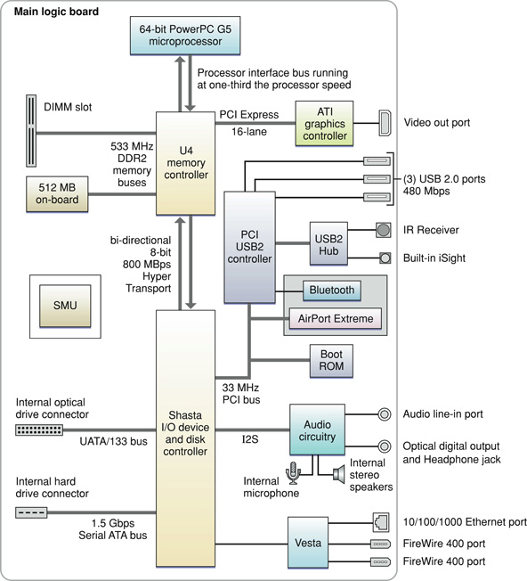

> 导航：[总目录](../../../README.md) · [documentation](../../../_indexes/documentation.md) · [iMac G5 Developer Note](Introduction%20to%20iMac%20G5%20Developer%20Note.md)

[Next](Document%20Revision%20History.md)[Previous](Introduction%20to%20iMac%20G5%20Developer%20Note.md)

# iMac G5 Developer Note

This note describes the iMac G5 introduced in October 2005. It includes information about distinguishing features of the computer, including components on the main logic board: the microprocessor, the other main ICs, and the buses that connect them to each other and to the I/O interfaces.

The iMac G5 comes with Mac OS X version 10.4.2 installed. The Classic environment can be installed from the included system software optical disk and used to run Mac OS 9 applications.

The value of the iMac G5 model identifier string is `PowerMac12,1`.

The architecture of the iMac G5 is based on the PowerPC G5 microprocessor and two custom ICs, the U4 memory controller and the Shasta I/O controller, connected by a HyperTransport bus. The U4 provides the bridging functionality among the processor, memory system, HyperTransport bus, and PCI Express bus.  The Shasta controller supports these components:

- Ultra ATA/133 bus for the optical drive
- Serial ATA (SATA) bus for the disk drive
- Vesta IC, comprising the FireWire 400 (1394a) PHY and the Ethernet PHY
- I2S channel to the audio subsystem
- 33 MHz, 32-bit internal PCI bus, which in turn supports the USB2 controller, the AirPort Extreme module, and the boot ROM.

Figure 1 provides a simplified block diagram of the U4 and Shasta ICs and other major components, and the buses that connect them together. 

__Figure 1__  Block diagram

The iMac G5 computer includes a programmable Apple Mighty Mouse, a built-in iSight video camera, an integrated IR receiver, and the Apple Remote. For a complete list of user-visible features, see the iMac G5 specification sheet at Apple's [Specifications](http://www.info.apple.com/support/applespec.html) site. Other features are described in this section.

The microprocessor in the iMac G5 is a PowerPC G5 with a clock speed of 1.9 GHz in the 17-inch configuration and 2.1 GHz in the 20-inch configuration. See the support site at [IBM](http://www.ibm.com/) for detailed microprocessor documentation. The processor connects to the U4 IC through a bus run at one-third the speed of the processor (up to 700 MHz) comprising two unidirectional 32-bit data buses.

One of two 64-bit 533MHz buses connects the U4 IC to the on-board DDR2 (PC2-4200) SDRAM memory, and the other connects it to the DIMM expansion slot. For additional information, refer to _[RAM Expansion Developer Note](../../Hardware%20Drivers/RAM%20Expansion%20Developer%20Note/Introduction%20to%20RAM%20Expansion%20Developer%20Note.md#apple-f4xwc4dqnrsv64tfmyxwi33df52wszbpkridimbqgaztamzr)_.

In the iMac G5, the graphics subsystem is connected to the U4 IC by a x16 link (16 lane), dual simplex, 2.5 GHz PCI Express bus. For more information on PCI Express, refer to _[PCI Developer Note](../PCI%20Developer%20Note/Introduction%20to%20PCI%20Developer%20Note.md#apple-f4xwc4dqnrsv64tfmyxwi33df52wszbpkridimbqgaztamrx)_. For more information on the graphics IC, refer to _[Video Developer Note](../Video%20Developer%20Note/Introduction%20to%20Video%20Developer%20Note.md#apple-f4xwc4dqnrsv64tfmyxwi33df52wszbpkridimbqgaztkmbu)_.

The HyperTransport bus between the U4 IC and the Shasta IC is 400 MHz DDR, 8 bits wide in both directions, supporting a total of 800 MBps bidirectional throughput. For more information on HyperTransport, see the [HyperTransport Consortium](http://www.hypertransport.org/) website.

The iMac G5 supports a 7200 rpm disk drive on an independent drive bus based on the Serial ATA (SATA) 1.0 specification. For more information on SATA, see the [Serial ATA International Organization](http://www.serialata.org/) (SATA-IO) website.

The iMac G5 uses a PCI USB controller ASIC with a total of five ports available to support three external USB ports, the Bluetooth module, and a USB2 hub for internal connections. The five USB ports comply with the Universal Serial Bus Specification 2.0. For more information, see _[Universal Serial Bus Developer Note](../../Hardware%20Drivers/Universal%20Serial%20Bus%20Developer%20Note/Introduction%20to%20Universal%20Serial%20Bus%20Developer%20Note.md#apple-f4xwc4dqnrsv64tfmyxwi33df52wszbpkridimbqgaztamrw)_.

The iMac G5 has a combined internal AirPort Extreme and Bluetooth 2.0 + EDR (enhanced data rate) module. AirPort Extreme and Bluetooth share two built-in antennas.  For more information, see _[AirPort Developer Note](../../Hardware%20Drivers/AirPort%20Developer%20Note/Introduction%20to%20AirPort%20Developer%20Note.md#apple-f4xwc4dqnrsv64tfmyxwi33df52wszbpkridimbqgaztamzq)_ and _[Bluetooth Developer Note](../../Hardware%20Drivers/Bluetooth%20Developer%20Note/Introduction%20to%20Bluetooth%20Developer%20Note.md#apple-f4xwc4dqnrsv64tfmyxwi33df52wszbpkridimbqgaztamzs)_.

The Vesta Ethernet PHY provides 10BASE-T/UTP, 100BASE-TX, or 1000BASE-T operation over a standard twisted-pair interface. For more information, see _[Ethernet Developer Note](../../Hardware%20Drivers/Ethernet%20Developer%20Note/Introduction%20to%20Ethernet%20Developer%20Note.md#apple-f4xwc4dqnrsv64tfmyxwi33df52wszbpkridimbqgaztamrz)_.

The Shasta IC provides the FireWire functions and includes a FireWire controller that supports IEEE 1394a (FireWire 400) with a maximum data rate of 400 Mbps (50 MBps). The Shasta IC provides DMA (direct memory access) support for the FireWire interface. Vesta provides the FireWire PHY.

For more information, see _[FireWire Developer Note](../../Hardware%20Drivers/FireWire%20Developer%20Note/Introduction%20to%20FireWire%20Developer%20Note.md#apple-f4xwc4dqnrsv64tfmyxwi33df52wszbpkridimbqgaztamry)_.

In the iMac G5 computer, the Shasta IC provides an Ultra ATA/133 interface to the slot-loading, 8x SuperDrive with double layer burning capability. The drive can read and write DVD media and CD media, as shown below.

__Table 1__  Types of media read and written by the SuperDrive

| Media type | Reading speed | Writing speed |
| DVD +/- R | 6x (CAV) | 8x ZCLV |
| DVD+R DL | 6x (CAV) | 2.4x CLV |
| DVD-ROM | 8x (CAV) | – |
| DVD-ROM DL | 6x (CAV) | – |
| DVD +/- RW | 6x (CAV) | 4x ZCLV |
| CD-R | 24x (CAV) | 24x ZCLV |
| CD-RW | 24x (CAV) | 16x ZCLV |
| CD-ROM | 24x (CAV) | – |

The SuperDrive is cable-select as device 0 (master) and complies with the ATA/ATAPI-5 industry standard. For information on parallel ATA interfaces, see the International Committee on Information Technology Standards (INCITS) Technical Committee 13 [AT Attachment](http://www.t13.org/) website.

The interrupt controller for the iMac G5 system is an MPIC cell in the U4 IC. In addition to accepting internal interrupt sources from the I/O, the MPIC controller accepts internal interrupts from the Shasta IC and dedicated interrupt pins.

The iMac G5 has a built-in microphone (located at the top of the display), and both an analog audio line-in jack and a combined analog and S/PDIF audio line-out jack on the rear panel. For more information, see _[Audio Developer Note](../Audio%20Developer%20Note/Introduction%20to%20Audio%20Developer%20Note.md#apple-f4xwc4dqnrsv64tfmyxwi33df52wszbpkridimbqgaztkmbv)_.

[Next](Document%20Revision%20History.md)[Previous](Introduction%20to%20iMac%20G5%20Developer%20Note.md)

