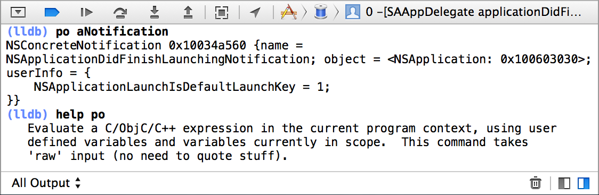

> 导航：[总目录](../../../README.md) · [documentation](../../../_indexes/documentation.md)

[Next](Getting%20Started%20with%20LLDB.md)

# About LLDB and Xcode

With the release of Xcode 5, the LLDB debugger becomes the foundation for the debugging experience on OS X.

LLDB is Apple’s “from the ground up” replacement for GDB, developed in close coordination with the LLVM compilers to bring you state-of-the-art debugging with extensive capabilities in flow control and data inspection. Starting with Xcode 5, all new and preexisting development projects are automatically reconfigured to use LLDB.

The standard LLDB installation provides you with an extensive set of commands designed to be compatible with familiar GDB commands. In addition to using the standard configuration, you can easily customize LLDB to suit your needs.

LLDB is fully integrated with Xcode 5 for source development and the build-and-run debugging experience. You access its wealth of capabilities using the controls provided by the Xcode UI and with commands issued from the Xcode debugging console.

### Understand LLDB Basics to Unlock Advanced Features

With the LLDB command language, you can use LLDB’s advanced features. The command syntax is regular and easy to learn. Many commands are expressed by included shortcuts, saving you time and keystrokes. And you can use the LLDB help system to quickly inspect and learn the details of the existing commands, shortcuts, and command options.

You customize LLDB using the command alias capability. You can also extend LLDB through the use of Python scripts and the Python-LLDB Object Library.

### Use LLDB Equivalents for Common GDB Commands

LLDB, as delivered, includes many command aliases designed to be the same as GDB commands. If you are already experienced in using GDB commands, you can use the provided tables to look up GDB commands and find the LLDB equivalents, including canonical and shorthand forms.

### Standalone LLDB Workflow

You usually experience LLDB by using the Xcode debugging features and, and you issue LLDB commands using the Xcode console pane. However, for development of open source and other non-GUI-based application debugging, you can use LLDB from a Terminal window as a traditional command-line debugger.

Knowing how LLDB works as a command-line debugger can help you understand and use the full power of LLDB in the Xcode console pane as well.

For a good look at how to use Xcode’s debugging features, all powered by the LLDB debugging engine, see the WWDC 2013 session video for Tools #407 _WWDC 2013: Debugging with Xcode_.

To see the latest advanced techniques to help you efficiently track down bugs with LLDB, view the WWDC 2013 session video for Tools #413 _WWDC 2013: Advanced Debugging with LLDB_.

For more information about the use of LLDB Python scripting and other advanced capabilities, visit [The LLDB Debugger](http://lldb.llvm.org/).

[Next](Getting%20Started%20with%20LLDB.md)

