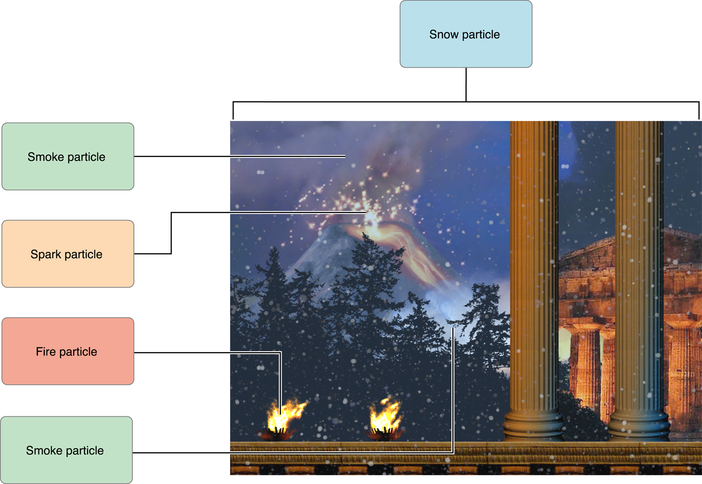

> 导航：[总目录](../../../README.md) · [documentation](../../../_indexes/documentation.md)

[Next](Getting%20Started%20with%20the%20Particle%20Emitter.md)

# About the Particle Emitter Editor

The particle emitter editor in Xcode provides an area in which you can change the values for a particle emitter and immediately see the results.

Particle emitters are a function of the SpriteKit framework that allow you to specify a specific point in their display and create images that move and change over time. Using emitters, you can simulate rain, snow, fire, and many other effects in your game.

Particle emitters provide you with a quick and efficient way to add special effects to their SpriteKit apps. Emitters can range from a single image that barely moves to thousands of small particles flying around the screen. You can control the following emitter items:

- The number of particles created and the maximum number of particles allowed
- How long each particle lasts before disappearing
- Where the particle is created
- The direction that the particle moves out from its creation point
- The size of the particle and whether it expands or shrinks over its lifetime
- The rotation, if any, of the particle
- How the color of the particle changes throughout its lifetime

This document is intended for developers that are incorporating particle emitters into their SpriteKit–enabled apps. The following chapters describe how to use and add an emitter to your app:

- [Getting Started with the Particle Emitter](Getting%20Started%20with%20the%20Particle%20Emitter.md#apple-f4xwc4dqnrsv64tfmyxwi33df52wszbpkridimbqgezteojxfvbuqmznknltc) shows how to incorporate a particle emitter into your SpriteKit–enabled Xcode project. It also lists and describes the different particle emitter templates included with Xcode.
- [Manipulating the Particle Emitter](Manipulating%20the%20Particle%20Emitter.md#apple-f4xwc4dqnrsv64tfmyxwi33df52wszbpkridimbqgezteojxfvbuqmrnknltc) shows how to change the look and feel of a particle emitter.

For additional information on SpriteKit and particle emitters, see the following:

- The [SKEmitterNode Class Reference](https://developer.apple.com/reference/spritekit/skemitternode) contains the API references for SpriteKit.
- The _[SpriteKit Programming Guide](../../Graphics%20Animation/SpriteKit%20Programming%20Guide/About%20SpriteKit.md#apple-f4xwc4dqnrsv64tfmyxwi33df52wszbpkridimbqgeztanbt)_ shows you how to create a SpriteKit–enabled app.
- The [Xcode Help](https://help.apple.com/xcode/) shows you how to use Xcode to create and develop your app.
[Next](Getting%20Started%20with%20the%20Particle%20Emitter.md)

