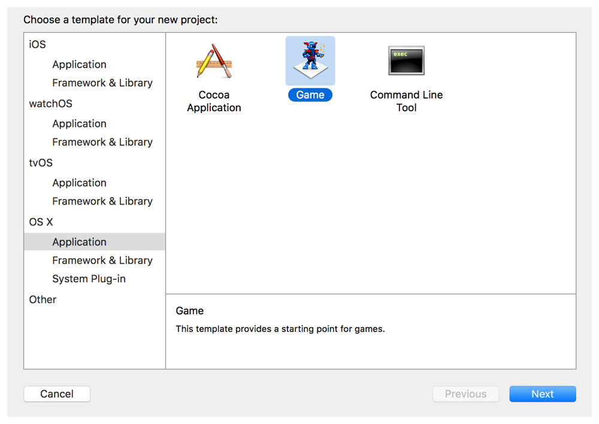
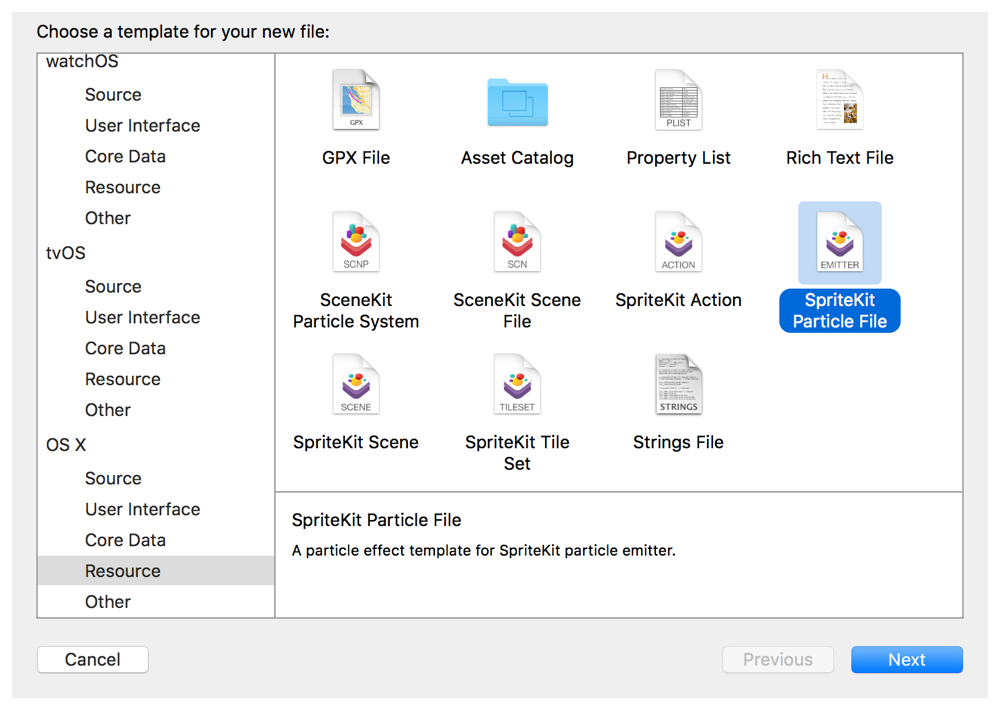

> 导航：[总目录](../../../README.md) · [documentation](../../../_indexes/documentation.md) · [Particle Emitter Editor Guide](About%20the%20Particle%20Emitter%20Editor.md)

[Next](Manipulating%20the%20Particle%20Emitter.md)[Previous](About%20the%20Particle%20Emitter%20Editor.md)

# Getting Started with the Particle Emitter

A particle emitter can be added to any project that uses the SpriteKit framework. Xcode provides you with several emitter templates to add to your app. Or you can create new emitter programmatically and insert it directly into your app.

Before adding a particle emitter to your project, you must have a SpriteKit–enabled project. You can either create a new SpriteKit project or add SpriteKit to an existing project. To create a new project, you can find the Game project template in the Application section for both iOS and OS X.

After choosing the Game project template and clicking Next, you can select SpriteKit from the Game Technology drop-down menu.

For your convenience, Xcode is preinstalled with eight particle emitter templates. See Table 1-1 for a description of each particle emitter template.

To add a particle emitter to a project

1. Choose File > New > File.
2. Choose Resource > SpriteKit Particle File.

   
3. Select the particle template from the drop-down menu, and click Next.
4. Enter a name for the emitter in the Save As field.
5. Select the checkbox associated with your project in the Targets area.

__Table 1-1__  Particle emitter templates

| Template name | Description |
| Bokeh | Hexagonal particles that grow and blur before fading out at the end of their life cycle. |
| Fire | A small fire effect that you would see in a fireplace or campfire. |
| Fireflies | Short-lived yellow particles that randomly move a short distance while growing and blurring before fading out at the end of their life cycle. |
| Magic | Short-lived green particles that randomly move a short distance while growing and blurring before fading out at the end of their life cycle. |
| Rain | Nonmorphing particles that start at the top of the emitter and move toward the bottom of the screen. Each particle moves at a different speed. |
| Smoke | Large black particles that start at the bottom of the emitter and move toward the top of the screen. As the particle moves, it slowly fades out. |
| Snow | White, diffuse, round particles that start at the top of the emitter and move toward the bottom of the screen. Each particle is a different size and moves at a different speed. |
| Spark | Sends short-lived, golden particles in 360 degrees, centered around the emitter. |

[Next](Manipulating%20the%20Particle%20Emitter.md)[Previous](About%20the%20Particle%20Emitter%20Editor.md)

