> 导航：[总目录](../../../README.md) · [documentation](../../../_indexes/documentation.md) · [Particle Emitter Editor Guide](About%20the%20Particle%20Emitter%20Editor.md)

[Next](Document%20Revision%20History.md)[Previous](Getting%20Started%20with%20the%20Particle%20Emitter.md)

# Manipulating the Particle Emitter

The particle emitter inspector provides you with the ability to modify the look and feel of the particles created by the emitter. Using the inspector, you can change the rate at which particles are created, what a particle looks like, and how it acts once it is created. Changes made to the inspector take effect immediately and can be seen in the Editor area.

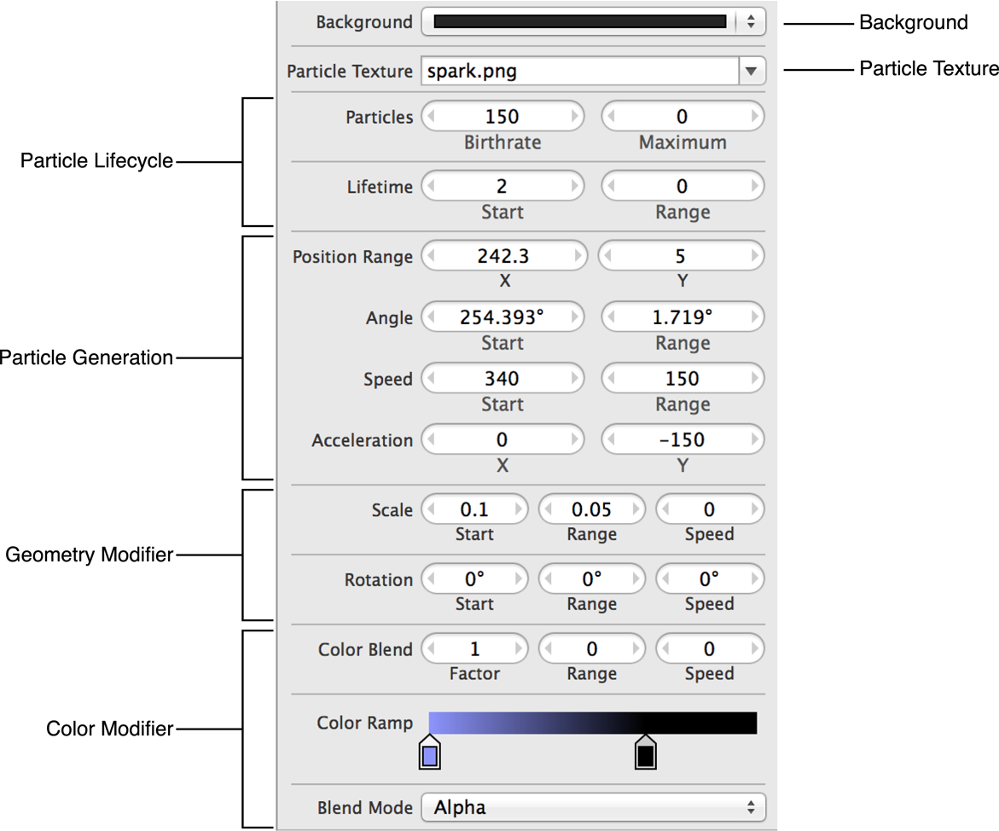

Choose the color you want to use for the background by clicking the Background pop-up menu. Inside the pop-up menu, you can choose from recently used colors. If the color you want to use is not listed, choose Other to bring up the color picker.

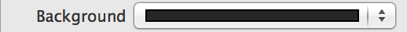

The color you pick for the background persists until you change it again. When the game is built, the background color is saved, but is not used at runtime. To create an emitter with no background color, set the opacity in the color picker to 0.

Choose the particle texture for your emitter. Each particle created is based on the image selected. The image selected can be a solid shape or a complex picture. You can use any image associated with the project as a particle texture. All modifications to the emitter are applied to the selected image.

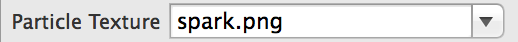

Keep in mind that the larger or more complex a particle image is, the more resources it uses. Use the smallest and least complex image possible for the desired effect.

The number of particles created and how long they are onscreen directly affect the performance of your game. Use the minimal number of particles to create the desired effect. The fields in the Particle Life Cycle group provide you with controls for how many particles are created, the maximum number of particles created, and the length of time that each particle is alive.

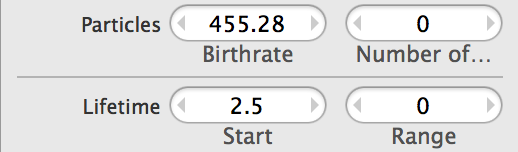

You can set how often particles are created and the maximum number of particles created. Choose a maximum number of particles that can be supported by the hardware your game runs on. See Table 2-1 for a description of the particles fields.

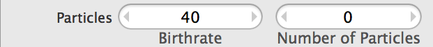

__Table 2-1__  Particles fields

| Field | Description | SKEmitterNode property |
| Birthrate | The rate at which particles are created by the emitter. | [particleBirthRate](https://developer.apple.com/documentation/spritekit/skemitternode/1398039-particlebirthrate) |
| Maximum | The maximum number of particles that the emitter creates over the emitter’s lifetime. After this number is reached, no more particles are created by the emitter. Enter 0 to remove particle limits. | [numParticlesToEmit](https://developer.apple.com/documentation/spritekit/skemitternode/1398043-numparticlestoemit) |

The Lifetime group controls how long each individual particle is onscreen.

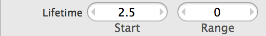

The amount of time that a particle is onscreen directly affects the performance of your game. Each particle should be alive for the minimum amount of time required to achieve the desired effect. If your game slows down when your emitter is onscreen, consider reducing the number of particles created, the length of time each particle is alive, or both. See Table 2-2 for a description of the lifetime fields.

__Table 2-2__  Lifetime fields

| Field | Description | SKEmitterNode property |
| Start | Amount of time, in seconds, that a particle is visible. | [particleLifetime](https://developer.apple.com/documentation/spritekit/skemitternode/1398000-particlelifetime) |
| Range | Varies the amount of time that a particle is onscreen. A random number between 0 and the entered number is generated. Half of the resulting number is randomly added or subtracted to the number entered in the Start field to produce the final lifetime of the particle. Enter 0 to have all particles stay visible for the same amount of time. | [particleLifetimeRange](https://developer.apple.com/documentation/spritekit/skemitternode/1397994-particlelifetimerange) |

The Particle Generation group is made up of several subareas. Each area controls a different aspect of where a particle is created and the speed and angle that the particle moves after creation.

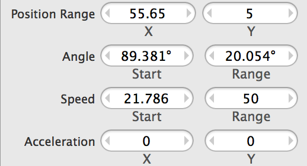

The Position Range fields defines the area in which the emitter creates particles. Particles are created within the rectangle centered on the point defined in the Emission Point fields and bounded by the Range fields. See Table 2-3 for descriptions of the position range fields.

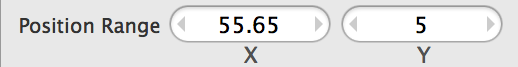

__Table 2-3__  Position Range fields

| Field | Description | SKEmitterNode property |
| X | The number of points to the left and right of the designated emission point, plus or minus half of the amount entered. | [particlePositionRange](https://developer.apple.com/documentation/spritekit/skemitternode/1397972-particlepositionrange) |
| Y | The number of points above and below the designated emission point, plus or minus half of the amount entered. | [particlePositionRange](https://developer.apple.com/documentation/spritekit/skemitternode/1397972-particlepositionrange) |

The Angle fields control the direction, in degrees, that particles move away from the emitter. Entering 0 degrees moves the particles directly to the right. The degrees work on a counterclockwise rotation, so entering 90 in the Start field sends the particles to the top of the screen. See Table 2-4 for a description of the angle fields.

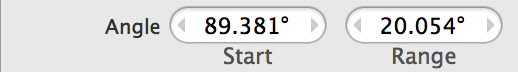

__Table 2-4__  Angle fields

| Field | Description | SKEmitterNode property |
| Start | The direction, in degrees, that particles are emitted. | [emissionAngle](https://developer.apple.com/documentation/spritekit/skemitternode/1398035-emissionangle) |
| Range | The number of degrees that the particle’s initial angle varies, plus or minus half of the number of degrees listed. | [emissionAngleRange](https://developer.apple.com/documentation/spritekit/skemitternode/1398067-emissionanglerange) |

The Speed fields define how fast particle is moving at the instance of creation. See Table 2-5 for a description of the speed fields.

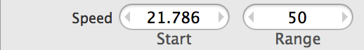

__Table 2-5__  Speed fields

| Field | Description | SKEmitterNode property |
| Start | The base speed that all particles are imparted with. | [particleSpeed](https://developer.apple.com/documentation/spritekit/skemitternode/1398061-particlespeed) |
| Range | Adjusts the base speed for a particle, plus or minus half of the amount listed. Entering 0 means that all particles travel at the same speed. | [particleSpeedRange](https://developer.apple.com/documentation/spritekit/skemitternode/1398045-particlespeedrange) |

The Acceleration fields define and modify the speed of a particle after it is created. You can use this to simulate an overall gravity effect, wind blowing smoke from a fire, or other effects. See Table 2-6 for a description of the acceleration fields.

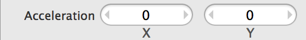

__Table 2-6__  Acceleration fields

| Field | Description | SKEmitterNode property |
| X | Applies an up or down acceleration to a generated particle. | [xAcceleration](https://developer.apple.com/documentation/spritekit/skemitternode/1398017-xacceleration) |
| Y | Applies a left or right acceleration to a generated particle. | [yAcceleration](https://developer.apple.com/documentation/spritekit/skemitternode/1397982-yacceleration) |

The Scale fields control the size of each particle and whether the particle expands or shrinks during its lifetime.

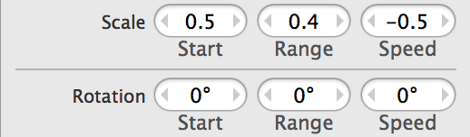

The Scale fields control the size of each particle and whether the particle expands or shrinks during its lifetime. See Table 2-7 for a description of the scale fields.

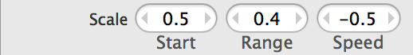

__Table 2-7__  Scale fields

| Field | Description | SKEmitterNode property |
| Start | Sets the size of the particle when first created. The number entered is a percentage of the size of the particle image. Enter 1 in this field to create a particle the same size as the image selected. | [particleScale](https://developer.apple.com/documentation/spritekit/skemitternode/1398014-particlescale) |
| Range | Modifies the starting size of the particle, plus or minus half of the amount listed. | [particleScaleRange](https://developer.apple.com/documentation/spritekit/skemitternode/1397990-particlescalerange) |
| Speed | Sets the rate at which the size of the particle changes. Enter positive number to have the particle grow larger and a negative number for the particle to grow smaller. | [particleScaleSpeed](https://developer.apple.com/documentation/spritekit/skemitternode/1398073-particlescalespeed) |

The Rotation fields control the speed and direction that the particles rotate when created. You can use these fields to simulate falling leaves, spinning snowflakes, or any other object that needs to rotate. See Table 2-8 for a description of the rotation fields.

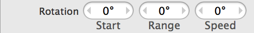

__Table 2-8__  Rotation fields

| Field | Description | SKEmitterNode property |
| Start | Initial orientation of the particle in degrees. Use a positive number to rotate the particle image counterclockwise and a negative number to rotate the particle image clockwise. | [particleRotation](https://developer.apple.com/documentation/spritekit/skemitternode/1398025-particlerotation) |
| Range | Changes the initial orientation of the particle up to half of the number of degrees listed. This value randomly rotates the the particle image clockwise or counterclockwise. | [particleRotationRange](https://developer.apple.com/documentation/spritekit/skemitternode/1397996-particlerotationrange) |
| Speed | Controls how fast the object rotates in degrees per second. Use a positive number to rotate the the particle counterclockwise and a negative number to rotate the particle clockwise. | [particleRotationSpeed](https://developer.apple.com/documentation/spritekit/skemitternode/1397968-particlerotationspeed) |

You can change the color of a particle through its lifetime by using the fields found in the Color Modification group. These fields provide you with the capability to change the color of a particle over its lifetime and to determine how a particle blends in with other images.

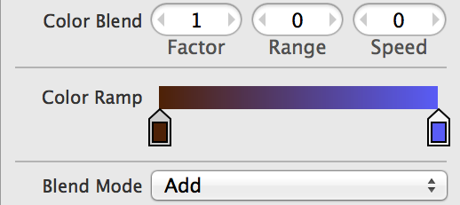

The Color Blend fields control how the particle blends the color designated in the color ramp and the particle’s texture inherent color. See Table 2-9 for a description of the color blend fields.

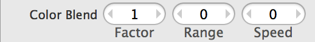

__Table 2-9__  Color Blend fields

| Field | Description | SKEmitterNode property |
| Factor | Blends the color designated by the Color Ramp with the particle texture’s inherent color. Set this to 0 to ignore the color designated in the Color Ramp. | [particleColorBlendFactor](https://developer.apple.com/documentation/spritekit/skemitternode/1398071-particlecolorblendfactor) |
| Range | Creates a variable color blend range. The color of the particle is blended with the color designated by the Color Ramp and varies by plus or minus half of the range value. | [particleColorBlendFactorRange](https://developer.apple.com/documentation/spritekit/skemitternode/1398047-particlecolorblendfactorrange) |
| Speed | Sets the speed at which the particle changes its blend value. A positive number changes the particle color blend from its starting value to maximum blend. A negative number changes the particle color blend from its starting value to no blend. | [particleColorBlendFactorSpeed](https://developer.apple.com/documentation/spritekit/skemitternode/1398037-particlecolorblendfactorspeed) |

The Color Ramp group provides you with a way to change the color of a particle throughout its life cycle. You can have a particle go through as many color changes as you want during a particle’s life cycle. The particle changes colors based on the space between color sliders.

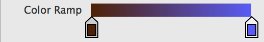

To add a new color slider to the color ramp, click anywhere in the color ramp field. To remove a color slider from the color ramp, click and drag the slider off the color ramp.

You can create an immediate change of color for your particle by placing two color sliders on top of each other so that there is no space between them on the color ramp.

Determine how each particle blends with other images in your game by changing the Blend Mode. The Blend Mode pop-up menu provides seven different blend modes. See Table 2-10 for a description of the blend mode fields.

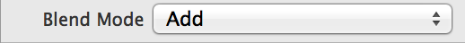

__Table 2-10__  Blend Mode fields

| Field | Description | SKEmitterNode property |
| Alpha | Determines if the particle is transparent and blended with the background image. | [particleBlendMode](https://developer.apple.com/documentation/spritekit/skemitternode/1397978-particleblendmode) |
| Add | Adds the pixel values of the particle and underlying images. Creates a white pixel if this value is greater than 1. | [particleBlendMode](https://developer.apple.com/documentation/spritekit/skemitternode/1397978-particleblendmode) |
| Subtract | Subtracts the particle pixel value from the underlying pixel values. Creates a black pixel if this value is less than 0. | [particleBlendMode](https://developer.apple.com/documentation/spritekit/skemitternode/1397978-particleblendmode) |
| Multiply | Creates a darker particle effect by multiplying the pixel values of the particle with the underlying pixel values. | [particleBlendMode](https://developer.apple.com/documentation/spritekit/skemitternode/1397978-particleblendmode) |
| MultiplyX2 | Creates an even darker particle effect than Multiply. | [particleBlendMode](https://developer.apple.com/documentation/spritekit/skemitternode/1397978-particleblendmode) |
| Screen | Creates a lighter particle effect by inverting the pixel values, multiplying them together, and then inverting them again. | [particleBlendMode](https://developer.apple.com/documentation/spritekit/skemitternode/1397978-particleblendmode) |
| Replace | Uses the particle’s color only; it does not blend with background pixels. | [particleBlendMode](https://developer.apple.com/documentation/spritekit/skemitternode/1397978-particleblendmode) |

[Next](Document%20Revision%20History.md)[Previous](Getting%20Started%20with%20the%20Particle%20Emitter.md)

