> 导航：[总目录](../../../README.md) · [documentation](../../../_indexes/documentation.md) · [Quick Look for Custom Types in the Xcode Debugger](About%20Variables%20Quick%20Look%20for%20Custom%20Types.md)

[Next](Document%20Revision%20History.md)[Previous](Enabling%20Quick%20Look%20for%20Custom%20Types.md)

# Operating System Types Supporting debugQuickLookObject

Your custom Quick Look display method, `debugQuickLookObject` (see [Implement the Quick Look method](Enabling%20Quick%20Look%20for%20Custom%20Types.md#apple-f4xwc4dqnrsv64tfmyxwi33df52wszbpkridimbqge2dambrfvbuqmrnknlte)), must return an object whose type is one of the operating system classes that supports rendering custom classes in Quick Look. The following table lists these iOS and OS X system classes, grouped by similar content.

The examples in [Quick Look Examples for System Classes](#apple-f4xwc4dqnrsv64tfmyxwi33df52wszbpkridimbqge2dambrfvbuqmznknltema) illustrate the standard Quick Look displays for these operating system object types.

| Object Type | Example | Implementation Notes |
| --- | --- | --- |
| Default | See the figure in [Default](#apple-f4xwc4dqnrsv64tfmyxwi33df52wszbpkridimbqge2dambrfvbuqmznknltemi). | No custom Quick Look display available. |
| Image classes:   - `NSImage` - `UIImage` - `NSImageView` - `UIImageView` - `CIImage` - `NSBitmapImageRep` | See the figure in [Image Class Types](#apple-f4xwc4dqnrsv64tfmyxwi33df52wszbpkridimbqge2dambrfvbuqmznknltemq). | For `CIImage`, the Xcode target must be OS X Mavericks or later.    `NSBitmapImageRep` is supported in Xcode 5.1 or later. |
| Cursor class:   - `NSCursor` | See the figure in [Cursor Class Type](#apple-f4xwc4dqnrsv64tfmyxwi33df52wszbpkridimbqge2dambrfvbuqmznknltemy). |  |
| Color classes:   - `NSColor` - `UIColor` | See the figure in [Color Class Types](#apple-f4xwc4dqnrsv64tfmyxwi33df52wszbpkridimbqge2dambrfvbuqmznknltena). |  |
| BezierPath classes:   - `NSBezierPath` - `UIBezierPath` | See the figure in [BezierPath Class Types](#apple-f4xwc4dqnrsv64tfmyxwi33df52wszbpkridimbqge2dambrfvbuqmznknlteni). |  |
| Location classes:   - `CLLocation` | See the figure in [Location Class Type](#apple-f4xwc4dqnrsv64tfmyxwi33df52wszbpkridimbqge2dambrfvbuqmznknltenq). |  |
| View classes:   - `NSView` - `UIView` | See the figure in [View Class Types](#apple-f4xwc4dqnrsv64tfmyxwi33df52wszbpkridimbqge2dambrfvbuqmznknlteoa). | `UIView` supported in Xcode 5.1 or later. |
| String class:   - `NSString` | See the figure in [String Class Type](#apple-f4xwc4dqnrsv64tfmyxwi33df52wszbpkridimbqge2dambrfvbuqmznknlteoi). |  |
| AttributedString class:   - `NSAttributedString` | See the figure in [AttributedString Class Type](#apple-f4xwc4dqnrsv64tfmyxwi33df52wszbpkridimbqge2dambrfvbuqmznknltgma). |  |
| Data class:   - `NSData` | See the figure in [Data Class Type](#apple-f4xwc4dqnrsv64tfmyxwi33df52wszbpkridimbqge2dambrfvbuqmznknltgmi). |  |
| URL class:   - `NSURL` | See the figure in [URL Class Type](#apple-f4xwc4dqnrsv64tfmyxwi33df52wszbpkridimbqge2dambrfvbuqmznknltgnq). |  |
| SpriteKit classes:   - `SKSpriteNode` - `SKShapeNode` - `SKTexture` - `SKTextureAtlas` | See the figure in [SpriteKit Class Types](#apple-f4xwc4dqnrsv64tfmyxwi33df52wszbpkridimbqge2dambrfvbuqmznknltcmy). | SpriteKit classes are supported in Xcode 6 or later. The target must be iOS 8 or OS X Yosemite, or later. |

The default Quick Look display is used when no Quick Look debug object is available.

(_Return to table:_ [Returnable Types for debugQuickLookObject](#apple-f4xwc4dqnrsv64tfmyxwi33df52wszbpkridimbqge2dambrfvbuqmznknltcoi))

Image class types open in a Quick Look display with a button that allows you to open the rendering graphic in Preview.

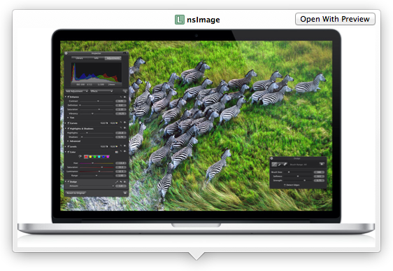

(_Return to table:_ [Returnable Types for debugQuickLookObject](#apple-f4xwc4dqnrsv64tfmyxwi33df52wszbpkridimbqge2dambrfvbuqmznknltcoi))

Cursor class types open into a Quick Look display with a button that allows you to view them in Preview.

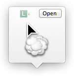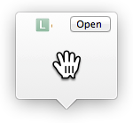

(_Return to table:_ [Returnable Types for debugQuickLookObject](#apple-f4xwc4dqnrsv64tfmyxwi33df52wszbpkridimbqge2dambrfvbuqmznknltcoi))

Color class types show a sample swatch with red, green, blue, and alpha channel values represented in the range from 0.0 to 1.0.

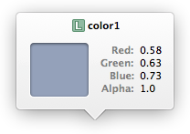

(_Return to table:_ [Returnable Types for debugQuickLookObject](#apple-f4xwc4dqnrsv64tfmyxwi33df52wszbpkridimbqge2dambrfvbuqmznknltcoi))

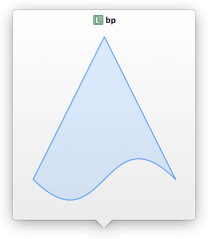

(_Return to table:_ [Returnable Types for debugQuickLookObject](#apple-f4xwc4dqnrsv64tfmyxwi33df52wszbpkridimbqge2dambrfvbuqmznknltcoi))

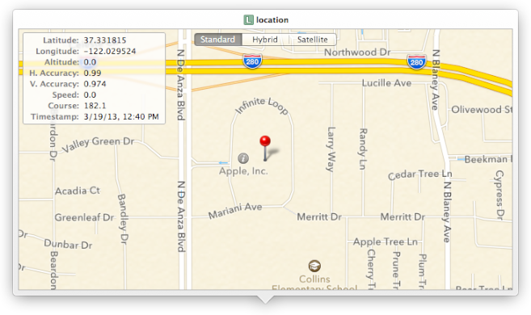

(_Return to table:_ [Returnable Types for debugQuickLookObject](#apple-f4xwc4dqnrsv64tfmyxwi33df52wszbpkridimbqge2dambrfvbuqmznknltcoi))

View class types open in Quick Look displays with buttons that allow you to open the graphic displayed in Preview.

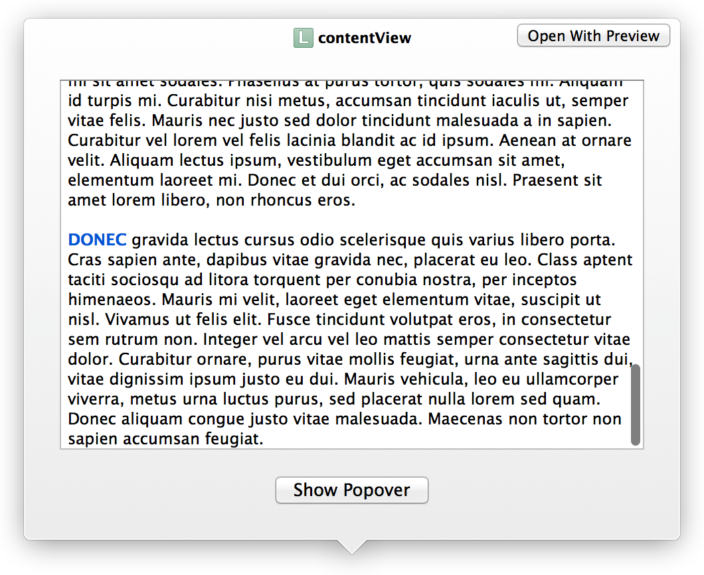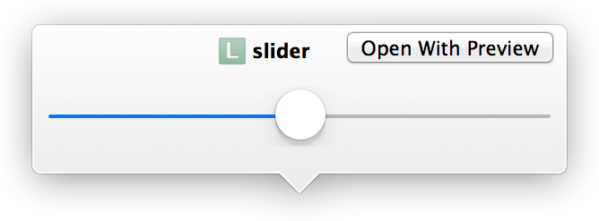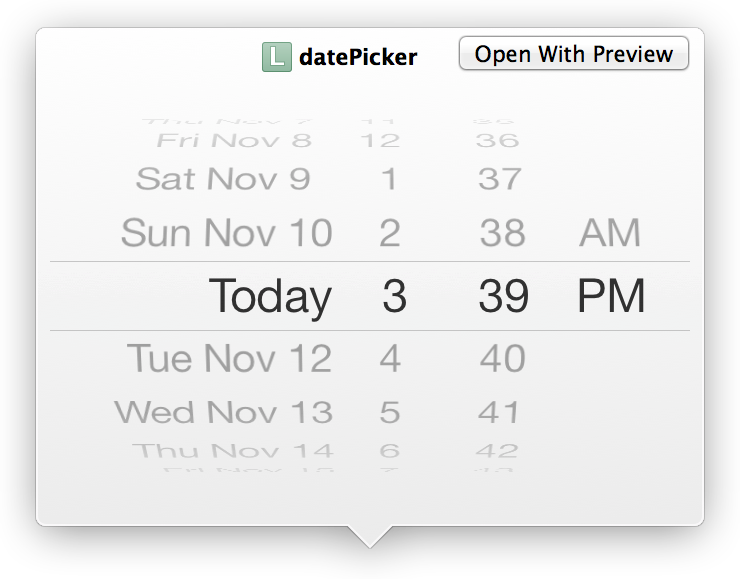

(_Return to table:_ [Returnable Types for debugQuickLookObject](#apple-f4xwc4dqnrsv64tfmyxwi33df52wszbpkridimbqge2dambrfvbuqmznknltcoi))

String class types open in a view equipped with a button that transfers the contents into TextEdit.

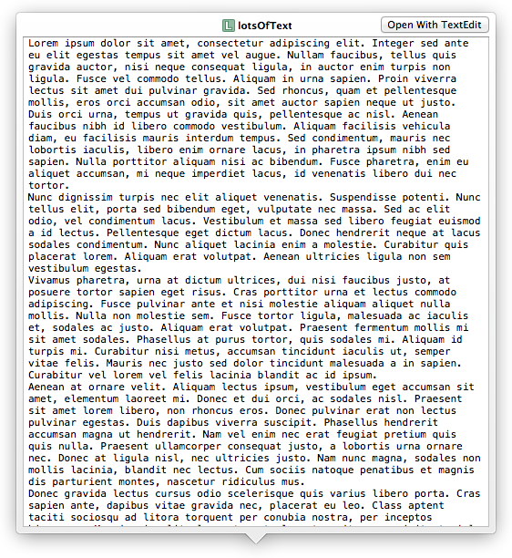

(_Return to table:_ [Returnable Types for debugQuickLookObject](#apple-f4xwc4dqnrsv64tfmyxwi33df52wszbpkridimbqge2dambrfvbuqmznknltcoi))

AttributedString class types open in a view equipped with a button that transfers the contents into TextEdit.

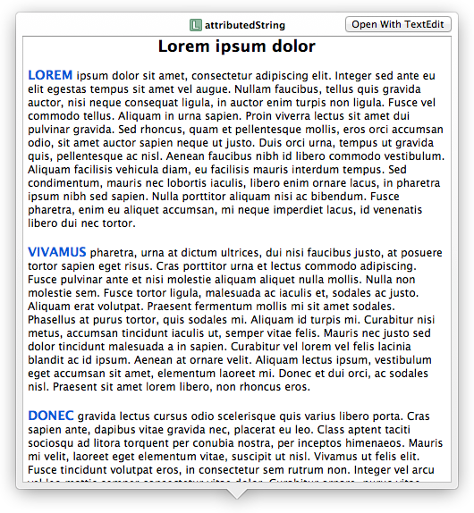

(_Return to table:_ [Returnable Types for debugQuickLookObject](#apple-f4xwc4dqnrsv64tfmyxwi33df52wszbpkridimbqge2dambrfvbuqmznknltcoi))

The `NSData` class type opens in a three-column view of offset, hexadecimal, and ASCII values.

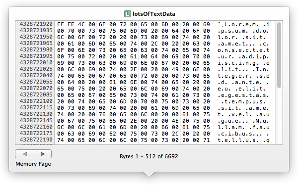

(_Return to table:_ [Returnable Types for debugQuickLookObject](#apple-f4xwc4dqnrsv64tfmyxwi33df52wszbpkridimbqge2dambrfvbuqmznknltcoi))

This example of an `NSURL` Quick Look is displayed from a web source.

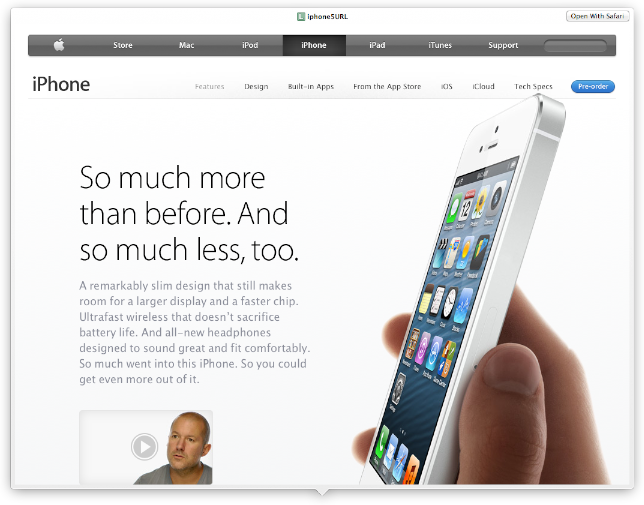

(_Return to table:_ [Returnable Types for debugQuickLookObject](#apple-f4xwc4dqnrsv64tfmyxwi33df52wszbpkridimbqge2dambrfvbuqmznknltcoi))

This example of an `NSURL` Quick Look is displayed from a local or system Quick Look source.

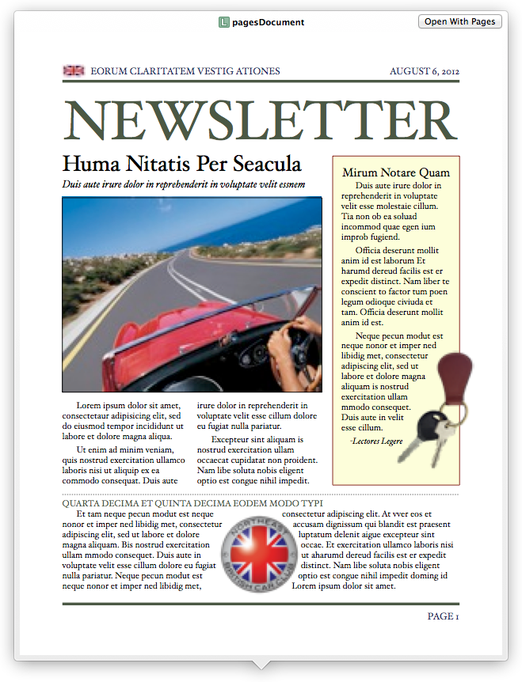

(_Return to table:_ [Returnable Types for debugQuickLookObject](#apple-f4xwc4dqnrsv64tfmyxwi33df52wszbpkridimbqge2dambrfvbuqmznknltcoi))

SpriteKit class types open in a Quick Look display with a button that allows you to open the rendered graphic in Preview.

Example of an `SKSpriteNode`:

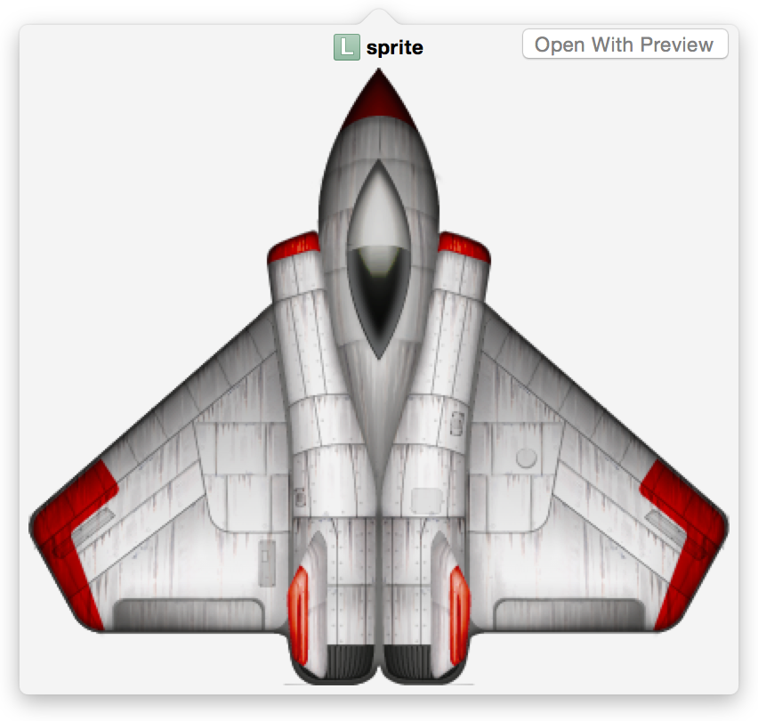

Example of an `SKTexture`:

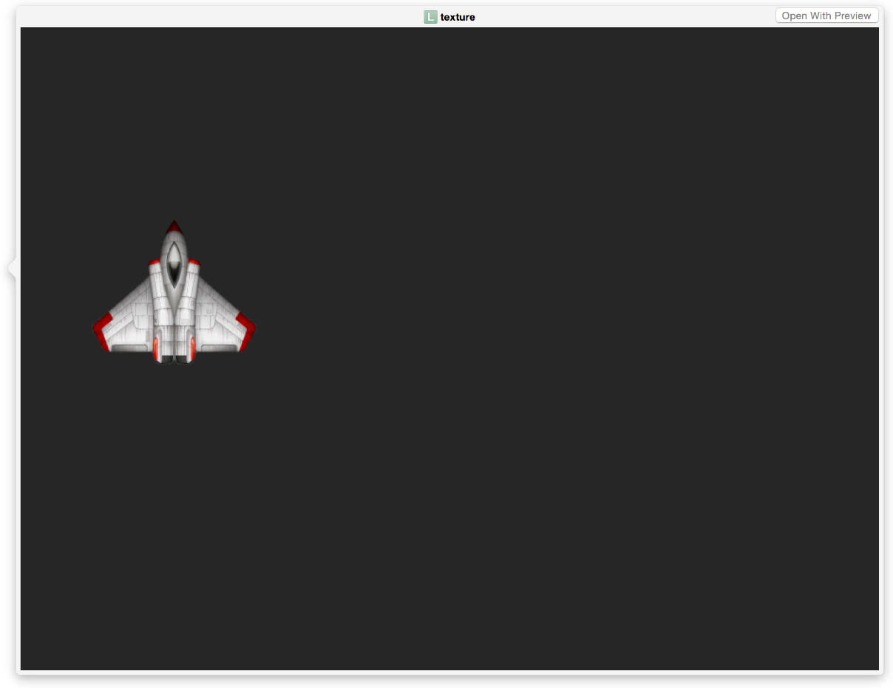

(_Return to table:_ [Returnable Types for debugQuickLookObject](#apple-f4xwc4dqnrsv64tfmyxwi33df52wszbpkridimbqge2dambrfvbuqmznknltcoi))

[Next](Document%20Revision%20History.md)[Previous](Enabling%20Quick%20Look%20for%20Custom%20Types.md)

