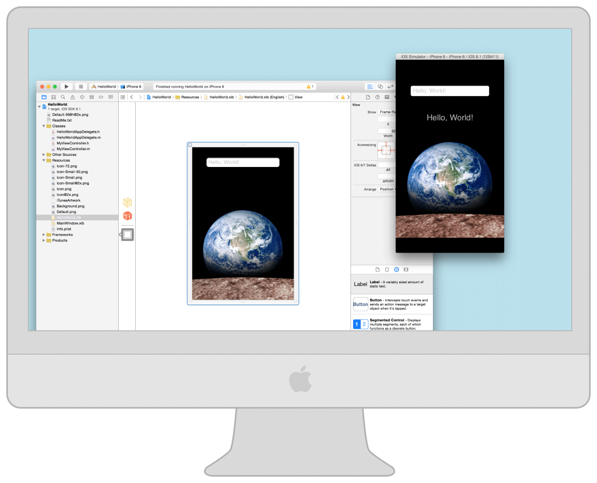

> 导航：[总目录](../../../README.md) · [documentation](../../../_indexes/documentation.md)

[Next](Getting%20Started%20in%20Simulator.md)

# About Simulator

Simulator allows you to rapidly prototype and test builds of your app during the development process. Installed as part of the Xcode tools, Simulator runs on your Mac and behaves like a standard Mac app while simulating an iPhone, iPad, Apple Watch, or Apple TV environment. Think of the simulator as a preliminary testing tool to use before testing your app on an actual device.

Simulator enables you to simulate iOS, watchOS, and tvOS devices running current and some legacy operating systems. Each combination of a simulated device and software version is considered its own simulation environment, independent of the others, with its own settings and files. These settings and files exist on every device you test within a simulation environment.

By simulating the operation of your app in Simulator, you can:

- Find major problems in your app during design and early testing
- Test your app using developer tools that are available only for Simulator
- Learn about the Xcode development experience and the iOS development environment before becoming a member of the iOS Developer Program

This guide walks you through Simulator, starting with the basics of how to use it and moving on to the tools found within the simulator that can assist you in testing and debugging your apps.

### Organization of This Document

Read the following chapters to learn how to use Simulator:

- [Getting Started in Simulator](Getting%20Started%20in%20Simulator.md#apple-f4xwc4dqnrsv64tfmyxwi33df52wszbpkridimbqgezdqnbyfvbuqnjnknltc), to understand the functionality of Simulator, and gain a working knowledge of the various ways to launch it
- [Interacting with Simulator](Interacting%20with%20Simulator.md#apple-f4xwc4dqnrsv64tfmyxwi33df52wszbpkridimbqgezdqnbyfvbuqmznknltc), to learn about the various ways of interacting with Simulator, including taking screenshots and changing the scale of simulated devices
- [Interacting with iOS and watchOS](Interacting%20with%20iOS%20and%20watchOS.md#apple-f4xwc4dqnrsv64tfmyxwi33df52wszbpkridimbqgezdqnbyfvbuqobnknltc), to learn about the specific ways of interacting with simulated iOS and watchOS devices, including gestures and hardware manipulation
- [Interacting with tvOS](Interacting%20with%20tvOS.md#apple-f4xwc4dqnrsv64tfmyxwi33df52wszbpkridimbqgezdqnbyfvbuqnznknltc), to learn about the specific ways of interacting with tvOS, including using the focus-based user interface and using external remotes with Simulator
- [Testing and Debugging in Simulator](Testing%20and%20Debugging%20in%20Simulator.md#apple-f4xwc4dqnrsv64tfmyxwi33df52wszbpkridimbqgezdqnbyfvbuqnbnknltc), to understand the tools available within Simulator to assist you with testing and debugging your apps
- [Customizing Your Simulator Experience with Xcode Schemes](Customizing%20Your%20Simulator%20Experience%20with%20Xcode%20Schemes.md#apple-f4xwc4dqnrsv64tfmyxwi33df52wszbpkridimbqgezdqnbyfvbuqnrnknltc), to learn about additional ways to customize your Simulator experience through Xcode schemes

Apple provides these related documents that you may find helpful:

- To learn the basics of developing iOS apps, see _[Start Developing iOS Apps (Swift)](https://developer.apple.com/library/archive/referencelibrary/GettingStarted/DevelopiOSAppsSwift/index.html#//apple_ref/doc/uid/TP40015214)_.
- To learn about the basics of developing watchOS apps, see _[App Programming Guide for watchOS](https://developer.apple.com/library/archive/documentation/General/Conceptual/WatchKitProgrammingGuide/index.html#//apple_ref/doc/uid/TP40014969)_.
- To learn more about how you can customize your development experience within Xcode, see _[Xcode Overview](https://developer.apple.com/library/archive/documentation/ToolsLanguages/Conceptual/Xcode_Overview/index.html#//apple_ref/doc/uid/TP40010215)_.
- To learn about the process of testing your app on a device, submitting it to the App Store, and distributing it, see _App Distribution Quick Start_.
[Next](Getting%20Started%20in%20Simulator.md)

