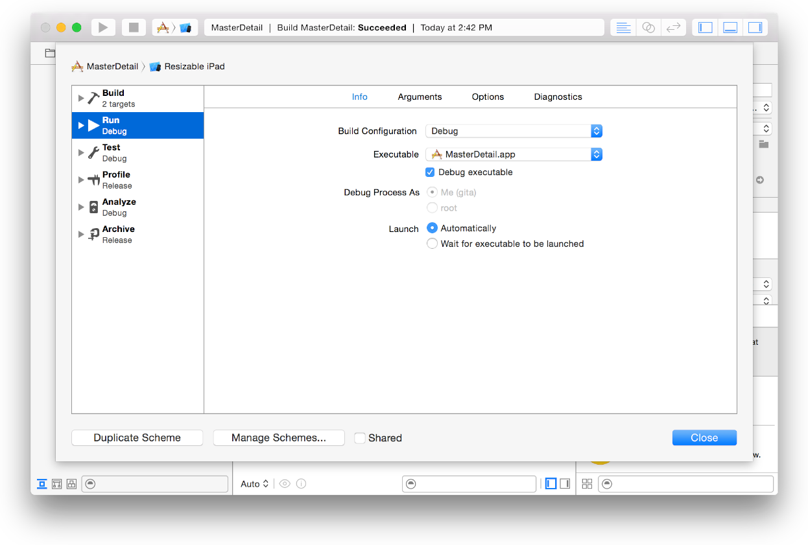
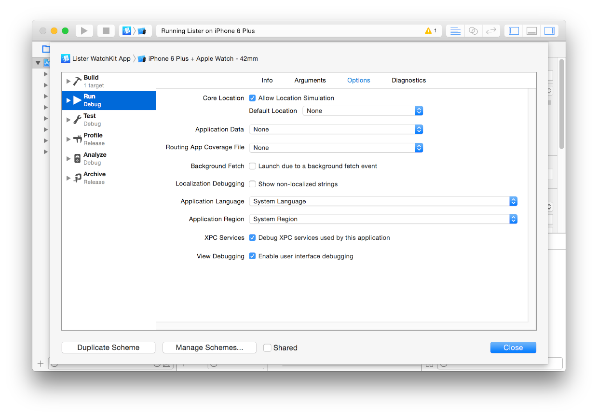

> 导航：[总目录](../../../README.md) · [documentation](../../../_indexes/documentation.md) · [Simulator User Guide](About%20Simulator.md)

[Next](Document%20Revision%20History.md)[Previous](Testing%20and%20Debugging%20in%20Simulator.md)

# Customizing Your Simulator Experience with Xcode Schemes

You can customize your Simulator experience using the Xcode scheme editor. In fact, some Simulator features are accessible only within this editor. The biggest advantage of using an Xcode scheme is the ability to load app data files and to load routing app coverage files.

__To access scheme settings__

1. Choose Product > Scheme > Edit Scheme.
2. In the dialog that appears, click the Run option in the scheme editor’s left pane.

   
3. In the main pane, click Options.

   
4. Specify the options you want.

   - __Core Location.__ If you want to define the default Core Location setting, select Allow Location Simulation and choose a default location from the pop-up menu.

     To specify a route for the simulated device, choose “Use Add GPX File to Project” from the pop-up menu and select a file specifying the route in the GPX format. For more information on GPX, see [The GPS Exchange Format](http://www.topografix.com/gpx_for_users.asp).
   - __Application Data.__ If you want to load app data into the simulator, choose the app data file from the pop-up menu. In this way, you can replicate the settings that were present when a problem occurred.
   - __Routing App Coverage File.__ If your app uses routing, use this file to define the location boundaries in which your app will provide routes. For more information on routing app coverage files, see _[Location and Maps Programming Guide](../../User%20Experience/Location%20and%20Maps%20Programming%20Guide/About%20Location%20Services%20and%20Maps.md#apple-f4xwc4dqnrsv64tfmyxwi33df52wszbpkridimbqga4tiojx)_.
   - __Background Fetch.__ Select this option if you want Xcode to launch your app directly into a suspended state.
   - __Application Language.__ Change your app to use double-length or right-to-left pseudolanguage using this pop-up menu.
   - __Application Region.__ Change the default region for your app using this pop-up menu.
   - __XPC Services.__ Select this option to debug XPC services used by the app.
   - __View Debugging.__ Select this option to enable debugging the view hierarchy of the simulated app in Xcode.

     For more information, see Examine Your App’s View Hierarchy at Runtime.

   For a description of the localization options, read [Testing Your Internationalized App](https://developer.apple.com/library/archive/documentation/MacOSX/Conceptual/BPInternational/TestingYourInternationalApp/TestingYourInternationalApp.html#//apple_ref/doc/uid/10000171i-CH7).
5. Click Close.

For more information on using schemes in Xcode, see [Managing Schemes](https://developer.apple.com/library/archive/documentation/ToolsLanguages/Conceptual/Xcode_Overview/ManagingSchemes.html#//apple_ref/doc/uid/TP40010215-CH56) in _[Xcode Overview](https://developer.apple.com/library/archive/documentation/ToolsLanguages/Conceptual/Xcode_Overview/index.html#//apple_ref/doc/uid/TP40010215)_.

[Next](Document%20Revision%20History.md)[Previous](Testing%20and%20Debugging%20in%20Simulator.md)

