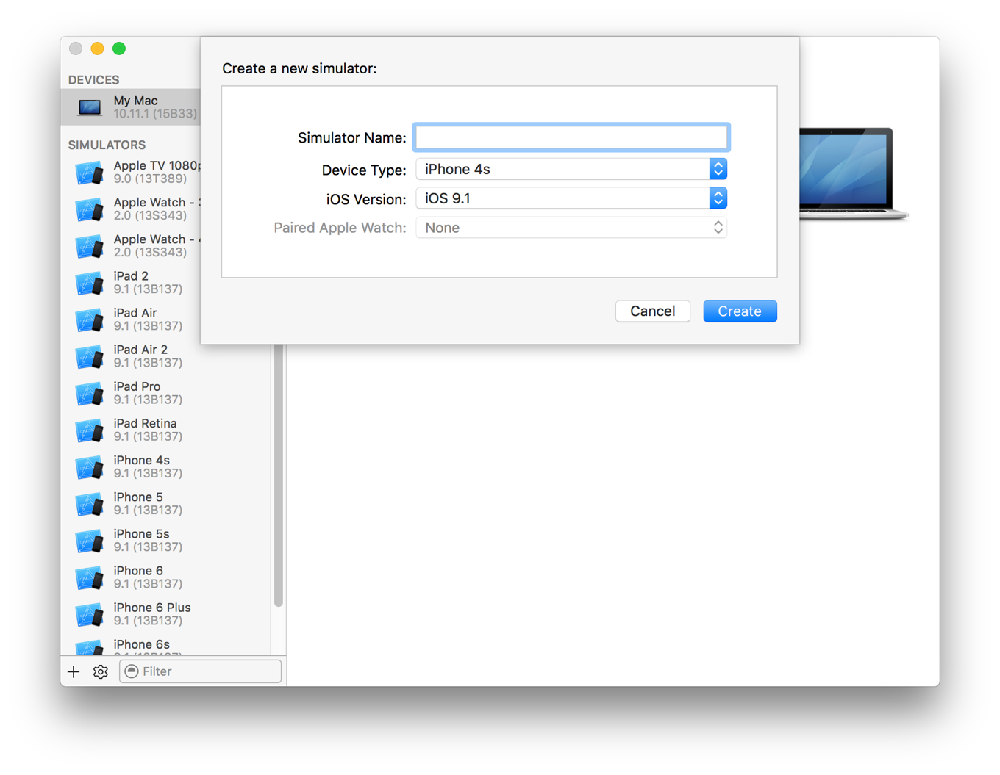

> 导航：[总目录](../../../README.md) · [documentation](../../../_indexes/documentation.md) · [Simulator User Guide](About%20Simulator.md)

[Next](Interacting%20with%20Simulator.md)[Previous](About%20Simulator.md)

# Getting Started in Simulator

Simulator app, available within Xcode, presents the iPhone, iPad, or Apple Watch user interface in a window on your Mac computer. You interact with Simulator by using the keyboard and the mouse to emulate taps, device rotation, and other user actions.

The chapter presents the basics of using Simulator. You can perform these steps using your own iOS app or, if you do not have an app to use, with the _HelloWorld_ sample code. For more detailed information on interacting with Simulator and using it to test and debug your apps, refer to the later chapters in this guide.

There are two different ways to access Simulator through Xcode. The first way is to run your app in Simulator, and the second way is to launch Simulator without running an app.

When testing an app in Simulator, it is easiest to launch and run your app in Simulator directly from your Xcode project. To run your app in Simulator, choose an iOS simulator—for example, iPhone 6 Plus, iPad Air, or iPhone 6 + Apple Watch - 38mm—from the Xcode scheme pop-up menu, and click Run. Xcode builds your project and then launches the most recent version of your app running in Simulator on your Mac screen, as shown in Figure 1-1.

__Figure 1-1__  Simulated iPhone running the HelloWorld app

!

To run your WatckKit app, choose a combination of an iOS device and watchOS device from the Xcode scheme pop-up menu. For example, to run the watch app in a 38mm watch paired with an iPhone 6, choose "iPhone 6 + Apple Watch - 38mm" from the scheme pop-up menu.

Running the WatchKit target launches two simulators, one for the iOS device and one for the watchOS device. Figure 1-2 shows an iPhone 6 and a 42mm watch running in two different simulators.

__Figure 1-2__  Simulated iPhone and watch

!

To run your tvOS App, choose a tvOS device from the Xcode scheme pop-up menu. Running the tvOS target launches the most recent version of your app in a simulated new Apple TV device, as shown in Figure 1-3.

__Figure 1-3__  Simulating tvOS

!!

At times, you may want to launch Simulator without running an app. This approach is helpful if you want to test how your app launches from the Home screen of a device or if you want to test a web app in Safari on a simulated iOS device.

__To launch a Simulator without running an app__

1. Launch Xcode.
2. Do one of the following:

   - Choose Xcode > Open Developer Tool > Simulator.
   - Control-click the Xcode icon in the Dock, and from the shortcut menu, choose Open Developer Tool > Simulator.

__To launch a watchOS Simulator without running an app__

1. Launch Xcode.
2. Do one of the following:

   - Choose Xcode > Open Developer Tool > Simulator (watchOS).
   - Control-click the Xcode icon in the Dock, and from the shortcut menu, choose Open Developer Tool > Simulator (watchOS).

Simulator opens and displays the Home screen of whichever simulated device was last used.

From the Home screen, you have access to all of the apps that are installed in the simulation environment. There are two ways to access the Home screen in Simulator from your app:

- Press Command-Shift-H.
- Choose Hardware > Home.

Use the installed apps to test your app’s interaction with them. For example, if you are testing a game, you can use Simulator to ensure that the game is using Game Center correctly.

Much like the Home screen on an iOS device, the simulator’s iOS Home screen has multiple pages. After clicking the Home button (or accessing the Home screen through the Hardware menu), you arrive at the second page of the Home screen. To get to the first page, where all of the preinstalled apps are found, swipe to the first Home screen by dragging to the right on the simulator screen.

On the Home screen, you see that all of the apps that have been preloaded into Simulator. See iOS Device Home Screen.

__Figure 1-4__  Home screen for a simulated iOS device

!

The apps that you see on the Home screen are specific to the iOS device simulation environment. Because Passbook and the Health app are available only for the iPhone, these apps don’t appear if you are simulating a legacy device or an unsupported device type.

The Home screen for a simulated watchOS device behaves the same as it would on an actual device. You can click and drag to simulate the finger dragging around the screen and launch an app by clicking on it. Figure 1-4 shows the home screen of a 42mm watch with a developer app, the Lister sample code.

__Figure 1-5__  Home screen for a simulated watchOS device

!

From the Home screen, you can access Safari within Simulator. Use Safari to test your iOS web apps directly on your Mac.

1. From the Home screen, click Safari.
2. In the address field in Safari, type the URL of your web app and press the Return key.

If your Mac is connected to the Internet, it displays the mobile version of the URL you specified. For example, type `apple.com` into the address field and press Return. Safari displays the Apple website. See Figure 1-6.

__Figure 1-6__  The Apple website running in Safari in Simulator

!

Simulator provides tools to assist you in debugging your apps. One of the many features you can debug in Simulator is location awareness within your app. Set a location by choosing Debug > Location > _location of choice_. The menu has items to simulate a static location or following a route.

A simulated watchOS device with the location set to None checks the paired iPhone device for the location.

You can specify your own location, which can be seen in the Maps app.

1. From the Home screen, click Maps.
2. Choose Debug > Location > Custom Location.
3. In the window that appears, type the number `40.75` in the latitude field and the number `-73.75` in the longitude field.
4. Click OK.
5. Click the Current Location button in the bottom-left corner of the simulated device screen.

After completing this task, notice that the blue dot representing your location is in New York, NY, near the Long Island Expressway, as shown in Figure 1-7.

__Figure 1-7__  Running Maps and simulating a latitude and longitude in Simulator

!

Simulator provides the ability to simulate many different combinations of device type and OS version. A _device type_ is a model of iPhone, iPad, or Apple TV. Some iPhone devices can also have a paired Apple Watch. Each device-OS combination has its own simulation environment with its own settings and apps. Simulator provides simulators for common device-iOS, device-watchOS-iOS device, and device-tvOS combinations. You can also add simulators for a specific combination you want to test. However, not all device type and OS version combinations are available.

You can switch between different device-OS combinations. Switching closes the window for the existing device and then opens a new window with the selected device. The existing device goes through a normal OS shutdown sequence, though the timeout might be longer than the one on a real device. The new device goes through a normal OS startup sequence.

__To change the simulated device__

1. Choose a Hardware > Device > _device of choice_.

   Simulator closes the active device window and opens a new window with the selected device.

If the device type and OS version combination you want to use is not in the Device submenu, create a simulator for it.

__To add a simulator__

1. Choose Hardware > Device > Manage Devices.

   Xcode opens the Devices window.
2. At the bottom of the left column, click the Add button (+).
3. In the dialog that appears, enter a name in the Simulator Name text field and choose the device from the Device Type pop-up menu.

   
4. Choose the OS version from the iOS Version pop-up menu.

   Alternatively, if the iOS version you want to use isn’t in the iOS Version pop-up menu, choose “Download more simulators” and follow the steps to download a simulator.
5. Click Create.

If the OS version you want to use is not installed, download it and follow the steps to add a simulator again.

__To download a simulator__

1. In Xcode, choose Xcode > Preferences.
2. In the Preferences window, click Downloads.
3. In Components, find the legacy simulator version you want to add, and click the Install button.

You can also delete and rename simulators in the Devices window.

__To delete a simulator__

1. In Simulator, choose Hardware > Device > Manage Devices, or in Xcode, choose Window > Devices.

   Xcode opens the Devices window.
2. In the left column, select the simulator.
3. At the bottom of the left column, click the Action button (the gear next to the Add button).
4. Choose Delete from the Action menu.
5. In the dialog that appears, click Delete.

To rename a simulator, choose Rename from the Action menu and enter a new name.

For how to manage real devices that appear in the Devices window, read [Devices Window Help](http://help.apple.com/xcode).

You can alter the settings within Simulator to help test your app.

On a simulated device, use the Settings app. To open the Settings app, go to the Home screen and click or on tvOS, choose Settings. In Figure 1-8 you see the Settings app as it appears when launched in the iOS simulation environment.

__Figure 1-8__  Example of the Settings app in a simulated iPad device

!

The Simulator settings differ from the settings found on a hardware device. Simulator is designed for testing your apps, whereas a hardware device is designed for use. Because Simulator is designed for testing apps, its settings are naturally focused on testing, too. For example, in a simulated iOS device the Accessibility menu provides the ability to turn on the Accessibility Inspector, and the Accessibility menu on a device allows you to turn on and off different accessibility features.

Through the settings, you can test both accessibility and localization of your app. See [Testing and Debugging in iOS Simulator](Testing%20and%20Debugging%20in%20Simulator.md#apple-f4xwc4dqnrsv64tfmyxwi33df52wszbpkridimbqgezdqnbyfvbuqnbnknltc) for information on how to manipulate your settings for the various types of testing you are interested in.

You can use Simulator to manipulate the simulated device much as you do a physical device.

To rotate your simulated device, choose Hardware > Rotate Left. When you rotate your simulated device, Settings rotates (see Figure 1-9), just as it would on a hardware device.

__Figure 1-9__  A rotated simulated iPad running in the iOS simulation environment

!

Simulator is designed to assist you in designing, rapidly prototyping, and testing your app, but it should never serve as your sole platform for testing. One reason is that not all apps are available in the simulator. For example, the Camera app is available only on hardware devices and cannot be replicated in the simulator.

In addition, not all bugs and performance problems can be caught through testing in Simulator alone. You’ll learn more about performance differences in [Testing and Debugging in iOS Simulator](Testing%20and%20Debugging%20in%20Simulator.md#apple-f4xwc4dqnrsv64tfmyxwi33df52wszbpkridimbqgezdqnbyfvbuqnbnknltc). You can also find more information on testing your app on a device in Launching Your App on Devices in _App Distribution Guide_.

Simulator continues running until you quit it. Quitting Xcode will not close Simulator because they are separate applications. Similarly quitting simulator will not close Xcode.

To quit Simulator, choose Simulator > Quit Simulator. The device is shut down, terminating any running apps.

[Next](Interacting%20with%20Simulator.md)[Previous](About%20Simulator.md)

