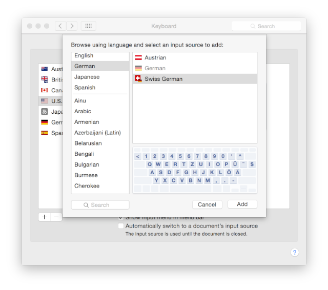
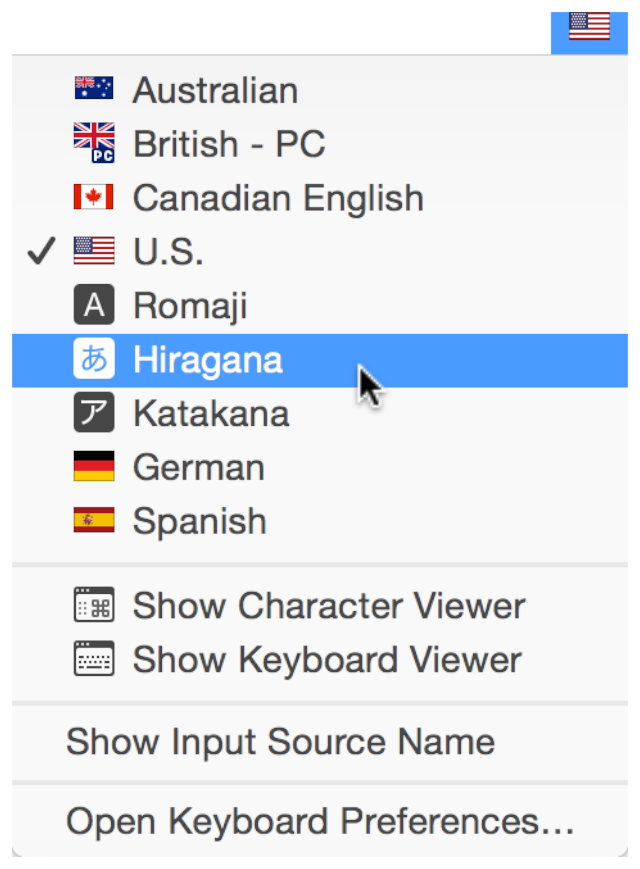
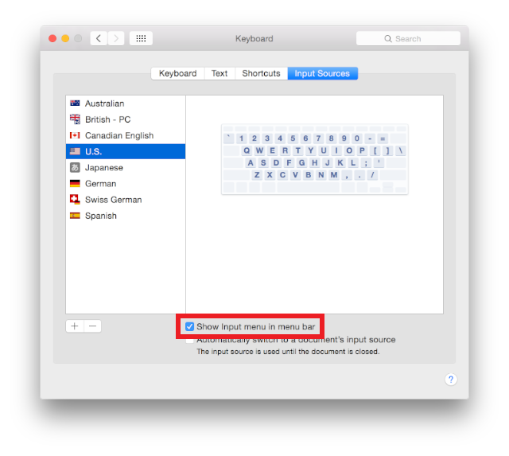

> 导航：[总目录](../../../README.md) · [documentation](../../../_indexes/documentation.md) · [Simulator User Guide](About%20Simulator.md)

[Next](Interacting%20with%20iOS%20and%20watchOS.md)[Previous](Getting%20Started%20in%20Simulator.md)

# Interacting with Simulator

Simulator runs devices from different platforms including iPhone, iPad, iWatch, and Apple TV. Interacting with Simulator differs from interacting with an actual device. This chapter covers ways of interacting that are common to all platforms. Other interactions, such as manipulating the user interface, differ between touch-based devices and Apple TV and are covered in different chapters.

In this chapter you learn how to:

- Use the Mac keyboard for input in multiple languages
- Take a screenshot of the simulated device
- Change the scale of the simulated device

For information on specific ways of interacting with iOS and watchOS devices, see [Interacting with iOS and watchOS](Interacting%20with%20iOS%20and%20watchOS.md#apple-f4xwc4dqnrsv64tfmyxwi33df52wszbpkridimbqgezdqnbyfvbuqobnknltc).

For information on interacting with tvOS, see [Interacting with tvOS](Interacting%20with%20tvOS.md#apple-f4xwc4dqnrsv64tfmyxwi33df52wszbpkridimbqgezdqnbyfvbuqnznknltc).

Simulator can use the keyboard on your Mac as input to the simulated device. For you to most accurately simulate a device in Simulator, the simulator uses iOS keyboard layouts, as opposed to OS X keyboard layouts. If you have chosen Hardware > Keyboard > iOS Uses Same Keyboard Layout As OS X, Simulator automatically selects the keyboard that most closely matches the keyboard layout of your Mac. For most cases, leave this option selected. However, if you do feel a need to disable it—allowing you to select completely different keyboard layouts for your Mac and Simulator—choose Hardware > Keyboard > iOS Uses Same Keyboard Layout As OS X. Choose the same menu item again to enable the option.

__To add a keyboard layout on your Mac__

1. Open System Preferences, and choose the Keyboard preference.
2. Select the Input Sources pane.
3. Press the Add button (+) to show the keyboard layout chooser.
4. Choose the desired keyboard, and press Add. The new keyboard layout is added to the list of available layouts.

   This screenshot shows the keyboard layout chooser with the Swiss German layout selected:

   

__To select a keyboard layout on your Mac__

1. Select the desired keyboard from the Input menu. An example menu is shown below.

   

   If the Input menu item is not in the Mac menu bar, use the following steps to add it:

   1. Open System Preferences and choose the Keyboard preference.
   2. Select the Input Sources pane.
   3. Select “Show Input menu in menu bar,” as shown here:

      

When you build your app for Simulator, Xcode automatically installs it in the selected simulation environment. Each simulation environment emulates a different device. Installing your app in one environment does not install it in any other. It is also possible to have different versions of your app in different environments.

You can also install an app by dragging any previously built app bundle into the simulator window.

In Simulator you can copy a screenshot of the iOS device simulator to your Mac Clipboard or save a screenshot to the desktop. To capture any simulated external display save the screenshot as a file.

- To take a screenshot of the iOS, watchOS, or tvOS device and save it to your Mac Clipboard, choose Edit > Copy Screen.
- To save a screenshot of the iOS, watchOS, or tvOS device and of the external display as files, choose File > Save Screen Shot. A screenshot of each open simulated device is saved to the desktop of your Mac.

You can take a screenshot or record a video of the simulator window using the `xcrun` command-line utility.

1. Launch your app in Simulator.
2. Launch Terminal (located in `/Applications/Utilities`), and enter the appropriate command:

   - To take a screenshot, use the `screenshot` operation:

     `xcrun simctl io booted screenshot`

     You can specify an optional filename at the end of the command.
   - To record a video, use the `recordVideo` operation:

     `xcrun simctl io booted recordVideo <filename>.<extension>`

     To stop recording, press Control-C in Terminal.

   The default location for the created file is the current directory.

   For more information on `simctl`, run this command in Terminal:

   `xcrun simctl help`

   For more information on the `io` subcommand of `simctl`, run this command:

   `xcrun simctl io help`

Even though Simulator runs on all Mac computers, its appearance may differ depending on the model. If the resolution of the simulated device is too large for the simulator window to fit on your screen, scale Simulator by choosing Window > Scale > _percentage of choice_.

[Next](Interacting%20with%20iOS%20and%20watchOS.md)[Previous](Getting%20Started%20in%20Simulator.md)

