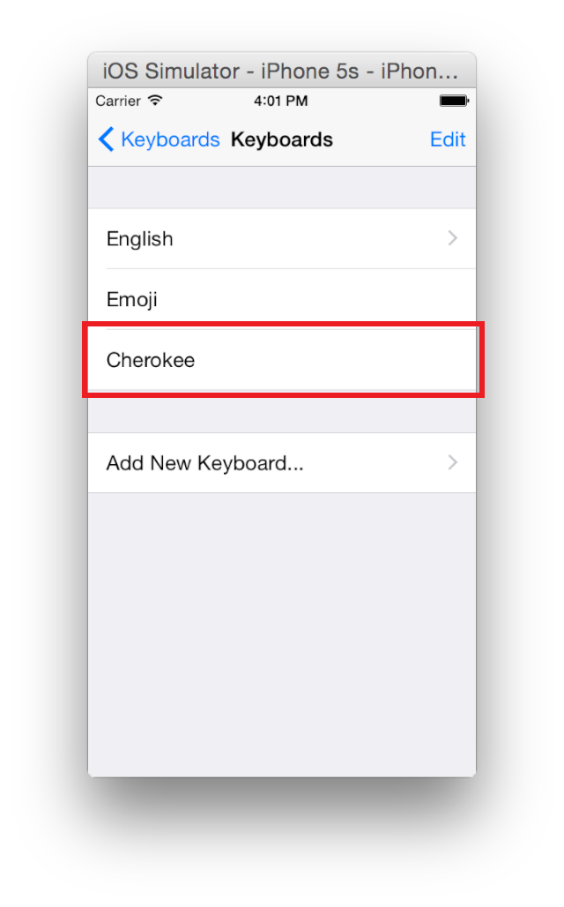
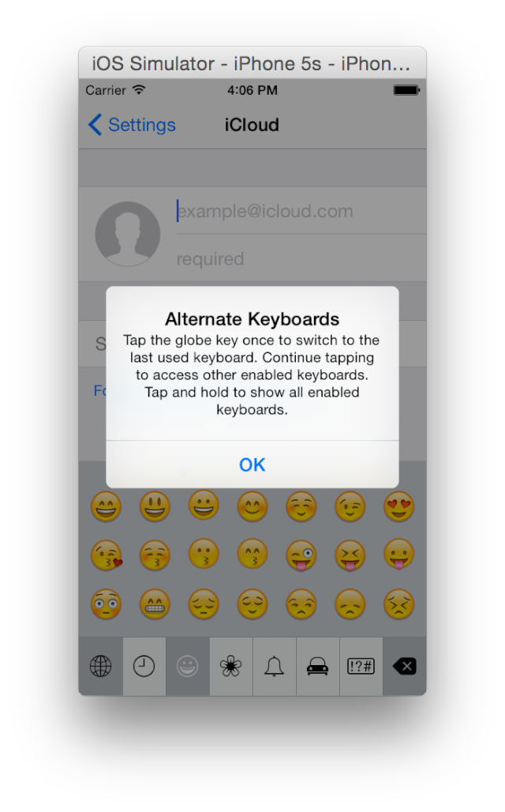
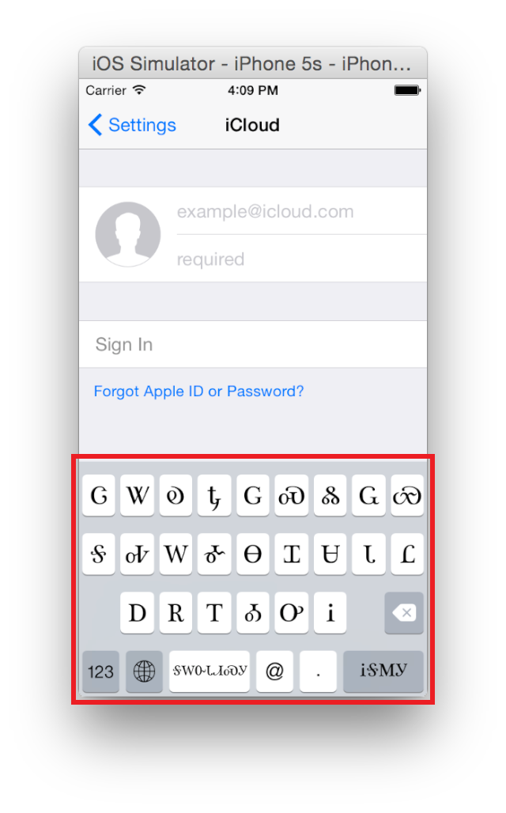
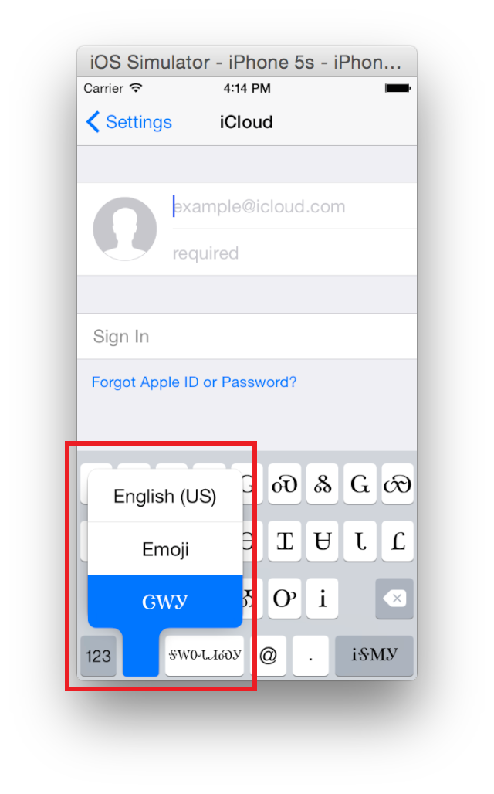
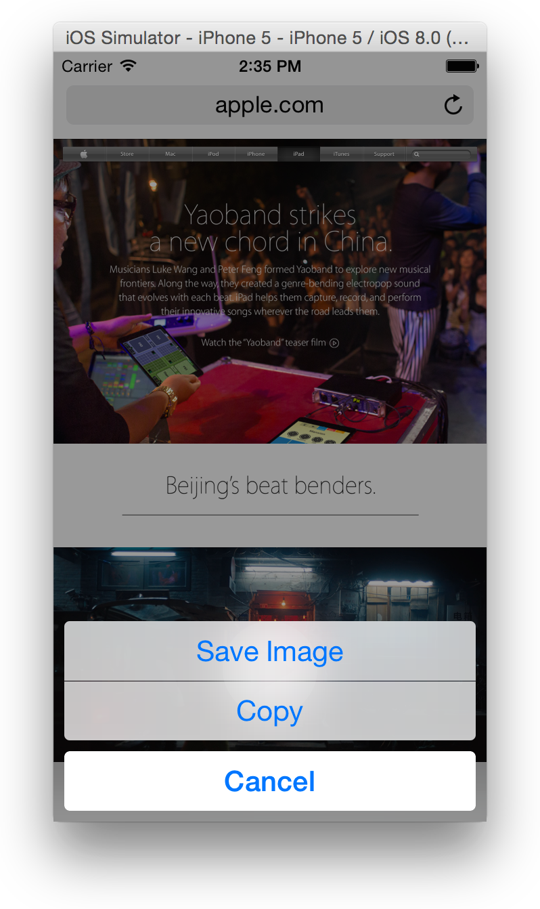
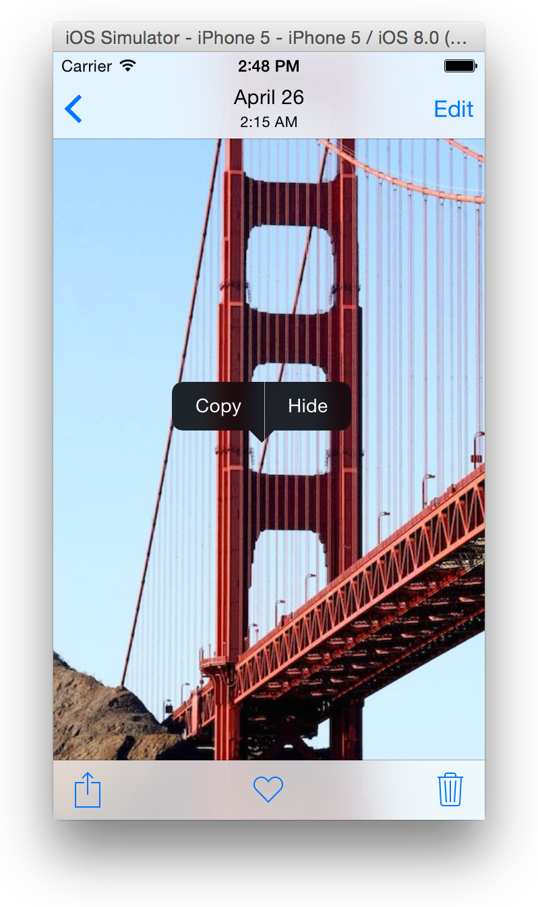
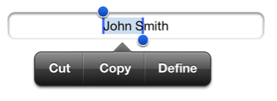

> 导航：[总目录](../../../README.md) · [documentation](../../../_indexes/documentation.md) · [Simulator User Guide](About%20Simulator.md)

[Next](Interacting%20with%20tvOS.md)[Previous](Interacting%20with%20Simulator.md)

# Interacting with iOS and watchOS

Users interact with iOS and watchOS devices using touch. Simulator uses menu choices, the pointing device, and combinations of the two to simulate different interactions.

This chapter covers the ways of interacting with iOS and watchOS devices. In this chapter you learn how to:

- Simulate hardware actions such as rotate, shake, and 3D Touch
- Simulate Multi-Touch gestures using a mouse and keyboard
- Control the watch simulator
- Add paired watches to iOS simulators
- Uninstall an app you previously installed in a simulation environment
- Copy and paste text and images between the simulator and your Mac

For information on ways of interacting that are common to all platforms, see [Interacting with Simulator](Interacting%20with%20Simulator.md#apple-f4xwc4dqnrsv64tfmyxwi33df52wszbpkridimbqgezdqnbyfvbuqmznknltc). For information on interacting with tvOS, see [Interacting with tvOS](Interacting%20with%20tvOS.md#apple-f4xwc4dqnrsv64tfmyxwi33df52wszbpkridimbqgezdqnbyfvbuqnznknltc).

With Simulator, you can simulate most of the actions a user performs on a device. Table 3-1 lists hardware manipulations you can perform in Simulator by using the Hardware menu. Each menu item shows if it works on a simulated iOS device or watchOS device, or both.

__Table 3-1__  Hardware menu items for iOS and watchOS

| Menu item | Hardware action | iOS | watchOS |
| Rotate Left | Rotates the simulator to the left. | ✓ |  |
| Rotate Right | Rotates the simulator to the right. | ✓ |  |
| Shake Gesture | Simulates shaking the device. | ✓ |  |
| Home | Displays the Home screen of the simulated device. | ✓ | ✓ |
| Lock | Displays the Lock screen. | ✓ | ✓ |
| Reboot | Reboots the device. | ✓ | ✓ |
| Touch ID Enrolled | Sets the device to simulate Touch ID. | ✓ |  |
| Simulate Finger Touch | Simulates a matching or nonmatching finger used on the Touch ID sensor. | ✓ |  |
| Use Trackpad Force for 3D Touch | Sets the simulator to use a Force Touch trackpad as input for 3D Touch on supported simulated devices.  For more information on 3D Touch, see _[Adopting 3D Touch on iPhone](https://developer.apple.com/library/archive/documentation/UserExperience/Conceptual/Adopting3DTouchOniPhone/index.html#//apple_ref/doc/uid/TP40016543)_. | ✓ | ✓ |
| Force Touch Pressure | Sets whether simulated touches are shallow or deep presses.  This functionality is deprecated in Xcode version 7.3 or later. |  | ✓ |
| Simulate Memory Warning | Sends the frontmost app a simulated low-memory warning.  For information on how to handle low-memory situations, see [Responding to Low-Memory Warnings in iOS](../../Performance/Memory%20Usage%20Performance%20Guidelines/Tips%20for%20Allocating%20Memory.md#apple-f4xwc4dqnrsv64tfmyxwi33df52wszbpgiydambrha4dclktk4yq). | ✓ | ✓ |
| Toggle In-Call Status Bar | Toggles the status bar between its normal state and its in-call state. This command shows how your app’s user interface looks when a user launches your app during a call or while navigation is running. The in-call state bar is used when a phone call is in progress, a FaceTime call is in progress, or Maps in iOS 6 or later is navigating. The status bar is taller in its in-call state than in its normal state. | ✓ |  |
| Keyboard > iOS Uses Same Layout As OS X | Automatically selects the iOS keyboard that most closely matches the keyboard layout of your Mac. Changing the keyboard layout on your Mac will change the layout on the simulated device. | ✓ |  |
| Keyboard > Connect Hardware Keyboard | Toggles between using the Mac keyboard as input into the simulator. This option simulates using a keyboard dock or a wireless keyboard. | ✓ |  |
| Keyboard > Toggle Software Keyboard | Toggles the presence of the onscreen software keyboard. This option is available only if a hardware keyboard is connected to the device. | ✓ |  |
| External Displays | Opens a window simulating the device’s TV Out signal using the chosen resolution. | ✓ |  |

With Simulator, you can perform traditional Multi-Touch gestures using the mouse and keyboard. Table 3-2 lists gestures you can perform in Simulator. For more information about gestures, see _iOS Human Interface Guidelines_, the "User Trackpad Force for 3D Touch" row in [Table 3-1](#apple-f4xwc4dqnrsv64tfmyxwi33df52wszbpkridimbqgezdqnbyfvbuqobnknlte), and Adding 3D Touch Segues in Storyboard Help.

__Table 3-2__  Performing gestures in Simulator

| Gesture | Desktop action |
| Tap | Click. |
| Touch and hold | Press and hold down the mouse button or trackpad. |
| Double-tap | Double-click. |
| Drag | Drag. |
| Swipe | Drag. |
| Slide Over for the iPad Split View multitasking feature | Drag from the right. |
| Flick | Drag quickly. |
| Two-finger drag | 1. Place the pointer where you want the two-finger drag to occur.  2. Hold down the Option key.  3. Move the circles that represent finger touches to the start position.  4. Move the center of the pinch target by holding down the Shift key, moving the circles to the desired center position, and releasing the Shift key.  5. Hold down the Shift key and the mouse button, move the circles in the direction you want to drag, and release both the Shift key and the mouse button. |
| Pinch | 1. Place the pointer where you want the pinch to occur.  2. Hold down the Option key.  3. Move the circles that represent finger touches to the start position.  4. Move the center of the pinch target by holding down the Shift key, moving the circles to the desired center position, and releasing the Shift key.  5. Hold down the mouse button, move the circles in and out to the end position, and release the Option key. |
| Rotate | 1. Place the pointer where you want the rotation to occur.  2. Hold down the Option key.  3. Move the circles that represent finger touches to the start position.  4. Move the center of the pinch target by holding down the Shift key, moving the circles to the desired center position, and releasing the Shift key.  5. Hold down the mouse button, rotate the circles to the end position, and release the Option key. |

For simulating Touch ID, see [Table 3-1](#apple-f4xwc4dqnrsv64tfmyxwi33df52wszbpkridimbqgezdqnbyfvbuqobnknlte).

With Simulator you can simulate most of the interactions with the Apple Watch using the mouse and keyboard. Table 3-3 lists the simulated interactions you can perform in the watch simulator.

__Table 3-3__  Interacting with the watch simulator

| Interaction | Desktop action |
| Tap | Click. |
| Double-tap | Double-click. |
| Shallow Press | Choose Hardware > Simulate Touch Pressure > Shallow Press. |
| Deep Press | Choose Hardware > Simulate Touch Pressure > Deep Press. |
| Twist the crown clockwise | Drag up in the content window of the watch. |
| Twist the crown counterclockwise | Drag down in the content window of the watch. |
| Twist the crown quickly | Drag quickly. |

In addition to using the keyboard that most closely matches your Mac keyboard layout, you can also manually select a keyboard layout in the Simulator settings. This approach can be helpful if you’re using a keyboard layout that Simulator cannot automatically associate with a keyboard.

__To add a new keyboard for a specific language and region__

1. From the Home screen, open Settings.
2. Choose General > Keyboard > Keyboards > Add New Keyboard.
3. Choose a language and a keyboard layout.
4. Tap Done.

   The new keyboard is now available as soon as the user selects it.

   Here is what the screen looks like after adding a Cherokee keyboard:

   

__To show the new keyboard__

1. Open the keyboard on the simulator.

   This can be done by tapping in any text entry view on the simulated device.
2. Tap the Globe key on the keyboard.

   If the Globe button displays an alert like the one shown here, dismiss the alert.

   
3. Tap the Globe key until the desired keyboard is shown.

   Here is a screenshot of the Cherokee keyboard that was added earlier:

   

   Alternatively, you can tap and hold down the Globe key to see a pop-up menu of keyboards, and select a keyboard from that list.

   The screenshot below shows the list with the Cherokee keyboard selected.

   

Uninstall apps the same way you would on a real device.

__To uninstall apps that you have installed in a simulation environment__

1. Select the simulation environment from which to remove the app by choosing Hardware > Devices > _device of choice_.
2. Place the pointer on the icon of the app you want to uninstall, and then press and hold down the mouse button or trackpad until the icons start to jiggle and a close button appears.
3. To uninstall the app, click the close button on the app icon.
4. In the dialog that appears, click Delete.
5. To stop the icons from jiggling, press Shift-Command-H or choose Hardware > Home.

Simulator provides a variety of copy and paste operations, both within the simulator and between the simulator and your Mac. The actual copy and paste operations in Simulator are performed in the same way that they are on an iOS device, but if you are trying to copy and paste between the simulator and your Mac, additional steps must be taken. Copy and paste operations can be used on strings and images.

If you are copying an image from a webpage in Simulator, save it to the Photos app first.

__To save an image from a webpage to the Photos app__

1. Place the pointer on the image you want to save, and hold down the mouse button or trackpad.
2. When the menu appears, click Save Image to save the image to the Photos app in an iOS simulator.

   

   The image is saved to the Saved Photos album in the Photos app.

Alternatively, you can drag an image from the Finder on your Mac to Simulator, and it is saved to the Saved Photos album.

__To copy an image in Simulator__

1. In the Photos app, open the photo you want to copy.
2. Place the pointer on the image you want to copy, and press and hold down the Command key and the mouse button or trackpad.

   
3. Click Copy.
4. If you intend to paste the image on your Mac outside Simulator, choose Edit > Copy instead.

   This action copies the image to the Mac Clipboard. To paste the image in another app on the Mac, use that app’s Paste command.

__To copy text in Simulator__

1. Click the insertion point to display the selection buttons.

   
2. Click the Select button to select the adjacent word, or click Select All to select all text.
3. Drag the grab points to select more or less text.
4. Click Copy.

   
5. If you are pasting the text on your Mac outside of Simulator, choose Edit > Copy.

   This action copies the text to the Mac Clipboard. To paste the text in another app on the Mac, use that app’s Paste command.

__To paste text into Simulator__

1. If the text you are pasting was copied from your Mac, choose Edit > Paste.

   This action copies the text from the Mac Clipboard to the simulator’s Clipboard.
2. Navigate to the location where you want to paste the text you just copied.
3. Double-click the location where you want to paste the text, and then click Paste.

   

With Simulator, you can simulate iOS devices both with and without Retina displays, regardless of whether you have a Mac with Retina display.

When working on a Mac without a Retina display, the simulator is mapped from pixel to pixel instead of from point to point. When simulating an app for an iOS device with Retina display on a Mac without a Retina display, the simulator appears twice as large as it would for a non-Retina display app to account for the extra pixels in a Retina display.

When working on a Mac with a Retina display, your computer maps each point in the iOS app to a point on the Mac screen. If the simulated app is for an iOS device with a Retina display, each point is composed of 1 pixel. If the app being simulated is for an iOS device without a Retina display, each point is composed of 2 pixels.

To learn more about mapping points to pixels, see [Points Versus Pixels](../../Drawing%20and%20Printing%20Guide%20for%20iOS/iOS%20Drawing%20Concepts.md#apple-f4xwc4dqnrsv64tfmyxwi33df52wszbpkridimbqgeydcnjwfvbuqmjufvjvony).

[Next](Interacting%20with%20tvOS.md)[Previous](Interacting%20with%20Simulator.md)

