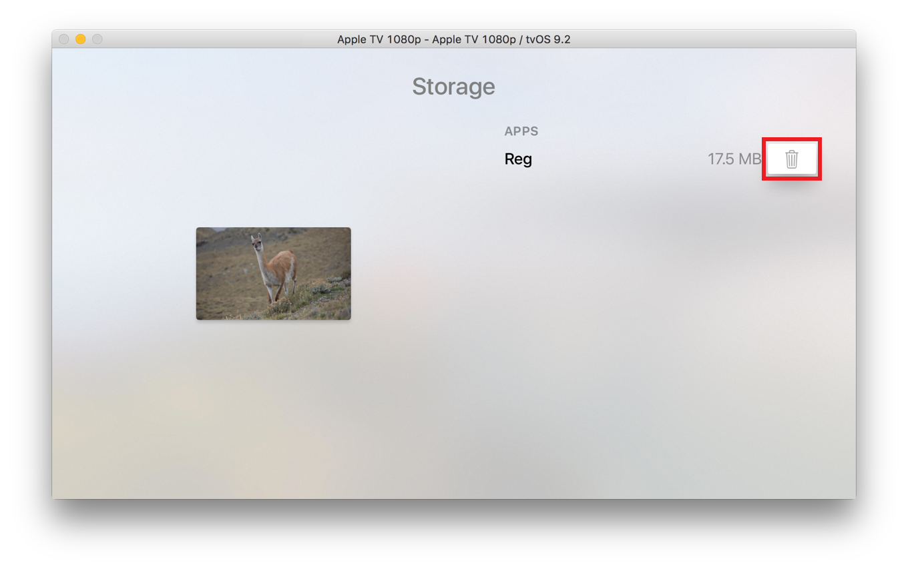

> 导航：[总目录](../../../README.md) · [documentation](../../../_indexes/documentation.md) · [Simulator User Guide](About%20Simulator.md)

[Next](Testing%20and%20Debugging%20in%20Simulator.md)[Previous](Interacting%20with%20iOS%20and%20watchOS.md)

# Interacting with tvOS

User interaction with the new Apple TV is based on a focus model. Users interact with the user interface indirectly using a remote. At any time, only one UI element is the target for any action taken on the remote. That UI element is said to be _in focus_. For example, in Figure 4-1 the button for the Reg app is in focus.

__Figure 4-1__  Apple TV user interface focus

!

When a user makes a gesture on a remote, the system determines how to interact with the interface. For example, pushing on the face of the remote for the TV shown in Figure 4-1 launches the Reg app. Swiping rapidly in a horizontal direction across the face of the remote moves the focus to the next app icon. For more information, see Focus and Selection and Controlling the User Interface on the Screen in the App Programming Guide for tvOS.

This chapter covers various ways of interacting with tvOS devices. In this chapter you'll learn how to:

- Simulate hardware actions such as rebooting
- Interact with the user interface using the keyboard or a simulated Apple TV Remote
- Use a physical Apple TV Remote or MFi Game controller
- Enter text
- Uninstall an app you previously installed in a simulation environment

For information on ways of interacting that are common to all platforms, see [Interacting with Simulator](Interacting%20with%20Simulator.md#apple-f4xwc4dqnrsv64tfmyxwi33df52wszbpkridimbqgezdqnbyfvbuqmznknltc). For information on interacting with iOS and watchOS, see [Interacting with iOS and watchOS](Interacting%20with%20iOS%20and%20watchOS.md#apple-f4xwc4dqnrsv64tfmyxwi33df52wszbpkridimbqgezdqnbyfvbuqobnknltc).

With Simulator, you can simulate most of the actions a user performs on a device. Table 4-1 lists hardware manipulations you can perform on a simulated tvOS device by using the Hardware menu.

__Table 4-1__  Hardware menu tvOS items

| Menu item | Hardware action |
| Home | Displays the Home screen of the simulated device. |
| Reboot | Reboots the device. |
| Show Apple TV Remote | Shows the simulated remote for the Apple TV. |
| Simulate Memory Warning | Sends the frontmost app a simulated low-memory warning.  For information on how to handle low-memory situations, see [Responding to Low-Memory Warnings in iOS](../../Performance/Memory%20Usage%20Performance%20Guidelines/Tips%20for%20Allocating%20Memory.md#apple-f4xwc4dqnrsv64tfmyxwi33df52wszbpgiydambrha4dclktk4yq). |
| Keyboard > iOS Uses Same Layout As OS X | Automatically selects the iOS keyboard that most closely matches the keyboard layout of your Mac. Changing the keyboard layout on your Mac changes the layout on the simulated device. |
| Keyboard > Connect Hardware Keyboard | Toggles between using the Mac keyboard as input into the simulator. This option simulates using a keyboard dock or a wireless keyboard. |

Simulator provides three ways to navigate the Apple TV interface:

- __Keyboard navigation.__ You navigate the Apple TV interface using the Mac keyboard.
- __Simulated remote.__ Simulator provides a simulated Apple TV Remote.
- __Physical remote or MFi game controller.__ Simulator uses a physical remote connected to your Mac over Bluetooth.

Table 4-2 lists the keys used to navigate the Apple TV interface.

__Table 4-2__  Navigation keys for Apple TV

| Key | Action |
| Left arrow | Moves the focus to an eligible view to the left of the current focus. |
| Right arrow | Moves the focus to an eligible view to the right of the current focus. |
| Up arrow | Moves the focus to an eligible view above the current focus. |
| Down arrow | Moves the focus to an eligible view below the current focus. |
| Return | Triggers the action associated with the current element. |
| Escape | Moves up one level in the navigation hierarchy. |

Simulator gives a closer experience of using new Apple TV by simulating the remote.

The simulated remote has two main areas—a touch surface, used for navigation and selection, and a bottom area containing control buttons to trigger actions.

__Figure 4-2__  Simulated Apple TV Remote

!

Open the remote by choosing Hardware > Show Apple TV Remote. You'll see the remote shown in Figure 4-2.

The _touch surface_ is used along with the option key:

- Hold down the Option key while moving the mouse over the area to navigate.
- Click to select the item in focus.
- Click and hold to access contextual menus.

To change focus or to take other scroll-like actions with the simulated remote, hold down the Option key as you move the mouse pointer over the touch surface. Both the direction and speed of motion can impact the resulting behavior. For example, when using the simulated remote with the tvOS text entry screen shown in Figure 4-3, moving the mouse pointer in a slow, small downward motion from the top of the simulated touch surface moves the focus from the _a_ key to the _1_ key. Moving quickly from the top to the bottom of the simulated touch surface shifts the focus to the Done button.

The bottom area has three control buttons. Clicking the mouse in one of the three buttons triggers the associated action:

- __Menu button.__ Moves up one level in the navigation hierarchy.
- __TV button.__ Returns to the main TV menu.
- __Play/Pause button.__ In addition to allowing playing and pausing, this button can trigger actions.

  For example, in a keyboard entry screen such as the one in [Figure 4-3](#apple-f4xwc4dqnrsv64tfmyxwi33df52wszbpkridimbqgezdqnbyfvbuqnznknltcni) the button will cycle through the ABC, abc, and #+- selections of the segmented control.

You can use either an MFi gamecontroller or an Apple TV Remote with a tvOS device in Simulator. Use Bluetooth to pair the remote or controller with the Mac. Simulator recognizes the paired remote. Be sure the game controller is compatible with Apple TV.

__To pair a physical remote or controller with the Mac__

1. Unpair the remote or controller if it is already paired with a device.
2. Turn off the remote or controller.
3. On the Mac, Open Bluetooth in System Preferences.
4. In Bluetooth preferences, turn Bluetooth on if it is off.
5. Turn on the remote or controller.

   Some remotes or controllers may require turning on a pairing mode. For information on a pairing mode for your device, see the documentation for your device.
6. In Bluetooth preferences, wait for the remote to appear in the Devices list and then click the Pair button next to the device to pair the remote with the Mac.

   The remote is now ready to be used with Simulator.

Gamepads can be used to navigate the focus-based interface on tvOS as shown in Table 4-3.

__Table 4-3__  Navigating Apple TV with game controllers

| Control | Action |
| Left joystick | Moves the focus to an eligible view in the direction the joystick is moved. |
| D-pad | Moves the focus to an eligible view in the direction of the arrow press. |
| Button A | Trigger the action associated with the current element. |
| Button B | Move up one level in the navigation hierarchy. |

In addition to controlling the interface, apps can access the game controller using the Game Controller Framework. For more information, see _[Game Controller Programming Guide](../../Game%20Controller%20Programming%20Guide/About%20Game%20Controllers.md#apple-f4xwc4dqnrsv64tfmyxwi33df52wszbpkridimbqgeztenzw)_.

Text entry on tvOS is performed with a text entry keyboard. For example, selecting a text field shows the modal keyboard in Figure 4-3.

The user moves the focus to the first letter of the string they want to enter, selects that letter, and continues until all the letters in the string have been entered. Simulator also enables entering text using the Mac keyboard.

__Figure 4-3__  Text entry on tvOS

!!

__To uninstall apps that you have installed in a tvOS simulation environment__

1. In Simulator, select the simulation environment to remove the app from by choosing Hardware > Devices > _device of choice_.
2. On the simulated device, open the Home screen by choosing Hardware > Home.
3. Open the Settings app.
4. In Settings, choose General > Manage Storage.

   The screenshot shows the storage screen with the focus item set to the Trash for the Reg app.

   
5. Choose the Trash for the desired app.
6. In the confirmation screen that appears, choose Delete.

   The app is deleted.

[Next](Testing%20and%20Debugging%20in%20Simulator.md)[Previous](Interacting%20with%20iOS%20and%20watchOS.md)

