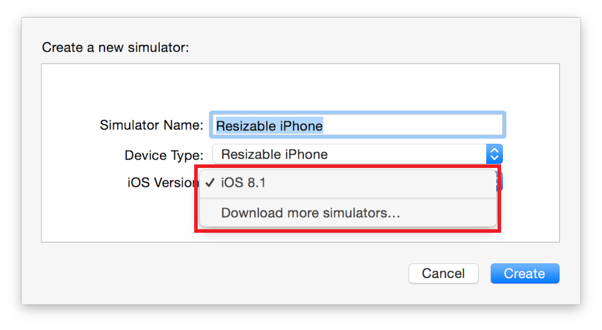
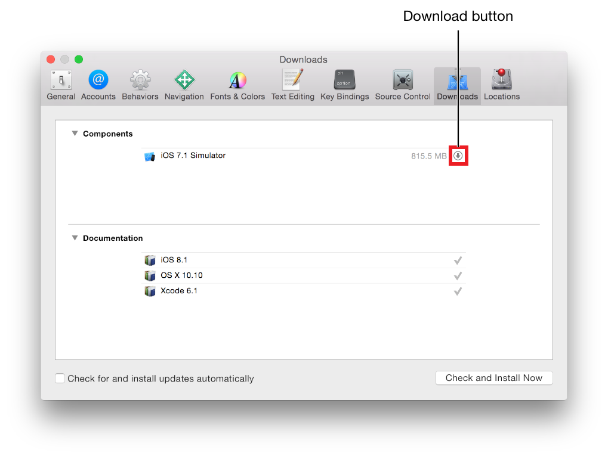
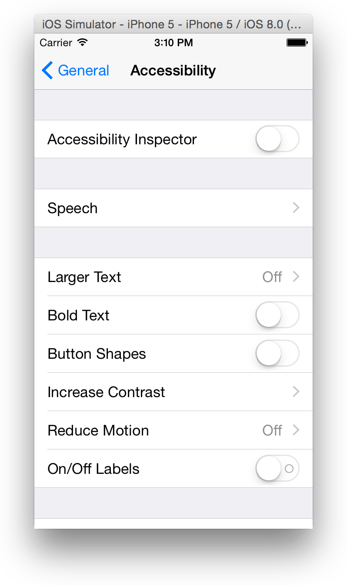
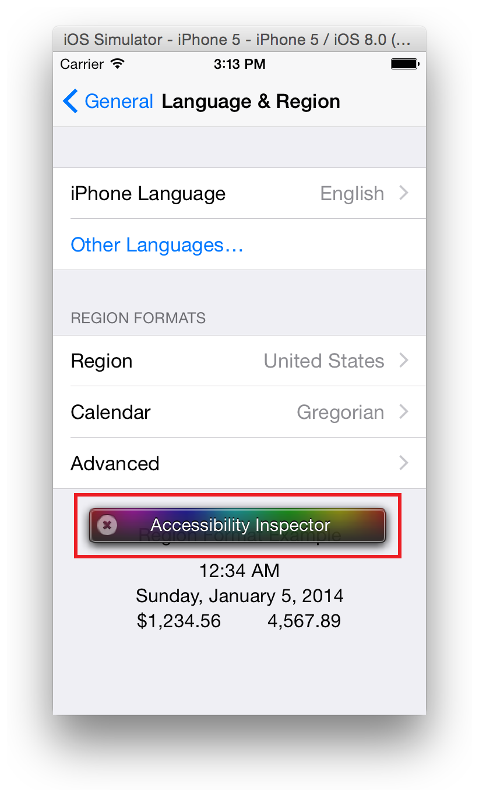

> 导航：[总目录](../../../README.md) · [documentation](../../../_indexes/documentation.md) · [Simulator User Guide](About%20Simulator.md)

[Next](Customizing%20Your%20Simulator%20Experience%20with%20Xcode%20Schemes.md)[Previous](Interacting%20with%20tvOS.md)

# Testing and Debugging in Simulator

Simulator is a great tool for rapid prototyping and development before testing your app on a device. Simulator also has features that can assist you in testing and debugging both iOS apps and web apps. By understanding the tools that Simulator offers, you can more efficiently develop your app.

Simulator is a useful tool, but it should not be the only way you test an app. Because the simulator is an app running on a Mac, it has access to the computer’s resources, including the CPU, memory, and network connection. All of these resources are likely to be faster than those found on a mobile device. As a result, the simulator is not an accurate test of an app’s performance, memory usage, and networking speed. For this same reason, always test the performance of your app’s user interface on a device. In Simulator, your app’s user interface may appear to run both faster and smoother than on a device.

Also keep in mind that some user interface elements can be easier to interact with in Simulator using a mouse than when trying to interact with the app through touch on a device.

Finally, there are some hardware and API differences in Simulator. These differences may affect your app when testing in Simulator.

Though most of the functionality of devices can be simulated in Simulator, some hardware features must be tested directly on a device. The hardware features that are not simulated as of iOS 8.2 are:

- Motion support (accelerometer and gyroscope) are unsupported.
- Audio and video input (camera and microphone) are unsupported.
- Proximity sensor
- Barometer
- Ambient light sensor

Additionally, WatchKit apps have a reliable connection to the simulated host device because they both are running in the Simulator.

To test your app on a device, you must be a member of a Developer Program. To learn more about enrolling in the iOS Developer Program, see Managing Accounts in _App Distribution Guide_.

Simulator includes complete implementations of OpenGL ES 1.1, 2.0, and 3.0 that you can use to start developing your app. The capabilities of Simulator are similar to those of the A7 GPU; for more information on the iOS hardware, see _[iOS Device Compatibility Reference](../../iOS%20Device%20Compatibility%20Reference/Introduction.md#apple-f4xwc4dqnrsv64tfmyxwi33df52wszbpkridimbqgeztkojz)_. Simulator differs from the hardware processor in a few ways:

- Simulator does not use a tile-based deferred renderer.
- Simulator does not provide a pixel-accurate match to the graphics hardware.
- Rendering performance of OpenGL ES in Simulator has no relation to the performance of OpenGL ES on an actual device.

Simulator APIs don’t have all the features that are available on a device. For example, the APIs don’t offer:

- Receiving and sending Apple push notifications
- Privacy alerts for access to Photos, Contacts, Calendar, and Reminders
- The `UIBackgroundModes` key
- Handoff support

In addition, Simulator doesn’t support the following frameworks:

- External Accessory
- IOSurface
- Media Player
- Message UI
- In UIKit, the `UIVideoEditorController` class

The Metal, MetalKit, and Metal Performance Shaders frameworks are provided only as stubs. Calls to functions in these frameworks have no effect.

Simulator does not include backward compatibility with all versions of iOS and watchOS.

__To find a list of the simulated versions of iOS and watchOS in Xcode__

1. Choose Hardware > Device > Manage Devices.

   Xcode opens the Devices window.
2. At the bottom of the left column, click the Add button (+).
3. In the dialog that appears, select the iOS Version pop-up menu.

   The top part of the menu lists any installed versions of iOS.

   

__To download other available versions of simulators__

1. Choose Xcode > Preferences.
2. In the preferences window that appears, click the Downloads tab.
3. To download a simulator for a version of iOS, click the Download button.

   

   After Xcode downloads the new iOS version, it will be available for new device simulators. For information on adding a new device, see [Change the Simulated Device and OS Version](Getting%20Started%20in%20Simulator.md#apple-f4xwc4dqnrsv64tfmyxwi33df52wszbpkridimbqgezdqnbyfvbuqnjnknltcma).

To test apps for the iPad mini in the simulator, run your app on a simulated iPad with the corresponding type of display, either Retina or non-Retina, depending on the iPad mini model.

Use the Accessibility Inspector to test the accessibility of your app. The Accessibility Inspector displays accessibility information about each accessible element in an app. Figure 5-1 shows what the Accessibility Inspector looks like as it runs in Simulator.

__Figure 5-1__  The Accessibility Inspector running in a simulated iPhone

!

__To start the Accessibility Inspector__

1. When Simulator is running, choose Hardware > Home to reveal the Home screen.
2. Click Settings.
3. Choose General > Accessibility.
4. Slide the Accessibility Inspector switch to On.

   

Turning on the Accessibility Inspector in Simulator alters the behavior of the simulator. After the Accessibility Inspector is on, clicking an element moves the focus of the inspector to that element instead of activating it. To activate an element, you must double-click it. Additionally, swiping and dragging gestures are unsupported while the Accessibility Inspector is enabled. To perform these gestures, you must first disable the Accessibility Inspector.

- To disable and reenable the Accessibility Inspector, click the close button in the upper-left corner of the inspector panel (the close button looks like a circle with an “X” in it).

For more information on using the Accessibility Inspector and testing the accessibility of your app, see _[Verifying App Accessibility on iOS](https://developer.apple.com/library/archive/technotes/TestingAccessibilityOfiOSApps/TestingtheAccessibilityofiOSApps/TestingtheAccessibilityofiOSApps.html#//apple_ref/doc/uid/TP40012619)_.

If you have created an app with multiple localizations, you can test them in Simulator by changing the Internationalization settings. To learn how to set the language and region on iOS, read [Reviewing Language and Region Settings on iOS Devices](../../Mac%20OSX/Internationalization%20and%20Localization%20Guide/Reviewing%20Language%20and%20Region%20Settings.md#apple-f4xwc4dqnrsv64tfmyxwi33df52wszbpgeydambqge3tc2jninedcmrnknlte). For more information on localizing your app, read _[Internationalization and Localization Guide](../../Mac%20OSX/Internationalization%20and%20Localization%20Guide/About%20Internationalization%20and%20Localization.md#apple-f4xwc4dqnrsv64tfmyxwi33df52wszbpgeydambqge3tc2i)_.

If you are building a web app and want to test its usability on an iOS device, Simulator can assist you.

__To test a web app in Simulator__

1. Select the simulator environment you would like to test in by choosing Hardware > Device > _device of choice_.
2. Open Safari from the Home screen of Simulator.
3. Navigate to the location of your web app in the browser.

For more information on creating web apps for iOS, see _[Getting Started with iOS Web Apps](../../../referencelibrary/Getting%20Started/Getting%20Started%20with%20iOS%20Web%20Apps.md#apple-f4xwc4dqnrsv64tfmyxwi33df52wszbpkridimbqga4dcmzu)_.

If you are building an app that uses iCloud, you can test iCloud syncing from within Simulator before testing on physical devices. This can also assist you in testing iCloud syncing across many devices if you have a limited number of devices to test on.

To simulate iCloud syncing, first sign in to Simulator using an Apple ID. It is strongly encouraged that you create and use a separate Apple ID specifically for testing iCloud in Simulator.

__To sign in to Simulator with your Apple ID__

1. Launch Simulator with a simulated device running iOS 7.1 or later.
2. From the Home screen, open Settings and select iCloud.
3. Enter your Apple ID and password, and click Sign In.

After signing in with your Apple ID, you can then test your iCloud syncing. To test to see whether your app is syncing properly with iCloud, choose Debug > Trigger iCloud sync.

If you are building an app that receives frequent content updates and you have enabled background fetching, you can test the background-fetch capability using Xcode and Simulator. To simulate a background fetch, launch your app in Simulator and then go to Xcode and choose Debug > Simulate Background Fetch.

You can also configure a scheme to control how Xcode launches your app. To enable your app to be launched directly into a suspended state, choose Product > Scheme > Edit Scheme and select the Background Fetch checkbox.

Access the debugging tools in Simulator through the Debug menu, as shown in Table 5-1.

__Table 5-1__  Performing debugging through the Simulator Debug menu

| Menu item | Debug result |
| Slow Animations | Slows down the animation taking place within the app. Use this item to identify any problems in the animation. |
| Graphics Quality Override | Set the default graphics quality for the device. Choosing Low Quality can improve the performance of certain actions on older simulated devices. For example, dragging down on the Home screen transitions to the Spotlight screen. The high-quality version includes a blur animation, which does not occur in low quality. |
| Optimize Rendering for Window Scale | Selecting this item improves the rendering speed of the screen for scaled simulated devices. The item is useful for large devices such as iPad Pro.  Screenshots are saved at the scaled resolution when this item is active. To save a full-resolution screenshot, temporarily disable this item. |
| Color Blended Layers | Shows blended view layers. Multiple view layers that are drawn on top of each other with blending enabled are highlighted in red, and multiple view layers that are drawn without blending are highlighted in green. To dramatically improve your app’s performance, reduce the amount of red shown for your app when this item is selected. Blended view layers are often the cause of slow table scrolling. |
| Color Copied Images | Places a blue overlay over images that are copied by Core Animation in blue. |
| Color Misaligned Images | Places a magenta overlay over images whose bounds are not aligned to the destination pixels. If there is not a magenta overlay, this item places yellow overlay over images drawn with a scale factor. |
| Color Off Screen Rendered | Places a yellow overlay on content that is rendered offscreen. |
| Location | Allows you to set the Core Location to be used by your app. Choose from the different location settings:   - __None.__ Does not return a location. Use for testing how an app responds when no location data is available. A simulated watchOS device asks the paired iPhone for the location. - __Custom Location.__ Allows use of a custom latitude and longitude. - __Apple.__ Uses the coordinates of the Apple Headquarters. - __City Bicycle Ride.__ Simulates a bike ride in Cupertino, CA. This item simulates the device moving on a predefined route. - __City Run.__ Simulates a run in Cupertino, CA. This item simulates the device moving on a predefined route. - __Freeway Drive.__ Simulates a drive through Cupertino, CA. This item simulates the device moving on a predefined route. |

If your app experiences a problem that causes it to crash, a crash log can help you determine what problem occurred. You open the crash log using Console.

__To view a crash log__

1. Open Console by going to `Applications/Utilities/Console` in the Finder.
2. Look for the line in Console that reads “Saved Crash Report for.”
3. Expand this item using the arrow at the left.
4. Click Open Report.

[Next](Customizing%20Your%20Simulator%20Experience%20with%20Xcode%20Schemes.md)[Previous](Interacting%20with%20tvOS.md)

