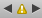
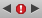
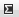

> 导航：[总目录](../../../README.md) · [documentation](../../../_indexes/documentation.md) · [Xcode 4 Transition Guide](About%20the%20Transition%20to%20Xcode%204.md)

[Next](Replacing%20Text%20and%20Refactoring.md)[Previous](Designing%20User%20Interfaces%20in%20Xcode%204.md)

# Debugging and Analyzing Your Code

Xcode 4 provides all the facilities you need to analyze and debug your code in the workspace window. This chapter summarizes those facilities, with an emphasis on differences between Xcode 4 and Xcode 3.

Xcode 4 comes with GDB and LLDB debuggers. To select which one to use, choose Edit Active Scheme from the Scheme pop-up menu ([Figure 3-10](Orientation%20to%20Xcode%204.md#apple-f4xwc4dqnrsv64tfmyxwi33df52wszbpkridimbqga4tsobufvbuqnjnknlti)) and select the Run item in the left column. In the Info pane, choose the debugger you want to use from the Debugger pop-up menu. Figure 5-1 shows the scheme editor open to the Run Info pane.

__Figure 5-1__  Selecting a debugger in the scheme editor

!

LLDB is a debugger that is part of the LLVM open-source compiler project (see the LLVM home page at [http://llvm.org/](http://llvm.org/)). The LLDB debugger is available with Xcode for the first time with Xcode 4. With few exceptions, the user interfaces for debugging are identical for the two debuggers.

Use static analysis to examine the syntax of your code for bugs. The static analyzer in Xcode 4 is similar to the one in Xcode 3. Whereas by default, Xcode 3 opens a separate Build Results window to display the results of the analysis, Xcode 4 lets you perform the analysis, examine the results, and edit your source files all within the workspace window.

To run the static analyzer, select the project you want to analyze in the project navigator and then choose Product > Analyze. (If you want to open the scheme editor to set options first, hold down the Option key while choosing Product > Analyze.) When the analyzer finishes, the issue navigator opens automatically with a list of the issues found. You can click an issue in the issue navigator to open the file in question. The problem is labeled in a blue rectangle marked with an arrow. Click the blue rectangle to see the faulty logic flow found by the analyzer (Figure 5-2).

__Figure 5-2__  Static analysis results

!

As you can see in the figure, an analysis results bar opens below the jump bar. You can open the analysis pop-up menu () on the left to see the various issues found, or cycle through them by clicking the arrows at the right end of the analysis results bar. You can open an issues pop-up menu showing the various files in which problems were found by clicking the issues button at the right end of the jump bar (see the following section, Locate Build Errors), or cycle through the issues by clicking the arrows that bracket the issues button.

To build and run the executable specified by the active scheme, click the Run button at the left end of the toolbar. Other options, such as running without building or building without running, are available in the Product menu. To open the scheme editor before building or running, hold down the Option key while opening the Product menu. Schemes are described in [Select a Scheme](Orientation%20to%20Xcode%204.md#apple-f4xwc4dqnrsv64tfmyxwi33df52wszbpkridimbqga4tsobufvbuqnjnknltenq). See [Customize Executables](Orientation%20to%20Xcode%204.md#apple-f4xwc4dqnrsv64tfmyxwi33df52wszbpkridimbqga4tsobufvbuqnjnknlteny) for information on the scheme editor.

If the compiler finds any problems while building, the issue navigator opens. Select any of the errors or warnings in the list to display in the source editor the line of code where the problem was discovered. You can display problems by file or by type (Figure 5-3).

__Figure 5-3__  The issue navigator

!

You can also use the issues pop-up menu to navigate through the build issues—for example, if you have the navigator pane closed to maximize the size of the source editor (Figure 5-4). The issues menu appears as a yellow triangle if the most serious issue listed is a warning () or as a red octagon if any errors are listed (). Choose an error from the menu or use the arrows to cycle through the errors. If there’s more than one error associated with a line of code, a number appears at the right end of the error description in the source editor. Click the number to display a list of all the errors associated with that line of code.

__Figure 5-4__  The issues pop-up menu

!

As of Xcode 4.1, you can select what kind of content to view when debugging: source only (when available), disassembly only, or source and disassembly. The disassembly is the set of assembly-language instructions seen by the debugger while your program is running. Viewing the disassembly can give you more insight into what your code is doing when it’s stopped at a breakpoint. By viewing the disassembly and source code together, you can more easily relate the instruction being executed with the code you wrote.

To view the disassembly while debugging, choose Product > Debug Workflow > Show Disassembly When Debugging, or open an assistant editor and choose Disassembly from the Assistant pop-up menu in the assistant editor jump bar.

The log navigator in Xcode 4 replaces the Xcode 3 build log window and also shows you the history of your console run and debug sessions. When you select one of the builds in the build log, the results are displayed in the editor area (Figure 5-5).

__Figure 5-5__  The build log

!!

Double-click a warning or error to open the source editor to that error, or open an assistant editor, set it to Referenced Files, and select an issue in the log to see it displayed in the assistant editor.

Click the list icon () at the end of a build command line to see the full build command and results (Figure 5-6).

__Figure 5-6__  The build log with a verbose build command

!

Although you can use the debugger to pause execution of your program at any time and view the state of the running code, it's usually helpful to set breakpoints before running your executable so you can stop at known points and view the values of variables in your source code.

To set breakpoints, open a source-code file and click in the gutter next to the spot where you want execution to stop. When you add a breakpoint to the code, Xcode automatically enables breakpoints, as indicated by the breakpoint-state button in the toolbar (enabled:  disabled: ). You can toggle the enabled state of breakpoints at any time by clicking the breakpoint-state button. You can also disable an individual breakpoint by clicking its icon. To remove a breakpoint completely, drag it out of the gutter.

You can set several options for each breakpoint, such as a condition, the number of times to pass the breakpoint before it’s triggered, or an action to perform when the breakpoint is triggered. To set breakpoint options, open the breakpoint navigator and Control-click the breakpoint for which you want options (Figure 5-7), then choose Edit Breakpoint from the shortcut menu. The Condition field lets you specify an execute condition for the breakpoint. When you specify a condition, the breakpoint is triggered only if the condition (for example, `i == 24`) is true. You can use any variables that are in the current scope for that breakpoint. Note that you must cast any function calls to the appropriate return type.

__Figure 5-7__  Setting breakpoint options

!

In addition to conditional breakpoints, which are triggered when a specific condition is met, you can create exception breakpoints, which are triggered when a specific type of exception is thrown or caught, and symbolic breakpoints, which are triggered when a specific method or function begins execution. To do so, click the Add (+) button at the bottom of the breakpoint navigator and choose Add Exception Breakpoint or Add Symbolic Breakpoint from the pop-up menu.

By default, a new breakpoint is local to the workspace you have open. If you add the project containing that breakpoint to another workspace, the breakpoint is not copied to the new workspace. You can assign breakpoints to other scopes, however. If you move a breakpoint to User scope, it appears in all of your projects and workspaces. If you move a breakpoint to a specific project, then you see this breakpoint whenever you open that project, regardless of which workspace the project is in. To change the scope of a breakpoint, Control-click the breakpoint and choose the scope from the Move Breakpoint To menu item. The scopes of breakpoints are shown in the breakpoint navigator (Figure 5-8).

__Figure 5-8__  Scopes of breakpoints in the breakpoint navigator

!

You can share any breakpoints with other users. To share a breakpoint, in the breakpoint navigator, select the breakpoint you want to share, Control-click the breakpoint, and choose Share Breakpoint from the shortcut menu. Xcode moves shared breakpoints into their own category in the breakpoint navigator.

When you pause execution of your code (see [Control Program Execution](#apple-f4xwc4dqnrsv64tfmyxwi33df52wszbpkridimbqga4tsobufvbuqmznknltima)) or the running code triggers a breakpoint, Xcode opens the debug navigator, displaying the threads that were running when execution paused. Under each thread is the stack at that point in program execution. Select a stack frame to see in the source editor the corresponding source file or disassembled object code.

The slider at the bottom of the debug navigator controls how much stack information the debug navigator displays. At the left end of the slider, the debug navigator shows only the top frame of each stack. At the right end, it shows all stack frames. Click the button at the left end of the slider () to toggle between displaying all the active threads or only threads that have your code in them (as opposed to system library code). Figure 5-9 shows the debug navigator when execution has stopped at a breakpoint.

__Figure 5-9__  The debug navigator stopped at a breakpoint

!

When you execute a program from Xcode 4, the debug bar appears at the bottom of the editor pane (see [Figure 5-9](#apple-f4xwc4dqnrsv64tfmyxwi33df52wszbpkridimbqga4tsobufvbuqmznknlts)). The debug bar includes buttons to:

- Open or close the debug area
- Pause or resume execution of your code
- Step over; that is, execute the current line of code and, if the current line is a routine, return to the next line in the current file
- Step in; that is, execute the current line of code and, if the current line is a routine, jump to the first line of that routine
- Step out of a jumped-to routine; that is, complete the current routine and step to the next routine or back to the calling routine.

Press Control to step by assembly language instruction instead of by statement (the step icons change to show a dot rather than a line under the arrow) or Control-Shift to step only into or over the active thread while holding other threads stopped (the step icons show a dashed rather than solid line under the arrow).

If you pause execution or a breakpoint is triggered, the debug area opens displaying the values of variables and registers, plus the debug console (Figure 5-10). You can use the buttons at the right end of the debug area toolbar to display both the variables and console panes or to hide either one.

__Figure 5-10__  The debug area

!

The variables pane displays variables and registers. You specify which items to display using the pop-up menu in the top-left corner of the variables pane:

- __Auto__ displays only the variables you’re most likely to be interested in, given the current context.
- __Local__ displays local variables.
- __All__ displays all variables and registers.

Use the search field to filter the items displayed in the variables pane.

The console pane displays program output and lets you enter commands to the debugger tool. You specify the type of output the console displays with the pop-up menu in the top-left corner of the console pane:

- __All Output__ displays target and debugger output.
- __Debugger Output__ displays debugger output only.
- __Target Output__ displays target output only.

You can use the navigation pop-up menus in the debug bar to navigate through the threads and stacks (Figure 5-11), or you can use the debug navigator for that purpose.

__Figure 5-11__  Navigating through threads and stacks in the debug bar

!!

While execution is stopped at a breakpoint, you can view variables and step through code in the source editor in much the same way as you can in Xcode 3. For example, to continue execution to a specific line of code, hold the pointer over the gutter next to the target code line until the continue-to-here icon appears, then click the icon (Figure 5-12).

__Figure 5-12__  Activating the continue-to-here command

!

To see the values of variables, click the variable name in the editor (Figure 5-13). Hover over and click variable components to open the disclosure triangles to see the fields of structures.

__Figure 5-13__  Reading the value of a variable in the source editor

!

[Next](Replacing%20Text%20and%20Refactoring.md)[Previous](Designing%20User%20Interfaces%20in%20Xcode%204.md)

