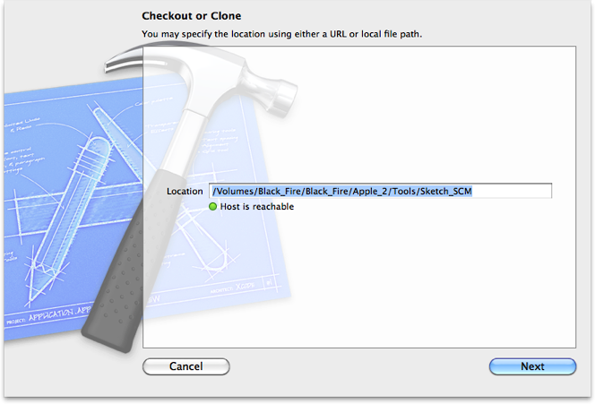
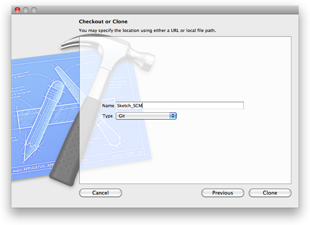
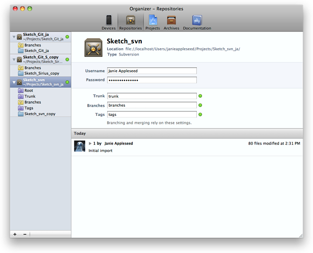
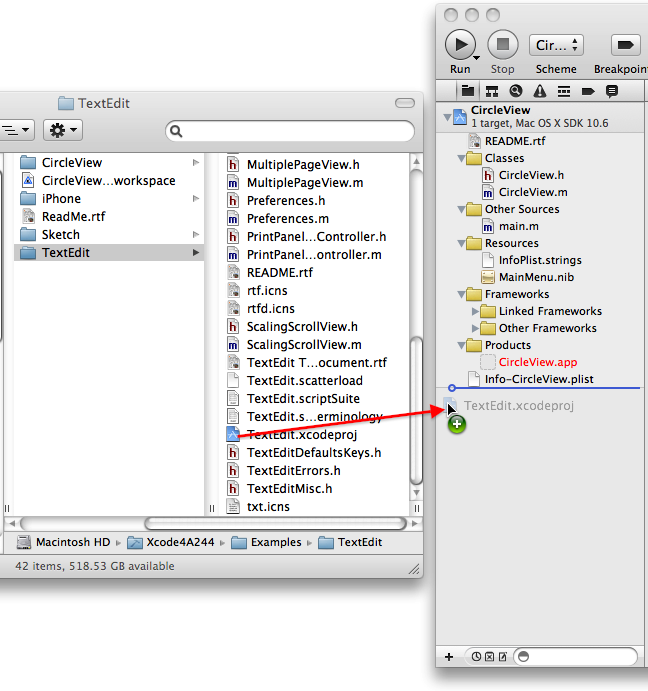

> 导航：[总目录](../../../README.md) · [documentation](../../../_indexes/documentation.md) · [Xcode 4 Transition Guide](About%20the%20Transition%20to%20Xcode%204.md)

[Next](Creating%20a%20New%20Xcode%204%20Project.md)[Previous](About%20the%20Transition%20to%20Xcode%204.md)

# Using an Existing Xcode 3 Project

If you’ve been working in Xcode 3 and have one or more Xcode 3 projects that you’d like to use in Xcode 4, this chapter tells you what you need to know to get started. After you’ve opened your projects, go to [Orientation to Xcode 4](Orientation%20to%20Xcode%204.md#apple-f4xwc4dqnrsv64tfmyxwi33df52wszbpkridimbqga4tsobufvbuqnjnknltc) to learn more about using Xcode 4.

Xcode 4 can open an Xcode 3 [project](https://developer.apple.com/library/archive/featuredarticles/XcodeConcepts/Concept-Projects.html#//apple_ref/doc/uid/TP40009328-CH5) without difficulty. You can open the project in any of the usual ways: Control-click the project and choose Open With Xcode.app (being sure you pick Xcode 4), drag the project onto the Xcode 4 icon, or choose File > Open to open the project. You can have both Xcode 3 and Xcode 4 installed on your system at the same time without conflict.

Xcode 4 reads and builds projects created in Xcode 2.1 through the latest release of Xcode 3. Projects created with Xcode 4 can be opened and built on Xcode 3.2 and later.

You can open a project in either application, save it, then open it in the other application without invalidating the project or losing any data. Changes you make to a project in Xcode 4 remain compatible with earlier versions of Xcode.

Before going any further, you need to get oriented to the Xcode 4 workspace window. Figure 1-1 shows the Xcode 4 window newly opened with an Xcode 3 project.

__Figure 1-1__  A newly opened Xcode 4 window with an Xcode 3 project

!

The left side of the window is the navigation area, opened to the project navigator, which is similar to the Groups & Files list in the Xcode 3 project window. Figure 1-2 shows the contents of an Xcode 3 project as seen in Xcode 4.

__Figure 1-2__  The project contents in the Xcode 4 project navigator

!

What you see in this list is probably less surprising than what you don’t see. Missing from the Xcode 4 project navigator are these groups:

- Targets
- Executables
- Find Results
- Project Symbols
- Bookmarks
- SCM (source control repositories)
- Smart groups

You’ll also notice that the detail view is missing from Xcode 4.

The Xcode 4 equivalents to these groups and user interface elements are described in [Orientation to Xcode 4](Orientation%20to%20Xcode%204.md#apple-f4xwc4dqnrsv64tfmyxwi33df52wszbpkridimbqga4tsobufvbuqnjnknltc).

Xcode 4 provides limited support for Interface Builder 3 plug-ins. Specifically, you can build a project with Interface Builder plug-in dependencies, but you can’t edit the nib files. When you try to open a nib file with plug-in dependencies, Xcode 4 displays a dialog suggesting that you update the file (Figure 1-3). If you agree, Xcode converts the class of custom objects built with plug-ins to the nearest AppKit class. If the conversion isn’t possible, Xcode 4 provides a detailed error message. In that case, you must remove the plug-in dependency using Interface Builder 3 before you can edit the nib file in Xcode 4.

__Figure 1-3__  IB plug-in upgrade dialog

!!

Xcode 4 copies your Xcode 3 settings for the Text Editing, Fonts and Colors, Indentation, and SCM preferences. However, changes you make to these preferences in Xcode 4 are not copied back to Xcode 3.

Xcode 4 ignores your Xcode 3 General, Code Sense, Building, Distributed Builds, Debugging, Key Bindings, File Types, Source Trees, and Documentation preferences. Similar Xcode 4 features start with Xcode 4 defaults. Changing settings in Xcode 4 does not affect your settings for these preferences in Xcode 3.

If your Xcode project is in a Git or Subversion repository, you can check out your project from the repository and open it in Xcode. Use the following procedure to connect to a repository:

1. In the Welcome to Xcode window you see on startup (or when you choose Window > Welcome to Xcode), click Connect to a repository. Alternately, in the Repositories pane of the Organizer window (referred to hereafter as the repositories organizer), click the plus sign (+) at the bottom of the navigator pane and choose Checkout or Clone Repository.
2. In the Checkout or Clone dialog, enter the path to the repository you want to clone or check out.

   
3. Fill in the name you want to use for the repository as displayed in the Organizer window and click Clone (for Git) or Checkout (for Subversion).

   
4. In the Save As dialog, specify the name and location you want to use for the working copy and click Clone (for Git) or Checkout (for Subversion).
5. In the confirmation dialog, click Open to open the new working copy in an Xcode workspace window (for Git) or Show in Finder to see the new working copy in the Finder (Subversion).
6. For Git, you’re done. For Subversion, click on the name of the new repository in the repositories organizer and fill in the paths to the trunk, branches, and tags directores. If your Subversion server requires authentication, fill in the user name and password as well.

   

See [Repositories, Snapshots, and Archives](Repositories%2C%20Snapshots%2C%20and%20Archives.md#apple-f4xwc4dqnrsv64tfmyxwi33df52wszbpkridimbqga4tsobufvbuqnznknltcma) for more information about source control in Xcode 4.

When you open a project, Xcode 4 evaluates it to see whether there are any settings that should be updated. This feature provides an easy way to make sure that your projects conform to the latest SDKs and best practices.

Open the issue navigator (Figure 1-4) to see whether anything in your project needs to be updated. You can also select the project in the project navigator and choose Editor > Check for Outdated Settings, or choose the project from the the drop-down issues menu at the right end of the jump bar.

__Figure 1-4__  Modernization in the issue navigator

!

If the issue navigator lists modernization issues, click the issue to see a dialog that explains the updates that should be made (Figure 1-5). Deselect any checkboxes for settings you don’t want to change, then click Perform Changes to update the project to optimize it for Xcode 4.

__Figure 1-5__  Updates dialog

!!

After you have clicked Perform Changes, whether you choose to make all the changes or not, Xcode does not show the warning again. To rerun the check, select your project in the project navigator and choose Check for Outdated Settings from the Editor menu.

A major new feature of Xcode 4 is the addition of a container for multiple projects that you can use to group Xcode projects and other files that are related. This container is referred to as an [Xcode workspace](https://developer.apple.com/library/archive/featuredarticles/XcodeConcepts/Concept-Workspace.html#//apple_ref/doc/uid/TP40009328-CH7). All the projects in the workspace share the same build directory. Putting your related projects in the same workspace affords you several benefits. For example:

- One project can use the products of another project while building.
- If one project depends on the products of another in the same workspace, Xcode can detect this and automatically build the projects in the correct sequence.
- Because all the files in one project are visible to all the other projects in the workspace, you don’t need to copy shared libraries into each project folder separately.
- Indexing is done across the entire workspace, extending the scope of content-aware features such as code completion and refactoring.

A project can be included in more than one workspace or removed from a workspace without affecting the project. The workspace file itself merely contains pointers to the projects and other files that the workspace includes, plus a minimal amount of data such as [schemes](https://developer.apple.com/library/archive/featuredarticles/XcodeConcepts/Concept-Schemes.html#//apple_ref/doc/uid/TP40009328-CH8) stored in the workspace (see [Select a Scheme](Orientation%20to%20Xcode%204.md#apple-f4xwc4dqnrsv64tfmyxwi33df52wszbpkridimbqga4tsobufvbuqnjnknltenq)). The pointers to the source files, included libraries, build configurations, and other data are stored in the project files.

If you have two or more related projects, use the following procedure to create a workspace and add the projects to it:

1. If Xcode 4 is not open, start it. You can ignore or cancel the startup screen.
2. Choose File > New > New Workspace and name the new workspace.
3. In the New Workspace dialog, specify the location for the workspace file and the name of the workspace. If your projects are in the same directory, it might be convenient to put the workspace file in there as well. To avoid possible confusion with your projects, give the workspace a unique name. Click Save.
4. Drag projects from the project navigator of other Xcode 4 windows or from the Finder to the project navigator of the new workspace. When dragging from the Finder, be sure to drag the project file (<ProjectName>`.xcodeproj`), not the entire project folder. Be careful to drop each new project _below_ the last project, not _in_ another project.

   

If you’ve set up your build configuration with explicit references between your projects, the build will continue to behave as it did before. If you used to build one project and then import the product into the other project before you built it, you can remove the product from the project that imports it, because Xcode 4 discovers such implicit dependencies and builds in the correct sequence. If you don’t want one project to use the product or files in another project that’s in the same workspace, you need to adjust your build settings accordingly. See [Set Build Settings for Each Target](Orientation%20to%20Xcode%204.md#apple-f4xwc4dqnrsv64tfmyxwi33df52wszbpkridimbqga4tsobufvbuqnjnknlteni) for help in finding and understanding the build settings interface in Xcode 4.

Before you build, be sure you’ve created the scheme or schemes you need. See [Select a Scheme](Orientation%20to%20Xcode%204.md#apple-f4xwc4dqnrsv64tfmyxwi33df52wszbpkridimbqga4tsobufvbuqnjnknltenq) and [Customize Executables](Orientation%20to%20Xcode%204.md#apple-f4xwc4dqnrsv64tfmyxwi33df52wszbpkridimbqga4tsobufvbuqnjnknlteny).

[Next](Creating%20a%20New%20Xcode%204%20Project.md)[Previous](About%20the%20Transition%20to%20Xcode%204.md)

