> 导航：[总目录](../../../README.md) · [documentation](../../../_indexes/documentation.md) · [Xcode Server and Continuous Integration Guide](index.md)

## Configure Bots to Perform Continuous Integrations

Bots are processes that Xcode Server runs to perform integrations on the current version of a project in a source code repository. An integration is a single run of a bot. Integrations consist of building, analyzing, testing, and archiving the apps (or other software products) defined in your Xcode projects. With Xcode Server able to access the source code repositories of those projects, you can configure bots to perform continuous integrations on them.

On a development Mac, a _scheme_ is the recipe for building your product. A [scheme](https://developer.apple.com/library/archive/featuredarticles/XcodeConcepts/Concept-Schemes.html#//apple_ref/doc/uid/TP40009328-CH8) contains the targets, source files, and everything else that makes up your product. It also defines what operations are performed by a bot during an integration. To automate an integration, you share its scheme and create a bot to perform integrations using that scheme at the desired time. Bots can be configured to run:

- Every time a change is committed to the repository
- On a regular schedule, such as hourly, daily, or weekly
- When manually initiated

Bots also run integrations automatically whenever you install an updated version of Xcode. These integrations run immediately, prior to running any normally scheduled integrations. Compare these integrations with previous integrations to identify issues that may have been encountered as a result of the upgrade.

### Share Build Schemes

A scheme specifies which targets to build for a project, which build configuration to use, and which executable environment to use when the product is launched. When you create a new iOS or OS X project, Xcode creates a default scheme that includes settings to perform these actions:

- Analyze, which performs static code analysis
- Test, which runs any test cases that you implement
- Archive, which builds an archive of the product that the scheme built

For Xcode Server to perform these actions on a project, you must share the project’s scheme. A _shared scheme_ is one that you publish in a repository, along with the other shared project files.

__To share an Xcode project’s scheme__

1. On your development Mac, check out and open the project that contains the scheme you want to share.
2. Choose Product > Scheme > Manage Schemes.
3. Select the Shared checkbox for the scheme to share, and click Close.

   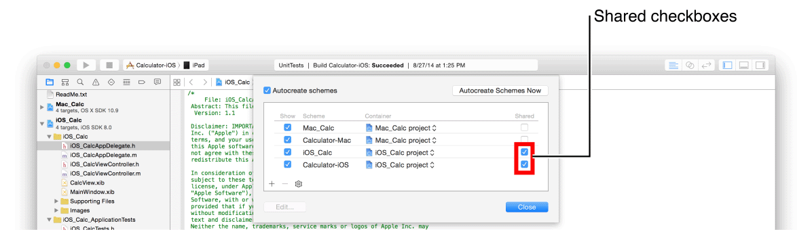
4. Choose Source Control > Commit.
5. Select the Shared Data folder.
6. Enter your commit message in the text field.
7. Select the “Push to remote” option (if your project is managed with Git).
8. Click the “Commit Files and Push” button.

Schemes are an important part of the Xcode build system. For the purposes of using continuous integration, however, the important task is to set the chosen scheme to be shared and checked into the repository for the bot to use. For more information about managing schemes, see [Xcode Help](https://help.apple.com/xcode).

### Create Bots to Perform Integrations

After sharing a scheme, create a bot to perform integrations using the scheme.

__To create a bot__

1. On your development Mac, open the Xcode project containing the scheme that defines the actions to automate.
2. Choose Product > Create Bot, specify a name for the bot, choose a server, and click Next.

   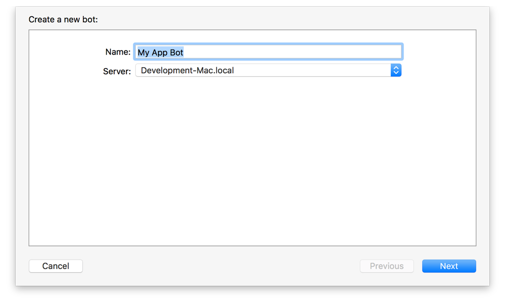
3. Select a repository and click Sign In to provide credentials for your repository. You need to do this even if you’ve added repository credentials in your Xcode preferences because each bot stores its own set of credentials in a secure keychain on the server.

   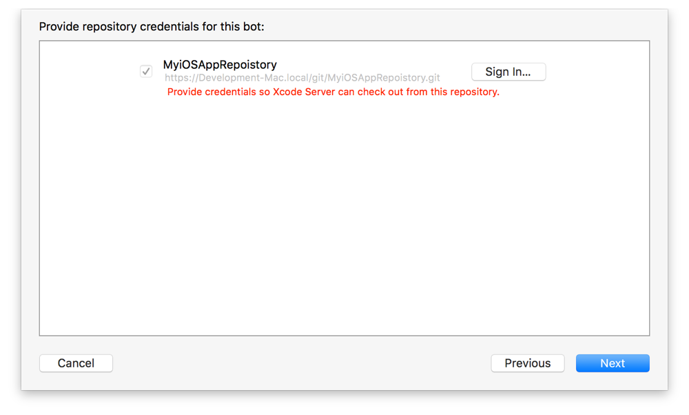

   Enter your authentication credentials when prompted, then click OK.

   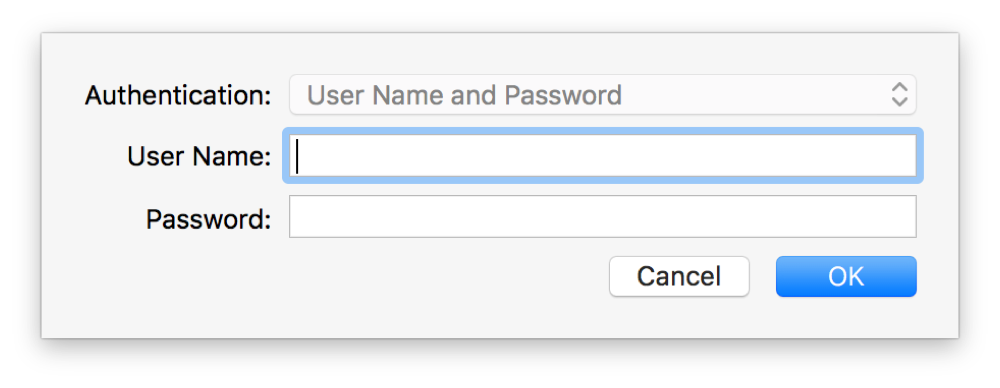
4. Configure the desired attributes for the bot, and click Next.

   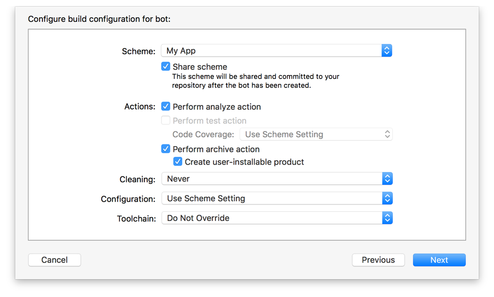
   - Choose a scheme and indicate whether to share the scheme through the project’s source code repository.
   - Specify bot actions by selecting the appropriate checkboxes. You can enable static analysis, testing, and product archiving.
   - Choose whether to clean products before building. When performing a clean integration, the bot won’t reuse the previous build. Use the Cleaning pop-up menu to specify the frequency with which to clean: before each integration, once a day, once a week, or never.
   - If you have alternative toolchains installed in `/Library/Developer/Toolchains/`, such as toolchains downloaded from [Swift.org](http://swift.org/), select a toolchain to use when running integrations. To use the default tools, set the Toolchain pop-up menu to Do Not Override.

   > [!IMPORTANT]
   > 
5. Specify an integration schedule, and click Next.

   You can schedule the bot to perform integrations periodically (hourly, daily, or weekly), on every commit, or manually.

   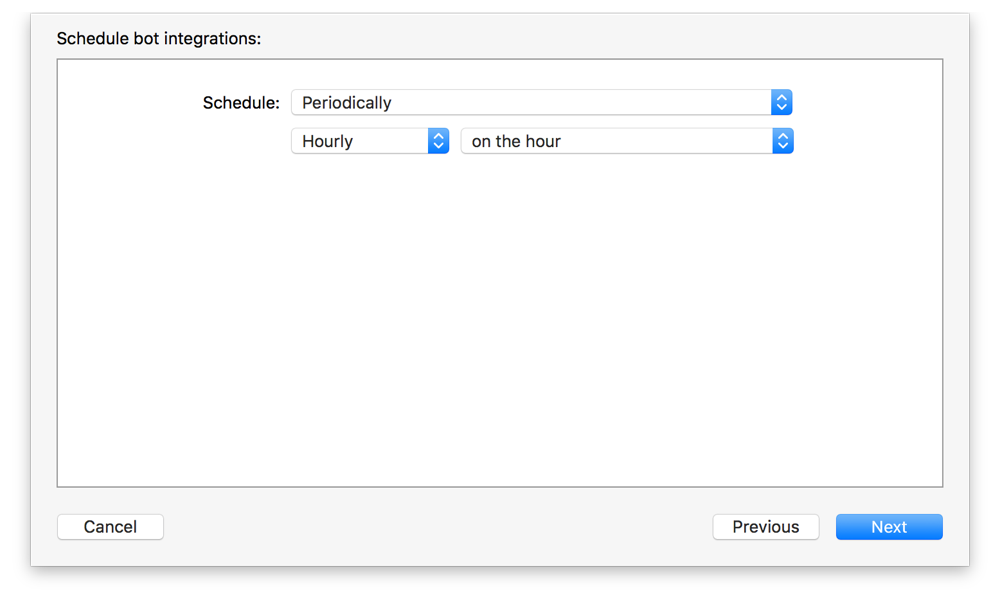
6. For an iOS app, choose what kinds of devices or simulators the bot will be tested on and click Next.

   Any devices you specify must be connected to the server for the test action to complete.

   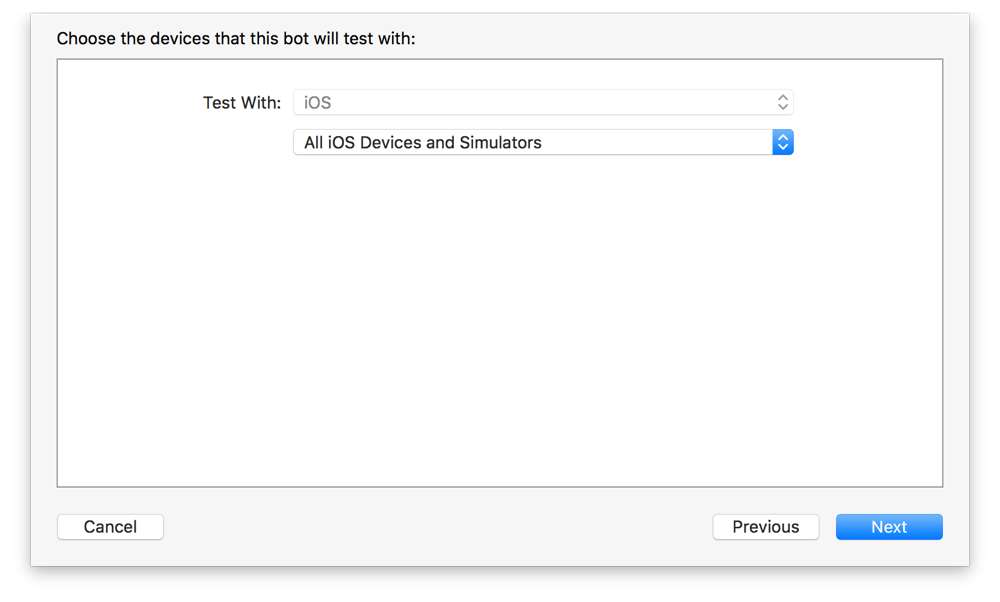
7. Define any environment variables needed by Run Script build phases that execute as part of your integration, or for your pre-integration and post-integration triggers, then click Next.

   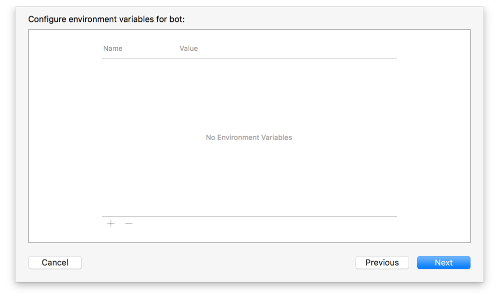

   > [!NOTE]
   > 
8. Bots can be configured to perform actions—known as triggers—before and after integration. A trigger can run custom shell scripts and send email reports.

   - Pre-integration triggers run before an integration. To create a pre-integration script, click the Add button (+) at the bottom of the script pane and choose Pre-Integration Script from the pop-up menu. Enter the desired script into the script pane. This script can reference any environment variables you defined in the previous configuration step. It can also reference Xcode’s built-in environment variables.

     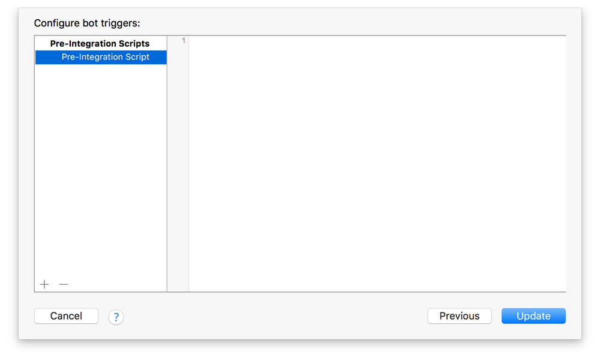
   - Post-integration triggers run after an integration. To create a post-integration script, click the Add button (+) at the bottom of the script pane and choose Post-Integration Script from the pop-up menu. Enter the desired script into the script pane. This script can reference any environment variables you defined in the previous configuration step. It can also reference Xcode’s built-in environment variables. Post-integration triggers may be configured to run conditionally, such as on success, on test failures, on build errors, on build warnings, or on static analysis warnings. Select the appropriate condition checkboxes for your integration.

     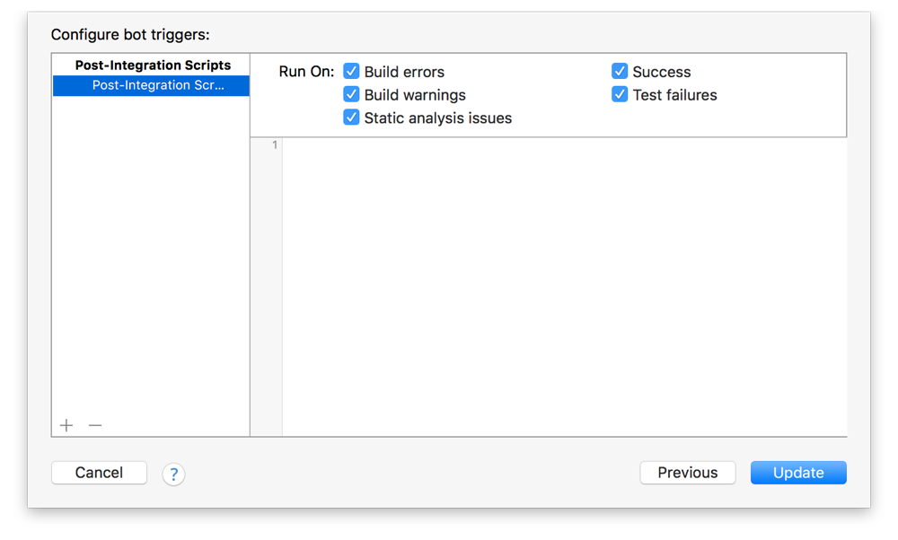
   - Email notification triggers run when new issues occur, after performing an integration, daily, or weekly. To create a post-integration script, click the Add button (+) at the bottom of the script pane and choose Email Notification from the pop-up menu. Specify whether you want notifications for new issues only, or regular summary reports. New issue reports go to the committers. For summary reports, you must specify the recipients. Select the information to include and the conditions under which reports are sent, such as on success, on test failures, on build errors, on build warnings, or on static analysis warnings.

     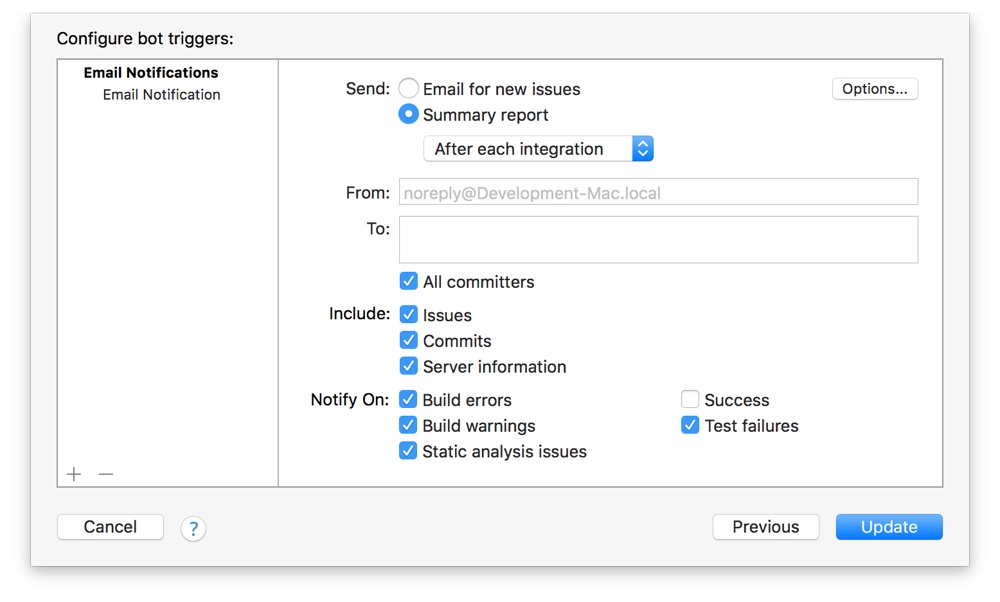

     The following screenshot shows an example of a daily summary report email notification.

     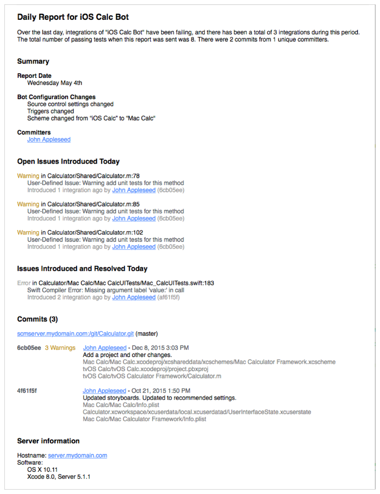
9. Click Create to build the bot.

As explained in [Manage and Monitor Bots from the Report Navigator](view_integration_results.md#apple-f4xwc4dqnrsv64tfmyxwi33df52wszbpkridimbqgezteojsfvbuqnbnknltc), use the report navigator to manually start the bot, edit the bot, and delete it. Use a web browser to monitor the status of your bots, download integration assets, and install iOS products, as discussed in [Monitor Bots from a Web Browser](MonitorBotsandDownloadProductsfromaWebBrowser.md#apple-f4xwc4dqnrsv64tfmyxwi33df52wszbpkridimbqgezteojsfvbuqmjqfvjvomi).

### Follow Best Practices

To take advantage of continuous integration in your product development workflow, follow these guidelines:

- __Develop test suites and test cases.__ After developing tests, include them in schemes for your bots to run. To help ensure that the changes you make aren’t broken by you or others later, complement those changes with tests that determine whether a method or a set of methods used in a sequence functions as intended.
- __Perform static analysis.__ Include static analysis in your integrations. Static analysis is a deep examination of your code, following code paths that your app may not follow during normal development. This process uncovers hard-to-find coding errors and also identifies areas in your code that don’t follow recommended API usage, such as Foundation and AppKit idioms.
- __Conduct performance testing.__ Configure Xcode to run performance tests for your apps on multiple devices. This will allow you to track your performance and identify potential problems up front, before distributing your product to users.
- __Ensure that your product builds and is packaged correctly.__ Archive your product after making major changes, especially structural changes, such as adding or removing files. Let your bots archive for you automatically. The ability to build and archive your product is a main indicator of the correctness of your code changes.

For detailed information on the extensive testing capabilities in Xcode, refer to _[Testing with Xcode](../../Developer%20Tools/Testing%20with%20Xcode/About%20Testing%20with%20Xcode.md#apple-f4xwc4dqnrsv64tfmyxwi33df52wszbpkridimbqge2dcmzs)_.

[Enable Access to Your Source Code Repositories](PublishYourCodetoaSourceRepository.md#apple-f4xwc4dqnrsv64tfmyxwi33df52wszbpkridimbqgezteojsfvbuqobnknltc)

[Xcode Server Environment Variable Reference](EnvironmentVariableReference.md#apple-f4xwc4dqnrsv64tfmyxwi33df52wszbpkridimbqgezteojsfvbuqmjufvjvomi)
