> 导航：[总目录](../../../README.md) · [documentation](../../../_indexes/documentation.md) · [Xcode Server and Continuous Integration Guide](index.md)

## Monitor Bots from a Web Browser

The bots website hosted on your server provides summaries of its bots’ activities, along with details about their integrations. From the bots website, you and your team can view bot activity and download archives and product builds. (Products contain only the app, and archives contain the Xcode project.)

__To specify who can view and use the bots website__

1. In the Services list in the Server app sidebar, select Xcode.

   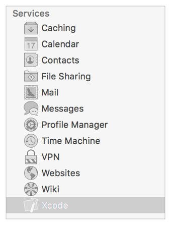
2. In the Xcode pane, click the Settings tab.

   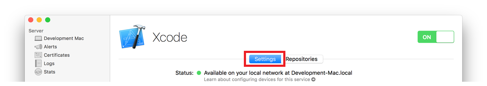
3. Click Edit Permissions.

   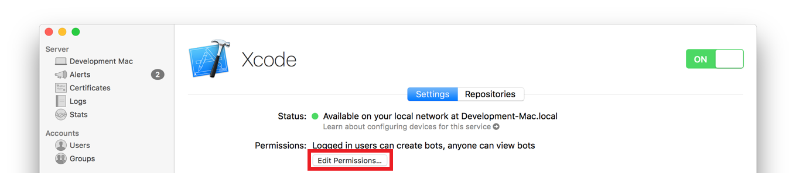
4. In the dialog that appears, specify who can create and view bots and download their archives and products.

   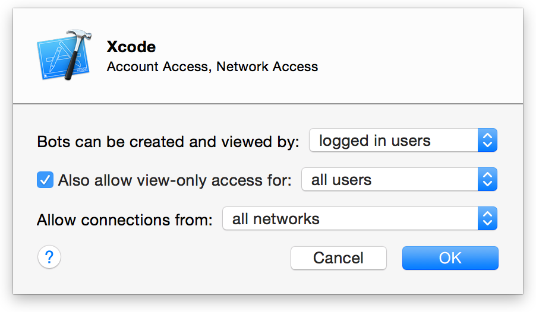
   - If you choose “all users” from the pop-up menu, any visitor to the site can view bots and download items.
   - If you choose “logged in users” or “only some users,” an unauthenticated user sees a bots homepage that has no data. A Log In button in the top-left corner of the webpage allows the user to log in with a valid user name and password. (See [Set Up Xcode Server for Team Members](adopt_continuous_integration.md#apple-f4xwc4dqnrsv64tfmyxwi33df52wszbpkridimbqgezteojsfvbuqmznknltk) for information about creating user accounts on the server.)
   - If you choose “only some users,” you are presented with a table of users and groups. Add and remove users and groups to suit your needs.
5. To allow or restrict view-only access to the website, use the “Also allow view-only access for” and “Allow connections from” pop-up menus.

   Users with view-only access can view the website and initiate integrations, but they can’t create or manage bots. People who particularly benefit from having view-only access to bot activity are software testers, project managers, and seed coordinators.

### View the Bots Website

To view the bots website, navigate to the address _hostname_`/xcode/` in a web browser, where _hostname_ is the Internet domain name for your server (such as `server.mycompany.com`) or its local hostname (such as `server.local`). Depending on the viewing permissions configured in Xcode Server, you may be prompted to log in with your local or Open Directory account credentials.

The bots homepage (Figure 7-1) displays a summarized list of the most recent integrations for the bots running on the server.

__Figure 7-1__A bots website
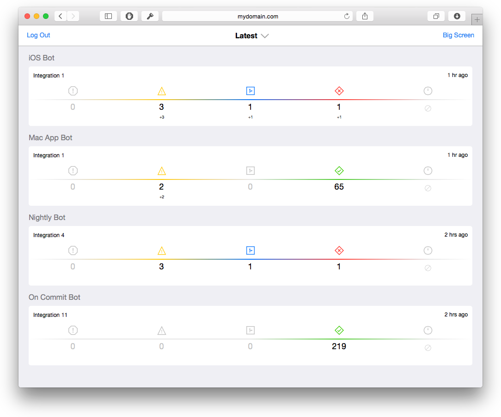

The bots website can also be accessed from the Server app.

__To access the bots website from the OS X Server app__

1. In the Services list in the Server app sidebar, select Xcode.

   
2. In the Xcode pane, click the Settings tab.

   
3. Beneath the Devices table, click the “View bots” button.

   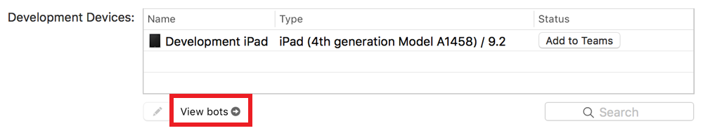

   A web browser opens to the bots website.

You can also access the bots website from the report navigator on your development Mac.

__To access the bots website from the report navigator__

1. In Xcode on your development Mac, choose View > Navigators > Show Report Navigator.

   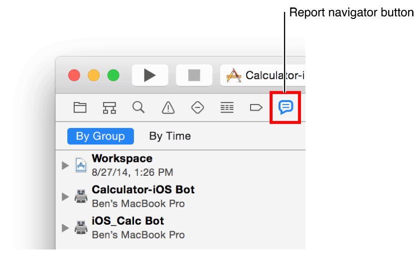
2. Click By Group at the top of the report navigator.

   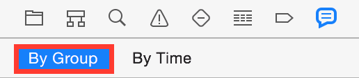

   All integrations for a bot are grouped under the bot name.
3. Control-click a bot in the report navigator, and choose “View Bot in Browser” from the shortcut menu.

   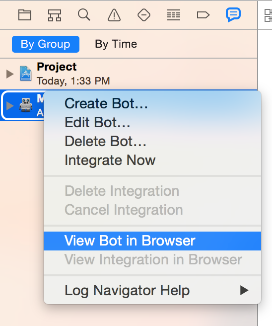

   A web browser opens to the bots website.

__To log out of the bots website__

- Click the Log Out button in the upper-left corner of the bots homepage.

  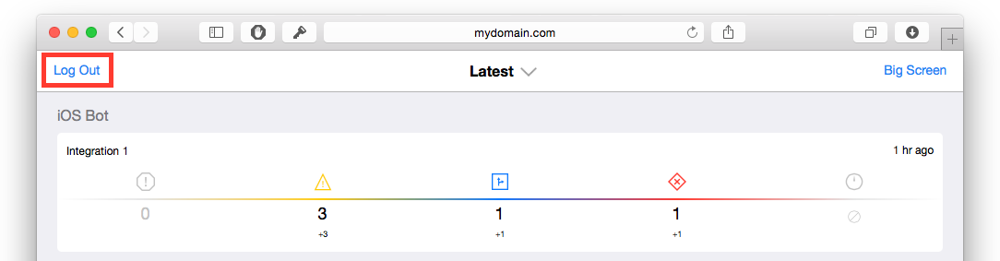

### Monitor Bots from the Bots Website

You can view the most recent integration summary for a bot or integration by tapping or clicking a bot or integration name on the bots homepage.

__To filter the list of bot integrations__

1. Click the filter button in the center of the header of the bots homepage.
2. Choose the desired criteria to filter the list from the filter pop-up menu.

   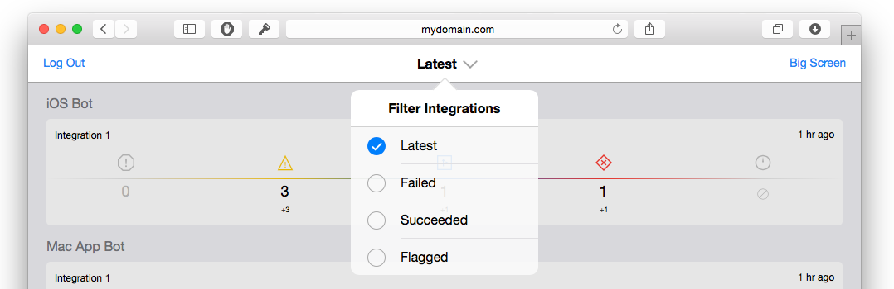
   - _Latest_ displays the most recent complete integrations for each bot.
   - _Failed_ displays the most recent failed integrations for each bot.
   - _Succeeded_ displays the most recent successful integrations for each bot.
   - _Flagged_ displays the most recent flagged integrations for each bot.

   After you make a selection, the title of the bots homepage displays the active filter criteria.

__To view integration results for a bot__

- Click the name of any bot or integration in the list on the bots homepage.

  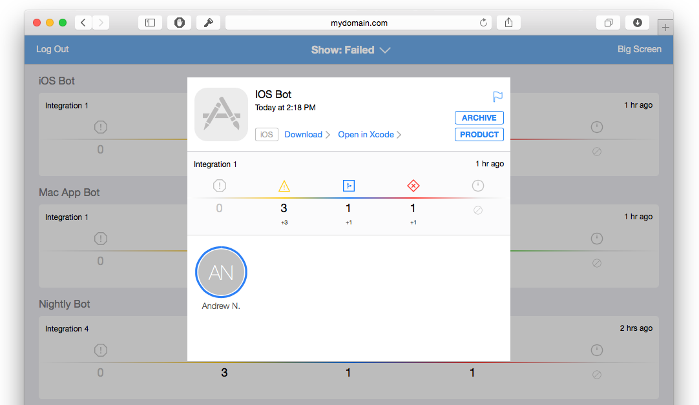

  A summary of the most recent integration performed by the bot, along with commits, is displayed.

  You can click the Flag button to flag a specific integration to identify it, for example, as a release candidate. What the flag means is up to you and your organization.

  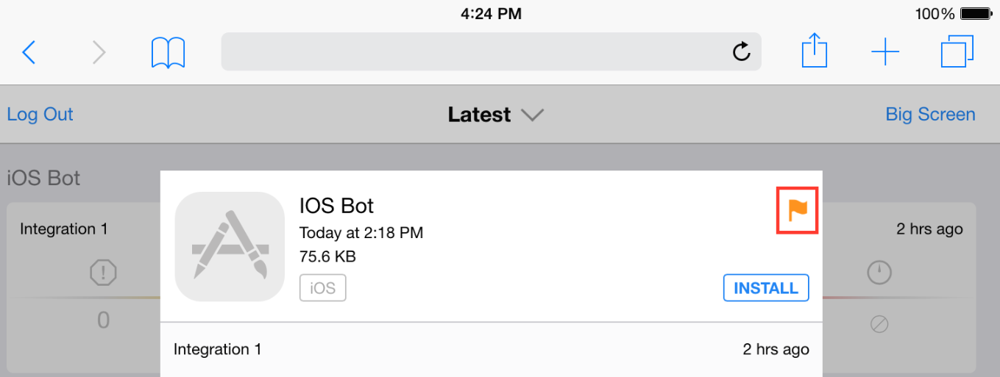

### Open a Bot in Xcode from the Bots Website

The bots website provides a mechanism for quickly opening bots in Xcode on your development Mac.

__To open a bot in Xcode__

1. While viewing the bots website on your development Mac, click the name of any bot or integration in the list on the bots homepage.

   Your browser window displays a summary of the most recent integration performed by the bot.
2. Click the “Open in Xcode” link.

   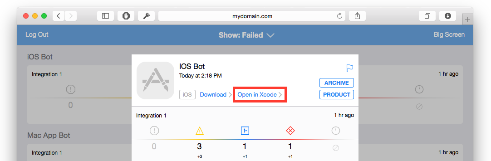

   Xcode opens the bot.

### Download Integration Assets from the Bots Website

The bots website facilitates the distribution of product assets, builds, and archives to testers and other team members, when applicable. Products contain just the app, whereas archives contain the Xcode project.

__To download an integration’s logs and assets in OS X__

1. Click the name of any bot or integration in the list on the bots homepage.

   Your browser window displays a summary of the most recent integration performed by the bot.
2. Click the Download link to download the logs and assets for the integration.

   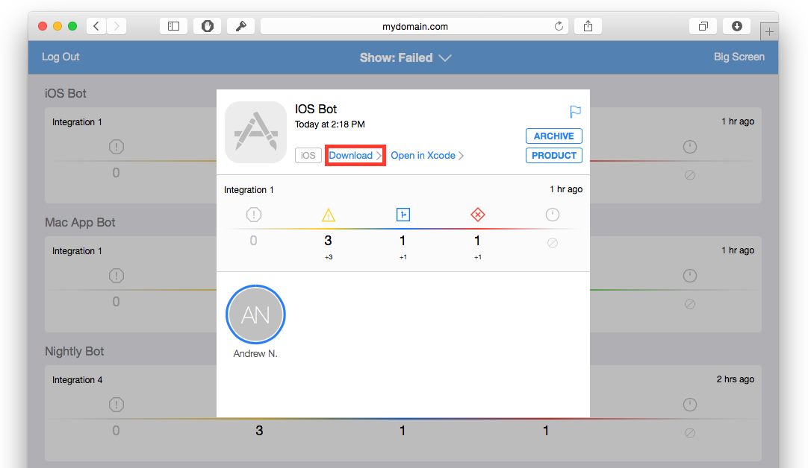

__To download an integration’s archive in OS X__

1. Click the name of any bot or integration in the list on the bots homepage.

   Your browser window displays a summary of the most recent integration performed by the bot.
2. Click the Archive link, if available, to download an archive (the Xcode project) of the product.

   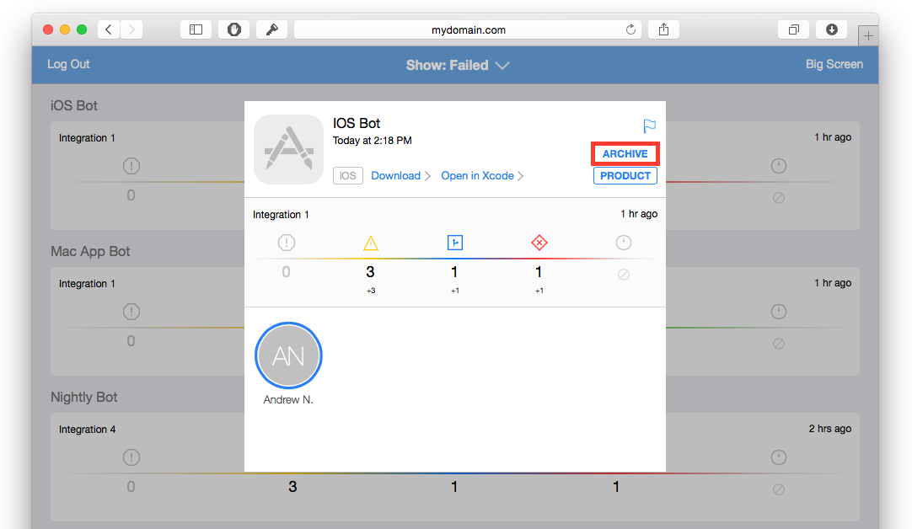

If an integration does not contain an Archive link, an archive does not exist for the integration.

__To download an integration’s product in OS X__

1. Click the name of any bot or integration in the list on the bots homepage.

   Your browser window displays a summary of the most recent integration performed by the bot.
2. Click the Product link, if available, to download the product (the app) for the integration.

   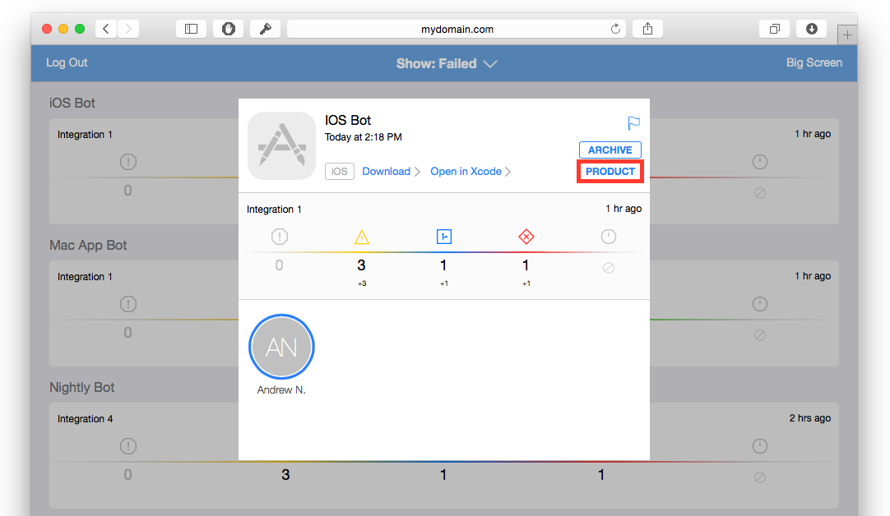

If an integration does not contain a Product link, a product does not exist for the integration.

### Install iOS Products from the Bots Website

For iOS products, the bots website allows a profile necessary for Over-the-Air product installation to be installed for an integration, as well as a product (the app) itself. If a bot is an iOS project and the integration contains a product, a blue or green Install button appears on the integration summary screen. A blue Install button indicates that an Xcode Server Over-the-Air installation profile must be installed, and a green Install button indicates that the product can be installed.

__To install an integration’s Over-the-Air installation profile in iOS__

1. In the list on the bots homepage, tap the name of any bot or integration.

   Your browser window displays a summary of the most recent integration performed by the bot.
2. Tap the blue Install button to install the app for the integration.

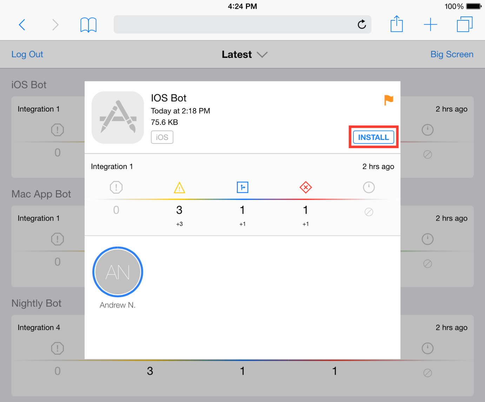

After you have installed the profile, the Install button color changes from blue to green, indicating that the product is now ready for installation.

__To install an integration’s product (app) in iOS__

- After installing the profile for the integration (see above), click the green Install link to install the product.

  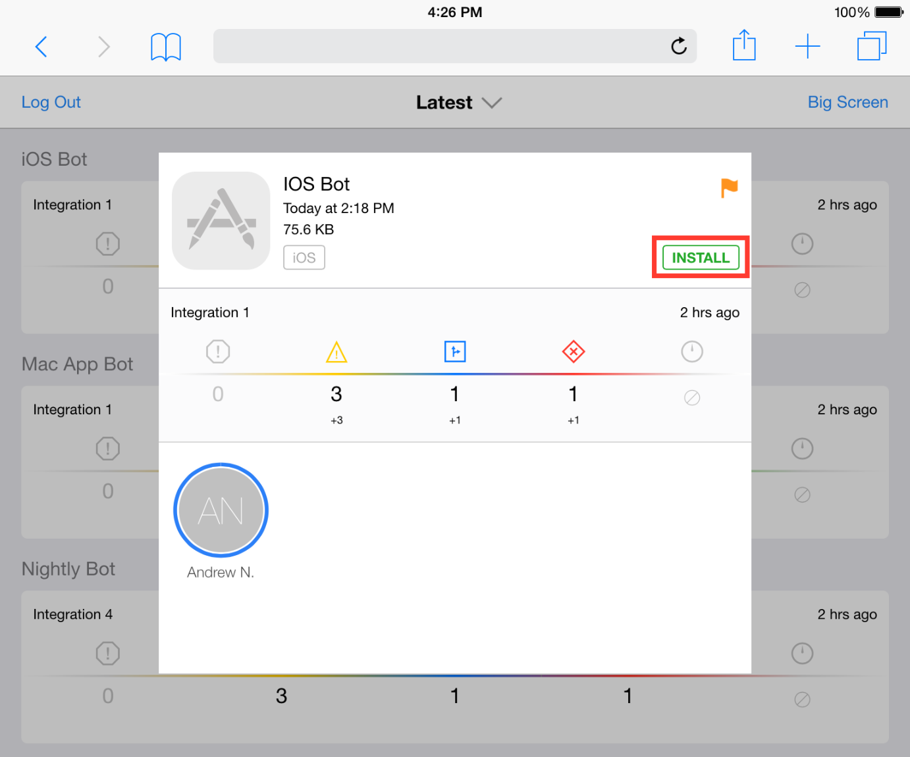

### Watch Your Bots on Big Screen

To keep apprised of your bots’ status on a large or dedicated display, view them on Big Screen.

__To view bots on Big Screen__

Do one of the following:

- Display the Big Screen website—_hostname_`/xcode/bigscreen`, where _hostname_ is the Internet domain name for your server (such as `server.mycompany.com`) or its local hostname (such as `server.local`).
- Click Big Screen in the top-right corner of the bots homepage.

  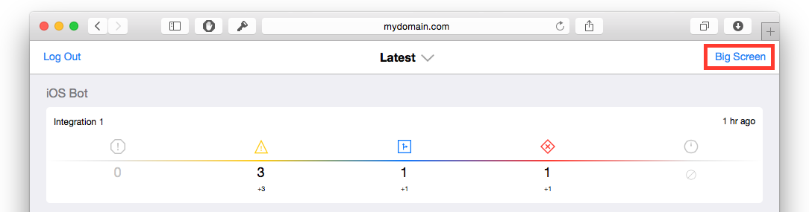

The webpage can be made full screen, and it can be displayed using AirPlay mirroring. Big Screen cycles among all of the server’s bots, displaying the most pertinent status information for each bot. A list of bots and the results of their most recent completed integration are displayed on the left. For the actively cycling bot, the number of errors, warnings, commits, and tests are displayed. Values preceded by a plus (+) or minus (-) sign indicate an increase or decrease from the prior integration.

For a bot’s integration, committer initials are displayed and enclosed within a white circle. This circle indicates the total code contribution for the committer among all commits for the current integration. A colored circle indicates the committer’s code contribution that introduced an issue, if applicable. A red diamond represents errors, a yellow triangle represents warnings, and a blue square represents static analysis issues. See Figure 7-2.

__Figure 7-2__Big Screen for a continuous integration server
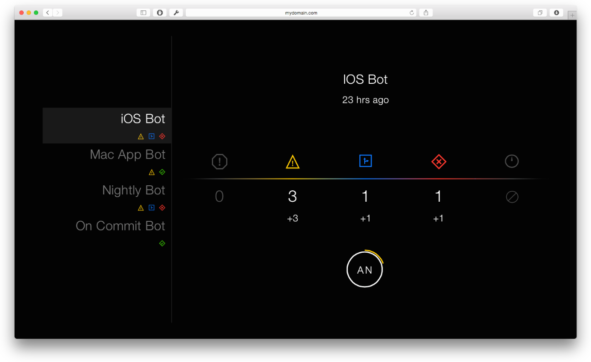

[Manage and Monitor Bots from the Report Navigator](view_integration_results.md#apple-f4xwc4dqnrsv64tfmyxwi33df52wszbpkridimbqgezteojsfvbuqnbnknltc)
