> 导航：[总目录](../../../README.md) · [documentation](../../../_indexes/documentation.md) · [Xcode Server and Continuous Integration Guide](index.md)

## Enable Access to Your Source Code Repositories

Xcode Server operates on projects contained within source code repositories. It supports two popular source control systems: Git and Subversion. Your bots can connect to Git and Subversion repositories hosted on remote servers, or they can connect to repositories that you’ve set up and hosted in OS X Server.

If you haven’t set up Xcode Server yet, see [Install OS X Server and Configure Xcode Server](adopt_continuous_integration.md#apple-f4xwc4dqnrsv64tfmyxwi33df52wszbpkridimbqgezteojsfvbuqmznknltc).

> [!NOTE]
> 

### Repository Authentication Options

Xcode bots can access Git and Subversion projects over SSH (Secure Shell) or HTTPS (Hypertext Transfer Protocol Secure). Generally, SSH is the preferred protocol for Git projects and HTTPS is recommended for Subversion projects.

### About SSH

SSH encrypts credentials and transactions and is generally simpler than HTTPS because it is always secure and does not require SSL (Secure Sockets Layer) certificates. It is a good, secure choice and is especially useful if your organization uses SSH keys for authentication. However, SSH isn’t always as readily available as HTTPS across network environments.

Repositories accessed over SSH can be authenticated in the following ways:

- __SSH Username and Password.__ This is a good choice for any hosted repositories your organization maintains, as no significant setup is required on the hosting machine. You just enable SSH and ensure that the appropriate users are authenticated to connect. You provide credentials when you configure your bots, and these usernames and passwords are stored in a secure keychain on the server machine. Because credentials are not shared, any bots that use the same repository store their own sets of credentials.

  When a bot clones or checks out a project, it authenticates to the hosted repository using the “keyboard-interactive” method of authentication and responds to login prompts from the remote machine. If a username is embedded in the URL of a repository, it is always used, rather than prompting the bot for it.
- __SSH Keys.__ RSA (a popular type of encryption) keys can also be used to connect to a remote repository hosted via SSH. For third-party repository hosting solutions, this is often the best and most secure way to connect. Many hosting solutions allow a public key to be copied and pasted into an account settings field on their website in order to allow a new key to connect.

  Whenever possible, it is best to generate a unique key pair for each bot and copy their public keys to the remote repository. This allows bot credentials to be tracked independently. To help, Xcode can generate unique keys while setting up a bot. In this scenario, Xcode generates a 2048-bit RSA key pair with a secret passphrase and uses that combination whenever the bot checks out or clones a repository. Alternatively, Xcode can also use existing keys from the local machine or manually entered keys. By default, Xcode recommends that existing keys be installed into `~/.ssh/id_rsa`. This recommendation can be overridden by manually pasting new keys into the appropriate fields and providing your passphrase.

> [!NOTE]
> 

### About HTTPS

HTTPS offers some flexibility because this protocol is very easy to set up and works in most network environments. With HTTPS, your authentication credentials and transactions are encrypted, and you need a valid certificate signed by a public certificate authority. HTTPS is a good, secure choice if you have SSL certificates for the server. However, it can require slightly more configuration than SSH because a web server must be running in order to use it.

Repositories accessed over HTTPS can be authenticated in the following ways:

- __Anonymous.__ Unlike SSH, HTTPS supports secure (when using SSL) transport with no authentication. These repositories should require no additional setup when creating a bot.
- __Username and Password.__ Bots can also be configured to respond to basic HTTP authentication requests with a username and password. When a bot clones or checks out a project from a repository, any username or password that is embedded into the URL of the repository is used to authenticate.

> [!NOTE]
> 

### Recommended Reading

Refer to the following resources for more information about SSH and HTTPS:

- [OS X Server: Advanced Administration](https://help.apple.com/advancedserveradmin/mac/3.0/)
- [Git on the Server - The Protocols](http://git-scm.com/book/en/Git-on-the-Server-The-Protocols)

### Connect to Remote Repositories from Your Development Mac

If you have projects in Git or Subversion repositories on remote servers, you can store your credentials for them on your development Mac in Accounts preferences in Xcode. Then, when you need to access the repositories, you won’t have to reenter your credentials every time. For Xcode Server to perform integrations on your projects, it must also have access to their source code repositories. You’ll provide these credentials when you set up your bots, as discussed in [Configure Bots to Perform Continuous Integrations](ConfigureBots.md#apple-f4xwc4dqnrsv64tfmyxwi33df52wszbpkridimbqgezteojsfvbuqojnknltc).

__To add a remote repository’s credentials to a development Mac__

1. On your development Mac, choose Xcode > Preferences.
2. Click Accounts in the toolbar.
3. Click the Add button (+), and choose Add Repository.
4. In the text field, enter the URL for the repository (for example, `svn+ssh://svn.example.com/ProjectName` or `https://example.com/git/repository.git`), and click the Next button.
5. In the Repository pane of Accounts preferences, enter your user name and password.

### Host Git Repositories with Xcode Server

If your repositories aren’t hosted on a remote server, you can use OS X Server and Xcode Server to create and share Git repositories. If you work on a team of developers, they can also share and manage their code changes in these repositories, enhancing collaboration.

Configure OS X Server and Xcode Server to create a hosted source code repository and allow team members to access it.

__To configure repository access in Xcode Server__

1. In the Services list in the Server app sidebar, select Xcode.
2. Click Repositories, and you’ll see something like this pane:

   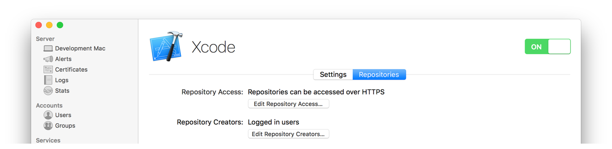
3. Click Edit Repository Access to configure which protocols can be used to access the hosted repositories.

   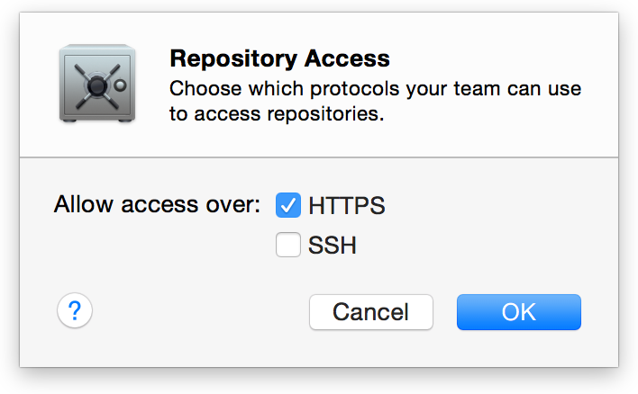

   By default, HTTPS is selected.

   You can also select SSH. If you select SSH, Xcode Server displays a dialog asking whether to allow remote login using SSH. Click Allow.
4. Click Edit Repository Creators to select the users who can create hosted repositories.

   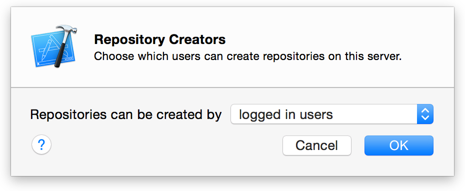
5. In Accounts preferences in Xcode on your development Mac, [add your account credentials](http://help.apple.com/xcode)for the server (if you haven’t already done so).

If you allow HTTPS access, anyone using HTTPS to access a hosted repository is presented with a certificate dialog in Xcode. To access the repository from your development Mac, click Show Certificate when the certificate dialog appears, select the Always Trust option, and click Continue. See Figure 3-1.

__Figure 3-1__Trusting the identity of a hosted repository
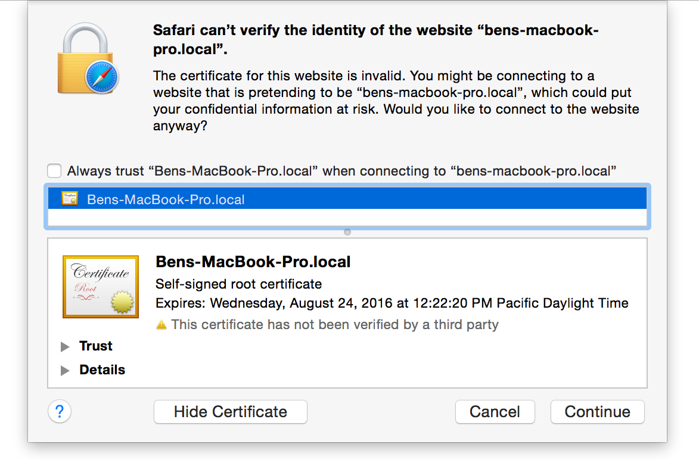

If you work with a team of developers, you can give them accounts for accessing repositories on the server (as described in [Set Up Xcode Server for Team Members](adopt_continuous_integration.md#apple-f4xwc4dqnrsv64tfmyxwi33df52wszbpkridimbqgezteojsfvbuqmznknltk)).

### Clone a Local Repository from Your Development Mac to the Server

If you use a Git repository local to your development Mac, you need to clone the repository to the server running Xcode Server, thereby allowing your bots to operate on the repository.

__To clone a local repository to a server running Xcode Server__

1. On your development Mac, open the project and choose Source Control > _ProjectName – BranchName_ > Configure _ProjectName_.

   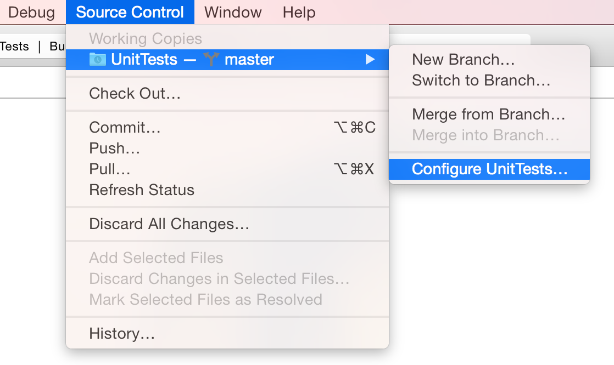
2. Click Remotes.
3. Click the Add button (+).
4. Choose Create New Remote.

   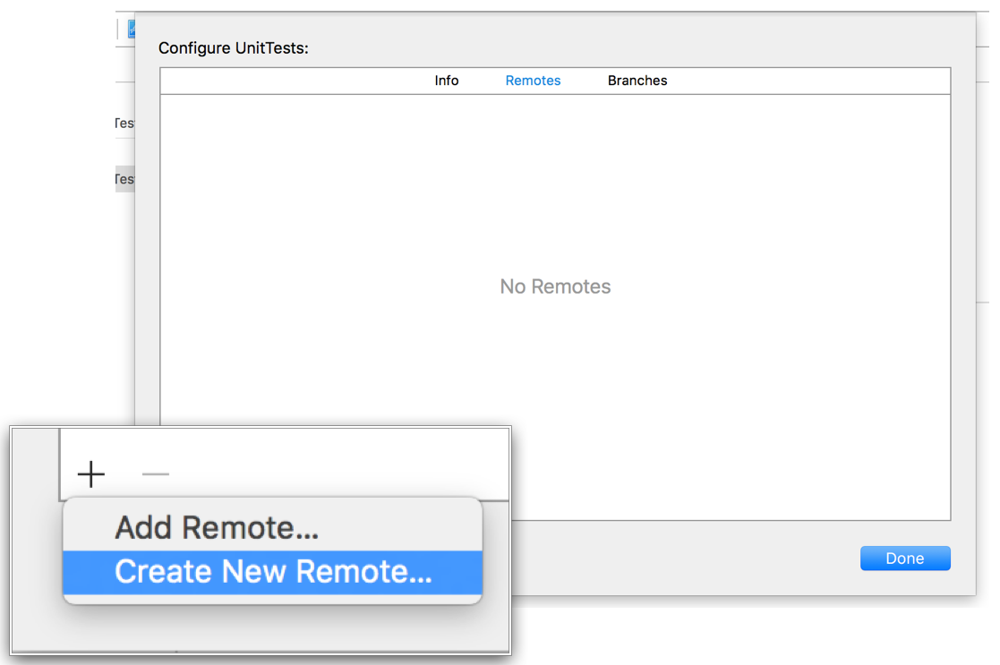
5. Select an OS X Server that is running Xcode Server.
6. Enter a name for the remote repository.

   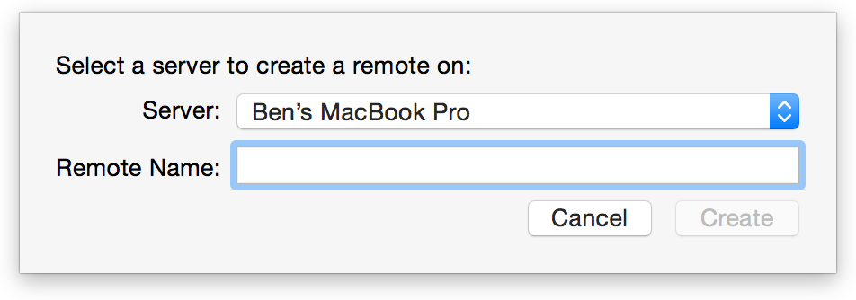

   Use any name that helps you identify the repository. The name will appear in the Remotes list on your development Mac when you need to select this repository. For example, when you choose either Push or Commit from the Source Control menu, the name appears in a pop-up menu that allows you to specify the remote repository.
7. Click Create.

   The cloned repository appears in the Repositories list in Xcode Server in OS X Server.

   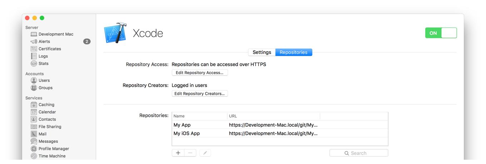
8. Click Done.

   Your local repository is copied to the server.

If you work with a team of developers, you can give them accounts on the server to share your repository too, as described in [Set Up Xcode Server for Team Members](adopt_continuous_integration.md#apple-f4xwc4dqnrsv64tfmyxwi33df52wszbpkridimbqgezteojsfvbuqmznknltk).

### Create a Project and Host Its Repository on the Server

When you create a new project on your development Mac, you can simultaneously create a repository for it directly on the server.

__To create a project with a Git repository on an OS X Server running Xcode Server__

1. In Accounts preferences in Xcode on your development Mac, add your account credentials for the server (if you haven’t already done so).

   By default, Xcode Server allows hosted repositories to be created by logged in users. Adding your account credentials for the server in Accounts preferences in Xcode allows you to log in automatically when creating a Git repository on the server.
2. Choose File > New > Project.
3. Choose a template for your project, and click Next.
4. Specify options for the project, and click Next.
5. Specify the location for the local working copy of the project.
6. For the Source Control option, select “Create git repository on.”
7. Use the pop-up menu to choose the server on which to host the repository.

   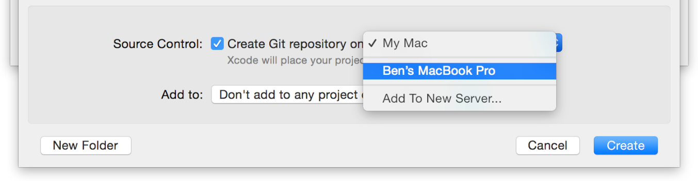

   If the server doesn’t appear in the list, look—or ask the server administrator to look—in the Repositories pane of Xcode Server to see whether you have permission to create a repository. Depending on how Xcode Server is configured, hosted repositories can be created by logged in users, anyone, or only specified users.
8. Click Create.

In OS X Server, the name of the project appears in the Hosted Repositories list of Xcode Server. If you work with a team of developers, you can give them accounts to share your repository (as described in [Set Up Xcode Server for Team Members](adopt_continuous_integration.md#apple-f4xwc4dqnrsv64tfmyxwi33df52wszbpkridimbqgezteojsfvbuqmznknltk)).

### Create Git Repositories in OS X Server Running Xcode Server and Access Them from Your Development Mac

You can also create sharable Git repositories directly in OS X Server that’s running Xcode Server. You and your team members can then point your projects and bots to these repositories.

__To host a new Git repository on a server running Xcode Server__

1. In the Services list in the Server app sidebar, select Xcode.
2. Click Repositories.
3. Click the Add button (+).
4. Enter a name for the repository.

   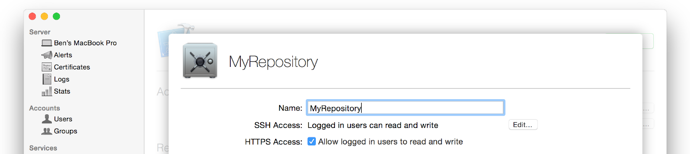

   Use any name that helps you identify the repository. This name will appear in the Hosted Repositories list under Xcode Server settings in the Server app and will be part of the access URL.
5. Click the Edit button to identify the users allowed to access the repository via SSH.

   Select “logged in users” to give access to all users who can log in to the local server or the directory.

   Select “Only some users" to set up an access list for users on the local server or in the directory. You can choose who can read or who can read and write to the repository.
6. If you want to enable HTTPS access, select the “Allow logged in users to read and write” checkbox.
7. Click Create.

   The new repository appears in the Hosted Repositories list. If you want to change user access permissions later, select the repository from the Hosted Repositories list and click the Edit button.

   You can add your credentials for this repository to your development Mac by using Accounts preferences in Xcode on that Mac. If you work with a team of developers, you can give them accounts on the server to share the repository, as described in [Set Up Xcode Server for Team Members](adopt_continuous_integration.md#apple-f4xwc4dqnrsv64tfmyxwi33df52wszbpkridimbqgezteojsfvbuqmznknltk).

If you have a project with an existing Git repository on your local development Mac, you can connect it to a repository in OS X Server that’s running Xcode Server. This way, you can push changes to the server after you commit.

__To add a Git repository hosted by OS X Server and Xcode Server to a project on a development Mac__

1. On your development Mac, open the project, and choose Source Control > _ProjectName – BranchName_ > Configure _ProjectName_.
2. Click Remotes.
3. Click the Add button (+).
4. Choose Add Remote.

   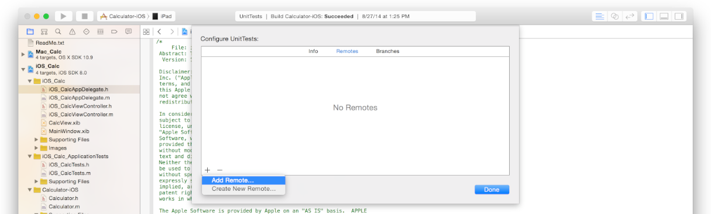
5. Enter the name and address for the remote repository.

   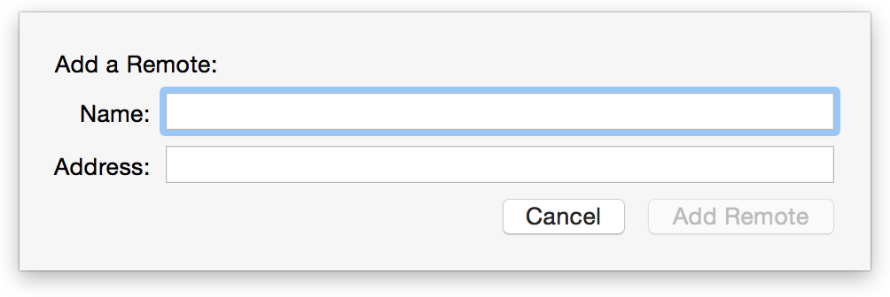

   You can find the address for the remote repository in the list of repositories in Xcode Server.
6. Click Add Remote.
7. Click Done.

### Push Your Commits to the Hosted Repository on the Server

After you configure your development Mac to use a Git repository on the server, a commit operation adds your changes to your local repository. As with any remote Git repository, you must also perform a push operation to add your committed changes to the repository on the server. For example, when you choose Source Control > Commit on your development Mac, select the “Push to remote” option, specify the remote repository in the pop-up menu, and click Commit Files and Push. See Figure 3-2.

__Figure 3-2__Pushing commits to a hosted repository
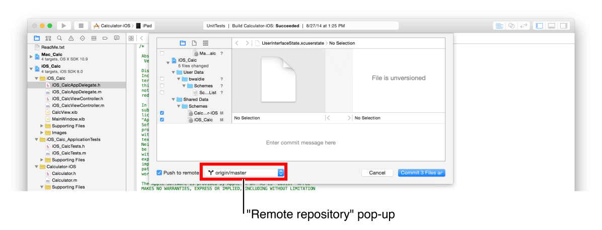

### Add Git Support to an Existing Xcode Project

When you create an Xcode workspace or project, you have the option of including a Git repository in the generated workspace directory. If you didn’t select that option, your workspace directory doesn’t include a Git repository and you can’t use your project with Xcode Server. To resolve this, manually initialize a Git repository in your workspace directory.

__To manually initialize a Git repository in your project directory__

1. In the Terminal app, run the `git init` command inside the workspace directory.

   - `cd <workspace_directory_path>`
   - `git init`
2. If desired, create a `.gitignore` file and add any files you’d like to omit from the repository.

   - `cat > .gitignore`
   - `<files_to_ignore>`
   - `^D # Control-D`
3. Identify the files you want to track in the repository with the `git add` command.

   - `git add <files>`
4. Add the files to the repository with the `git commit` command.

   - `git commit -m "<workspace_directory> initial commit"`

For example, the following commands initialize a Git repository inside the `Sketch` workspace directory, identify the files in the directory to be tracked (excluding some), and add the files to the newly created repository:

1. `hedy: Desktop $ cd Sketch`
2. `hedy: Sketch $ git init`
3. `Initialized empty Git repository in /Users/ernest/Desktop/Sketch/.git/`
4. `hedy: Sketch $ cat > .gitignore`
5. `.DS_Store`
6. `xcuserdata`
7. `^D # Control-D`
8. `hedy: Sketch $ git add .`
9. `hedy: Sketch $ git commit -m "Sketch initial commit"`
10. `[master (root-commit) db941e7] Sketch initial commit`
11. `73 files changed, 13157 insertions(+)`
12. `create mode 100644 .gitignore`
13. `create mode 100644 Arrow.tiff`
14. `create mode 100644 Circle.tiff`
15. `...`

To allow the Xcode service to operate on the repository, clone the repository to your server, as described in [Clone a Local Repository from Your Development Mac to the Server](#apple-f4xwc4dqnrsv64tfmyxwi33df52wszbpkridimbqgezteojsfvbuqobnknltq).

[Install OS X Server and Configure Xcode Server](adopt_continuous_integration.md#apple-f4xwc4dqnrsv64tfmyxwi33df52wszbpkridimbqgezteojsfvbuqmznknltc)

[Configure Bots to Perform Continuous Integrations](ConfigureBots.md#apple-f4xwc4dqnrsv64tfmyxwi33df52wszbpkridimbqgezteojsfvbuqojnknltc)
