> 导航：[总目录](../../../README.md) · [documentation](../../../_indexes/documentation.md) · [Xcode Server and Continuous Integration Guide](index.md)

## Install OS X Server and Configure Xcode Server

To use Xcode Server, you need to install and configure OS X Server and Xcode on a Mac. You can then write code on a development Mac and allow the server to perform continuous integrations of your software products on a schedule, whenever you commit a change to a source code repository, or manually as needed.

Xcode Server advertises itself over Bonjour on your local network. If you and other team members will access Xcode Server from your local network only, you can use Bonjour to find Xcode Server. If you need the service to be visible more broadly, ask your DNS server administrator to add records for your Mac running OS X Server to a DNS server. After these records are added, users can access the server by its host name, such as `server.mycompany.com`. If your intranet doesn’t have a DNS server, you and others can access the server by its local hostname, such as `server.local`.

> [!NOTE]
> 

### Download OS X Server and Xcode

Before configuring Xcode Server, you must download and install OS X Server and Xcode on a Mac. To ensure compatibility between components, it’s a good idea to install any system updates too.

__To install OS X Server__

1. Open the App Store on the Mac that will be your server, and search for OS X Server.
2. Download OS X Server from the App Store.
3. After your download is complete, launch the OS X Server app, simply named _Server_, in `/Applications` or Launchpad.
4. When prompted, click Continue in the Server setup window to begin setting up the server (or click Help to see detailed setup instructions).

   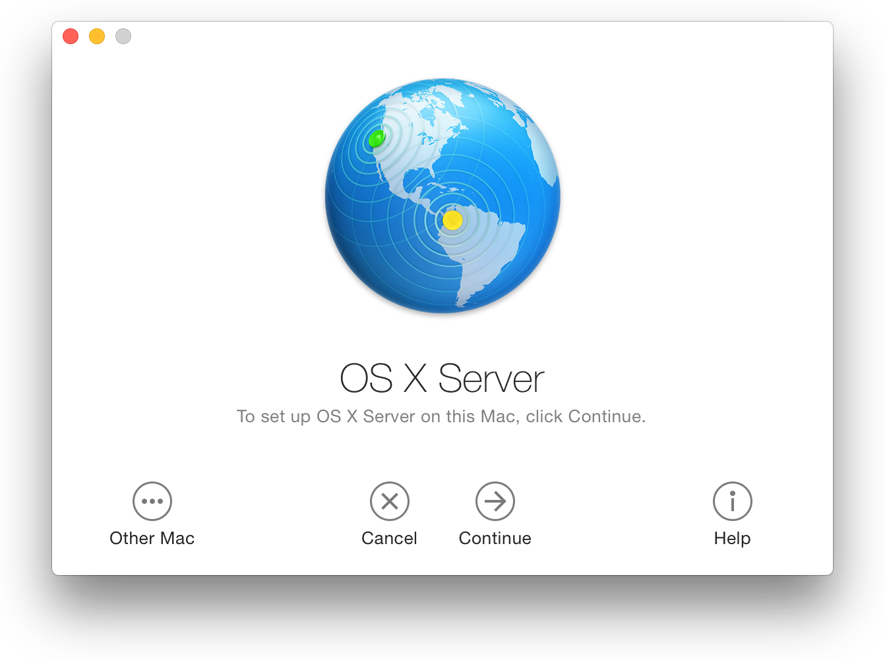
5. Follow the onscreen instructions to complete the installation.

   After you enter the user name and password of an administrator account on your Mac, the Server app installs the software it needs and configures your Mac to operate as a server.

   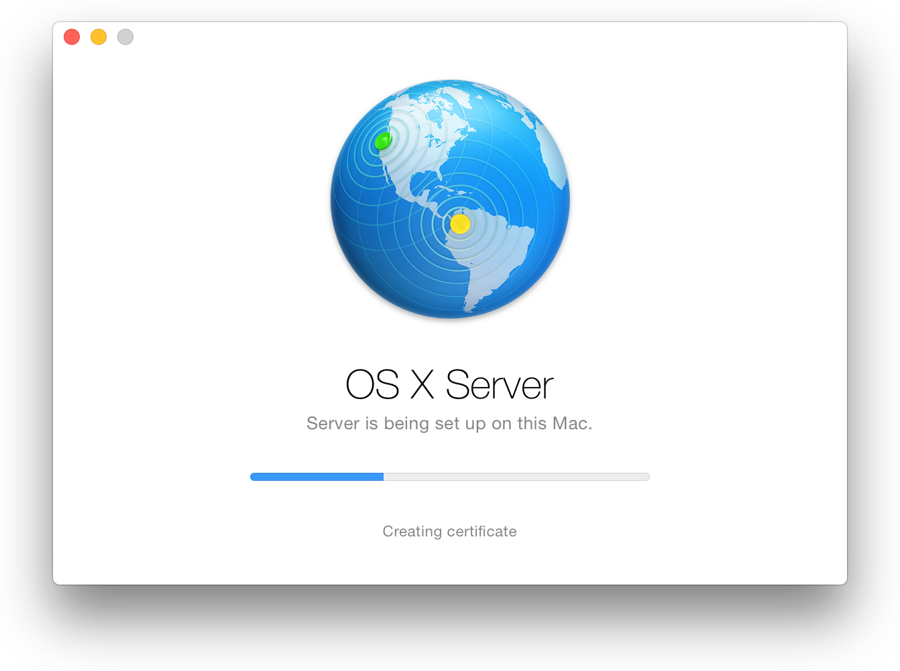

> [!IMPORTANT]
> 

__To install Xcode__

1. Open the App Store on the Mac that will be your server, and search for Xcode.
2. Download Xcode from the App Store.
3. After your download is complete, launch Xcode in `/Applications` or Launchpad.
4. If prompted, enter your administrator account credentials in order to configure Xcode.

> [!NOTE]
> 

### Set Up Xcode Server

With OS X Server and Xcode installed, you’re ready to configure and enable Xcode Server. This is done within the Server app.

> [!NOTE]
> 

__To configure Xcode Server__

1. Launch the Server app (if it’s not already running).

   You can click the Launchpad icon in the Dock and then click Server.
2. In the Services list in the Server app sidebar, select Xcode.

   
3. Click Choose Xcode, and select Xcode.

   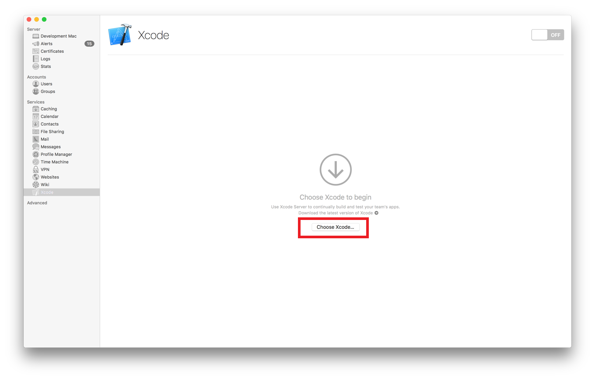

   The first time you enable Xcode Server on a particular Mac, the service asks you to identify the Xcode release it should use to perform its tasks. If you need to identify a different Xcode release in the future, click Choose Xcode again.

   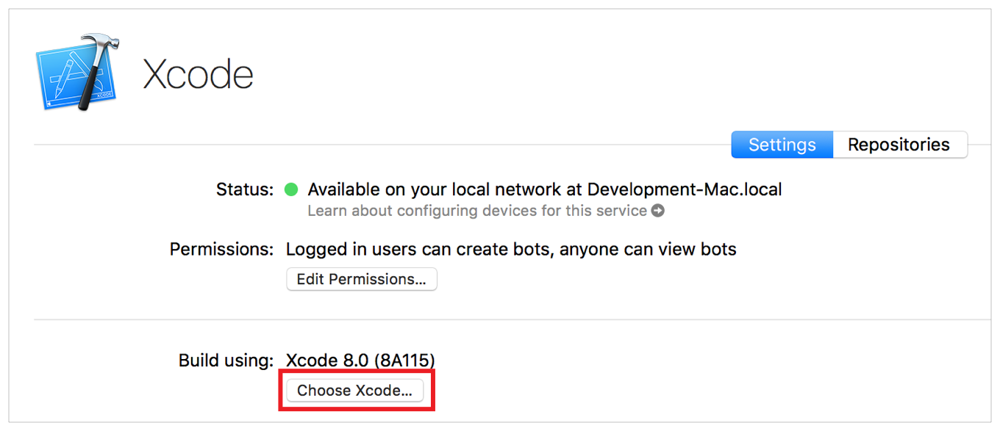
4. Select a user account Xcode Server can use for performing integrations. This can be the current user account, or you can create a new one.

   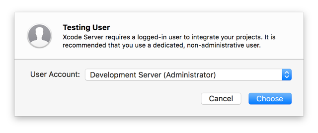

   To create a new account, select “New user account” and enter a full name, account name, and password. If desired, enable administrative privileges. This may be necessary for performing certain types of automated testing. When you’re done, click Create User.

   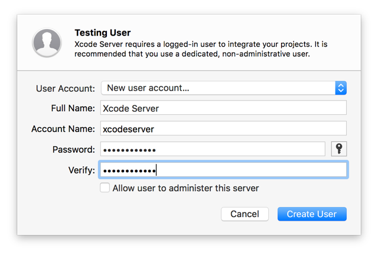
5. If the chosen account is not logged in yet, click Log In and enter the account’s credentials. Xcode Server requires a logged in user to operate.

   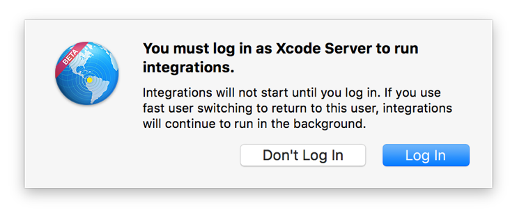

   > [!NOTE]
   > 

__To enable or disable Xcode Server__

1. In the Services list in the Server app sidebar, select Xcode.
2. Click the On/Off switch at the top of the

   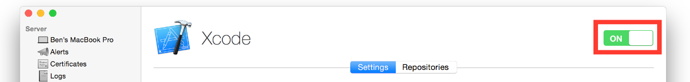

   The Xcode Server menu bar item indicates when Xcode Server is running and performing operations.

   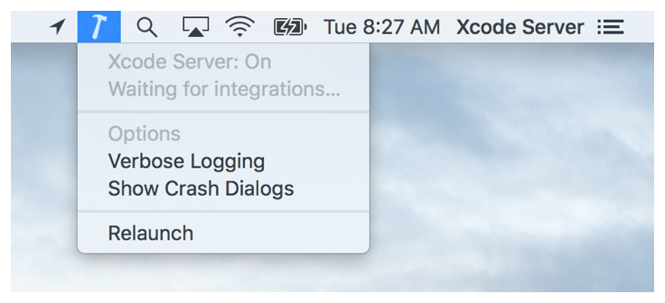

Add your server to a team in your developer account to allow Xcode Server to access your developer account assets, such as provisioning profiles and signing certificates to build products for iOS devices. This is necessary if you plan for Xcode Server to test iOS products and conduct performance testing on iOS devices. Note that you must be an admin or the agent of the team you want your server to join. For information about developer team roles, see Managing Your Developer Account Team in _App Distribution Guide_.

__To add a server to a team__

1. In the Services list in the Server app sidebar, select Xcode.
2. In the Xcode pane, click the Settings tab.

   
3. In the Settings pane, click Add Team.

   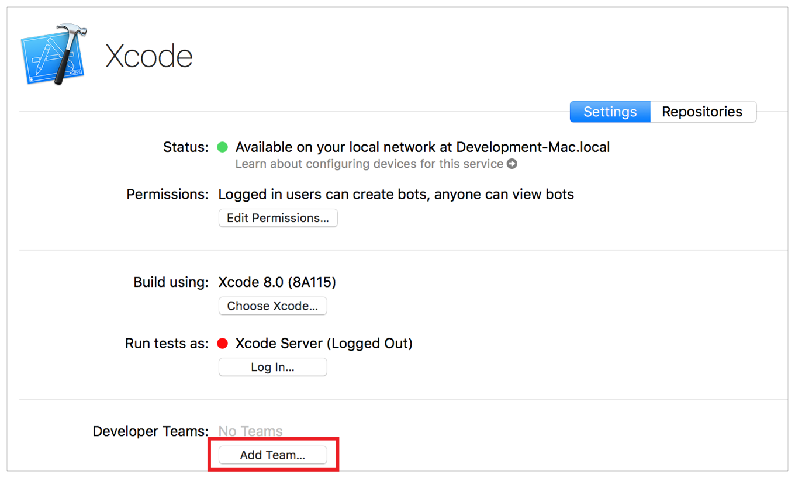
4. Sign in with your Apple ID.

   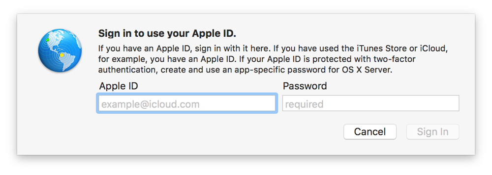
5. Choose a team, if applicable, and click Add.

   The Server app connects to your developer account and downloads its own set of certificates, private keys, signing identities, and provisioning profiles for apps that are registered with your team.

After adding a team to Xcode Server, you can add iOS development devices for use when running performance tests.

__To add an iOS development device to Xcode Server__

1. In the Services list in the Server app sidebar, select Xcode.
2. Connect the device to the server, and wait until it appears in the Devices list.

   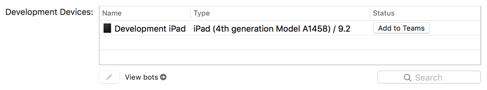
3. Click the “Use for Development” button next to the device in the list.

   A device cannot be used for performance testing until it has been provisioned. If the device has not been provisioned for the team associated with the server, click the “Add to Team” button to add the device to the team.

   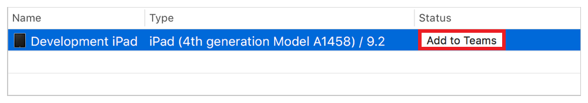

   To view a device’s information, such as the teams assigned, model, serial number, and software version, select the device in the list and click the Edit button.

   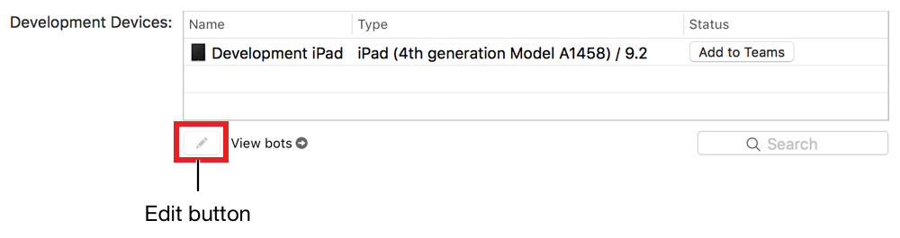

### Set Up Xcode Server for Team Members

If you are part of a team of developers, you can give the members user accounts on the server. This will enable them to create and manage bots, share and manage source code repositories, and use other services in OS X Server.

__To add a user account to the server__

1. In the Accounts list in the Server app sidebar, select Users.

   For more details about creating user accounts, click the Help button in the lower-right corner of the Users pane.
2. Click the Add button (+).
3. In the New User pane, enter the user’s account information.
4. Click Create.

You can also add and manage groups of user accounts by selecting Groups (under Accounts) in the Server app sidebar. For more details, click the Help button in the lower-right corner of the Groups pane.

On their development Mac computers, team members can add their account credentials for the server by using Accounts preferences in Xcode.

Anyone running Xcode who has access to the server can potentially create and view bots. You can, however, restrict which users have access to bots by clicking the Edit button in the Settings pane in Xcode Server.

__To change permissions for who can create or view bots__

1. In the Services list in the Server app sidebar, select Xcode.
2. In the Xcode pane, click the Settings tab.

   
3. Under Access in the Settings pane, click the Edit button for Permissions.
4. Choose which users can create and view bots.

   

   If you choose “all users” from the “Bots can be created and viewed by” pop-up menu, guests and every authenticated user can view bots, create, edit, and delete bots, and download items. The option “logged in users” includes local users and directory users, all of whom need to authenticate to have access to bots. Clicking “only some users” allows you to specify existing users or groups.
5. If you chose to restrict bot creation, you can also choose to restrict view-only access to bots.

   Users with view-only access can view your Xcode Server website (see [Monitor Bots from a Web Browser](MonitorBotsandDownloadProductsfromaWebBrowser.md#apple-f4xwc4dqnrsv64tfmyxwi33df52wszbpkridimbqgezteojsfvbuqmjqfvjvomi)) and initiate integrations, but they can’t create or manage bots. People who particularly benefit from having view-only access to bot activity are software testers, project managers, and seed coordinators.
6. Click OK.

### Set Up Your Development Mac to Access Xcode Server

You can add an account for the server to your development Mac. Once added, you can create bots to run your integrations, initiate integrations, and check the status of bots in the Xcode report navigator. You can also create new projects and host them in Git repositories on the server.

__To add an OS X Server account to Xcode on a development Mac__

1. On your development Mac, choose Xcode > Preferences.
2. Click Accounts in the toolbar.
3. Click the Add button (+), and choose Add Server.
4. Select the server from the server list or enter a server address, then click the Next button.
5. Specify your connection credentials for the server, and click Add.

   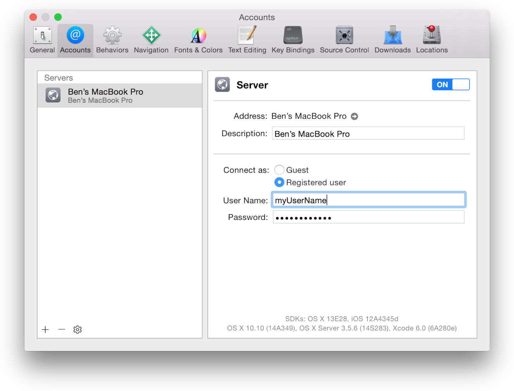

   If the server is successfully configured, you can click the server address link in Accounts preferences in Xcode. Safari opens and shows the bots website hosted by the server, as discussed in [Monitor Bots from a Web Browser](MonitorBotsandDownloadProductsfromaWebBrowser.md#apple-f4xwc4dqnrsv64tfmyxwi33df52wszbpkridimbqgezteojsfvbuqmjqfvjvomi).

   > [!NOTE]
   > 

[About Continuous Integration in Xcode](index.md#apple-f4xwc4dqnrsv64tfmyxwi33df52wszbpkridimbqgezteojsfvbuqmjnknltc)

[Enable Access to Your Source Code Repositories](PublishYourCodetoaSourceRepository.md#apple-f4xwc4dqnrsv64tfmyxwi33df52wszbpkridimbqgezteojsfvbuqobnknltc)
