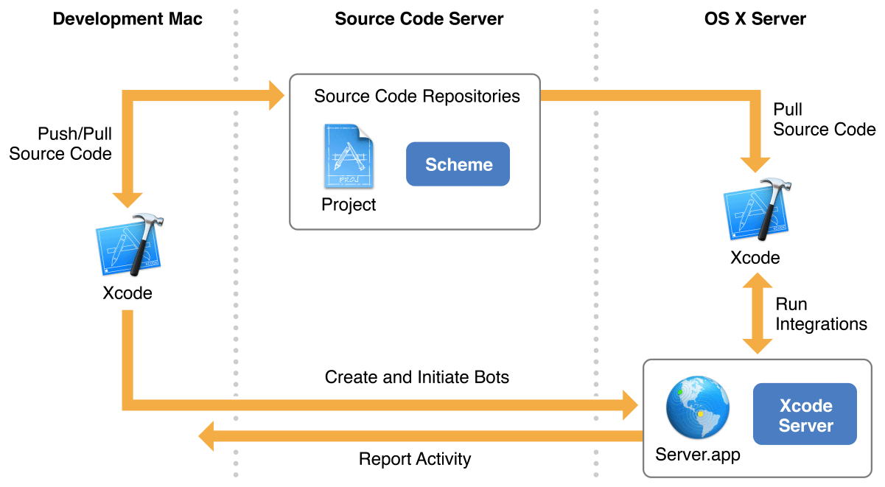
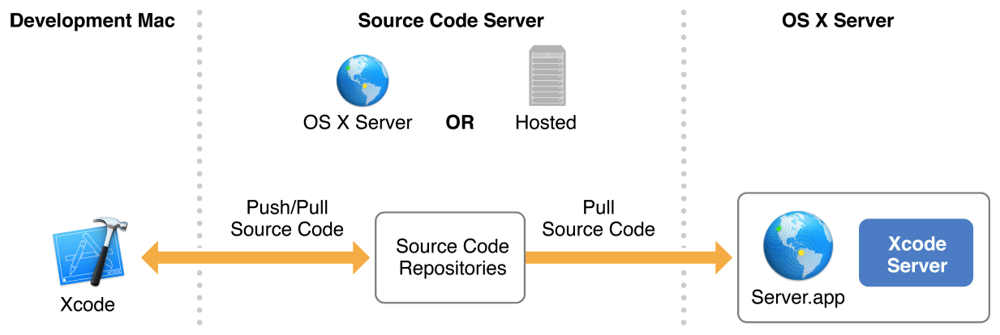
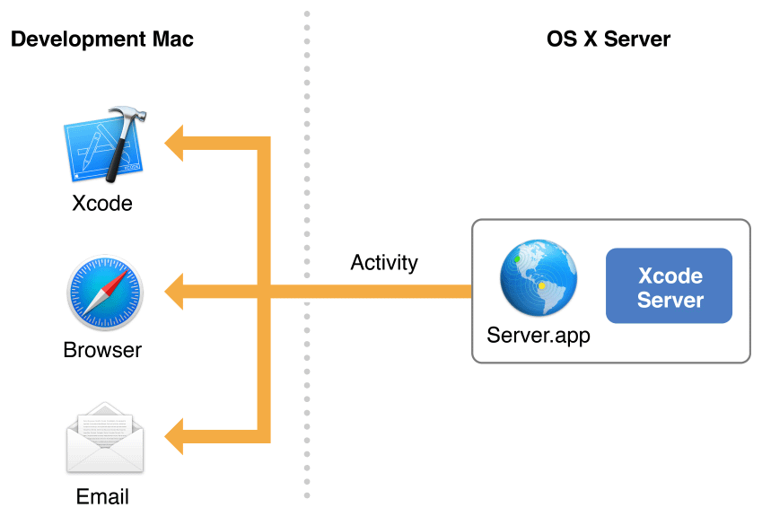

> 导航：[总目录](../../../README.md) · [documentation](../../../_indexes/documentation.md)

## About Continuous Integration in Xcode

In Xcode, _continuous integration_ is the process of automating and streamlining the building, analyzing, testing, and archiving of your Mac and iOS apps, in order to ensure that they are always in a releasable state. In a continuous integration workflow, you write apps locally in Xcode on your development Mac and check them into a source code repository. You then send them to _Xcode Server_, a service provided by OS X Server, for processing. In Xcode on your development Mac, you set up _bots_ that run on the server. These bots process your apps, using the source code in your repository, and report back the results. Each run of a bot is called an _integration_, and these runs occur regularly throughout the development life cycle of your app. See Figure 1-1.

__Figure 1-1__Xcode continuous integration workflow

The goal of continuous integration is to improve software quality, and there are a number of ways this is achieved:

- __Catching problems quickly, easily, and early.__ Bot integrations can be set up to run every time you commit a code change to your source code repository, on a specific schedule, or whenever you manually initiate them. This allows you to identify code problems throughout the development process, fix problems as they occur, and prevent smaller problems from cascading into larger ones.
- __Enhancing collaboration.__ In a continuous integration workflow, your entire team (or selected individuals) can create bots, trigger integrations, view activity, and download builds. If problems are introduced, the person whose code change caused the failure is notified automatically.
- __Broadening test coverage.__ When working locally, testing your app on multiple devices with multiple configurations is a manual and time intensive process. In a continuous integration workflow, it’s automatic and easy. Just plug multiple devices into the server or configure your workflow to use multiple simulators, configure your bots accordingly, and let the system do the work for you.
- __Generating build and test statistics over time.__ In a continuous integration workflow, all progress and failure is logged. At any given time, you can see where your app is in the development process and how it has matured over time.

### At a Glance

Follow the steps outlined in this document to set up a continuous integration workflow using Xcode Server.

### Install and Set Up Xcode Server

The first step in implementing a continuous integration workflow is to install OS X Server and configure Xcode Server to perform your integrations. Even if you’ve never set up a server before, you’ll find the process for setting up OS X Server and enabling Xcode Server to be quick and straightforward.

> [!NOTE]
> 

### Connect Xcode Server to Source Code Repositories

In order for a bot to perform an integration of a project in Xcode Server, the bot must have access to the project’s source code. Xcode Server supports two popular source control systems: Git and Subversion. On your development Mac, you write the source code and push it to a source code repository. This repository can be hosted on a remote server (Git or Subversion) or in OS X Server (Git only). The bot pulls your latest source code whenever it performs an integration. See Figure 1-2.

__Figure 1-2__Xcode Server source code repository interaction

> [!NOTE]
> 

### Create and Run Bots

Bots are at the center of the Xcode Server automated workflow. Bots build and test your projects with the [schemes](https://developer.apple.com/library/archive/featuredarticles/XcodeConcepts/Concept-Schemes.html#//apple_ref/doc/uid/TP40009328-CH8) you specify. Because Xcode Server can access the source code repositories of your projects, you can create and schedule bots to run periodically, on every source code commit, or manually. You can also configure bots to send email notification of the success or failure of their integrations. Xcode Server also allows your bots to conduct performance testing and initiate pre- and postintegration triggers.

> [!NOTE]
> 

### Monitor and Manage Bots

Xcode Server provides detailed information about the status of its integrations through Xcode on your development Mac, a browser, and email notifications. In the Xcode report navigator on your development Mac, you can manage bots, view their test results, read integration logs, initiate or cancel integrations, and download product archives. Xcode Server also hosts a bots website, where you and members of your development team can use a web browser to view the status of bot integrations and download assets and products. Bots can also be set up to send email notifications when integrations succeed, fail, or generate warnings. See Figure 1-3.

__Figure 1-3__Xcode Server activity reporting workflow

> [!NOTE]
> 

### Prerequisites

When setting up a continuous integration workflow, it’s a good idea to have an understanding of how to test and debug Xcode apps. For detailed information on testing and debugging, see _[Testing with Xcode](../../Developer%20Tools/Testing%20with%20Xcode/About%20Testing%20with%20Xcode.md#apple-f4xwc4dqnrsv64tfmyxwi33df52wszbpkridimbqge2dcmzs)_, _[Debugging with Xcode](https://developer.apple.com/library/archive/documentation/DeveloperTools/Conceptual/debugging_with_xcode/chapters/about_debugging_w_xcode.html#//apple_ref/doc/uid/TP40015022)_, and _[Instruments User Guide](https://developer.apple.com/library/archive/documentation/DeveloperTools/Conceptual/InstrumentsUserGuide/index.html#//apple_ref/doc/uid/TP40004652)_.

### See Also

The Xcode Server web API lets you extend the power of Xcode Server through integration with your own tools and processes. For reference documentation, see _[Xcode Server API Reference](https://developer.apple.com/library/archive/documentation/Xcode/Conceptual/XcodeServerAPIReference/index.html#//apple_ref/doc/uid/TP40016472)_.

With OS X Server, small organizations and workgroups without an IT department can take full advantage of the benefits of a server. In addition to Xcode Server, OS X Server can provide other services to Mac, Windows, and UNIX computers, and to iOS devices such as iPhone, iPad, and iPod touch. You use the Server app to turn on the services you want to provide, customize service settings, and turn off services you don’t need. Services include Calendar, Contacts, DHCP, DNS, File Sharing, FTP, Mail, Messages, NetInstall, Open Directory, Profile Manager, Software Update, Time Machine, VPN, Websites, Wiki, and Xsan. For information about setting up and administering these services while running the Server app, choose Help > Server Help. An administration guide, [OS X Server: Advanced Administration](http://help.apple.com/advancedserveradmin/mac/3.0/), is also available online.

[Install OS X Server and Configure Xcode Server](adopt_continuous_integration.md#apple-f4xwc4dqnrsv64tfmyxwi33df52wszbpkridimbqgezteojsfvbuqmznknltc)
