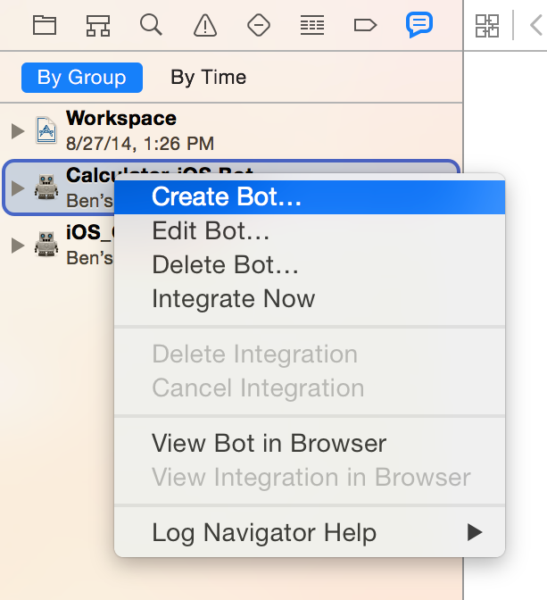
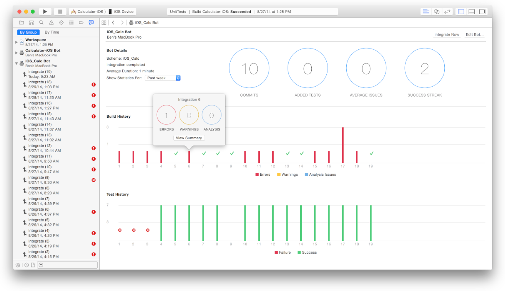
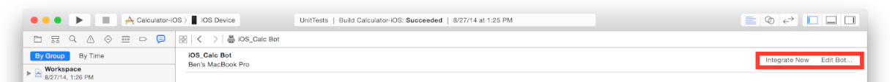
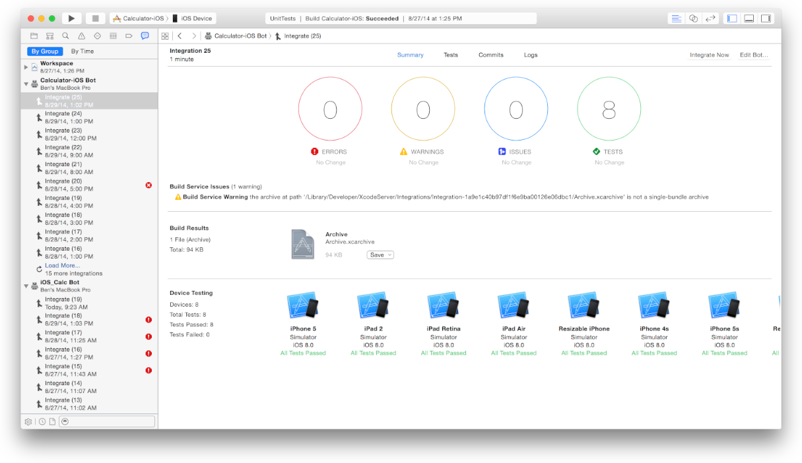
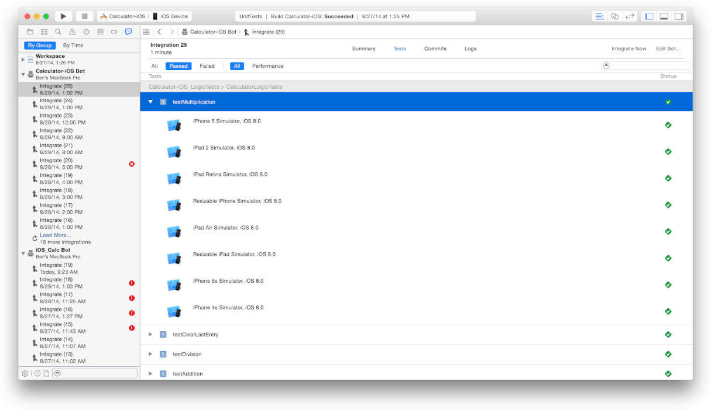
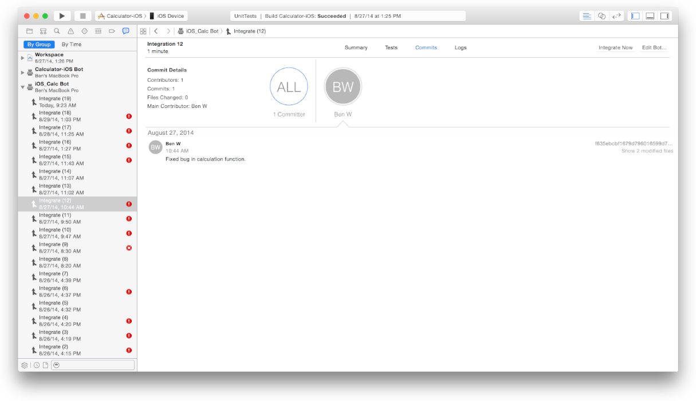
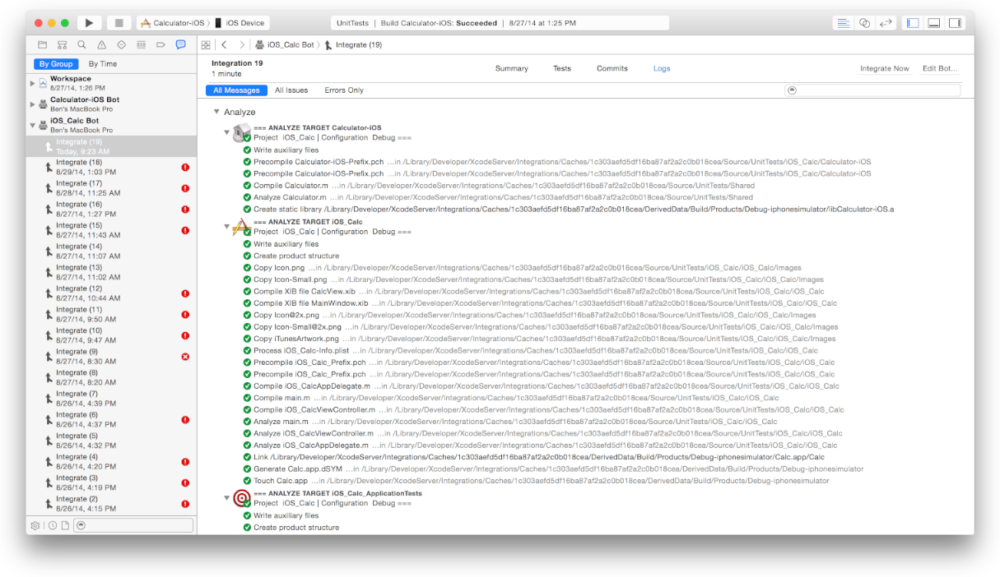
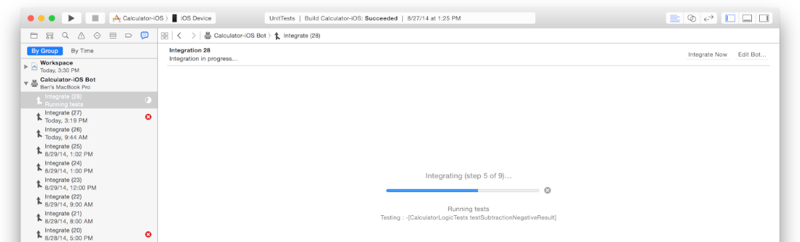

> 导航：[总目录](../../../README.md) · [documentation](../../../_indexes/documentation.md) · [Xcode Server and Continuous Integration Guide](index.md)

## Manage and Monitor Bots from the Report Navigator

On your development Mac, the Xcode report navigator provides access to detailed information about your bots and the integrations they’ve performed on the server. By selecting a bot or integration in the report navigator, you can view its information in the editor area of the Xcode workspace. You can also edit, delete, and create bots from the report navigator, and initiate or cancel their integrations.

### Manage Bots in the Xcode Report Navigator

In Xcode on your development Mac, you can choose View > Navigators > Show Report Navigator or click the Report Navigator button in the navigator bar (Figure 6-1) to display a list of your bots. You can click By Group to display status information gathered under each of the bots.

__Figure 6-1__Showing the report navigator

You can Control-click a bot to display a shortcut menu (Figure 6-2) that allows you to:

- Create a new bot
- Edit a bot—You can change its scheme, name, schedule, actions, email recipients, and test devices.
- Delete a bot—When you remove a bot, you stop its future integration actions and remove existing builds and archives.
- Start a new integration of a bot immediately—Xcode displays live progress information as a bot integrates, right down to the source file being compiled by your bot.
- Cancel an integration currently in progress

__Figure 6-2__Bot shortcut menu

### Monitor and Manage Bots in the Bot Viewer

You can view summaries of a bot’s integrations by selecting the bot in the Xcode report navigator.

__To view a summary of integration results for a bot__

1. At the top of the report navigator, click By Group.

   Status information is gathered for each of the bots.
2. Select the bot whose integrations you want to view.

   In the editor area of the workspace window, the bot viewer displays a summary of the integrations the bot has performed, along with any commits, build errors and warnings, static analysis issues, and test failures.

   

You can initiate some bot management operations in the editor area of the workspace window:

- To start an integration, click Integrate Now.
- To update a bot, click Edit Bot.

In the editor area, the Summary section of the bot viewer displays these elements:

- __Bot Details.__ The scheme, current integration status, average duration, number of commits, tests, average issues, and successes. You can configure the Bot Details area to display statistics for Today, This Week, or This Month.
- __Build History.__ A bar graph depicting the errors, warnings, and static analysis issues the bot encountered when building. Click a bar to display a tally of the issues.
- __Test History.__ The number of successful and failed test cases the bot has performed. Click a bar to display a tally of the passed and failed tests.

### Review Integration Details in the Integration Viewer

You can view details about an integration by selecting it in the report navigator.

__To view details about an integration__

1. At the top of the report navigator, click By Group.

   A list of integrations, if not already visible, is collapsed under each of the bots.
2. Select the bot whose integrations you want to view.
3. If the bot’s integrations aren’t already visible, click the disclosure triangle to the left of the bot to display its integrations.

   To the right of each integration listed in the report navigator, Xcode displays an icon that indicates whether there was an error, a warning, a static analysis issue, or an integration failure. At a glance, this allows you to quickly assess the status of your bot’s integrations.
4. Select a specific integration.

   

   In the editor area of the workspace window, the integration viewer displays information, including:

   - A summary of the integration’s results
   - The number of errors, warnings, static analysis issues, and test-case failures encountered
   - If applicable, lists of new issues, resolved issues, and build service issues
   - If applicable, a build Results area, allowing you to download an archive of the product
   - A Device Testing Summary, which lists any devices tested and their pass or fail status
5. In the editor area of the workspace window, click Tests to view a list of tests and their pass or fail status for the integration.

   If you have multiple test devices, click the disclosure triangle to the left of a test to view the pass or fail status for each individual device.

   

   If your project is configured to conduct performance testing, you can view performance test results and specify a baseline. Specifying a baseline for a performance test adds value to the test and causes the integration to fail if the test falls outside of a certain threshold below the baseline.
6. In the editor area of the workspace window, click Commits to view details about the new commits included in the integration. Commits may be viewed for all committers, or you may select an individual committer.

   By clicking the “Show modified files” button, you can view the files that are part of the commit in the Xcode comparison view, allowing you to identify the specific code changes that were made.

   
7. In the editor area of the workspace window, click Logs to view the logs of the actions that occurred during the integration. Use filters to display all log messages, issues, or errors, and use the search field to find specific messages.

   

If a bot is actively performing the selected integration, the editor displays its live progress instead of results for the integration, as shown in Figure 6-3. Results are displayed after the integration has finished.

__Figure 6-3__A bot actively performing an integration

[Xcode Server Environment Variable Reference](EnvironmentVariableReference.md#apple-f4xwc4dqnrsv64tfmyxwi33df52wszbpkridimbqgezteojsfvbuqmjufvjvomi)

[Monitor Bots from a Web Browser](MonitorBotsandDownloadProductsfromaWebBrowser.md#apple-f4xwc4dqnrsv64tfmyxwi33df52wszbpkridimbqgezteojsfvbuqmjqfvjvomi)
