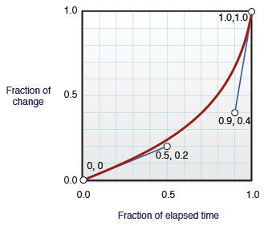
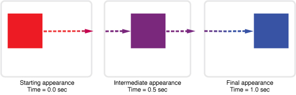

> 导航：[总目录](../../../README.md) · [documentation](../../../_indexes/documentation.md) · [Safari CSS Visual Effects Guide](Introduction.md)


[Next](Animating%20With%20Keyframes.md)[Previous](Using%20CSS%20Filters.md)

# Animating CSS Transitions

You can create animations entirely in CSS, with no need for plug-ins, graphics libraries, or elaborate JavaScript programs. Normally, when the value of a CSS property changes, the affected elements are re-rendered immediately using the new property value. If you set CSS transition properties, however, any changes in the values of the specified CSS properties are automatically rendered as animations. This kind of automatic animation is called a __transition__.

You trigger a transition simply by changing any of the specified CSS values. CSS property values can be changed by a pseudoclass, such as `:hover`, or by using JavaScript to change an element’s class name or to change its individual CSS properties explicitly. The animation flows smoothly from the original state to the changed state using a transition timing function over a specified duration.

For more complex animations that can use arbitrary intermediate states and trigger conditions, see [Animating With Keyframes](Animating%20With%20Keyframes.md#apple-f4xwc4dqnrsv64tfmyxwi33df52wszbpkridimbqga4damzsfvbuqmjufvjvoni).

Transitions are especially powerful if you combine them with 2D and 3D transforms. For example, Figure 5-1 shows the results of applying an animated transition to an element as it rotates in 3D. See the _[CardFlip](../../../samplecode/CardFlip/CardFlip.md#apple-f4xwc4dqnrsv64tfmyxwi33df52wszbpirkfgnbqgaydonrugy)_ sample code project for the complete source code for this example.

__Figure 5-1__  CardFlip example

Animated transitions are a W3C draft specification: [http://www.w3.org/TR/css3-transitions/](http://www.w3.org/TR/css3-transitions/).

To create an animated transition, first specify which CSS properties should be animated, using the `-webkit-transition-property` property, a CSS property that takes other CSS properties as arguments. Set the duration of the animation using the `-webkit-transition-duration` property.

For example, Listing 5-1 creates a `div` element that fades out slowly over 2 seconds when clicked.

__Listing 5-1__  Setting transition properties

```
<div style="
          -webkit-transition-property: opacity;
          -webkit-transition-duration: 2s;"
  onclick="this.style.opacity=0">
<p>Click me and I fade away. . .</p>
</div>
```

There are two special transition properties: `all` and `none`:

- `-webkit-transition-property: all;`
- `-webkit-transition-property: none;`

Setting the transition property to `all` causes all changes in CSS properties to be animated for that element. Setting the transition property to `none` cancels transition animation effects for that element.

To set up an animation for multiple properties, pass multiple comma-separated parameters to `-webkit-transition-property` and `-webkit-transition-duration`. The order of the parameters determines which transition the settings apply to. For example, Listing 5-2 defines a two-second `-background-color` transition and a four-second `opacity` transition.

__Listing 5-2__  Creating multiple transitions at once

```
div.zoom-fade {
    -webkit-transition-property: background-color, opacity;
    -webkit-transition-duration: 2s, 4s;
}
```


Timing functions allow a transition to change speed over its duration. Set a timing function using the `-webkit-transition-timing-function` property. Choose one of the prebuilt timing functions—`ease`, `ease-in`, `ease-out`, or `ease-in-out`—or specify `cubic-bezier` and pass in control parameters to create your own timing function. For example, the following snippet defines a 1-second transition when opacity changes, using the `ease-in` timing function, which starts slowly and then speeds up:

```
style="-webkit-transition-property: opacity;
       -webkit-transition-duration: 1s;
       -webkit-timing-function: ease-in;"
```

Using the `cubic-bezier` timing function, you can, for example, define a timing function that starts out slowly, speeds up, and slows down at the end. The timing function is specified using a cubic Bezier curve, which is defined by four control points, as Figure 5-2 illustrates. The first and last control points are always set to (0,0) and (1,1), so you specify the two in-between control points. The points are specified using x,y coordinates, with x expressed as a fraction of the overall duration and y expressed as a fraction of the overall change.

__Figure 5-2__  Cubic Bezier timing function



For example, Listing 5-3 creates a 2-second animation when the `opacity` property changes, using a custom Bezier path.

__Listing 5-3__  Defining a custom timing function

```
div.zoom-fade {
    -webkit-transition-property: opacity;
    -webkit-transition-duration: 2s;
    -webkit-transition-timing-function: cubic-bezier(0.5, 0.2, 0.9, 0.4);
}
```

In the example just given, the custom timing function starts very slowly, completing only 20% of the change after 50% of the duration, and 40% of the change after 90% of the duration. The animation then finishes swiftly, completing the remaining 60% of the change in the remaining 10% of the duration.

By default, a transition animation begins as soon as one of the specified CSS properties changes. To specify a delay between the time a transition property is changed and the time the animation begins, use the `-webkit-transition-delay` property. For example, the following snippet defines an animation that beings 100ms after a property changes:

```
.delay-fade {
    -webkit-transition-property: opacity;
    -webkit-transition-duration: 1s;
    -webkit-transition-delay: 100ms;
}
```


You can set an animation’s transition properties, duration, timing function, and delay using a single shorthand property: `-webkit-transition`. For example, the following snippet uses the `:HOVER` pseudostyle to cause `img` elements to fade in and out when hovered over, using a one-second animation that begins 100 ms after the hover begins or ends, and using the `ease-out` timing function:

```
<style>
    img { -webkit-transition: opacity 1s ease-out 100ms;
          opacity:1; }
    img:hover { opacity:0; }
</style>
```


When applying a transition to an element’s property, the change animates smoothly from the old value to the new value and the property values are recomputed over time. Consequently, getting the value of a property during a transition may return an intermediate value that is the current animated value, not the old or new value.

For example, suppose you define a transition for the `left` and `background-color` properties and then set both property values of an element at the same time. The element’s old position and color transition to the new position and color over time as illustrated in Figure 5-3. Querying the properties in the middle of the transition returns an intermediate location and color for the element.

__Figure 5-3__  Transition of two properties



To determine when a transition completes, set a JavaScript event listener function for the DOM event that is sent at the end of a transition. The event is an instance of [WebKitTransitionEvent](https://developer.apple.com/documentation/webkitjs/webkittransitionevent), and its type is `webkitTransitionEnd`.

For example, the snippet in Listing 5-4 displays an alert panel whenever a transition ends.

__Listing 5-4__  Detecting transition end events

```
document.body.addEventListener( 'webkitTransitionEnd', function(event) { alert( "Finished transition!" ); }, false );
```

[Next](Animating%20With%20Keyframes.md)[Previous](Using%20CSS%20Filters.md)

