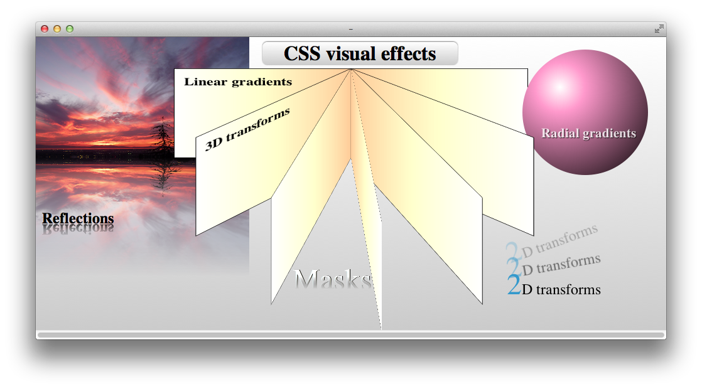

> 导航：[总目录](../../../README.md) · [documentation](../../../_indexes/documentation.md)

[Next](Using%20Gradients.md)

# Introduction

Use CSS to create stunning visual effects—masks, gradients, reflections, lighting effects, animations, transitions, 3D rotations, and more. Apply any or all of these effects interactively, triggered by mouse events or touch events; make HTML elements visibly respond to the user—without requiring plug-ins, graphics libraries, or elaborate JavaScript programs.

There are advantages to using CSS instead of graphic images to create visual effects:

- Because they are resolution-independent, CSS effects scale up smoothly when zoomed.
- Text formatted with CSS is searchable; images are not.
- CSS is compact and compresses well compared with graphic images.
- CSS is just text; it can be quickly modified using a text editor or the output of a script.

Safari supports CSS visual effects on Mac OS X and iOS.

Safari CSS visual effects fall into three categories: new visual CSS properties, animation, and 2D and 3D transforms.

### Use CSS Properties to Add Gradients, Masks, Reflections, and Filters

New visual CSS properties include gradients, masks, reflections, and filters. Gradients let you add beautiful, resolution‐independent color blends to backgrounds and borders, with a single line of CSS.

Use masks to render portions of HTML elements transparent for elegant compositing. Apply a mask as you would a background or a border image. You can use an image as a mask. You can also use a gradient as a mask, and you can mask any HTML element, not just images.

Add a reflection to any element; use a gradient as a mask for a reflection to make the reflection fade to transparency.

Filters allow you to add hardware-accelerated visual effects to HTML elements, including images and videos.

### Animate Changes in CSS Properties

CSS makes animation easy: specify the properties you want animated, and optionally supply a duration for the animation, and any change to those CSS properties is automatically made into an animation of the HTML element, without using graphic plug-ins or even JavaScript. Use CSS pseudoclasses such as `:hover` to make the animations interactive—have elements fade in, grow, or enter from offscreen in response to touch or mouse events.

CSS animations come in two flavors: implicit animations that render changes smoothly over a defined period, and keyframe animations that allow for more complex behavior, such as moving from side to side or starting and stopping en route.

### Apply 2D and 3D Transformations to Any HTML Element

You can apply 2D or 3D transforms to any HTML element, turning a group of `div` elements into the faces of a box or the pages of a book, for example. Apply perspective and animation, and you can open and close the box, turn it to look inside, flip the pages of the book, and so on. 2D transforms include scaling, translation, shearing, reflection, and rotation. 3D transforms add rotation about the x and y axis and displacement on the z axis.

Add touch and mouse interaction to trigger transformations by implementing CSS pseudoclasses, such as `:hover`, or by writing your own JavaScript functions.

The visual effects described in this document are WebKit extensions of CSS. Most of the extensions are proposals for W3C standards; some are in W3C drafts for CSS3. As the standards evolve, syntax for these effects is modified. This change is done carefully to allow new syntax to coexist with existing syntax, however. This means you can experiment with CSS extensions without having your website suddenly break when the standard is modified—in most cases, the old syntax still works. This document describes the current syntax as of this writing; many of the extensions have prior syntax that still works but is no longer recommended.

You need a solid understanding of HTML and some familiarity with JavaScript and CSS to make good use of this document.

You may also find the following documents helpful:

- _[Safari DOM Additions Reference](https://developer.apple.com/documentation/webkitjs)_—describes the touch event classes that you use to handle multi-touch gestures in JavaScript.
- _[Safari CSS Reference](../../Apple%20Applications/Safari%20CSS%20Reference/Introduction%20to%20Safari%20CSS%20Reference.md#apple-f4xwc4dqnrsv64tfmyxwi33df52wszbpkridimbqgazdanjq)_—describes the CSS properties supported by various Safari and WebKit applications.
- _[Safari Web Content Guide](../../Apple%20Applications/Safari%20Web%20Content%20Guide/Developing%20Web%20Content%20for%20Safari.md#apple-f4xwc4dqnrsv64tfmyxwi33df52wszbpkridimbqgazdanjr)_—describes how to create content that is compatible with, optimized for, and customized for iOS.
- _iOS Human Interface Guidelines_—provides user interface guidelines for designing webpages and web applications for Safari on iOS.
- _[FingerTips](../../../samplecode/FingerTips/FingerTips.md#apple-f4xwc4dqnrsv64tfmyxwi33df52wszbpirkfgnbqgaydqmjsgq)_—demonstrates how to build an interactive 3D carousel using CSS, JavaScript and touch events.
- [http://dev.w3.org/csswg/css3-images/](http://dev.w3.org/csswg/css3-images/)—W3C draft for gradients.
- [http://www.w3.org/TR/css3-transitions/](http://www.w3.org/TR/css3-transitions/)—W3C draft for animated transitions.
- [http://www.w3.org/TR/css3-animations/](http://www.w3.org/TR/css3-animations/)—W3C draft for keyframe animations.
- [http://www.w3.org/TR/css3-2d-transforms/](http://www.w3.org/TR/css3-2d-transforms/)—W3C draft for 2D transforms.
- [http://www.w3.org/TR/css3-3d-transforms/](http://www.w3.org/TR/css3-3d-transforms/)—W3C draft for 3D transforms.
[Next](Using%20Gradients.md)

