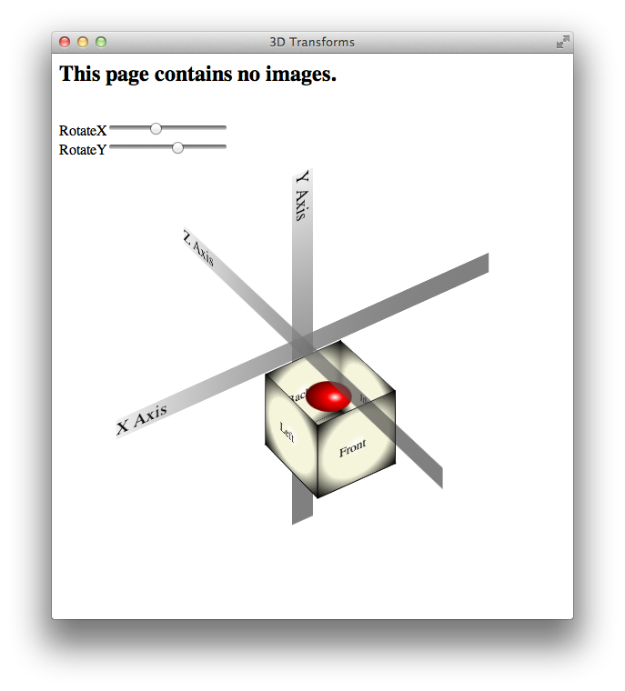
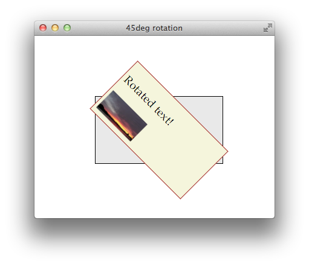
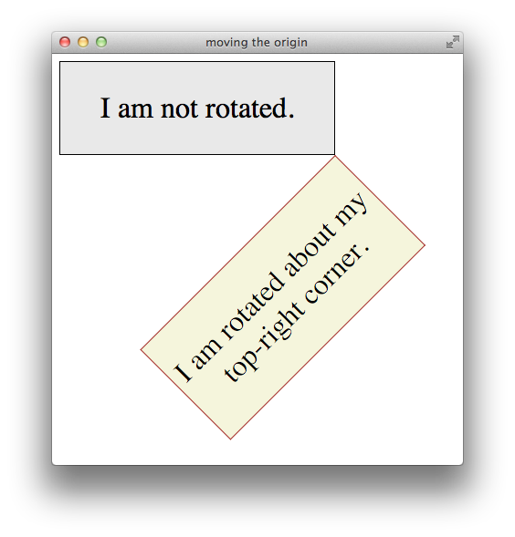
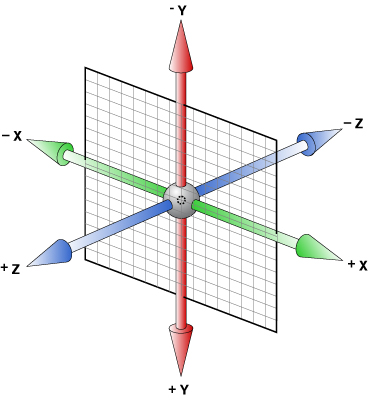
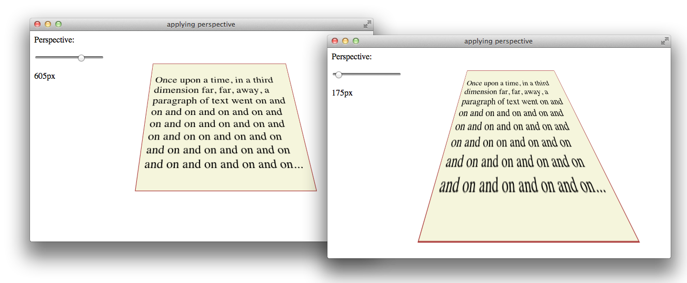

> 导航：[总目录](../../../README.md) · [documentation](../../../_indexes/documentation.md) · [Safari CSS Visual Effects Guide](Introduction.md)


[Next](Adding%20Interactive%20Control%20to%20Visual%20Effects.md)[Previous](Animating%20With%20Keyframes.md)

# Using 2D and 3D Transforms

Use CSS transform properties to give webpages a rich visual appearance without needing image files. Elements can be positioned, rotated, and scaled in 2D and 3D space; perspective can also be applied, giving elements the appearance of depth.

For example, Figure 7-1 shows a simple HTML document, containing only `div` elements and text but rendered using CSS transform and gradient properties. It appears to be a graphics-intensive page, yet the actual content is less than 2 KB of text, and the elements animate smoothly in 3D under user control.

__Figure 7-1__  HTML page with rotation and perspective transforms



How does this work? HTML elements are, after all, inherently two-dimensional, or planar; they have height and width, but no thickness. By rotating planar elements into the third dimension and applying perspective, however, these elements can be combined to create apparently solid objects. For example, five `div` elements are combined in Figure 7-1 to form the sides and bottom of an open box; the ball inside the box is another `div` element with rounded borders—a radial gradient gives it the appearance of depth.

Safari uses a series of transformation matrices to determine the mapping of every pixel on the screen. You don’t need to understand matrices to use them, however. You can apply a transform either by using a matrix or by calling one of the transform functions, such as `scale()` or `rotate()`.

Transforming an element typically causes its image to be rendered in a different position on the screen, but the position and dimensions of the element on the page are not changed—the `top`, `left`, `height`, and `width` properties, for example, are not altered by transforms. It is the coordinate system in which the element is drawn that is changed. Consequently, changing transform properties does not affect the layout of a webpage. This means that transforming an element can cause it to visually overlap neighboring elements, even though their positions and dimensions on the page may not overlap.

By default, transforms are applied using the center point of an element as the origin; rotation spins an object about its center, for example, and scaling expands or contracts an element from the center point. You can change the origin by setting the `-webkit-transform-origin` property.

A transform can cause part of an element to be displayed in the element’s overflow area. If the value of the `overflow` property is `scroll` or `auto`, scroll bars appear as needed if a transform renders part of an object outside the display area.

Safari supports both 2D and 3D transforms. Both 2D and 3D transforms are W3C drafts.

See [http://www.w3.org/TR/css3-2d-transforms/](http://www.w3.org/TR/css3-2d-transforms/) and [http://www.w3.org/TR/css3-3d-transforms/](http://www.w3.org/TR/css3-3d-transforms/) for the specifications.

To apply a 2D transform to an element, use the `-webkit-transform` property. The transform property can be set using predefined transform functions—translation, rotation, and scaling—or it can be set using a matrix.

2D translation shifts the contents of an element by a horizontal or vertical offset without changing the `top` or `left` properties. The element’s position in the page layout is not changed, but the content is shifted and a shifted coordinate system applies to all descendants of the translated element.

For example, if a `div` element is positioned at the point `10,10` using the CSS properties `top` and `left`, and the element is then translated 100 pixels to the right, the element’s content is drawn at `110,10`. If a child of that `div` is positioned absolutely at the point `0,100`, the child is also shifted to the right and is drawn at the point `110,110`; the specified position of `0,100` is shifted right by 100, and the child is drawn at `100,100` relative to the parent’s upper-left corner, which is still at `10,10`. Figure 7-2 illustrates this example.

__Figure 7-2__  A translated element and its offspring

!

To apply a 2D translation, set the `-webkit-transform` property to `translateX(offset)`, `translateY(offset)`, or both. For example:

```
<div style="-webkit-transform: translateX(40px);">
<div style="-webkit-transform: translateY(50%);">
<div style="-webkit-transform: translateX(100px) translateY(100px);">
```


2D rotation is a rotation in the xy plane. By default, 2D rotation spins an object around its center point. To rotate an element around a different point, see [Changing the Origin](#apple-f4xwc4dqnrsv64tfmyxwi33df52wszbpkridimbqga4damzsfvbuqmjvfvjvomy). Rotation is specified in degrees clockwise from the element’s orientation after any inherited rotation; rotation affects the specified element and all of its descendants. The coordinate system of any descendants is likewise rotated.

The following snippet rotates a `div` element 45 degrees clockwise, as shown in Figure 7-3. The `div` element has a beige background and contains a paragraph of text and an image; both the text and the image inherit the `div` element’s rotation. A second `div` is positioned under the rotated `div` to show the original `div`’s position prior to rotation.

`<div style="-webkit-transform: rotate(45deg);" >`

__Figure 7-3__  Rotating an element



Rotation can be specified in positive or negative degrees. For example, `-webkit-transform: rotate(-45deg);` specifies a 45 degree rotation counterclockwise. If rotation is animated, specifying a degree of rotation greater than the current degree causes clockwise rotation; specifying a degree of rotation less than the current degree causes counter-clockwise rotation.

When animating rotation, it can be useful to specify a rotation of more than 360 degrees. For example, Listing 7-1 uses JavaScript to set a rotation of `3600deg`, causing a `div` element to spin clockwise ten times. The text spins once on page load, and a button lets the user spin it again.

__Listing 7-1__  Animating 2D rotation

```
<html>
<head>
    <title>spin-in text</title>
<style>
#spinner {
    background: beige; border: 1px solid brown; padding: 25px;
    position: absolute; left: 100; top: 100; width: 200px;
    -webkit-transition: -webkit-transform 2s;
}
</style>
<script type="text/javascript">
var angle = 0;
function spin() {
    angle = angle + 3600;
    var spin10 = "rotate(" + angle + "deg)";
    document.getElementById("spinner").style.webkitTransform = spin10;
}
</script>
</head>
<body onload="spin();">
<div id="spinner">
    <h2>Spinning text!</h2>
    Whew! I'm dizzy...
</div>
<input type="button" value="Do it again!" onclick="spin();">
</body>
</html>
```

Notice that the CSS property `-webkit-transform` is addressed in JavaScript as `element.style.webkitTransform`. Notice also that the `spin()` function increments the rotation angle by 3600 each time it is called; setting the angle to `3600deg` repeatedly would have no effect.

2D scaling makes an element smaller or larger in one or two dimensions. Scaling affects the whole element, including any border thickness. By default, the element is scaled up or down relative to its center, which causes all four of the element’s corners to be redrawn at new locations. The element’s `top`, `left`, `height`, and `width` properties are unchanged, however, so the layout of the page is not affected. Consequently, scaling an element up can cause it to cover other elements on the page unless you design the layout to allow room for the expansion.

Scaling modifies the coordinate system of an element’s descendants, multiplying the x and y values by the specified scaling factor. For example, if a `div` element contains an image positioned absolutely at `10,10`, with a height and width of 100 pixels, scaling-up the `div` element by a factor of two results in a 200 x 200 image, positioned at `20,20` relative to the `div`’s upper-left corner, which moves up and to the left. Figure 7-4 illustrates this behavior.

__Figure 7-4__  Scaling an element up

!!

Apply a scale transformation by setting the `-webkit-transform` property to `scale(x y)`, where `x` and `y` are independent scale factors for width and height, or by setting the transform property to `scale(size)`, where `size` is the scaling factor in both dimensions. For example:

`style=”webkit-transform: scale(1, 2)”` renders an element the same width, but twice as tall.

`style=”webkit-transform: scale(2, 0.5)”` renders an element twice as wide and half as tall.

`style=”webkit-transform: scale(1.5)”` renders an element 1.5 times larger.

Different transforms, such as rotation and scaling, are applied by setting different values to a single property: `-webkit-transform`. Consequently, if you apply one transform to an element and then specify another transform, the first transform is no longer applied; the new value overwrites the old one, as with any CSS property.

There are two different ways to perform multiple transforms on an element—both scaling and rotating an element, for example:

- Use inheritance to apply multiple transforms: create a scaled `div` element, for example, add your element as a child, then rotate the child element.
- Set the `-webkit-transform` property of the element to a space-delimited list of transform functions, such as:

  `-webkit-transform: scale(2) rotate(45deg);`

  When a list of functions is provided, the final transformation value for the element is obtained by performing a matrix concatenation of each entry in the list. (Matrix concatenation can have some side effects, such as normalizing the rotation angle modulo 360.)

Both approaches—transform inheritance and transform function lists—are valid. The following two examples illustrate two ways to apply a set of transforms to an element. Listing 7-2 sets an element’s transform property to a list of transform functions. Listing 7-3 produces the same results by applying each transform to a nested element.

__Listing 7-2__  Setting multiple transforms using a list

```
<div style="-webkit-transform:
           translate(-10px,-20px) scale(2) rotate(45deg);">
</div>
```


__Listing 7-3__  Nesting 2D transforms

```
<div style="-webkit-transform:translate(-10px,-20px)">
  <div style="-webkit-transform:scale(2)">
    <div style="-webkit-transform:rotate(45deg)">
    </div>
  </div>
</div>
```


By default, the origin for transforms is the center of an element’s bounding box. Most HTML and CSS entities use the upper-left corner as the default origin, but for transforms, it is usually more convenient to use the center of an element as a reference point. Consequently, elements rotate around their center by default, and scale up or down from the center out.

To change the origin for transforms of a given element, set the `-webkit-transform-origin` property. The new origin is specified as a distance or percentage from the element’s upper-left corner. For example, the default center origin can be expressed as `-webkit-transform-origin: 50% 50%;`. Changing the origin to `0% 0%` or `0px 0px` causes transformation to occur around the upper-left corner of the element.

The code in Listing 7-4 rotates the second box in Figure 7-5 around the top-right corner.

__Listing 7-4__  Rotating an element around the top-right corner

```
<div style="width: 300px;
            -webkit-transform: rotate(-45deg);
            -webkit-transform-origin: 100% 0%;">
<p>I am rotated about my top-right corner.</p>
</div>
```


__Figure 7-5__  Element rotated around the top-right corner



The standard HTML coordinate system has two axes—the x-axis increases horizontally to the right, and the y-axis increases vertically downwards. With 3D transforms, a z-axis is added, with positive values rising out of the window toward the user and negative values falling away from the user, as Figure 7-6 illustrates.

__Figure 7-6__  3D coordinate space



3D transforms move an element out of the usual xy plane, where z=0—the plane of the display. A transformed element is still two dimensional, but it no longer lies in the usual plane. A transformed object may be translated along the z-axis, rotated around the x- or y-axis, or transformed using some combination of translation and rotation.

All HTML elements have a z-index. The z-index controls the rendering order when elements overlap. An element’s z-index has nothing to do with its z-axis coordinate. Transformed objects follow the standard HTML rendering rules—objects with higher z-index values are drawn on top of other objects with lower z-index values—but for elements sharing the same z-index, the areas with higher z-axis coordinate values are drawn on top.

To render elements with the appearance of depth, you must specify a perspective. If you apply 3D transforms without setting the perspective, elements appear flattened. For example, if you rotate an element around its y-axis without setting the perspective, the element just appears narrower. If you rotate an element 90 degrees from the default xy plane, it is seen edge-on—the element either disappears entirely or is displayed as a line.

Adding perspective distorts the appearance of objects realistically, making nearby things appear larger and distant things look smaller. The closer the object, the greater the distortion. In order for Safari to create the illusion of depth, it’s necessary to specify a point of view, or perspective. Once Safari knows where the user’s eye is relative to an element, it knows how much distortion to apply and where.

Use the `-webkit-perspective` property to set the perspective for all the descendants of an element. For example:

```
<div style="-webkit-perspective: 400px;">
```

The perspective is specified in distance from the screen. You may specify the distance in pixels, centimeters, inches, or any CSS distance unit. If no unit type is supplied, `px` is assumed.

Listing 7-5 sets the `-webkit-perspective` property using a slider.

__Listing 7-5__  Adding a perspective slider

```
<html>
<head>
    <title>applying perspective</title>
<style>
<script type="text/javascript">
function setView(value) {
    document.getElementById("showVal").innerHTML=value+"px";
    document.getElementById("view3d").style.webkitPerspective=value+"px";
}
</script>
</head>
<body>
<div id="view3d"
     style="-webkit-perspective: 400px;">

      <div class="tilted"
      style= "-webkit-transform: rotateX(45deg); -webkit-transform-origin: 50% 80%;">
      <p>
      Once upon a time, in a third dimension far, far, away, a paragraph of text went
      on and on and on and on and on and on and on and on and on and on and on
      on and on and on and on and on and on and on and on and on and on and on...
      </p>
      </div>
</div>
<p>Perspective:</p>
<input type="range" min="150" max="800" value="400" step="5" onchange="setView(value);">
<p id="showVal"> 400px </p>
</body>
</html>
```

Figure 7-7 shows two perspective settings from the previous example in which a child element is rotated 45 degrees around the x-axis. The elements are shown at the same rotation and position in both cases, but with different perspective settings.

__Figure 7-7__  Setting the perspective



You can envision perspective view as a pyramid, with the point of the pyramid centered at the user’s eye, and the base of the pyramid extending into the infinite distance. By setting the `-webkit-perspective` property, you specify the viewpoint’s z-coordinate—how far the point of the pyramid lies above the screen. By default, the x- and y-coordinates of the viewpoint are the center of the element to which the `-webkit-perspective` property belongs.

Shift the viewpoint horizontally or vertically by setting the `-webkit-perspective-origin` property. The default setting is `-webkit-perspective-origin: 50% 50%`. To set the viewpoint above the top-left corner of an element, for example, set the element’s style to `-webkit-perspective-origin: 0px 0px`.

The perspective origin can affect the visibility of elements. For example, if an element is rotated 90 degrees out of the default plane, it is viewed edge-on: if the perspective origin is directly in front of the element, the element is invisible; but if the origin is off-center from the element, one side of the element can be seen. For example, Listing 7-6 creates three `div` elements, all rotated 90 degrees. The elements positioned on the left and right of the window are visible. When the window is sized appropriately, however, the element in the center of the window is edge-on to the viewer and cannot be seen, as Figure 7-8 illustrates.

__Listing 7-6__  Effects of perspective origin

```
<html>
<head>
    <title>perspective origin</title>
</head>
<style>
.body { width: 200px; height: 200px;
        background-color: beige; border: 1px solid brown;
        font-size: 150%; padding: 10px;
        -webkit-transform: rotateY(90deg);}
</style>
<body style="-webkit-perspective: 10cm;">

    <div class="body"
     style="position:absolute; left:50px; top: 70;">
     <h2>Left</h2>
    </div>
    <div class="body"
     style="position:absolute; left:250px; top: 70;">
     <h2>Center</h2>
    </div>
    <div class="body"
     style="position:absolute; left:450px; top: 70;">
     <h2>Right</h2>
    </div>

    <p align="center">The center element is edge-on, and not visible.</p>
</body>
</html>
```


__Figure 7-8__  Perspective origin effects

!!

By default, the descendants of an element are flattened into the plane of their parent. When you apply a 3D transform to an element, that element’s plane is no longer the default xy plane—the plane of the display. All descendants of the element share that element’s new plane. In order to further transform the children of an element relative to that element’s plane, you must set the `-webkit-transform-style` property to `preserve-3d`, creating a 3D space. For example:

`<div id="space3d" style="-webkit-transform-style: preserve-3d;">`

Setting the transform style to `preserve-3d` in an element makes that element into a 3D container; all the element’s immediate children can be manipulated independently in 3D, relative to the parent. Because HTML elements are flat, a transformed child also occupies a plane in 3D space. Each child can occupy a separate plane, or multiple children can share the same plane. By default, any descendants of these transformed children are flattened into their parental plane; setting the transform style to `preserve-3d` affects only an element’s immediate children.

3D containers can be nested. Enabling 3D transforms in one of a container element’s descendants creates a nested 3D layer; children of that descendant can be transformed in 3D, relative to their container’s plane. You need to enable 3D in a particular element only if the element’s children are to be transformed in 3D relative to that element’s plane.

Any transform applied to a 3D container is inherited by all of its descendants. By applying a rotation to the highest level 3D container, for example, you are able to rotate the view of all of the container’s contents at once.

Listing 7-7 gives an example of a nested pair of 3D containers, illustrated in Figure 7-9. The topmost container has a child `div` element rotated 45 degrees on its x-axis, so it appears to be tilted away from the viewer. This child `div` is also a 3D container, containing a paragraph of text rotated 35 degrees on its right edge away from the container, causing the text to appear to lift off the page.

__Listing 7-7__  Nested 3D rotations

```
<body>
<div id="view3d"
    style="-webkit-perspective: 15cm;   -webkit-transform-style: preserve-3d;">

      <div id="nested3dContainer"
           class="tilted"
           style= "-webkit-transform-style: preserve-3d;
                   -webkit-transform: rotateX(45deg); ">

           <p style="-webkit-transform: rotateY(35deg); -webkit-transform-origin: 100% 50%;">
           And so the text seems to lift off the page and float, as if transformed.
           Well, I suppose it is transformed, and that explains the appearance,
           if not quite the magic, of it...
           </p>
      </div>
</div>
</body>
```


__Figure 7-9__  Text rotated relative to 3D backdrop

!

Generally speaking, you need to create only a single 3D container—all 3D transforms can be applied relative to the default xy plane, and global transforms can be applied to the top-level container and inherited by all its descendants. Sometimes it may be convenient to manipulate a subgroup of transformed elements as a unit, however; in such a case, it makes sense to create a nested container.

To disable 3D for an element’s children dynamically, set the `-webkit-transform-style` property to `flat`. Applying a 3D transform when the transform style is set to `flat` does not move the element out of its parent’s plane.

Like 2D transforms, 3D transforms are set using the `-webkit-transform` property. You can apply a transform to an element by specifying a transform function, a list of transform functions, or by passing in a 3D matrix. There are several functions that perform 3D transforms:

- `translateZ(distance)`—Moves an element closer or farther away.
- `translate3d(x, y, z)`—Moves an element in three dimensions.
- `rotateX(degrees)`—Rotates an element around the x-axis, moving the top and bottom closer or farther away.
- `rotateY(degrees)`—Rotates an element around the y-axis, moving the left and right sides closer or farther away.
- `perspective(distance)`—Sets the 3D perspective for a single element.

3D translation moves an element closer to or farther from the viewer by changing its position on the z-axis. Use the `translateZ()` function to shift an element on the z-axis, or the `translate3d(x, y, z)` function to shift an element on two or three axes. For example:

```
<div style="-webkit-transform: translateZ(100px);">
<div style="-webkit-transform: translate3d(100px 10cm -100px);">
```

The 3D translation functions work like their 2D counterparts, except that the z offset cannot be specified as a percentage. Z-axis units may be positive (towards the viewer) or negative (away from the viewer). Figure 7-10 shows two identical `div` elements with same height, width, and x and y positions, one translated on the z-axis by 100 px and the other translated by -100 px.

__Figure 7-10__  Z-axis translation in perspective

!

All descendants of an element inherit its z-axis translation. Note that the text in the previous illustration is translated along with its parent.

You can rotate an element in 3D either around the y-axis, so that the right and left edges get nearer and farther away, or around the x-axis, so that the top and bottom edges get nearer and farther away. For example:

```
<div style="-webkit-transform: rotateX(45deg);">
<div style="-webkit-transform: rotateY(-45deg);">
```

Rotation is around an imaginary x- or y-axis that passes through the element’s origin. By default, the origin is at the center of an object. Positive x units rotate the top edge away. Positive y units rotate the right edge away. This is illustrated in Figure 7-11.

__Figure 7-11__  X and y rotation

!

All descendants of an element inherit its 3D rotation. Note that the text in the previous illustration is rotated along with its parent.

To create a 3D space with a shared perspective, you need to create a 3D container that has the `-webkit-perspective` property set; but if you just want to render a single element with the appearance of depth, you can set the `-webkit-transform` property to a list of transform functions that includes the `perspective(distance)` function as the first transform. For example:

```
<div style="-webkit-transform: perspective(10cm)  rotateX(45deg);">
    <p> This text is rotated 45 degrees around its x-axis. </p>
</div>
```

The foregoing snippet performs two 3D transforms on an element—rotation about the x-axis and perspective distortion, as if the user were viewing the object from 10 cm in front of the screen.

In almost all cases, it is better to create a 3D container and set the `-webkit-perspective` property for the container element than it is to apply the `perspective()` transform to an element directly. See [Figure 7-7](#apple-f4xwc4dqnrsv64tfmyxwi33df52wszbpkridimbqga4damzsfvbuqmjvfvjvomrz) for details.

If an element is rotated 90 degrees or more around the x- or y-axis, the back face of the element faces the user. The back face of an element is always transparent, so the user sees a reversed image of the front face through the transparent back face, like a sign painted on a glass door and seen from behind. To prevent the mirror image of the front face from being displayed, set the `-webkit-backface-visibility` property to `hidden`. For example:

```
-webkit-backface-visibility: hidden;
```

When `-webkit-backface-visibility` is set to `hidden`, an element is not displayed where its back face would be visible. One reason to do this is to create the illusion that an element has two faces, each with its own content. For example, to create the illusion of a card with different contents on the front and back face, two elements are positioned back to back in the same location. The two elements are then rotated together, progressively hiding the front element and revealing the back element. If the back face of the top element were visible, it would obscure the element beneath it instead of revealing the element beneath it as it rotates. Listing 7-8 creates the illusion of a card with content on both sides, as Figure 7-12 shows.

__Listing 7-8__  Hiding the back side of a card

```
<html> <head>     <title>flip card</title> <style> body  { -webkit-transform-style: preserve-3d; -webkit-perspective: 600px; } .card { position: absolute; left: 100px; top: 100px; padding: 50px;         height: 200px; width: 100px; border-radius: 10px; border: 1px solid tan;         -webkit-backface-visibility: hidden;          -webkit-transition: -webkit-transform 1s;
}        .front { background: seashell; } .back  { background: beige; -webkit-transform: rotateY(180deg);} </style> <script type="text/javascript"> var state = 1; function flipCard() {     if (state) {         document.getElementById("front").style.webkitTransform="rotateY(-180deg)";             document.getElementById("back").style.webkitTransform="rotateY(0deg)";         state = 0;     } else {         document.getElementById("front").style.webkitTransform="rotateY(0deg)";             document.getElementById("back").style.webkitTransform="rotateY(180deg)";         state = 1;     }         } </script> </head> <body> <div class="card back" id="back" onclick="flipCard();">Back of card</div> <div class="card front" id="front" onclick="flipCard();">Front of card</div> </body> </html>
```


__Figure 7-12__  Cardflip example

!

A transformation matrix is a small array of numbers (nine numbers for a 2D matrix, sixteen for a 3D matrix) used to transform another array, such as a bitmap, using linear algebra. Safari provides convenience functions for the most common matrix operations—translation, rotation, and scaling—but you can apply other transforms, such as reflection or shearing, by setting the matrix yourself.

For a 2D transform, set the `-webkit-transform` property to `matrix(a,b,c,d,e,f)`, where the matrix position of the parameters is in column order, as Figure 7-13 shows. The first column in the matrix is the x vector; the second column is the y vector.

__Figure 7-13__  2D transformation matrix parameter positions

!

To make full use of transformation matrices, you need an understanding of linear algebra. But even without an understanding of linear algebra, you can often look up the matrix values for a particular effect. For example, here are the settings for reflection around the x- and y-axes:

Reflection around the y-axis— `-webkit-transform: matrix(-1,0,0,1,0,0);`

Reflection around the x-axis— `-webkit-transform: matrix(1,0,0,-1,0,0);`

Here are the matrix parameter settings for some common effects:

`translate(x, y) = matrix(1, 0, 0, 1, x, y)`

`scale(x, y) = matrix(x, 0, 0, y, 0, 0)`

`rotate(a) = matrix(cos(a), sin(a), -sin(a), cos(a), 0, 0)`

`skewx(a) = matrix(1, 0, tan(a), 1, 0, 0)`

`skewy(a) = matrix(1, tan(a), 0, 1, 0, 0)`

An example of using matrix settings to mirror, stretch, and skew elements is given in Listing 7-9 and is illustrated in Figure 7-14.

__Listing 7-9__  Matrix example

```
<html>
<head>
    <title>Mirror transform</title>
<style>
div { font-size: 200%; }
</style>
</head>
<body>
    <div>This element is reflected.</div>
    <div style="-webkit-transform: matrix(1,0,0,-1,0,0);">
         This element is reflected.</div>
    <div>This element is reflected and stretched.</div>
    <div style="-webkit-transform: matrix(1,0,0,-1.5,0,0);">
         This element is reflected and stretched.</div>
    <div>This element is reflected, stretched, and skewed.</div>
    <div style="-webkit-transform: matrix(1,0,0.5,-1.5,0,0);">
         This element is reflected, stretched, and skewed.</div>
</body>
</html>
```


__Figure 7-14__  Matrix mirroring transforms

!!

For a 3D transform, set the `-webkit-transform` property to `matrix3d(a,b,c,d,e,f,g,h,i,j,k,l,m,n,o,p)`, where the parameters are a homogeneous 4 x 4 matrix in column-major order. This means that the `a`, `b`, `c`, and `d` parameters, for example, line up as the first column in a 4 x 4 matrix, as Figure 7-15 shows. The first column is the x vector, the second column is the y vector, and the third column is the z vector.

__Figure 7-15__  3D matrix parameters

!

Following are some common parameter settings for 3D transforms:

- Identity matrix—`matrix3d(1,0,0,0,0,1,0,0,0,0,1,0,0,0,0,1)`
- Translate matrix—`matrix3d(1,0,0,tX,0,1,0,tY,0,0,1,tZ,0,0,0,1)`
- Scale matrix—`matrix3d(sX,0,0,0,0,sY,0,0,0,0,sZ,0,0,0,0,1)`
- RotateX(a) matrix—`matrix3d(1,0,0,0,0,cos(a),sin(a),0,0,sin(-a),cos(a),0,0,0,0,1)`
- RotateY(a) matrix—`matrix3d(cos(a),0,sin(-a),0,0,1,0,0,sin(a),0,cos(a),0,0,0,0,1)`

There are a few things to be aware of when using JavaScript to control transforms.

_The CSS names for transform properties are different than the JavaScript names._ When using JavaScript to set a property, delete the hyphens from the property name and capitalize the first letter of the following word. The following snippet shows how to set properties for an element with the ID `“myElement”` in CSS and JavaScript:

```
<style>
#myElement {
    -webkit-transform-origin: 100% 100%;
    -webkit-transform: rotate(45deg);
}
</style>
<script type="text/javascript>
function tilt() {
     body.getElementById('myElement').style.webkitTransformOrigin = "100% 100%";
     body.getElementById('myElement').style.webkitTransform = "rotate(45deg)";
}
</scriptt>
```

_You cannot set a transform property to two consecutive states in a single JavaScript execution cycle_. As with all CSS properties, transforms are not applied until the current JavaScript context finishes execution. If you need to set a property to consecutive states, break the code into separate functions and set a timeout; this allows the context to complete. For example, suppose you want to animate a rotation from 0-360 degrees repeatedly. You might do this by disabling the animation, setting the rotation to `0deg`, enabling the animation, and setting the rotation to `360deg`. Unless you end the JavaScript context between the two settings, the code will not work. The following snippet shows how to accomplish the task:

```
function set0() {
    body.getElementById('myElement').style.webkitTransitionProperty = "none";
    body.getElementById('myElement').style.webkitTransform = "rotate(0deg)";
}
function set360() {
    body.getElementById('myElement').style.webkitTransition = "webkitTransform 1s";
    body.getElementById('myElement').style.webkitTransform = "rotate(360deg)";
}
function spin() {
    set0();
    setTimeout(set360, 1);
}
```

_If you dynamically trigger transformation of an already-transformed element, the old transforms are lost._ You must set the `style.webkitTransform` property to a list of all the transforms necessary to bring the element from its native position and orientation to the desired state. [Example: Animated Rotating Box Under JavaScript Control](#apple-f4xwc4dqnrsv64tfmyxwi33df52wszbpkridimbqga4damzsfvbuqmjvfvjvomju) gives an example of the necessary steps in the buttons that open and close the lid of the box.

_Transforming an element in an_`onclick`_handler may move the element behind other elements so that touch or mouse events are intercepted by those other elements._ One solution is to include touch and mouse handlers on any elements that the desired target element may be transformed behind.

_If you set the_`-webkit-transform`_property using a list of transform functions as parameters, the functions may be combined into a matrix before being applied._ Combining transform functions into a matrix normalizes rotation settings modulo 360 so that a setting of `720deg`, for example, is normalized to `0deg`. You can avoid this behavior by using the same set of transform functions every time you transform the element.

_You can use the_`webkitTransform`_property to get an element’s transform_. Use the `window.getComputedStyle()` method to obtain the property, as shown in the following snippet:

```
var theTransform = window.getComputedStyle(element).webkitTransform;
```

The `webkitTransform` property is a string representation of a list of transform operations. Usually this list contains a single matrix transform operation. For 3D transforms, the value is "matrix3d(...)" with the 16 values of the 4 x 4 homogeneous matrix between the parentheses. For 2D transforms, the value is a "matrix(...)" string containing the six vector values.

The following listing illustrates several of the points covered in [Working with Transforms in JavaScript](#apple-f4xwc4dqnrsv64tfmyxwi33df52wszbpkridimbqga4damzsfvbuqmjvfvjvonbz). The result is illustrated in [Figure 7-16](#apple-f4xwc4dqnrsv64tfmyxwi33df52wszbpkridimbqga4damzsfvbuqmjvfvjvomjv).

```
<html>
<head>
    <title>3D Transforms</title>
<style>
.view {
    position:absolute; left:300; top:300;
    -webkit-perspective:800px;
    -webkit-transform-style: preserve-3d;
    -webkit-transition: -webkit-transform 1s;
}
.axis {
    font: 18pt helvetica bold;
    background: -webkit-linear-gradient(top left, #f0f0f0, rgba(0,0,0,0.5));
    position: absolute; left: -280px; top: 0px; width:500;
}
.face {
    background: -webkit-radial-gradient(white,beige 20%, beige 60%, black);
    border: 1px solid black;
    height:100px; width:100px;
    position:absolute; left:-80px; top:30px;
}
#top {
    -webkit-transform-origin: 50% 100%;
    -webkit-transition: -webkit-transform 1s;
}
.ball {
    position:absolute; left:-55px; top: 25px;
    height:50; width:50; border-radius:25;
    background: -webkit-radial-gradient(30 30, white, red 20%, black);
    -webkit-transform: translateZ(50px) rotateX(90deg) translateY(10px);
}
p { padding:28;}
</style>
<script type="text/javascript">
function setXY() {
    var xRot = document.getElementById("xSlide").value;
    var yRot = document.getElementById("ySlide").value;
    var tString="rotateX("+xRot+"deg) rotateY("+yRot+"deg)";
    document.getElementById("view").style.webkitTransform=tString;
}
function openBox() {
    document.getElementById('top').style.webkitTransform = 'translateY(-100px) rotateX(90deg)';
}
function closeBox() {
    document.getElementById('top').style.webkitTransform = 'translateY(-100px) rotateX(-90deg)';
}
</script>
</head>

<body onload="setXY();">
<h2>This page contains no images.</h2>
<div class="view" id="view">
    <div class="axis"> X Axis </div>
    <div class="axis" style="-webkit-transform: rotate(90deg);"> Y Axis </div>
    <div class="axis" style="-webkit-transform: rotateY(-90deg);"> Z Axis </div>

    <div class="face"><p>Back</p></div>
    <div class="face" style="-webkit-transform: translateZ(100px);">
         <p>Front</p></div>
    <div class="face"
         style="-webkit-transform: translateZ(50px) translateX(50px) rotateY(90deg);">
         <p>Right</p></div>
    <div class="face"
         style="-webkit-transform: translateZ(50px) translateX(-50px) rotateY(-90deg);">
         <p>Left</p></div>
    <div class="ball"></div>
    <div class="face"
         style="-webkit-transform: translateY(50px) translateZ(50px) rotateX(90deg);">
         <p>Bottom</p></div>
    <div class="face" id="top" style="-webkit-transform: translateY(-100px) ;">
         <p>Top</p></div>
</div>
<br>RotateX: <input id="xSlide" type="range"
                    min="-180" max="180" step="5" value="-40" onchange="setXY()">
<br>RotateY: <input id="ySlide" type="range"
                    min="-180" max="180" step="5" value="40" onchange="setXY()">
<p><input type="button" value="Open" onclick="openBox();">
   <input type="button" value="Close" onclick="closeBox();">
</p>
</body>
</html>
```


__Figure 7-16__  3D transforms under JavaScript control

!!

[Next](Adding%20Interactive%20Control%20to%20Visual%20Effects.md)[Previous](Animating%20With%20Keyframes.md)

