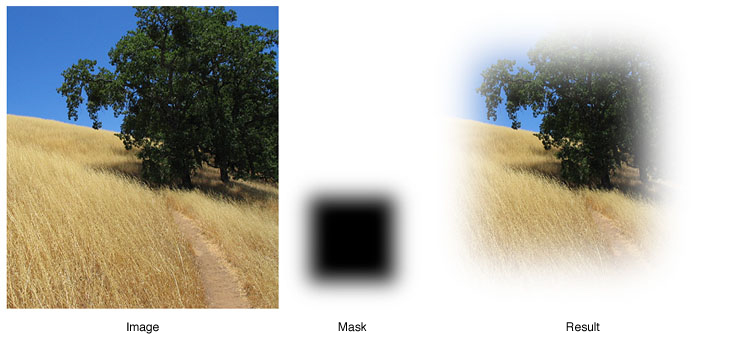
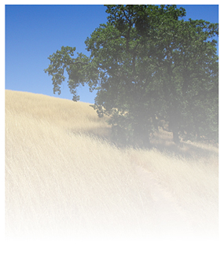

> 导航：[总目录](../../../README.md) · [documentation](../../../_indexes/documentation.md) · [Safari CSS Visual Effects Guide](Introduction.md)


[Next](Using%20Reflections.md)[Previous](Using%20Gradients.md)

# Using Masks

A mask is a two-dimensional shape that acts as an overlay on an element and clips the element visually or renders portions of the element transparent or translucent. A mask consists of an image or a gradient that contains an alpha channel; where the alpha value of the mask is 0, the underlying element is transparent, or masked out; where the alpha value is 1, the underlying element displays normally; where the alpha value is between 0 and 1, the underlying element is proportionally transparent. Only the alpha values of the mask are used; any other color values are ignored.

An element’s mask applies to its children and their descendants. The children and descendants may also have masks, in which case the masks are stacked. The transparent areas of a masked element reveal the underlying webpage contents, which may also contain masked elements; these masks too are stacked. The final image is rendered after concatenating all the masks in the stack, tiling and stretching them as specified.

When a mask is applied to an element, both the contents and background of the element are masked. A mask may be applied to the entire element or it may exclude either the border or the combined border and padding.

To apply a mask using an image, first create a `.png` or `.svg` image that contains an alpha channel. Pass the URL of this image into either the `-webkit-mask-image` property or the `-webkit-mask-box-image` property. The `-webkit-mask-image` property uses the native size of the mask image. The `-webkit-mask-box-image` property scales the mask image to meet the edges of the element.

If the image used as a mask consists of an opaque shape on a transparent background, the mask acts as a “cookie cutter” to clip an element in the shape of the mask. For example, the following snippet applies a heart-shaped mask to an image. Figure 2-1 shows the result.

```

```


__Figure 2-1__  Heart-shaped “cookie-cutter”

!

The `-webkit-mask-box-image` property takes optional arguments that work like the `-webkit-border-image` parameters. You can specify offsets into the mask image to slice it into top, right, bottom, and left images, applying the mask slices, stretched or repeated, to the edges of an element. For example, the following snippet uses a 50-pixel heart-shaped mask and adds a 50-pixel border to the image. The snippet also adds parameters to the `-webkit-mask-box-image` property, setting the slice size to the whole mask image and specifying `repeat` both horizontally and vertically. Figure 2-2 shows the result.

```

```


__Figure 2-2__  Masking a border

!!

As mentioned previously, you can mask any HTML element, and you can concatenate masks by inheritance and by stacking masked elements. For example, Listing 2-1 creates a pair of masked `div` elements, each of which contains a paragraph element. The example positions the second `div` element so that it partly overlaps the first `div` element. The paragraph elements are masked by their parent `div` elements, and the two masks are stacked. The result is shown in Figure 2-3.

__Listing 2-1__  Stacking masked elements

```
<html>
<head> <title>stacked masks</title>
</head>
<body style="background:beige;">
<div style="position:absolute; left:20px; top:20px; background:#e9e9e9; width:240;
     -webkit-mask-box-image: url(heartmask.png);">
    <p>This div element has a heart-shaped mask.This div element has a heart-shaped mask.This
 div element has a heart-shaped mask.This div element has a heart-shaped mask.This div element
 has a heart-shaped mask.This div element has a heart-shaped mask.This div element has a heart-
shaped mask.This div element has a heart-shaped mask.
    </p>
</div>
<div style="position:absolute; left:80px; top:80px; background:white; width:240;
     -webkit-mask-box-image: url(heartmask.png);">
    <p>This div element has a heart-shaped mask.This div element has a heart-shaped mask.This
 div element has a heart-shaped mask.This div element has a heart-shaped mask.This div element
 has a heart-shaped mask.This div element has a heart-shaped mask.This div element has a heart-
shaped mask.This div element has a heart-shaped mask.
    </p>
</div>
</body>
</html>
```


__Figure 2-3__  Stacking masks

!!

You can use a mask to fade an element gradually into the background by including semitransparent pixels in the mask. For example, the following snippet applies a mask image with a solid center and increasingly transparent edges to the image of a field. The `-webkit-mask-box-image` property is used, so the mask is scaled to fit the `img` element. The result is shown in Figure 2-4.

```

```


__Figure 2-4__  Applying a mask with a fuzzy border



Because gradients can be used in place of any image, a gradient can be passed as a mask. The following snippet defines a gradient that goes from opaque to transparent as a mask for an `img` element. The result is shown in Figure 2-5.

```

```


__Figure 2-5__  Result of applying a gradient mask



The example just given goes from opaque to transparent over the height of the image, but you can use different gradient parameters to achieve different effects. The following snippet creates a gradient from left to right and uses color stops to fade an image sharply at the edges, as shown in Figure 2-6. Notice that the image’s border radius works in concert with the mask.

```

```


__Figure 2-6__  Horizontal gradient mask with color stops

!

You can apply a gradient mask to any HTML element, not just images. For example, the following snippet creates a radial gradient as a mask for a `div` element containing several paragraphs of text. The result is shown in Figure 2-7.

```
<div style="background: white; padding: 20px;
     -webkit-mask-box-image: -webkit-radial-gradient(white,transparent 50%);">
```


__Figure 2-7__  Masking text with a radial gradient

!!

For more about gradients, see [Using Gradients](Using%20Gradients.md#apple-f4xwc4dqnrsv64tfmyxwi33df52wszbpkridimbqga4damzsfvbuqmjqfvjvomi).

You can use either the `-webkit-mask-image` or the `-webkit-mask-box-image` property to assign a mask to an element. The `-webkit-mask-box-image` property scales the mask to fit the element by default, while the `-webkit-mask-image` property uses the mask image’s native size.

The `-webkit-mask-box-image` property accepts optional parameters that enable it to act like a border image (for details, see [Figure 2-5](#apple-f4xwc4dqnrsv64tfmyxwi33df52wszbpkridimbqga4damzsfvbuqmjrfvjvooi)).

There is also a set of properties that you can use to modify the behavior of the `-webkit-mask-image` property, including:

- `-webkit-mask-clip`—Causes the mask to apply to the whole element, only the padding and content, or only the content. Set to `border-box` (default), `padding-box`, or `content-box`.
- `-webkit-mask-origin`—Sets the origin of the mask to the upper left corner of the element’s border, padding, or content box. Set to `border` (default), `padding`, or `content`.
- `-webkit-mask-position`—Anchors the upper-left corner of the mask at the specified offset from the origin. Accepts an x-offset and a y-offset.
- `-webkit-mask-repeat`—Controls how the mask is tiled to cover the element. Accepts an x-repeat and a y-repeat parameter. Both parameters can be set to `repeat`, `space`, `round`, or `no-repeat`. The specifics are the same as for the `background-repeat` property (see [http://www.w3.org/TR/css3-background/#the-background-repeat](http://www.w3.org/TR/css3-background/#the-background-repeat)).
- `-webkit-mask-size`—Controls how the mask is sized to cover the element. The specifics are the same as for the `background-size` property (see [http://www.w3.org/TR/css3-background/#the-background-size](http://www.w3.org/TR/css3-background/#the-background-size)).

The properties that apply to `webkit-mask-image` are analogous to the CSS3 `background` properties. See [http://www.w3.org/TR/css3-background/#backgrounds](http://www.w3.org/TR/css3-background/#backgrounds) for details.

[Next](Using%20Reflections.md)[Previous](Using%20Gradients.md)

