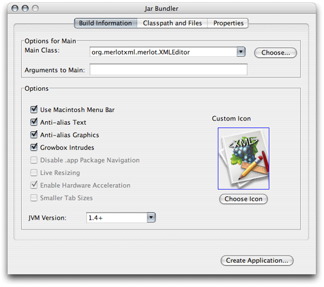
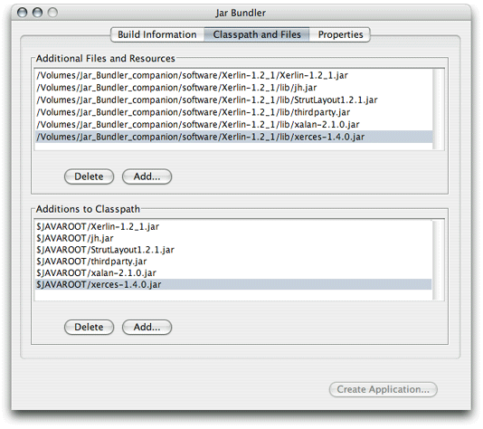
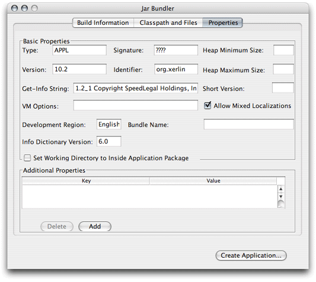

> 导航：[总目录](../../../README.md) · [documentation](../../../_indexes/documentation.md) · [Jar Bundler User Guide](Introduction%20to%20Jar%20Bundler%20User%20Guide.md)

[Next](Application%20Packaging.md)[Previous](Introduction%20to%20Jar%20Bundler%20User%20Guide.md)

# About Jar Bundler

Jar Bundler allows you to package a Java application that may be comprised of various JAR files, class files, and libraries into a package that appears to users as a single file. This makes it easy to install applications on a computer (essentially a drag operation) and to uninstall them when they are no longer needed (by moving the package to the Trash).

With Jar Bundler you create an application-bundle definition from which it generates an application bundle. The bundle contains the following elements:

- __Information property list file__. Most of the configuration information you enter in the Jar Bundler window ends up in the information property list file (`Info.plist`) file of the bundle, which is stored in its `Contents/` directory.
- __Java resources__. Jar Bundler places the application’s main JAR file as well as all its supporting classes in the `Contents/Resources/Java/` directory of the bundle.
- __Application stub__. The bundle includes a small Cocoa application, the JavaApplicationStub, which launches the appropriate Java virtual machine and starts the application. Jar Bundler places this stub in the bundle’s `Contents/MacOS/` directory.
- __Application icon__. The application’s icon is stored in the `Contents/Resources`/ directory. By default, Jar Bundler uses the `GenericJavaApp.icns` file, shown in Figure 1-1.

  __Figure 1-1__  Generic Java application icon

  

Java Dictionary Info.plist Keys provides information on Java application bundles and the keys in the information property list file. For more information on bundles, see _[Bundle Programming Guide](../../Core%20Foundation/Bundle%20Programming%20Guide/Introduction.md#apple-f4xwc4dqnrsv64tfmyxwi33df52wszbpgeydambqgezdg2i)_. For details on information property list files, see [Runtime Configuration: Information Property Lists](https://developer.apple.com/library/archive/documentation/MacOSX/Conceptual/BPRuntimeConfig/Articles/ConfigFiles.html#//apple_ref/doc/uid/20002091).

The Jar Bundler window contains three panes:

- __Build Information__. Determines the values of the main Java-related properties of an application bundle.
- __Classpath and Files__. Lists JAR files, class files, and other files the application needs to run. It also contains additional classpath entries.
- __Properties__. Determines the values of information property list file entries for the bundle, including some Java-related settings.

The sections that follow describe each of the panes’ elements.

Figure 1-2 shows the Build Information pane.

__Figure 1-2__  Build Information pane of Jar Bundler

Table 1-1 lists the pane’s elements.

__Table 1-1__  Elements of the Build Information pane

| Element | Description |
| Main Class | The main class of the application. Manifested in the `Java/MainClass` property-list entry. |
| Arguments to Main | Any arguments to the main class. Manifested in the `Java/Arguments` property-list entry. |
| Use OS X Menu Bar | Specifies whether the application uses the Macintosh menu bar or multiple window-bound menu bars. Manifested in the `Java/Properties/apple.laf.useScreenMenuBar` property-list entry. |
| Anti-alias Text | Specifies whether the application is to use Java anti-aliasing of text. Manifested in the `Java/Properties/apple.awt.textantialiasing` property-list entry. |
| Anti-alias Graphics | Specifies whether the application is to use Java anti-aliasing of graphics. Manifested in the `Java/Properties/apple.awt.antialiasing` property-list entry. |
| Growbox Intrudes | Not supported in Java 1.4.x or J2SE 5.0. Specifies whether the resize control intrudes in a window’s content. When unselected, a white bar appears at the bottom of every window with a resize control. Manifested in the `Java/Properties/com.apple.mrj.application.growbox.intrudes` property-list entry. |
| Disable .app Package Navigation | Specifies whether users can navigate the application bundle’s contents through AWT file dialogs. Manifested in the `Java/Properties/apple.awt.use-file-dialog-packages` property-list entry. |
| Live Resizing | Not selectable in Java 1.4.x or J2SE 5.0; automatically enabled in Java 1.4.2 Update 1. Specifies whether the application performs live resizing of windows. Manifested in the `Java/Properties/com.apple.mrj.application.live-resize` property-list entry. |
| Enable Hardware Acceleration | Automatically enabled in Java 1.4.x or J2SE 5.0. |
| Smaller Tab Sizes | Not supported in Java 1.4.x or J2SE 5.0. |
| Choose Icon | Allows you to choose an icon for the application. Manifested in the `CFBundleIconFile` property-list entry. In addition, Jar Bundler places the icon file you choose in the bundle’s `Contents/Resources` directory. |
| JVM Version | Specifies the version of Java the application must run on. Manifested in the `Java/JVMVersion` property-list entry. If your application requires J2SE 5.0, type `1.5+` or `1.5*` into this field. If your application requires Java 1.3.1 or Java 1.4.2, choose one of the options from the field's popup menu. For the meanings of the entries under `Java/Properties` of the information property list file, read Java Dictionary Info.plist Keys. |

Figure 1-3 shows the Classpath and Files pane.

__Figure 1-3__  Classpath and Files pane of Jar Bundler

Table 1-2 lists the pane’s elements.

__Table 1-2__  Elements of the Classpath and Files pane

| Element | Description |
| Additional Files and Resources | This list contains all the JAR files, class files, libraries, and so forth, that the application needs to run. When you add an item to this list, Jar Bundler adds a corresponding entry to the Additions to Classpath list. |
| Additions to Classpath | This list contains additional classpath entries. |

Figure 1-4 shows the Properties pane.

__Figure 1-4__  Properties pane of Jar Bundler

Table 1-3 lists the pane’s elements.

__Table 1-3__  Elements of the Properties pane

| Element | Description |
| Type | Four-letter type indicator for the bundle. Must be `APPL` for applications. Manifested in the `CFBundlePackageType` property-list entry. |
| Signature | Four-letter creator code for the application. This value is unique per application; it’s used by OS X to identify applications. Manifested in the `CFBundleSignature` property-list entry. The value `????` is the default value for this field. Apple reserves all values that use all lowercase letters. You can register your application signature with Apple at [http://developer.apple.com/datatype/](https://developer.apple.com/datatype/). |
| Version | Version number for the application. For example, `1.0 Copyright Apple Computer, Inc.` Manifested in the `CFBundleGetInfoString` property-list entry. |
| Identifier | Java package–style name (for example, `com.apple.Xcode`) used to uniquely identify the application. Manifested in the `CFBundleIdentifier` property-list entry. If you use this element, you don’t have to specify an application signature and don’t have to register the application with Apple. |
| Get-Info Strings | The string displayed as _Version_ in the Finder Get Info window. |
| VM Options | Command-line options to add to the `java` invocation. For example, `-Xfuture -Xprof`. Manifested in the `Java/VMOptions` property-list entry. |
| Development Region | Determines the native region or language of the application. For example, `GB` or `English`. |
| Bundle Name | The title of the application menu and the Dock item. Manifested in the `CFBundleName` property-list entry. |
| Info Dictionary Version | Version number of the information property list file format that Jar Bundler is to use in the bundle. Manifested in the `CFBundleInfoDictionaryVersion` property-list entry. |
| Set Working Directory to inside Application package | Determines whether the application’s initial working directory is `Contents/Resources/Java/`. Manifested in the `Java/Properties/WorkingDirectory/` property-list entry. |
| Additional Properties | Key-value pairs for properties that Jar Bundler puts under `Java/Properties` in the information property list file. Manifested in the `Java/Properties/<property_name>` property-list entry. |

[Next](Application%20Packaging.md)[Previous](Introduction%20to%20Jar%20Bundler%20User%20Guide.md)

