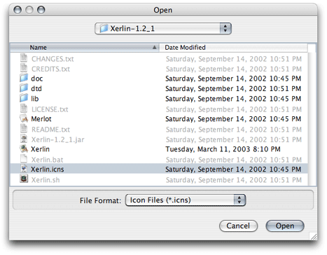
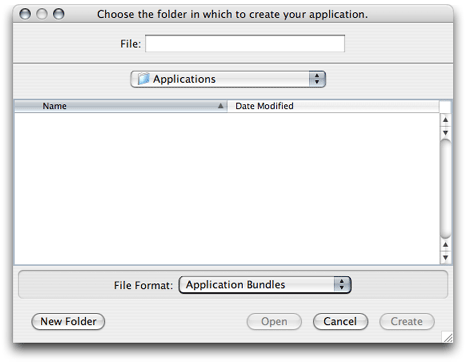
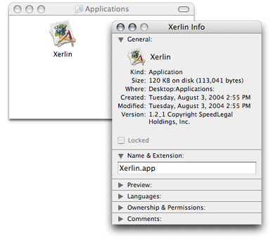

> 导航：[总目录](../../../README.md) · [documentation](../../../_indexes/documentation.md) · [Jar Bundler User Guide](Introduction%20to%20Jar%20Bundler%20User%20Guide.md)

[Next](Document%20Revision%20History.md)[Previous](About%20Jar%20Bundler.md)

# Application Packaging

An OS X application bundle should contain all the resources an application needs to run. This includes JAR files, class files, and libraries the program depends on. That is, there should be no dependencies on any resources that are not contained within the bundle.

This chapter guides you through the creation of an OS X application bundle that groups the resources of a JAR-file based Java application.

To illustrate application-bundle creation using Jar Bundler, this section shows how to package the Xerlin Java application as an OS X application package.

Follow these steps to create a package for the Xerlin application. Xerlin is an open-source project that aims at delivering a full-feature XML editor. You can get the Xerlin software from three sources:

- The Xerlin website at [http://www.xerlin.org/](http://www.xerlin.org/).
- This document’s companion files in your computer (see [Introduction to Jar Bundler User Guide](Introduction%20to%20Jar%20Bundler%20User%20Guide.md#apple-f4xwc4dqnrsv64tfmyxwi33df52wszbpkridimbqgaydqobufvbuqmrqgewviucykjcummjqge) for details).
- The OS X Java website at [http://developer.apple.com/java/](https://developer.apple.com/java/).

The example that follows assumes that the Xerlin version is 1.2_1, which is the one provided in the companion files of this document.

Follow these steps to create an OS X application package:

1. Launch Jar Bundler. It’s located in `/Developer/Applications/Java Tools/`.
2. In the Build Information pane, enter the fully qualified name of the application’s main class in the Main Class text input field.

   If necessary, look in the `MANIFEST.MF` file of the main JAR file or in the application’s documentation.

   For Xerlin, the main class is `org.merlotxml.merlot.XMLEditor`.
3. Make any necessary selections in the rest of the elements. For more on what each element means, read Build Information Pane.

   For example, to make the Xerlin menu bar look familiar to an OS X user, select Use Macintosh Menu Bar. Also choose the `Xerlin.icns` file as the application’s icon.

   

   Figure 2-1 shows the Build Information pane for the Xerlin application bundle.

   __Figure 2-1__  Build Information pane configured to package Xerlin

   
4. Add the code resources needed by the application. These include JAR files, class files, and libraries:

   1. Click the Classpath and Files tab.
   2. In the Classpath and Files pane, click Add.
   3. Navigate to the folder that contains the main JAR file, select the file, and click Choose.
   4. Repeat for any other required code resources.

   Figure 2-2 shows the Classpath and Files pane for the Xerlin application bundle. For more information on the Classpath and Files pane, read Classpath and Files Pane.

   __Figure 2-2__  Classpath and Files pane of Jar Bundler configured to package Xerlin

   
5. Configure the packages’s properties.

   1. Click the Properties tab.
   2. Enter the appropriate information in the Properties pane.

      For example, enter `1.2_1` in the Version text field, `org.xerlin` in the Identifier text field, and `1.2_1 Copyright SpeedLegal Holdings, Inc.` in the Get-Info String text field, as shown in Figure 2-3.

      For more on the elements in the Properties pane, read Properties Pane.

      __Figure 2-3__  Properties pane of Jar Bundler configured to package Xerlin

      
6. Create the application bundle.

   1. Click Create Application.
   2. In the dialog that appears, navigate to the location in which you want the application bundle to reside, enter a name for the package in the Name text field, and click Create.

      

When done, you get a package that looks an behaves like a native Mac app, as shown in Figure 2-4.

__Figure 2-4__  Finder window showing the Xerlin application package.

If the Finder doesn’t show the icon you chose in Jar Bundler, try one of the following remedies (if the first one doesn’t work, try the second one, and so on):

1. Relaunch the Finder.

   Press Option–Command-Esc, select Finder in the application list, and click Relaunch.
2. Log out and log in.
3. Delete `~/Library/Caches/com.apple.LaunchServices.UserCache.csstore`, log out, and log in.
4. Delete `/Library/Caches/com.apple.LaunchServices.LocalCache.csstore`, and restart your computer.

[Next](Document%20Revision%20History.md)[Previous](About%20Jar%20Bundler.md)

