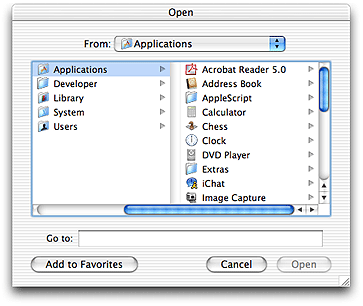
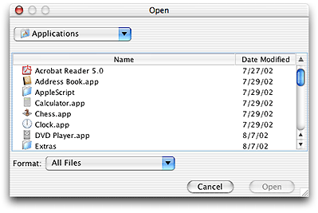
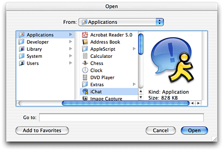
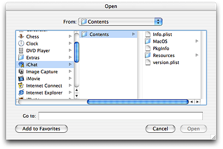

> 导航：[总目录](../../../README.md) · [documentation](../../../_indexes/documentation.md) · [Java 1.3.1 Development for Mac OS X](About%20This%20Book.md)


[Next](Using%20Native%20Features%20of%20Mac%20OS%20X%20in%20Java%20Applications.md)[Previous](The%20Development%20Environment.md)

# Cross-Platform Practices for Great Native Behavior

If you are developing Java applications that you plan to deploy on multiple platforms, there are some things that you should keep in mind to support Mac OS X as well as the other platforms. This chapter discusses some basic points to consider and small changes you can make to your Java code to help it run well on any platform, but are especially important to consider to make your application look like a Mac OS X application. In general, these changes do not require you to use any APIs or properties specific to Mac OS X. This chapter mainly discusses user interface issues.

Before discussing cross-platform coding practices, it is important to lay the foundation of what is available in Mac OS X. The default interface to the operating system is called Aqua. Although other interfaces can be displayed in Mac OS X, there is great benefit in usability by adhering closely to the native interface. To that end, Apple has worked hard to make your Java applications appear and behave as much like native applications as possible. Taking advantage of the basic look of the Aqua user interface is very simple. It requires you to do nothing other than write clean Java code. In Mac OS X, the default pluggable look and feel (PLAF) for Swing applications, `com.apple.mrj.swing.MacLookAndFeel`, gives an Aqua appearance to your Swing applications. So if you don’t explicitly change your code to invoke another look and feel, Swing applications look like native applications by default.

In general it is good practice to avoid explicitly setting the PLAF in your Java code.This makes your application fit in much better on any platform. In the case of Mac OS X, this is especially true. If do you need to change the look and feel of your application to test it for different platforms, it is better to set the `swing.defaultlaf` Java property for your application at runtime by passing in `-Dswing.defaultlaf=`_yourLookAndFeel_ when launching the application. For development purposes, you may want to temporarily change Mac OS X’s default look and feel. You can do this by modifying the `swing.properties` file in `/Library/Java/Home/lib`.

You don’t need to use AWT components for the native look of Aqua because Swing provides it. You can enjoy further benefits in performance and predictable graphics behavior by not mixing the heavyweight and lightweight components of AWT and Aqua.

Behavior is part of a user interface as well as appearance. Automatic adoption of the Aqua appearance is a first step, but there are many details that still are in your hands when trying to provide the best Aqua experience. _Inside Mac OS X: Aqua Human Interface Guidelines_ is the definitive guide for how applications should appear and behave in Mac OS X and why they should behave that way. If you have a decision to make that is not specified anywhere else, that document is a great source of answers to user interface questions. If you find areas where your pure Java applications do not take advantage of these guidelines, please let Apple know.

There are numerous details that go into designing a first-class application on any platform. Although it may be impossible to build a perfect application, there are a few topics that are hot issues to users of a particular platform. As a Java developer, a few areas to keep in mind as you design are discussed in the following sections.

The complicated nestings and interrelations of containers and components in Swing interfaces can sometimes make it difficult to remember that the development platform is not always the deployment platform. The different look and feel designs available can provide widely variable appearances and behaviors. This section brings to the foreground some details that while helping your application to work well on any platform, are especially important in Mac OS X.

Explicitly setting the x and y coordinates is dangerous when you consider the multiple platforms and look and feel designs that the application may run under. The results of a “well-designed” application in one environment may be disastrous in another, with components painting on top of each other and running off the edge of a container, among other things. It is generally unsafe to assume that placing buttons and controls at explicit coordinates is portable. Use the AWT layout managers to solve this problem. The layout managers use abstracted location constants and determine the exact placement of these controls for a specific environment. Layout managers take into account the sizes of each individual component while maintaining their placement relative to one another within the container.

In general, do not set component sizes explicitly. Each look and feel has font styles and sizes. These font sizes will affect the required size of the component containing the text. Moving explicitly sized components to a new look and feel with a larger font size can cause problems. The safest means of keeping your components a proper, minimal size in a portable manner is to simply use `yourComponent.setSize(yourComponent.getPreferredSize())`.

Most layout managers and containers respect a components preferred size, usually making this call unnecessary. As your interface becomes more complicated however, you may find this call handy for containers with many child components.

Because a given look and feel tends to have universal coloring and styling for most, if not all of its controls, developers may be tempted to create custom components that match the look and feel of standard user interface classes. This is perfectly legal, but adds maintenance and portability costs. It is easy to set an explicit color that you think works well with the current look and feel. Changing to a different look and feel though may surprise you with an occasional non-standard component. To ensure that your custom control matches standard components, query the `UIManager` class for the desired colors. An example of this is a custom Window object that contains some standard lightweight components but wants to paint its uncovered background to match that of the rest of the applications containers and windows. To do this, you can call

```
myPanel.setBackground(UIManager.getColor("window"))
```

This returns the color appropriate for the current look and feel. The other advantage of using such standard methods is that they provide more specialized backgrounds that are not easily reconstructed, such as the striped background used for Aqua containers and windows.

Window coordinates and insets are compatible with the JDK. In a nutshell: Window bounds refer to the outside of the window’s frame; the coordinates of the window put (0,0) at the top left of the title bar (not at the top left of the content region as in MRJ on Mac OS 9). The `getInsets` method returns the amount by which content needs to be inset in the window to avoid the window border. This should affect only applications that are doing precision positioning of windows (especially full-screen windows), or those that bypass layout managers to do their own hard-coded component positioning.

Windows behave differently in Mac OS X than they do on other platforms. For example an application can be open without having any windows. Windows minimize to the Dock, and windows with variable content always have scroll bars. This section highlights the windows details you should be aware of and discusses how to deal with window behavior in Mac OS X.

The multiple document interface (MDI) model of the `javax.swing.JDesktopPane` class can provide a confusing user experience in Mac OS X. Windows minimized in a JDesktopPane move around as the JDesktopPane changes size. In the JDesktopPane, windows minimize to the bottom of the pane while independent windows minimize to the Dock. Furthermore, JDesktopPane restricts users from moving windows where they want. They are forced to deal with two different scopes of windows, those within the JDesktopPane and the JDesktopPane itself. Normally Mac OS X users interact with applications through numerous free-floating, independent windows and a single menu bar at the top of the screen. Users can intersperse these windows with other application windows (from the same application or other applications) anywhere they want in their view, which includes the entire desktop. Users are not constrained visually to one area of the screen when using a particular application. When building cross-platform applications with multiple windows, it is generally a good idea to avoid using `javax.swing.JDesktopPane`s.

There are times when there is not a simple way to solve window-related problems other than using a JDesktopPane. For example, you might have a Java application that requires a floating toolbar-like entity, referred to in Swing as an internal utility window”, that needs to always remain in the foreground regardless of which document is active. Although Java currently has no means of providing this other than by using JDesktopPane, for new development you may want to consider designing a more platform-neutral user interface with a single dynamic container, similar to applications like JBuilder or LimeWire. If you are bringing an existing MDI-based application to the Macintosh from another platform and do not want to refactor the code, Mac OS X does support the MDI as specified in the J2SE 1.3.1 specification.

In Mac OS X, scrollable document windows have a scroll bar regardless of whether or not there is enough content in the window to require scrolling. The scroller itself is present only when the size of the content exceeds the viewable area of the window. This prevents users from perceiving that the viewable area is changing size. By default, a Swing JFrame has no scroll bars, regardless of how it is resized. The easiest way to provide scrollable content in a frame is to place your frame’s components inside a JScrollPane, which can then be added to the parent frame. In the default behavior of JScrollPane however, scrollbars only appear if they content in the pane exceeds the size of the window. If you are using a JScrollPane in your application, you can set the JScrollPane’s scroll bar policy to always display the scroll bars, even when the content is smaller than the viewable size of the window. An example is shown in [Listing 5-1](#apple-f4xwc4dqnrsv64tfmyxwi33df52wszbpkridgmbqgaydombyfvkfawcsivddcmrt).

__Listing 5-1__  Setting JScrollBar policies to be more like Aqua

```
JScrollPane jsp = new JScrollPane();
jsp.setVerticalScrollBarPolicy(JScrollPane.VERTICAL_SCROLLBAR_ALWAYS);
jsp.setHorizontalScrollBarPolicy(JScrollPane.HORIZONTAL_SCROLLBAR_ALWAYS);
```

With this setting the scroll bars are solid—with scrollers appearing when the contents are larger than the viewable area. You might want to do this conditionally based on the host platform since the default policy, `AS_NEEDED`, may more closely resemble other platforms native behavior.

The `java.awt.FileDialog` and `javax.swing.JFileChooser` classes are the two main mechanisms to create quick and easy access to the file system for Java applications. Although each has its advantages, `java.awt.FileDialog` provides considerable benefit in making your application behave more like a native application. The difference between the two is especially evident in Mac OS X as [Figure 5-1](#apple-f4xwc4dqnrsv64tfmyxwi33df52wszbpkridgmbqgaydombyfvbegskkifeeosa) and [Figure 5-2](#apple-f4xwc4dqnrsv64tfmyxwi33df52wszbpkridgmbqgaydombyfvbegskejbduqri) show.

__Figure 5-1__  `java.awt.FileDialog`



__Figure 5-2__  `javax.swing.jFileChooser`



The column-view style of browsing is adopted automatically by the AWT FileDialog while the Swing JFileChooser uses a navigation style different from that of native Mac OS X applications. Unless you need the functional advantages of JFileChooser you probably want to use `java.awt.FileDialog`. Since the FileDialog is modal and draws on top of other visible components, which is not the usual consequence of mixing Swing and AWT components.

As described in [Application Bundles](Deployment%20Options.md#apple-f4xwc4dqnrsv64tfmyxwi33df52wszbpkridgmbqgaydombwfvbegskkijceuqq), a native Mac OS X application is packaged as a bundle, which appears in the Finder as a single object but is actually a directory that contains all the resources of an application. Packages are also bundles that can be viewed as single objects or as directories. Java applications using JFileChooser or FileDialog recognize bundles as directories and allow inappropriate navigation. If you are building an application for developers, you might want to display the actual, on-disk contents of the directory, but if you are building an application for an end user, you do not want to display the bundle contents. Apple provides properties for both dialog classes that allow you the option of controlling how application and package bundles are displayed.

`java.awt.FileDialog` can be set to display application and package bundles as non navigable using the `com.apple.macos.use-file-dialog-packages` runtime system property. For example, to turn off navigation, run your application as follows:

```
java -Dcom.apple.macos.use-file-dialog-packages=true yourApplication
```

The resulting file dialog resembles [Figure 5-3](#apple-f4xwc4dqnrsv64tfmyxwi33df52wszbpkridgmbqgaydombyfvbegskeincuoqq). Notice that you cannot navigate into the application bundle.

__Figure 5-3__  Application displayed as an atomic object



The default setting of `com.apple.macos.use-file-dialog-packages`, `false`, leaves the contents of application and package bundles navigable by users as seen in [Figure 5-4](#apple-f4xwc4dqnrsv64tfmyxwi33df52wszbpkridgmbqgaydombyfvbegskgirdeusa).

__Figure 5-4__  Application displayed as a directory



You can set this behavior in your application bundle using the technique described in [Setting the Java Runtime Properties for an Application Bundle](Deployment%20Options.md#apple-f4xwc4dqnrsv64tfmyxwi33df52wszbpkridgmbqgaydombwfvkfawcsivddcmbv). This allows you to alter your AWT dialogs for Mac OS X without any code change. If your application requires unique instances to behave differently, you can set the property to `true` or `false` at runtime as necessary using `System.setProperty`.

The `FileDialog.setFile` method does not work as expected in Mac OS X, so you can not specify which directory the dialog opens in.

`javax.swing.JFileChooser` offers more flexibility than `java.awt.FileDialog`. If you are already using it in your code, there are two properties that let you specify whether or not application and package bundles reveal their contents. Modifying JFileChooser’s behavior does require you to modify your source code. The properties `JFileChooser.appBundleIsTraversable` and `JFileChooser.packageIsTraversable` take values of `never` or `always`. If you want to hide the contents of both types of bundles, set `JFileChooser.packageIsTraversable` to `never`. If you want to hide the contents of application bundles but show the contents of package bundles, set `JFileChooser.appBundleIsTraversable` to `never`. Generally, you should set `JFileChooser.packageIsTraversable` to `never`.

You can set these properties globally for all instances of JFileChooser in your application with the `UIManager.put` method. You can set them on a per-instance basis via the `putClientProperty` instance method inherited from `javax.swing.JComponent`.

One difficulty in cross-platform Java user interface development is dealing with menus. The appearance of menu items tends to vary between platforms, as does how you handle meta keys described in menus. Unfortunately, many Java programmers write their applications with only the current development platform in mind and explicitly specify the appropriate modifier or trigger in their code. This poses problems in porting applications from platform to platform, as well as risking misinterpretation of what the platform’s appropriate triggers are. Elegant and portable solutions to creating the appropriate actions on any given platform do exist and are covered in the following sections.

Keyboard shortcuts for invoking menu actions are often set with an explicit `javax.swing.KeyStroke` specification. This becomes complicated when moving to a new platform with a different modifier key because new KeyStrokes need to be conditionally created based on the current client platform. The solution to this problem is to use `java.awt.Toolkit.getMenuShortcutKeyMask` to ask the system for the appropriate key rather than defining it yourself.

When calling this method, the current platform’s Toolkit implementation returns the proper mask for you. This single call checks for the current platform and then guesses which key is correct. In the case of adding a Copy item to a menu, this means that you can replace the complication of [Listing 5-2](#apple-f4xwc4dqnrsv64tfmyxwi33df52wszbpkridgmbqgaydombyfvkfawcsivddcmrr) with the simplicity of [Listing 5-3](#apple-f4xwc4dqnrsv64tfmyxwi33df52wszbpkridgmbqgaydombyfvbegskfjjbuusi).

__Listing 5-2__  Explicitly setting KeyStrokes based on the host platform

```
JMenuItem jmi = new JMenuItem("Copy");
    String vers = System.getProperty("os.name").toLowerCase();
    if (s.indexOf("windows") != -1) {
       jmi.setAccelerator(KeyStroke.getKeyStroke(KeyEvent.VK_C, Event.CTRL_MASK));
    } else if (s.indexOf("mac") != -1) {
       jmi.setAccelerator(KeyStroke.getKeyStroke(KeyEvent.VK_C, Event.META_MASK));
    }
```


__Listing 5-3__  Using `getMenuShortcutKeyMask` to set meta keys

```
JMenuItem jmi = new JMenuItem("Copy");
jmi.setAccelerator(KeyStroke.getKeyStroke(KeyEvent.VK_C,
    Toolkit.getDefaultToolkit().getMenuShortcutKeyMask()));
```

Most common actions in Mac OS X have a keyboard equivalent that uses the Command key, previously known as the Apple key, as a modifier. There may be additional modifier keys like Shift, Option, or Control, but the Command key is the primary key that alerts an application that what follows is a command, not regular input. Not all platforms provided this consistency in user interface behavior.

Different keys may prompt an application to begin listening for commands. The code presented in [Listing 5-3](#apple-f4xwc4dqnrsv64tfmyxwi33df52wszbpkridgmbqgaydombyfvbegskfjjbuusi) provides only one generalized mask, so you still may need to make conditional settings depending on your intended host platform. The fact that Mac OS X keyboard equivalents use Command makes your life a bit easier if you’re bringing your application to Mac OS X. To make sure you are not overriding any of the keyboard commands Macintosh users have been accustomed to for over twenty years, see _Inside Mac OS X: Aqua Human Interface Guidelines_ for the definitive list of the most common and reserved shortcuts.

Some platforms support menu item mnemonics or single-key shortcuts to menus and their contents using the Alt key. Mnemonics for these shortcuts are highlighted with a single underlined letter in the menu or item’s name. This is a foreign concept to Mac OS X users. Although it is supported as a part of Java, the suggested way to handle the identification of keyboard shortcuts in Mac OS X is by clearly identifying all of the required keys. For an example, look at the File menu in the Finder. When writing your Java applications, it is suggested that you apply Swing mnemonics in a platform-sensitive manner in your code if possible, such as using a single `setMnemonics()` method that is conditionally called when constructing your interface.

Like mnemonics, menu item icons are also available and functional via Swing in Mac OS X. They are not a standard part of the Aqua interface, although some applications do display them—most notably the Finder in the Go menu. You may want to consider applying these icons conditionally based on platform. Whether or not you choose to display menu item icons in Mac OS X, you should be aware that Aqua does specify a specific set of special characters to be used in menus. See the information on using special characters in menus in _Inside Mac OS X: Aqua Human Interface Guidelines_

There is no problem supporting contextual menus in your Java applications on Mac OS X—they are fully supported. There are slight differences in terminology though. Java calls them popup menus while Aqua calls them contextual menus. More important is how they are triggered on different platforms. On Mac OS X, they are triggered by a Control-click. (By default, the second button of a two-button mouse maps to Control-click in Mac OS X.) In Windows, the right mouse button is the standard trigger for contextual menus.

These are two very different cases, which could result in fragmented and conditional code. One important aspect of both triggers is shared, the mouse click. To ensure that your program is interpreting the proper contextual menu trigger, it is again a good idea to ask the AWT to do the interpreting for you with `java.awt.event.MouseEvent.isPopupTrigger`.

The method is defined in `java.awt.event.MouseEvent` because you need to activate the contextual menu through a `java.awt.event.MouseListener` on a given component when a mouse event on that component is detected. The important thing to determine is how and when to detect the proper event. In Mac OS X, the pop up trigger is set on `MOUSE_PRESSED`. In Windows it is set on `MOUSE_RELEASED`. For portability, both cases should be considered as shown in [Listing 5-4](#apple-f4xwc4dqnrsv64tfmyxwi33df52wszbpkridgmbqgaydombyfvkfawcsivddcmrs).

__Listing 5-4__  Using `isPopupTrigger` to detect contextual menu activation

```
JLabel label = new JLabel("I have a pop up menu!");

label.addMouseListener(new MouseAdapter(){
    public void mousePressed(MouseEvent e) {
       evaluatePopup(e);
    }

    public void mouseReleased(MouseEvent e) {
       evaluatePopup(e);
    }

    private void evaluatePopup(MouseEvent e) {
       if (e.isPopupTrigger()) {
          // show the pop up menu...
       }
    }
});
```


Two notes on event handling may be useful to your in your development and deployment of applications in Mac OS X:

- Many of the Swing and AWT components are implemented with native code from the Carbon API of Mac OS X. Although this should not affect your Java code, it might be important information in debugging applications that do not appear to behave correctly, especially in regard to the runtime handling of events. If you do find an issue where the event handling is not as specified by the Java 2 specification, please file a bug as explained in [Filing and Tracking Bugs](About%20This%20Book.md#apple-f4xwc4dqnrsv64tfmyxwi33df52wszbpkridgmbqgaydombufvbegskdijcegqy).
- Although mouse-down events from additional buttons on multi button USB mice are delivered correctly, mouse-up and mouse-drag events involving the additional buttons may not be delivered with the correct modifiers. There may be ambiguity between various button masks and meta key masks. Use the utility functions as a workaround (for example, `java.awt.event.InputEvent.isMetaDown`) instead of accessing the modifiers directly.

[Next](Using%20Native%20Features%20of%20Mac%20OS%20X%20in%20Java%20Applications.md)[Previous](The%20Development%20Environment.md)

