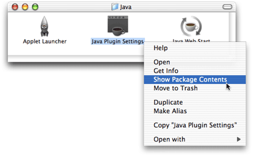
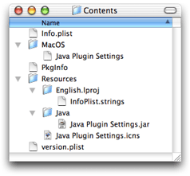
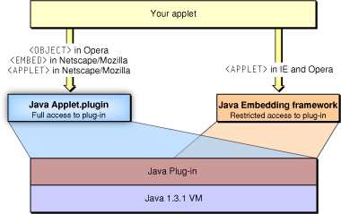

> 导航：[总目录](../../../README.md) · [documentation](../../../_indexes/documentation.md) · [Java 1.3.1 Development for Mac OS X](About%20This%20Book.md)


[Next](The%20Development%20Environment.md)[Previous](How%20Java%20Is%20Implemented%20in%20Mac%20OS%20X.md)

# Deployment Options

There are basically four different distribution methods for Java applications in Mac OS X. You can distribute your applications as a JAR file, a Mac OS X Java application, a Java Web Start application, or an applet. They each have different benefits as outlined in the following sections.

The most basic distribution method for your Java applications is as a JAR file. It is the simplest way for you as a developer since it requires very little, if any, changes from the JAR files you distribute on other platforms. It does though, have drawbacks for the end user. The major drawback being that Swing applications look out of place with their odd application names in the menu bar and generic Java icons in the dock. Considering this alone, deploying your application from a JAR file is not recommended on Mac OS X if your application has a graphical interface and will be run by general users.

If you do choose to deploy your application from a JAR file on Mac OS X, it is important to remember to include in your JAR file a valid manifest file that declares the class that contains the `main` method. Without one, users will have to resort to launching your application from the command line. This will seem very outdated for users whose platform has let them launch an application simply by double-clicking it for almost twenty years!

If you do not have the class with `main` declared in your JAR file a simple way to fix this is as follows:

1. Unarchive your JAR file into a working directory with some variant of `jar xvf` _myjar_`.jar`
2. In the `META-INF` directory is a `MANIFEST.MF` file. Copy that file and add a line that begins with `Main-Class:` followed by the name of your `main` class, for example, `Main-Class: HelloWorld`.
3. Archive you files again but this time use the `-m` option to `jar` and designate the relative path to the manifest file you just modified, for example, `jar cmf` _YourModifiedManifestFile_`.txt`_YourJARFile_`.jar``*.class`

This is a very basic example that does not take into account more advanced uses of the `jar` program. More detailed information on adding a manifest to a JAR file can be found in the `jar(1)` man page. From Project Builder, choose “Open man page” from the Help menu. (In Terminal, type `man jar` .)

Native Mac OS X applications include more than just the executable code. They also include images, sounds, icons, localizable strings, and other resources that the application may use. They might even include executables for different versions of the operating system. The applications that are visible in the Finder are actually directories that hold the executable code and the relevant resources. This directory structure is hidden from view in the Finder by the `.app` suffix and a specific bit that is set for that directory. Such a directory is often referred to as a Mac OS X application bundle. More information on Mac OS X application bundles is available in _Inside Mac OS X: System Overview_. Since the J2SE platform includes ways to deal with many of these other things, you might not need the full functionality of a Mac OS X application. There are, however, some things that you gain by wrapping your pure Java JAR file into an application bundle, and it is very simple to do.

Overall, it provides a better user experience for your users, helping your application to integrate more closely with native Mac OS X applications. Specific benefits include these:

- Users can simply double-click the application to launch it.
- If you add an appropriate icon, it shows the application icon in the Dock, clearly identifying your application. Otherwise, a default Java icon appears in the Dock.
- It lets you set specific system properties that can make your Java application hard to distinguish from a native application.
- You can bind specific document types to your application. This will allow users to launch your application by double clicking a document associated with it.

MRJAppBuilder, discussed in more detail in [MRJAppBuilder](The%20Development%20Environment.md#apple-f4xwc4dqnrsv64tfmyxwi33df52wszbpkridgmbqgaydombxfvkfawcsivddcmbw) and [MRJAppBuilder Tutorial](MRJAppBuilder%20Tutorial.md#apple-f4xwc4dqnrsv64tfmyxwi33df52wszbpkridgmbqgaydomjrfvkfawcsivddcmbr), helps you easily bundle your existing Java application as a Mac OS X Java application.

What users see as an application in Mac OS X is actually a bundle of resources to a developer. To get a glimpse inside an application on Mac OS X, you can either explore the directory of resources from the Terminal or from the Finder. Although by default the Finder displays applications as a single object, you can view the true makeup of any application in the Finder. To see what is contained inside a standard application bundle, Control-click any application and choose Show Package Contents as in [Figure 3-1](#apple-f4xwc4dqnrsv64tfmyxwi33df52wszbpkridgmbqgaydombwfvbecssfivcegra).

__Figure 3-1__  Show application bundle contents



You should see something like [Figure 3-2](#apple-f4xwc4dqnrsv64tfmyxwi33df52wszbpkridgmbqgaydombwfvbegskeirbeqqi).

__Figure 3-2__  Contents of a Java application bundle



Notice some important details:

- Mac OS X expects to see an `Info.plist` file in the Contents folder. In the case of a Java application, this contains some important information that Mac OS X uses to set up the Java runtime environment for your application. More information about these property lists is in [Property List Attributes for Java Applications](#apple-f4xwc4dqnrsv64tfmyxwi33df52wszbpkridgmbqgaydombwfvbegskjjjcegsi)
- If you have an icon that should be displayed in the Mac OS X Finder, put it in the Resources folder. There is a Mac OS X–specific file type designated by the `.icns` suffix, but most common image types work. To make an icon (`.icns`) file from your images, use the Icon Composer application installed in `/Developer/Applications` with the Mac OS X Developer Tools.
- Your Java code, in either JAR or `.class` files is put into `Resources/Java`. This is launched by a native executable file in the MacOS folder.

There are other files in the application bundle, but the specific ones mentioned are the ones you probably care most about as a Java developer. You can learn more about the other files an application bundle in _Inside Mac OS X: System Overview_.

Mac OS X makes extensive use of XML files for various system settings. These are called property lists and have a `.plist` extension. The `Info.plist` file in the Contents folder of a Mac OS X application is one such property list. If you build your Java application in Project Builder or MRJAppBuilder, this file is automatically generated for you. Even if it is built for you, there may be times when you may want to modify it. Since it is a simple XML file, you can modify it with any text editor. Its settings will be read the next time you launch your application from the Finder. An example property list for a Java application is shown in [Listing 3-1](#apple-f4xwc4dqnrsv64tfmyxwi33df52wszbpkridgmbqgaydombwfvbegskkifbekrq).

__Listing 3-1__  `Info.plist` file for simple Java application


```xml
<?xml version="1.0" encoding="UTF-8"?>
<!DOCTYPE plist PUBLIC "-//Apple Computer//DTD PLIST 1.0//EN" "http://www.apple.com/DTDs/PropertyList-1.0.dtd">
<plist version="1.0">
<dict>
    <key>CFBundleDevelopmentRegion</key>
    <string>English</string>
    <key>CFBundleExecutable</key>
    <string>SampleApp</string>
    <key>CFBundleIconFile</key>
    <string>SampleApp.icns</string>
    <key>CFBundleInfoDictionaryVersion</key>
    <string>6.0</string>
    <key>CFBundlePackageType</key>
    <string>APPL</string>
    <key>CFBundleSignature</key>
    <string>????</string>
    <key>CFBundleVersion</key>
    <string>0.1</string>
    <key>Java</key>
    <dict>
        <key>ClassPath</key>
        <string>$JAVAROOT/SampleApp.jar</string>
        <key>MainClass</key>
        <string>SampleApp</string>
        <key>Properties</key>
        <dict>
            <key>com.apple.macos.useScreenMenuBar</key>
            <string>true</string>
            <key>com.apple.mrj.application.apple.menu.about.name</key>
            <string>SampleApp</string>
        </dict>
    </dict>
</dict>
</plist>
```

The property list is divided into hierarchical dictionaries. The top-level dictionary contains the information that the operating system needs to properly launch the application. The keys in this section are prefixed by CFBundle and are usually self explanatory. Where they are not, see the documentation in _Mac OS X Developer Release Notes: Information Property List_ and _Inside Mac OS X: System Overview_.

At the end of the CFBundle keys, a `Java` key designates the beginning of a Java dictionary. The two top-level keys in the Java dictionary are required in the property list of a Java application bundle. They are defined as follows:

- `MainClass`, corresponds to the `com.apple.mrj.application.main` system property. The string value for this key should specify the fully qualified class name for the class containing you application’s `main` method.
- `ClassPath`, corresponds to the `com.apple.mrj.application.classpath` system property. The string value for this key should specify the fully qualified path to the directories where your class files are or to your JAR files.

Aside from those two required keys, there are some optional keys that you can add here. They are described in [Mac OS X Application Properties](Mac%20OS%20X%20Java%20System%20Properties.md#apple-f4xwc4dqnrsv64tfmyxwi33df52wszbpkridgmbqgaydomjsfvkfawcsivddcmbr).

The `Properties` sub dictionary of the Java dictionary contains keys that you pass to your Java applications from the command line with the `-D` option. For example, if you want to run this same application from the command line, you pass in the two keys, `com.apple.macos.usescreenmenubar` and `com.apple.mrj.application.apple.menu.about.name` as follows:

`java -Dcom.apple.macos.useScreenMenuBar=true -Dcom.apple.mrj.application.apple.menu.about.name=SampleApp SampleApp`

The keys in the `Properties` dictionary include both Mac OS X–specific options as well as general Java options. Mac OS X–specific keys and values that you may add to this dictionary of the property list are specified in [Mac OS X Application Properties](Mac%20OS%20X%20Java%20System%20Properties.md#apple-f4xwc4dqnrsv64tfmyxwi33df52wszbpkridgmbqgaydomjsfvkfawcsivddcmbr).

If you examine an application built with MRJAppBuilder, you might notice that some of the keys seem to be missing from the `Properties` dictionary. MRJAppBuilder uses a legacy style non-XML property list named MRJApp.properties in the `Contents/Resources` folder of an application bundle. This property list contains the same flags and system properties that you would normally find in Properties sub-dictionary (of the Java dictionary) in an Info.plist. In general, this list behaves like the Info.plist with a few exceptions:

- Arguments to `main()` may not contain embedded spaces. You can work around this by passing in such arguments to the Info.plist, though.
- The `APP_PACKAGE` property is not expanded when used in `com.apple.mrj.application` parameters.
- Additional command-line arguments designated in `MRJApp.properties` are ignored if the application is launched from the command line.

Having seen the structure of the Mac OS X information property list should help you to debug your application and modify existing applications, but how do you generate that list in the first place? You could build application bundles by hand in the Terminal, write the `Info.plist` file yourself in a text editor, and designate the file as an application with the `SetFile` command-line tool. There are two much simpler solutions: Project Builder and MRJAppBuilder.

If you build a Java AWT or Swing application from one of Project Builder’s templates, Project Builder automatically generates a default `Info.plist` file. You may either modify this by hand or directly from Project Builder as outlined in [Modifying the Application Parameters](Project%20Builder%20Tutorial.md#apple-f4xwc4dqnrsv64tfmyxwi33df52wszbpkridgmbqgaydomjqfvkfawcsivddcmby). If you want to turn your preexisting Java application into a Mac OS X Java Application, MRJAppBuilder is the tool for you. It allows you to take existing `.class` or JAR files and wrap the information around them that Mac OS X expects to find when launching a native application, including setting up the runtime properties of your Java application. A simple tutorial for MRJAppBuilder is available in [MRJAppBuilder Tutorial](MRJAppBuilder%20Tutorial.md#apple-f4xwc4dqnrsv64tfmyxwi33df52wszbpkridgmbqgaydomjrfvkfawcsivddcmbr). [Project Builder Tutorial](Project%20Builder%20Tutorial.md#apple-f4xwc4dqnrsv64tfmyxwi33df52wszbpkridgmbqgaydomjqfvkfawcsivddcmbr) provides a tutorial on using Project Builder to build a Mac OS X native application.

When you begin a new Java Swing or Java AWT application project in Project Builder, the `ClassPath` and `MainClass` properties are generated automatically. The `ClassPath` property is updated as you add and remove `.class` and `.jar` files. If you change the name of your `main` class or want to append values for any of the other properties available in [Mac OS X Java System Properties](Mac%20OS%20X%20Java%20System%20Properties.md#apple-f4xwc4dqnrsv64tfmyxwi33df52wszbpkridgmbqgaydomjsfvkfami), you may do so by editing the target settings. Choose Edit Active Target from the Project menu. In the resulting window (or pane depending your settings) you can modify the settings in a more user-friendly manner than by editing the property list by hand. Some of the most common properties are set with a checkbox. Other properties are set in the Additional Properties and Additional VM Options fields.

The Java Properties pane of MRJAppBuilder allows you to set Java runtime properties. The main and classpath fields are not editable. These values are derived from your settings in the Application pane. A default set of properties is already provided but it is simple to add more:

1. Click the Add button.
2. In the property field, put the name of the system property as specified in [Mac OS X Java System Properties](Mac%20OS%20X%20Java%20System%20Properties.md#apple-f4xwc4dqnrsv64tfmyxwi33df52wszbpkridgmbqgaydomjsfvkfami).
3. Fill in the appropriate value for that property.
4. The Description field can be left blank; its information will not be saved.

When you build your application, you will see the specified settings in the `Info.plist` and `MRJApp.properties` files. 

Java Web Start provides yet another way you can distribute your Java applications on Mac OS X. Although not a standard part of Java 1.3.1, Mac OS X does provide Java Web Start with the default installation of the operating system. This is an implementation of the Java Network Launching Protocol & API (JNLP) Specification, v1.0.1. This means that if you choose to build JNLP-aware applications, Mac OS X users do not need to do anything to take advantage of them. They have access to your applications through the Web browser and the Java Web Start application (installed in `/Applications/Utilities/Java`).

By default, if a user launches a Java Web Start application more than twice from the same URL, they are prompted to save the application as a standard Mac OS X application, as shown in [Figure 3-3](#apple-f4xwc4dqnrsv64tfmyxwi33df52wszbpkridgmbqgaydombwfvbegskjinbuuqi). They are also prompted on where they want to save your application. The application is still a Java Web Start application, with all the benefits that offer, but it now easier for users to run your application since they do not have to launch a Web browser or the Java Web Start application.

__Figure 3-3__  Java Web Start integration


The desktop integration setting can be changed in the Preferences of the Java Web Start application.

There are only a few details to be aware of in how the Mac OS X implementation of Java Web Start differs from the Windows and Solaris versions:

- It does not support downloading of additional Java Runtime Environments (JREs). Mac OS X includes J2SE 1.3.1, so if your application specifically requires JRE 1.2 or 1.4, it will not work. Specifications for versions numbers that can expand to include 1.3.1 will work though, for example _1.2+_ or _1.3+_.
- It is s not necessary to set up proxy information explicitly in the Web Start application. Java Web Start in Mac OS X automatically picks up your proxy settings from the Network preference pane.
- Java Web Start caches its data in the user’s `/Library/Caches/Java Web Start` directory.

Applets have always been one of the most common deployment methods for Java. Mac OS X provides a robust environment for applet development through the use of Sun’s Java Plug-in. Applets use the same 1.3.1 VM that Java applications use. Their behavior should be similar to the behavior of Sun’s Java Plug-in. Of course as with all applet deployment, the host platform’s support for Java is only part of the story. How Web browsers interpret your HTML code to launch the applet is also key. This section gives you some relevant information for deploying your applets in Mac OS X.

Mac OS X includes some specific system properties that you might want to take advantage of in your applets. Except for the `com.apple.macos.useScreenMenuBar`, unsigned applets cannot access these properties. If you want to use any of the properties discussed in [Mac OS X Java System Properties](Mac%20OS%20X%20Java%20System%20Properties.md#apple-f4xwc4dqnrsv64tfmyxwi33df52wszbpkridgmbqgaydomjsfvkfami), you can grant permission to access them by adding a line to your system-wide `java.policy` file located at `/Library/Java/Home/lib/security/`.

The line should be of the form:

`java.util.PropertyPermission` _systemPropertyName_, `read`;

In previous versions of Mac OS X, applications that displayed applets, such as Web browsers, used the Mac OS X Java Embedding framework to embed the Java applets in the native application. This framework uses Sun’s reference `appletviewer` class not Sun’s Java Plug-in architecture. When this framework is used to display an applet, users miss out on the additional features of Sun’s Java Plug-in. Additionally applet behavior is dependent on how the browser maker uses the Java Embedding framework.

In Mac OS X version 10.2, browser developers may easily display applets with the Java Applet Plug-in architecture (`Java Applet.plugin`) without writing browser–specific code to use the Java Embedding framework. Mac OS X’s Java Applet Plug-in takes full advantage of Sun’s Java Plug-in. What this means to you is that if you want to deploy your Java applets on Mac OS X is that you should modify your HTML code so that your applets are be run through the new Java Applet Plug-in architecture and not the Java Embedding framework.

Although Sun encourages the use of the `<APPLET>` tag for all applets, this does not always give you the recommended behavior. For example, in some browsers, `<APPLET>` does not give you the full functionality of Sun’s Java Plug-in, while the `<OBJECT>` tag, which is mapped to the mime type `application/x-java-applet`, does. This is illustrated in [Figure 3-4](#apple-f4xwc4dqnrsv64tfmyxwi33df52wszbpkridgmbqgaydombwfvbecssfijcuiqq).

__Figure 3-4__  Effect of HTML tags in Mac OS X 10.2



[Figure 3-4](#apple-f4xwc4dqnrsv64tfmyxwi33df52wszbpkridgmbqgaydombwfvbecssfijcuiqq) shows the effect of the `<APPLET>` tag in comparison to the `<EMBED>` tag. You can see that the suggested `<APPLET>` tag has the desired results only in Mozilla/Netscape. To work around the different interpretations of the `<APPLET>` tag, you have a few options. You can just use the tag listed in [Listing 3-1](#apple-f4xwc4dqnrsv64tfmyxwi33df52wszbpkridgmbqgaydombwfvbegskkifbekrq) that invokes the Java Plug-in or you can use Sun’s HTML converter to get HTML that works in any browser. The converter is available at [http://java.sun.com/products/plugin/1.3/docs/htmlconv.html](http://java.sun.com/products/plugin/1.3/docs/htmlconv.html). Without changing anything, you should see the same applet behavior that you saw in previous versions of Mac OS X.

__Table 3-1__  Interpretation of HTML tags in common Mac OS X browsers

| Browser | <APPLET> | <OBJECT> | <EMBED> |
| Internet Explorer 5.2.x (default browser in Mac OS X 10.2) | Java Embedding framework |  |  |
| Netscape/Mozilla | Treated as an `<EMBED>` tag, which by default maps to the `application/x-java-applet` mime type. |  | Java Plug-in |
| OmniWeb |  |  | Java Plug-in |
| Opera |  | Java Plug-in |  |
| Chimera | Treated as an `<EMBED>` tag. |  | Java Plug-in |

Using the Java Applet Plug-in provides a better experience for people that use your applets. Changes have been made in the areas discussed below.

You can now designate that you want to store certain JAR files for repeated use. If you developed for Mac OS 9, notice that this is similar to JAR caching on MRJ 2.2.x. The cache is stored in the users home folder in `Library/Caches/Java`. To take advantage of JAR file caching, you may need to modify your HTML with the following tags:

**`<PARAM NAME = "cache_option" VALUE="plugin">`**
: Turns on caching.

**`<PARAM NAME = "cache_archive" VALUE="`_a_`.jar`, _b_`.jar`, _c_`.jar``">`**
: This is an optional tag used to specify the list of JAR files you want to cache.

JAR files in `cache_archive` are searched first, then the JAR files designated with the `ARCHIVE` tag are used

**`<PARAM NAME = "cache_version" VALUE="`_1.2.0.1_, _2.1.1.2_, _1.1.2.7_`">`**
: This is an optional tag used to specify the version number of the JAR files designated with `cache_archive`. Each value corresponds to the respective JAR files designated with `cache_archive`. If the version value is newer than what is cached, the JAR file in the cache is updated. If this tag is omitted, the plug-in checks the server to see if there is a newer version available and caches that version.

JAR file caching in Mac OS X conforms to the Java 1.3.1_03 standard. It does not conform to the Java 1.4 standard. This means that there are certain things you should keep in mind:

- JAR files specified with the `ARCHIVE` tag are not cached.
- The `cache_version_ex` parameter is not supported.
- There is no JAR file indexing support.
- For better forward compatibility, it is suggested that you use the `cache_archive` and `cache_version` parameters.

If a user decides to always trust your JAR file, a certificate is stored in the user’s home folder in `Library/Preferences/Java Plugin certificates 1.3.1.`

Users can view their JAR file certificates in the Java Plugin Settings application.

The Java Console provides a way to log and trace the behavior of your applet while it is running. It can give you interactive thread information and allow you to force garbage collection. The Java Console is the display medium for `System.out``System.err` for applets. The Java Console is visible if you select the option Show Java Console in the Java Plugin Settings utility.

The Java Plugin Settings application allows users to fine-tune how applets behave in Mac OS X. It behaves on Mac OS X as it does on other platforms. It is important to recognize that settings you make while testing may not be the settings that users have on their computers. These settings are stored per user in `~/Library/Preferences/com.apple.java.plugin.properties131`.

[Next](The%20Development%20Environment.md)[Previous](How%20Java%20Is%20Implemented%20in%20Mac%20OS%20X.md)

