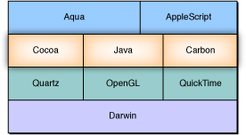
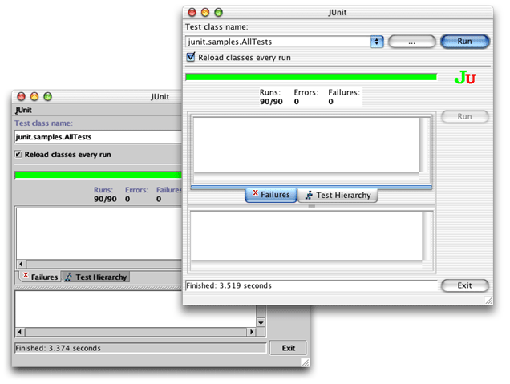
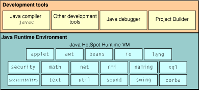

> 导航：[总目录](../../../README.md) · [documentation](../../../_indexes/documentation.md) · [Java 1.3.1 Development for Mac OS X](About%20This%20Book.md)


[Next](Deployment%20Options.md)[Previous](About%20This%20Book.md)

# How Java Is Implemented in Mac OS X

Java is included in every copy of Mac OS X and Mac OS X Server. Mac OS X provides full support for Java 2 Platform, Standard Edition (J2SE), and support for much of Java 2 Platform, Enterprise Edition (J2EE).

Because of the emphasis Apple has placed on integrating Java into the operating system, there are many benefits to developing and deploying Java applications on Mac OS X rather than other platforms. In Mac OS X, Java is not an add-on feature, but an integral part of the operating system. This means that you do not need to deal with installing and configuring the Java Runtime Environment (JRE) or the Java Development Kit (JDK) as you, or the end users of your application, might need to on other platforms. In addition to the Java pieces you are already familiar with, Apple provides extensions and enhancements to these standard Java APIs as well as Java access to some of Apple’s other technologies. With Java on Mac OS X, Apple provides all that you expect in a standard Java 2 implementation while providing the extra value that makes it better on the Macintosh for you as a developer and for your customers.

At the core of Mac OS X lives a BSD-style UNIX-based operating system called Darwin. On top of that, Apple has built a collection of fundamental technologies for presenting graphics and sound to users far beyond what has been traditionally available in a UNIX-based operating system. Further collections of tools, event loops, and functions/methods yield high-level APIs for application developers. These include:

- Carbon for traditional Macintosh developers
- Cocoa, an object-oriented application development environment
- Java, an object-oriented environment for building cross-platform applications

[Figure 2-1](#apple-f4xwc4dqnrsv64tfmyxwi33df52wszbpkridgmbqgaydombvfvbecssejfaucry) depicts the conceptual layout of the Mac OS X operating system. A more extensive analysis of the system as a whole is available in _Inside Mac OS X: System Overview_.

__Figure 2-1__  Architecture of Mac OS X



One of the most obvious advantages of the integration of Java into the operating system can be seen in the user interface of any Swing application. Java on Mac OS X includes a default Aqua look and feel for your Swing applications. You can see from [Figure 2-2](#apple-f4xwc4dqnrsv64tfmyxwi33df52wszbpkridgmbqgaydombvfvbegskgjjeeori) how this can really make your Java applications look great compared to the default look and feel, Metal.

__Figure 2-2__  Metal and Aqua look and feel on Mac OS X



Because Mac OS X is a UNIX-based operating system, you have access to BSD tools and technologies useful in software development. You are working with the foundation of a robust, powerful operating system that gives you preemptive multitasking and protected memory.

In Mac OS X you can also take advantage of the operating system’s other fundamental features. For example, in Mac OS X you can take advantage of the cross-platform QuickTime API through QuickTime for Java. Apple also provides Java access to the Core Audio framework of Mac OS X, OpenGL, Quartz, the Mac OS X font implementation (with support for OpenType, PostScript Type I and TrueType fonts), the Mac OS X spelling and speech frameworks, and the Foundation and Application Kit frameworks of Cocoa.

Mac OS X ships with the Java 2 Platform, Standard Edition (J2SE) 1.3.1. Full support of Java 2 means that there is first-class support for Swing, the Collections framework, the Accessibility API, and other APIs from Sun. Support for applets that require Java 2 is also provided. You will also find implementations of the Java2D graphics architecture and the policy-based security model. In addition to the standard parts of J2SE, Mac OS X includes Java Web Start and the security frameworks as well as some packages that were formerly available as part of the Java 2 Enterprise Edition (J2EE) like Remote Method Invocation (RMI) over IIOP, the Java Naming and Directory Interface (JNDI), and the Java Database Connectivity (JDBC) model.

The Java implementation is installed in `/System/Library/Frameworks/JavaVM.framework`. This includes the virtual machine, the command-line tools, the runtime classes, and the API documentation. Additional tools and documentation are included with the free Mac OS X Developer Tools and are installed in `/Developer/Tools` and `/Developer/Documentation`, respectively.

The basic command-line tools are installed in `/System/Library/Frameworks/JavaVM.framework/Commands` with links from `/usr/bin` so that your scripts and tools work on Mac OS X like they would on other platforms.

For the most part, the Java 2 Platform Standard Edition version 1.3.1 works on Mac OS X like it does on other platforms. The standard packages you expect to find are all included in every installation of Mac OS X, as are the basic development tools. With the Mac OS X Developer Tools installed, you have a complete Java Development environment as illustrated in

__Figure 2-3__  Mac OS X as a Java development platform



Although the `java.sound` packages are included with Java in Mac OS X, you cannot currently use them for sound input. You can work around this by using Mac OS X native audio system. You can find more information about the audio architecture of Mac OS X at [http://developer.apple.com/audio](https://developer.apple.com/audio). Specific options for providing audio functionality to your Java application in Mac OS X include these:

- Use QuickTime for Java-based services. This works on Mac OS 9, Mac OS X, and Windows.
- Use the Core Audio framework. This API is for Mac OS X only and provides Java classes to access the underlying Core Audio platform services for audio and MIDI in Mac OS X.
- Use JNI to provide a native binding to the Core Audio framework directly.

The Mac OS X implementation of the Java2D API is based on Apple’s Quartz graphics engine. The Quartz graphics system improves drawing quality over other platforms’ Java 2D implementation. Because Java on Mac OS X draws its graphics with Quartz, you might notice that images drawn do not match the Sun Java 2D implementation pixel for pixel, especially when anti-aliasing is on. This is because Quartz’s anti-aliasing algorithms for both line art and text are different from Sun’s default implementations, so the rendered pixels do not match exactly. Since anti-aliasing is implemented through the operating system itself, it does not hinder graphics performance. Turning it off for your Java application will probably not affect the speed up your code.

In Mac OS X, windows are double-buffered, this includes Java windows. Java on Mac OS X attempts to flush the buffer to the screen often enough to have good drawing behavior without compromising performance. If for some reason you need to force window buffers to be flushed immediately, you may do so with `Toolkit.sync`.

Mac OS X provides hardware graphics acceleration for your Java Swing graphics on computers whose video cards have 16 MB or more of video RAM. If enabled, this technology passes Swing and Java 2D graphics calls directly to the video card. This can result in significant speed increases for your graphics-intensive Java applications. See [Modifying the Default Settings for Hardware Graphics Acceleration](Using%20Native%20Features%20of%20Mac%20OS%20X%20in%20Java%20Applications.md#apple-f4xwc4dqnrsv64tfmyxwi33df52wszbpkridgmbqgaydombzfvkfawcsivddcmrq) for information on changing the default settings of the hardware graphics acceleration.

Anti-aliasing is on by default for text and graphics, but it can be turned off using the properties described in [Mac OS X–Specific Properties](Mac%20OS%20X%20Java%20System%20Properties.md#apple-f4xwc4dqnrsv64tfmyxwi33df52wszbpkridgmbqgaydomjsfvbecsshirdeqqq), or by calling `java.awt.Graphics.setRenderingHint` within your Java application. With anti-aliasing on, drawing shapes over each other may cause different results than in Java 1.1. For example, drawing a white line on top of a black line does not completely erase the line; the compositing rules leave some gray pixels around the edges. Also, drawing text multiple times in the same place causes the partially-covered pixels along the edges to get darker and darker, making the text look smudged.

The Java platform for Mac OS X is based on the Java HotSpot client virtual machine (VM) from the Sun JDK 1.3.1_03 technology train. Because the VM is based on the HotSpot VM, synching is a low overhead operation. The VM maps Java threads directly to Mach threads. The Darwin kernel (XNU) schedules these Mach threads as it would schedule any other threads in the system giving you true preemptive multitasking.

One unique aspect of the Mac OS X Java implementation is its use of a technology to enable shared generation of class files. A single shared Java archive for the Java classes in the system is generated once. This archive is regenerated when you update Java. Since each Java application does not need to generate an independent archive at runtime you save both memory and CPU cycles.

The `-server` option to Java is different in Mac OS X than on other platforms in that it doesn’t invoke a different VM. The Java VM is the same Java HotSpot Client VM technology. Using the `-server` flag however, does change a few default settings to values more appropriate to a server type program. For example, a different shared archive generation is used. On Mac OS X Server `-server` is the default. On Mac OS X, `-client` is the default.

Specific guidelines for interacting with the VM are in the following sections.

To get the most out of your Java applications, you can take advantage of the performance and profiling tools available to you in Mac OS X. Built-in profiling support is provided in flags you can pass in to the VM at runtime. For basic CPU monitoring and profiling, use the `-Xrunhprof` flag as follows:

- `java -Xrunhprof:cpu=sample`_yourApplication_
- `java -Xrunhprof:monitor=y`_yourApplication_

For allocation profiling use the `-Xaprof` flag. To profile a single thread use `-Xprof`.

Third-party tools like Borland’s Optimizeit and Hewlet Packard’s `HPjmeter` are also valuable tools.

The Mac OS X Java VM includes some nonstandard VM options that you should be aware of. Since these are nonstandard (`-X`) options, you should keep in mind that these are not guaranteed to be available on other VM implementations, and could change from release to release. These options are set by passing a `-X`_optionname_ flag to the Java runtime (`java`). You can also see a list of available options by typing `java -X` in a Terminal window. VM options that have important details to note about them are outlined in [Table 2-1](#apple-f4xwc4dqnrsv64tfmyxwi33df52wszbpkridgmbqgaydombvfvbecssfijbecsq).

__Table 2-1__  HotSpot VM options

| Property | Notes |
| `-Xdock:name=`_applicationName_ | Overrides the default application name displayed in the Dock and the menu bar. |
| `-Xincgc` | This option is disabled in Mac OS X version 10.2. |
| `-Xms`_size_ | Sets the initial Java heap size. The maximum heap limit is about 2 GB. |
| `-Xms`_size_ | Sets the initial Java heap size. The maximum heap limit is about 2 GB. |
| `-Xmx`_size_ | Sets maximum Java heap size. The maximum heap limit is about 2 GB. |
| `-XX:+UseTLE` | Enables Apple’s thread local eden (TLE) allocation. This allows for more scalable allocation for heavily threaded applications, greatly increasing allocation performance. It is on by default on multiprocessor computers. |
| `-XX:+PrintJavaStackAtFatalState` | Enable Java backtraces to be generated when a crash occurs in native code. Note that this is not guaranteed to work all the time since the crash may destroy some critical data structures. |

Java Native Interface (JNI) in Mac OS X works as you would expect it to on other platforms with a couple of important details to remember.

JNI libraries are named with the library name used in the `System.loadLibrary` method of your Java code prefixed by `lib` and suffixed with `.jnilib`. For example, `System.loadLibrary("hello")` loads the library named `libhello.jnilib`.

In building your JNI libraries, you have two options. You can either build them as bundles or as dynamic shared libraries (sometimes called dylibs). If you are concerned about maintaining backward compatibility with previous versions of Java on Mac OS X, you should build as a bundle; otherwise you will probably want to build as a dylib. Dylibs have the added value of being able to be prebound which speeds up the launch time of your application. They are also a little simpler to build if you have multiple libraries to link together.

To build as a dynamic shared library, use the `-dynamiclib` flag. Since your `javah` produced `.h` file includes `jni.h`, you need to make sure you include its source directory. Putting all of that together looks something like this:

`cc -c -I/System/Library/Frameworks/JavaVM.framework/Headers`_sourceFile.c_

`cc -dynamiclib -o libhello.jnilib`_sourceFile.o_`-framework JavaVM`

To build a JNI library as a bundle use the `-bundle` flag:

`cc -bundle -I/System/Library/Frameworks/JavaVM.framework/Headers -o libName.jnilib -framework JavaVM`_sourceFiles_

For example, if the files `hello.c` and `hola.c` contain the implementations of the native methods to be built into a dynamic shared JNI library, and it needs to be called with `System.loadLibrary`(“hello”), you would build the resultant library, `libhello.jnilib`, with this code:

```
cc -c -I/System/Library/Frameworks/JavaVM.framework/Headers hola.c
cc -c -I/System/Library/Frameworks/JavaVM.framework/Headers hello.c
cc -dynamiclib -o libhello.jnilib hola.o hello.o -framework JavaVM
```

Often JNI libraries have interdependencies. For example assume the following:

- `libA.jnilib` contains a function `foo()`
- `libB.jnilib` needs to link against `libA.jnilib` to make use of `foo()`

This is not a problem if you build your JNI libraries as dynamic shared libraries, but if you build them as bundles this does not work since symbols are private to a bundle. If you need to use bundles for backward compatibility, one solution is to put the common functions into a separate dynamic shared library and link that to the bundle. For example:

1. Compile the JNI library:

   `cc -g -I/System/Library/Frameworks/JavaVM.framework/Headers -c -o myJNILib.o myJNILib.c`
2. Compile the file with the common functions:

   `cc -g -I/System/Library/Frameworks/JavaVM.framework/Headers -c -o CommonFunctions.o CommonFunctions.c`
3. Build the object file for your common functions as a dynamic shared library:

   `cc -dynamiclib -o libCommonFunctions.dylib CommonFunctions.o`
4. Build your JNI library as a bundle and link against the dynamic shared library with your common functions in it:

   `cc -bundle -lCommonFunctions -o libMyJNILib.jnilib myJNILib.o`

You can also access native code libraries through JDirect. See [JDirect](Using%20Native%20Features%20of%20Mac%20OS%20X%20in%20Java%20Applications.md#apple-f4xwc4dqnrsv64tfmyxwi33df52wszbpkridgmbqgaydombzfvkfawcsivddcmjz) for more information on using this Mac–specific technology.

Although the Aqua user interface may belie it, behind the scenes Mac OS X is a UNIX-based operating system. The things you expect to be there are indeed there. At times, however, pieces might be in a slightly different spot than you expect. To make your experience on Mac OS X as smooth as possible, this section looks at where you might expect to find things on Mac OS X and also addresses some of the issues of environment variables.

Many Java applications require you to identify Java’s home directory on your system (`JAVAHOME`), especially during installation. On Mac OS X this should be set to `/Library/Java/Home`. You might notice that this is actually a symbolic link to `/System/Library/Frameworks/JavaVM.framework/Home`. This is the real Java home directory, but since it is owned by the system you should not modify it, nor should you expect that users will be able to modify it on their system. This directory will be modified by software updates from Apple so any changes you make there are volatile. The `/Library/Java/Home` symlink is provided as an abstraction so that you can be sure that your applications will continue to work when Apple updates either the Java VM or the operating system itself. `/Library/Java/Home` allows access to the `/bin` subdirectory where command-line tools like `java` and `javac` can be found. These tools are also accessible through `/usr/bin`.

Java can be extended by adding custom `.jar`, `.zip`, and `.class` files, as well as native JNI libraries, into an extensions directory. On some platforms this is designated by the `java.ext.dir` directory. In Mac OS X, put your extensions in `/Library/Java/Extensions`. Java automatically looks in that directory as it is starting up a VM.

Putting extensions in `/Library/Java/Extensions` loads those extensions for any user on that particular computer. If you want to limit which users can use certain extensions, you could put them in the user’s home directory in `~/Library/Java/Extensions`. You may need to make that directory if it does not already exist. It is important to note that extensions in the user’s directory are loaded first, so if you have duplicate JAR files in your user’s `Library/Java/Extensions` directory and the system’s `/Library/Java/Extensions` directory, those in the latter directory may overload classes in the former.

Some applications store their preferences in the application directory; others store their preferences where the host platform stores its preferences. In Mac OS X, user preferences for an application are stored in the `~/Library/Preferences` directory. System-level preferences, or preferences that should effect all users should be stored in `/Library/Preferences`. The standard preference format in Mac OS X is an XML property list, with a title of the form of a reverse URL followed by the `.plist` extension, for example `com.apple.ProjectBulder.plist`. This directory can be reached from Java code by appending the string `Library/Preferences` to the `user.home` System property.

In Mac OS X, you treat the classpath the way you would in any BSD shell. You can use `setenv classpath`_newClasspathAddition_ to add to the classpath for the duration of the current session for that particular Terminal window. You still have to explicitly add a reference to this variable when compiling by typing `javac -classpath %CLASSPATH`_filename_. You can determine the current value of `CLASSPATH` with the command `echo $CLASSPATH`. By default no `CLASSPATH` variable is explicitly set for the shell, although Java knows to look in the various `Library/Java/Extensions` folder for developer-supplied JAR files.

You can avoid retyping the `setenv classpath` command for each Terminal session by automatically adding paths to your classpath shell startup script (`.cshrc` or `.tcshrc` for the default `tcsh` shell). For example, find or create `~/.cshrc`. That file should have a line that looks similar to `setenv CLASSPATH ".:/Users/username/Projects/HelloWorld/:/Users/username/Projects/HelloWorld/HelloWorld.jar"`. In this example, the current directory, the specific directory of a particular project, and a JAR file in that directory are included in the classpath.

When you launch a Java application from the command line, standard output goes to the Terminal window. When you launch a Java application by double clicking it, your Java output is displayed in the Console application in `/Applications/Utilities`. Applets that use the Java Plug-in may display output in the Java Console.

[Next](Deployment%20Options.md)[Previous](About%20This%20Book.md)

